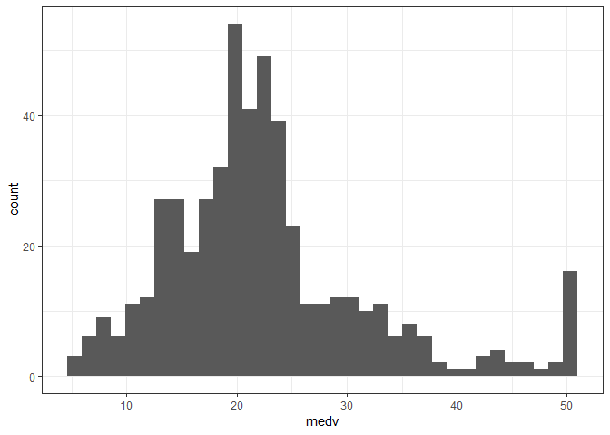
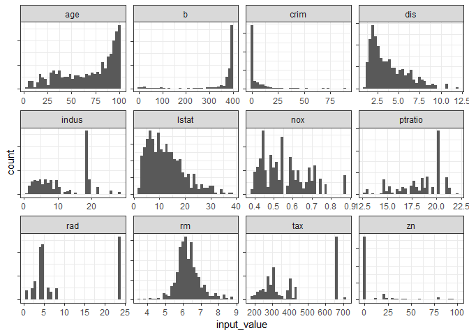
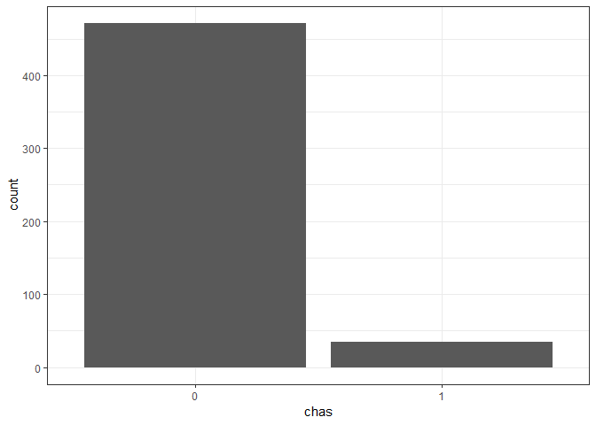
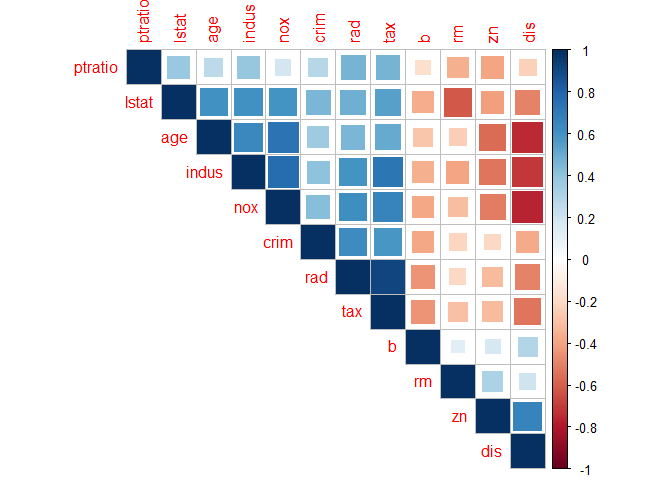
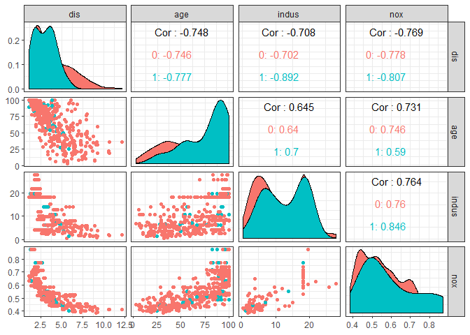
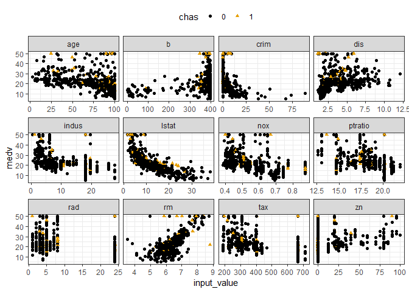
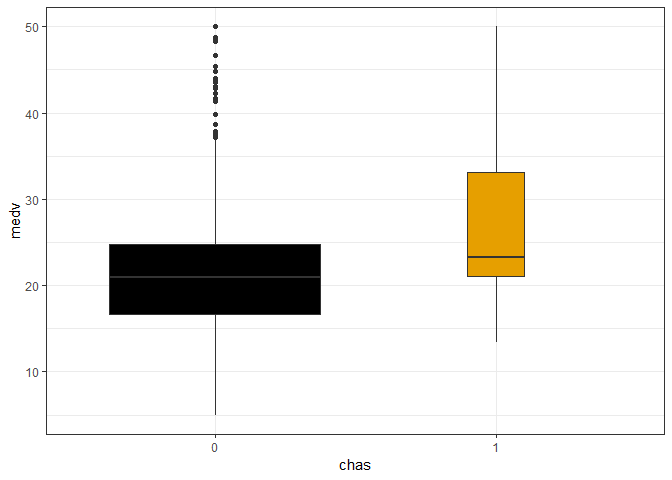
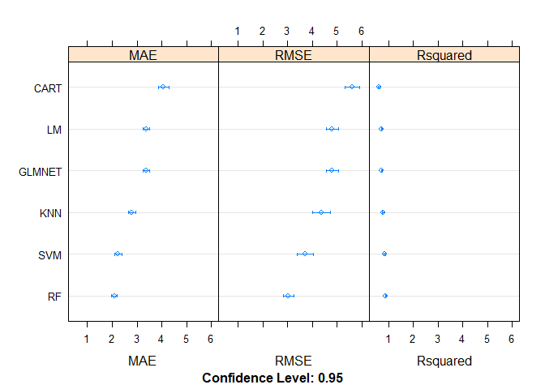
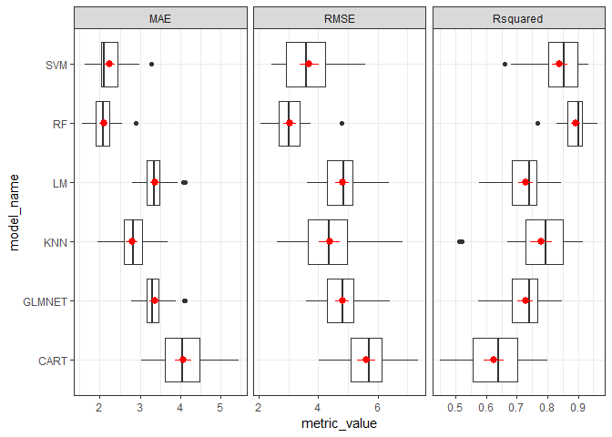
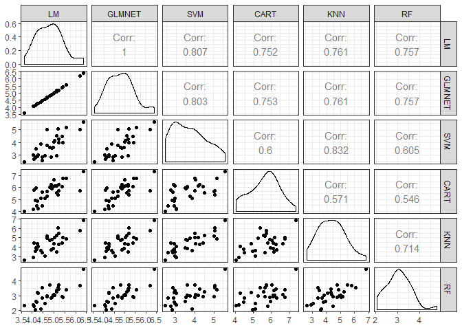

INFSCI 2595: Lecture 01
================
Dr. Joseph P. Yurko
August 28, 2019

Introduction
------------

Demonstrate the key steps of the Supervised Learning workflow discussed in Lecture 01. Build models to predict the home price in Boston using the classic `BostonHousing` dataset from the `mlbench` package. `mlbench` contains many useful example datasets for practicing and benchmarking machine learning algorithms.

Dataset EDA
-----------

Read in the dataset.

``` r
library(dplyr)
library(ggplot2)

data("BostonHousing", package = "mlbench")
```

Print the variable (column) names to the screen.

``` r
BostonHousing %>% names()
```

    ##  [1] "crim"    "zn"      "indus"   "chas"    "nox"     "rm"      "age"    
    ##  [8] "dis"     "rad"     "tax"     "ptratio" "b"       "lstat"   "medv"

Get a "glimpse" of the dataset. Show the dimensions (number of rows - observations - and columns - variables), as well as the data type associated with each variable, and print the first few rows to the screen.

``` r
BostonHousing %>% 
  tbl_df() %>% 
  glimpse()
```

    ## Observations: 506
    ## Variables: 14
    ## $ crim    <dbl> 0.00632, 0.02731, 0.02729, 0.03237, 0.06905, 0.02985, ...
    ## $ zn      <dbl> 18.0, 0.0, 0.0, 0.0, 0.0, 0.0, 12.5, 12.5, 12.5, 12.5,...
    ## $ indus   <dbl> 2.31, 7.07, 7.07, 2.18, 2.18, 2.18, 7.87, 7.87, 7.87, ...
    ## $ chas    <fct> 0, 0, 0, 0, 0, 0, 0, 0, 0, 0, 0, 0, 0, 0, 0, 0, 0, 0, ...
    ## $ nox     <dbl> 0.538, 0.469, 0.469, 0.458, 0.458, 0.458, 0.524, 0.524...
    ## $ rm      <dbl> 6.575, 6.421, 7.185, 6.998, 7.147, 6.430, 6.012, 6.172...
    ## $ age     <dbl> 65.2, 78.9, 61.1, 45.8, 54.2, 58.7, 66.6, 96.1, 100.0,...
    ## $ dis     <dbl> 4.0900, 4.9671, 4.9671, 6.0622, 6.0622, 6.0622, 5.5605...
    ## $ rad     <dbl> 1, 2, 2, 3, 3, 3, 5, 5, 5, 5, 5, 5, 5, 4, 4, 4, 4, 4, ...
    ## $ tax     <dbl> 296, 242, 242, 222, 222, 222, 311, 311, 311, 311, 311,...
    ## $ ptratio <dbl> 15.3, 17.8, 17.8, 18.7, 18.7, 18.7, 15.2, 15.2, 15.2, ...
    ## $ b       <dbl> 396.90, 396.90, 392.83, 394.63, 396.90, 394.12, 395.60...
    ## $ lstat   <dbl> 4.98, 9.14, 4.03, 2.94, 5.33, 5.21, 12.43, 19.15, 29.9...
    ## $ medv    <dbl> 24.0, 21.6, 34.7, 33.4, 36.2, 28.7, 22.9, 27.1, 16.5, ...

We want to predict the median house price based on factors associated with suburbs of Boston. The response variable is `medv` is a numeric value, so we will be performing a **regression** task. Of the 13 input variables, only `chas` is a factor which is `R`s designation for a categorical variable. Summarize all of the variables below, but note that since `chas` is a factor the `summary()` function displays the counts of the unique values or `levels` instead of numeric summary statistics, such as the mean and quantiles.

``` r
BostonHousing %>% summary()
```

    ##       crim                zn             indus       chas   
    ##  Min.   : 0.00632   Min.   :  0.00   Min.   : 0.46   0:471  
    ##  1st Qu.: 0.08204   1st Qu.:  0.00   1st Qu.: 5.19   1: 35  
    ##  Median : 0.25651   Median :  0.00   Median : 9.69          
    ##  Mean   : 3.61352   Mean   : 11.36   Mean   :11.14          
    ##  3rd Qu.: 3.67708   3rd Qu.: 12.50   3rd Qu.:18.10          
    ##  Max.   :88.97620   Max.   :100.00   Max.   :27.74          
    ##       nox               rm             age              dis        
    ##  Min.   :0.3850   Min.   :3.561   Min.   :  2.90   Min.   : 1.130  
    ##  1st Qu.:0.4490   1st Qu.:5.886   1st Qu.: 45.02   1st Qu.: 2.100  
    ##  Median :0.5380   Median :6.208   Median : 77.50   Median : 3.207  
    ##  Mean   :0.5547   Mean   :6.285   Mean   : 68.57   Mean   : 3.795  
    ##  3rd Qu.:0.6240   3rd Qu.:6.623   3rd Qu.: 94.08   3rd Qu.: 5.188  
    ##  Max.   :0.8710   Max.   :8.780   Max.   :100.00   Max.   :12.127  
    ##       rad              tax           ptratio            b         
    ##  Min.   : 1.000   Min.   :187.0   Min.   :12.60   Min.   :  0.32  
    ##  1st Qu.: 4.000   1st Qu.:279.0   1st Qu.:17.40   1st Qu.:375.38  
    ##  Median : 5.000   Median :330.0   Median :19.05   Median :391.44  
    ##  Mean   : 9.549   Mean   :408.2   Mean   :18.46   Mean   :356.67  
    ##  3rd Qu.:24.000   3rd Qu.:666.0   3rd Qu.:20.20   3rd Qu.:396.23  
    ##  Max.   :24.000   Max.   :711.0   Max.   :22.00   Max.   :396.90  
    ##      lstat            medv      
    ##  Min.   : 1.73   Min.   : 5.00  
    ##  1st Qu.: 6.95   1st Qu.:17.02  
    ##  Median :11.36   Median :21.20  
    ##  Mean   :12.65   Mean   :22.53  
    ##  3rd Qu.:16.95   3rd Qu.:25.00  
    ##  Max.   :37.97   Max.   :50.00

### Visualizations

Look at the distribution of the response variable, `medv`, regardless of the values of the inputs.

``` r
BostonHousing %>% 
  ggplot(mapping = aes(x = medv)) +
  geom_histogram(bins = 35) +
  theme_bw()
```



Next, look at the (marginal) distributions for each of the numeric inputs.

``` r
BostonHousing %>% 
  tbl_df() %>% 
  purrr::keep(~is.numeric(.)) %>% 
  select(-medv) %>% 
  tibble::rowid_to_column("rowid") %>% 
  tidyr::gather(key = "input_name", value = "input_value", -rowid) %>% 
  ggplot(mapping = aes(x = input_value)) +
  geom_histogram(bins = 35) +
  facet_wrap(~input_name, scales = "free") +
  theme_bw() +
  theme(axis.text.y = element_blank())
```



We have already seen the counts per `level` of the categorical variable `chas`, but show a bar chart which makes the imbalance between the two levels very clear.

``` r
BostonHousing %>% 
  tbl_df() %>% 
  ggplot(mapping = aes(x = chas)) +
  geom_bar() +
  theme_bw()
```



Visualize the correlation between each of the numeric inputs with a correlation plot that has been rearranged such that all variables with high positive correlation are grouped together.

``` r
BostonHousing %>% 
  select(-medv, -chas) %>% 
  cor() %>% 
  corrplot::corrplot(type = "upper", 
                     method = "square",
                     order = "hclust")
```



`dis` seems to be anticorrelated with `age`, `indus`, and `nox`, while those three variables seem to be pretty highly correlated with each other. Create a pairs plot matrix between those 4 variables, and color by the factor variable `chas`.

``` r
BostonHousing %>% 
  tbl_df() %>% 
  select(dis, age, indus, nox, chas) %>% 
  GGally::ggpairs(columns = 1:4,
                  mapping = aes(color = chas)) +
  theme_bw()
```



Next, let's relate each of the numeric inputs to the response variable via scatter plots. Each subplot below corresponds to a different numeric input variable. Color and set the shape of the markers based on the factor variable.

``` r
BostonHousing %>% 
  tibble::rowid_to_column() %>% 
  tidyr::gather(key = "input_name", value = "input_value",
                -rowid, -medv, -chas) %>% 
  ggplot(mapping = aes(x = input_value,
                       y = medv)) +
  geom_point(mapping = aes(color = chas,
                           shape = chas)) +
  facet_wrap(~input_name, scales = "free_x") +
  ggthemes::scale_color_colorblind() +
  theme_bw() +
  theme(legend.position = "top")
```



And finally, summarize the response for each unique level of the factor variable with boxplots. Set the box width based on the number of observations per level.

``` r
BostonHousing %>% 
  ggplot(mapping = aes(x = chas, y = medv)) +
  geom_boxplot(mapping = aes(fill = chas),
               varwidth = TRUE) +
  ggthemes::scale_fill_colorblind(guide = FALSE) +
  theme_bw()
```



Model
-----

As outlined in the Supervised learning workflow, we need to choose a resampling scheme and select performance metrics. We will use the `caret` package to manage the resampling, model building, and performance evaluation. `caret` provides a single interface to over 200 of the most popular modeling methods within `R`. Building or training the models occurs by calling the `caret` function `train()`. Let's load in `caret`.

``` r
library(caret)
```

For resampling, we will use repeated cross-validation based on 10 folds and 3 repeats each. We instruct `caret` how to manage resampling with the `trainControl()` function, as shown below.

``` r
my_ctrl <- trainControl(method = "repeatedcv", number = 10, repeats = 3)
```

`caret` will calculate several performance metrics by default, but we must specify a "primary" performance metric. Since we are dealing with a regression task, let's go with the root mean square error (RMSE).

``` r
my_metric <- "RMSE"
```

As we saw in the EDA stage, the different inputs span different ranges - some are in the single digits while others in the several hundreds. We will pre-process the inputs to bring all inputs to the same scale. There are several ways to do this but we will **standardize** each input to be zero mean and unit standard deviation. To standardize we first `"center"` by subtracting out the empirical average and then `"scale"` by dividing by the empirical standard deviation. We instruct `caret` to do this through the `preProc` argument to the `train()`. Thus, we do not have to have to manually apply the pre-processing! **Can you think why this useful in regards to resampling?**

### Train models

Let's train models ranging from simple to complex. All models will be trained using the `caret` `train()` function and we will use `R`'s formula interface to specify the response variable. After training each model, the `caret` model object will be printed to screen.

First, start with a basic linear model of additive linear relationships per input.

``` r
set.seed(2019)
fit_lm <- train(medv ~ ., data = BostonHousing,
                method = "lm",
                metric = my_metric,
                preProc = c("center", "scale"),
                trControl = my_ctrl)

fit_lm
```

    ## Linear Regression 
    ## 
    ## 506 samples
    ##  13 predictor
    ## 
    ## Pre-processing: centered (13), scaled (13) 
    ## Resampling: Cross-Validated (10 fold, repeated 3 times) 
    ## Summary of sample sizes: 455, 455, 457, 454, 456, 455, ... 
    ## Resampling results:
    ## 
    ##   RMSE      Rsquared   MAE     
    ##   4.814228  0.7280911  3.379625
    ## 
    ## Tuning parameter 'intercept' was held constant at a value of TRUE

Next, we'll build a linear model with **regularization**.

``` r
set.seed(2019)
fit_glmnet <- train(medv ~ ., data = BostonHousing,
                    method = "glmnet",
                    metric = my_metric,
                    preProc = c("center", "scale"),
                    trControl = my_ctrl)

fit_glmnet
```

    ## glmnet 
    ## 
    ## 506 samples
    ##  13 predictor
    ## 
    ## Pre-processing: centered (13), scaled (13) 
    ## Resampling: Cross-Validated (10 fold, repeated 3 times) 
    ## Summary of sample sizes: 455, 455, 457, 454, 456, 455, ... 
    ## Resampling results across tuning parameters:
    ## 
    ##   alpha  lambda      RMSE      Rsquared   MAE     
    ##   0.10   0.01355531  4.812471  0.7281724  3.371634
    ##   0.10   0.13555307  4.810530  0.7281161  3.345084
    ##   0.10   1.35553073  4.985809  0.7115382  3.398905
    ##   0.55   0.01355531  4.811675  0.7282752  3.370168
    ##   0.55   0.13555307  4.835813  0.7251290  3.339069
    ##   0.55   1.35553073  5.304140  0.6838968  3.683304
    ##   1.00   0.01355531  4.810378  0.7283869  3.366453
    ##   1.00   0.13555307  4.896065  0.7181288  3.361774
    ##   1.00   1.35553073  5.493708  0.6764572  3.851547
    ## 
    ## RMSE was used to select the optimal model using the smallest value.
    ## The final values used for the model were alpha = 1 and lambda = 0.01355531.

Now let's build more complex and thus flexible models. Start with a support vector machine (SVM) with radial basis function.

``` r
set.seed(2019)
fit_svm <- train(medv ~ ., data = BostonHousing,
                 method = "svmRadial", 
                 metric = my_metric,
                 preProc = c("center", "scale"),
                 trControl = my_ctrl)

fit_svm
```

    ## Support Vector Machines with Radial Basis Function Kernel 
    ## 
    ## 506 samples
    ##  13 predictor
    ## 
    ## Pre-processing: centered (13), scaled (13) 
    ## Resampling: Cross-Validated (10 fold, repeated 3 times) 
    ## Summary of sample sizes: 455, 455, 457, 454, 456, 455, ... 
    ## Resampling results across tuning parameters:
    ## 
    ##   C     RMSE      Rsquared   MAE     
    ##   0.25  4.690661  0.7648930  2.744421
    ##   0.50  4.148457  0.8068831  2.458312
    ##   1.00  3.702287  0.8399878  2.241998
    ## 
    ## Tuning parameter 'sigma' was held constant at a value of 0.1101476
    ## RMSE was used to select the optimal model using the smallest value.
    ## The final values used for the model were sigma = 0.1101476 and C = 1.

Next, use a Classification and Regression Tree (CART).

``` r
set.seed(2019)
fit_cart <- train(medv ~ ., data = BostonHousing,
                  method = "rpart",
                  metric = my_metric,
                  preProc = c("center", "scale"),
                  trControl = my_ctrl)
```

    ## Warning in nominalTrainWorkflow(x = x, y = y, wts = weights, info =
    ## trainInfo, : There were missing values in resampled performance measures.

``` r
fit_cart
```

    ## CART 
    ## 
    ## 506 samples
    ##  13 predictor
    ## 
    ## Pre-processing: centered (13), scaled (13) 
    ## Resampling: Cross-Validated (10 fold, repeated 3 times) 
    ## Summary of sample sizes: 455, 455, 457, 454, 456, 455, ... 
    ## Resampling results across tuning parameters:
    ## 
    ##   cp          RMSE      Rsquared   MAE     
    ##   0.07165784  5.618950  0.6247684  4.067868
    ##   0.17117244  6.592092  0.4740842  4.884768
    ##   0.45274420  8.274256  0.3195836  5.988689
    ## 
    ## RMSE was used to select the optimal model using the smallest value.
    ## The final value used for the model was cp = 0.07165784.

Include a nearest neighbor model.

``` r
set.seed(2019)
fit_knn <- train(medv ~ ., data = BostonHousing,
                 method = "knn",
                 metric = my_metric,
                 preProc = c("center", "scale"),
                 trControl = my_ctrl)

fit_knn
```

    ## k-Nearest Neighbors 
    ## 
    ## 506 samples
    ##  13 predictor
    ## 
    ## Pre-processing: centered (13), scaled (13) 
    ## Resampling: Cross-Validated (10 fold, repeated 3 times) 
    ## Summary of sample sizes: 455, 455, 457, 454, 456, 455, ... 
    ## Resampling results across tuning parameters:
    ## 
    ##   k  RMSE      Rsquared   MAE     
    ##   5  4.381733  0.7788969  2.798590
    ##   7  4.527020  0.7679055  2.871109
    ##   9  4.567903  0.7675926  2.940209
    ## 
    ## RMSE was used to select the optimal model using the smallest value.
    ## The final value used for the model was k = 5.

And finally, create a random forest model.

``` r
set.seed(2019)
fit_rf <- train(medv ~ ., data = BostonHousing,
                method = "rf",
                metric = my_metric,
                preProc = c("center", "scale"),
                trControl = my_ctrl)

fit_rf
```

    ## Random Forest 
    ## 
    ## 506 samples
    ##  13 predictor
    ## 
    ## Pre-processing: centered (13), scaled (13) 
    ## Resampling: Cross-Validated (10 fold, repeated 3 times) 
    ## Summary of sample sizes: 455, 455, 457, 454, 456, 455, ... 
    ## Resampling results across tuning parameters:
    ## 
    ##   mtry  RMSE      Rsquared   MAE     
    ##    2    3.444337  0.8739877  2.307467
    ##    7    3.042616  0.8919111  2.092993
    ##   13    3.106049  0.8836983  2.161978
    ## 
    ## RMSE was used to select the optimal model using the smallest value.
    ## The final value used for the model was mtry = 7.

Compare models
--------------

Collect all of the resampling results into a single data object.

``` r
my_results <- resamples(list(LM = fit_lm,
                             GLMNET = fit_glmnet,
                             SVM = fit_svm,
                             CART = fit_cart,
                             KNN = fit_knn,
                             RF = fit_rf))
```

Visualize the summary statistics on each performance metric with a dotplot.

``` r
dotplot(my_results)
```



Rather than using the default figures, we can extract the results and create custom figures.

``` r
resamples_lf <- as.data.frame(my_results, metric = "RMSE") %>% 
  tbl_df() %>% 
  mutate(metric_name = "RMSE") %>% 
  bind_rows(as.data.frame(my_results, metric = "Rsquared") %>% 
              tbl_df() %>% 
              mutate(metric_name = "Rsquared")) %>% 
  bind_rows(as.data.frame(my_results, metric = "MAE") %>% 
              tbl_df() %>% 
              mutate(metric_name = "MAE")) %>% 
  tidyr::gather(key = "model_name", value = "metric_value",
                -Resample, -metric_name)
```

Summarize the performance metrics across all folds and all repeats with boxplots and include the mean value and 95% confidence interval on the mean per model. **Based on these results, which model do you think is the best?**

``` r
resamples_lf %>% 
  ggplot(mapping = aes(x = model_name, y = metric_value)) +
  geom_boxplot() +
  stat_summary(fun.data = "mean_se",
               color = "red",
               fun.args = list(mult = 2)) +
  coord_flip() +
  facet_grid(. ~ metric_name, scales = "free_x") +
  theme_bw()
```



We can also look at the correlation between the models through a scatter plot matrix of a performance metric across all folds and repeats. The figure below shows the pairs plot matrix between all models for the `"RMSE"` metric:

``` r
as.data.frame(my_results, metric = "RMSE") %>% 
  GGally::ggpairs(columns = 1:6) +
  theme_bw()
```


