INFSCI 2595: Lecture 02
================
Dr. Joseph P. Yurko
August 28, 2019

This document provides a very quick introduction to the `R` programming language. For more details and discussion please see the [R for Data Science](https://r4ds.had.co.nz/) book. For quick syntax lookups, I use the the [RStudio cheatsheets](https://www.rstudio.com/resources/cheatsheets/) on a regular basis.

Basic syntax
------------

### Variables

The comment character in `R` is the hashtag symbol: `#`.

Variables can be assigned with either the `=` or `<-` operators. The most "`R`" way is with the assignment operator, `<-`, which is sometimes read as "gets". Thus, the following the line of code:

``` r
x <- 2
```

can be read as `x` "gets" (assigned) `2`.

`R` allows `.` and `_` within variable names. Create several different variables storing numeric data types:

``` r
x <- 1

x.int <- 2

x.num <- 2.2

x_num <- 2.3
```

Important: `R` **is** case sensitive! Demonstrate by assigning `X` the value of `4` and compare with the `x` variable. Notice that when checking if two variables are equal we need to use double equals, `==`, instead of a single equals. **Why is that?**

``` r
X <- 4

x == X ### check if the two variables are EQUAL
```

    ## [1] FALSE

### Data types

Variables do not have to be just numeric values. Some other basic, yet important, data types are the `"character"` and the `"logical"` (boolean) classes. Creating or assigning variables for those data types is simple. The code chunk below creates three different `"character"` variables and then prints the last one to the screen.

``` r
x_string <- "yes"

var_string <- "no"

long_string <- "Here is a short sentence."

long_string
```

    ## [1] "Here is a short sentence."

Likewise to create a `"logical"`:

``` r
x_bool <- TRUE

x_false_bool <- FALSE

x_bool
```

    ## [1] TRUE

A variable's data type can be checked by calling the `class()` function. To check the variable's data type, pass the variable as the input argument using the following format: `class(<variable>)`. Pass several of the variables we have already created into the `class()` function below.

``` r
class(x)
```

    ## [1] "numeric"

``` r
class(X)
```

    ## [1] "numeric"

``` r
class(long_string)
```

    ## [1] "character"

``` r
class(x_bool)
```

    ## [1] "logical"

### Vectors

In `R`, a vector is created with the `c()` function.

``` r
x_vec <- c(1, 2, 3, 4)
```

Vectors of numeric values can be created in ways other than calling `c()`. For example, if we want a sequential series of integers we can use the `:` operator:

``` r
x_vec_2 <- 1:4

class(x_vec_2)
```

    ## [1] "integer"

``` r
x_vec_2
```

    ## [1] 1 2 3 4

Vectors can store other data types as well, but all elements of a vector **must** be of the same data type. For example, we can have a vector of `"character"`:

``` r
char_vec <- c("yes", "no", "maybe", "short phrase")
```

Or a vector of `"logical"`s:

``` r
bool_vec <- c(TRUE, FALSE, FALSE, TRUE)
```

You can even name the elements of a vector. Naming can be performed at the assignment of the variable, or after the fact. When giving the elements names at the assignment of the vector use the `=` in the format `<element name> = <element value>`, as shown in the code chunk below. Pay attention to which words are in quotes and which are unquoted.

``` r
a_named_vec <- c(favorite_author = "Tolkien", favorite_book = "Lord of the Rings")

a_named_vec
```

    ##     favorite_author       favorite_book 
    ##           "Tolkien" "Lord of the Rings"

To assign element names after the fact, we will need to assign a `"character"` vector to the result of the `names()` function. This may sound confusing, but it's quite straightforward to implement, as shown below.

``` r
b_named_vec <- c("Tolkien", "Lord of the Rings")

b_named_vec ### print unnamed vector to the screen
```

    ## [1] "Tolkien"           "Lord of the Rings"

``` r
names(b_named_vec) <- c("favorite_author", "favorite_book") ### assign the names

b_named_vec ### print named vector to the screen
```

    ##     favorite_author       favorite_book 
    ##           "Tolkien" "Lord of the Rings"

We can access individual elements within a vector by using `<variable>[<index>]`. For example to acess the first element in `a_named_vec`:

``` r
a_named_vec[1]
```

    ## favorite_author 
    ##       "Tolkien"

Or the third element in `x_vec_2`:

``` r
x_vec_2[3]
```

    ## [1] 3

We can extend this usage beyond single elements to subsetting or *slicing* the vector by passing in a vector of indices within the `[]`. To access the second through fourth elements in `x_vec`:

``` r
x_vec[2:4]
```

    ## [1] 2 3 4

Or to grab the first, third, and fourth elements in `char_vec`:

``` r
char_vec[c(1, 3, 4)]
```

    ## [1] "yes"          "maybe"        "short phrase"

Subsetting can be further extended to *conditional* subsetting by returning elements that satisfy a condition. Let's return all elements of `x_vec` that have values greater than the value stored in the variable `x_num` (remember that `x_num =` 2.3). To do so we must pass in the conditional statement to the `[]`. So let's first see what happens when we apply the conditional test on the vector `x_vec`:

``` r
x_vec > x_num
```

    ## [1] FALSE FALSE  TRUE  TRUE

A vector is returned, with the same length as `x_vec`, but the elements are all `"logical"`s. The last two elements of `x_vec` are greater than `x_num` and so the returned `"logical"` vector contains TRUE results, while the first two elements contain FALSE results. By passing in the `"logical"` vector into the `[]` we can return just the portion of `x_vec` that satisfies the condition:

``` r
x_vec[x_vec > x_num]
```

    ## [1] 3 4

Conditional subsetting can also be applied to vectors of `"character"`s and `"logicals"`. To show this, `char_vec_2` is created in the code chunk below consisting of several types of words. That vector is subsetted to return all elements that correspond to the word `"dog"`.

``` r
char_vec_2 <- c("dog", "cat", "fish", "dog", "cat", "mouse", "dog")

char_vec_2[char_vec_2 == "dog"]
```

    ## [1] "dog" "dog" "dog"

Instead, to return all elements that do not correspond to `"dog"` we can use the `!=` operator:

``` r
char_vec_2[char_vec_2 != "dog"]
```

    ## [1] "cat"   "fish"  "cat"   "mouse"

In the above examples we are either matching or not matching a single condition. If we want to match multiple conditions we need to use the `%in%` operator. For example, to return all elements that correspond to either `"dog"` or `"cat"`:

``` r
char_vec_2[char_vec_2 %in% c("dog", "cat")]
```

    ## [1] "dog" "cat" "dog" "cat" "dog"

Returning all elements that do not match multiple conditions is not a straightforward extension of the `!=` operator. We have to put the `!` symbol before the variable name within `[]` instead of just in front of the `%in%` operator. So to return all elements that are not `"dog"` or `"cat"`:

``` r
char_vec_2[!char_vec_2 %in% c("dog", "cat")]
```

    ## [1] "fish"  "mouse"

### Lists

As mentioned previously, vectors store homogenous information - all elements must be the same data type. In order to store heterogenous information we need to use lists (analogous to the Python dictionary). We create a list with the `list()` call and can name each element in the list just as we did when we named the elements in a vector.

We will create a list of 4 objects. Each object will be a vector, but the vectors will be different lengths. Two of the vectors consist of `"numeric"` elements, while the other two contain `"character"` elements.

``` r
my_list <- list(variable_1 = 1:4,
                variable_2 = c("yes", "no", "maybe"),
                variable_3 = seq(-1, 1, length.out = 5),
                variable_4 = c("hello", "goodbye"))
```

The code chunk below prints the list to the screen. Notice the first variable assigned within the list `variable_1` is displayed with a `$` at the start of the word. The line immediately beneath that gives the contents of the `variable_1` vector. The same display style exists for the other 3 variables contained within the list.

``` r
my_list
```

    ## $variable_1
    ## [1] 1 2 3 4
    ## 
    ## $variable_2
    ## [1] "yes"   "no"    "maybe"
    ## 
    ## $variable_3
    ## [1] -1.0 -0.5  0.0  0.5  1.0
    ## 
    ## $variable_4
    ## [1] "hello"   "goodbye"

The `$` before the variable name gives one approach for accessing variables within a list. To check, we will call the `class()` function on the list itself and as well as on the variables directly, as accessed via the `$` operator. As shown in the code chunk below, accessing the `my_list$variable_1` directly gives a different data type than the data type on the `my_list` list variable.

``` r
class(my_list)
```

    ## [1] "list"

``` r
class(my_list$variable_1)
```

    ## [1] "integer"

``` r
class(my_list$variable_2)
```

    ## [1] "character"

As an additional check, we will use the `length()` to count the number of elements in the list and compare to the number of elements in two of its variables accessed via the `$` operator.

``` r
length(my_list)
```

    ## [1] 4

``` r
length(my_list$variable_3)
```

    ## [1] 5

``` r
length(my_list$variable_4)
```

    ## [1] 2

There are several other approaches for accessing variables within a list, in addition to the `$` operator. These approaches offer more programmatic access and require using the `[[]]`. Two brackets are needed because a single bracket will keep the result as a list, rather than "dropping down" to the data type of the variable of interest. We can select a variable by passing in the variable index, similar to how we subsetted a vector. The syntax is `<list>[[<index>]]`. The code chunk below extracts the first and third variables from the list with this approach.

``` r
my_list[[1]]
```

    ## [1] 1 2 3 4

``` r
my_list[[3]]
```

    ## [1] -1.0 -0.5  0.0  0.5  1.0

Another approach is to use the variable's name as a `"character"` within the `[[]]` instead of the index. Thus, the syntax is `<list>[[<variable>]]`. Accessing the first and third variables from `my_list` with this format is then accomplished as:

``` r
my_list[["variable_1"]]
```

    ## [1] 1 2 3 4

``` r
my_list[["variable_3"]]
```

    ## [1] -1.0 -0.5  0.0  0.5  1.0

When working with lists, if you are confused about the contents you can call the `str()` function to print out the "structure" of the object:

``` r
str(my_list)
```

    ## List of 4
    ##  $ variable_1: int [1:4] 1 2 3 4
    ##  $ variable_2: chr [1:3] "yes" "no" "maybe"
    ##  $ variable_3: num [1:5] -1 -0.5 0 0.5 1
    ##  $ variable_4: chr [1:2] "hello" "goodbye"

### Data frames

A special type of list is the `data.frame` which is intended for rectangular or tabular data (such as a spreadsheet in Excel). The `data.frame` is the workhorse in `R` for data storage. As with a standard list, the variables within a `data.frame` do not have to be of the same data type. However, all variables must be the same length. This provides the tabular like format when viewing variables as columns and observations as rows.

A `data.frame` is created in the code chunk below. After assignment, the `data.frame` is printed to the screen to show the tabular like structure.

``` r
my_df <- data.frame(x_1 = 1:4,
                    x_2 = c("yes", "no", "hello", "maybe"),
                    x_3 = seq(-1, 1, length.out = 4),
                    x_4 = c(TRUE, TRUE, FALSE, TRUE))

my_df
```

    ##   x_1   x_2        x_3   x_4
    ## 1   1   yes -1.0000000  TRUE
    ## 2   2    no -0.3333333  TRUE
    ## 3   3 hello  0.3333333 FALSE
    ## 4   4 maybe  1.0000000  TRUE

The `str()` function also works with `data.frame`s:

``` r
str(my_df)
```

    ## 'data.frame':    4 obs. of  4 variables:
    ##  $ x_1: int  1 2 3 4
    ##  $ x_2: Factor w/ 4 levels "hello","maybe",..: 4 3 1 2
    ##  $ x_3: num  -1 -0.333 0.333 1
    ##  $ x_4: logi  TRUE TRUE FALSE TRUE

Because a `data.frame` is a specialized list, we can use the `$` operator to access individual variables within a `data.frame`. The code chunk checks the data type associated with the `x_1` and `x_4` variables via the `$` operator.

``` r
class(my_df$x_1)
```

    ## [1] "integer"

``` r
class(my_df$x_4)
```

    ## [1] "logical"

We can access individual elements within variables contained in a `data.frame` with `[]`. We saw how to do that already with vectors, but vectors are 1D. Since `data.frame`s are tabular we can consider them to be 2D objects. Thus, when using indices to subset a `data.frame` we must provide a row index and a column index in the following format: `<data frame>[<row index>, <column index>]`.

To access the 2nd element within variable `x_1` we pass in `<row index> = 2` and `<column index> = 1` since `x_1` is the first variable contained within the `data.frame` object `my_df`:

``` r
my_df[2, 1]
```

    ## [1] 2

To access more rows from a single variable, we simply pass in a vector of row indices like we did when slicing a vector. For example, to subset the 1st, 3rd and 4th rows for the `x_1` variable:

``` r
my_df[c(1, 3, 4), 1]
```

    ## [1] 1 3 4

Accessing all rows of a variable is a little confusing. We use the following syntax `<data frame>[, <column index>]`. We essentially leave the `<row index>` "blank", but we **must** include the comma to tell `R` the next characters correspond to the column. Let's see how this works for variables `x_1` and `x_4`:

``` r
my_df[, 1]
```

    ## [1] 1 2 3 4

``` r
my_df[, 4]
```

    ## [1]  TRUE  TRUE FALSE  TRUE

So far, we've been subsetting a single variable within a `data.frame`. But, we can also apply the same style to selecting multiple variables at the same time. Instead of passing in a single value to the `<column index>`, we will now pass in a vector. So, to select the `x_1` and `x_3` variables together:

``` r
my_df[, c(1, 3)]
```

    ##   x_1        x_3
    ## 1   1 -1.0000000
    ## 2   2 -0.3333333
    ## 3   3  0.3333333
    ## 4   4  1.0000000

Notice that the result printed to the screen "looks" different when we subset multiple variables at once compared with selecting a single variable. The reason is because `R` by default "drops down" a single variable from a `data.frame` to a vector. (We can prevent that from occuring, but we will discuss that another time.) To confirm that such is the case, let's call the `class()` function on the results of selecting just `x_1` and when we selected `x_1` with `x_3`:

``` r
class(my_df[, 1])
```

    ## [1] "integer"

``` r
class(my_df[, c(1, 3)])
```

    ## [1] "data.frame"

Although it is straightforward to select variables (columns) based on their `<column index>`, we would need to remember the complete column ordering of all variables. If we have hundreds to thousands of columns this would be very difficult to do. To overcome this, we can use the variable name directly to select specific columns. I personally prefer this type of approach because it safe guards us against columns being accidently reordered and then breaking all subsequent analysis.

The syntax for selecting columns based on their names requires replacing the `<column index>` with the `<column name>`. For example, to select the `x_1` variable:

``` r
my_df[, "x_1"]
```

    ## [1] 1 2 3 4

And likewise to select `x_1` with `x_3`:

``` r
my_df[, c("x_1", "x_3")]
```

    ##   x_1        x_3
    ## 1   1 -1.0000000
    ## 2   2 -0.3333333
    ## 3   3  0.3333333
    ## 4   4  1.0000000

### Example dataset

Some classic datasets come preloaded in `R`. One of the most common for introductory data science/machine learning applications is the `iris` dataset. We can practice the functions and subsetting approaches discussed above on `iris`.
For example, pass the `iris` dataset into the `str()` function to get an overview of its structure:

``` r
str(iris)
```

    ## 'data.frame':    150 obs. of  5 variables:
    ##  $ Sepal.Length: num  5.1 4.9 4.7 4.6 5 5.4 4.6 5 4.4 4.9 ...
    ##  $ Sepal.Width : num  3.5 3 3.2 3.1 3.6 3.9 3.4 3.4 2.9 3.1 ...
    ##  $ Petal.Length: num  1.4 1.4 1.3 1.5 1.4 1.7 1.4 1.5 1.4 1.5 ...
    ##  $ Petal.Width : num  0.2 0.2 0.2 0.2 0.2 0.4 0.3 0.2 0.2 0.1 ...
    ##  $ Species     : Factor w/ 3 levels "setosa","versicolor",..: 1 1 1 1 1 1 1 1 1 1 ...

The code chunk below shows how to select the first 11 rows of the `Sepal.Length` variable:

``` r
iris[1:11, "Sepal.Length"]
```

    ##  [1] 5.1 4.9 4.7 4.6 5.0 5.4 4.6 5.0 4.4 4.9 5.4

The code chunk below extracts the first 3 rows of the variables starting with the word `"Petal"`:

``` r
iris[1:3, c("Petal.Length", "Petal.Width")]
```

    ##   Petal.Length Petal.Width
    ## 1          1.4         0.2
    ## 2          1.4         0.2
    ## 3          1.3         0.2

**Go ahead and practice manipulating the `iris` dataset on your own.** We saw how to conditionally subset a vector earlier in this document. Try subsetting `iris` such that you keep only those rows that have `Species == "setosa"`. Then keep only those rows that have `Sepal.Length` greater than 5.8.

Packages
--------

So far, all code we have used has been from "base" `R`. We have not had to load in any additional libraries or packages. Although "base" `R` provides many useful statistical functions, the strength of `R` really comes from the numerous user contributed packages. There are thousands of packages available on the [CRAN](https://cran.r-project.org/). It might seem daunting at first to learn which package is most appropriate to use, but as you get more accustomed to `R` you'll find those that you feel most comfortable using.

### tidyverse

Although we went through how to subset and slice objects with "base" `R`, in truth I rarely use that functionality. Instead, I work almost entirely within the `tidyverse` suite of packages. [tidyverse](https://www.tidyverse.org/) consists of a collection of packages for importing, wrangling and manipulating, programming, and modeling data. The [R for Data Science](https://r4ds.had.co.nz/) book provides a complete introduction to the philosophy and style of the `tidyverse`.

Before we can use a package, we must first download and install it. RStudio provides a GUI to help with package installation within the "Packages" tab within the file manager portion of the IDE. Alternatively, we can use the `install.packages()` function. Just note that depending on your internet connection installing `tidyverse` might take awhile.

``` r
install.packages("tidyverse")
```

We won't go through the complete `tidyverse` just yet. We'll start with `dplyr` and `ggplot2`. `dplyr` is the primary `tidyverse` package for manipulating, wrangling, and transforming data. `ggplot2` is a data visualization package which follows the "grammar of graphics" structured approach for building statistical graphics.

We only have to download and install a package once. But, to make use of that package we have to load it into our session using the `library()` function. So, let's load in both `dplyr` and `ggplot2`.

``` r
library(dplyr)
library(ggplot2)
```

### Pipe

When we load in `dplyr` we bring in a very useful **forward-pipe operator**, `%>%`, from the `magrittr` package. With the pipe operator we can transform functional operations into a pipeline or workflow that reads left-to-right, rather than "inside-out". Consider calling the `names()` function on the `iris` dataset. The conventional approach is to type `iris` as the input argument to `names()`:

``` r
names(iris)
```

    ## [1] "Sepal.Length" "Sepal.Width"  "Petal.Length" "Petal.Width" 
    ## [5] "Species"

But, with the pipe operator, we use the syntax: `<object> %>% <function>`. The pipe operator takes care of passing the data object as the first input argument to the function. Calling the `name()` function with the pipe operator is:

``` r
iris %>% names()
```

    ## [1] "Sepal.Length" "Sepal.Width"  "Petal.Length" "Petal.Width" 
    ## [5] "Species"

The strength of this style of coding comes from chaining together sequential operations into a pipeline. For example, let's return the length of the returned `"character"` vector for the names of the columns in the `iris` dataset. The conventional "inside-out" syntax is:

``` r
length(names(iris))
```

    ## [1] 5

With the conventional approach, the last operation is the first function name we read length-to-right. We have to work our way inward to get to the start of the operational chains, which in this case is the `iris` dataset itself. Constrast that with the pipe operator based worflow:

``` r
iris %>% names() %>% length()
```

    ## [1] 5

As you can imagine, as our data manipulation workflow grows, the conventional "inside-out" format can become quite complex and potentially confusing. The pipe operator based approach however is modular. As we add new steps, we just add them to the end of the existing pipeline. This modular approach streamlines initial exploration of a dataset and is a style I rely heavily on.

### tibble

As you start to get used to the `tidyverse` you might start to notice slight differences in `data.frame`s relative to "base" `R`. That's because within the `tidyverse`, the `data.frame` has been modified to a newer data type referred to as the `tibble`. Some of the changes are just cosmetic, but I have come to prefer `tibble`s over `data.frame`s. To see a simple difference between the two, we will convert the `my_df` `data.frame` into a `tibble` with the `tbl_df()` function from `dplyr`.

First, print to screen the original `my_df` object:

``` r
my_df
```

    ##   x_1   x_2        x_3   x_4
    ## 1   1   yes -1.0000000  TRUE
    ## 2   2    no -0.3333333  TRUE
    ## 3   3 hello  0.3333333 FALSE
    ## 4   4 maybe  1.0000000  TRUE

Now, pipe `my_df` into the `tbl_df()` function:

``` r
my_df %>% tbl_df()
```

    ## # A tibble: 4 x 4
    ##     x_1 x_2      x_3 x_4  
    ##   <int> <fct>  <dbl> <lgl>
    ## 1     1 yes   -1     TRUE 
    ## 2     2 no    -0.333 TRUE 
    ## 3     3 hello  0.333 FALSE
    ## 4     4 maybe  1     TRUE

Notice that the `tibble` version of `my_df` outputs to the screen additional information than the standard `data.frame`. We can see the data type associated with each variable, and we are explicitely told the dimensions of the object.

This change in printed display is especially useful when first exploring a large dataset. If you print a "base" `R` `data.frame` to the screen, all rows and columns are displayed (up to the display limit). With dozens and dozens of columns and thousands of rows, such an action is overkill and a little pointless. Sometimes I just want to "see" the first few rows of a dataset. `tibble`s correct this by displaying just the first 10 rows by default, and display only enough variables that easily fit to the screen. Such a difference is purely cosmetic, but I like it none the less.

To showcase this functionality, print to screen the `iris` dataset after piping it into the `tbl_df()` function.

``` r
iris %>% tbl_df()
```

    ## # A tibble: 150 x 5
    ##    Sepal.Length Sepal.Width Petal.Length Petal.Width Species
    ##           <dbl>       <dbl>        <dbl>       <dbl> <fct>  
    ##  1          5.1         3.5          1.4         0.2 setosa 
    ##  2          4.9         3            1.4         0.2 setosa 
    ##  3          4.7         3.2          1.3         0.2 setosa 
    ##  4          4.6         3.1          1.5         0.2 setosa 
    ##  5          5           3.6          1.4         0.2 setosa 
    ##  6          5.4         3.9          1.7         0.4 setosa 
    ##  7          4.6         3.4          1.4         0.3 setosa 
    ##  8          5           3.4          1.5         0.2 setosa 
    ##  9          4.4         2.9          1.4         0.2 setosa 
    ## 10          4.9         3.1          1.5         0.1 setosa 
    ## # ... with 140 more rows

There are additional differences between `data.frame`s and `tibble`s, but that's all we need to consider for now.

The `tidyverse` has other alternatives to "base" `R` operations. Previously, we had used the `str()` function to examine the structure of an object. The `tidyverse` alternative to `str()` is `glimpse()`. It's up to you which version you prefer, but I usually use `glimpse()` over `str()`. The `glimpse()` output on the `my_df` object is:

``` r
my_df %>% tbl_df() %>% glimpse()
```

    ## Observations: 4
    ## Variables: 4
    ## $ x_1 <int> 1, 2, 3, 4
    ## $ x_2 <fct> yes, no, hello, maybe
    ## $ x_3 <dbl> -1.0000000, -0.3333333, 0.3333333, 1.0000000
    ## $ x_4 <lgl> TRUE, TRUE, FALSE, TRUE

### dplyr

`dplyr` provides the core `tidyverse` data manipulation, wrangling, and transformation capabilities. `dplyr` is based on a series of action verbs to explicitely state the operation we are performing. Understanding precisely what that means is easiest to see with an example. We had previously seen how to select columns from `my_df` with a `<column index>` and a `<column name>`. To perform the same operations with `dplyr` we will use the `select()` verb. Furthermore, `dplyr` allows what is referred to as "non-standard evaluation" of variables in that we do **not** have to put variable names within quotes within the call to `select()`. To see this in action, select `x_1` and `x_3`, from the `tibble` version of `my_df`:

``` r
my_df %>% 
  tbl_df() %>% 
  select(x_1, x_3)
```

    ## # A tibble: 4 x 2
    ##     x_1    x_3
    ##   <int>  <dbl>
    ## 1     1 -1    
    ## 2     2 -0.333
    ## 3     3  0.333
    ## 4     4  1

Non-standard evaluation is particuarly useful when interactively exploring a dataset. It saves time to not have to put quotes around variable names. Plus, if you're using RStudio as your IDE, you can tab-complete variable names within the action verbs. Tab-complete saves time and cuts down on typos, and so is a practice I highly encourage you to become comfortable with.

As great as non-standard evaluation is, it is challenging to work with when programmatically performing operations. To support such efforts, the `select()` verb also accepts both `<column index>` values and `<column name>` strings. Selecting `x_1` and `x_3` using their column indices is performed as:

``` r
my_df %>% 
  tbl_df() %>% 
  select(c(1, 3))
```

    ## # A tibble: 4 x 2
    ##     x_1    x_3
    ##   <int>  <dbl>
    ## 1     1 -1    
    ## 2     2 -0.333
    ## 3     3  0.333
    ## 4     4  1

And likewise using the column names as strings:

``` r
my_df %>% 
  tbl_df() %>% 
  select(c("x_1", "x_3"))
```

    ## # A tibble: 4 x 2
    ##     x_1    x_3
    ##   <int>  <dbl>
    ## 1     1 -1    
    ## 2     2 -0.333
    ## 3     3  0.333
    ## 4     4  1

While `select()` subsets the columns, the action verbs `slice()` and `filter()` subset the rows. `slice()` requires passing in the row indices of interest. Thus the syntax to return the 1st, 2nd, and 4th rows from `my_df` with `slice()` is:

``` r
my_df %>% 
  tbl_df() %>% 
  slice(c(1, 2, 4))
```

    ## # A tibble: 3 x 4
    ##     x_1 x_2      x_3 x_4  
    ##   <int> <fct>  <dbl> <lgl>
    ## 1     1 yes   -1     TRUE 
    ## 2     2 no    -0.333 TRUE 
    ## 3     4 maybe  1     TRUE

Conditional subsetting is performed by the `filter()` action verb. It is important to note that when executing `filter()` you are **removing** all rows that do **not** meet the condition. So in some sense you are filtering the rows that pass the conditional test *into* the new dataset. To return the same set of rows in the `slice()` example code chunk above, we would want to keep all rows that have `x_4 ==` TRUE. The code chunk below shows the syntax to accomplish that goal.

``` r
my_df %>% 
  tbl_df() %>% 
  filter(x_4 == TRUE)
```

    ## # A tibble: 3 x 4
    ##     x_1 x_2      x_3 x_4  
    ##   <int> <fct>  <dbl> <lgl>
    ## 1     1 yes   -1     TRUE 
    ## 2     2 no    -0.333 TRUE 
    ## 3     4 maybe  1     TRUE

There are a few ways to apply additional filtering steps as **AND** operations, such that we are returning all rows that satisfy condition 1 **AND** condition 2. For example, we may want to keep only those rows that have `x_4 ==` TRUE **AND** `x_3 > 0`. The first option to perform both steps is pipe the result of the first filter operation into the second operation:

``` r
my_df %>% 
  tbl_df() %>% 
  filter(x_4 == TRUE) %>% 
  filter(x_3 > 0)
```

    ## # A tibble: 1 x 4
    ##     x_1 x_2     x_3 x_4  
    ##   <int> <fct> <dbl> <lgl>
    ## 1     4 maybe     1 TRUE

The next option is to separate the filter steps within the `filter()` call with a comma:

``` r
my_df %>% 
  tbl_df() %>% 
  filter(x_4 == TRUE,
         x_3 > 0)
```

    ## # A tibble: 1 x 4
    ##     x_1 x_2     x_3 x_4  
    ##   <int> <fct> <dbl> <lgl>
    ## 1     4 maybe     1 TRUE

The most formal option however, is to use an `&` symbol:

``` r
my_df %>% 
  tbl_df() %>% 
  filter(x_4 == TRUE &
           x_3 > 0)
```

    ## # A tibble: 1 x 4
    ##     x_1 x_2     x_3 x_4  
    ##   <int> <fct> <dbl> <lgl>
    ## 1     4 maybe     1 TRUE

There are many other action verbs within `dplyr`, and still yet more data transformation functions within other `tidyverse` packages. We will use many of those capabilities throughout this course. For now though, **practice** using the `select()` and `filter()` verbs on the `iris` dataset. Repeat the operations you performed previously in "base" `R`, but now within the `tidyverse`.

### ggplot2

`ggplot2` is a system of building up statistical graphics layer by layer, and is based on the Grammar of Graphics. When creating a `ggplot2` figure, we must "map" all visual aspects of the figure (called *aesthetics*) to a variable. We will therefore be following a formal structure and process to create a figure. The Grammar of Graphics framework really gets you thinking of the type of information you want to display graphically. Although that process may seem tedious at first, it aids in reproducibility of your work by making each aspect of a figure explictly known.

We will introduce the basic layers of a `ggplot2` graphic with the `iris` dataset. We will also continue to use the pipe operator to pass the dataset into the primary or parent `ggplot()` function call. **HOWEVER** it is very important to note, once we have made the `ggplot()` call, all layers within the graphic **must** be separated by `+` rather than the `%>%`. This will seem confusing, but it has to do with the fact that `ggplot2` was created before the pipe operator.

Let's start out by plotting a simple histogram of the `Sepal.Length` variable. If we pipe `iris` into the `ggplot()` function call...

``` r
iris %>% ggplot()
```


**We get a blank result!** In `ggplot2`, we have to explicitly "map" each aesthetic. An aesthetic is any piece of information we are graphically displaying, including the variables to plot on the `x` and `y` axes. In our previous call to `ggplot()`, the only thing the graphic "knows" is that it is associated with `iris`. We have not set the aesthetics. To do so, we need to use the `mapping` argument and the `aes()` function. For our example histogram, we want to display `Sepal.Length` on the x-axis. The code chunk below shows how to set the x-axis aesthetic:

``` r
iris %>% 
  ggplot(mapping = aes(x = Sepal.Length))
```

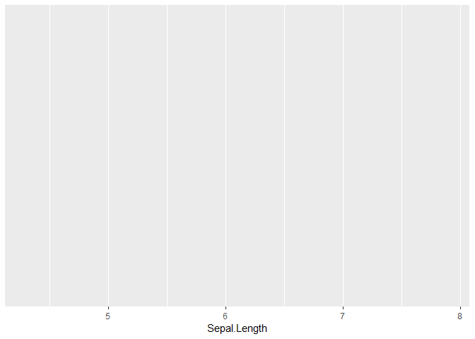

As shown above, we now see the plot area, grid lines, the variable name printed on the x-axis, and tick marks. To check the numbers displayed are in line with the range of that variable, call the `summary()` function which prints out useful summary statistics associated with each column in a `data.frame` (or `tibble`):

``` r
iris %>% summary()
```

    ##   Sepal.Length    Sepal.Width     Petal.Length    Petal.Width   
    ##  Min.   :4.300   Min.   :2.000   Min.   :1.000   Min.   :0.100  
    ##  1st Qu.:5.100   1st Qu.:2.800   1st Qu.:1.600   1st Qu.:0.300  
    ##  Median :5.800   Median :3.000   Median :4.350   Median :1.300  
    ##  Mean   :5.843   Mean   :3.057   Mean   :3.758   Mean   :1.199  
    ##  3rd Qu.:6.400   3rd Qu.:3.300   3rd Qu.:5.100   3rd Qu.:1.800  
    ##  Max.   :7.900   Max.   :4.400   Max.   :6.900   Max.   :2.500  
    ##        Species  
    ##  setosa    :50  
    ##  versicolor:50  
    ##  virginica :50  
    ##                 
    ##                 
    ## 

As shown by the `Min.` and `Max.` printed values for `Sepal.Length`, the tick marks are in line with the observations within `iris`. The plot area is blank because we have not yet told `ggplot2` **how** to display the information. Although it knows the x-axis variable, we must specify what kind of *geometric* object we wish to use to visualize the information. Objects are referred to as "geoms" and use the syntax `geom_<type>`. We will use the `geom_histogram()` function and manually set the number of bins within the histogram to be 15. Remember that after the parent `ggplot()` call to use the `+` between functions. The histogram is created with the syntax shown below:

``` r
iris %>% 
  ggplot(mapping = aes(x = Sepal.Length)) +
  geom_histogram(bins = 15)
```

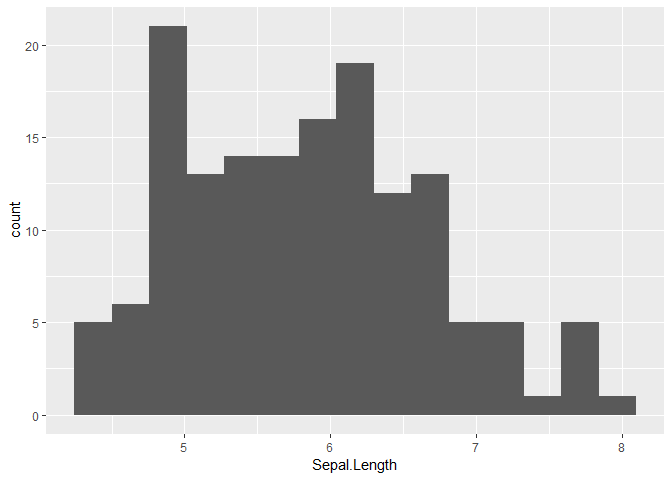

Now, you might be thinking that this is a lot of thought to make a histogram. The real power of `ggplot2` comes from the fact we can now drill down further with relative ease. Let's break the histogram apart based on the `Species` variable. First, create a separate subplot for each `Species` level by adding in the `facet_wrap()` function. The term "facet" is used to represent a sub-plot. We use `R`'s formula interface to tell `ggplot2` how to assign the separate sub-plots. Thus, you can think of the syntax as reading "creating subplots as a function of <variable>". The syntax looks like: `facet_wrap(~<variable>)`. In our specific example, we will use the `Species` variable as the facetting variable, as given in the code chunk below.

``` r
iris %>% 
  ggplot(mapping = aes(x = Sepal.Length)) +
  geom_histogram(bins = 15) +
  facet_wrap(~Species)
```

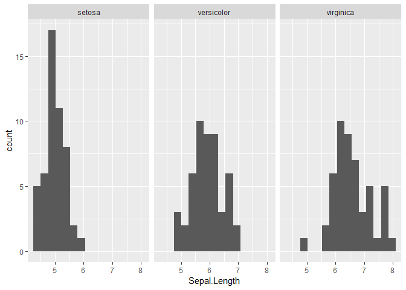

We can drill down even further within each subplot by breaking up the histograms based on other variables in the dataset. For example, perhaps we would like to break up the `Sepal.Length` histograms based on if the `Sepal.Width` value is greater than the median `Sepal.Width` value. The result of this conditional test will be linked to the color of the histogram. Thus, we are adding an additional aesthetic to the graphic. The x-axis aesthetic was assigned within the parent `ggplot()` function, but we can also assign aesthetics within separate geom calls. The format is similar and any aesthetic not assigned within a geom will be inherited from the parent `ggplot()` call. The code chunk below shows how to break up the histograms within each `Species` level based on the conditional test. An important difference between the code chunk below with the previous code chunk is that the histogram is represented by the frequency polygon, `geom_freqpoly()`, rather than the conventional histogram. When overlaying multiple histograms within a plot, I prefer to use the frequency polygon because we only have to compare lines rather than filled in areas.

``` r
iris %>% 
  ggplot(mapping = aes(x = Sepal.Length)) +
  geom_freqpoly(bins = 15,
                mapping = aes(color = Sepal.Width > median(Sepal.Width))) +
  facet_wrap(~Species)
```

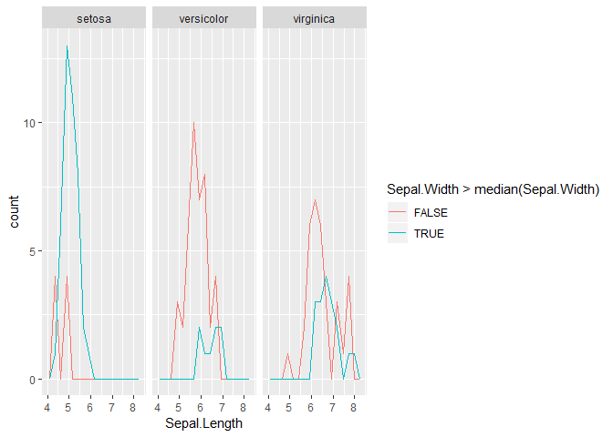

As shown above, `ggplot2` automatically creates the color legend with a label. The default position of that legend shrinks the overall plot area by a considerable amount. So let's move the legend to the top of the graphic by modifying the `legend.position` argument to the `theme()` function:

``` r
iris %>% 
  ggplot(mapping = aes(x = Sepal.Length)) +
  geom_freqpoly(bins = 15,
                mapping = aes(color = Sepal.Width > median(Sepal.Width))) +
  facet_wrap(~Species) +
  theme(legend.position = "top")
```

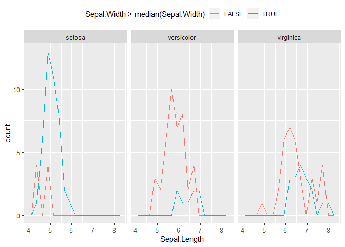

**Question: How many aesthetics are shown in the figure above?** We set the x-axis variable to `Sepal.Length`, we assigned the color of each histogram to a conditional test applied to `Sepal.Width`, and we assigned separate facets to `Species`. But how was the y-axis variable assigned?

The `geom_histogram()` and `geom_freqpoly()` geoms by default display the **count** or number of observations found within each bin on the y-axis. Thus, both geoms perform an operation behind the scenes and display the result as the y-axis aesthetic. That operation requires: breaking up the x-axis interval into the desired number of bins, calculating the number of observations within each bin, and assigning that number to the y-axis. To make it clear that separate observations are still "known" after performing the binning and counting operation, we will add a second geom to the graphic. Let's put a tick mark along the x-axis at the exact location of the `Sepal.Length` value for each observation via the `geom_rug()` geom. As shown in the code chunk below, add this new "layer" directly after the `geom_freqpoly()` call.

``` r
iris %>% 
  ggplot(mapping = aes(x = Sepal.Length)) +
  geom_freqpoly(bins = 15,
                mapping = aes(color = Sepal.Width > median(Sepal.Width))) +
  geom_rug() +
  facet_wrap(~Species) +
  theme(legend.position = "top")
```

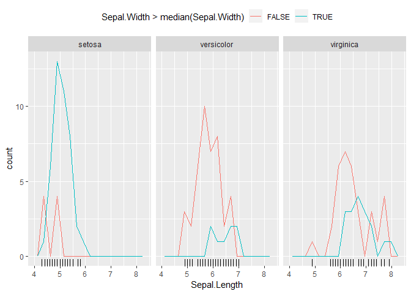

In the above figure, the newly added tick marks are black. **Why is that the case?** How would you set the tick marks to have the same color scheme as the histograms within each facet?

It is important to note that by displaying the count as the y-axis aesthetic for histograms, it might be difficult to compare multiple histograms when the groups have vastly different number of observations. For example, the `"setosa"` species has a different number of observations based on whether `Sepal.Width` is above its median value. The same conclusion can be drawn based on the facet for the `"versicolor"` species. We can normalize the counts to remove the impact of the *sample size* and hopefully make the *distribution* comparisons more visually telling. We already discussed the "hidden" operation performed to create the histogram, but we can instruct `ggplot2` to perform additional operations or statistical transformations. In the latest versions of `ggplot2`, we can override the default count y-aesthetic by calling the `stat()` function. To normalize we will use `stat(density)`. If you are not famaliar with the density, that is ok. We will be discussing what that term means within this course!

In the code chunk below, we set the y-axis aesthetic within the `geom_freqpoly()` call to be the statistical transformation `stat(density)`. As shown in the resulting figure, the separate histograms within each facet are now of similar max height. Plotting the density for the `"setosa"` species instead of the count really makes the "spike" like behavior stand out for the histogram corresponding to `Sepal.Width` below its median.

``` r
iris %>% 
  ggplot(mapping = aes(x = Sepal.Length)) +
  geom_freqpoly(bins = 15,
                mapping = aes(color = Sepal.Width > median(Sepal.Width),
                              y = stat(density))) +
  geom_rug() +
  facet_wrap(~Species) +
  theme(legend.position = "top")
```

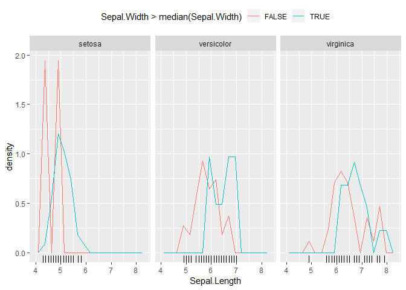

A side-effect of using the density instead of the count as the y-axis though, was that the second and third facets have "empty" space in the upper half of the plots. The y-axis scale is dominated by the first facet. We can allow the separate facets to use different axis scalings by modifying the `scales` argument to the `facet_wrap()` call. The options are, `"free"`, `"free_x"`, and `"free_y"`. Selecting `"free"` allows both axes to float within each subplot, while choosing `"free_x"` fixes the y-axis across all facets with floating x-axis (and vice versa for `"free_y"`). Because we want to visually see if the histogram covers a different range for each species we will choose the `"free_y"` option. The syntax for making this change is shown in the code chunk below.

``` r
iris %>% 
  ggplot(mapping = aes(x = Sepal.Length)) +
  geom_freqpoly(bins = 15,
                mapping = aes(color = Sepal.Width > median(Sepal.Width),
                              y = stat(density))) +
  geom_rug() +
  facet_wrap(~Species, scales = "free_y") +
  theme(legend.position = "top")
```

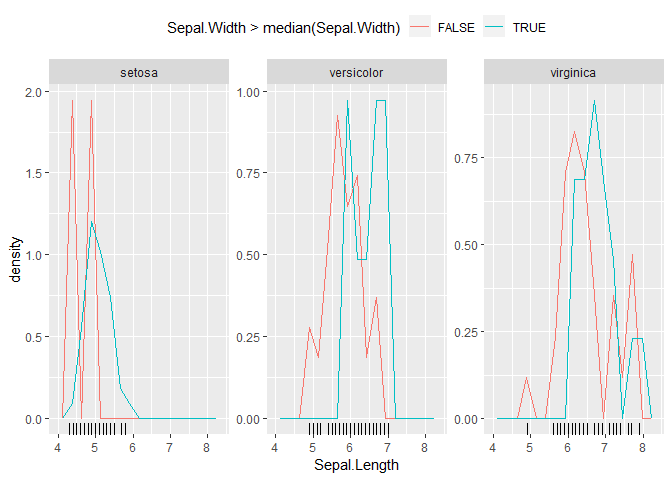

Another comsmetic adjustment is that I usually turn off the y-axis text when I am displaying histograms across separate facets. I do this to save space within the plot window. The y-axis text is controlled by the `axis.text.y` argument within the `theme()` function. To turn the text off we will use the `element_blank()` function, as shown in the code chunk below.

``` r
iris %>% 
  ggplot(mapping = aes(x = Sepal.Length)) +
  geom_freqpoly(bins = 15,
                mapping = aes(color = Sepal.Width > median(Sepal.Width),
                              y = stat(density))) +
  geom_rug() +
  facet_wrap(~Species, scales = "free_y") +
  theme(legend.position = "top",
        axis.text.y = element_blank())
```

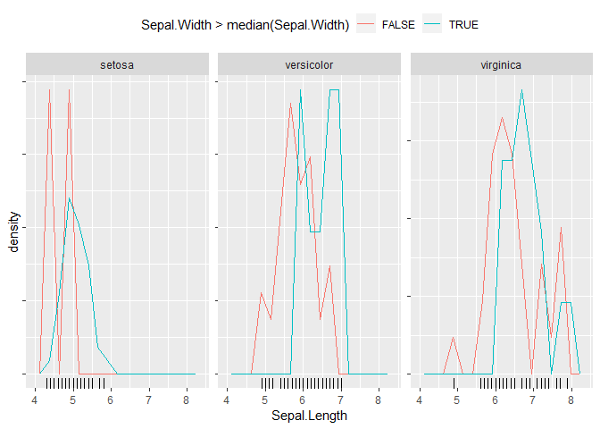

Lastly, the default colors can sometimes be a little difficult to see. So let's use a different color palette. `ggplot2` has many possible color scales. When comparing a few groups I typically use the brewer color palette with the function `scale_color_brewer()`. As shown in the code chunk below, place the scale function after the facet call:

``` r
iris %>% 
  ggplot(mapping = aes(x = Sepal.Length)) +
  geom_freqpoly(bins = 15,
                mapping = aes(color = Sepal.Width > median(Sepal.Width),
                              y = stat(density))) +
  geom_rug() +
  facet_wrap(~Species, scales = "free_y") +
  scale_color_brewer(palette = "Set1") +
  theme(legend.position = "top",
        axis.text.y = element_blank())
```

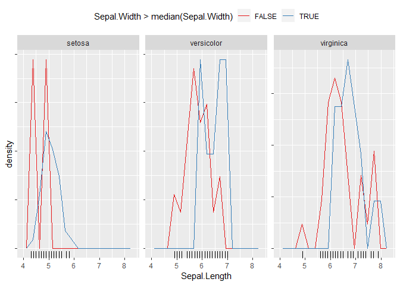

By showing how to plot simple histograms, we have seen some of the major elements for building a `ggplot2` figure. We must specify our dataset and map the variables to the appropriate aesthetics. We must decide what type of geometric object we will use to visualize those aesthetics. We might have to perform statistical transformations, and we may need to decide how to break up the graphic into separate facets. We can modify how the aesthetics are displayed through `scale_` functions, and finally we can alter the overall appearance of the graphic with the `theme()` function. Each of these elements are discussed in more detail within the [R for Data Science](https://r4ds.had.co.nz/) book. For a list of all available geometric objects please see the `ggplot2` [RStudio cheatsheets](https://www.rstudio.com/resources/cheatsheets/).

#### themes

A quick note on themes. The default theme has a gray background and white grid lines. I like that look when I am interactively exploring a dataset, but I avoid the gray background when placing figures in presentations and reports. In those situations I prefer to use `theme_bw()` which turns the background white with gray grid lines, as shown below:

``` r
iris %>% 
  ggplot(mapping = aes(x = Sepal.Length)) +
  geom_freqpoly(bins = 15,
                mapping = aes(color = Sepal.Width > median(Sepal.Width),
                              y = stat(density))) +
  geom_rug() +
  facet_wrap(~Species, scales = "free_y") +
  scale_color_brewer(palette = "Set1") +
  theme_bw() +
  theme(legend.position = "top",
        axis.text.y = element_blank())
```

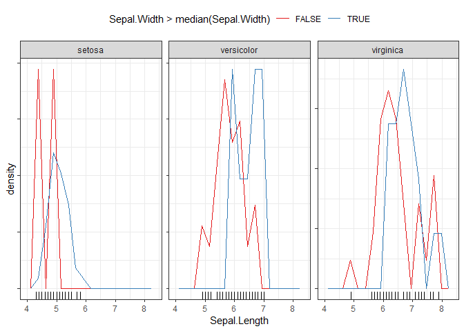

When visually comparing a few groups, sometimes I prefer to use a different color scale than the brewer scale shown previously. The `ggthemes` package includes a color blind safe color palette. To use it, we must first download and install `ggthemes` (if you do not have it already).

``` r
install.packages("ggthemes")
```

The color blind safe option is the function `scale_color_colorblind()`. Rather than loading the `ggthemes` package with the `library()` call, we will access the function directly from the package with the `::` operator. I like to use this functionality when I want one or two functions from a package. This way, I do not have to load the complete package into the session. The syntax is: `<package>::<function>`. The code chunk below replaces the brewer color palette with the color blind safe palette from `ggthemes`:

``` r
iris %>% 
  ggplot(mapping = aes(x = Sepal.Length)) +
  geom_freqpoly(bins = 15,
                mapping = aes(color = Sepal.Width > median(Sepal.Width),
                              y = stat(density))) +
  geom_rug() +
  facet_wrap(~Species, scales = "free_y") +
  ggthemes::scale_color_colorblind() +
  theme_bw() +
  theme(legend.position = "top",
        axis.text.y = element_blank())
```

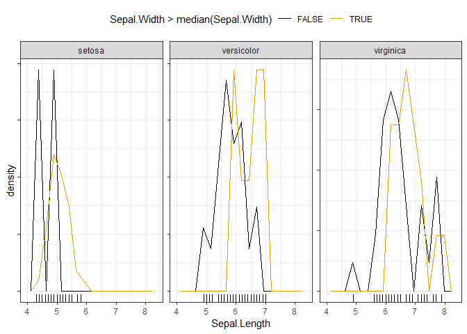

Conclusion
----------

This was just a short introduction to the `R` programming language and the `tidyverse`. There are many more topics to discuss and we will be doing so throughout INFSCI 2595.
