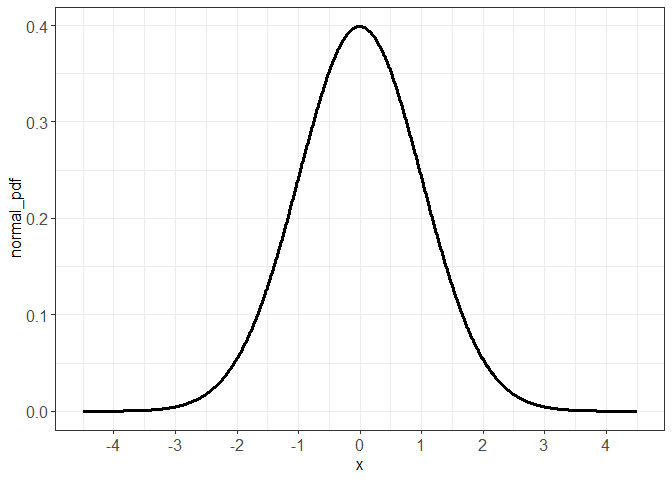
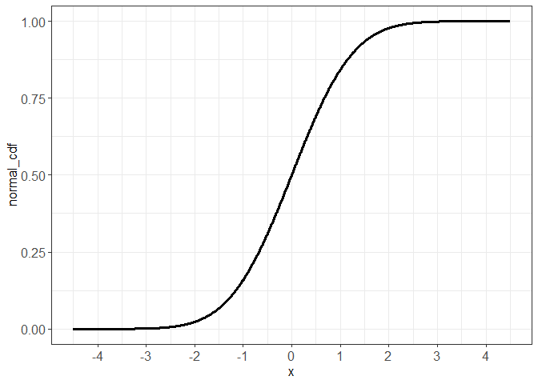
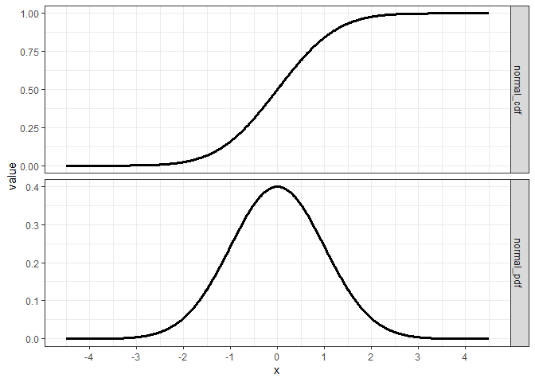
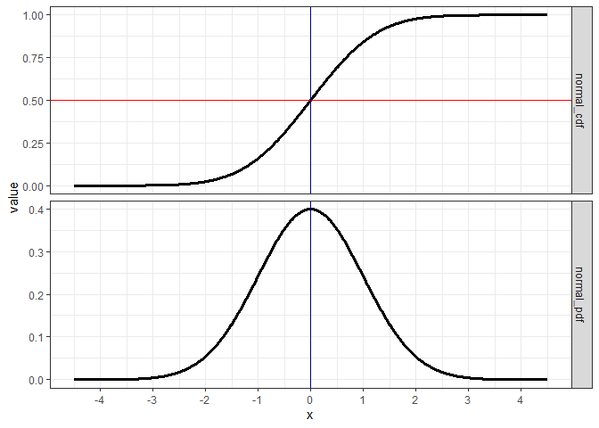
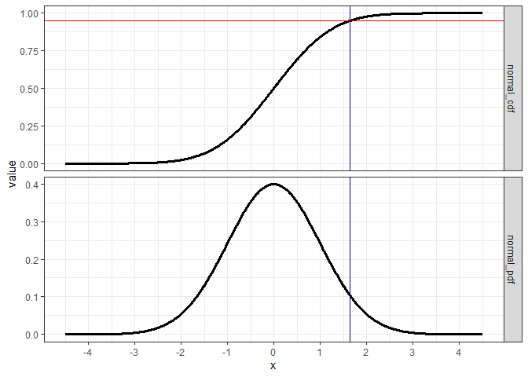
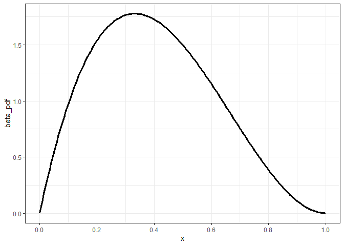
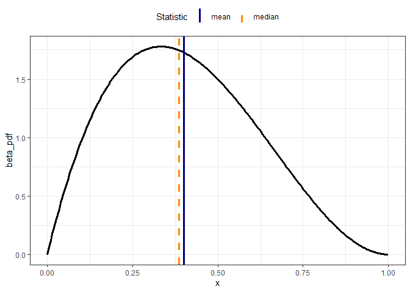
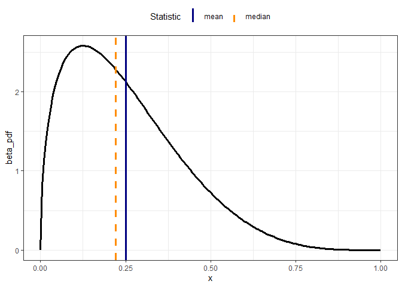
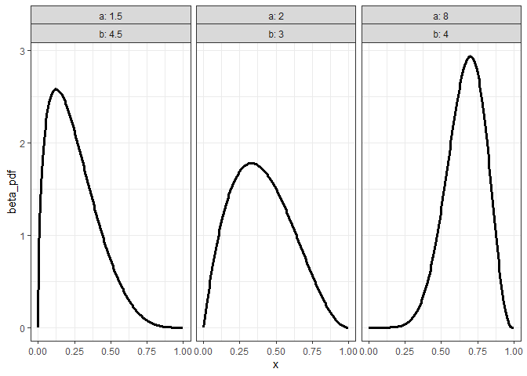
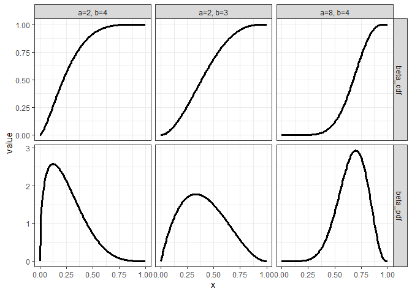

Probability density function review
================
Dr. Joseph P. Yurko
9/5/2019

## Overview

This markdown quickly reviews important concepts related to working with
probability density functions (pdfs) and cumulative distribution
functions (CDFs). This markdown uses the following packages:

``` r
library(dplyr)
library(ggplot2)
```

This markdown also uses the functions from the `purrr`, `tibble`, and
`tidyr` packages which are all installed along with the rest of the
`tidyverse`.

## Gaussian distribution

We will start with the Gaussian or normal distribution, which we focused
on in lecture 04. The density of a gaussian variable
 with hyperparameters
 and
 is:

  
 = \\frac{1}{\\sigma \\sqrt{2\\pi}} \\mathrm{exp}\\left(-\\frac{1}{2} \\left(\\frac{x-\\mu}{\\sigma} \\right)^2 \\right)
")  

The **standard** normal density corresponds to a gaussian distributed
variable with 
and :

  
 = \\frac{1}{\\sqrt{2\\pi}} \\mathrm{exp} \\left( -\\frac{1}{2}x^2 \\right)
")  

As we saw in lecture 04, if we define a variable , and
 has a Gaussian
distribution, the variable  will have a standard normal distribution. In this document we will
focus on the standard normal, but because of this transformation we can
apply our learnings to Gaussian distributions in general.

### R functions

We do not need to code the Gaussian distribution in order to evaluate
it. The `*norm()` family of functions provides us several functions for
evaluating and working with Gaussian random variables. If you type
`?dnorm()` into the `R` console the help page displays 4 functions,
`dnorm()`, `pnorm()`, `qnorm()`, and `rnorm()`. The last of these,
`rnorm()` is the random number generator for Gaussian random variables.
We will use `rnorm()` extensively throughout this course. However,
within this markdown, we will focus on the other three functions.

The first of those functions, `dnorm()`, evaluates the density function
of a Gaussian distribution with
 equal to the
`mean` argument and

equal to the `sd` argument. By default, all of the `*norm()` family
functions have `mean = 0` and `sd = 1`. So to evaluate the density of a
standard normal variable at `x = 1.15` we only need to specify the first
argument `x =` in the `dnorm()` function call. The code to do so is
shown in the code chunk below.

``` r
dnorm(x = 1.15)
```

    ## [1] 0.2059363

We get the same result if we explicitely set the `mean = 0` and `sd
= 1`:

``` r
dnorm(x = 1.15, mean = 0, sd = 1)
```

    ## [1] 0.2059363

In the previous code chunks, we passed in scalars to the `x` argument of
the `dnorm()` function. We can also pass in vectors in order to evaluate
the density function at many different `x` variable values. For example,
evaluate the standard normal density function at -2, -1, 0, 1:

``` r
dnorm(x = -2:2, mean = 0, sd = 1)
```

    ## [1] 0.05399097 0.24197072 0.39894228 0.24197072 0.05399097

### Visualize

Using this notation we will evaluate the standard normal density
function over the interval -4.5 to 4.5. The code chunk below creates a
`tibble` (see the [R
intro](https://github.com/jyurko/INFSCI_2595_Fall_2019/blob/master/week_01/L02_Rintro.md)
supplemental reading from lecture 02 for information on `tibble`s) with
the variable `x` which has 1001 elements from -4.5 to 4.5. That `tibble`
is piped into the `mutate()` function where the variable `normal_pdf` is
created by passing the variable `x` to the `dnorm()` function.

``` r
df_gauss <- tibble::tibble(
  x = seq(-4.5, 4.5, length.out = 1001)
) %>% 
  mutate(normal_pdf = dnorm(x))
```

The standard normal density function is visualized in the code chunk
below using the `geom_line()` geometric object in `ggplot2`.

``` r
df_gauss %>% 
  ggplot(mapping = aes(x = x, y = normal_pdf)) +
  geom_line(mapping = aes(group = 1), size = 1.25) +
  scale_x_continuous(breaks = -4:4) +
  theme_bw() +
  theme(axis.text = element_text(size = 12),
        axis.title = element_text(size = 12))
```

<!-- -->

Looking at the distribution shape reveals some important properties of
the Gaussian. First, it is symmetric. Second, it is unimodal, since
there is just one local maximum density value. The center of the
distribution is located at `x = 0`, which corresponds to the mean or
expected value of the standard normal,
![\\mathbb{E}\\left\[x\\right\]=\\mu](https://latex.codecogs.com/png.latex?%5Cmathbb%7BE%7D%5Cleft%5Bx%5Cright%5D%3D%5Cmu
"\\mathbb{E}\\left[x\\right]=\\mu"). As shown in the figure, the maximum
density value (the mode) is also located at the `x = 0`. Thus, the mode
and mean are the same for a Gaussian.

Although it may not be obvious from just look at the figure, the mode
and mean also correspond to the median. This property occurs for any
symmetric unimodal distribution, not just the Gaussian (as long as the
distribution has a mean). The median is the 50th quantile and
corresponds to the 
value where the probability *mass* up to and including that value is
50%. That also means that 50% of the probability mass is located above
(or greater) than the median. Notice the language used to the describe
the median. The median does not correspond to the value that has 50%
chance of occuring. Remember that the Gaussian distribution is
continuous, and thus the probability that
 exactly equals a
specific value is 0. In fact, the density function does not give the
probability, it gives (as the name states) the *density*. In order to
calculate the probability we must *integrate* the density function.
Hence why the term *mass* was used. The interval we integrate over is
the “volume” that contains the probability mass. The higher the density
is within an interval, the more the mass in concentrated within that
interval relative to other intervals.  
Let’s make this clear by visualizing the Cumulative Distribution
Function (CDF). In the code chunk below, we pipe `df_gauss` into
`mutate()` and call the `pnorm()` function. The result is piped into a
`ggplot()` to visualize the CDF with respect to the `x` variable.

``` r
df_gauss %>% 
  mutate(normal_cdf = pnorm(q = x)) %>% 
  ggplot(mapping = aes(x = x, y = normal_cdf)) +
  geom_line(mapping = aes(group = 1), size = 1.25) +
  scale_x_continuous(breaks = -4:4) +
  theme_bw() +
  theme(axis.text = element_text(size = 12),
        axis.title = element_text(size = 12))
```

<!-- -->

What’s going on here? The x-axis is still the standard normal random
variable, `x`. The y-axis is now between 0 and 1, because the y-axis
gives the probability that the variable will take on a value less than
or equal to the corresponding value on the x-axis. By integrating, we
are “accumulating” the density to calculate the probability mass
“contained” up to that point. That is why on the far left side of the
x-axis (around `x = -4`) the CDF value displayed on the y-axis is
essentially zero. At the extreme values of ,
the density is very low, so integrating over the interval yields a low
probability. Why then does the right hand side of the figure, with , have CDF values all near 1? The density, as shown in the
PDF figure, is also very low in that interval as well?

Let’s put the PDF and CDF together into a single graphic with separate
facets. In the figure below the CDF is displayed by the plot shown in
the top row, while the PDF is shown by the plot in the bottom row. The
dataset needed to be reformated or *reshaped* to a **long** or **tall**
format in order to create the figure below. The reshaping or *pivoting*
operation is controlled by the `tidyr::gather()` function. We will
discuss `tidyr::gather()` in more detail another time.

``` r
df_gauss %>% 
  mutate(normal_cdf = pnorm(q = x)) %>% 
  tibble::rowid_to_column() %>% 
  tidyr::gather(key = "key", value = "value", -rowid, -x) %>% 
  ggplot(mapping = aes(x = x, y = value)) +
  geom_line(mapping = aes(group = key), size = 1.15) +
  facet_grid(key ~ ., scales = "free_y") +
  scale_x_continuous(breaks = -4:4) +
  theme_bw()
```

<!-- -->

Let’s walk through the figure above. The CDF is calculated by
integrating the PDF over the entire range of the `x` variable (known as
the support). A Gaussian random variable is unbounded, spanning the
whole real line. Thus we must integrate from

to . The PDF shows that for  the density is very low. Thus integrating from

up to -3 yields very little mass. As we continue to move from -3 to -2,
the density increases, yielding an increasing slope in the CDF, though
it is still rather small. Continuing to from -2 to -1 however, we that
the slope of the CDF increases sharply. The slope from -1 to 0 appears
roughly constant in the CDF. Then, even though the PDF reaches its
maximum at ,
moving from 0 to +1 reveals that the CDF continues to increase. As
mentioned already, the CDF is “accumulating” or building up mass via
integration. The probability mass continues to increase though at a
slower rate because the density is decreasing, especially between +1 and
+2. At approximately
, the
probability mass essentially saturates. Continuing to integrate over
 yields only a small
increase in the cumulative probably. Thus, even though the Gaussian
random variable exists over the entire real line almost all of the
probability mass is contained within the interval of -3 to +3. This
statement carries over to a general Gaussian variable in the form of
-3 to
+3.

### Quantiles

Let’s calculate various quantiles to quantify the statements we made
from visually studying the PDF and CDF. The `qnorm()` function allows us
to calculate a quantile based on a desired probability as specified by
the `p =` argument. For example, the median or 50th quantile of the
standard normal distribution is:

``` r
qnorm(p = 0.5)
```

    ## [1] 0

The result is 0 because, as mentioned already the mean, mode, median are
the same for the Gaussian. The code chunk below adds a horizontal line
on the y-axis of the normal CDF subplot at a probability value of 0.5.
Both subplots have a vertical blue line located at median. Notice that
the horizontal line and vertical lines intersect. Hopefully this makes
it clear what the 50th quantile (the median) represents. After
integrating from

to `x = 0`, the accumulating probability mass is 50% of the total
probability mass.

``` r
df_gauss %>% 
  mutate(normal_cdf = pnorm(q = x)) %>% 
  tibble::rowid_to_column() %>% 
  tidyr::gather(key = "key", value = "value", -rowid, -x) %>% 
  ggplot(mapping = aes(x = x, y = value)) +
  geom_line(mapping = aes(group = key), size = 1.15) +
  geom_hline(data = data.frame(prob_val = 0.5, key = c("normal_cdf")),
             mapping = aes(yintercept = prob_val),
             color = "red") +
  geom_vline(xintercept = qnorm(0.5), color = "navyblue") +
  facet_grid(key ~ ., scales = "free_y") +
  scale_x_continuous(breaks = -4:4) +
  theme_bw()
```

<!-- -->

We can make a similar figure to show the 95th quantile. The horizontal
red line on the CDF plot is now placed at the y-axis value of 0.95.
Likewise, the vertical blue line is located at `qnorm(0.95)` on the
x-axis in both subplots. For the 95th quantile, we integrate from

to 1.645.

``` r
df_gauss %>% 
  mutate(normal_cdf = pnorm(q = x)) %>% 
  tibble::rowid_to_column() %>% 
  tidyr::gather(key = "key", value = "value", -rowid, -x) %>% 
  ggplot(mapping = aes(x = x, y = value)) +
  geom_line(mapping = aes(group = key), size = 1.15) +
  geom_hline(data = data.frame(prob_val = 0.95, key = c("normal_cdf")),
             mapping = aes(yintercept = prob_val),
             color = "red") +
  geom_vline(xintercept = qnorm(0.95), color = "navyblue") +
  facet_grid(key ~ ., scales = "free_y") +
  scale_x_continuous(breaks = -4:4) +
  theme_bw()
```

<!-- -->

### Intervals

You have probably heard of the “2-sigma” rule, in that approximately 95%
of the probability is contained between
 and
. Notice that in the previous figure, the 95th quantile is
not located at 2…it is located at 5.64485. That is because the 95th
quantile is calculated by integrating starting from
.
The “2-sigma” rule however, defines an interval **around** the mean. The
left hand side of the integral used to calculate the probability starts
at the 2.5th quantile and the integration ends at the 97.5th quantile.
The interval therefore spans 95% of the probabilty. We could use a
different interval which captures 95% of the probability mass. For
example, the 1th quantile to the 96th quantile would also cover 95% of
the probability mass. Spanning the 2.5th through 97.5th quantiles though
encompasses a central interval, with the median/mean/mode at its center.
The central 95% interval therefore represents the uncertainty around the
most likely value.

Let’s first calculate the probability mass contained between -2 and +2
(for the standard normal). We already know that the CDF is evaluated by
the `pnorm()` function, but since the left hand side starts at
, we need to setup the calculation slightly different. We
need to integrate from

to +2, and then subtract out the integral from

to -2. We can perform the calculation quite simply in `R`, as shown in
the code chunk below:

``` r
pnorm(2) - pnorm(-2)
```

    ## [1] 0.9544997

The result 0.9545 is pretty close to 95%. This shows that the “2-sigma”
is an approximation, a pretty good approximation, but still an
approximation. The actual 2.5th and 97.5th quantile values are:

``` r
qnorm(p = c(0.025, 0.975))
```

    ## [1] -1.959964  1.959964

If we plug in the actual quantiles to the integral calucation, we obtain
95% exactly:

``` r
pnorm(qnorm(0.975)) - pnorm(qnorm(0.025))
```

    ## [1] 0.95

To visualize the relationship between the integral of the PDF to the
central 95% probability interval, the figure below shades in the area
under the PDF curve between the two quantiles.

``` r
df_gauss %>% 
  mutate(normal_cdf = pnorm(q = x)) %>% 
  tibble::rowid_to_column() %>% 
  tidyr::gather(key = "key", value = "value", -rowid, -x) %>% 
  mutate(show_area = ifelse(key == "normal_cdf", 
                            NA,
                            between(x, qnorm(0.025), qnorm(0.975)))) %>% 
  ggplot(mapping = aes(x = x, y = value)) +
  geom_area(mapping = aes(fill = show_area)) +
  geom_line(mapping = aes(group = key), size = 1.15) +
  geom_hline(data = data.frame(prob_val = c(0.025, 0.975), key = c("normal_cdf")),
             mapping = aes(yintercept = prob_val),
             color = "red") +
  geom_vline(xintercept = qnorm(c(0.025, 0.975)), color = "navyblue") +
  facet_grid(key ~ ., scales = "free_y") +
  scale_fill_manual("Area under the density curve for probability interval",
                    values = c("TRUE" = "red",
                               "FALSE" = "grey",
                               "NA" = NA),
                    labels = c("TRUE" = "included in integral",
                               "FALSE" = "outside integral",
                               "NA" = NA)) +
  scale_x_continuous(breaks = -4:4) +
  theme_bw() +
  theme(legend.position = "top")
```

<!-- -->

## Beta distribution

Many of the concepts described for the Gaussian can be carried over to
other distributions. Especially how to intepret the CDF and relate the
PDF to the CDF through integration. We will now apply those
understandings to the Beta distribution, which we discussed in lecture
03.

The Beta distribution is a continuous distribution, but unlike the
Gaussian it is bounded between 0 and 1. Also, the Beta distribution can
take on a wide variety of shapes based upon it’s hyperparameters. The
Bishop book denotes these hyperparameters as
 and
, but in `R` they are
referred to as `shape1` and `shape2`, respectively.

In lecture we used the the Beta distribution as the prior on the
probability of the event,
. Within this
markdown we will denote that variable simply as `x`. Doing so allows us
to be consistent with the input arguments to the `*beta` family of
functions. This document therefore represents a more general notation
consistent with many references discussing probability distributions.
The Beta density function on the variable
 given the
hyperparameters  and
 is proportional to:

  
 \\propto x^{a-1}\\left( 1 - x\\right)^{b-1}
")  

### R functions

The `*beta()` family of functions are `dbeta()`, `pbeta()`, `qbeta()`,
and `rbeta()`. The `rbeta()` is the random number generation function
for beta distribution values bounded between 0 and 1. Compared with the
`*norm()` family of functions, the hyperparameters, `shape1` and
`shape2` do not have default argument values. The user must supply the
hyperparameters for the functions to execute.

### Visualize

Let’s start out evaluating the density function `dbeta()` using the
 and
 hyperparameters set to
2 and 3, respectively. These values were used in lecture 03 as part of
the example Beta distribution slides. Given what we learned about how to
interpret these hyperparameters, we can expect to see a mean value of
0.4 since the expected value of the Beta distribution is:

  
![
\\mathbb{E}\\left\[x|a,b\\right\] = \\frac{a}{a+b}
](https://latex.codecogs.com/png.latex?%0A%5Cmathbb%7BE%7D%5Cleft%5Bx%7Ca%2Cb%5Cright%5D%20%3D%20%5Cfrac%7Ba%7D%7Ba%2Bb%7D%0A
"
\\mathbb{E}\\left[x|a,b\\right] = \\frac{a}{a+b}
")  

The code chunk below stores a vector of values between 0 and 1 and then
calculates the Beta density function at each element.

``` r
df_beta_01 <- tibble::tibble(
  x = seq(0, 1, length.out = 201)
) %>% 
  mutate(beta_pdf = dbeta(x, shape1 = 2, shape2 = 3))
```

Plot the Beta density function using are given hyperparameters.

``` r
df_beta_01 %>% 
  ggplot(mapping = aes(x = x, y = beta_pdf)) +
  geom_line(mapping = aes(group = 1), size = 1.25) +
  scale_x_continuous(breaks = seq(0, 1, by = 0.2)) +
  theme_bw()
```

<!-- -->

Notice how in the figure above, the particular Beta distribution is
**not** symmetric, but it is unimodal. Because of this, the mean will
not correspond to the mode. To make this clear the code chunk below
plots the same Beta distribution, but marks the mean value with a
vertical blue line. The figure below also displays the median value with
a dashed vertical orange line. The median is calculated using the
`qbeta()` function (which has similar behavior as the `qnorm()`
function, except for hyperparameter changes).

``` r
df_beta_01 %>% 
  ggplot(mapping = aes(x = x, y = beta_pdf)) +
  geom_line(mapping = aes(group = 1), size = 1.25) +
  geom_vline(data = tibble::tibble(stat_val = c((2 / (2+3)),
                                                qbeta(0.5, shape1 = 2, shape2 = 3)),
                                   stat_name = c("mean", "median")),
             mapping = aes(xintercept = stat_val,
                           color = stat_name,
                           linetype = stat_name),
             size = 1.15) +
  scale_color_manual("Statistic",
                     values = c("mean" = "navyblue",
                                "median" = "darkorange")) +
  scale_linetype_manual("Statistic",
                        values = c("mean" = "solid",
                                   "median" = "dashed")) +
  theme_bw() +
  theme(legend.position = "top")
```

<!-- -->

Let’s demonstrate the impact of the hyperparameters on the Beta
distribution shape. The code chunk below sets the hyperparameters to be

and  and then plots the Beta density function. Colored vertical
lines give the mean and median, as in the previous figure. Try out a
different set of hyperparameters and include the mean and median as
colored vertical lines.

``` r
tibble::tibble(
  x = seq(0, 1, length.out = 201)
) %>% 
  mutate(beta_pdf = dbeta(x, shape1 = 1.5, shape2 = 4.5)) %>% 
  ggplot(mapping = aes(x = x, y = beta_pdf)) +
  geom_line(mapping = aes(group = 1), size = 1.25) +
  geom_vline(data = tibble::tibble(stat_val = c((1.5 / (1.5+4.5)),
                                                qbeta(0.5, shape1 = 1.5, shape2 = 4.5)),
                                   stat_name = c("mean", "median")),
             mapping = aes(xintercept = stat_val,
                           color = stat_name,
                           linetype = stat_name),
             size = 1.15) +
  scale_color_manual("Statistic",
                     values = c("mean" = "navyblue",
                                "median" = "darkorange")) +
  scale_linetype_manual("Statistic",
                        values = c("mean" = "solid",
                                   "median" = "dashed")) +
  theme_bw() +
  theme(legend.position = "top")
```

<!-- -->

Rather than plotting the distributions in separate figues, let’s use a
separate subplot for each. To accomplish this, we will need to combine
the two datasets used to create the two previous figures. That is an
easy operation to do, but let’s generalize our setup such that we can
easily try out arbitrary hyperparameter values. We will first define a
function, `make_beta_pdf()`, which creates a `tibble` consisting of the
beta density evaluated at specific `x` values, based on the user
supplied hyperparameter values. Notice that in `make_beta_pdf()` I did
not use the `return()` function. By default, `R` will therefore return
the last object within the function, which in this case is a `tibble`
consisting of `x`, the Beta density function value, `beta_pdf`, and the
two hyperparameters which defined the distribution.

``` r
make_beta_pdf <- function(shape_1, shape_2, vector_length)
{
  tibble::tibble(
    x = seq(0, 1, length.out = vector_length),
    beta_pdf = dbeta(x = x,
                     shape1 = shape_1,
                     shape2 = shape_2)
  ) %>% 
    mutate(a = shape_1,
           b = shape_2)
}
```

The `make_beta_pdf()` function can be called just like any function in
`R`. We just pass in the arguments we wish to use. To demonstrate, call
`make_beta_pdf()` with the following arguments `shape_1 = 2`, `shape_2
= 3`, and `vector_length = 3`. Pipe the result of the function call to
the `glimpse()` function. As shown below, the resulting dataset consists
of 3 observations of 4 variables. The values of those variables are
printed below. The hyperparameters are simply repeated over all of the
rows.

``` r
make_beta_pdf(shape_1 = 2, shape_2 = 3, vector_length = 3) %>% 
  glimpse()
```

    ## Observations: 3
    ## Variables: 4
    ## $ x        <dbl> 0.0, 0.5, 1.0
    ## $ beta_pdf <dbl> 0.0, 1.5, 0.0
    ## $ a        <dbl> 2, 2, 2
    ## $ b        <dbl> 3, 3, 3

Next, we will evaluate the Beta density function for several sets of
hyperparameters. We could use a for-loop to accomplish this task, but
instead I use the use the `purrr` package to perform the iterations for
me. You may not be familar with `purrr` or functional programming in
general. We will cover `purrr` later in this course. For now, it’s ok to
view the use of `purrr` as managing the for-loop for us.

Before iterating though, we have to specify what we will iterate over.
The code chunk below creates a `tibble` which stores three sets of
hyperparameters, named `hyper_params`.

``` r
hyper_params <- tibble::tibble(
  a = c(2, 1.5, 8),
  b = c(3, 4.5, 4)
)
```

Now iterate over the three different hyperparameter sets using the
`purrr::map2_dfr()` function. Store the result as `beta_results`.

``` r
beta_results <- purrr::map2_dfr(hyper_params$a,
                                hyper_params$b,
                                make_beta_pdf,
                                vector_length = 201)
```

Pipe `beta_results` into the `glimpse()` function to get an idea about
the structure of the dataset. As shown below, there are 603 rows, which
equals three times the specified value of the `vector_length` argument.
Thus, the `purrr::map2_dfr()` function “stacked” the three generated
`tibble`s on top of each other.

``` r
beta_results %>% glimpse()
```

    ## Observations: 603
    ## Variables: 4
    ## $ x        <dbl> 0.000, 0.005, 0.010, 0.015, 0.020, 0.025, 0.030, 0.03...
    ## $ beta_pdf <dbl> 0.0000000, 0.0594015, 0.1176120, 0.1746405, 0.2304960...
    ## $ a        <dbl> 2, 2, 2, 2, 2, 2, 2, 2, 2, 2, 2, 2, 2, 2, 2, 2, 2, 2,...
    ## $ b        <dbl> 3, 3, 3, 3, 3, 3, 3, 3, 3, 3, 3, 3, 3, 3, 3, 3, 3, 3,...

We can now plot each of the three separate Beta distributions by
specifying the facets based on the combination of the `a` and `b`
variables in the `beta_results` object.

``` r
beta_results %>% 
  ggplot(mapping = aes(x = x, y = beta_pdf)) +
  geom_line(mapping = aes(group = interaction(a, b)),
            size = 1.15) +
  facet_grid(. ~ a + b, labeller = "label_both") +
  theme_bw()
```

<!-- -->

### CDF

As we did with the Gaussian distribution, let’s now relate the Beta
density function with its Cumulative Distribution Function (CDF). We
will evaluate the Beta CDF with the `pbeta()` function in much the same
way that we evaluated the `pnorm()` function. To facilitate comparing
the three different sets of hyperparameters, we will create a function
`make_beta_cdf()` which calls `pbeta()` at the same conditions we
evaluated `dbeta()` with. First, create the function:

``` r
make_beta_cdf <- function(shape_1, shape_2, vector_length)
{
  tibble::tibble(
    x = seq(0, 1, length.out = vector_length),
    beta_cdf = pbeta(q = x,
                     shape1 = shape_1,
                     shape2 = shape_2)
  ) %>% 
    mutate(a = shape_1,
           b = shape_2)
}
```

Next, iterate over the same set of Beta hyperparameters we used before
and save the results to `beta_integrate`.

``` r
beta_integrate <- purrr::map2_dfr(hyper_params$a,
                                hyper_params$b,
                                make_beta_cdf,
                                vector_length = 201)
```

We need to merge or join the `beta_results` and `beta_integrate`
datasets in order to plot the Beta density functions and CDFs as
subplots of a single graphic. Although we have not walked through
joining datasets before, the operation is straightforward to do in this
case. We will use the `left_join()` function from `dplyr` and instruct
the function to join `by`: `x`, `a`, and `b`. The merged dataset is then
piped into the `tidyr::gather()` function to reshape it into the correct
format. Finally the pivoted dataset is piped into `ggplot()` to give the
CDF on the top row of subplots, and the density functions on the bottom
row.

``` r
beta_results %>% 
  left_join(beta_integrate,
            by = c("x", "a", "b")) %>% 
  tidyr::gather(key = "key", value = "value", 
                -x, -a, -b) %>% 
  ggplot(mapping = aes(x = x, y = value)) +
  geom_line(mapping = aes(group = interaction(key, a, b)),
            size = 1.15) +
  facet_grid(key ~ a + b, 
             labeller = label_bquote(cols = .(sprintf("a=%1.1g, b=%1.1g", a, b)),
                                     rows = .(key)),
             scales = "free_y") +
  theme_bw()
```

<!-- -->

We can walk through the figure above, just as we walked through the
Gaussian CDFs and PDFs. A key difference between the Beta and Gaussian
though is the Beta is bounded between 0 and 1. Thus, the integration of
the Beta density function **starts** at , not at
.
The Beta density is integrated to  and not

because by definition the Beta distribution “stops” at . Thus, at
 the Beta CDF
equals 0 and at 
the Beta CDF equals 1.

Comparing the horizontal subplots allows us to compare how the rate of
increase in the accumulated probability mass based on the density shape.
In the right column of subplots, the density is roughly at zero until
. The CDF therefore remains at essentially zero since
there is so little mass being accumulated integrating over
 up to . Moving to the middle and then finally the left
column of subplots, the density increases closer and closer to zero.
This causes the probability mass to accumulate at a faster rate
integrating from  to . That is why the slope of the CDF of the left most
distribution is higher than the slope of the middle and right
distributions.
