Unknown mean, known variance Normal model
================
Dr. Joseph P. Yurko
September 7, 2019

Overview
--------

This markdown supplements the material presented in Lecture 04 for the normal-normal model. The standard deviation, , was assumed known, and so we only needed to learn the unknown mean, . A conjugate Gaussian prior was used which meant the posterior on the unknown mean was also Gaussian. In lecture, we focused on understanding how the posterior changes as the sample size increases, and what happens as we use diffuse prior distributions. In this markdown, we will try and illustrate how the posterior is a compromise between the prior and data. Although we discussed that compromise mathematically in lecture, we will visualize that compromise in this markdown. Additionally, this markdown discusses for-loops and the `purrr` package.

This markdown makes use of the following packages:

``` r
library(dplyr)
library(ggplot2)
```

This markdown also makes use of functions from the `purrr` and `tibble` packages. Both packages were installed with the entire `tidyverse` suite of packages.

Model formulation
-----------------

We will use the same notation as that in lecture 04. The model uses a normal likelihood and a normal prior distribution as shown below:

 \propto \prod_{n=1}^{N} \left( \mathrm{normal}\left(x_{n}|\mu,\sigma\right) \right) \cdot \mathrm{normal}\left(\mu|\mu_0,\tau_0 \right)
")

As shown in lecture 04, the posterior distribution on the unknown mean, , given  observations, , and known standard deviation

Problem statement
-----------------

We will use a different problem setup in this markdown compared with the one in lecture. We will purposely use a prior that is shifted away from the population of the data. With such a setup, we will be able to see how the posterior is a compromise between our prior belief and the observations, for a small number of observations. Additionally, we will see how our prior belief becomes overwhelmed by the data, as the sample size becomes large.

### Synthetic data

We will define the **true** parameter values of an assumed *data generating process*. Given those parameters, we will generate random observations through the `rnorm()` function, which will serve as our observations . Our goal will be to learn, as best as we can, the mean value associated with the Gaussian distribution given the observed values and the known  value.

We will use the following true parameter values:

``` r
mu_true <- 1
sigma_true <- 1
```

And now, generate  observations by passing the *true* parameter values into the `rnorm()` function:

``` r
set.seed(2001)
x <- rnorm(n = 50, mean = mu_true, sd = sigma_true)
```

### Prior specification

As previously described, we will define an *informative* prior which is shifted away from the known *true* mean. In many ways this prior is "incorrect", and so the term informative may sound misleading. Therefore thinking of an informative prior as one that tries to constrain the possible values that a paramaeter can take. We are using a prior "incorrectly specified" by design so that we can "watch" the data update our belief. So let's define the prior Gaussian distribution with a prior mean of  and a prior standard deviation of .

``` r
mu_0 <- -1
tau_0 <- 0.75
```

To demonstrate just how restrictive this prior is, calculate the CDF of the prior at the *true* mean value:

``` r
pnorm(q = mu_true, mean = mu_0, sd = tau_0)
```

    ## [1] 0.9961696

Thus, approximately 99.6% of the probability mass exists **below** the true mean value! The prior is therefore biasing us away from the true answer in this simple example. To make this point even more clear, let's visualize our prior relative to the 50 observations. The code chunk below uses `ggplot2` to plot a histogram of the 50 observations compared with the density function of the prior on  in light blue. The *true* mean is shown as the dashed red vertical line. It is very important to note that the prior does **not** correspond to a potential distribution of the observations, . The prior is a distribution associated with the mean, . Thus, the fact the prior and the observation histogram are not aligned represents the posterior will be different from the prior after we have conditioned on the observations.

``` r
tibble::tibble(
  x = x
) %>% 
  ggplot(mapping = aes(x = x)) +
  geom_histogram(bins = 15,
                 mapping = aes(y = stat(density))) +
  geom_rug() +
  stat_function(data = data.frame(x = mu_0 + c(-4*tau_0, 4*tau_0)),
                fun = dnorm, 
                args = list(mean = mu_0, sd = tau_0),
                color = "dodgerblue",
                size = 1.15) +
  geom_vline(xintercept = mu_true,
             color = "red", linetype = "dashed", size = 1.15) +
  theme_bw()
```

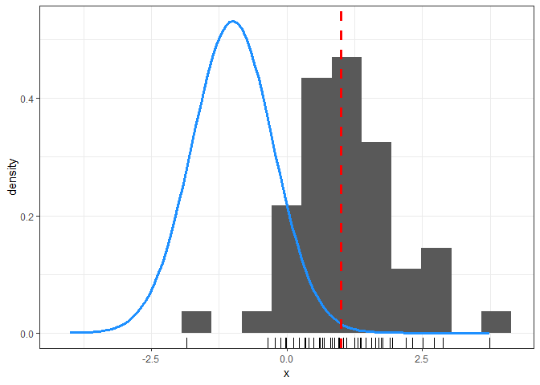

Another way to illustrate the same point, is to plot the observations in a trace-like plot or run-chart. The x-axis is the counter or sample index associated with each data point, and the y-axis is the observation value. For reference, the prior mean, , and the prior  interval are denoted by solid and dashed light blue horizontal lines, respectively. The *true* mean is denoted by the dashed red horizontal line. As shown below, it is quite clear the prior does not seem aligned with the "center" or "middle" of the observations.

``` r
tibble::tibble(
  x = x
) %>% 
  tibble::rowid_to_column("obs_id") %>% 
  ggplot(mapping = aes(x = obs_id, y = x)) +
  geom_hline(yintercept = mu_true,
             color = "red", linetype = "dashed",
             size = 1.15) +
  geom_hline(yintercept = c(mu_0 - 2*tau_0, mu_0 + 2*tau_0),
             color = "dodgerblue",
             linetype = "dashed",
             size = 1.15) +
  geom_hline(yintercept = mu_0,
             color = "dodgerblue",
             size = 1.15) +
  geom_line(size = 1.15) +
  geom_point(size = 4) +
  labs(x = "sample index") +
  theme_bw()
```


Evaluate
--------

In lecture 04, we discussed how to interpret the posterior distribution, "), as a compromise between the data and the prior. Although we did not step through the complete derivation, we broke down the posterior into it's key parts. We discussed how the sample mean is the sufficient statistic, and that the posterior mean is a precision weighted average of the prior mean and the sample mean.

Rather than repeating those expressions here, we will instead visualize the log-posterior as a function of . We will compare the log-likelihood with the log-prior to see how the two influence the log-posterior, as we increase the number of observations. Working with the log-posterior for this simple problem will serve as a useful starting point for future problems where we do not have an analytic expression for the posterior.

### log-posterior function

We will define a custom function which evaluates the log-posterior by calculating the log-likelihood and the log-prior for a given value of . The function `ex_logpost()` is defined in the code chunk below.

``` r
ex_logpost <- function(mu, my_info)
{
  # log-likelihood -> sum up the independent
  # log-likelihoods 
  log_lik <- sum(dnorm(x = my_info$x,
                       mean = mu,
                       sd = my_info$sigma,
                       log = TRUE))
  
  # the log-prior
  log_prior <- dnorm(x = mu,
                     mean = my_info$mu_0,
                     sd = my_info$tau_0,
                     log = TRUE)
  
  # add the log-likelihood and log-prior
  log_lik + log_prior
}
```

`ex_logpost()` accepts two input arguments, `mu`, and `my_info`. The argument `mu` is straightforward, it is just a value of  we wish to evaluate the log-posterior at. The argument `my_info` is a list which stores the observations as the vector `x`, the assumed likelihood standard deviation, `sigma`, and the prior hyperparameters, `mu_0` and `tau_0`. Both the log-likelihood and log-prior are calculated with by setting the argument `log = TRUE` in the `dnorm()` function. As for why the `dnorm()` function is used, remember that the likelihood and prior consist of Gaussian distributions. `dnorm()` evaluates the normal density function at a value defined by the `x` argument, given the `mean` and standard deviation `sd`.

The log-likelihood value is stored is the variable `log_lik`. Please note that the `sum()` function is wrapped around the `dnorm()` function call. **Do you know why that is?** The vector `my_info$x` is passed in as the first argument, while `mu` and `my_info$sigma` are assigned to the `mean` and `sd` arguments, respectively. Since `my_info$x` is a vector, `dnorm()` calculates a normal density at each element in the vector. The `sum()` then sums up those values producing the (complete) log-likelihood value. **Why is the complete log-likelihood the sum of the individual observation likelihoods?**

The log-prior is calculated much in the same way. The specified `mu` value is passed in as the first argument and `my_info$mu_0` and `my_info$tau_0` are assigned to the `mean` and `sd` arguments, respectively. The log-prior is essentially calculating how "likely" the specified value of `mu` is with respect to the prior.

#### for-loop

With the function defined, we can evaluate it as we would for any function in `R`. Before calculating it however, we must define a list which contains the required information. The code chunk below passes in the first 3 data points as the observations `x`.

``` r
ex_info <- list(
  x = x[1:3],
  mu_0 = mu_0,
  tau_0 = tau_0,
  sigma_true = sigma_true
)
```

The `ex_logpost()` is intended to be evaluated at a single value of `mu`, **not** at a vector of `mu`. The reason why will be made more clear in future lectures. The code chunk below demonstrates evaluating the `ex_logpost()` function at several different values for `mu`.

``` r
ex_logpost(0, ex_info)
```

    ## [1] -5.750332

``` r
ex_logpost(2, ex_info)
```

    ## [1] -15.06123

``` r
ex_logpost(-2, ex_info)
```

    ## [1] -15.55055

We will need to iteratively evaluate `ex_logpost()` in order to calculate the log-posterior at many potential `mu` values. The most basic way to do that is with a for-loop. We will first create a grid of potential `mu` values we wish to evaluate the log-posterior at. We will span $$6 prior standard deviations around the prior mean. Store that grid in the vector `mu_grid`.

``` r
mu_grid <- seq(mu_0 - 6*tau_0, mu_0 + 6*tau_0, length.out = 501)
```

Next, initialize our response vector `ex_lp_result`.

``` r
ex_lp_result <- rep(as.numeric(NA), length(mu_grid))
```

And finally evaluate the log-posterior at each value of `mu` in the `mu_grid` vector via a for-loop.

``` r
for(nn in seq_along(ex_lp_result))
{
  ex_lp_result[nn] <- ex_logpost(mu = mu_grid[nn], my_info = ex_info)
}
```

#### purrr

As straightforward as the for-loop is to create and execute, it is not the most efficient way to accomplish this task. One of the downsides of the for-loop is that we have manage the necessary book keeping everytime we make a change or re-evaluate the functions of interest. Rather than using for-loops directly, I prefer to use the `purrr` package when I need to iterate or functionally program an operation. `purrr` is the `tidyverse` version of the `R` suite of "apply" functions. We will not cover `purrr` in great detail in this markdown, but you can essentially think of using `purrr` functions to replace for-loops. If you prefer to use a for-loop within this course, you are welcome to do so. I will however use the `purrr` functions in lecture and supplemental markdowns.

To demonstrate `purrr`, let's re-evaluate the log-posterior over the same set of values contained in `mu_grid`. Since the log-posterior result is a `"numeric"` value, we will use the `purrr::map_dbl()` function to perform the iteration. The basic syntax for `purrr::map*` functions is:

`<map function>(<item to iterate over>, <function to apply> , <other arguments to the function to apply>)`

Executing `ex_logpost()` over the vector `mu_grid` is accomplished in the following code chunk.

``` r
ex_lp_purrr <- purrr::map_dbl(mu_grid,
                              ex_logpost,
                              my_info = ex_info)
```

Comparing the two results, `ex_lp_result` and `ex_lp_purrr` we see that they are in fact identical.

``` r
all.equal(ex_lp_result, ex_lp_purrr)
```

    ## [1] TRUE

### Iterate over observations

The `ex_logpost()` function we created allows us to calculate the value of the log-posterior for a given set of observations. If we would also like to "loop over" the number of observations, we will need to place additional "scaffolding" around our `ex_logpost()` function. We essentially need an additional "wrapper" function which assembles the correct dataset, based on the desired number of observations.

However, before creating the "wrapper" function, let's modify our log-posterior function. In it's current state, `ex_logpost()` only returns the log-posterior. We will change this so that the log-likelihood and the log-prior are also returned. This will allow us to compare all three quantities later on. The code chunk below defines a new function, `my_logpost()` which returns each of the quantities within a list.

``` r
my_logpost <- function(mu, my_info)
{
  # log-likelihood -> sum up the independent
  # log-likelihoods 
  log_lik <- sum(dnorm(x = my_info$x,
                       mean = mu,
                       sd = my_info$sigma,
                       log = TRUE))
  
  # add in the log-prior
  log_prior <- dnorm(x = mu,
                     mean = my_info$mu_0,
                     sd = my_info$tau_0,
                     log = TRUE)
  
  val <- log_lik + log_prior
  
  return(list(log_post = val,
              log_lik = log_lik,
              log_prior = log_prior))
}
```

The following chunk now wraps `my_logpost()` within the function `eval_logpost()`. This "wrapper" manages the evaluation of the log-posterior based on a desired number of observations. The first argument, `Nuse`, specifies how many elements from the second argument, `xobs`, to retain. The sliced vector is stored as the `x` element to the third argument, `info`, which is a list containing the hyperparameter information. `eval_logpost()` calculates the log-posterior over a grid of possible  values as defined in the fourth argument, `mu_grid`. As shown in the code chunk below, the iteration, or looping, over `mu_grid` is controlled by the `purrr::map_dfr()` function. `map_dfr()` stacks the results into a `tibble` once the exection is completed. The last portion of the function manages the book keeping by putting the results together with the grid of  values.

``` r
eval_logpost <- function(Nuse, xobs, info, mu_grid)
{
  # package up the necessary information
  info$x <- xobs[1:Nuse]
  
  # caculate the log-posterior over the grid of
  # mu-values
  logpost_result <- purrr::map_dfr(mu_grid,
                                   my_logpost,
                                   my_info = info)
  
  # package together
  tibble::tibble(
    mu = mu_grid,
    log_post = logpost_result$log_post,
    log_lik = logpost_result$log_lik,
    log_prior = logpost_result$log_prior
  ) %>% 
    mutate(num_obs = Nuse)
}
```

The grid of possible  values is defined in the code chunk below. The vector `mu_grid` consists of 501 points evenly spaced between $$6 prior standard deviations, `tau_0`, around the prior mean, `mu_0`. We are there therefore exploring potential  values from -5.5 up to 3.5.

``` r
mu_grid <- seq(mu_0 - 6*tau_0, mu_0 + 6*tau_0, length.out = 501)
```

Finally, let's setup a list which stores the hyperparameter values required to calculate the log-likelihood and the log-prior:

``` r
hyper_params <- list(
  mu_0 = mu_0,
  tau_0 = tau_0,
  sigma = sigma_true
)
```

With all of the pieces in place, we can now evaluate the log-posterior as a function of , iterating over the number of observations. By looping over the *number* of observations we will continuously increase how many observations are used when evaluating the log-likelihood. When `Nuse = 1` only the first element from the `xobs` is used, but when `Nuse = 3` the first three elements are retained. In the code chunk below, the iteration is conrolled by the `purrr::map_dfr()` function, which compiles all of the results into a `tibble` and stores the result to the `df_logpost`.

``` r
df_logpost <- purrr::map_dfr(seq_along(x),
                             eval_logpost,
                             xobs = x,
                             info = hyper_params,
                             mu_grid = mu_grid)
```

Visualize results
-----------------

#### 

We will start out visualizing the log-posterior with respect  when just the first observation is used. In lecture 04, we discussed the analytic result for the posterior distribution on . The following visualizations should help with understanding where that posterior comes from. The figure below plots the log-posterior, log-likelihood, and log-prior with different colors and linetypes. **Question: Why are the curves parabolic in shape?**

``` r
df_logpost %>% 
  tidyr::gather(key = "key", value = "value",
                -num_obs, -mu) %>% 
  filter(num_obs == 1) %>% 
  ggplot(mapping = aes(x = mu, y = value)) +
  geom_line(mapping = aes(group = interaction(num_obs,
                                              key),
                          color = key,
                          linetype = key),
            size = 1.2) +
  facet_grid(.~num_obs, labeller = label_bquote(cols = .(sprintf("N=%d", num_obs)))) +
  labs(x = expression(mu)) +
  ggthemes::scale_color_colorblind("") + scale_linetype_discrete("") +
  theme_bw() +
  theme(legend.position = "top")
```

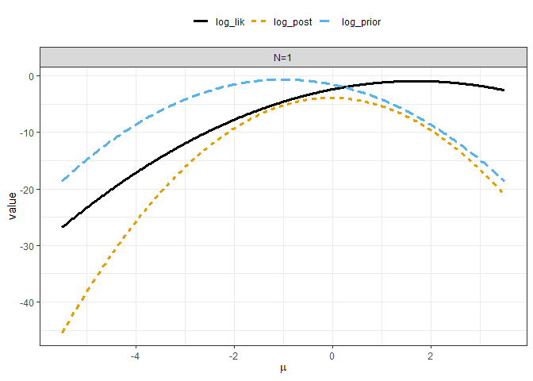

Let's now walk through how to intepret the above figure. The log-posterior is the sum of the log-likelihood and the log-prior. Thus, if you add the solid black line (the log-likelihood) to the dashed light blue line (the log-prior) you have the dashed orange line (the log-posterior). That is why near  where the log-prior is close to zero, the orange line is close to the black line. similarly, when the log-likelihood is close to zero near , the orange line is close to the light blue line.

Next, consider where the maximum values for each curve are located at. The peak log-prior value occurs at  because we specified the hyperparameter . Why does the log-likelihood peak near ? With a single observation the sample average, , is equal to the observation value. The first element in our random observation vector `x` is approximately equal to 1.7. The log-likelihood is reaching is maximum near 2 because the sample average, which corresponds to the Maximum Likelihood Estimate (MLE), is close to 2.

What about the log-posterior? Why does it peak near ? As we discussed in lecture 04, the posterior is a balance or compromise betwween the prior and the data. The posterior mean, , is a *precision* weighted average between the prior mean, , and the sample average, . The previous figure shows that when one of the components is near zero, the log-posterior is close to the other component. The result is that when the log-likelihood is close to zero around the MLE, the log-prior "pulls" or "shrinks" the log-posterior away from the MLE. We can equivalently say that the log-likelihood is "pulling" or "adjusting" the log-posterior away from the prior mean. The result is a compromise between the two.

We will now calculate summary statistics using the expressions described in lecture. The code chunk below calculates the sample average, the posterior mean, and other quantities based on the number of observations.

``` r
post_summary <- tibble::tibble(
  xobs = x
) %>% 
  tibble::rowid_to_column("N") %>% 
  mutate(sample_avg = cummean(xobs)) %>% 
  mutate(data_precision = N / sigma_true^2,
         post_prec = 1/tau_0^2 + data_precision,
         post_mu = ((1/tau_0^2) * mu_0 + data_precision * sample_avg)/post_prec,
         post_sd = sqrt(1 / post_prec))
```

Let's now make use of those summary statistics. Include the prior mean, sample average, and posterior mean after  in the plot of the log-posterior with respect to  as vertical lines. These vertical lines correspond to the peak values of their respective curves. **Question: why is the peak or mode equal to the mean for each of these curves?**

``` r
df_logpost %>% 
  tidyr::gather(key = "key", value = "value",
                -num_obs, -mu) %>% 
  filter(num_obs == 1) %>% 
  ggplot(mapping = aes(x = mu, y = value)) +
  geom_line(mapping = aes(group = interaction(num_obs,
                                              key),
                          color = key,
                          linetype = key),
            size = 1.2) +
  geom_vline(data = post_summary %>% 
               mutate(prior_mu = mu_0) %>% 
               filter(N == 1) %>% 
               select(num_obs = N, sample_avg, prior_mu, post_mu) %>% 
               tidyr::gather(key = "stat_name", value = "value",
                             -num_obs) %>% 
               mutate(key = ifelse(stat_name == "sample_avg",
                                   "log_lik",
                                   ifelse(stat_name == "prior_mu",
                                          "log_prior",
                                          "log_post"))),
             mapping = aes(xintercept = value,
                           color = key,
                           linetype = key),
             size = 1.25,
             show.legend = FALSE) +
  facet_grid(.~num_obs, labeller = label_bquote(cols = .(sprintf("N=%d", num_obs)))) +
  labs(x = expression(mu)) +
  ggthemes::scale_color_colorblind("") + scale_linetype_discrete("") +
  theme_bw() +
  theme(legend.position = "top")
```

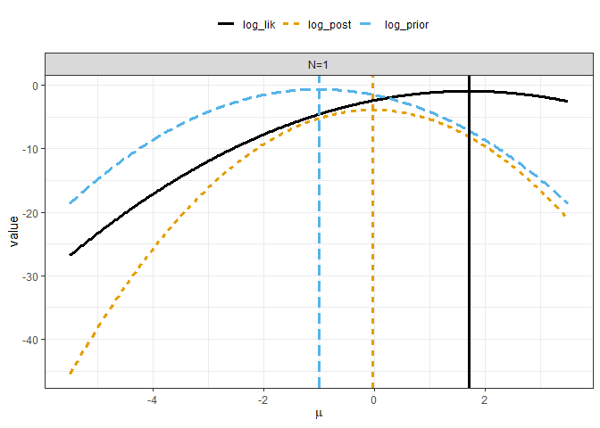

As shown in the above figure, the posterior mean (the vertical dashed orange line) is located in between the prior mean and the sample average. However,  is **not** exactly in the middle of those two quantites. It appears to be slightly closer to the prior mean, . **Why is that?** Let's return to the math to see why. As mentioned several times, the posterior mean is a precision weighted average between the prior mean and the data. With , the equation from lecture 04 for the posterior precision simplifies to:


We had specified our prior to have  0.75 and we assumed that the known likelihood standard deviation was  1. Thus, the prior is *more precise* than the single observation.

Now consider the expression on the posterior mean with :


Substitute in the prior standard deviation and assumed likelihood standard deviation:


Simplify the expression:


Which reduces to:


Thus, the weight applied to the prior mean is greater than the weight applied to the sample average after one observation, in this example!

#### 

We will now repeat the previous figure, but include the results based on retaining two and three observations. The number of observations, , associated with each figure is displayed in the strip title at the top of each facet. The color scheme is the same as the previous figure, and the vertical lines denote the  value corresponding to the max log-density for each curve. The log-prior is the same across facets. The log-likelihood and log-posterior however change as the number of observations increase left to right.

``` r
df_logpost %>% 
  tidyr::gather(key = "key", value = "value",
                -num_obs, -mu) %>% 
  filter(num_obs %in% 1:3) %>% 
  ggplot(mapping = aes(x = mu, y = value)) +
  geom_line(mapping = aes(group = interaction(num_obs,
                                              key),
                          color = key,
                          linetype = key),
            size = 1.2) +
  geom_vline(data = post_summary %>% 
               mutate(prior_mu = mu_0) %>% 
               filter(N %in% 1:3) %>% 
               select(num_obs = N, sample_avg, prior_mu, post_mu) %>% 
               tidyr::gather(key = "stat_name", value = "value",
                             -num_obs) %>% 
               mutate(key = ifelse(stat_name == "sample_avg",
                                   "log_lik",
                                   ifelse(stat_name == "prior_mu",
                                          "log_prior",
                                          "log_post"))),
             mapping = aes(xintercept = value,
                           color = key,
                           linetype = key),
             size = 1.25,
             show.legend = FALSE) +
  facet_grid(.~num_obs, labeller = label_bquote(cols = .(sprintf("N=%d", num_obs)))) +
  labs(x = expression(mu)) +
  ggthemes::scale_color_colorblind("") + scale_linetype_discrete("") +
  theme_bw() +
  theme(legend.position = "top")
```

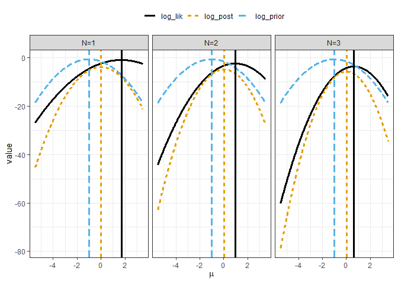

One of the key takeaways from the figure above is, that the the log-likelihood becomes less "shallow" as  increases. Another key point is that the log-posterior (the orange curve) appears to follow the log-likelihood for more of the plotting interval as  increases. Lastly, the posterior mean appears to be closer to the sample average than the prior mean in the  facet.

Let's check the posterior precision and mean expressions to understand why this is the case. For , the posterior precision can be written as:


Substituting the values for  and  into the posterior mean expression gives:


Which can be simplified to:


The weight applied to the sample average is now greater than the weight applied to the prior mean! The posterior mean will therefore continue to become closer and closer to the sample average as  increases. The code chunk below generates a figure showing the results up to the including the first  observations.

``` r
df_logpost %>% 
  tidyr::gather(key = "key", value = "value",
                -num_obs, -mu) %>% 
  filter(num_obs %in% 1:6) %>% 
  ggplot(mapping = aes(x = mu, y = value)) +
  geom_line(mapping = aes(group = interaction(num_obs,
                                              key),
                          color = key,
                          linetype = key),
            size = 1.2) +
  geom_vline(data = post_summary %>% 
               mutate(prior_mu = mu_0) %>% 
               filter(N %in% 1:6) %>% 
               select(num_obs = N, sample_avg, prior_mu, post_mu) %>% 
               tidyr::gather(key = "stat_name", value = "value",
                             -num_obs) %>% 
               mutate(key = ifelse(stat_name == "sample_avg",
                                   "log_lik",
                                   ifelse(stat_name == "prior_mu",
                                          "log_prior",
                                          "log_post"))),
             mapping = aes(xintercept = value,
                           color = key,
                           linetype = key),
             size = 1.25,
             show.legend = FALSE) +
  facet_grid(.~num_obs, labeller = label_bquote(cols = .(sprintf("N=%d", num_obs)))) +
  labs(x = expression(mu)) +
  ggthemes::scale_color_colorblind("") + scale_linetype_discrete("") +
  theme_bw() +
  theme(legend.position = "top")
```

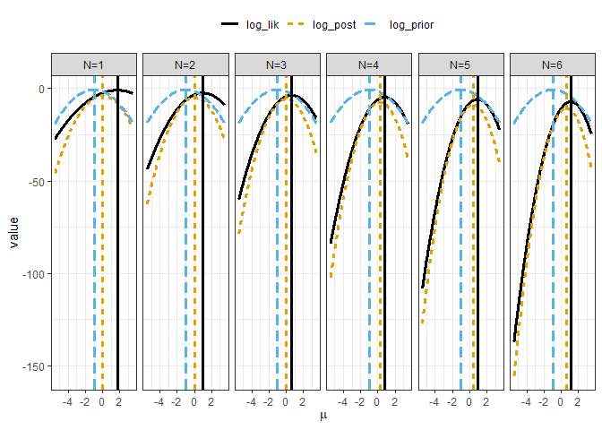

Zoom in on the y-axis to help make it easier to see. As shown below, by  the posterior mean (the vertical dashed orange line) is very close to the sample average (the vertical solid black line).

``` r
df_logpost %>% 
  tidyr::gather(key = "key", value = "value",
                -num_obs, -mu) %>% 
  filter(num_obs %in% 1:6) %>% 
  ggplot(mapping = aes(x = mu, y = value)) +
  geom_line(mapping = aes(group = interaction(num_obs,
                                              key),
                          color = key,
                          linetype = key),
            size = 1.2) +
  geom_vline(data = post_summary %>% 
               mutate(prior_mu = mu_0) %>% 
               filter(N %in% 1:6) %>% 
               select(num_obs = N, sample_avg, prior_mu, post_mu) %>% 
               tidyr::gather(key = "stat_name", value = "value",
                             -num_obs) %>% 
               mutate(key = ifelse(stat_name == "sample_avg",
                                   "log_lik",
                                   ifelse(stat_name == "prior_mu",
                                          "log_prior",
                                          "log_post"))),
             mapping = aes(xintercept = value,
                           color = key,
                           linetype = key),
             size = 1.25,
             show.legend = FALSE) +
  coord_cartesian(ylim = c(-50, 5)) +
  facet_grid(.~num_obs, labeller = label_bquote(cols = .(sprintf("N=%d", num_obs)))) +
  labs(x = expression(mu)) +
  ggthemes::scale_color_colorblind("") + scale_linetype_discrete("") +
  theme_bw() +
  theme(legend.position = "top")
```

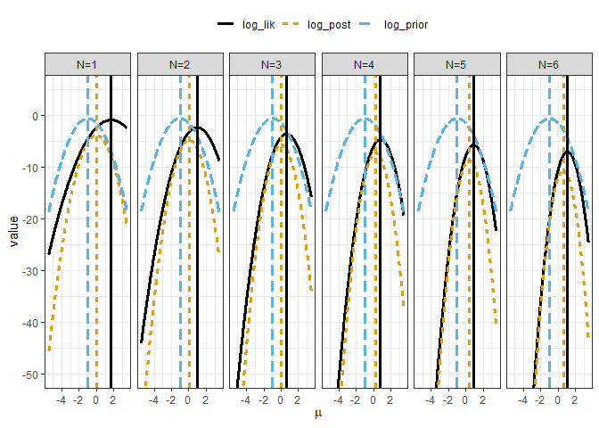

If we focus on the case with , thus all observations are used, we see that the log-posterior appears indistinguishable from the log-likelihood. The figure below may seem a little confusing at first. After all, the log-prior is the same in every figure we have plotted. So why does it appear to be so different now? The key to that question, lies in the scale of the y-axis. With , the  values far from the sample average are ruled to be highly improbable. Remember that we are plotting the log-posterior. The posterior density is  to the value shown on the y-axis. Thus, many of the  values have density values of essentially 0 by .

``` r
df_logpost %>% 
  tidyr::gather(key = "key", value = "value",
                -num_obs, -mu) %>% 
  filter(num_obs %in% 50) %>% 
  ggplot(mapping = aes(x = mu, y = value)) +
  geom_line(mapping = aes(group = interaction(num_obs,
                                              key),
                          color = key,
                          linetype = key),
            size = 1.2) +
  geom_vline(data = post_summary %>% 
               mutate(prior_mu = mu_0) %>% 
               filter(N %in% 50) %>% 
               select(num_obs = N, sample_avg, prior_mu, post_mu) %>% 
               tidyr::gather(key = "stat_name", value = "value",
                             -num_obs) %>% 
               mutate(key = ifelse(stat_name == "sample_avg",
                                   "log_lik",
                                   ifelse(stat_name == "prior_mu",
                                          "log_prior",
                                          "log_post"))),
             mapping = aes(xintercept = value,
                           color = key,
                           linetype = key),
             size = 1.25,
             show.legend = FALSE) +
  facet_grid(.~num_obs, labeller = label_bquote(cols = .(sprintf("N=%d", num_obs)))) +
  labs(x = expression(mu)) +
  ggthemes::scale_color_colorblind("") + scale_linetype_discrete("") +
  theme_bw() +
  theme(legend.position = "top")
```

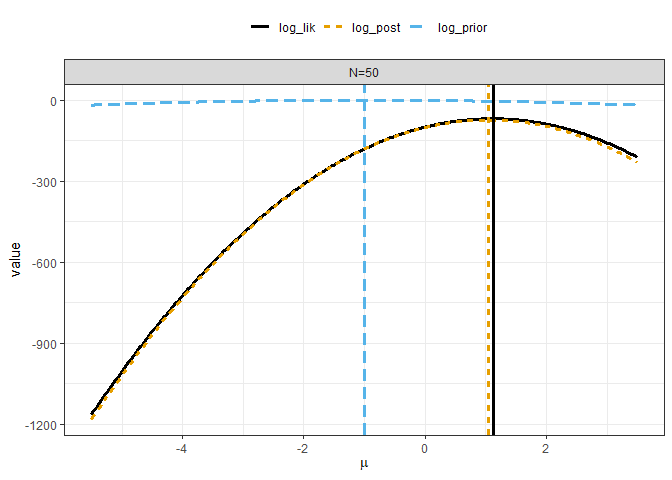

To help visualize the reduction in the posterior uncertainty, the code chunk below creates a trace-style plot showing the posterior mean and posterior 90% uncertainty interval with respect to the number of observations, . The posterior 90% uncertainty interval is represented by the transparent orange ribbon, while the posterior mean is given by the dashed orange line. The sample average with respect to the sample size, , is shown by the solid black line. Lastly, the true mean which was used to generate the random observations is given by the thin red horizontal line.

``` r
post_summary %>% 
  ggplot(mapping = aes(x = N)) +
  geom_hline(yintercept = mu_true, color = "red") +
  geom_ribbon(mapping = aes(ymin = post_mu - 2*post_sd,
                            ymax = post_mu + 2*post_sd),
              fill = "darkorange", alpha = 0.25) +
  geom_line(mapping = aes(y = post_mu,
                          color = "posterior mean",
                          linetype = "posterior mean"),
            size = 1.2) +
  geom_line(mapping = aes(y = sample_avg,
                          color = "sample average",
                          linetype = "sample average"),
            size = 1.2) +
  scale_color_manual("",
                     values = c("posterior mean" = "darkorange",
                                "sample average" = "black")) +
  scale_linetype_manual("",
                     values = c("posterior mean" = "dashed",
                                "sample average" = "solid")) +
  labs(y = expression(mu)) +
  theme_bw() +
  theme(legend.position = "top")
```

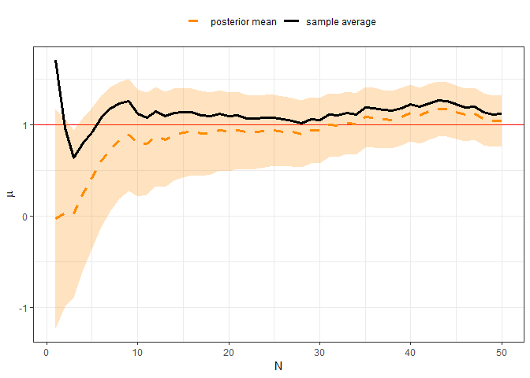

Diffuse prior
-------------

In lecture 04, we also discussed what happens if we use a **diffuse** or **ignorant** prior compared to an **informative** one. We stepped through how the posterior distribution on  converges in the limit of  to:

 \approx \mathrm{normal}\left( \mu \mid \overline{x}, \frac{\sigma}{\sqrt{N}} \right)
")

We will now define a diffuse prior for our example. Instead of using , let's instead use  or 10 times the known likelihood standard deviation! In the code chunk below, the new diffuse prior standard deviation is defined as `tau_0_diffuse` and the two priors are compared relative to the 50 observations. As shown below, the diffuse prior is nearly uniform over the plotting interval.

``` r
tau_0_diffuse <- 10

### compare the informative vs diffuse priors
tibble::tibble(
  x = x
) %>% 
  ggplot(mapping = aes(x = x)) +
  geom_histogram(bins = 15,
                 mapping = aes(y = stat(density))) +
  geom_rug() +
  stat_function(data = data.frame(x = mu_0 + c(-4*tau_0, 4*tau_0)),
                mapping = aes(color = "informative prior"),
                fun = dnorm, 
                args = list(mean = mu_0, sd = tau_0),
                size = 1.15) +
  stat_function(data = data.frame(x = mu_0 + c(-4*tau_0, 4*tau_0)),
                mapping = aes(color = "diffuse prior"),
                fun = dnorm, 
                args = list(mean = mu_0, sd = tau_0_diffuse),
                size = 1.15) +
  scale_color_manual("", 
                     values = c("informative prior" = "dodgerblue",
                                "diffuse prior" = "purple")) +
  theme_bw() +
  theme(legend.position = "top")
```

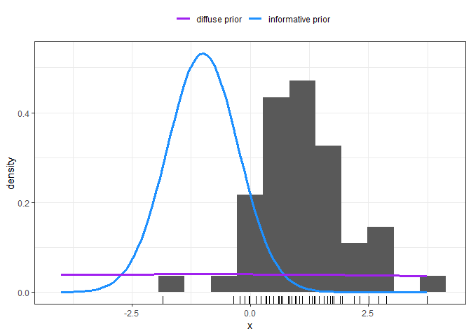

Because we defined our analysis within functions, we can repeat our previous analysis with just a few lines of code. We need to define a new list of hyperparameter values, and then pass that new list into the `eval_logpost()` through a `purrr::map_dfr()` to loop over the number of observations. The code chunk below performs all of the necessary actions to repeat the analysis with the diffuse prior.

``` r
### package up the hyperparameters with the diffuse prior
hyper_params_diffuse <- list(
  mu_0 = mu_0,
  tau_0 = tau_0_diffuse,
  sigma = sigma_true
)

### calculate the logposterior over the grid of mu values
### based on sequentially adding each observations
df_logpost_diffuse <- purrr::map_dfr(seq_along(x),
                                     eval_logpost,
                                     xobs = x,
                                     info = hyper_params_diffuse,
                                     mu_grid = mu_grid)
```

#### 

As we did with the informative prior results, let's start analyzing the diffuse prior results for the case with a single observation, . The log-posterior, log-likelihood, and log-prior based on the diffuse prior are plotted with respect to  in the figure below. The log-likelihood is the same as the log-likelihood from the informative prior case. The log-prior however, is clearly different from what we saw before. It is essentially constant over the plotting interval. This causes the log-posterior to be parallel to the log-likelihood. The dashed orange line, in the figure below, is essentially shifted down from the solid black curve. There no longer seems to be balancing act or "pulling" between the prior and likelihood.

``` r
df_logpost_diffuse %>% 
  tidyr::gather(key = "key", value = "value",
                -num_obs, -mu) %>% 
  filter(num_obs == 1) %>% 
  ggplot(mapping = aes(x = mu, y = value)) +
  geom_line(mapping = aes(group = interaction(num_obs,
                                              key),
                          color = key,
                          linetype = key),
            size = 1.2) +
  facet_grid(.~num_obs, labeller = label_bquote(cols = .(sprintf("N=%d", num_obs)))) +
  labs(x = expression(mu)) +
  ggthemes::scale_color_colorblind("") + scale_linetype_discrete("") +
  theme_bw() +
  theme(legend.position = "top")
```

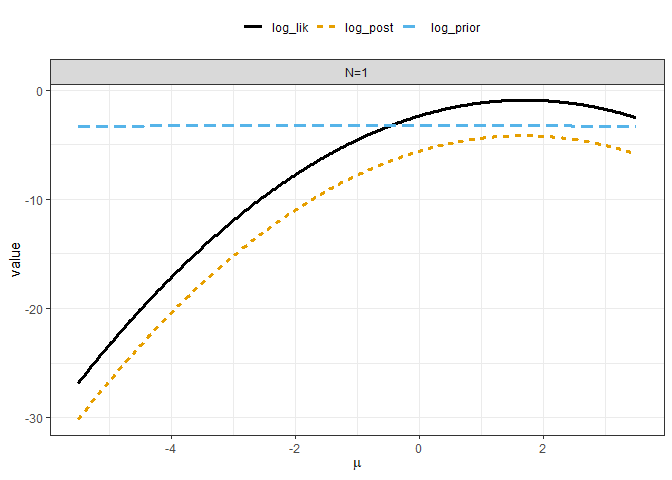

As we did before, let's include the posterior mean, prior mean, and sample average as vertical lines along with the log-densities. The posterior summary statistics are recalculated in the code chunk below.

``` r
post_summary_diffuse <- tibble::tibble(
  xobs = x
) %>% 
  tibble::rowid_to_column("N") %>% 
  mutate(sample_avg = cummean(xobs)) %>% 
  mutate(data_precision = N / sigma_true^2,
         post_prec = 1/tau_0_diffuse^2 + data_precision,
         post_mu = ((1/tau_0_diffuse^2) * mu_0 + data_precision * sample_avg)/post_prec,
         post_sd = sqrt(1 / post_prec))
```

The means are included as vertical lines in the figure below. Since the log-posterior is essentially just shifted down from the log-likelihood the posterior mean is nearly identical to the sample average. The log-prior has no impact at all!

``` r
df_logpost_diffuse %>% 
  tidyr::gather(key = "key", value = "value",
                -num_obs, -mu) %>% 
  filter(num_obs %in% 1) %>% 
  ggplot(mapping = aes(x = mu, y = value)) +
  geom_line(mapping = aes(group = interaction(num_obs,
                                              key),
                          color = key,
                          linetype = key),
            size = 1.2) +
  geom_vline(data = post_summary_diffuse %>% 
               mutate(prior_mu = mu_0) %>% 
               filter(N %in% 1) %>% 
               select(num_obs = N, sample_avg, prior_mu, post_mu) %>% 
               tidyr::gather(key = "stat_name", value = "value",
                             -num_obs) %>% 
               mutate(key = ifelse(stat_name == "sample_avg",
                                   "log_lik",
                                   ifelse(stat_name == "prior_mu",
                                          "log_prior",
                                          "log_post"))),
             mapping = aes(xintercept = value,
                           color = key,
                           linetype = key),
             size = 1.25,
             show.legend = FALSE) +
  facet_grid(.~num_obs, labeller = label_bquote(cols = .(sprintf("N=%d", num_obs)))) +
  labs(x = expression(mu)) +
  ggthemes::scale_color_colorblind("") + scale_linetype_discrete("") +
  theme_bw() +
  theme(legend.position = "top")
```

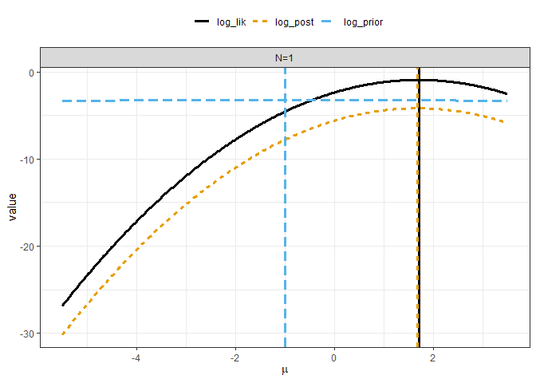

To see why this is the case mathematically, let's look at the posterior precision after a single observation. To make it clear we are working from the diffuse prior, denote the prior standard deviation as .


 Substituting in the values gives the posterior precision at  to be:


The posterior precision is approximately equal to 1. Thus, the posterior precision after 1 observation is already essentially equal to the data precision! We can therefore anticipate that the weights in the posterior mean expression will be dominated by the sample mean term. To confirm that is indeed true, substitute in the values into the posterior mean expression for :


Which can be simplified to yield:


If the prior mean and the sample average are of similar orders of magnitude, the weight from the prior precision is so low that the posterior mean will be approximately equal to the sample average. This is indeed true, as seen by printing the observed value and the posterior mean to the screen:

``` r
post_summary_diffuse %>% 
  filter(N == 1) %>% 
  select(N, sample_avg, post_mu)
```

    ## # A tibble: 1 x 3
    ##       N sample_avg post_mu
    ##   <int>      <dbl>   <dbl>
    ## 1     1       1.70    1.68

Let's now visually compare the diffuse prior and informative prior based results side by side.

``` r
df_logpost %>% 
  mutate(type = "informative prior") %>% 
  bind_rows(df_logpost_diffuse %>% 
              mutate(type = "diffuse prior")) %>% 
  tidyr::gather(key = "key", value = "value",
                -num_obs, -mu, -type) %>% 
  filter(num_obs == 1) %>% 
  ggplot(mapping = aes(x = mu, y = value)) +
  geom_line(mapping = aes(group = interaction(num_obs,
                                              key),
                          color = key,
                          linetype = key),
            size = 1.2) +
  facet_grid(num_obs ~ type, labeller = label_bquote(rows = .(sprintf("N=%d", num_obs)),
                                                     cols = .(type))) +
  labs(x = expression(mu)) +
  ggthemes::scale_color_colorblind("") + scale_linetype_discrete("") +
  theme_bw() +
  theme(legend.position = "top")
```

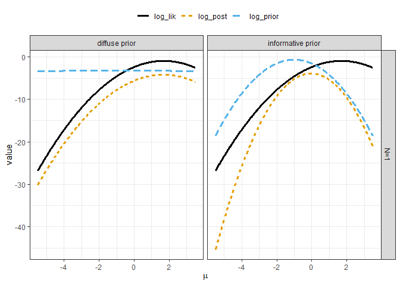

In the figure above, adding the informative log-prior to the log-likelihood produces a log-posterior with a curvature (shape) different from that of the log-likelihood. Equivalently, we could say the log-likelihood "alters" the shape of the log-prior to generate the log-posterior. Either way, the log-posterior truly is a compromise between the two. However, with the diffuse prior the log-prior has minimal influence on the log-likelihood's curvature. Essentially the only impact of the log-prior is to shift the log-likelihood.

#### 

We saw previously that as we increase the sample size, the log-posterior gets closer and closer to the log-likelihood. As we just saw in the case with the diffuse prior, we start out similar to the log-likelihood at . Thus increasing the sample size simply makes the log-posterior even more close together.

Let's continue to compare the diffuse and informative prior results as we increase the sample size. The code chunk below wraps the `ggplot2` figure within a function which allows us to easily loop over the sample size. Notice that for a `ggplot2` figure, we explictly stated we wish to `print()` the figure. That's because `ggplot2` figures will not automatically render when they are called within a loop or iteration scheme.

``` r
compare_post_result_fig <- function(Nuse)
{
  gg <- df_logpost %>% 
  mutate(type = "informative prior") %>% 
  bind_rows(df_logpost_diffuse %>% 
              mutate(type = "diffuse prior")) %>% 
  tidyr::gather(key = "key", value = "value",
                -num_obs, -mu, -type) %>% 
  filter(num_obs %in% Nuse) %>% 
  ggplot(mapping = aes(x = mu, y = value)) +
  geom_line(mapping = aes(group = interaction(num_obs,
                                              key),
                          color = key,
                          linetype = key),
            size = 1.2) +
  facet_grid(num_obs ~ type, labeller = label_bquote(rows = .(sprintf("N=%d", num_obs)),
                                                     cols = .(type))) +
  labs(x = expression(mu)) +
  ggthemes::scale_color_colorblind("") + scale_linetype_discrete("") +
  theme_bw() +
  theme(legend.position = "top")
  
  print(gg)
}
```

Display the comparison figure for the  and  observation cases. Since we are not storing results to an object, we iterate using the `purrr::walk()` function. **Question:** What can you say is similar between the diffuse and informative prior results when  observations are used?

``` r
purrr::walk(c(3, 5, 10, 25),
            compare_post_result_fig)
```

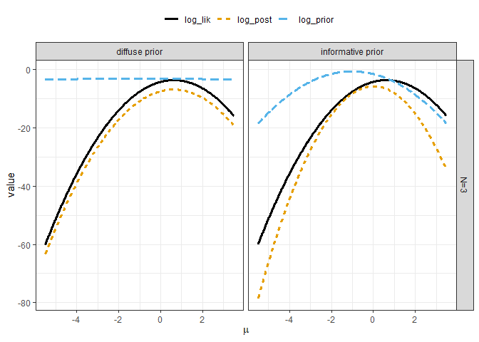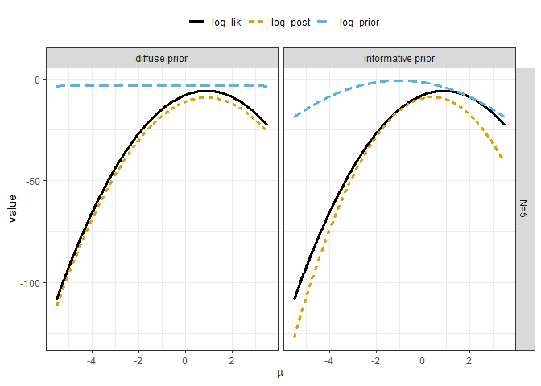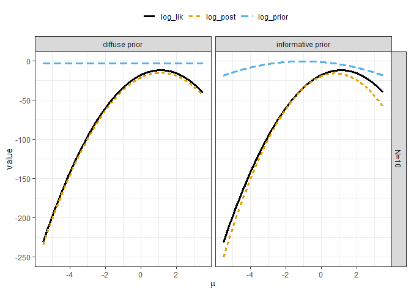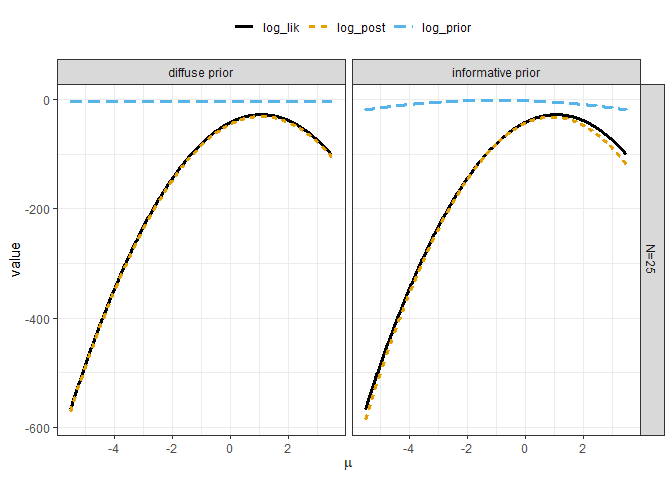

Lastly, compare the posterior summary statistics on  between the diffuse and informative prior cases in the run-style chart. As shown in the figure below, the posterior mean based on the diffuse prior is essentially inline with the sample average.

``` r
post_summary %>% 
  mutate(prior_type = "informative prior") %>% 
  bind_rows(post_summary_diffuse %>% 
              mutate(prior_type = "diffuse prior")) %>% 
  ggplot(mapping = aes(x = N)) +
  geom_hline(yintercept = mu_true, 
             color = "red") +
  geom_ribbon(mapping = aes(ymin = post_mu -2*post_sd,
                            ymax = post_mu +2*post_sd,
                            group = prior_type),
              fill = "darkorange", alpha = 0.25) +
  geom_line(mapping = aes(y = sample_avg,
                          group = prior_type,
                          color = "sample average",
                          linetype = "sample average"),
            size = 1.15) +
  geom_line(mapping = aes(y = post_mu,
                          group = prior_type,
                          color = "posterior mean",
                          linetype = "posterior mean"),
            size = 1.15) +
  facet_grid(. ~ prior_type) +
  scale_color_manual("",
                     values = c("posterior mean" = "darkorange",
                                "sample average" = "black")) +
  scale_linetype_manual("",
                        values = c("posterior mean" = "dashed",
                                   "sample average" = "solid")) +
  labs(y = expression(mu)) +
  theme_bw() +
  theme(legend.position = "top")
```

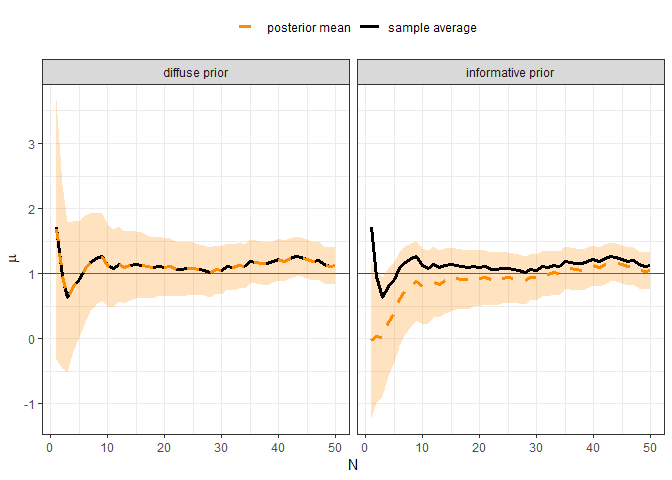

Why use a prior?
----------------

At this point, you might be asking yourself, "What's the point with this prior business?". We have seen how as we collect more data our prior beliefs can start to vanish. We have also seen how if we start out with a very uncertain prior, we "track" or "follow" the sample average after just one observation. So why would we want to bias away from the sample average?

We could answer this by saying this is a contrived "toy" demonstration problem. Although true, that answer is not very satisfactory or comforting. Instead let's focus on the fact that we have up to this point assumed the *data generating process* was relatively *precise* with . What if instead, we had a situation where the *true* standard deviation of the process was ? How would this impact our results?

### Sample size

Let's first consider this from the perspective of the sample size. In the limit of a completely diffuse prior, , the standard deviation on the posterior mean is:


With , the approximate posterior standard deviation after  is therefore:


**If the *true* standard deviation was instead , how many samples would be required to match the above value in the limit of ?** We will denote this new "noisy" process as  and the required sample size as . First, set the expressions equal to each other.


Square both sides:


Solve for :


Substitute in the values and solve for the required sample size:

^2 \cdot 50 = 100 \cdot 50 = 5000
")

We would therefore need 5000 observations to achieve the same posterior precision as we had with the more precise process!

### Simulation study

Let's repeat our synthetic data example, but now with the less precise *data generating process*. The code chunk below defines the noisy standard deviation as `sigma_noisy` and then generates 5000 random observations, using the same *true* mean value as before. The new "noisy" observations are stored in the vector `x_noisy`.

``` r
sigma_noisy <- 10

set.seed(2002)
x_noisy <- rnorm(n = 5000, mean = mu_true, sd = sigma_noisy)
```

The distribution of the noisy observations is visualized below with a histogram. Note that now, the most extreme observations lie less than -25 and greater than +25.

``` r
tibble::tibble(
  x = x_noisy
) %>% 
  ggplot(mapping = aes(x = x)) +
  geom_histogram(bins = 55,
                 mapping = aes(y = stat(density))) +
  geom_rug() +
  theme_bw()
```

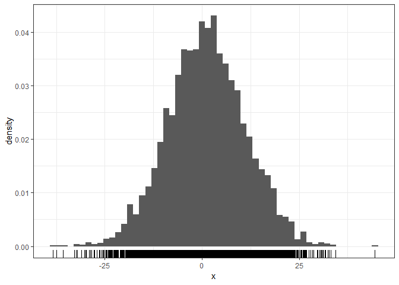

These extreme values are clearly not representative of the true mean value of 1. But, just how rare are they? The probability of finding a value greater than 25 can be calculated using the `pnorm()` function, as shown in the code chunk below:

``` r
100*(1 - pnorm(25, mean = mu_true, sd = sigma_noisy))
```

    ## [1] 0.8197536

Thus, there is less than a 1% chance of finding an extreme value of greater than 25. However, what about a value greater than 10? Or greater than 5? Let's calculate the 25th and 75th quantiles for our noisy *data generating process*:

``` r
qnorm(p = 0.75, mean = mu_true, sd = sigma_noisy)
```

    ## [1] 7.744898

``` r
qnorm(p = 0.25, mean = mu_true, sd = sigma_noisy)
```

    ## [1] -5.744898

We therefore have a 50% chance to find values between -5.74 and 7.74. To visualize the impact of this noisier process, let's overlay the two priors we used previously on top of the histogram of the noisy observations. As shown in the figure below, the diffuse prior from before approximates the distribution of the observations! If all values over the complete range of the observations are allowed, we could be susceptable at being unrepresentative of the true mean at low sample sizes. The informative prior is concentrated within a narrow interval around -1. Visualized in this way, the informative reveals is essentially throwing away the extreme values from being considered within the estimation of the mean. To help see just why that is in fact true, we will repeat our log-posterior calculations from before.

``` r
tibble::tibble(
  x = x_noisy
) %>% 
  ggplot(mapping = aes(x = x)) +
  geom_histogram(bins = 55,
                 mapping = aes(y = stat(density))) +
  geom_rug() +
  stat_function(data = data.frame(x = range(x_noisy)),
                mapping = aes(color = "informative prior"),
                fun = dnorm, 
                args = list(mean = mu_0, sd = tau_0),
                size = 1.15) +
  stat_function(data = data.frame(x = range(x_noisy)),
                mapping = aes(color = "diffuse prior"),
                fun = dnorm, 
                args = list(mean = mu_0, sd = tau_0_diffuse),
                size = 1.15) +
  scale_color_manual("", 
                     values = c("informative prior" = "dodgerblue",
                                "diffuse prior" = "purple")) +
  theme_bw() +
  theme(legend.position = "top")
```

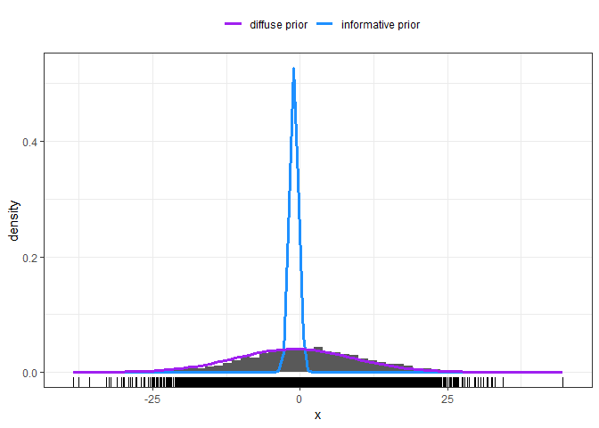

### Informative prior

We will now repeat the log-posterior evaluation. The code chunk below defines a new hyperparameter list, using the **informative** prior standard deviation and the noisy likelihood standard deviation. A new set of grid points are also created spanning a wider range from before. Rather than looping over all 5000 observations, we will just performing the evaluation over the first 200 observations.

``` r
### package up the hyperparameters with the noisy setting
hyper_params_noisy <- list(
  mu_0 = mu_0,
  tau_0 = tau_0,
  sigma = sigma_noisy
)

### create a new set of grid points
mu_grid_new <- seq(-10, 10, length.out = 1001)

### calculate the logposterior over the grid of mu values
### based on sequentially adding each observations
df_logpost_noisy <- purrr::map_dfr(1:200,
                                   eval_logpost,
                                   xobs = x,
                                   info = hyper_params_noisy,
                                   mu_grid = mu_grid_new)
```

#### Visualize results

The log-densities based on the first observation are visualized in the figure below with respect to . As shown below, we have the opposite situation from before! The log-likelihood is now effectively constant over the plotting interval. The log-posterior is parallel to the prior, and thus the posterior shape is the same as the prior shape.

``` r
df_logpost_noisy %>% 
  tidyr::gather(key = "key", value = "value",
                -num_obs, -mu) %>% 
  filter(num_obs == 1) %>% 
  ggplot(mapping = aes(x = mu, y = value)) +
  geom_line(mapping = aes(group = interaction(num_obs,
                                              key),
                          color = key,
                          linetype = key),
            size = 1.2) +
  facet_grid(.~num_obs, labeller = label_bquote(cols = .(sprintf("N=%d", num_obs)))) +
  labs(x = expression(mu)) +
  ggthemes::scale_color_colorblind("") + scale_linetype_discrete("") +
  theme_bw() +
  theme(legend.position = "top")
```

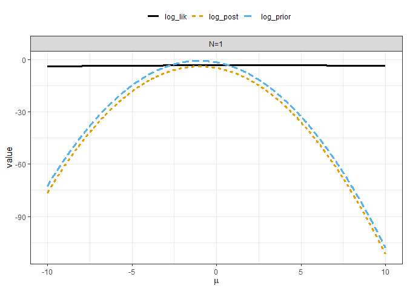

Even after including 12 observations, we stil do not see a major influence from the likelihood.

``` r
df_logpost_noisy %>% 
  tidyr::gather(key = "key", value = "value",
                -num_obs, -mu) %>% 
  filter(num_obs %in% 1:12) %>% 
  ggplot(mapping = aes(x = mu, y = value)) +
  geom_line(mapping = aes(group = interaction(num_obs,
                                              key),
                          color = key,
                          linetype = key),
            size = 1.2) +
  facet_wrap(~num_obs, labeller = label_bquote(.(sprintf("N=%d", num_obs)))) +
  labs(x = expression(mu)) +
  ggthemes::scale_color_colorblind("") + scale_linetype_discrete("") +
  theme_bw() +
  theme(legend.position = "top")
```

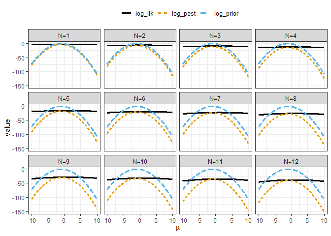

Rather than continuing to plot the log-densities as we increase the sample size further, let's use the posterior summary statistics to see what happens as  gets into the several hundreds. The code chunk below calculates the posterior summaries using the noisy likelihood standard deviation and the informative prior.

``` r
post_summary_noisy <- tibble::tibble(
  xobs = x_noisy
) %>% 
  tibble::rowid_to_column("N") %>% 
  mutate(sample_avg = cummean(xobs)) %>% 
  mutate(data_precision = N / sigma_noisy^2,
         post_prec = 1/tau_0^2 + data_precision,
         post_mu = ((1/tau_0^2) * mu_0 + data_precision * sample_avg)/post_prec,
         post_sd = sqrt(1 / post_prec))
```

The code chunk below plots the posterior summary on  with respsect to the sample size. The sample average is also included along with the true mean value as reference.

``` r
post_summary_noisy %>% 
  ggplot(mapping = aes(x = N)) +
  geom_hline(yintercept = mu_true, color = "red") +
  geom_ribbon(mapping = aes(ymin = post_mu - 2*post_sd,
                            ymax = post_mu + 2*post_sd),
              fill = "darkorange", alpha = 0.25) +
  geom_line(mapping = aes(y = post_mu,
                          color = "posterior mean",
                          linetype = "posterior mean"),
            size = 1.2) +
  geom_line(mapping = aes(y = sample_avg,
                          color = "sample average",
                          linetype = "sample average"),
            size = 1.2) +
  scale_color_manual("",
                     values = c("posterior mean" = "darkorange",
                                "sample average" = "black")) +
  scale_linetype_manual("",
                     values = c("posterior mean" = "dashed",
                                "sample average" = "solid")) +
  labs(y = expression(mu)) +
  theme_bw() +
  theme(legend.position = "top")
```

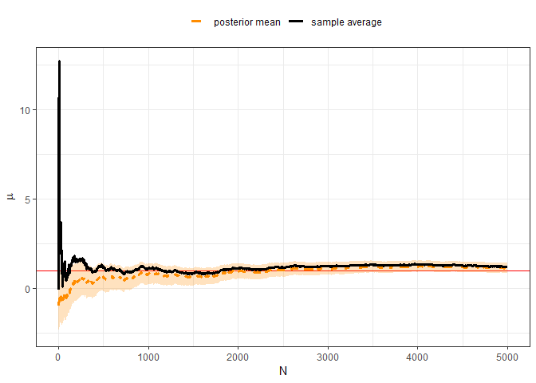

Zoom in to focus on the first 50 observations in the run style chart. As shown below, even though the posterior 90% uncertainty interval misses the true mean over the first 50 observations, the posterior is **not** impacted by small sample sizes to the same effect as the sample average. After 5 observations, the sample average is reporting an estimate of about 13, compared with the posterior mean of about -0.62.

``` r
post_summary_noisy %>% 
  ggplot(mapping = aes(x = N)) +
  geom_hline(yintercept = mu_true, color = "red") +
  geom_ribbon(mapping = aes(ymin = post_mu - 2*post_sd,
                            ymax = post_mu + 2*post_sd),
              fill = "darkorange", alpha = 0.25) +
  geom_line(mapping = aes(y = post_mu,
                          color = "posterior mean",
                          linetype = "posterior mean"),
            size = 1.2) +
  geom_line(mapping = aes(y = sample_avg,
                          color = "sample average",
                          linetype = "sample average"),
            size = 1.2) +
  coord_cartesian(xlim = c(0, 50)) +
  scale_color_manual("",
                     values = c("posterior mean" = "darkorange",
                                "sample average" = "black")) +
  scale_linetype_manual("",
                     values = c("posterior mean" = "dashed",
                                "sample average" = "solid")) +
  labs(y = expression(mu)) +
  theme_bw() +
  theme(legend.position = "top")
```

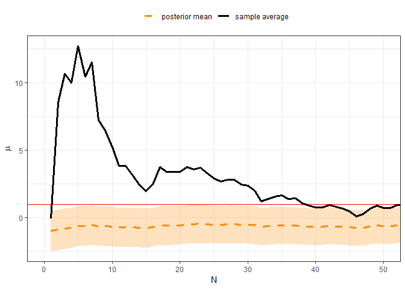

As we saw two figures previously, the sample average and the posterior mean are converging as the sample size gets larger and larger. Let's make that clear by zooming in on the last 1000 samples.

``` r
post_summary_noisy %>% 
  ggplot(mapping = aes(x = N)) +
  geom_hline(yintercept = mu_true, color = "red") +
  geom_ribbon(mapping = aes(ymin = post_mu - 2*post_sd,
                            ymax = post_mu + 2*post_sd),
              fill = "darkorange", alpha = 0.25) +
  geom_line(mapping = aes(y = post_mu,
                          color = "posterior mean",
                          linetype = "posterior mean"),
            size = 1.2) +
  geom_line(mapping = aes(y = sample_avg,
                          color = "sample average",
                          linetype = "sample average"),
            size = 1.2) +
  coord_cartesian(xlim = c(4001, 5000), ylim = c(0, 2)) +
  scale_color_manual("",
                     values = c("posterior mean" = "darkorange",
                                "sample average" = "black")) +
  scale_linetype_manual("",
                     values = c("posterior mean" = "dashed",
                                "sample average" = "solid")) +
  labs(y = expression(mu)) +
  theme_bw() +
  theme(legend.position = "top")
```

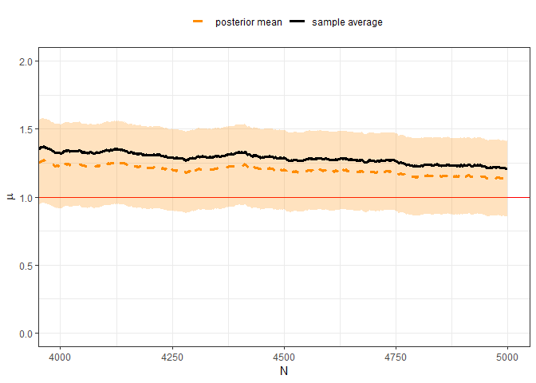

### Other priors?

Setting priors is not easy. With the noisy data, our informative prior helps prevent scatter in the data from impacting our noise estimate at low sample sizes. However, our results still do not seem "satisfactory". In some ways our informative prior appears a little too restrictive. We could retry the analysis with a slightly less restrictive prior such as with , or . **You could build off of the code in this markdown to try out those priors on your own. If we repeated the analysis with a very diffuse prior, such as  what would you expect to happen?**

The true answer for the "best" prior is that...it depends on the situation. Ideally the prior should reflect your current best understanding, your belief, about plausible parameter values. You can take some comfort in the fact that as the sample size increases, if you are "wrong", your belief will be adjusted. But, I personally feel it's best to try out several priors to understand the sensitivity of the posterior to our assumptions, rather than spending the time to find the "absolute best possible prior".
