INFSCI 2595: Lecture 07
================
Dr. Joseph P. Yurko
September 18, 2019

Overview
--------

This week, the lecture material will be entirely contained within the R Markdown rendered report.

Load packages
-------------

This document uses the following packages:

``` r
library(dplyr)
library(ggplot2)
```

In addition, functions from the following `tidyverse` packages are used: `tibble`, `tidyr`, and `purrr`. To completely run all code chunks within the markdown, you must also have the `mvtnorm` package downloaded and installed. The `MASS` package is also required to complete all code chunks.

Model formulation
-----------------

Rather than discussing linear models in terms of fitting a relationship to observed data, let's start out by discussing the model formulation. We wish to model the relationship between a response, output, or outcome, , with respect to an input . Further, we will assume, for now, that we can use a linear relationship to relate the input to the response. If we observed  observations, the model is typically written as:


")

However, in this course, we will not use that notation. Instead of relegating the Gaussian distribution to "the end", appearing in the  term, we will bring the Gaussian distribution to the forefront and define our model as:


")

At first this might seem like an odd change to make, but it highlights several important aspects of the linear model. First, the observed response, , is normally distributed **given** the input, , and the parameters, , , and . Second, based on the notation we have used through this course, the *mean* of the  data point is the functional relationship, . We will now make this point even more clear by rewriting our model in terms of the *linear predictor* :

 \\ \mu_{n} = \beta_{0} + \beta_{1}x_n
")

The first line in the above equation block, is the *stochastic*, or random, portion of the model. It says that the response  is normally distributed given a *mean*, , and standard deviation, . This is the same setup as the normal likelihood we used in Lecture 04...**except**...the mean is not a constant. The mean, , can change observation to observation. Thus, the ")-th observation may have a different mean than the ")-th observation.

How does the mean vary? It is function of the input  and two additional parameters  and . The vector  will be used to denote all of the *linear predictor* parameters. Notice that the mean, , is defined with an equal sign above. This is to denote that the mean is a **deterministic** function. If we know the  parameters and the input , then we will know , precisely. The phrase *linear predictor* represents that , is the "prediction" from the linear model.

The parameters within the expression for the *linear predictor*,  and , correspond to the intercept and the slope, respectively. The slope, , controls the change in  with respect to a change in the input . The intercept, , is the value  takes when .

It is important to note that in the equations above, we factored the likelihood on all observed responses into the product of  separate likelihoods. Therefore, we assumed the  responses are **conditionally** independent given the inputs and the model parameters. The equation block below makes that explicit by writing out the joint likelihood:

 = \prod_{n=1}^{N} \left( p\left( y_{n} \mid \mu_{n}, \sigma \right) \right) \\ \mu_{n} = \beta_{0} + \beta_{1} x_{n}
")

Model behavior
--------------

### Linear predictor

Let's get some practice visualizing how the parameters,  and , influence the relationship between the input and the response. The  define the relationship between the input, , and the linear predictor .  corresponds to the intercept while  is the slope. The slope, , controls the change in  with respect to a change in the input . The intercept, , is the value  takes when . Even though, interpreting the influence of the intercept and slope should be straightforward, we will visualize the linear predictor as a function of the input, at several combinations of  and .

The code chunk below uses the `expand.grid()` function to create a grid of 9 combinations of the two linear predictor parameters.

``` r
beta_grid <- expand.grid(beta_0 = -1:1,
                         beta_1 = -1:1,
                         stringsAsFactors = FALSE,
                         KEEP.OUT.ATTRS = FALSE) %>% 
  as.data.frame() %>% tbl_df()
```

Next, let's define a function to calculate the linear predictor given the  parameters and the input .

``` r
calc_lin_predictor <- function(b0, b1, xn)
{
  
  tibble::tibble(
    x = xn,
    mu = b0 + b1 * xn
  ) %>%
    mutate(beta_0 = b0,
           beta_1 = b1)
}
```

We will evaluate the linear predictor for each of the  and  combinations over a grid of input values ![x \\in \\left\[-3, +3\\right\]](https://latex.codecogs.com/png.latex?x%20%5Cin%20%5Cleft%5B-3%2C%20%2B3%5Cright%5D "x \in \left[-3, +3\right]"). The code chunk below creates the `x` vector between those specified bounds, and the iterates over the pairs of  values with the `purrr` package.

``` r
x <- seq(-3, 3, length.out = 201)

lin_pred_grid <- purrr::map2_dfr(beta_grid$beta_0,
                                 beta_grid$beta_1,
                                 calc_lin_predictor,
                                 xn = x)
```

The output of the code chunk below, shows that `lin_pred_grid` is organized in a long or tall format. One row is one evaluation of the linear predictor for a particular `x` value associated with a `beta_0` and `beta_1` pair. Based on the number of rows in the `beta_grid` object, we know that there are 9 combinations of `beta_0` and `beta_1`.

``` r
lin_pred_grid %>% glimpse()
```

    ## Observations: 1,809
    ## Variables: 4
    ## $ x      <dbl> -3.00, -2.97, -2.94, -2.91, -2.88, -2.85, -2.82, -2.79,...
    ## $ mu     <dbl> 2.00, 1.97, 1.94, 1.91, 1.88, 1.85, 1.82, 1.79, 1.76, 1...
    ## $ beta_0 <int> -1, -1, -1, -1, -1, -1, -1, -1, -1, -1, -1, -1, -1, -1,...
    ## $ beta_1 <int> -1, -1, -1, -1, -1, -1, -1, -1, -1, -1, -1, -1, -1, -1,...

The code chunk below shows how to plot the linear predictor with respect to the input, for each of the 9 combinations. Each subplot corresponds to a specific `beta_0` and `beta_1` pair. The `beta_1` parameter varies with the horizontal subplots, while the `beta_0` parameter values with the vertical subplots. For reference a dashed horizontal line denotes  and a dashed vertical line corresponds to .

``` r
lin_pred_grid %>% 
  mutate(beta_0_plot = forcats::fct_rev(as.factor(beta_0))) %>% 
  ggplot(mapping = aes(x = x, y = mu)) +
  geom_hline(yintercept = 0, color = "grey50", linetype = "dashed") +
  geom_vline(xintercept = 0, color = "grey50", linetype = "dashed") +
  geom_line(mapping = aes(group = interaction(beta_0, beta_1)),
            size = 1.15) +
  facet_grid(beta_0_plot ~ beta_1,
             labeller = label_bquote(rows = beta[0]*"="*.(as.numeric(as.character(beta_0_plot))),
                                     cols = beta[1]*"="*.(beta_1))) +
  labs(y = expression(mu)) +
  theme_bw() +
  theme(strip.text = element_text(size = 12))
```

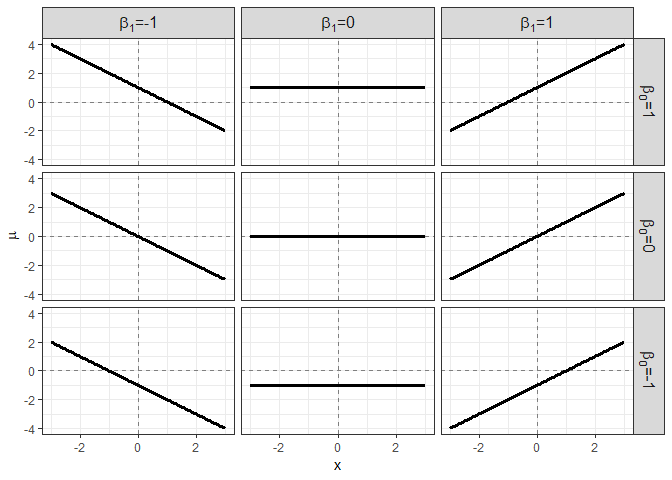

The trends in the above figure should make sense. Starting with the far-left column,  gives a negative relationship between  and . Increasing the value of  causes  to decrease. Moving to the middle column, , the slope is 0 and thus there is no trend at all between  and . The far-right column,  shows a positive relationship, with increasing  resulting in an increase in . Comparing the behavior between the vertical subplots shows the impact of the intercept, . Focusing on the middle column, we see that  shifts the linear predictor up or down.

The  used for the previous figure were simply representative of the primary trends of a decreasing, increasing, and no-relationship between the input and the response. If we used different values for  and , the specific plots would change, but the primary conclusions would be the same.

### Noise

Up to this point, we have not said much about the  parameter.  is the standard deviation within the likelihood of the responses given the linear predictor. Thus,  defines the variability of responses, or the *noise* of the process. The linear predictor can therefore be viewed as the *noise-free* signal "around" which the observed responses are scattered. The level or amount of scatter is controlled by . Low values of  correspond to less noise, while higher values of  yield very noisy observations. Noise As we shall see later on, it is more difficult to learn the parameters of the linear predictor when the *noise* level is high.

To get a sense about the influence of , let's set it at a specific value for now.

``` r
sigma_true <- 0.5
```

The previous figure is recreated below, but with ribbons included to visualize the influence of . Three transparent ribbons are used, one between  around the linear predictor. Another at , and the last at  around the linear predictor.

``` r
lin_pred_grid %>% 
  mutate(beta_0_plot = forcats::fct_rev(as.factor(beta_0))) %>% 
  ggplot(mapping = aes(x = x, y = mu)) +
  geom_hline(yintercept = 0, color = "grey50", linetype = "dashed") +
  geom_vline(xintercept = 0, color = "grey50", linetype = "dashed") +
  geom_ribbon(mapping = aes(ymin = mu - 3*sigma_true,
                            ymax = mu + 3*sigma_true,
                            group = interaction(beta_0, beta_1)),
              fill = "dodgerblue", alpha = 0.25) +
  geom_ribbon(mapping = aes(ymin = mu - 2*sigma_true,
                            ymax = mu + 2*sigma_true,
                            group = interaction(beta_0, beta_1)),
              fill = "dodgerblue", alpha = 0.25) +
  geom_ribbon(mapping = aes(ymin = mu - 1*sigma_true,
                            ymax = mu + 1*sigma_true,
                            group = interaction(beta_0, beta_1)),
              fill = "dodgerblue", alpha = 0.25) +
  geom_line(mapping = aes(group = interaction(beta_0, beta_1)),
            size = 1.15) +
  facet_grid(beta_0_plot ~ beta_1,
             labeller = label_bquote(rows = beta[0]*"="*.(as.numeric(as.character(beta_0_plot))),
                                     cols = beta[1]*"="*.(beta_1))) +
  labs(y = "y") +
  theme_bw() +
  theme(strip.text = element_text(size = 12))
```

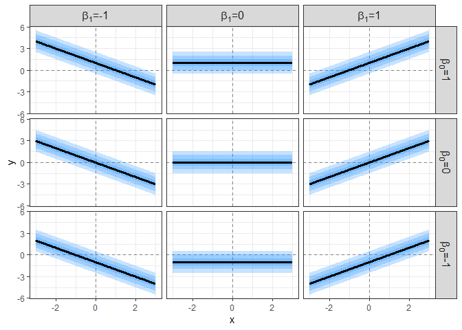

It might be a little overwhelming to look at all 9 subplots. So let's go ahead and focus on a single combination of the  parameters. The code chunk below isolates the  and  subplot. The transparency is used to represent uncertainty. More transparency corresponds to less of a chance of an observation to occur. Remember that for a Gaussian, $$68% of the probability is contained within the  around the mean. That is why in the figures with the ribbons, the least transparent (most opaque) portion is the inner most ribbon closest to the linear predictor line. As we move further away from the mean in either direction, the transparency increases (becomes less opaque), to denote the probability of observing a response decreases. This language shift, from linear predictor to response, is why the y-axis label changed from  to . The likelihood states that specific observations are normally distributed around the linear predictor (the mean), "). The ribbons therefore plot the mean or expected value of the response as well as up to  99.97% uncertainty interval around the linear predctor.

``` r
lin_pred_grid %>% 
  mutate(beta_0_plot = forcats::fct_rev(as.factor(beta_0))) %>% 
  filter(beta_0 == 1, beta_1 == 1) %>% 
  ggplot(mapping = aes(x = x, y = mu)) +
  geom_hline(yintercept = 0, color = "grey50", linetype = "dashed") +
  geom_vline(xintercept = 0, color = "grey50", linetype = "dashed") +
  geom_ribbon(mapping = aes(ymin = mu - 3*sigma_true,
                            ymax = mu + 3*sigma_true,
                            group = interaction(beta_0, beta_1)),
              fill = "dodgerblue", alpha = 0.25) +
  geom_ribbon(mapping = aes(ymin = mu - 2*sigma_true,
                            ymax = mu + 2*sigma_true,
                            group = interaction(beta_0, beta_1)),
              fill = "dodgerblue", alpha = 0.25) +
  geom_ribbon(mapping = aes(ymin = mu - 1*sigma_true,
                            ymax = mu + 1*sigma_true,
                            group = interaction(beta_0, beta_1)),
              fill = "dodgerblue", alpha = 0.25) +
  geom_line(mapping = aes(group = interaction(beta_0, beta_1)),
            size = 1.15) +
  facet_grid(beta_0_plot ~ beta_1,
             labeller = label_bquote(rows = beta[0]*"="*.(as.numeric(as.character(beta_0_plot))),
                                     cols = beta[1]*"="*.(beta_1))) +
  labs(y = "y") +
  theme_bw() +
  theme(strip.text = element_text(size = 12))
```

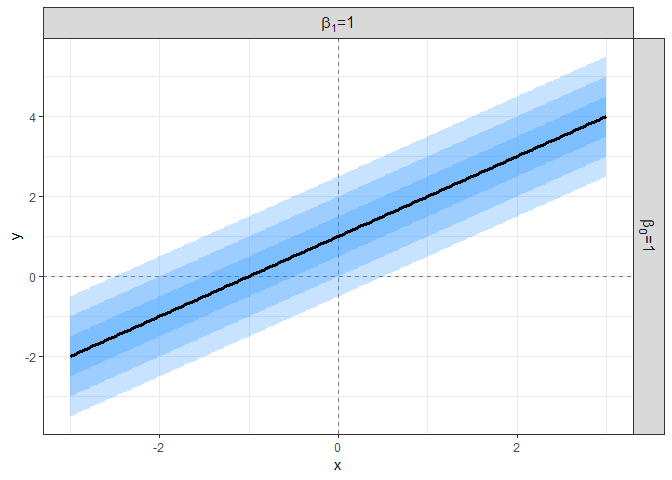

We will now generate random draws from the likelihood, to try and make it clear that the uncertainty intervals are associated with the potential observed values. We will work with a smaller grid of  values compared with that used to draw the linear predictor. Our `calc_lin_predictor()` function is applied by a call to `purrr::map2_dfr()` to handle the book keeping associated with iterating over the  parameters and a small grid of 9 locations between -2 and +2. The result is piped into `mutate()` to create the variable `y`, as shown in the code chunk below.

``` r
set.seed(4001)
rand_pred_grid <- purrr::map2_dfr(beta_grid$beta_0,
                                  beta_grid$beta_1,
                                  calc_lin_predictor,
                                  xn = seq(-2, 2, by = 0.5)) %>% 
  mutate(y = rnorm(n = n(),
                   mean = mu,
                   sd = sigma_true))
```

The `mutate()` function performs several steps together in order to generate the desired number of random samples. First, the `n()` is assigned to the first argument of the `rnorm()` function. The `n()` function returns the total number of rows in the current data object. The `rnorm()` function generates random samples from a gaussian distribution with mean defined by the `mean` argument the standard deviation specified by the `sd` argument. The `mu` variable, which was created by the `calc_lin_predictor()` function is assigned to the `mean` argument. The standard deviation was assumed to be constant, set equal to `sigma_true =` 0.5.

The previous code chunk can be related to the mathmetical format of our model. The `calc_lin_predictor()` function determines the value of the linear predictor, , given  and the input, . We then sample  given  and . In the specific setup we used, each  value within `rand_pred_grid` has exactly 1 random sample associated with it, for each  and  pair. To confirm that is the case, pipe `rand_pred_grid` into the `count()` function and calculate the unique pairs of  parameters, and then the unique  values. Since we used 9 specific  values and 9 unique combinations of the  parameters, we should see exactly 9 rows associated with each unique  and  value, respectively.

``` r
rand_pred_grid %>% 
  count(beta_0, beta_1)
```

    ## # A tibble: 9 x 3
    ##   beta_0 beta_1     n
    ##    <int>  <int> <int>
    ## 1     -1     -1     9
    ## 2     -1      0     9
    ## 3     -1      1     9
    ## 4      0     -1     9
    ## 5      0      0     9
    ## 6      0      1     9
    ## 7      1     -1     9
    ## 8      1      0     9
    ## 9      1      1     9

``` r
rand_pred_grid %>% 
  count(x)
```

    ## # A tibble: 9 x 2
    ##       x     n
    ##   <dbl> <int>
    ## 1  -2       9
    ## 2  -1.5     9
    ## 3  -1       9
    ## 4  -0.5     9
    ## 5   0       9
    ## 6   0.5     9
    ## 7   1       9
    ## 8   1.5     9
    ## 9   2       9

By dispalying our random draws on top of our "ribbon style" plot we can see our noise impacts the apparent relationship between the output and the input. Remember, in our example we are dealing with linear relationships. Any non-linear behavior is artificial. To start out, we continue to focus our attention on the  and  case. The red dots in the figure produced below correspond to our random draws. **Would you say the red dots come from a linear relationship?**

``` r
lin_pred_grid %>% 
  mutate(beta_0_plot = forcats::fct_rev(as.factor(beta_0))) %>% 
  filter(beta_0 == 1, beta_1 == 1) %>% 
  ggplot(mapping = aes(x = x, y = mu)) +
  geom_hline(yintercept = 0, color = "grey50", linetype = "dashed") +
  geom_vline(xintercept = 0, color = "grey50", linetype = "dashed") +
  geom_ribbon(mapping = aes(ymin = mu - 3*sigma_true,
                            ymax = mu + 3*sigma_true,
                            group = interaction(beta_0, beta_1)),
              fill = "dodgerblue", alpha = 0.25) +
  geom_ribbon(mapping = aes(ymin = mu - 2*sigma_true,
                            ymax = mu + 2*sigma_true,
                            group = interaction(beta_0, beta_1)),
              fill = "dodgerblue", alpha = 0.25) +
  geom_ribbon(mapping = aes(ymin = mu - 1*sigma_true,
                            ymax = mu + 1*sigma_true,
                            group = interaction(beta_0, beta_1)),
              fill = "dodgerblue", alpha = 0.25) +
  geom_line(mapping = aes(group = interaction(beta_0, beta_1)),
            size = 1.15) +
  geom_point(data = rand_pred_grid %>% 
               mutate(beta_0_plot = forcats::fct_rev(as.factor(beta_0))) %>% 
               filter(beta_0 == 1, beta_1 == 1),
             mapping = aes(x = x, y = y),
             color = "red", size = 2) +
  facet_grid(beta_0_plot ~ beta_1,
             labeller = label_bquote(rows = beta[0]*"="*.(as.numeric(as.character(beta_0_plot))),
                                     cols = beta[1]*"="*.(beta_1))) +
  labs(y = "y") +
  theme_bw() +
  theme(strip.text = element_text(size = 12))
```


The random draws associated with the other 8  pairs are visualized in the figure below. Ask yourself again, would you expect those random draws are associated with a linear trend?

``` r
lin_pred_grid %>% 
  mutate(beta_0_plot = forcats::fct_rev(as.factor(beta_0))) %>% 
  ggplot(mapping = aes(x = x, y = mu)) +
  geom_hline(yintercept = 0, color = "grey50", linetype = "dashed") +
  geom_vline(xintercept = 0, color = "grey50", linetype = "dashed") +
  geom_ribbon(mapping = aes(ymin = mu - 3*sigma_true,
                            ymax = mu + 3*sigma_true,
                            group = interaction(beta_0, beta_1)),
              fill = "dodgerblue", alpha = 0.25) +
  geom_ribbon(mapping = aes(ymin = mu - 2*sigma_true,
                            ymax = mu + 2*sigma_true,
                            group = interaction(beta_0, beta_1)),
              fill = "dodgerblue", alpha = 0.25) +
  geom_ribbon(mapping = aes(ymin = mu - 1*sigma_true,
                            ymax = mu + 1*sigma_true,
                            group = interaction(beta_0, beta_1)),
              fill = "dodgerblue", alpha = 0.25) +
  geom_line(mapping = aes(group = interaction(beta_0, beta_1)),
            size = 1.15) +
  geom_point(data = rand_pred_grid %>% 
               mutate(beta_0_plot = forcats::fct_rev(as.factor(beta_0))),
             mapping = aes(x = x, y = y),
             color = "red", size = 2) +
  facet_grid(beta_0_plot ~ beta_1,
             labeller = label_bquote(rows = beta[0]*"="*.(as.numeric(as.character(beta_0_plot))),
                                     cols = beta[1]*"="*.(beta_1))) +
  labs(y = "y") +
  theme_bw() +
  theme(strip.text = element_text(size = 12))
```

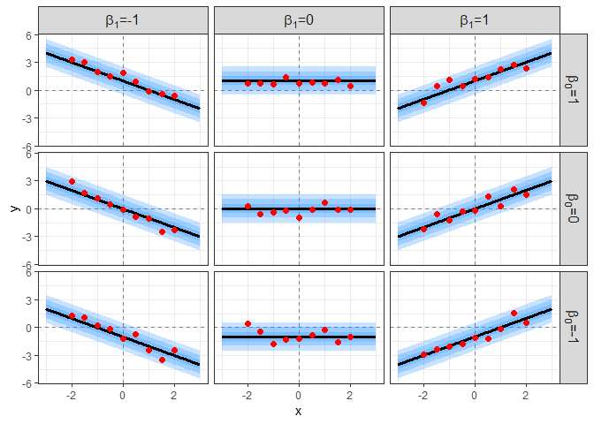

### Increasing sample size

If you do not think the red dots in the previous figures do not appear to be linear, you should then consider what happens as increase the sample size. So let's do that now. The code chunk below defines the  and input grid using the `expand.grid()` function. The fourth variable, `rep_id`, is used as an identifier for each unique *replicate*. So based on the syntax below, we will have each `beta_0`, `beta_1`, and `x` combination appearing 7 times. **Do you understand what actions take place in the `mutate()` call?**

``` r
set.seed(4002)
rand_grid_7 <- expand.grid(beta_0 = -1:1,
                           beta_1 = -1:1,
                           x = seq(-2, 2, by = 0.5),
                           rep_id = 1:7,
                           stringsAsFactors = FALSE,
                           KEEP.OUT.ATTRS = FALSE) %>% 
  as.data.frame() %>% tbl_df() %>% 
  mutate(mu = beta_0 + beta_1 * x,
         y = rnorm(n = n(), mu, sigma_true))
```

Display all 7 *replicate* samples at each of the  positions for one  pair. What do you think the mean of those 7 samples should be at each  position?

``` r
lin_pred_grid %>% 
  mutate(beta_0_plot = forcats::fct_rev(as.factor(beta_0))) %>% 
  filter(beta_0 == 1, beta_1 == 1) %>% 
  ggplot(mapping = aes(x = x, y = mu)) +
  geom_hline(yintercept = 0, color = "grey50", linetype = "dashed") +
  geom_vline(xintercept = 0, color = "grey50", linetype = "dashed") +
  geom_ribbon(mapping = aes(ymin = mu - 3*sigma_true,
                            ymax = mu + 3*sigma_true,
                            group = interaction(beta_0, beta_1)),
              fill = "dodgerblue", alpha = 0.25) +
  geom_ribbon(mapping = aes(ymin = mu - 2*sigma_true,
                            ymax = mu + 2*sigma_true,
                            group = interaction(beta_0, beta_1)),
              fill = "dodgerblue", alpha = 0.25) +
  geom_ribbon(mapping = aes(ymin = mu - 1*sigma_true,
                            ymax = mu + 1*sigma_true,
                            group = interaction(beta_0, beta_1)),
              fill = "dodgerblue", alpha = 0.25) +
  geom_line(mapping = aes(group = interaction(beta_0, beta_1)),
            size = 1.15) +
  geom_point(data = rand_grid_7 %>% 
               mutate(beta_0_plot = forcats::fct_rev(as.factor(beta_0))) %>% 
               filter(beta_0 == 1, beta_1 == 1),
             mapping = aes(x = x, y = y),
             color = "red", size = 2) +
  facet_grid(beta_0_plot ~ beta_1,
             labeller = label_bquote(rows = beta[0]*"="*.(as.numeric(as.character(beta_0_plot))),
                                     cols = beta[1]*"="*.(beta_1))) +
  labs(y = "y") +
  theme_bw() +
  theme(strip.text = element_text(size = 12))
```


Calculate the empirical (sample) average at each  position and denote with a yellow triangle. The triangle points upward if the sample average is greater than , while the triangle points down if the sample average is less than . **Why is the sample average being compared with ?**

``` r
lin_pred_grid %>% 
  mutate(beta_0_plot = forcats::fct_rev(as.factor(beta_0))) %>% 
  filter(beta_0 == 1, beta_1 == 1) %>% 
  ggplot(mapping = aes(x = x, y = mu)) +
  geom_hline(yintercept = 0, color = "grey50", linetype = "dashed") +
  geom_vline(xintercept = 0, color = "grey50", linetype = "dashed") +
  geom_ribbon(mapping = aes(ymin = mu - 3*sigma_true,
                            ymax = mu + 3*sigma_true,
                            group = interaction(beta_0, beta_1)),
              fill = "dodgerblue", alpha = 0.25) +
  geom_ribbon(mapping = aes(ymin = mu - 2*sigma_true,
                            ymax = mu + 2*sigma_true,
                            group = interaction(beta_0, beta_1)),
              fill = "dodgerblue", alpha = 0.25) +
  geom_ribbon(mapping = aes(ymin = mu - 1*sigma_true,
                            ymax = mu + 1*sigma_true,
                            group = interaction(beta_0, beta_1)),
              fill = "dodgerblue", alpha = 0.25) +
  geom_line(mapping = aes(group = interaction(beta_0, beta_1)),
            size = 1.15) +
  geom_point(data = rand_grid_7 %>% 
               mutate(beta_0_plot = forcats::fct_rev(as.factor(beta_0))) %>% 
               filter(beta_0 == 1, beta_1 == 1),
             mapping = aes(x = x, y = y),
             color = "red", size = 2) +
  geom_point(data = rand_grid_7 %>% 
               group_by(beta_0, beta_1, x) %>% 
               summarise(avg_y = mean(y),
                         mu_val = first(mu)) %>% 
               ungroup() %>% 
               mutate(beta_0_plot = forcats::fct_rev(as.factor(beta_0))) %>% 
               filter(beta_0 == 1, beta_1 == 1),
               mapping = aes(x = x, y = avg_y,
                             shape = avg_y >= mu_val),
             fill = "gold", size = 2.5, color = "black") +
  facet_grid(beta_0_plot ~ beta_1,
             labeller = label_bquote(rows = beta[0]*"="*.(as.numeric(as.character(beta_0_plot))),
                                     cols = beta[1]*"="*.(beta_1))) +
  scale_shape_manual(guide = FALSE,
                     values = c("TRUE" = 24,
                                "FALSE" = 25)) +
  labs(y = "y") +
  theme_bw() +
  theme(strip.text = element_text(size = 12))
```

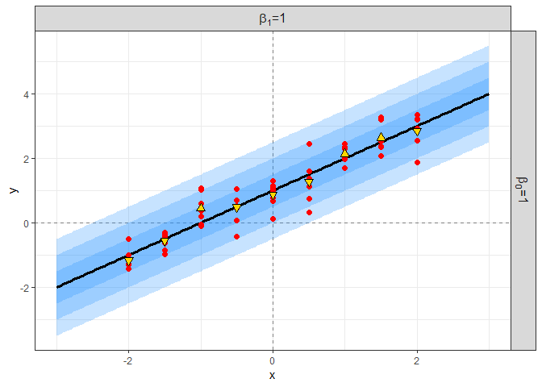

As we increase the sample size, what do you anticipate the sample averages will converge to? Let's check by simulating 25 random samples at each  position.

``` r
set.seed(4003)
rand_grid_25 <- expand.grid(beta_0 = -1:1,
                            beta_1 = -1:1,
                            x = seq(-2, 2, by = 0.5),
                            rep_id = 1:25,
                            stringsAsFactors = FALSE,
                            KEEP.OUT.ATTRS = FALSE) %>% 
  as.data.frame() %>% tbl_df() %>% 
  mutate(mu = beta_0 + beta_1 * x,
         y = rnorm(n = n(), mu, sigma_true))
```

Plot all of the random samples and the new sample averages:

``` r
lin_pred_grid %>% 
  mutate(beta_0_plot = forcats::fct_rev(as.factor(beta_0))) %>% 
  filter(beta_0 == 1, beta_1 == 1) %>% 
  ggplot(mapping = aes(x = x, y = mu)) +
  geom_hline(yintercept = 0, color = "grey50", linetype = "dashed") +
  geom_vline(xintercept = 0, color = "grey50", linetype = "dashed") +
  geom_ribbon(mapping = aes(ymin = mu - 3*sigma_true,
                            ymax = mu + 3*sigma_true,
                            group = interaction(beta_0, beta_1)),
              fill = "dodgerblue", alpha = 0.25) +
  geom_ribbon(mapping = aes(ymin = mu - 2*sigma_true,
                            ymax = mu + 2*sigma_true,
                            group = interaction(beta_0, beta_1)),
              fill = "dodgerblue", alpha = 0.25) +
  geom_ribbon(mapping = aes(ymin = mu - 1*sigma_true,
                            ymax = mu + 1*sigma_true,
                            group = interaction(beta_0, beta_1)),
              fill = "dodgerblue", alpha = 0.25) +
  geom_line(mapping = aes(group = interaction(beta_0, beta_1)),
            size = 1.15) +
  geom_point(data = rand_grid_25 %>% 
               mutate(beta_0_plot = forcats::fct_rev(as.factor(beta_0))) %>% 
               filter(beta_0 == 1, beta_1 == 1),
             mapping = aes(x = x, y = y),
             color = "red", size = 2) +
  geom_point(data = rand_grid_25 %>% 
               group_by(beta_0, beta_1, x) %>% 
               summarise(avg_y = mean(y),
                         mu_val = first(mu)) %>% 
               ungroup() %>% 
               mutate(beta_0_plot = forcats::fct_rev(as.factor(beta_0))) %>% 
               filter(beta_0 == 1, beta_1 == 1),
               mapping = aes(x = x, y = avg_y,
                             shape = avg_y >= mu_val),
             fill = "gold", size = 2.5, color = "black") +
  facet_grid(beta_0_plot ~ beta_1,
             labeller = label_bquote(rows = beta[0]*"="*.(as.numeric(as.character(beta_0_plot))),
                                     cols = beta[1]*"="*.(beta_1))) +
  scale_shape_manual(guide = FALSE,
                     values = c("TRUE" = 24,
                                "FALSE" = 25)) +
  labs(y = "y") +
  theme_bw() +
  theme(strip.text = element_text(size = 12))
```

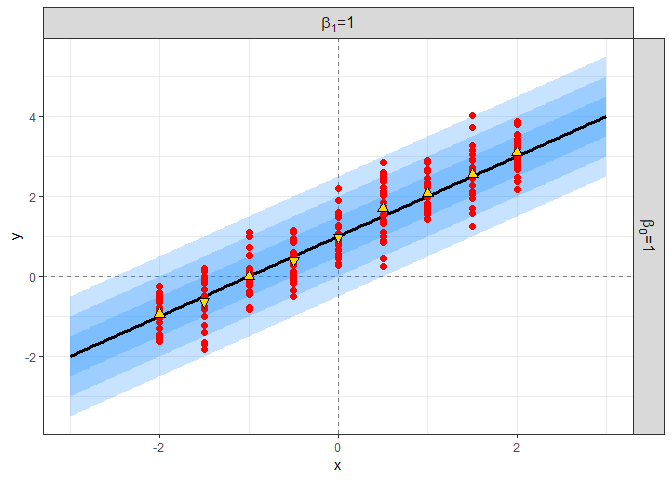

Let's now push the sample size to 1000 to see what what happens in the limit of many, many samples.

``` r
set.seed(4004)
rand_grid_1000 <- expand.grid(beta_0 = -1:1,
                              beta_1 = -1:1,
                              x = seq(-2, 2, by = 0.5),
                              rep_id = 1:1000,
                              stringsAsFactors = FALSE,
                              KEEP.OUT.ATTRS = FALSE) %>% 
  as.data.frame() %>% tbl_df() %>% 
  mutate(mu = beta_0 + beta_1 * x,
         y = rnorm(n = n(), mu, sigma_true))
```

Plot all 1000 random samples and the sample averages at each  position:

``` r
lin_pred_grid %>% 
  mutate(beta_0_plot = forcats::fct_rev(as.factor(beta_0))) %>% 
  filter(beta_0 == 1, beta_1 == 1) %>% 
  ggplot(mapping = aes(x = x, y = mu)) +
  geom_hline(yintercept = 0, color = "grey50", linetype = "dashed") +
  geom_vline(xintercept = 0, color = "grey50", linetype = "dashed") +
  geom_ribbon(mapping = aes(ymin = mu - 3*sigma_true,
                            ymax = mu + 3*sigma_true,
                            group = interaction(beta_0, beta_1)),
              fill = "dodgerblue", alpha = 0.25) +
  geom_ribbon(mapping = aes(ymin = mu - 2*sigma_true,
                            ymax = mu + 2*sigma_true,
                            group = interaction(beta_0, beta_1)),
              fill = "dodgerblue", alpha = 0.25) +
  geom_ribbon(mapping = aes(ymin = mu - 1*sigma_true,
                            ymax = mu + 1*sigma_true,
                            group = interaction(beta_0, beta_1)),
              fill = "dodgerblue", alpha = 0.25) +
  geom_line(mapping = aes(group = interaction(beta_0, beta_1)),
            size = 1.15) +
  geom_point(data = rand_grid_1000 %>% 
               mutate(beta_0_plot = forcats::fct_rev(as.factor(beta_0))) %>% 
               filter(beta_0 == 1, beta_1 == 1),
             mapping = aes(x = x, y = y),
             color = "red", size = 2) +
  geom_point(data = rand_grid_1000 %>% 
               group_by(beta_0, beta_1, x) %>% 
               summarise(avg_y = mean(y),
                         mu_val = first(mu)) %>% 
               ungroup() %>% 
               mutate(beta_0_plot = forcats::fct_rev(as.factor(beta_0))) %>% 
               filter(beta_0 == 1, beta_1 == 1),
               mapping = aes(x = x, y = avg_y,
                             shape = avg_y >= mu_val),
             fill = "gold", size = 2.5, color = "black") +
  facet_grid(beta_0_plot ~ beta_1,
             labeller = label_bquote(rows = beta[0]*"="*.(as.numeric(as.character(beta_0_plot))),
                                     cols = beta[1]*"="*.(beta_1))) +
  scale_shape_manual(guide = FALSE,
                     values = c("TRUE" = 24,
                                "FALSE" = 25)) +
  labs(y = "y") +
  theme_bw() +
  theme(strip.text = element_text(size = 12))
```

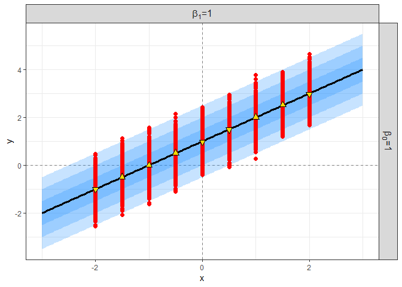

The sample averages are convering to the linear predictor! But, what else can we say about the samples? What shape do the distributions of the random samples take, at each  position? The figure below plots the histogram of the 1000 random  samples at each  position per subplot. All of the subplots correspond to the case of  and . All of the distributions are essentially Gaussians, because the likelihood is Gaussian!

``` r
rand_grid_1000 %>% 
  filter(beta_0 == 1, beta_1 == 1) %>% 
  ggplot(mapping = aes(x = y)) +
  geom_histogram(bins = 35, 
                 mapping = aes(group = x)) +
  facet_wrap(~ x, labeller = "label_both") +
  theme_bw() +
  theme(axis.text.y = element_blank())
```

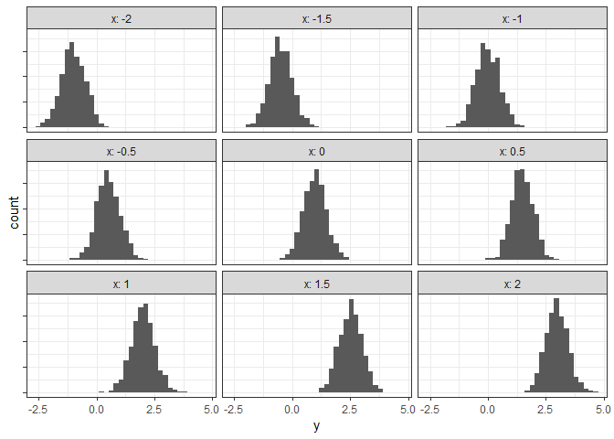

Model fitting
-------------

Now that we are comfortable with the model, let's focus on "fitting" the model. We observe  pairs of the input and the response, . Based on those observations, what can we say about the  and  parameters? Well, let's start out by assuming that  is known. Thus, we have to learn only **two** unknown parameters,  and .

### Synthetic data

We will generate synthetic data from specified *true* parameter values. We will then *learn* or *update* the parameters based on the observations and compare our *updated beliefs* with the known true parameter values. This verification style, *method of manufacturing solutions* approach is very useful making sure we setup the learning problem correctly. We know all aspects of the *data generating process* which produces the observations, and so we can check if there are errors in our code, as well as study impacts of noise and sample size on our ability to learn the true values which created the data.

#### Problem specification

We will assume the true parameters of the data generating process are, , , and . We will assume that the input variable, , has a standard normal distribution. Thus, our  *training points* will not be uniformly spaced between some lower and upper bound on the input variable.

The code chunk below generates 100 random observations of the input, , and then calculates the *true* linear predictor value based on the assumed *true* parameter values. Random observations are then generated using the assumed *true*  value.

``` r
### set the true linear predictor coefficients
beta_0_true <- -0.25
beta_1_true <- 1.15

### generate random input values
set.seed(4100)
x_demo <- rnorm(n = 100, mean = 0, sd = 1)

### evaluate the linear predictor and generate
### random, noisy observations
demo_df <- tibble::tibble(
  x = x_demo
) %>% 
  mutate(mu = beta_0_true + beta_1_true * x,
         y = rnorm(n = n(), mean = mu, sd = sigma_true))
```

All 100 observations are plotted as a scatter plot between the response and the input below. The observations are shown as red dots. For context, the *true* linear predictor and *true* uncertainty intervals (similar to the previous ribbon figures) are dispalyed behind the observations.

``` r
### create the fine grid for visualization
demo_fine <- tibble::tibble(
  x = seq(-2.5, 2.5, length.out = 101)
) %>% 
  mutate(mu = beta_0_true + beta_1_true * x)

### visualize the observations relative to the true data
### generating process
demo_fine %>% 
  ggplot(mapping = aes(x = x)) +
  geom_ribbon(mapping = aes(ymin = mu - 3 * sigma_true,
                            ymax = mu + 3 * sigma_true,
                            group = 1),
              fill = "dodgerblue", alpha = 0.25) +
  geom_ribbon(mapping = aes(ymin = mu - 2 * sigma_true,
                            ymax = mu + 2 * sigma_true,
                            group = 1),
              fill = "dodgerblue", alpha = 0.25) +
  geom_ribbon(mapping = aes(ymin = mu - 1 * sigma_true,
                            ymax = mu + 1 * sigma_true,
                            group = 1),
              fill = "dodgerblue", alpha = 0.25) +
  geom_line(mapping = aes(y = mu,
                          group = 1),
            color = "black", size = 1.15) +
  geom_point(data = demo_df,
             mapping = aes(y = y),
             color = "red", size = 2) +
  labs(x = "x", y = "y") +
  theme_bw() +
  theme(axis.title = element_text(size = 11))
```

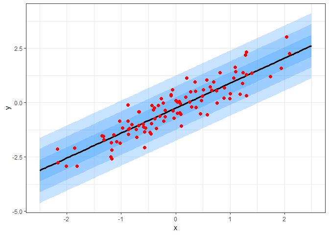

Rather than working with all 100 observations out of the gate, let's start with the first 10 observations. Since all of the input values were generated randomly, we can say in this scenario that we randomly selected the first 11 observations. the figure below repeats the previous figure, but now marks the first 10 points with red, and the remaining observations in dark grey.

``` r
demo_fine %>% 
  ggplot(mapping = aes(x = x)) +
  geom_ribbon(mapping = aes(ymin = mu - 3 * sigma_true,
                            ymax = mu + 3 * sigma_true,
                            group = 1),
              fill = "dodgerblue", alpha = 0.25) +
  geom_ribbon(mapping = aes(ymin = mu - 2 * sigma_true,
                            ymax = mu + 2 * sigma_true,
                            group = 1),
              fill = "dodgerblue", alpha = 0.25) +
  geom_ribbon(mapping = aes(ymin = mu - 1 * sigma_true,
                            ymax = mu + 1 * sigma_true,
                            group = 1),
              fill = "dodgerblue", alpha = 0.25) +
  geom_line(mapping = aes(y = mu,
                          group = 1),
            color = "black", size = 1.15) +
  geom_point(data = demo_df %>% 
               tibble::rowid_to_column("obs_id"),
             mapping = aes(y = y,
                           color = obs_id > 10),
             size = 2) +
  scale_color_manual("",
                     values = c("TRUE" = "grey30",
                                "FALSE" = "red"),
                     labels = c("TRUE" = "last 90 points",
                                "FALSE" = "first 10 points")) +
  labs(x = "x", y = "y") +
  theme_bw() +
  theme(axis.title = element_text(size = 11),
        legend.position = "top")
```

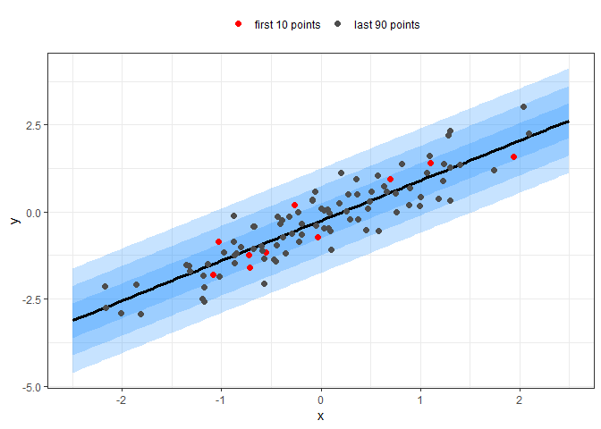

Let's subset the complete set of observations into just the first 10 points and name that as the training set.

``` r
train_df <- demo_df %>% 
  tibble::rowid_to_column("obs_id") %>% 
  slice(1:10)
```

### Learning

We will follow a complete Bayesian formulation for the learning problem. We will therefore update our prior belief about the unknown parameters given the observations. After updating, our posterior belief is represented by the posterior distribution. The posterior distribution can be written as being proportional to:

 \propto p\left( \mathrm{y} \mid \mathrm{x}, \boldsymbol{\beta}, \sigma \right) p\left( \boldsymbol{\beta} \right)
")

#### Prior specification

We must specify our prior beliefs about the unknown  parameters. Let's keep things simple for now, and assume independent standard normals. The prior can therefore be written as:

 = p\left(\beta_{0}\right) p\left( \beta_{1} \right) = \mathrm{normal}\left( \beta_{0} \mid 0, 1 \right) \mathrm{normal}\left(\beta_{1} \mid 0,1 \right)
")

How should we expect this prior to influence our learning? Well, for either parameter, we can calculate the prior probability the parameter is below/above certain threshold values. For example, the prior probability that the slope is less than or equal to a value of 2:

``` r
pnorm(2, mean = 0, sd = 1)
```

    ## [1] 0.9772499

Since we are using Gaussian distributions, our prior probability is symmetric about the prior mean. Thus, we are placing equal prior chance on positive slopes, as we are negative slopes. Depending on the context of the problem, we might want to favor one over the other. For now, we will continue to use our standard normal.

The questions and statements we just discussed were in terms of a single parameter. Our prior though encomposses both parameters within the model, the slope and the intercept. To consider how our assumption impacts the two of them together, let's visualize the *joint* distribution. **Since we have already specified we are assuming the parameters are independent *a priori* what do you expect the prior distribution looks like?**

Before visualizing the joint prior distribution, let's introduce the `"matrix"` data type. We used the `"matrix"` last week when we covered the Laplace approximation, but we did not really discuss it. In `R`, `data.frame`s and `tibble`s, and lists can be thought of as "containers" of data. Although we can perform math on variables within a `data.frame`, or even apply a mathematical operation to all of the columns of a `data.frame`, we **cannot** perform linear algebra operations with them. Linear algebra is reserved for `"vector"`s and `"matrix"` data types.

The code chunk below creates a simple  matrix. The elements consist of the integers 1 through 4. This setup helps show you how a matrix is "filled", when it is created from a vector. Notice that I set the `byrow` argument to be `TRUE`. This means that the matrix fills along a row, rather than down a column.

``` r
matrix(c(1, 2, 3, 4), nrow = 2, byrow = TRUE)
```

    ##      [,1] [,2]
    ## [1,]    1    2
    ## [2,]    3    4

Let's now define the prior mean vector and prior covariance matrix for our assumed prior.

``` r
my_prior_mean <- c(0, 0)
my_prior_cov <- matrix(c(1, 0, 0, 1), nrow = 2, byrow = TRUE)
```

Let's define a grid of possible parameter values, and then evaluate the log-prior density over that grid.

``` r
### create the grid of intercept and slope values
beta_param_grid <- expand.grid(beta_0 = seq(-4, 4, length.out = 251),
                               beta_1 = seq(-4, 4, length.out = 251),
                               KEEP.OUT.ATTRS = FALSE,
                               stringsAsFactors = FALSE) %>% 
  as.data.frame() %>% tbl_df()

### evaluate the log-prior density with `mvtnorm::dmvnorm()`
beta_prior_log_density <- mvtnorm::dmvnorm(as.matrix(beta_param_grid),
                                           mean = my_prior_mean,
                                           sigma = my_prior_cov,
                                           log = TRUE)

### bring the result to the grid of values
beta_prior_grid <- beta_param_grid %>% 
  mutate(log_prior = beta_prior_log_density)
```

We can now visualize the log-prior density surface. The color scheme is consistent with what we used last week. Grey regions correspond to  and  values with less than 0.01% prior probability. **Is this what you expected the prior to look like?** Because this is a synthetic data problem, the *true* parameter values are shown as vertical and horizontal red dashed lines.

``` r
beta_prior_grid %>% 
  mutate(log_prior_2 = log_prior - max(log_prior)) %>% 
  ggplot(mapping = aes(x = beta_1, y = beta_0)) +
  geom_raster(mapping = aes(fill = log_prior_2)) +
  stat_contour(mapping = aes(z = log_prior_2),
               breaks = log(c(0.01/100, 0.01, 0.1, 0.5, 0.9)),
               size = 2.2,
               color = "black") +
  geom_hline(yintercept = beta_0_true,
             color = "red", linetype = "dashed") +
  geom_vline(xintercept = beta_1_true,
             color = "red", linetype = "dashed") +
  coord_fixed(ratio = 1) +
  scale_fill_viridis_c(guide = FALSE, option = "viridis",
                       limits = log(c(0.01/100, 1.0))) +
  labs(x = expression(beta[1]), y = expression(beta[0])) +
  theme_bw() +
  theme(legend.position = "top",
        axis.text = element_text(size = 12),
        axis.title = element_text(size = 12))
```

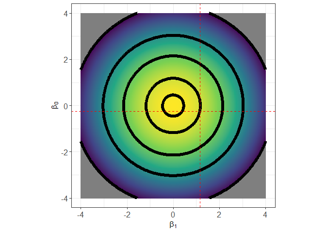

#### Probability model

We are now in a position to write out the complete probability model accounting for the likelihood and the prior. We will write the complete model in terms of the individual likelihoods associated with each observation. The format used in the equation block below is that the top line is the -th likelihood. The second line down gives the deterministic relationship. After that, the priors on all parameters are specified. The model is:

 \\ \mu_{n} = \beta_{0} + \beta_{1}x_{n} \\ \beta_{0} \sim \mathrm{normal}\left( \beta_{0} \mid 0, 1 \right) \\ \beta_{1} \sim \mathrm{normal}\left( \beta_{1} \mid 0, 1 \right)
")

#### Log-posterior

How can we "fit" the parameters in our model, given the observed data? Last week we saw two potential fitting schemes. The first was the grid approximation, which evaluates the log-posterior over a fine grid of possible parameter values. The second was the Laplace approximation, which approximated the arbitrary posterior with a multivariate normal (MVN) distribution. We saw both techniques in the context of the fitting distributions, but both methods are general. They can both be applied to fitting models as well!

As we also discussed last week, the grid approximation does not scale well to more than 2, maybe 3 parameters. Since we only have two parameters at the moment, we can apply the grid approximation to our problem. After visualizing the "true" log-posterior surface with the grid approximation, we will apply the Laplace approximation to this problem.

In order to apply either technique, we need to create a function which evaluates the log-posterior. The code chunk below, does just that, using the format and nomenclature from last week. The function `lm_logpost_01()` has two input arguments: `theta` and `my_info`. The  parameter values are contained within the `theta` input vector argument, while the list `my_info` contains all other information required to evaluate the log-posterior.

``` r
lm_logpost_01 <- function(theta, my_info)
{
  # unpack the parameter vector
  beta_0 <- theta[1]
  beta_1 <- theta[2]
  
  # calculate linear predictor
  mu <- beta_0 + beta_1 * my_info$xobs
  
  # evaluate the log-likelihood
  log_lik <- sum(dnorm(x = my_info$yobs,
                       mean = mu,
                       sd = my_info$sigma,
                       log = TRUE))
  
  # evaluate the log-prior
  log_prior <- dnorm(x = beta_0,
                     mean = my_info$b0_mu,
                     sd = my_info$b0_sd,
                     log = TRUE) +
    dnorm(x = beta_1,
          mean = my_info$b1_mu,
          sd = my_info$b1_sd,
          log = TRUE)
  
  # sum together
  log_lik + log_prior
}
```

Next, create a wrapper function to manage the execution of the log-posterior over a grid of parameter values.

``` r
eval_logpost_01 <- function(b0_val, b1_val, my_info)
{
  lm_logpost_01(c(b0_val, b1_val), my_info)
}
```

Before executing the function, we need to define our list of information. Let's use the data set consisting of the first 10 points.

``` r
info_use_01 <- list(
  xobs = train_df$x,
  yobs = train_df$y,
  sigma = sigma_true,
  b0_mu = 0,
  b0_sd = 1,
  b1_mu = 0,
  b1_sd = 1
)
```

Let's now evaluate the log-posterior over our prior grid of  values defined in the `beta_param_grid` object. Loop over all of the combinations of the  and  parameters with the `purrr` package, as shown below.

``` r
log_post_result_01 <- purrr::map2_dbl(beta_param_grid$beta_0,
                                      beta_param_grid$beta_1,
                                      eval_logpost_01,
                                      my_info = info_use_01)
```

We can now plot the log-posterior surface in the style that we visualized the log-prior surface. As shown in the figure below, the posterior is highly concentrated around the *true*  values after just 10 observations.

``` r
beta_prior_grid %>% 
  mutate(log_post = log_post_result_01) %>% 
  mutate(log_post_2 = log_post - max(log_post)) %>% 
  ggplot(mapping = aes(x = beta_1, y = beta_0)) +
  geom_raster(mapping = aes(fill = log_post_2)) +
  stat_contour(mapping = aes(z = log_post_2),
               breaks = log(c(0.01/100, 0.01, 0.1, 0.5, 0.9)),
               size = 1.05,
               color = "black") +
  geom_hline(yintercept = beta_0_true,
             color = "red", linetype = "dashed") +
  geom_vline(xintercept = beta_1_true,
             color = "red", linetype = "dashed") +
  coord_fixed(ratio = 1) +
  scale_fill_viridis_c(guide = FALSE, option = "viridis",
                       limits = log(c(0.01/100, 1.0))) +
  labs(x = expression(beta[1]), y = expression(beta[0]),
       title = "Log-posterior based on N = 10 observations") +
  theme_bw() +
  theme(legend.position = "top",
        axis.text = element_text(size = 12),
        axis.title = element_text(size = 12))
```

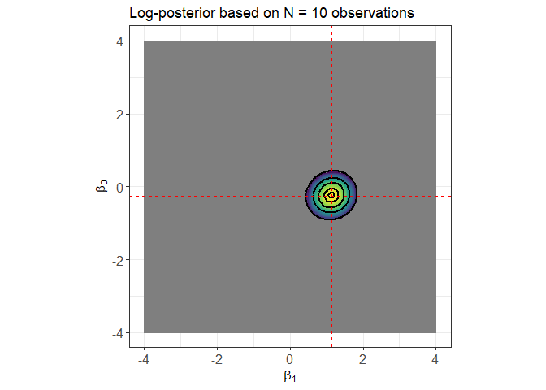

We will now sequentially add one data point at a time, thereby allowing us to "watch" as we moved from the prior to the posterior. This way we can visualize the impact of each observation on the posterior. The figure below repeats the scatter plot between the input and the response, but this time prints the observation index number associated with each of the 10 training points.

``` r
demo_fine %>% 
  ggplot(mapping = aes(x = x)) +
  geom_ribbon(mapping = aes(ymin = mu - 3 * sigma_true,
                            ymax = mu + 3 * sigma_true,
                            group = 1),
              fill = "dodgerblue", alpha = 0.25) +
  geom_ribbon(mapping = aes(ymin = mu - 2 * sigma_true,
                            ymax = mu + 2 * sigma_true,
                            group = 1),
              fill = "dodgerblue", alpha = 0.25) +
  geom_ribbon(mapping = aes(ymin = mu - 1 * sigma_true,
                            ymax = mu + 1 * sigma_true,
                            group = 1),
              fill = "dodgerblue", alpha = 0.25) +
  geom_line(mapping = aes(y = mu,
                          group = 1),
            color = "black", size = 1.15) +
  geom_point(data = demo_df %>% 
               tibble::rowid_to_column("obs_id"),
             mapping = aes(y = y,
                           color = obs_id > 10,
                           size = obs_id > 10)) +
  geom_text(data = demo_df %>% 
              tibble::rowid_to_column("obs_id") %>% 
              filter(obs_id < 11),
            mapping = aes(y = y,
                          label = obs_id),
            color = "white") +
  scale_color_manual("",
                     values = c("TRUE" = "grey30",
                                "FALSE" = "red"),
                     labels = c("TRUE" = "last 90 points",
                                "FALSE" = "first 10 points")) +
  scale_size_manual("",
                    values = c("FALSE" = 5.5,
                               "TRUE" = 1.05),
                    labels = c("TRUE" = "last 90 points",
                                "FALSE" = "first 10 points")) +
  labs(x = "x", y = "y") +
  theme_bw() +
  theme(axis.title = element_text(size = 11),
        legend.position = "top")
```

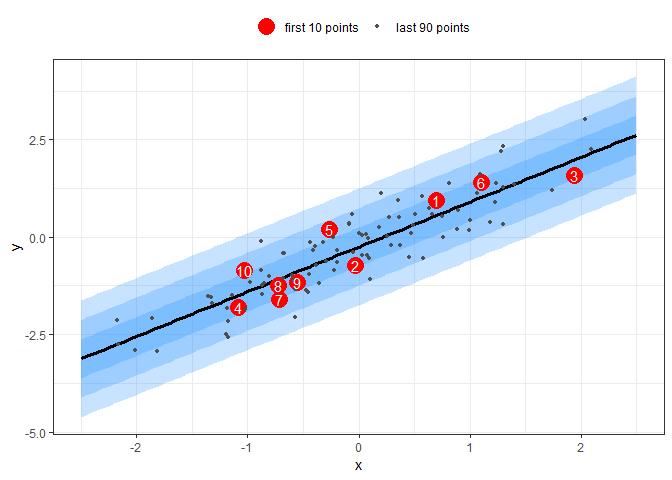

Define a new wrapper function which manages the book keeping and sequential evaluationg of the log-posterior:

``` r
manage_log_post_01 <- function(num_obs, avail_data, my_settings, grid_use)
{
  # pass in the correct number of input/output observations
  my_settings$xobs <- avail_data$x[1:num_obs]
  my_settings$yobs <- avail_data$y[1:num_obs]
  
  lp_val <- purrr::map2_dbl(grid_use$beta_0,
                            grid_use$beta_1,
                            eval_logpost_01,
                            my_info = my_settings)
  
  grid_use %>% 
    mutate(log_post = lp_val,
           N = num_obs)
}
```

After defining a list containing the hyperparameters for the problem, the code chunk below executes the grid approximation by sequentially adding the first 10 data points.

``` r
hyper_list_01 <- list(
  sigma = sigma_true,
  b0_mu = 0,
  b0_sd = 1,
  b1_mu = 0,
  b1_sd = 1
)

log_post_surface_result_01 <- purrr::map_dfr(1:10,
                                             manage_log_post_01,
                                             avail_data = demo_df,
                                             my_settings = hyper_list_01,
                                             grid_use = beta_param_grid)
```

We can now visualize the contour plot of the log-posterior based on the number of observations. Include the prior as the  case. As shown below, it appears that by , the posterior distribution is centered around the *true* parameter values.

``` r
beta_prior_grid %>% 
  rename(log_post = log_prior) %>% 
  mutate(N = 0) %>% 
  bind_rows(log_post_surface_result_01) %>% 
  group_by(N) %>% 
  mutate(max_log_post = max(log_post)) %>% 
  ungroup() %>% 
  mutate(log_post_2 = log_post - max_log_post) %>% 
  ggplot(mapping = aes(x = beta_1, y = beta_0)) +
  stat_contour(mapping = aes(z = log_post_2,
                             group = N),
               breaks = log(c(0.01/100, 0.01, 0.1, 0.5, 0.9)),
               size = 1.05,
               color = "black") +
  geom_hline(yintercept = beta_0_true,
             color = "red", linetype = "dashed") +
  geom_vline(xintercept = beta_1_true,
             color = "red", linetype = "dashed") +
  coord_fixed(ratio = 1) +
  facet_wrap(~N, labeller = "label_both") +
  scale_fill_viridis_c(guide = FALSE, option = "viridis",
                       limits = log(c(0.01/100, 1.0))) +
  labs(x = expression(beta[1]), y = expression(beta[0])) +
  theme_bw() +
  theme(legend.position = "top",
        axis.text = element_text(size = 12),
        axis.title = element_text(size = 12))
```

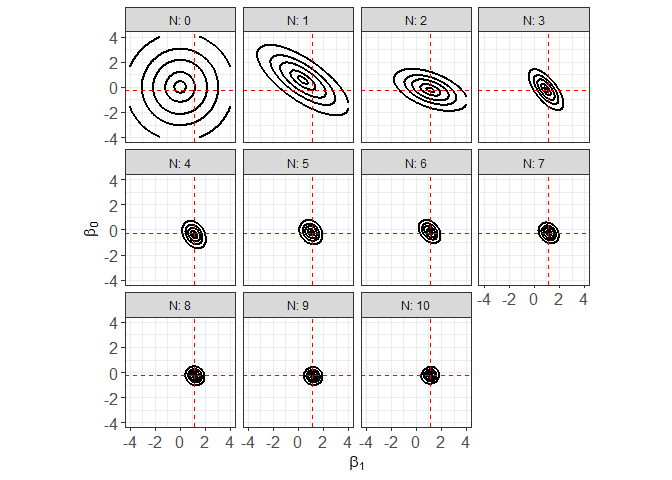

To understand the posterior behavior a little more, let's focus on the  case. The log-posterior surface associated with  is shown below. For additional context, horizontal and vertical light blue lines correspond to the prior mean values.

``` r
beta_prior_grid %>% 
  rename(log_post = log_prior) %>% 
  mutate(N = 0) %>% 
  bind_rows(log_post_surface_result_01) %>% 
  group_by(N) %>% 
  mutate(max_log_post = max(log_post)) %>% 
  ungroup() %>% 
  mutate(log_post_2 = log_post - max_log_post) %>% 
  filter(N == 3) %>% 
  ggplot(mapping = aes(x = beta_1, y = beta_0)) +
  stat_contour(mapping = aes(z = log_post_2,
                             group = N),
               breaks = log(c(0.01/100, 0.01, 0.1, 0.5, 0.9)),
               size = 1.05,
               color = "black") +
  geom_hline(yintercept = info_use_01$b0_mu,
             color = "dodgerblue") +
  geom_vline(xintercept = info_use_01$b1_mu,
             color = "dodgerblue") +
  geom_hline(yintercept = beta_0_true,
             color = "red", linetype = "dashed") +
  geom_vline(xintercept = beta_1_true,
             color = "red", linetype = "dashed") +
  coord_fixed(ratio = 1) +
  facet_wrap(~N, labeller = "label_both") +
  scale_fill_viridis_c(guide = FALSE, option = "viridis",
                       limits = log(c(0.01/100, 1.0))) +
  labs(x = expression(beta[1]), y = expression(beta[0])) +
  theme_bw() +
  theme(legend.position = "top",
        axis.text = element_text(size = 12),
        axis.title = element_text(size = 12))
```

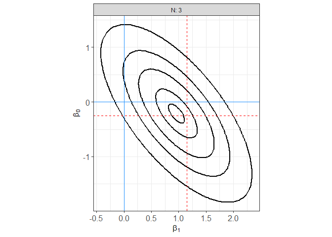

Specify a subset of the complete grid, and plot those identified points on the log-posterior surface for the  case.

``` r
### identify the distinct/unique values of beta_0 and beta_1
### within the zoomed in region for N = 3
focus_beta_grid <- beta_param_grid %>% 
  filter(between(beta_0, -2, 1.5) &
           between(beta_1, -0.5, 2.5))

focus_unique_b0 <- focus_beta_grid %>% 
  distinct(beta_0) %>% 
  arrange(beta_0)

focus_unique_b1 <- focus_beta_grid %>% 
  distinct(beta_1) %>% 
  arrange(beta_1)

### take every 10-th point in each
focus_unique_b0_subset <- focus_unique_b0 %>% 
  slice(seq(1, nrow(focus_unique_b0), by = 10))

focus_unique_b1_subset <- focus_unique_b1 %>% 
  slice(seq(1, nrow(focus_unique_b1), by = 10))

### identify the points to use
isolate_subset_grid_01 <- log_post_surface_result_01 %>% 
  group_by(N) %>% 
  mutate(max_log_post = max(log_post)) %>% 
  ungroup() %>% 
  mutate(log_post_2 = log_post - max_log_post) %>% 
  filter(N == 3) %>% 
  filter(beta_0 %in% focus_unique_b0_subset$beta_0 &
           beta_1 %in% focus_unique_b1_subset$beta_1)
```

``` r
beta_prior_grid %>% 
  rename(log_post = log_prior) %>% 
  mutate(N = 0) %>% 
  bind_rows(log_post_surface_result_01) %>% 
  group_by(N) %>% 
  mutate(max_log_post = max(log_post)) %>% 
  ungroup() %>% 
  mutate(log_post_2 = log_post - max_log_post) %>% 
  filter(N == 3) %>% 
  ggplot(mapping = aes(x = beta_1, y = beta_0)) +
  stat_contour(mapping = aes(z = log_post_2,
                             group = N),
               breaks = log(c(0.01/100, 0.01, 0.1, 0.5, 0.9)),
               size = 1.05,
               color = "black") +
  geom_point(data = isolate_subset_grid_01,
             color = "navyblue", size = 4.25) +
  geom_hline(yintercept = info_use_01$b0_mu,
             color = "dodgerblue") +
  geom_vline(xintercept = info_use_01$b1_mu,
             color = "dodgerblue") +
  geom_hline(yintercept = beta_0_true,
             color = "red", linetype = "dashed") +
  geom_vline(xintercept = beta_1_true,
             color = "red", linetype = "dashed") +
  coord_fixed(ratio = 1) +
  facet_wrap(~N, labeller = "label_both") +
  scale_fill_viridis_c(guide = FALSE, option = "viridis",
                       limits = log(c(0.01/100, 1.0))) +
  labs(x = expression(beta[1]), y = expression(beta[0])) +
  theme_bw() +
  theme(legend.position = "top",
        axis.text = element_text(size = 12),
        axis.title = element_text(size = 12))
```

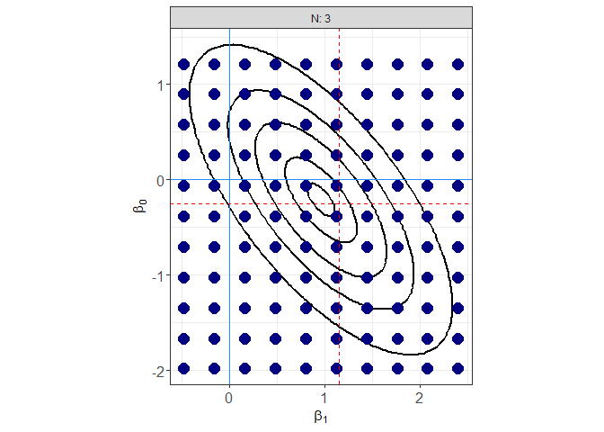

Color each of the markers based on the log-posterior at each  pair. The plot below is essentially a discretized version of the log-posterior surface contour from before.

``` r
beta_prior_grid %>% 
  rename(log_post = log_prior) %>% 
  mutate(N = 0) %>% 
  bind_rows(log_post_surface_result_01) %>% 
  group_by(N) %>% 
  mutate(max_log_post = max(log_post)) %>% 
  ungroup() %>% 
  mutate(log_post_2 = log_post - max_log_post) %>% 
  filter(N == 3) %>% 
  ggplot(mapping = aes(x = beta_1, y = beta_0)) +
  stat_contour(mapping = aes(z = log_post_2,
                             group = N),
               breaks = log(c(0.01/100, 0.01, 0.1, 0.5, 0.9)),
               size = 1.05,
               color = "black") +
  geom_point(data = isolate_subset_grid_01,
             size = 4.25,
             mapping = aes(color = log_post_2)) +
  geom_hline(yintercept = info_use_01$b0_mu,
             color = "dodgerblue") +
  geom_vline(xintercept = info_use_01$b1_mu,
             color = "dodgerblue") +
  geom_hline(yintercept = beta_0_true,
             color = "red", linetype = "dashed") +
  geom_vline(xintercept = beta_1_true,
             color = "red", linetype = "dashed") +
  coord_fixed(ratio = 1) +
  facet_wrap(~N, labeller = "label_both") +
  scale_color_viridis_c(guide = FALSE, option = "viridis",
                        limits = log(c(0.01/100, 1.0))) +
  labs(x = expression(beta[1]), y = expression(beta[0])) +
  theme_bw() +
  theme(legend.position = "top",
        axis.text = element_text(size = 12),
        axis.title = element_text(size = 12))
```

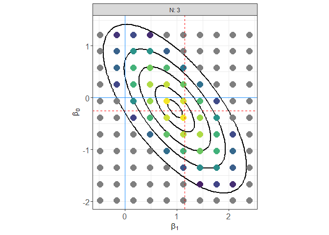

We went through this exercise of creating this "discrete" surface of a "relatively few" points because each  and  pair in the figure above corresponds to a separate linear predictor! We will now evaluate linear predictor at each grid point and plot the result as a function of the input. For context, the three specific observations for the  case are included, along with the true linear predictor.

``` r
purrr::map2_dfr(isolate_subset_grid_01$beta_0,
                isolate_subset_grid_01$beta_1,
                calc_lin_predictor,
                xn = seq(-3, 3, length.out = 31)) %>% 
  ggplot(mapping = aes(x = x, y = mu)) +
  geom_line(mapping = aes(group = interaction(beta_0, beta_1))) +
  geom_point(data = train_df %>% 
               slice(1:3),
             mapping = aes(x = x, y = y),
             color = "red", size = 3.5) +
  geom_abline(slope = beta_1_true, intercept = beta_0_true,
              color = "red", linetype = "dashed", size = 1.05) +
  labs(x = "x", y = expression(mu)) +
  theme_bw()
```

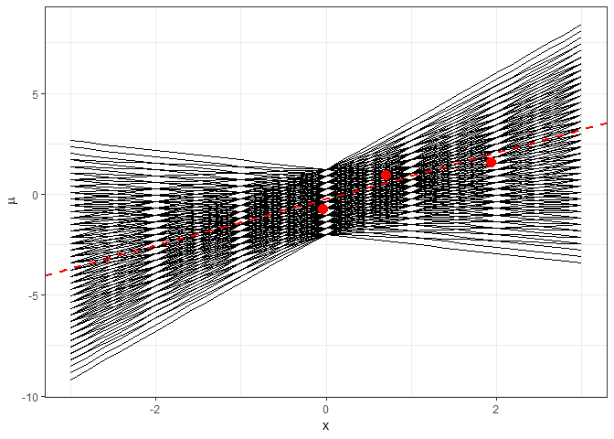

From the log-posterior surface, we know that not all of the  and  pairs are equally probable. In fact, most are highly implausible, and thus the lines corresponding to those unlikely pairs are themselves highly unlikely! To demonstrate this visually, set the transparency of each line to be equal to the posterior probability of the  pair the line corresponds to. All lines that have posterior probabilities of less than 1% have been set to a light grey color. Thus, only the lines that have 1% posterior probaility of occurring are visible. The code chunk below uses the `left_join()` function to merge two datasets together in order to access the `log_post_2` variable. **Which lines have definitely been ruled out as being highly unlikely?**

``` r
purrr::map2_dfr(isolate_subset_grid_01$beta_0,
                isolate_subset_grid_01$beta_1,
                calc_lin_predictor,
                xn = seq(-3, 3, length.out = 31)) %>% 
  left_join(isolate_subset_grid_01 %>% 
              select(beta_0, beta_1, log_post_2),
            by = c("beta_0", "beta_1")) %>% 
  ggplot(mapping = aes(x = x, y = mu)) +
  geom_line(mapping = aes(group = interaction(beta_0, beta_1),
                          alpha = exp(log_post_2),
                          color = exp(log_post_2) > 0.01)) +
  geom_point(data = train_df %>% 
               slice(1:3),
             mapping = aes(x = x, y = y),
             color = "red", size = 3.5) +
  scale_alpha_continuous(guide = FALSE) +
  scale_color_manual(guide = FALSE,
                     values = c("TRUE" = "black",
                                "FALSE" = "grey")) +
  labs(x = "x", y = expression(mu)) +
  theme_bw() +
  theme(legend.position = "top")
```

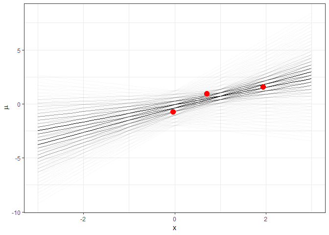

Let's drive this point home by directly sampling parameter pairs from the grid approximate posterior. In the code chunk below, 1000  and  pairs are randomly selected from the posterior. Those random pairs are then used to calculate the posterior linear predictor with respect to the input. All 1000 lines are plotted in the figure generated from the code chunk below.

``` r
### set the posterior probability per beta pair
beta_post_grid_N03 <- beta_prior_grid %>% 
  rename(log_post = log_prior) %>% 
  mutate(N = 0) %>% 
  bind_rows(log_post_surface_result_01) %>% 
  group_by(N) %>% 
  mutate(max_log_post = max(log_post)) %>% 
  ungroup() %>% 
  mutate(log_post_2 = log_post - max_log_post) %>% 
  filter(N == 3)

### sample rows based on the posterior probability
set.seed(4110)
direct_sample_id <- sample(1:nrow(beta_post_grid_N03),
                           size = 1e3,
                           replace = TRUE,
                           prob = exp(beta_post_grid_N03$log_post_2))

beta_post_grid_N03_samples <- beta_post_grid_N03 %>% 
  slice(direct_sample_id)
```

``` r
purrr::map2_dfr(beta_post_grid_N03_samples$beta_0,
                beta_post_grid_N03_samples$beta_1,
                calc_lin_predictor,
                xn = seq(-3, 3, length.out = 31)) %>% 
  ggplot(mapping = aes(x = x, y = mu)) +
  geom_line(mapping = aes(group = interaction(beta_0, beta_1))) +
  geom_point(data = train_df %>% 
               slice(1:3),
             mapping = aes(x = x, y = y),
             color = "red", size = 3.5) +
  geom_abline(slope = beta_1_true, intercept = beta_0_true,
              color = "red", linetype = "dashed", size = 1.05) +
  labs(x = "x", y = expression(mu)) +
  theme_bw()
```

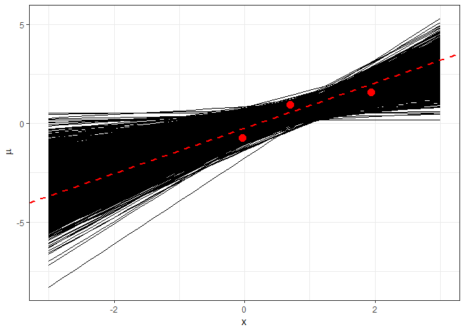

The figure above consists of a dark black band because all lines are fully opague. The important take away is that there are **zero** lines with negative slopes. Summarizing the 1000 lines gives us the posterior summaries on the linear predictor. The figure below represents the middle 95% uncertainty (credible) interval with the grey ribbon and the poster mean as the solid black line.

``` r
purrr::map2_dfr(beta_post_grid_N03_samples$beta_0,
                beta_post_grid_N03_samples$beta_1,
                calc_lin_predictor,
                xn = seq(-3, 3, length.out = 31)) %>% 
  ggplot(mapping = aes(x = x, y = mu)) +
  stat_summary(geom = "ribbon",
               fun.ymax = function(x){quantile(x, 0.95)},
               fun.ymin = function(x){quantile(x, 0.05)},
               fill = "grey50", alpha = 0.75) +
  stat_summary(geom = "line",
               fun.y = "mean",
               color = "black",
               size = 1.2) +
  geom_point(data = train_df %>% 
               slice(1:3),
             mapping = aes(x = x, y = y),
             color = "red", size = 3.5) +
  geom_abline(slope = beta_1_true, intercept = beta_0_true,
              color = "red", linetype = "dashed", size = 1.05) +
  labs(x = "x", y = expression(mu)) +
  theme_bw()
```

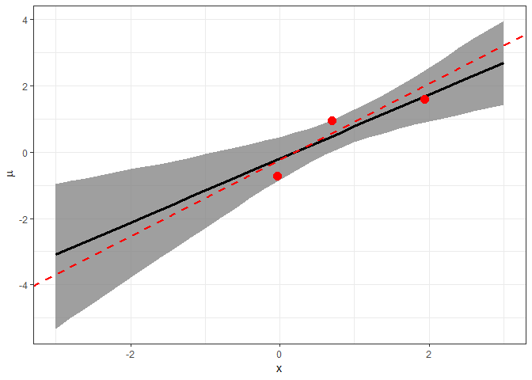

#### Diffuse prior

What if instead of the standard normal priors we used far more uncertain priors? What would you expect to occur? To see what happens, let's specify prior distributions still centered on 0, but now with standard deviations equal to 5 for both the intercept and the slope. In the code chunk below, after defining a new list, the prior surface is recalculated over the same grid of  as before.

``` r
hyper_diffuse_01 <- list(
  sigma = sigma_true,
  b0_mu = 0,
  b0_sd = 5,
  b1_mu = 0,
  b1_sd = 5
)

my_diffuse_prior_cov <- my_prior_cov <- matrix(c(5, 0, 0, 5), nrow = 2, byrow = TRUE)

beta_prior_diffuse_log_density <- mvtnorm::dmvnorm(
  as.matrix(beta_param_grid),
  mean = my_prior_mean,
  sigma = my_diffuse_prior_cov,
  log = TRUE)
```

Visualizing the diffuse prior surface reveals a flatter surface in both parameter directions.

``` r
beta_param_grid %>% 
  mutate(log_prior = beta_prior_diffuse_log_density) %>% 
  mutate(log_prior_2 = log_prior - max(log_prior)) %>% 
  ggplot(mapping = aes(x = beta_1, y = beta_0)) +
  geom_raster(mapping = aes(fill = log_prior_2)) +
  stat_contour(mapping = aes(z = log_prior_2),
               breaks = log(c(0.01/100, 0.01, 0.1, 0.5, 0.9)),
               size = 2.2,
               color = "black") +
  geom_hline(yintercept = beta_0_true,
             color = "red", linetype = "dashed") +
  geom_vline(xintercept = beta_1_true,
             color = "red", linetype = "dashed") +
  coord_fixed(ratio = 1) +
  scale_fill_viridis_c(guide = FALSE, option = "viridis",
                       limits = log(c(0.01/100, 1.0))) +
  labs(x = expression(beta[1]), y = expression(beta[0])) +
  theme_bw() +
  theme(legend.position = "top",
        axis.text = element_text(size = 12),
        axis.title = element_text(size = 12))
```

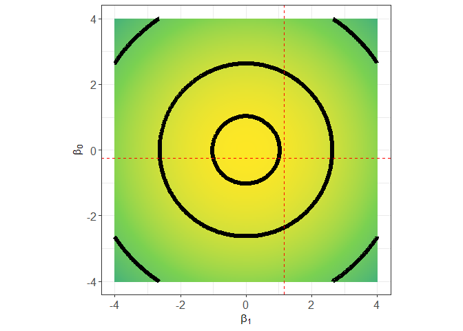

Let's now re-evaluate the log-posterior surface by sequentially adding points. We will add up to the first 10 points, just as we did before.

``` r
log_post_surface_diffuse_01 <- purrr::map_dfr(1:10,
                                              manage_log_post_01,
                                              avail_data = demo_df,
                                              my_settings = hyper_diffuse_01,
                                              grid_use = beta_param_grid)
```

Visualize the log-posterior surface contours as we add each data point, starting from the diffuse prior.

``` r
beta_param_grid %>% 
  mutate(log_post = beta_prior_diffuse_log_density) %>% 
  mutate(N = 0) %>% 
  bind_rows(log_post_surface_diffuse_01) %>% 
  group_by(N) %>% 
  mutate(max_log_post = max(log_post)) %>% 
  ungroup() %>% 
  mutate(log_post_2 = log_post - max_log_post) %>% 
  ggplot(mapping = aes(x = beta_1, y = beta_0)) +
  stat_contour(mapping = aes(z = log_post_2,
                             group = N),
               breaks = log(c(0.01/100, 0.01, 0.1, 0.5, 0.9)),
               size = 1.05,
               color = "black") +
  geom_hline(yintercept = beta_0_true,
             color = "red", linetype = "dashed") +
  geom_vline(xintercept = beta_1_true,
             color = "red", linetype = "dashed") +
  coord_fixed(ratio = 1) +
  facet_wrap(~N, labeller = "label_both") +
  scale_fill_viridis_c(guide = FALSE, option = "viridis",
                       limits = log(c(0.01/100, 1.0))) +
  labs(x = expression(beta[1]), y = expression(beta[0])) +
  theme_bw() +
  theme(legend.position = "top",
        axis.text = element_text(size = 12),
        axis.title = element_text(size = 12))
```

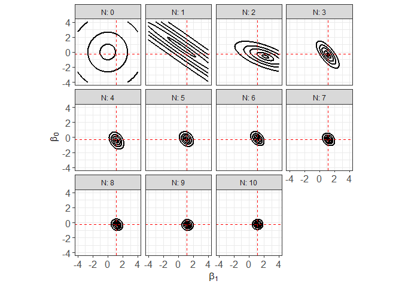

#### Laplace approximation

Now that we know what the log-posterior surface looks like, let's apply the Laplace approximation. We saw how to setup the Laplace apprxomiation last week. We will simply reuse the `my_laplace()` we discussed in lecture last week.

``` r
my_laplace <- function(start_guess, logpost_func, ...)
{
  # code adapted from the `LearnBayes`` function `laplace()`
  fit <- optim(start_guess,
               logpost_func,
               gr = NULL,
               ...,
               method = "BFGS",
               hessian = TRUE,
               control = list(fnscale = -1, maxit = 1001))
  
  mode <- fit$par
  h <- -solve(fit$hessian)
  p <- length(mode)
  int <- p/2 * log(2 * pi) + 0.5 * log(det(h)) + logpost_func(mode, ...)
  list(mode = mode,
       var_matrix = h,
       log_evidence = int,
       converge = ifelse(fit$convergence == 0,
                         "YES", 
                         "NO"),
       iter_counts = fit$counts[1])
}
```

Let's wrap the `my_laplace()` function in a function which allows us to visualize the MVN approximate posterior over a defined grid of parameter values. This way we can compare the Laplace approximation to the true log-posterior surface.

``` r
viz_mvn_approx_post <- function(num_obs, avail_data, my_settings, grid_use, init_guess, logpost_func)
{
  # add in the observations correctly
  my_settings$xobs <- avail_data$x[1:num_obs]
  my_settings$yobs <- avail_data$y[1:num_obs]
  
  # execute the laplace approximation
  laplace_result <- my_laplace(init_guess, logpost_func, my_settings)
  
  # evaluate the MVN approx posterior log-density
  approx_logpost <- mvtnorm::dmvnorm(as.matrix(grid_use),
                                     mean = laplace_result$mode,
                                     sigma = laplace_result$var_matrix,
                                     log = TRUE)
  
  # package everything together
  grid_use %>% 
    mutate(log_post = approx_logpost) %>% 
    mutate(N = num_obs,
           type = "Laplace")
}
```

Sequentially apply the Laplace approximation up to and including the first 5 observations. We will continue to use the diffuse prior on the . Set the initial guess to be .

``` r
approx_log_post_surface_result_01 <- purrr::map_dfr(1:5,
                                                    viz_mvn_approx_post,
                                                    avail_data = demo_df,
                                                    my_settings = hyper_diffuse_01,
                                                    grid_use = beta_param_grid,
                                                    init_guess = c(-1, -1),
                                                    logpost_func = lm_logpost_01)
```

Let's now compare the approximate log-posterior with the true log-posterior surface. In the figure below, the black contours are the true log-posterior contours from the Grid approximation and the dashed red contours are the MVN approximate log-posterior contours. If you remember, these are the same colors we used last week when comparing the true and Laplace approximate log-posteriors. Due to this color scheme, the *true*  values are denoted by navy blue dashed lines, instead of dashed red lines. As shown in the figure below, the true log-posterior and the MVN approximate log-posterior are the same! **Why should we have anticipated the result shown in the figure below?**

``` r
beta_param_grid %>% 
  mutate(log_post = beta_prior_diffuse_log_density) %>% 
  mutate(N = 0) %>% 
  bind_rows(log_post_surface_diffuse_01) %>% 
  mutate(type = "Grid") %>% 
  filter(N < 6) %>% 
  bind_rows(approx_log_post_surface_result_01) %>% 
  group_by(N, type) %>% 
  mutate(max_log_post = max(log_post)) %>% 
  ungroup() %>% 
  mutate(log_post_2 = log_post - max_log_post) %>% 
  ggplot(mapping = aes(x = beta_1, y = beta_0)) +
  stat_contour(mapping = aes(z = log_post_2,
                             group = interaction(N, type),
                             color = type,
                             linetype = type),
               breaks = log(c(0.01/100, 0.01, 0.1, 0.5, 0.9)),
               size = 1.05) +
  geom_hline(yintercept = beta_0_true,
             color = "navyblue", linetype = "dashed") +
  geom_vline(xintercept = beta_1_true,
             color = "navyblue", linetype = "dashed") +
  coord_fixed(ratio = 1) +
  facet_wrap(~N, labeller = "label_both") +
  scale_color_manual("Method",
                     values = c("Grid" = "black",
                                "Laplace" = "red")) +
  scale_linetype_manual("Method",
                        values = c("Grid" = "solid",
                                   "Laplace" = "dashed")) +
  labs(x = expression(beta[1]), y = expression(beta[0])) +
  theme_bw() +
  theme(axis.text = element_text(size = 12),
        axis.title = element_text(size = 12))
```

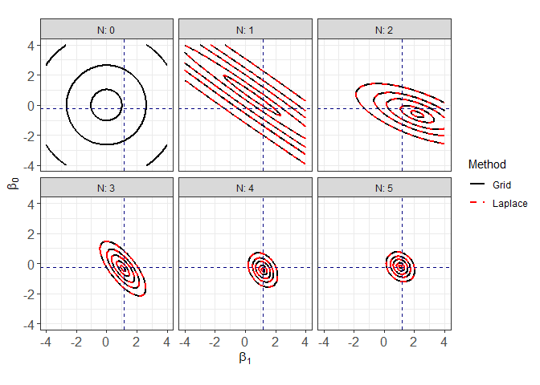

### Derivation

Although we have several techniques to solve this problem, let's step into the math to see how to derive the result. We will derive the posterior via the Laplace approximation, and since the posterior is a MVN (as we saw above), the Laplace approximation will therefore yield the exact result.

We shall first consider the case of the infinitely diffuse prior on . Under this assumption, the log-posterior is essentially the same as the log-likelihood since the contribution of the log-prior is negligible. Write out the terms in the log-likelihood which involve the unknown  parameters:

![ 
\\log\\left\[ p\\left( \\boldsymbol{\\beta} \\mid \\mathbf{x}, \\mathbf{y}, \\sigma \\right) \\right\] \\propto \\log\\left\[ p\\left( \\mathbf{y} \\mid \\mathbf{x},\\boldsymbol{\\beta},\\sigma \\right)\\right\] + \\log\\left\[ p\\left( \\boldsymbol{\\beta}\\right) \\right\] \\approx \\log\\left\[ p\\left( \\mathbf{y} \\mid \\mathbf{x},\\boldsymbol{\\beta},\\sigma \\right)\\right\] \\\\ \\log\\left\[ p\\left( \\boldsymbol{\\beta} \\mid \\mathbf{x}, \\mathbf{y}, \\sigma \\right) \\right\] \\approx -\\frac{1}{2\\sigma^{2}} \\sum\_{n=1}^{N} \\left( \\left(y\_{n} - \\mu\_{n} \\right)^2 \\right)
](https://latex.codecogs.com/png.latex?%20%0A%5Clog%5Cleft%5B%20p%5Cleft%28%20%5Cboldsymbol%7B%5Cbeta%7D%20%5Cmid%20%5Cmathbf%7Bx%7D%2C%20%5Cmathbf%7By%7D%2C%20%5Csigma%20%5Cright%29%20%5Cright%5D%20%5Cpropto%20%5Clog%5Cleft%5B%20p%5Cleft%28%20%5Cmathbf%7By%7D%20%5Cmid%20%5Cmathbf%7Bx%7D%2C%5Cboldsymbol%7B%5Cbeta%7D%2C%5Csigma%20%5Cright%29%5Cright%5D%20%2B%20%5Clog%5Cleft%5B%20p%5Cleft%28%20%5Cboldsymbol%7B%5Cbeta%7D%5Cright%29%20%5Cright%5D%20%5Capprox%20%5Clog%5Cleft%5B%20p%5Cleft%28%20%5Cmathbf%7By%7D%20%5Cmid%20%5Cmathbf%7Bx%7D%2C%5Cboldsymbol%7B%5Cbeta%7D%2C%5Csigma%20%5Cright%29%5Cright%5D%20%5C%5C%20%5Clog%5Cleft%5B%20p%5Cleft%28%20%5Cboldsymbol%7B%5Cbeta%7D%20%5Cmid%20%5Cmathbf%7Bx%7D%2C%20%5Cmathbf%7By%7D%2C%20%5Csigma%20%5Cright%29%20%5Cright%5D%20%5Capprox%20-%5Cfrac%7B1%7D%7B2%5Csigma%5E%7B2%7D%7D%20%5Csum_%7Bn%3D1%7D%5E%7BN%7D%20%5Cleft%28%20%5Cleft%28y_%7Bn%7D%20-%20%5Cmu_%7Bn%7D%20%5Cright%29%5E2%20%5Cright%29%0A " 
\log\left[ p\left( \boldsymbol{\beta} \mid \mathbf{x}, \mathbf{y}, \sigma \right) \right] \propto \log\left[ p\left( \mathbf{y} \mid \mathbf{x},\boldsymbol{\beta},\sigma \right)\right] + \log\left[ p\left( \boldsymbol{\beta}\right) \right] \approx \log\left[ p\left( \mathbf{y} \mid \mathbf{x},\boldsymbol{\beta},\sigma \right)\right] \\ \log\left[ p\left( \boldsymbol{\beta} \mid \mathbf{x}, \mathbf{y}, \sigma \right) \right] \approx -\frac{1}{2\sigma^{2}} \sum_{n=1}^{N} \left( \left(y_{n} - \mu_{n} \right)^2 \right)
")

**What does the above expression remind you of?**

If we define the residual between the linear predictor and the observation as:


The summation term is just the **residual sum of squares** or the **sum of squared errors**:


")

 Thus, under the assumption of an infinitely diffuse prior, maximizing the log-posterior will be equivalent to minimizing the the squared error!

#### Matrix-vector notation

Before substituting the deterministic function for the linear predictor, , we will make a slight change to the syntax we have used up to this point. Let's create a "fake" variable, , and redefine out input as . Our fake variable will multiple the intercept, , and thus will always be equal to 1. The linear predictor expression is then rewritten as:


We can therefore generalize the linear predictor expression for a case  inputs by writing:


")

Notice that we are writing the -th observation of the -th variable with the subscript . If we organize the  unknown parameters into a column vector , we can rewrite the -th linear predictor as the dot product of ") row vector  and .


 We can organize the  separate vectors, each of length , into the ") **design** matrix . For our specific example with 1 input, the design matrix is:

![ 
\\mathbf{X} = \\left\[\\begin{array}
{rr}
x\_{1,0} & x\_{1,1} \\\\
\\vdots & \\vdots \\\\
x\_{N,0} & x\_{N,1} 
\\end{array}\\right\] = \\left\[\\begin{array}
{rr}
1 & x\_{1,1} \\\\
\\vdots & \\vdots \\\\
1 & x\_{N,1} 
\\end{array}\\right\]
](https://latex.codecogs.com/png.latex?%20%0A%5Cmathbf%7BX%7D%20%3D%20%5Cleft%5B%5Cbegin%7Barray%7D%0A%7Brr%7D%0Ax_%7B1%2C0%7D%20%26%20x_%7B1%2C1%7D%20%5C%5C%0A%5Cvdots%20%26%20%5Cvdots%20%5C%5C%0Ax_%7BN%2C0%7D%20%26%20x_%7BN%2C1%7D%20%0A%5Cend%7Barray%7D%5Cright%5D%20%3D%20%5Cleft%5B%5Cbegin%7Barray%7D%0A%7Brr%7D%0A1%20%26%20x_%7B1%2C1%7D%20%5C%5C%0A%5Cvdots%20%26%20%5Cvdots%20%5C%5C%0A1%20%26%20x_%7BN%2C1%7D%20%0A%5Cend%7Barray%7D%5Cright%5D%0A " 
\mathbf{X} = \left[\begin{array}
{rr}
x_{1,0} & x_{1,1} \\
\vdots & \vdots \\
x_{N,0} & x_{N,1} 
\end{array}\right] = \left[\begin{array}
{rr}
1 & x_{1,1} \\
\vdots & \vdots \\
1 & x_{N,1} 
\end{array}\right]
")

In general, with  variables, the design matrix can be written as:

![ 
\\mathbf{X} = \\left\[\\begin{array}
{rrrr}
x\_{1,0} & x\_{1,1} & \\ldots & x\_{1,D} \\\\
\\vdots & \\vdots & \\ddots & \\vdots\\\\
x\_{N,0} & x\_{N,1} & \\ldots & x\_{N,D} 
\\end{array}\\right\] = \\left\[\\begin{array}
{rrrr}
1 & x\_{1,1} & \\ldots & x\_{1,D} \\\\
\\vdots & \\vdots & \\ddots & \\vdots\\\\
1 & x\_{N,1} & \\ldots & x\_{N,D} 
\\end{array}\\right\]
](https://latex.codecogs.com/png.latex?%20%0A%5Cmathbf%7BX%7D%20%3D%20%5Cleft%5B%5Cbegin%7Barray%7D%0A%7Brrrr%7D%0Ax_%7B1%2C0%7D%20%26%20x_%7B1%2C1%7D%20%26%20%5Cldots%20%26%20x_%7B1%2CD%7D%20%5C%5C%0A%5Cvdots%20%26%20%5Cvdots%20%26%20%5Cddots%20%26%20%5Cvdots%5C%5C%0Ax_%7BN%2C0%7D%20%26%20x_%7BN%2C1%7D%20%26%20%5Cldots%20%26%20x_%7BN%2CD%7D%20%0A%5Cend%7Barray%7D%5Cright%5D%20%3D%20%5Cleft%5B%5Cbegin%7Barray%7D%0A%7Brrrr%7D%0A1%20%26%20x_%7B1%2C1%7D%20%26%20%5Cldots%20%26%20x_%7B1%2CD%7D%20%5C%5C%0A%5Cvdots%20%26%20%5Cvdots%20%26%20%5Cddots%20%26%20%5Cvdots%5C%5C%0A1%20%26%20x_%7BN%2C1%7D%20%26%20%5Cldots%20%26%20x_%7BN%2CD%7D%20%0A%5Cend%7Barray%7D%5Cright%5D%0A " 
\mathbf{X} = \left[\begin{array}
{rrrr}
x_{1,0} & x_{1,1} & \ldots & x_{1,D} \\
\vdots & \vdots & \ddots & \vdots\\
x_{N,0} & x_{N,1} & \ldots & x_{N,D} 
\end{array}\right] = \left[\begin{array}
{rrrr}
1 & x_{1,1} & \ldots & x_{1,D} \\
\vdots & \vdots & \ddots & \vdots\\
1 & x_{N,1} & \ldots & x_{N,D} 
\end{array}\right]
")

The  length linear predictor vector, , can then be written in terms of the design matrix and a column vector of parameters, , of size "). The expression below is created by essentially "stacking" each of the  separate calculations together. The matrix/vector aglebra simply takes care of the "stacking" for us.


Using matrix/vector notation we can rewite the log-posterior under the assumption of a diffuse prior as:

^2 \right) = -\frac{1}{2\sigma^2}\sum_{n=1}^{N} \left( \left( y_{n} - \mathrm{x}_{n,:} \boldsymbol{\beta} \right)^{2} \right) = -\frac{1}{2\sigma^2}\left( \mathbf{y} - \mathbf{X}\boldsymbol{\beta} \right)^{T} \left( \mathbf{y} - \mathbf{X}\boldsymbol{\beta} \right) 
")

For notational simplicity, we will define the above expression as .

#### Gradient

The Laplace approximation requires finding the posterior mode, or *max a posteriori* estimate. We will therefore need to evaluate the partial derivative of  with respect to each unknown parameter. Let's continue to work in general terms by taking the partial derivative of  with respect to the  parameter:

^2 \right) \right)
")

The partial derivative of the term within the summation is:

^2 \right) = 2 \left( y_{n} - \mathbf{x}_{n,:} \boldsymbol{\beta} \right) \cdot \left(-x_{n,d} \right)
")

Substituting this expression back into the summation and simplifying gives:

 \cdot x_{n,d} \right)
")

The summation can be distributed to each of the terms:

 - \sum_{n=1}^{N} \left( \left( \mathbf{x}_{n,:} \boldsymbol{\beta} \right) \cdot x_{n,d} \right) \right)
")

The first summation series is the dot product of the  vector with all vector of observations for the -th input variable, :

 = \mathrm{x}_{:,d}^T \mathbf{y}
")

The expression above produces a scalar number, associated with the -th parameter. We can repeat that calculation for all  parameters, or we can use matrix algebra to repeat the operation for us. Instead of multiplying the transpose of the -th column of the design matrix by the vector , we multiply the transpose of the entire design matrix by the vector :


The second summation series in the derivative is a little more challenging. It is repeated below for conenience.

 \cdot x_{n,d} \right)
")

First, consider that we are summing over all  observations. Second, each observation of the -input is multiplied by the linear predictor associated with the -th observation. We are therefore multiplying the -th observation of the -th input variable by the -th observation of all  input variables. We then take the dot product with the parameter vector. To make this more clear, let's rearrange the above expression to be:

 \boldsymbol{\beta} \right)
")

To extend this expression to all  parameters, we need to define the **sum of squares** matrix. The name comes from the fact that we are squaring many terms and then summing over all observations:

![ 
\\sum\_{n=1}^{N} \\left( \\mathbf{x}\_{n,:}^{T} \\mathbf{x}\_{n,:} \\right) = \\sum\_{n=1}^{N} \\left( \\left\[\\begin{array}
{rrrr}
x\_{n,0}^{2} & x\_{n,0}x\_{n,1} & \\ldots & x\_{n,0}x\_{n,D} \\\\
\\vdots & \\vdots & \\ddots & \\vdots\\\\
x\_{n,D}x\_{n,0} & x\_{n,D}x\_{n,1} & \\ldots & x\_{n,D}^2 
\\end{array}\\right\] \\right)
](https://latex.codecogs.com/png.latex?%20%0A%5Csum_%7Bn%3D1%7D%5E%7BN%7D%20%5Cleft%28%20%5Cmathbf%7Bx%7D_%7Bn%2C%3A%7D%5E%7BT%7D%20%5Cmathbf%7Bx%7D_%7Bn%2C%3A%7D%20%5Cright%29%20%3D%20%5Csum_%7Bn%3D1%7D%5E%7BN%7D%20%5Cleft%28%20%5Cleft%5B%5Cbegin%7Barray%7D%0A%7Brrrr%7D%0Ax_%7Bn%2C0%7D%5E%7B2%7D%20%26%20x_%7Bn%2C0%7Dx_%7Bn%2C1%7D%20%26%20%5Cldots%20%26%20x_%7Bn%2C0%7Dx_%7Bn%2CD%7D%20%5C%5C%0A%5Cvdots%20%26%20%5Cvdots%20%26%20%5Cddots%20%26%20%5Cvdots%5C%5C%0Ax_%7Bn%2CD%7Dx_%7Bn%2C0%7D%20%26%20x_%7Bn%2CD%7Dx_%7Bn%2C1%7D%20%26%20%5Cldots%20%26%20x_%7Bn%2CD%7D%5E2%20%0A%5Cend%7Barray%7D%5Cright%5D%20%5Cright%29%0A " 
\sum_{n=1}^{N} \left( \mathbf{x}_{n,:}^{T} \mathbf{x}_{n,:} \right) = \sum_{n=1}^{N} \left( \left[\begin{array}
{rrrr}
x_{n,0}^{2} & x_{n,0}x_{n,1} & \ldots & x_{n,0}x_{n,D} \\
\vdots & \vdots & \ddots & \vdots\\
x_{n,D}x_{n,0} & x_{n,D}x_{n,1} & \ldots & x_{n,D}^2 
\end{array}\right] \right)
")

The sum of squares matrix has  rows and  columns. It can be more compactly written as:

 = \mathbf{X}^T \mathbf{X}
")

With the sum of squares matrix defined, the second summation term can be rewritten as:


The gradient vector of  elements can therefore be written as:


")

#### Posterior mode

The posterior mode corresponds to the  values where the gradient vector equal to zero, . Setting the above expression equal to zero and rearranging gives:


The posterior mode is therefore:

^{-1} \mathbf{X}^{T} \mathbf{y}
")

The expression for the posterior mode has several important features. First, the mode does not depend on the noise, . Second, we derived this expression assuming an infinitely diffuse or vague prior. Based on what we saw last week, under this assumption the posterior mode converges to the maximum likelihood estimate (MLE). This should have been obvious here, since we explicitely set the log-prior to zero at the start of our derivation. Lastly, as pointed out at the beginning of the derivation, the log-likelihood can be written in terms of the sum of squared errors. Thus, our MLE is equivalent to the Ordinary Least Squares (OLS) estimate which minimizes the squared error loss between the observations and the linear predictor.

#### Hessian

To complete the Laplace approximation, we need to derive the Hessian, or the matrix of second derivatives. For our specific example, with  and , the Hessian matrix is a  matrix:

![ 
\\mathbf{H} = \\left\[\\begin{array}
{rr}
\\frac{\\partial^{2} L}{\\partial \\beta\_{0}^2} & \\frac{\\partial^{2}L}{\\partial \\beta\_{0} \\partial \\beta\_{1}} \\\\
\\frac{\\partial^{2}L}{\\partial \\beta\_{1} \\partial \\beta\_{0}} & \\frac{\\partial^{2} L}{\\partial \\beta\_{1}^2} 
\\end{array}\\right\]
](https://latex.codecogs.com/png.latex?%20%0A%5Cmathbf%7BH%7D%20%3D%20%5Cleft%5B%5Cbegin%7Barray%7D%0A%7Brr%7D%0A%5Cfrac%7B%5Cpartial%5E%7B2%7D%20L%7D%7B%5Cpartial%20%5Cbeta_%7B0%7D%5E2%7D%20%26%20%5Cfrac%7B%5Cpartial%5E%7B2%7DL%7D%7B%5Cpartial%20%5Cbeta_%7B0%7D%20%5Cpartial%20%5Cbeta_%7B1%7D%7D%20%5C%5C%0A%5Cfrac%7B%5Cpartial%5E%7B2%7DL%7D%7B%5Cpartial%20%5Cbeta_%7B1%7D%20%5Cpartial%20%5Cbeta_%7B0%7D%7D%20%26%20%5Cfrac%7B%5Cpartial%5E%7B2%7D%20L%7D%7B%5Cpartial%20%5Cbeta_%7B1%7D%5E2%7D%20%0A%5Cend%7Barray%7D%5Cright%5D%0A " 
\mathbf{H} = \left[\begin{array}
{rr}
\frac{\partial^{2} L}{\partial \beta_{0}^2} & \frac{\partial^{2}L}{\partial \beta_{0} \partial \beta_{1}} \\
\frac{\partial^{2}L}{\partial \beta_{1} \partial \beta_{0}} & \frac{\partial^{2} L}{\partial \beta_{1}^2} 
\end{array}\right]
")

We can determine the Hessian matrix by inspection of the gradient vector expression. Notice that the only portion impacted by  is the term involving the sum-of-squares matrix. Differentiating the gradient vector with respect to each element gives:


The posterior covariance matrix on all  parameters is then equal to the negative inverse of the Hessian matrix:

 = \sigma^2 \left( \mathbf{X}^{T} \mathbf{X} \right)^{-1}
")

There are several important points to make about the posterior covariance matrix. First, for a given noise term, , the responses, , do not influence the posterior uncertainty. The covariance structure between the  parameters is impacted by the design matrix through the sum-of-squares matrix. Presumably, the way we collect the data impacts our posterior uncertainty, and that is exactly what the posterior covariance matrix expression tells us. We could imagine that we could decide *optimal* input configurations which give us the same level of posterior uncertainty as randomly collecting observations. This concept is at the heart of Experimental Design procedures. Understanding the mathematical structure of the sum-of-squares matrix is at the heart of the designs which satisfy achieve the various *alphabet-optimality* conditions.

Therefore, starting from an infinitely diffuse prior, the posterior distribution on the  parameters is the following MVN distribution:

^{-1} \mathbf{X}^{T} \mathbf{y} , \sigma^2 \left( \mathbf{X}^{T} \mathbf{X} \right)^{-1} \right)
")

### Example

Let's apply the formulas we just derived to our current synthetic data example. As we have done throughout the last few weeks, we wil define a function to perform the analysis. However, before creating that function, it is important to note that in `R` we **cannot** use `*` for matrix multiplication. `R` views the `*` operation as multiplying all elements together between two objects. In order to tell `R` we are interested in matrix multiplication, we must use the `%*%` operator. The code chunk below defines the function `laplace_diffuse()` below reads in a design matrix, `X`, a vector of responses, `y`, and the given noise, `sd_known`. The inverse of the sum-of-squares matrix is calculated and that inverse is used to calculate the posterior mode and posterior covariance matrix. Both quantities are returned as elements of a list, with names consistent with the `my_laplace()` function.

``` r
laplace_diffuse <- function(X, y, sd_known)
{
  iSS <- solve(t(X) %*% X)
  
  bhat <- iSS %*% t(X) %*% as.matrix(y)
  
  bcov <- sd_known^2 * iSS
  
  list(mode = as.vector(bhat),
       var_matrix = bcov)
}
```

We originally applied the grid approximation to the  case, and so we will return to that situation now. We need to first assemble the design matrix, , by binding together a vector of 's for the intercept term with the values of the  input vector. In order to compare our result with the laplace approximation, we need to put together the observations with the more diffuse prior specification.

``` r
X_matrix <- cbind(rep(1, nrow(train_df)), train_df$x)

### check the class
class(X_matrix)
```

    ## [1] "matrix"

``` r
### set the information for the laplace approximation
info_diffuse_01 <- list(
  xobs = train_df$x,
  yobs = train_df$y,
  sigma = sigma_true,
  b0_mu = 0,
  b0_sd = 5,
  b1_mu = 0,
  b1_sd = 5
)
```

Perform the Laplace approximation from a starting guess of :

``` r
laplace_approx_N10 <- my_laplace(c(-1, -1), lm_logpost_01, info_diffuse_01)
```

And now evaluate the formulas in the `laplace_diffuse()` function:

``` r
analytic_result_N10 <- laplace_diffuse(X_matrix, train_df$y, sigma_true)
```

Let's compare the identified posterior modes between the two approaches:

``` r
laplace_approx_N10$mode
```

    ## [1] -0.241377  1.162628

``` r
analytic_result_N10$mode
```

    ## [1] -0.2415318  1.1638857

And now let's compare the posterior covariance matrices:

``` r
laplace_approx_N10$var_matrix
```

    ##            [,1]       [,2]
    ## [1,] 0.02510488 0.00188907
    ## [2,] 0.00188907 0.02748110

``` r
analytic_result_N10$var_matrix
```

    ##            [,1]       [,2]
    ## [1,] 0.02513026 0.00189305
    ## [2,] 0.00189305 0.02751149

The Laplace approximation and the analytic formulas yielded very similar results. The values are not exact matches, but they are very close!

### Informative prior

As long as our informative prior is a MVN distribution, the posterior distribution  will be a MVN. We will not go through the derivation, but it is important to note that the formulation is consistent with fitting the MVN distribution with a known covariance matrix. Let's define our informative prior MVN with prior mean vector  and prior covariance matrix :


")

After observing  observations with response vector  and design matrix  the posterior MVN distribution on the unknown parameters  is:


")

The posterior precision matrix is the sum of the prior precision and data precision matrices. But, note that the now the data precision depends on the design matrix!


The posterior mean is a precision weighted average of the prior mean and the observations, just as we have seen before. The posterior mean formula is:


")

**Can you see how the MLE, , is recovered when when we use an infinitely vague prior?**

Unknown 
--------------------------------------------------------------------------

All of the previous analysis and discussion assumed that we knew . In a real problem though, we do not anticipate knowing the noise. It served as a useful first step to help us understand key concepts such as the importance of the design matrix, , on the posterior solution. But how can we build a model when the noise is unknown?

### MLE

We will first consider the MLE on , or rather on the variance, . Can you make a guess for what an estimate to  could be? We will quickly derive the MLE on  below. Start by writing out the log-likelihood again, but this time including all terms involving either  and or :

![ 
L \\propto -\\frac{N}{2} \\log\\left\[\\sigma^2\\right\] - \\frac{1}{2\\sigma^2} \\left( \\mathbf{y} - \\mathbf{X}\\boldsymbol{\\beta} \\right)^T \\left( \\mathbf{y} - \\mathbf{X}\\boldsymbol{\\beta} \\right)
](https://latex.codecogs.com/png.latex?%20%0AL%20%5Cpropto%20-%5Cfrac%7BN%7D%7B2%7D%20%5Clog%5Cleft%5B%5Csigma%5E2%5Cright%5D%20-%20%5Cfrac%7B1%7D%7B2%5Csigma%5E2%7D%20%5Cleft%28%20%5Cmathbf%7By%7D%20-%20%5Cmathbf%7BX%7D%5Cboldsymbol%7B%5Cbeta%7D%20%5Cright%29%5ET%20%5Cleft%28%20%5Cmathbf%7By%7D%20-%20%5Cmathbf%7BX%7D%5Cboldsymbol%7B%5Cbeta%7D%20%5Cright%29%0A " 
L \propto -\frac{N}{2} \log\left[\sigma^2\right] - \frac{1}{2\sigma^2} \left( \mathbf{y} - \mathbf{X}\boldsymbol{\beta} \right)^T \left( \mathbf{y} - \mathbf{X}\boldsymbol{\beta} \right)
")

Evaluate the log-likelihood at the MLE on the linear predictor parameters:

![ 
L \\rvert\_{\\hat{\\boldsymbol{\\beta}}} \\propto -\\frac{N}{2} \\log\\left\[\\sigma^2\\right\] - \\frac{1}{2\\sigma^2} \\left( \\mathbf{y} - \\mathbf{X}\\hat{\\boldsymbol{\\beta}} \\right)^T \\left( \\mathbf{y} - \\mathbf{X}\\hat{\\boldsymbol{\\beta}} \\right)
](https://latex.codecogs.com/png.latex?%20%0AL%20%5Crvert_%7B%5Chat%7B%5Cboldsymbol%7B%5Cbeta%7D%7D%7D%20%5Cpropto%20-%5Cfrac%7BN%7D%7B2%7D%20%5Clog%5Cleft%5B%5Csigma%5E2%5Cright%5D%20-%20%5Cfrac%7B1%7D%7B2%5Csigma%5E2%7D%20%5Cleft%28%20%5Cmathbf%7By%7D%20-%20%5Cmathbf%7BX%7D%5Chat%7B%5Cboldsymbol%7B%5Cbeta%7D%7D%20%5Cright%29%5ET%20%5Cleft%28%20%5Cmathbf%7By%7D%20-%20%5Cmathbf%7BX%7D%5Chat%7B%5Cboldsymbol%7B%5Cbeta%7D%7D%20%5Cright%29%0A " 
L \rvert_{\hat{\boldsymbol{\beta}}} \propto -\frac{N}{2} \log\left[\sigma^2\right] - \frac{1}{2\sigma^2} \left( \mathbf{y} - \mathbf{X}\hat{\boldsymbol{\beta}} \right)^T \left( \mathbf{y} - \mathbf{X}\hat{\boldsymbol{\beta}} \right)
")

 Take the derivative of the log-likelihood evaluated at  with respect to :

} \propto -\frac{N}{2} \frac{1}{\sigma^2} -\frac{1}{2} \left(-\frac{1}{\left( \sigma^2 \right)^2}\right) \left( \mathbf{y} - \mathbf{X}\hat{\boldsymbol{\beta}} \right)^T \left( \mathbf{y} - \mathbf{X}\hat{\boldsymbol{\beta}} \right)
")

Factor the right hand side into two terms:

} \propto \left( -\frac{1}{2\sigma^2} \right) \left(N - \frac{1}{\sigma^2} \left( \mathbf{y} - \mathbf{X}\hat{\boldsymbol{\beta}} \right)^T \left( \mathbf{y} - \mathbf{X}\hat{\boldsymbol{\beta}} \right) \right)
")

 The derivative of the log-likelihood with respect to  can therefore be zero either at infinite variance, or if the expression within the second set of parantheses on the right hand side is equal to zero.

^T \left( \mathbf{y} - \mathbf{X}\hat{\boldsymbol{\beta}} \right)
")

 The above expression can be easily solved for the MLE on :

^T \left( \mathbf{y} - \mathbf{X}\hat{\boldsymbol{\beta}} \right)
")

 Although written in matrix notation, the above expression is simply saying that the MLE on  is the mean squared error of the linear predictor MLE! **Can you see why?**

The impact of having to estimate  compared to knowing it exactly, within the MLE framework, is that the uncertainty intervals on the linear predictor parameters  are widened.

### Bayesian formulation

In a Bayesian formulation, we must specify a prior on the unknown  term, in addition to our prior on the linear predictor parameters, . A benefit of the Bayesian approach over the maximum likelihood estimates is that we will have a probabilistic statement about the noise term, rather than just an estimate.

In terms of our running example, having an unknown  means that we now have 3 unknown parameters to learn. If we would continue to use the Grid approximation, and maintain 251 unique values in all 3 dimensions we would have to evaluate the log-posterior 1.5810^{7} times! Although we could reduce the resolution of our grid to reduce the required number of evaluations, a method like the Laplace approximation allows us to eventually scale up from a single input to multiple inputs within our linear model.

However, as we discussed last week, we cannot simply apply the Laplace approximation to the noise term. The approximate MVN distribution will not respect the natural lower limit on the standard deviation. We will need to apply a transformation and properly account for the change-of-variables within our posterior. Last week we applied the logit-transformation to respect both a lower and upper bound. This week, we will use a log-transformation, which does not impose an upper bound constraint.

#### Probability model

With the transformation, we will now learn the linear predictor parameters, , and the unbounded transformed standard deviation, ![\\phi = \\log\\left\[\\sigma\\right\]](https://latex.codecogs.com/png.latex?%5Cphi%20%3D%20%5Clog%5Cleft%5B%5Csigma%5Cright%5D "\phi = \log\left[\sigma\right]"). We will specify our prior belief on  directly, and assume it is uniformly distributed between 0 and 10. Although the log-transformation does not "see" an upper bounded constraint, the uniform max value of 10 is quite far from our known *true*  value which generated the synthetic observations. In a real problem, we will obviously not have the luxury of knowing how far away our upper bound is from the *truth*. We will discuss *scaling* issues in a later lecture.

To complete our probability model, we will continue use to independent normal distributions on the  and . We will use a compromise between the informative and the diffuse priors discussed earlier, and so set the prior standard deviation to 2.5.

The complete probability model is therefore:

 \right) \\ \mu_{n} = \beta_{0} + \beta_{1}x_{n} \\ \beta_{0} \sim \mathrm{normal}\left( \beta_{0} \mid 0, 2.5 \right) \\ \beta_{1} \sim \mathrm{normal}\left( \beta_{1} \mid 0, 2.5 \right) \\ \exp\left( \phi \right) \sim \mathrm{uniform}\left(\exp\left( \phi \right), 0, 10 \right)
")

#### Laplace approximation

We can now encode our probability model within a function which evaluates the log-posterior for a given set of parameter values. As we used last week, to denote that a change-of-variables transformation was applied, the first argument to the `lm_logpost_02()` function is a vector named `phi`. The parameters are ordered such that the first two elements of `phi` are  and , and the last element is the unbounded standard deviation . The second argument, `my_info`, is again a list which contains all necessary information for evaluating the log-posterior function. After evaluating the log-likelihood and log-priors, the transformation is accounted for by adding in the log of the derivative of the inverse transformation function.

``` r
lm_logpost_02 <- function(phi, my_info)
{
  # unpack the parameter vector
  beta_0 <- phi[1]
  beta_1 <- phi[2]
  # back-transform from phi to sigma
  lik_sigma <- exp(phi[3])
  
  # calculate linear predictor
  mu <- beta_0 + beta_1 * my_info$xobs
  
  # evaluate the log-likelihood
  log_lik <- sum(dnorm(x = my_info$yobs,
                       mean = mu,
                       sd = lik_sigma,
                       log = TRUE))
  
  # evaluate the log-prior
  log_prior <- dnorm(x = beta_0,
                     mean = my_info$b0_mu,
                     sd = my_info$b0_sd,
                     log = TRUE) +
    dnorm(x = beta_1,
          mean = my_info$b1_mu,
          sd = my_info$b1_sd,
          log = TRUE) +
    dunif(x = lik_sigma,
          min = my_info$sigma_lwr,
          max = my_info$sigma_upr,
          log = TRUE)
  
  # account for the transformation
  log_derive_adjust <- phi[3]
  
  # sum together
  log_lik + log_prior + log_derive_adjust
}
```

Our list of required information is specified in the code chunk below:

``` r
info_use_02 <- list(
  xobs = train_df$x,
  yobs = train_df$y,
  sigma_lwr = 0,
  sigma_upr = 10,
  b0_mu = 0,
  b0_sd = 2.5,
  b1_mu = 0,
  b1_sd = 2.5
)
```

We will try out two different initial guesses, to check the robustness of our posterior mode. For the first guess use ![\\{-1, -1, \\log\\left\[2\\right\] \\}](https://latex.codecogs.com/png.latex?%5C%7B-1%2C%20-1%2C%20%5Clog%5Cleft%5B2%5Cright%5D%20%5C%7D "\{-1, -1, \log\left[2\right] \}"), and for the second guess use ![\\{2.5, 2.5, \\log\\left\[1\\right\] \\}](https://latex.codecogs.com/png.latex?%5C%7B2.5%2C%202.5%2C%20%5Clog%5Cleft%5B1%5Cright%5D%20%5C%7D "\{2.5, 2.5, \log\left[1\right] \}"). Execute both laplace approximation attempts in the code chunk below.

``` r
laplace_unknown_sigma_aa <- my_laplace(c(-1, -1, log(2)), lm_logpost_02, info_use_02)

laplace_unknown_sigma_bb <- my_laplace(c(2.5, 2.5, log(1)), lm_logpost_02, info_use_02)
```

Let's first check if both attempts converged:

``` r
laplace_unknown_sigma_aa$converge
```

    ## [1] "YES"

``` r
laplace_unknown_sigma_bb$converge
```

    ## [1] "YES"

The posterior modes are identical, as shown in the output below:

``` r
laplace_unknown_sigma_aa$mode
```

    ## [1] -0.2409766  1.1593660 -0.7466703

``` r
laplace_unknown_sigma_bb$mode
```

    ## [1] -0.2409757  1.1593660 -0.7466725

The (approximate) posterior covariance matrices for the two different initial guesses are also very similar. It appears that the solution is robust!

``` r
laplace_unknown_sigma_aa$var_matrix
```

    ##              [,1]          [,2]          [,3]
    ## [1,] 2.249747e-02  0.0016875221  6.160708e-05
    ## [2,] 1.687522e-03  0.0246253046 -5.003156e-04
    ## [3,] 6.160708e-05 -0.0005003156  5.556611e-02

``` r
laplace_unknown_sigma_bb$var_matrix
```

    ##              [,1]          [,2]          [,3]
    ## [1,] 2.249738e-02  0.0016875139  6.171669e-05
    ## [2,] 1.687514e-03  0.0246251989 -5.003161e-04
    ## [3,] 6.171669e-05 -0.0005003161  5.556587e-02

If we would be interested in printing to screen the posterior standard deviation associated with each parameter, we can use the `diag()` function to extract the elements along the main diagonal:

``` r
sqrt(diag(laplace_unknown_sigma_aa$var_matrix))
```

    ## [1] 0.1499916 0.1569245 0.2357246

As we discussed last week, this MVN distribution is the approximate posterior on the *unbounded* parameters. We will now generate random samples from this MVN and then back-transform the  samples to , thereby properly accounting for the natural lower bound constrain on .

``` r
set.seed(4111)

post_unbound_samples <- MASS::mvrnorm(n = 1e4, 
                                      mu = laplace_unknown_sigma_aa$mode, 
                                      Sigma = laplace_unknown_sigma_aa$var_matrix) %>% 
  as.data.frame() %>% tbl_df() %>% 
  purrr::set_names(c("beta_0", "beta_1", "phi"))
```

All we have to do to back-transfrom  to  is to now apply the inverse-transformation function.

``` r
post_param_samples <- post_unbound_samples %>% 
  mutate(sigma = exp(phi))
```

Let's compare the marginal posterior distributions on each parameter with the known true values used to generate the observational data. The code chunk below first reshapes parameters to make it easy to specify the separate facet per parameter, before displaying the marginal posterior distribution with a histogram. The *true* values associated with each parameter are shown as dashed red vertical lines. As shown below, the posterior modes are all quite accurate relative to the *true* parameter values for this simple example!

``` r
post_param_samples %>% 
  select(-phi) %>% 
  tibble::rowid_to_column("post_id") %>% 
  tidyr::gather(key = "param_name", value = "value", -post_id) %>% 
  ggplot(mapping = aes(x = value)) +
  geom_histogram(mapping = aes(group = param_name),
                 bins = 55) +
  geom_vline(data = data.frame(true_value = c(beta_0_true, beta_1_true, sigma_true),
                               param_name = c("beta_0", "beta_1", "sigma")),
             mapping = aes(xintercept = true_value),
             color = "red", linetype = "dashed", size = 1.15) +
  facet_wrap(~param_name, scales = "free") +
  theme_bw() +
  theme(axis.text.y = element_blank())
```

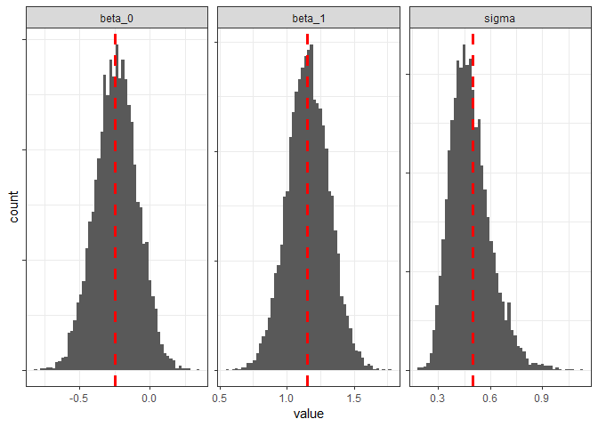

Posterior predictions
---------------------

We will now evaluate the posterior predictive *distribution*. Rather than writing out integrals, let's just think through our modeling framework. We started out by defining parameter values and a grid of input "locations". We then evaluated the linear predictor, and then passed the linear predictor into a normal random number generator. We can follow the exact same workflow here by replacing "defining parameter values" with "select posterior sample". So to generate posterior predictions we will, first define a set of prediction (test) input values, . For , select the -th posterior parameter sample, . Calculate the linear predictor for the -th posterior sample at each test input value, . Pass the linear predictor at the -th input prediction "location" for the -th posterior sample into a random number generater along with the -th sample on  to generate a random prediction, .

This might sound convoluted, so let's break it down into the basic pieces. We first predict the linear predictor, in our case, the straight line . Given , we generate an observation . We are therefore dealing with two distinct, yet equally important sources of uncertainty. To use its formal name, the first source is the *epistemic* source of uncertainty: the unknown parameter values. We do not know the *true* or *exact* parameter values. We only have statements of belief about their plausible values. So we try out many different plausible values. The second source is the *aleatory* uncertainty due to random chance. Although the *aleatory* uncertainty might seem the most natural, it is typically not addressed in regression problems.

There are several different ways we could code up the above steps. In either case, we must first define a set of prediction or test points. The code chunk below creates a vector, , of 25 points between the bounds of the original  vector.

``` r
x_test <- seq(range(x)[1], range(x)[2], length.out = 25)
```

We will now define a function which calculates the linear predictor and generates a random observation for a given posterior parameter sample. The code chunk below creates the function `my_post_predict()` which reads in separate values for each parameter in our model. Thus, this specific function is specific to our model setup. This also means that we will need to loop over all posterior samples in order to evaluate the posterior predictive *distribution*. The fourth argument to `my_post_predict()` is a posterior sample index to help with the book keeping. The last argument, `x_new`, is the grid of test points we wish to make predictions at.

``` r
my_post_predict <- function(b0_s, b1_s, sigma_s, s_id, x_new)
{
  # evaluate the linear predictor
  mu_s <- b0_s + b1_s * x_new
  
  # generate random observations
  y_s <- rnorm(n = length(x_new), mean = mu_s, sd = sigma_s)
  
  # package together
  tibble::tibble(
    x = x_new,
    mu = mu_s,
    y = y_s
  ) %>% 
    mutate(post_id = s_id)
}
```

As shown in the code chunk above, we will need to iterate over 4 separate variables to properly execute the `my_post_predict()` function. We can still use the `purrr` package to perform the looping for use by using the `pmap_*` family of functions. `pmap_*` generalizes the `map_*` and `map2_*` functions by allowing p-different variables to be iterated over.

In the code chunk below, `post_param_samples` is modified to include a specific column for the row ID. This row ID variable is passed into `my_post_predict()` as the `s_id` input argument. The `purrr::pmap_dfr()` function is then applied to iterate over all posterior samples.

``` r
post_param_samples_s <- post_param_samples %>% 
  tibble::rowid_to_column("post_id")

set.seed(4112)
post_preds <- purrr::pmap_dfr(list(post_param_samples_s$beta_0,
                                   post_param_samples_s$beta_1,
                                   post_param_samples_s$sigma,
                                   post_param_samples_s$post_id),
                              my_post_predict,
                              x_new = x_test)
```

The `post_preds` data object is structured in a long or tall style format to faciliate plotting in `ggplot2`. Calling `glimpse()` reveals the large number of rows contained in the dataset. **Can you think of why there are 250000 rows?**

``` r
post_preds %>% glimpse()
```

    ## Observations: 250,000
    ## Variables: 4
    ## $ x       <dbl> -3.00, -2.75, -2.50, -2.25, -2.00, -1.75, -1.50, -1.25...
    ## $ mu      <dbl> -3.71016579, -3.40489795, -3.09963011, -2.79436227, -2...
    ## $ y       <dbl> -3.9962713, -3.2827056, -2.9093437, -2.6124585, -2.708...
    ## $ post_id <int> 1, 1, 1, 1, 1, 1, 1, 1, 1, 1, 1, 1, 1, 1, 1, 1, 1, 1, ...

What do you anticipate the posterior predictions look like? To get an idea, let's show the first 11 posterior predictions of .

``` r
post_preds %>% 
  filter(post_id %in% 1:11) %>% 
  ggplot(mapping = aes(x = x, y = mu)) +
  geom_line(mapping = aes(group = post_id)) +
  labs(y = expression(mu)) +
  theme_bw()
```

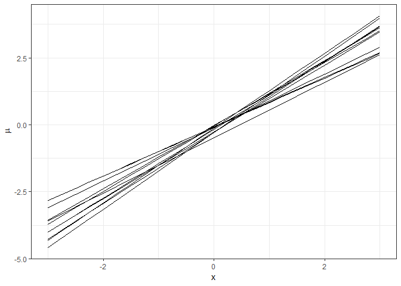

To add some context, let's include the 10 training points used to fit the Bayesian model, as well as the *true* noise-free line. Does the figure below look famaliar?

``` r
post_preds %>% 
  filter(post_id %in% 1:11) %>% 
  ggplot(mapping = aes(x = x, y = mu)) +
  geom_line(mapping = aes(group = post_id)) +
  geom_point(data = train_df,
             mapping = aes(x = x, y = y),
             color = "red", size = 2) +
  geom_abline(slope = beta_1_true, intercept = beta_0_true,
              color = "red", linetype = "dashed", size = 1.05) +
  labs(y = expression(mu)) +
  theme_bw()
```

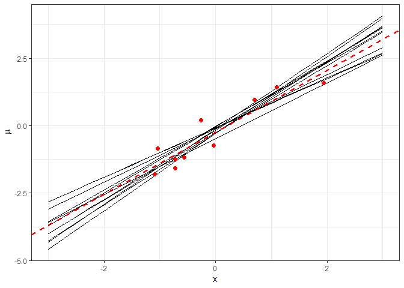

Let's now include the first 100 posterior lines, and set the transparency on each line to be 0.2. With just 100 lines, we should start to get a sense of the posterior uncertainty on the linear predictor, due to the *epistemic* uncertainty of the  parameters.

``` r
post_preds %>% 
  filter(post_id %in% 1:100) %>% 
  ggplot(mapping = aes(x = x, y = mu)) +
  geom_line(mapping = aes(group = post_id),
            alpha = 0.2) +
  geom_point(data = train_df,
             mapping = aes(x = x, y = y),
             color = "red", size = 2) +
  geom_abline(slope = beta_1_true, intercept = beta_0_true,
              color = "red", linetype = "dashed", size = 1.05) +
  labs(y = expression(mu)) +
  theme_bw()
```

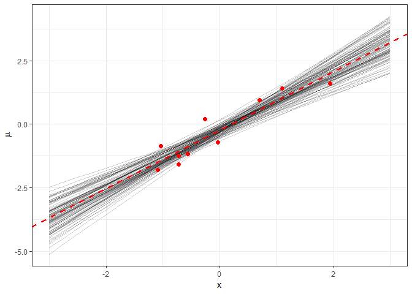

We have many more samples of the linear predictor we could include, but we will instead *summarize* the posterior samples of the linear predictor. The code chunk below calculates the posterior mean and the posterior 5th and 95th quantiles on the linear predictor. The posterior mean is displayed as a black line, and the posterior middle 90% *credible* interval is displayed as a ribbon. Based on the figure below, the posterior mean on  is very accurate relative to the *true* line.

``` r
post_preds %>% 
  group_by(x) %>% 
  summarise(avg_mu = mean(mu),
            q05_mu = quantile(mu, 0.05),
            q95_mu = quantile(mu, 0.95)) %>% 
  ungroup() %>% 
  ggplot(mapping = aes(x = x)) +
  geom_ribbon(mapping = aes(ymin = q05_mu,
                            ymax = q95_mu,
                            group = 1),
              fill = "grey") +
  geom_line(mapping = aes(y = avg_mu,
                          group = 1),
            color = "black", size = 1.15) +
  geom_point(data = train_df,
             mapping = aes(x = x, y = y),
             color = "red", size = 2) +
  geom_abline(slope = beta_1_true, intercept = beta_0_true,
              color = "red", linetype = "dashed", size = 1.05) +
  labs(y = expression(mu)) +
  theme_bw()
```

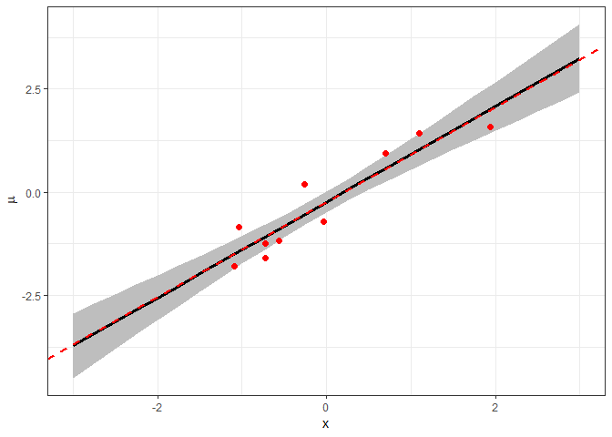

The grey ribbon shosws uncertainty interval on the linear predictor. It is very important to remember, that is all that it shows. It is our middle 90% uncertainty interval on the **mean** trend with respect to . Although the Bayesian term, *credible*, was used to describe this interval, it is also commonly referred to as a *confidence interval* on the mean. Regardless of the naming convention, it does **not** represent our uncertainty in potential response values. Uncertainty in predictions of observations, and not just means or averages or trends, require considering the **aleatory** source of uncertainty. Accounting for the additional *aleatory* uncertainty in a prediction is typically denoted by *prediction intervals*. You most likely have seen confidence intervals before, but prediction intervals are typically neglected.

To get used to dealing with random *aleatory* predictions, the code chunk below plots the randomly generated predictions associated with the first 11 posterior samples. Does the figure below look famaliar?

``` r
post_preds %>% 
  filter(post_id %in% 1:11) %>% 
  ggplot(mapping = aes(x = x, y = y)) +
  geom_point(color = "darkorange") + 
  theme_bw()
```

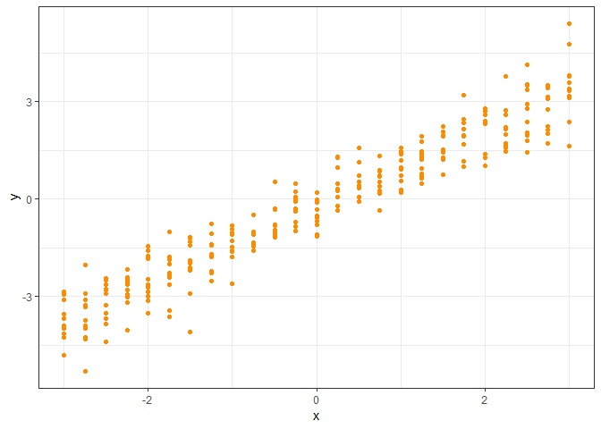

For context, include the linear predictor posterior predictive summaries, to see where the random predictions "fall" relative to the mean trend.

``` r
post_preds %>% 
  group_by(x) %>% 
  summarise(avg_mu = mean(mu),
            q05_mu = quantile(mu, 0.05),
            q95_mu = quantile(mu, 0.95)) %>% 
  ungroup() %>% 
  ggplot(mapping = aes(x = x)) +
  geom_ribbon(mapping = aes(ymin = q05_mu,
                            ymax = q95_mu,
                            group = 1),
              fill = "grey") +
  geom_line(mapping = aes(y = avg_mu,
                          group = 1),
            color = "black", size = 1.15) +
  geom_point(data = post_preds %>% 
               filter(post_id %in% 1:11),
             mapping = aes(x = x, y = y),
             color = "darkorange", size = 2) +
  labs(y = "y") +
  theme_bw()
```

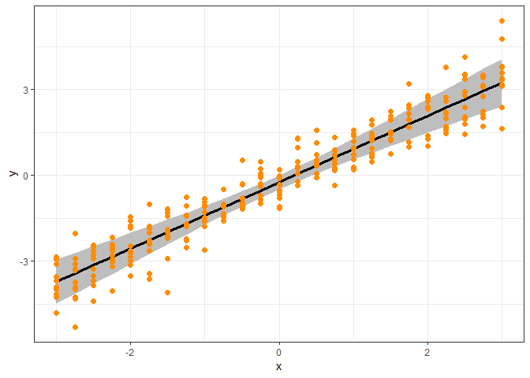

Now summarize the posterior prediction interval as the middle 90% uncertainty interval, and include all 100 randomly generated observations from the *true* data generating process. As shown in the figure below, the posterior 90% prediction interval appears representative of the scatter in the observations.

``` r
post_preds %>% 
  group_by(x) %>% 
  summarise(avg_mu = mean(mu),
            q05_mu = quantile(mu, 0.05),
            q95_mu = quantile(mu, 0.95),
            q05_rand = quantile(y, 0.05),
            q95_rand = quantile(y, 0.95)) %>% 
  ungroup() %>% 
  ggplot(mapping = aes(x = x)) +
  geom_ribbon(mapping = aes(ymin = q05_rand,
                            ymax = q95_rand,
                            group = 1),
              fill = "darkorange") +
  geom_ribbon(mapping = aes(ymin = q05_mu,
                            ymax = q95_mu,
                            group = 1),
              fill = "grey") +
  geom_line(mapping = aes(y = avg_mu,
                          group = 1),
            color = "black", size = 1.15) +
  geom_point(data = demo_df,
             mapping = aes(x = x, y = y),
             color = "black", size = 1) +
  geom_point(data = train_df,
             mapping = aes(x = x, y = y),
             color = "red", size = 2) +
  geom_abline(slope = beta_1_true, intercept = beta_0_true,
              color = "red", linetype = "dashed", size = 1.05) +
  labs(y = "y") +
  theme_bw()
```

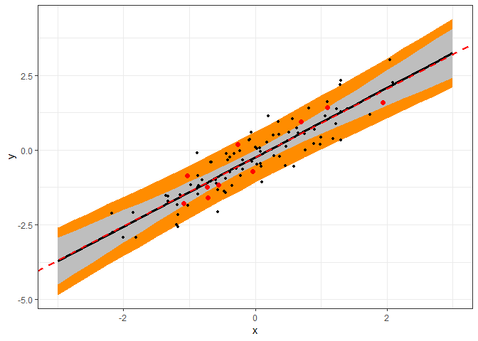

In addition to visualizing trends, we can use the posterior predictive distribution to answer various questions about the response. For example, suppose we were interested in calculating the probability that the response, , was between 0.25 and 1.15. Although we could consider answering that question with the observations directly, what if we were interested in that probability **as a function of the input x**? Although we have 100 observations in total for this example, we may not have enough to answer this type of question.

However, we can use the posterior predictive distribution to estimate the probability the response is within the desired interval with respect to . Let's first plot the interval as horizontal lines on top of the posterior predictive distribution with respective to .

``` r
post_preds %>% 
  group_by(x) %>% 
  summarise(avg_mu = mean(mu),
            q05_mu = quantile(mu, 0.05),
            q95_mu = quantile(mu, 0.95),
            q05_rand = quantile(y, 0.05),
            q95_rand = quantile(y, 0.95)) %>% 
  ungroup() %>% 
  ggplot(mapping = aes(x = x)) +
  geom_ribbon(mapping = aes(ymin = q05_rand,
                            ymax = q95_rand,
                            group = 1),
              fill = "darkorange") +
  geom_ribbon(mapping = aes(ymin = q05_mu,
                            ymax = q95_mu,
                            group = 1),
              fill = "grey") +
  geom_line(mapping = aes(y = avg_mu,
                          group = 1),
            color = "black", size = 1.15) +
  geom_hline(yintercept = c(0.25, 1.15),
             color = "steelblue", size = 1.25) +
  labs(y = "y") +
  theme_bw()
```

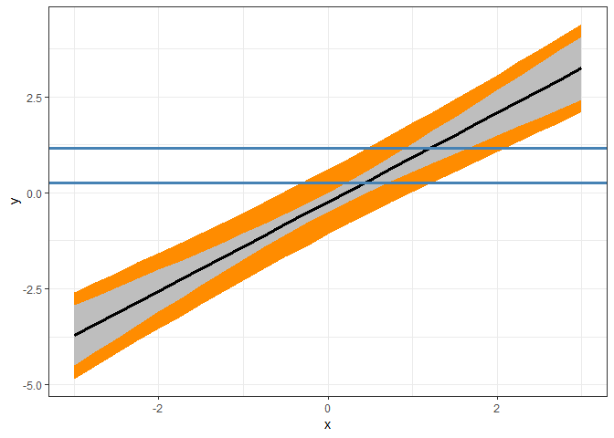

The probability of being within this defined interval is calculated and displayed with respect to  in the code chunk below.

``` r
post_preds %>% 
  group_by(x) %>% 
  summarise(prob_in_interval = mean(between(y, 0.25, 1.15))) %>% 
  ungroup() %>% 
  ggplot(mapping = aes(x = x, y = prob_in_interval)) +
  geom_line(mapping = aes(group = 1),
            color = "black", size = 1.2) +
  labs(y = "Pr(0.25 <= y <= 1.15)") +
  theme_bw()
```

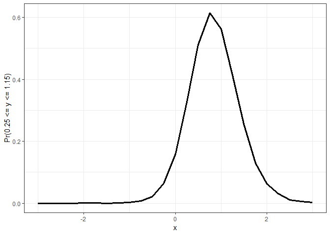
