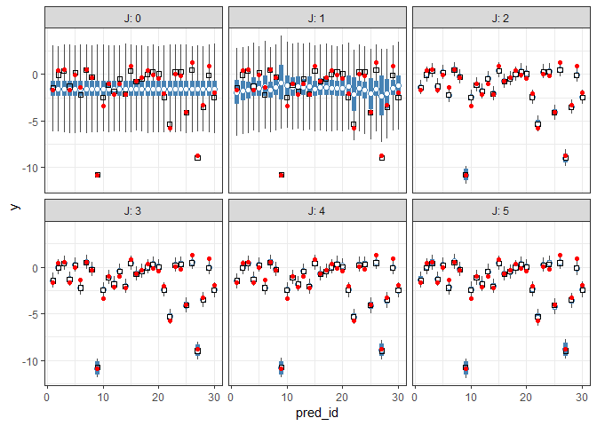
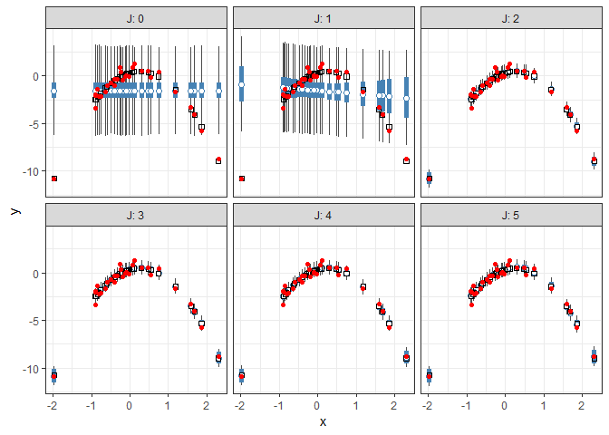
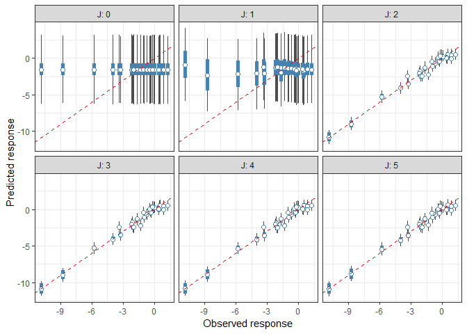
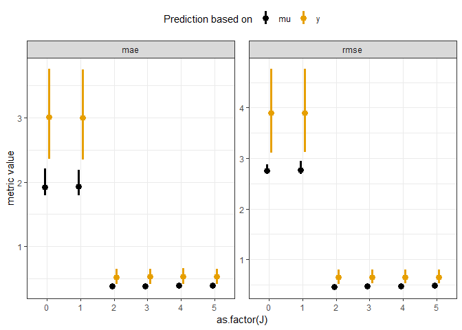
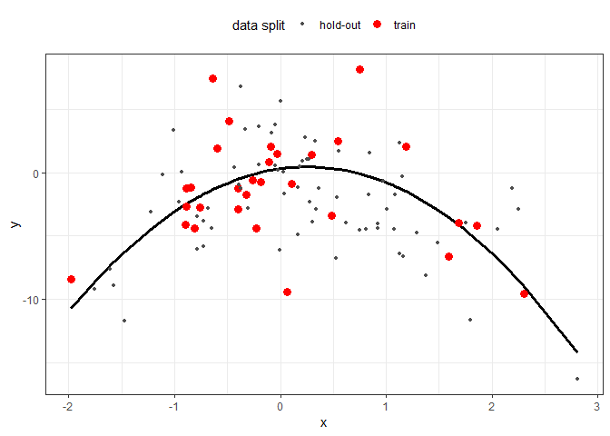
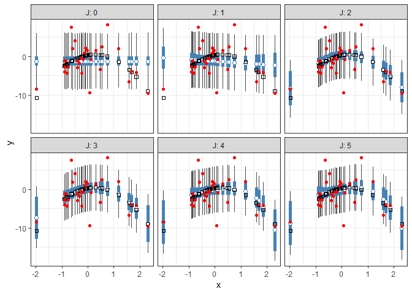
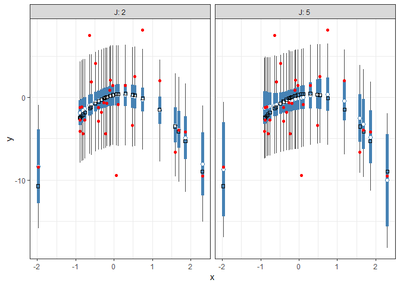
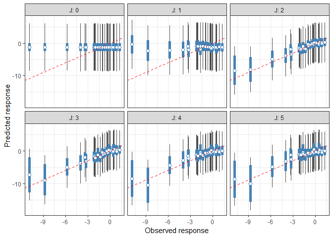
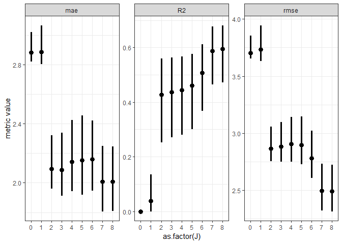

INFSCI 2595: Lecture 08
================
Dr. Joseph P. Yurko
September 18, 2019

Load packages
-------------

This document uses the following packages:

``` r
library(dplyr)
library(ggplot2)
```

In addition, functions from the following `tidyverse` packages are used: `tibble`, `tidyr`, and `purrr`. The `MASS` package is also required to complete all code chunks.

Linear?
-------

Can you identify which of the following are **linear models**?

![ 
\\mu\_n = \\beta\_{0} + \\beta\_{1} x\_n \\\\ \\mu\_n = \\beta\_{0} + \\beta\_{1} x\_{n,1} + \\beta\_{2} x\_{n,2} \\\\ \\mu\_n = \\beta\_{0} + \\beta\_{1} x\_{n,1} + \\beta\_{2} x\_{n,2} + \\beta\_{3} x\_{n,1} x\_{n,2} \\\\ \\mu\_{n} = \\beta\_{0} + \\beta\_{1} x\_{n,1} + \\beta\_{2} x\_{n,1}^{2} \\\\ \\mu\_{n} = \\beta\_{0} + \\beta\_{1} x\_{n,1} + \\beta\_{2} x\_{n,1}^{2} + \\beta\_{3} x\_{n,1}^{3} \\\\ \\mu\_{n} = \\beta\_{0} + \\beta\_{1} \\sin\\left( x\_{n} \\right) \\\\ \\mu\_{n} = \\beta\_0 + \\beta\_{1} \\sin\\left(1 + x\_{n}^{2} \\right) \\\\ \\mu\_{n} = \\beta\_{0} \\exp\\left( \\beta\_{1} x\_{n} \\right)
](https://latex.codecogs.com/png.latex?%20%0A%5Cmu_n%20%3D%20%5Cbeta_%7B0%7D%20%2B%20%5Cbeta_%7B1%7D%20x_n%20%5C%5C%20%5Cmu_n%20%3D%20%5Cbeta_%7B0%7D%20%2B%20%5Cbeta_%7B1%7D%20x_%7Bn%2C1%7D%20%2B%20%5Cbeta_%7B2%7D%20x_%7Bn%2C2%7D%20%5C%5C%20%5Cmu_n%20%3D%20%5Cbeta_%7B0%7D%20%2B%20%5Cbeta_%7B1%7D%20x_%7Bn%2C1%7D%20%2B%20%5Cbeta_%7B2%7D%20x_%7Bn%2C2%7D%20%2B%20%5Cbeta_%7B3%7D%20x_%7Bn%2C1%7D%20x_%7Bn%2C2%7D%20%5C%5C%20%5Cmu_%7Bn%7D%20%3D%20%5Cbeta_%7B0%7D%20%2B%20%5Cbeta_%7B1%7D%20x_%7Bn%2C1%7D%20%2B%20%5Cbeta_%7B2%7D%20x_%7Bn%2C1%7D%5E%7B2%7D%20%5C%5C%20%5Cmu_%7Bn%7D%20%3D%20%5Cbeta_%7B0%7D%20%2B%20%5Cbeta_%7B1%7D%20x_%7Bn%2C1%7D%20%2B%20%5Cbeta_%7B2%7D%20x_%7Bn%2C1%7D%5E%7B2%7D%20%2B%20%5Cbeta_%7B3%7D%20x_%7Bn%2C1%7D%5E%7B3%7D%20%5C%5C%20%5Cmu_%7Bn%7D%20%3D%20%5Cbeta_%7B0%7D%20%2B%20%5Cbeta_%7B1%7D%20%5Csin%5Cleft%28%20x_%7Bn%7D%20%5Cright%29%20%5C%5C%20%5Cmu_%7Bn%7D%20%3D%20%5Cbeta_0%20%2B%20%5Cbeta_%7B1%7D%20%5Csin%5Cleft%281%20%2B%20x_%7Bn%7D%5E%7B2%7D%20%5Cright%29%20%5C%5C%20%5Cmu_%7Bn%7D%20%3D%20%5Cbeta_%7B0%7D%20%5Cexp%5Cleft%28%20%5Cbeta_%7B1%7D%20x_%7Bn%7D%20%5Cright%29%0A " 
\mu_n = \beta_{0} + \beta_{1} x_n \\ \mu_n = \beta_{0} + \beta_{1} x_{n,1} + \beta_{2} x_{n,2} \\ \mu_n = \beta_{0} + \beta_{1} x_{n,1} + \beta_{2} x_{n,2} + \beta_{3} x_{n,1} x_{n,2} \\ \mu_{n} = \beta_{0} + \beta_{1} x_{n,1} + \beta_{2} x_{n,1}^{2} \\ \mu_{n} = \beta_{0} + \beta_{1} x_{n,1} + \beta_{2} x_{n,1}^{2} + \beta_{3} x_{n,1}^{3} \\ \mu_{n} = \beta_{0} + \beta_{1} \sin\left( x_{n} \right) \\ \mu_{n} = \beta_0 + \beta_{1} \sin\left(1 + x_{n}^{2} \right) \\ \mu_{n} = \beta_{0} \exp\left( \beta_{1} x_{n} \right)
")

Hint: only **one** of the above expressions is not a **linear model**.

The last expression, "), is **not** a linear model. **Why?** What makes a model a **linear** model?

The answer lies not in the relationship between the response and input variables, but with the **parameters**. If the relationships between the response and the **parameters** are linear, then the model is a linear model. To understand why, consider the ") function. What is known and what is unknown? When we collect data we observed input-ouput pairs, . Thus, the ") function is **known**. We do not need to learn the value of "), we can simply calculate.

However, we do not know the values of the  and  parameters. Those parameters must be *learned* from the data. As long as the parameters are linearly related to the responses, we can use the same mathematical formulation we saw previously to estimate them. We will see why later in this report.

The last expression breaks that setup because the  parameter is non-linearly related to the mean function. Although it might seem like we will need a non-linear fitting technique, look what happens if we take the natural-log of the expression:

![ 
\\log\\left\[\\mu\_n\\right\] = \\log\\left\[\\beta\_0\\right\] + \\beta\_{1} x\_{n}
](https://latex.codecogs.com/png.latex?%20%0A%5Clog%5Cleft%5B%5Cmu_n%5Cright%5D%20%3D%20%5Clog%5Cleft%5B%5Cbeta_0%5Cright%5D%20%2B%20%5Cbeta_%7B1%7D%20x_%7Bn%7D%0A " 
\log\left[\mu_n\right] = \log\left[\beta_0\right] + \beta_{1} x_{n}
")

Using this transformation, we need to learn the parameters ![\\log\[\\beta\_{0}\]](https://latex.codecogs.com/png.latex?%5Clog%5B%5Cbeta_%7B0%7D%5D "\log[\beta_{0}]") and  which are linearly related to the log of the response. Thus, there are techniques which allow us to *generalize* the linear modeling framework to handle many different situations.

Basis functions and predictors
------------------------------

To extend the linear model to handle non-linear input to output relationships, we need to define a *basis*. We will apply our inputs to those basis functions in order to define our new **design matrix**. The simplest set of non-linear basis functions to consider is the polynomial basis, where the basis functions take the form of increasing powers of the input. For example, for a single input, , the -th basis function is:

 = x^{j}
")

If we used a third order polynomial as our model, we would have a cubic function:

 \right) = \beta_0 + \beta_1 x + \beta_2 x^2 + \beta_3 x^3
")

 We can rewrite the above expression completely as a summation if we note that , and so:

 \right) = \beta_0 + \beta_1 x_n + \beta_2 x_{n}^{2} + \beta_3 x_{n}^{3}
")

 This raises an interesting nomenclature situation. Our cubic model above, consists of 1 input, , but there are 3 terms in addition to the intercept. If we assemble all of those terms into a **design matrix** we would have 4 columns even though we have a single input. Using the nomenclature from lecture 07, we would have said with one input, , the design matrix should have  columns. Here though, we clearly need 4 columns to our design matrix. We will therefore describe each column in our design matrix as a **predictor** or **feature** instead of as corresponding to an *input*. In this way, the predictor can be a function of an input or of multiple inputs.

Assembling a design matrix of basis functions is similar to assembling the design matrix of inputs. The difference being, of course, that each column is a predictor of the evaluated basis function. To make it clear this design matrix consists of basis functions and not the  inputs we will denote it as  instead of . For the polynomial basis, if the basis is order , the predictor or basis function design matrix is a ") matrix. In general, the predictor design matrix takes the form:

![ 
\\boldsymbol{\\Phi} = \\left\[\\begin{array}
{rrrr}
\\phi\_{1,0} & \\phi\_{1,1} & \\ldots & \\phi\_{1,J} \\\\
\\vdots & \\vdots & \\ddots & \\vdots\\\\
\\phi\_{N,0} & \\phi\_{N,1} & \\ldots & \\phi\_{N,J} 
\\end{array}\\right\]
](https://latex.codecogs.com/png.latex?%20%0A%5Cboldsymbol%7B%5CPhi%7D%20%3D%20%5Cleft%5B%5Cbegin%7Barray%7D%0A%7Brrrr%7D%0A%5Cphi_%7B1%2C0%7D%20%26%20%5Cphi_%7B1%2C1%7D%20%26%20%5Cldots%20%26%20%5Cphi_%7B1%2CJ%7D%20%5C%5C%0A%5Cvdots%20%26%20%5Cvdots%20%26%20%5Cddots%20%26%20%5Cvdots%5C%5C%0A%5Cphi_%7BN%2C0%7D%20%26%20%5Cphi_%7BN%2C1%7D%20%26%20%5Cldots%20%26%20%5Cphi_%7BN%2CJ%7D%20%0A%5Cend%7Barray%7D%5Cright%5D%0A " 
\boldsymbol{\Phi} = \left[\begin{array}
{rrrr}
\phi_{1,0} & \phi_{1,1} & \ldots & \phi_{1,J} \\
\vdots & \vdots & \ddots & \vdots\\
\phi_{N,0} & \phi_{N,1} & \ldots & \phi_{N,J} 
\end{array}\right]
")

 For our cubic model example, the predictor design matrix is:

![ 
\\boldsymbol{\\Phi} = \\left\[\\begin{array}
{rrrr}
1 & x\_1 & x\_1^2 & x\_1^3 \\\\
\\vdots & \\vdots & \\vdots & \\vdots\\\\
1 & x\_N & x\_N^2 & x\_N^3 
\\end{array}\\right\]
](https://latex.codecogs.com/png.latex?%20%0A%5Cboldsymbol%7B%5CPhi%7D%20%3D%20%5Cleft%5B%5Cbegin%7Barray%7D%0A%7Brrrr%7D%0A1%20%26%20x_1%20%26%20x_1%5E2%20%26%20x_1%5E3%20%5C%5C%0A%5Cvdots%20%26%20%5Cvdots%20%26%20%5Cvdots%20%26%20%5Cvdots%5C%5C%0A1%20%26%20x_N%20%26%20x_N%5E2%20%26%20x_N%5E3%20%0A%5Cend%7Barray%7D%5Cright%5D%0A " 
\boldsymbol{\Phi} = \left[\begin{array}
{rrrr}
1 & x_1 & x_1^2 & x_1^3 \\
\vdots & \vdots & \vdots & \vdots\\
1 & x_N & x_N^2 & x_N^3 
\end{array}\right]
")

 The unknown parameters are assembled into a ,1") column vector, . Which for our cubic model looks like:

![ 
\\boldsymbol{\\beta} = \\left\[\\begin{array}
{r}
\\beta\_0 \\\\
\\beta\_1 \\\\
\\beta\_2 \\\\
\\beta\_3
\\end{array}\\right\]
](https://latex.codecogs.com/png.latex?%20%0A%5Cboldsymbol%7B%5Cbeta%7D%20%3D%20%5Cleft%5B%5Cbegin%7Barray%7D%0A%7Br%7D%0A%5Cbeta_0%20%5C%5C%0A%5Cbeta_1%20%5C%5C%0A%5Cbeta_2%20%5C%5C%0A%5Cbeta_3%0A%5Cend%7Barray%7D%5Cright%5D%0A " 
\boldsymbol{\beta} = \left[\begin{array}
{r}
\beta_0 \\
\beta_1 \\
\beta_2 \\
\beta_3
\end{array}\right]
")

The vector linear predictor values, , can be written as the matrix-vector product of the predictor design matrix and the unknown parameter column vector:


### Model fitting

The above relationship is identical to what we discussed in lecture 07! Because of that, all of the previous discussion of fitting or learning of a linear model is still valid! We merely have to replace the  with . To make that point clear, quadratic portion of the log-likelihood written in terms of the predictor design matrix is:

^2 \right) = -\frac{1}{2\sigma^2}\left( \mathbf{y} - \boldsymbol{\Phi}\boldsymbol{\beta} \right)^{T} \left( \mathbf{y} - \boldsymbol{\Phi}\boldsymbol{\beta} \right) 
")

The Maximum Likelihood Estimate (MLE) on the unknown paramter vector, , is therefore:

^{-1} \boldsymbol{\Phi}^{T} \mathbf{y}
")

Likewise, the poseterior covariance matrix under the assumption of an infinitely diffuse prior and known likelihood standard deviation, , is:

 = \sigma^2 \left( \boldsymbol{\Phi}^{T} \boldsymbol{\Phi} \right)^{-1}
")

Essentially, from the point of view of fitting the model, the only thing that has changed is the nomenclature. (This is not entirely true...we have to be careful about certain issues which we will discuss later on in the course).

Synthetic data
--------------

As we did in lecture 07, let's create an example to practice working with *linear basis function models*. We will generate synthetic data from an assumed *true* model formulation. We will then see if we are able to accurately and precisely learn the parameters of that model given random observations. Our example problem will use a single input, , which comes from a standard normal distribution. We will assume  is related to a response, , through a quadratic function with the following *true* parameters:


 We will assume a relatively low noise level for our example problem with . Thus, our *true* model formulation is:

 \\ \mu_{n,\mathrm{true}} = \beta_{0,\mathrm{true}} + \beta_{1, \mathrm{true}} x_{n} + \beta_{2,\mathrm{true}} x_{n}^{2}
")

 Let's code up the quadratic relationship into a function which accepts two arguments, `x` and `beta_vec`. `x` is the input vector and `beta_vec` is the  vector.

``` r
my_quad_func <- function(x, beta_vec)
{
  beta_vec[1] + beta_vec[2] * x + beta_vec[3] * (x^2)
}
```

Next, let's generate 100 random observations of the input  from a standard normal:

``` r
set.seed(8001)
x_demo <- rnorm(n = 100, mean = 0, sd = 1)
```

The synthetic data are generated in the code chunk below. First, the *true* parameter values are specified. Then the *true* linear predictor is calculated with `my_quad_func()`. Finally, the linear predictor and the *true* standard deviation are used to generate random observations.

``` r
### set true parameter values
beta_true <- c(0.33, 1.15, -2.25)
sigma_true <- 0.45

### evaluate linear predictor and generate random observations
set.seed(8002)
demo_df <- tibble::tibble(
  x = x_demo
) %>% 
  mutate(mu = my_quad_func(x, beta_true),
         y = rnorm(n = n(),
                   mean = mu,
                   sd = sigma_true))
```

Visualize the *true* quadratic relationship and the random (noisy) observations.

``` r
demo_df %>% 
  ggplot(mapping = aes(x = x)) +
  geom_line(mapping = aes(y = mu),
            color = "black", size = 1.15) +
  geom_point(mapping = aes(y = y),
             color = "red", size = 2.5) +
  labs(y = "y") +
  theme_bw()
```


Let's separate the first 30 points from the remaining 70 points. We will use these first 30 to build/fit our model. We will call these 30 points, our training set. Note that, since we generated the points randomly, selecting the first 30 is equivalent to randomly selected 30 out of 100 points. In general, we cannot make this assumption and we would randomly subsample.

``` r
train_df <- demo_df %>% 
  tibble::rowid_to_column("obs_id") %>% 
  slice(1:30)
```

Let's highlight our training set compared with the other **hold-out** points.

``` r
demo_df %>% 
  tibble::rowid_to_column("obs_id") %>% 
  ggplot(mapping = aes(x = x)) +
  geom_line(mapping = aes(y = mu),
            color = "black", size = 1.15) +
  geom_point(mapping = aes(y = y,
                           color = obs_id < 31,
                           size = obs_id < 31)) +
  scale_color_manual("data split",
                     values = c("TRUE" = "red",
                                "FALSE" = "grey30"),
                     labels = c("TRUE" = "train",
                                "FALSE" = "hold-out")) +
  scale_size_manual("data split",
                    values = c("TRUE" = 3,
                               "FALSE" = 1.15),
                    labels = c("TRUE" = "train",
                               "FALSE" = "hold-out")) +
  labs(y = "y") +
  theme_bw() +
  theme(legend.position = "top")
```


Model selection
---------------

With our quadratic model, we have 3 linear predictor parameters and one unknown standard deviation. Thus we have 4 unknown parameters! However, since we are dealing with a linear model, the model fitting exercise will be the same as that used in lecture 07. Even though the functional relationship is different, all of the "mechanics" of the fitting process are the same. Thus, we can still use the Laplace approximation to approximate the posterior with a MVN distribution.

We will therefore move onto a more challenging question. What if we did not know the *true* input/output relationship? How would we proceed? Would we start out immediately with a quadratic relationship? Would we be able to say that such a model is significantly "better" or "more appropriate" than a linear relationship? Could we say that a cubic model is not needed?

Ultimately, in order to compare models we need to assess *performance*. We must consider accuracy, how well does the model "fit" the data? However, there is more to performance that simply reproducing the exact response values within the training set. We need to consider if the model will *generalize*, and understand if a model is too *complex*.

We will introduce these concepts with our simple quadratic example. We will compare an intercept only model up to and including a fifth order polynomial. We will therefore build and compare *6* different models!

### Predictor design matrix

In order to evaluate the different model formulations, we will need to either write a separate log-posterior function for each one, or write a more general function. In order to write a general linear model function, we will need to pass in a design matrix. Thus before writing that function, let's see how we can create efficiently create design matrices.

Let's first consider the quadratic relationship. The `train_df` object already has a column for the  variable, named `x`. To complete the design matrix will need to include a column of just 1s and a column equal to . We can manually create those terms with a `mutate()` call:

``` r
train_df %>% 
  mutate(intercept = 1,
         x_squared = x^2) %>% 
  select(intercept, x, x_squared)
```

    ## # A tibble: 30 x 3
    ##    intercept      x x_squared
    ##        <dbl>  <dbl>     <dbl>
    ##  1         1  1.19     1.41  
    ##  2         1  0.749    0.561 
    ##  3         1  0.482    0.232 
    ##  4         1 -0.636    0.404 
    ##  5         1 -0.110    0.0120
    ##  6         1 -0.843    0.711 
    ##  7         1  0.295    0.0871
    ##  8         1 -0.326    0.106 
    ##  9         1 -1.98     3.91  
    ## 10         1 -0.888    0.789 
    ## # ... with 20 more rows

In order to use the result within linear algebra operations we will need to pipe the resulting `tibble` into the `as.matrix()` function. The code chunk below saves the result to the variable `ex_design_mat_2` and then prints the first 6 rows of that matrix to the screen with the `head()` function.

``` r
ex_design_mat_2 <- train_df %>% 
  mutate(intercept = 1,
         x_squared = x^2) %>% 
  select(intercept, x, x_squared) %>% 
  as.matrix()

head(ex_design_mat_2)
```

    ##      intercept          x  x_squared
    ## [1,]         1  1.1868905 1.40870907
    ## [2,]         1  0.7488747 0.56081331
    ## [3,]         1  0.4815022 0.23184440
    ## [4,]         1 -0.6358824 0.40434647
    ## [5,]         1 -0.1097598 0.01204722
    ## [6,]         1 -0.8432582 0.71108438

Although simple to do, this procedure may not scale well to higher dimensions. Therefore, we might like to use a more "programmatic" solution. We will therefore introduce the `model.matrix()` function which builds a design matrix using `R`'s formula interface. The formula interface allows us to type a `"formula"` and it produces the necessary columns of the *predictors*. This might sound confusing, so let's just try it out with our example. `model.matrix()` requires two primary arguments, the `"formula"` and the data object. The names in the data object are used to construct the columns of the design matrix to match the specified formula. For our specific example we type:

``` r
design_quad <- model.matrix(y ~ x + I(x^2), train_df)
```

The formula interface reads as `<response> ~ <input expression>`. The `~` therefore reads as "as a function of". The specific formula typed into `model.matrix()` reads as " is a function of  and ". `model.matrix()` automatically creates a column for the intercept, thus we do not need to specify it in the formula. The squared term looks a little odd in the formula, but the `I()` function is the "As-is" function. It enforces that we are using the  variable squared.

Let's now go ahead and print the first 6 rows of the design matrix to the screen. As shown below the matrix has 3 columns and the first column is named `"(Intercept)"` and consists of 1s.

``` r
head(design_quad)
```

    ##   (Intercept)          x     I(x^2)
    ## 1           1  1.1868905 1.40870907
    ## 2           1  0.7488747 0.56081331
    ## 3           1  0.4815022 0.23184440
    ## 4           1 -0.6358824 0.40434647
    ## 5           1 -0.1097598 0.01204722
    ## 6           1 -0.8432582 0.71108438

At first, the formula interface may not sound "programmatic", but a character string can be used to define the formula as shown below:

``` r
model.matrix(as.formula("y ~ x + I(x^2)"), train_df) %>% head()
```

    ##   (Intercept)          x     I(x^2)
    ## 1           1  1.1868905 1.40870907
    ## 2           1  0.7488747 0.56081331
    ## 3           1  0.4815022 0.23184440
    ## 4           1 -0.6358824 0.40434647
    ## 5           1 -0.1097598 0.01204722
    ## 6           1 -0.8432582 0.71108438

Alternatively, rather than typing out the formula, we can use the `poly()` function. By default, `poly()` returns orthogonal polynomials. To create the polynomials with the variables as is, and thus not return orthogonal polynomials, we need to set the `raw` argument equal to `TRUE`.

``` r
head(model.matrix(y ~ poly(x,2, raw = TRUE), train_df))
```

    ##   (Intercept) poly(x, 2, raw = TRUE)1 poly(x, 2, raw = TRUE)2
    ## 1           1               1.1868905              1.40870907
    ## 2           1               0.7488747              0.56081331
    ## 3           1               0.4815022              0.23184440
    ## 4           1              -0.6358824              0.40434647
    ## 5           1              -0.1097598              0.01204722
    ## 6           1              -0.8432582              0.71108438

Let's now create the design matrices for the other 5 model forms we will use.

``` r
design_int <- model.matrix(y ~ 1, train_df)

design_lin <- model.matrix(y ~ x, train_df)

design_cube <- model.matrix(y ~ x + I(x^2) + I(x^3), train_df)

design_4 <- model.matrix(y ~ x + I(x^2) + I(x^3) + I(x^4), train_df)

design_5 <- model.matrix(y ~ x + I(x^2) + I(x^3) + I(x^4) + I(x^5), train_df)
```

### Probability model

Let's write out a generic probability model that we will work with. We will use independent zero mean gaussian priors on all linear predictor parameters, , with prior standard deviations equal to . We will use a uniform prior on  with lower bound equal to 0 and upper bound equal to 10. Since all of the linear predictor coefficients use the same standard deviation, we can write out our generic probability model as:

 \\ \mu_{n} = \mathbf{x}_{n,:} \boldsymbol{\beta} \\ \boldsymbol{\beta} \sim \mathcal{N}\left(\boldsymbol{\beta} \mid \mathbf{0}, 2.5 \cdot \mathbf{I}_{J+1} \right) \\ \sigma \sim \mathrm{uniform} \left(\sigma \mid 0, 10 \right)
")

The prior on the linear predictor coefficients is written as a MVN distribution. The term  denotes the identity matrix with  rows and columns. Since the identity matrix consists of 1's along the main diagonal and zeros everywhere else, the MVN distribution defined above states all parameters are independent with prior standard deviation equal to .

The probability model is written in terms of , but as we did last lecture we will work with a log-transformed unbounded parameter instead. To limit confusion with the basis function notation from earlier in this document, we will denote the unbounded parameter as:

![ 
\\varphi = \\log\\left\[\\sigma\\right\]
](https://latex.codecogs.com/png.latex?%20%0A%5Cvarphi%20%3D%20%5Clog%5Cleft%5B%5Csigma%5Cright%5D%0A " 
\varphi = \log\left[\sigma\right]
")

### Log-posterior function

Let's now create our general log-posterior function. There are two input arguments, `theta` and `my_info`. All unknown parameters are stored in the `theta` vector, and the last element corresponds to the unbounded standard deviation . The `my_info` list stores all other information necessary to evaluate the log-posterior, just as we used previously. In addition to storing the observations and hyperparameter information, `my_info` also stores the number of linear predictor parameters.

The log-posterior function is coded below. Note that the `sum()` function is now wrapped around the log-prior density evaluation of the  parameters. **Do you understand each line of code below?**

``` r
lm_logpost <- function(theta, my_info)
{
  # unpack the parameter vector
  beta_v <- theta[1:my_info$length_beta]
  
  # back-transform from phi to sigma
  lik_phi <- theta[my_info$length_beta + 1]
  lik_sigma <- exp(lik_phi)
  
  # calculate linear predictor
  X <- my_info$design_matrix
  
  mu <- as.vector(X %*% as.matrix(beta_v))
  
  # evaluate the log-likelihood
  log_lik <- sum(dnorm(x = my_info$yobs,
                       mean = mu,
                       sd = lik_sigma,
                       log = TRUE))
  
  # evaluate the log-prior
  log_prior_beta <- sum(dnorm(x = beta_v,
                              mean = my_info$mu_beta,
                              sd = my_info$tau_beta,
                              log = TRUE)) 
  
  log_prior_sigma <- dunif(x = lik_sigma,
                           min = my_info$sigma_lwr,
                           max = my_info$sigma_upr,
                           log = TRUE)
  
  log_prior <- log_prior_beta + log_prior_sigma
  
  # account for the transformation
  log_derive_adjust <- lik_phi
  
  # sum together
  log_lik + log_prior + log_derive_adjust
}
```

We will continue to use the same wrapper function to perform the Laplace approximation.

``` r
my_laplace <- function(start_guess, logpost_func, ...)
{
  # code adapted from the `LearnBayes`` function `laplace()`
  fit <- optim(start_guess,
               logpost_func,
               gr = NULL,
               ...,
               method = "BFGS",
               hessian = TRUE,
               control = list(fnscale = -1, maxit = 1001))
  
  mode <- fit$par
  h <- -solve(fit$hessian)
  p <- length(mode)
  int <- p/2 * log(2 * pi) + 0.5 * log(det(h)) + logpost_func(mode, ...)
  list(mode = mode,
       var_matrix = h,
       log_evidence = int,
       converge = ifelse(fit$convergence == 0,
                         "YES", 
                         "NO"),
       iter_counts = fit$counts[1])
}
```

Let's create a second wrapper function to allow us to loop over the polynomial order. This wrapper function will manage assembling the design matrix with the rest of the required information. It will also specify a random initial guess for the optimizer.

``` r
manage_poly_order <- function(design_use, logpost_func, my_settings)
{
  # include the design matrix with the settings
  my_settings$design_matrix <- design_use
  
  # specify the number of linear predictor parameters
  my_settings$length_beta <- ncol(design_use)
  
  # generate random initial guess
  init_beta <- rnorm(my_settings$length_beta, 0, 1)
  
  init_phi <- log(runif(1, min = 0, max = 2.5))
  
  # execute laplace approximation
  my_laplace(c(init_beta, init_phi), logpost_func, my_settings)
}
```

### Laplace approximation

The code chunk below creates our list of required information.

``` r
info_use <- list(
  yobs = train_df$y,
  mu_beta = 0,
  tau_beta = 2.5,
  sigma_lwr = 0,
  sigma_upr = 10
)
```

We can now loop over all of the candidate models. The `purrr::map()` function is used to execute the looping operation. Each Laplace approximation result is stored as an element in a list.

``` r
set.seed(8003)
laplace_results <- purrr::map(list(design_int, design_lin, design_quad,
                                   design_cube, design_4, design_5),
                              manage_poly_order,
                              logpost_func = lm_logpost,
                              my_settings = info_use)
```

The `laplace_results` object is a list of 6 elements. Each element is itself a list containing the fields associated with the `my_laplace()` results. For example, the intercept-only model as the result:

``` r
laplace_results[[1]]
```

    ## $mode
    ## [1] -1.558553  1.012874
    ## 
    ## $var_matrix
    ##             [,1]        [,2]
    ## [1,] 0.243157292 0.002090926
    ## [2,] 0.002090926 0.017259359
    ## 
    ## $log_evidence
    ## [1] -76.673
    ## 
    ## $converge
    ## [1] "YES"
    ## 
    ## $iter_counts
    ## function 
    ##       38

The linear relationship model has the following result:

``` r
laplace_results[[2]]
```

    ## $mode
    ## [1] -1.5585224 -0.3251661  1.0057815
    ## 
    ## $var_matrix
    ##               [,1]          [,2]         [,3]
    ## [1,]  0.2398633796 -0.0004281571 0.0020717440
    ## [2,] -0.0004281571  0.2691685155 0.0004743273
    ## [3,]  0.0020717440  0.0004743273 0.0172572054
    ## 
    ## $log_evidence
    ## [1] -78.05762
    ## 
    ## $converge
    ## [1] "YES"
    ## 
    ## $iter_counts
    ## function 
    ##       16

The quadratic relationship model:

``` r
laplace_results[[3]]
```

    ## $mode
    ## [1]  0.3880257  1.1654817 -2.2714416 -0.7975118
    ## 
    ## $var_matrix
    ##               [,1]          [,2]          [,3]          [,4]
    ## [1,]  1.063695e-02  0.0028949331 -4.391554e-03 -9.627767e-05
    ## [2,]  2.894933e-03  0.0098064892 -3.292075e-03 -1.102664e-04
    ## [3,] -4.391554e-03 -0.0032920746  4.969572e-03  9.277129e-05
    ## [4,] -9.627767e-05 -0.0001102664  9.277129e-05  1.724334e-02
    ## 
    ## $log_evidence
    ## [1] -33.22558
    ## 
    ## $converge
    ## [1] "YES"
    ## 
    ## $iter_counts
    ## function 
    ##       55

We can extract the `converge` field to quickly see if all model builds completed successfully. As show below, all laplace approximations did complete succesfully.

``` r
purrr::map_chr(laplace_results, "converge")
```

    ## [1] "YES" "YES" "YES" "YES" "YES" "YES"

### Posterior predictions

We will start assessing model performance by predicting the training set. We will first draw random samples from the MVN approximate posterior, and then back-transform from  to . Once we have those random samples we will make posterior predictions and summarize those predictions.

Define a function which generates the random posterior samples.

``` r
draw_post_samples <- function(approx_result, length_beta, num_samples)
{
  MASS::mvrnorm(n = num_samples, 
                mu = approx_result$mode, 
                Sigma = approx_result$var_matrix) %>% 
    as.data.frame() %>% tbl_df() %>% 
    purrr::set_names(c(sprintf("beta_%0d", 1:length_beta), "phi")) %>% 
    mutate(sigma = exp(phi))
}
```

Next, define a function which makes posterior predictions and then summarizes them. The first argument to `post_pred_summarize()` is a design matrix. The name `Xnew` is used to represent predictions can be made on potentially new, or test, predictor values. The second argument, `Bmat`, is a matrix of the linear predictor parameters. The columns of `Bmat` correspond to separate posterior samples of the  column vector. The third argument, `sigma_vector`, is a vector containing all posterior samples of the likelihood standard deviation.

``` r
post_pred_summarize <- function(Xnew, Bmat, sigma_vector)
{
  # matrix of linear predictors
  Umat <- Xnew %*% Bmat
  
  # number of new prediction locations
  M <- nrow(Xnew)
  # number of posterior samples
  S <- ncol(Bmat)
  
  # assmeble matrix of sigma samples
  Rmat <- matrix(rep(sigma_vector, M), M, byrow = TRUE)
  
  # generate standard normal and assemble into matrix
  Zmat <- matrix(rnorm(M*S), M, byrow = TRUE)
  
  # calculate the random observation predictions
  Ymat <- Umat + Rmat * Zmat
  
  # summarize the linear predictor predictions
  mu_avg <- rowMeans(Umat)
  mu_q05 <- apply(Umat, 1, stats::quantile, probs = 0.05)
  mu_q95 <- apply(Umat, 1, stats::quantile, probs = 0.95)
  
  # summarize the posterior observation predictions
  y_avg <- rowMeans(Ymat)
  y_q05 <- apply(Ymat, 1, stats::quantile, probs = 0.05)
  y_q95 <- apply(Ymat, 1, stats::quantile, probs = 0.95)
  
  # package together
  cbind(mu_avg = mu_avg, mu_q05 = mu_q05, mu_q95 = mu_q95,
        y_avg = y_avg, y_q05 = y_q05, y_q95 = y_q95)
}
```

Define a function which manages drawing the posterior samples and making predictions for a given Laplace approximation result.

``` r
predict_from_laplace <- function(mvn_result, newdata, num_post_samples)
{
  # draw posterior samples
  post <- draw_post_samples(mvn_result, ncol(newdata), num_post_samples)
  
  # separate linear predictor and sigma samples
  post_beta <- post %>% select(starts_with("beta_")) %>% as.matrix()
  
  post_sigma <- post %>% pull(sigma)
  
  # summarize posterior predictions
  post_pred_summarize(newdata, t(post_beta), post_sigma) %>% 
    as.data.frame() %>% tbl_df() %>% 
    mutate(J = ncol(newdata) - 1) %>% 
    tibble::rowid_to_column("pred_id")
}
```

Finally, make 10000 posterior predictions from each model.

``` r
set.seed(8005)
post_pred_train_all <- purrr::map2_dfr(laplace_results,
                                       list(design_int, design_lin, design_quad,
                                            design_cube, design_4, design_5),
                                       predict_from_laplace,
                                       num_post_samples = 1e4)
```

### Model performance

We can now use our summarized posterior predictions to get a sense of the accuracy of the model, with respect to the training set. We will explore the performance visually at first.

Because we have a relatively small number of training points, let's plot the predictive summaries on the y-axis vs the observation index on the x-axis. For additional context, the *true* noise-free signal is shown as a black square while the noisy observation is shown as a red dot. The posterior linear prediction summaries are shown in blue, while the posterior prediction summary in shown in grey.

``` r
post_pred_train_all %>% 
  left_join(train_df %>% 
              rename(pred_id = obs_id, 
                     mu_true = mu,
                     y_obs = y),
            by = "pred_id") %>% 
  ggplot(mapping = aes(x = pred_id)) +
  geom_linerange(mapping = aes(ymin = y_q05,
                               ymax = y_q95,
                               group = interaction(pred_id, J)),
                 color = "grey30") +
  geom_linerange(mapping = aes(ymin = mu_q05,
                               ymax = mu_q95,
                               group = interaction(pred_id, J)),
                 color = "steelblue", size = 1.85) +
  geom_point(mapping = aes(y = mu_avg),
             shape = 21, size = 2.25, color = "steelblue",
             fill = "white") +
  geom_point(mapping = aes(y = mu_true),
             shape = 0, color = "black") +
  geom_point(mapping = aes(y = y_obs),
             color = "red") +
  facet_wrap(~J, labeller = "label_both") +
  labs(y = "y") +
  theme_bw()
```



Next, visualize the prediction summaries with respect to the input.

``` r
post_pred_train_all %>% 
  left_join(train_df %>% 
              rename(pred_id = obs_id, 
                     mu_true = mu,
                     y_obs = y),
            by = "pred_id") %>% 
  ggplot(mapping = aes(x = x)) +
  geom_linerange(mapping = aes(ymin = y_q05,
                               ymax = y_q95,
                               group = interaction(pred_id, J)),
                 color = "grey30") +
  geom_linerange(mapping = aes(ymin = mu_q05,
                               ymax = mu_q95,
                               group = interaction(pred_id, J)),
                 color = "steelblue", size = 1.85) +
  geom_point(mapping = aes(y = mu_avg),
             shape = 21, size = 2.25, color = "steelblue",
             fill = "white") +
  geom_point(mapping = aes(y = mu_true),
             shape = 0, color = "black") +
  geom_point(mapping = aes(y = y_obs),
             color = "red") +
  facet_wrap(~J, labeller = "label_both") +
  labs(y = "y") +
  theme_bw()
```



Let's visualize the **prediction-vs-observed** figure:

``` r
post_pred_train_all %>% 
  left_join(train_df %>% 
              rename(pred_id = obs_id, 
                     mu_true = mu,
                     y_obs = y),
            by = "pred_id") %>% 
  ggplot(mapping = aes(x = y_obs)) +
  geom_linerange(mapping = aes(ymin = y_q05,
                               ymax = y_q95,
                               group = interaction(pred_id, J)),
                 color = "grey30") +
  geom_linerange(mapping = aes(ymin = mu_q05,
                               ymax = mu_q95,
                               group = interaction(pred_id, J)),
                 color = "steelblue", size = 1.85) +
  geom_point(mapping = aes(y = mu_avg),
             shape = 21, size = 2.25, color = "steelblue",
             fill = "white") +
  geom_abline(slope = 1, intercept = 0, color = "red", linetype = "dashed") +
  facet_wrap(~J, labeller = "label_both") +
  labs(y = "Predicted response",
       x = "Observed response") +
  theme_bw()
```



#### Performance metrics

Now that we have looked at the predictions relative to the observations in the training set, let's summarize the posterior predictive performance. To do so, we will summarize the posterior distribution on the residuals or errors. We define a new function below, which is setup similar to `post_pred_summarize()`. The difference however is that the additional argument `y_ref` is the vector of (noisy) responses we are comparing to. The errors are calculated two ways, first relative to the linear predictor, and second relative to the random observation prediction.

``` r
post_pred_error_summarize <- function(Xnew, Bmat, sigma_vector, y_ref)
{
  # matrix of linear predictors
  Umat <- Xnew %*% Bmat
  
  # number of new prediction locations
  M <- nrow(Xnew)
  # number of posterior samples
  S <- ncol(Bmat)
  
  # assmeble matrix of sigma samples
  Rmat <- matrix(rep(sigma_vector, M), M, byrow = TRUE)
  
  # generate standard normal and assemble into matrix
  Zmat <- matrix(rnorm(M*S), M, byrow = TRUE)
  
  # calculate the random observation predictions
  Ymat <- Umat + Rmat * Zmat
  
  # create the matrix of observed target values to compare to
  RefMat <- t(matrix(rep(y_ref, S), S, byrow = TRUE))
  
  # calculate the errors
  mu_errors_mat <- Umat - RefMat
  y_errors_mat <- Ymat - RefMat
  
  # summarize the linear predictor errors - calculate RMSE and MAE
  mu_rmse_vec <- sqrt(colMeans(mu_errors_mat^2))
  mu_mae_vec <- colMeans(abs(mu_errors_mat))
  
  mu_rmse_avg <- mean(mu_rmse_vec)
  mu_rmse_q05 <- quantile(mu_rmse_vec, 0.05)
  mu_rmse_q95 <- quantile(mu_rmse_vec, 0.95)
  mu_mae_avg <- mean(mu_mae_vec)
  mu_mae_q05 <- quantile(mu_mae_vec, 0.05)
  mu_mae_q95 <- quantile(mu_mae_vec, 0.95)
  
  # summarize the posterior prediction errors - calculate RMSE and MAE
  y_rmse_vec <- sqrt(colMeans(y_errors_mat^2))
  y_mae_vec <- colMeans(abs(y_errors_mat))
  
  y_rmse_avg <- mean(y_rmse_vec)
  y_rmse_q05 <- quantile(y_rmse_vec, 0.05)
  y_rmse_q95 <- quantile(y_rmse_vec, 0.95)
  y_mae_avg <- mean(y_mae_vec)
  y_mae_q05 <- quantile(y_mae_vec, 0.05)
  y_mae_q95 <- quantile(y_mae_vec, 0.95)
  
  # package together
  tibble::tibble(
    pred_from = rep(c("mu", "y"), each = 2),
    metric_name = rep(c("rmse", "mae"), times = 2),
    metric_avg = c(mu_rmse_avg, mu_mae_avg, y_rmse_avg, y_mae_avg),
    metric_q05 = c(mu_rmse_q05, mu_mae_q05, y_rmse_q05, y_mae_q05),
    metric_q95 = c(mu_rmse_q95, mu_mae_q95, y_rmse_q95, y_mae_q95)
  )
}
```

Wrap into a function which manages the execution for a single model type.

``` r
errors_from_laplace <- function(mvn_result, newdata, num_post_samples, y_target)
{
  # draw posterior samples
  post <- draw_post_samples(mvn_result, ncol(newdata), num_post_samples)
  
  # separate linear predictor and sigma samples
  post_beta <- post %>% select(starts_with("beta_")) %>% as.matrix()
  
  post_sigma <- post %>% pull(sigma)
  
  # summarize posterior prediction errors
  post_pred_error_summarize(newdata, t(post_beta), post_sigma, y_target) %>% 
    mutate(J = ncol(newdata) - 1)
}
```

Now, calculate the posterior error summary statistics for each model type.

``` r
set.seed(8006)
post_pred_error_train_all <- purrr::map2_dfr(laplace_results,
                                             list(design_int, design_lin, design_quad,
                                                  design_cube, design_4, design_5),
                                             errors_from_laplace,
                                             num_post_samples = 1e4,
                                             y_target = train_df$y)
```

Compare the error metric posterior summaries across the model types.

``` r
post_pred_error_train_all %>% 
  ggplot(mapping = aes(x = as.factor(J))) +
  geom_linerange(mapping = aes(ymin = metric_q05,
                               ymax = metric_q95,
                               group = interaction(pred_from, metric_name, J),
                               color = pred_from),
                 size = 1.25,
                 position = position_dodge(0.25)) +
  geom_point(mapping = aes(y = metric_avg,
                           group = interaction(pred_from, metric_name, J),
                           color = pred_from),
             size = 2.85,
             position = position_dodge(0.25)) +
  facet_wrap(~metric_name, scales = "free_y") +
  ggthemes::scale_color_colorblind("Prediction based on") +
  labs(y = "metric value") +
  theme_bw() +
  theme(legend.position = "top")
```



### Bayesian model selection

In the first week of the semester, we introduced Bayes' theorem with the following terms:


However, in all lectures since week 1 we have written Bayes' theorem as a proportional statement:


The reason for this is that the denominator, the , is very difficult to compute. In fact, in most cases it cannot be computed analytically. The , or the marginal likelihood, is the average prior predictive density of the **data**. If all of the unknown parameters are contained within , then the marginal likelihood can be written as:

 = \int{p\left( \mathbf{y} \mid \mathbf{X},\boldsymbol{\theta}\right) p\left(\boldsymbol{\theta}\right) d\boldsymbol{\theta}}
")

The first term within the integral is the likelihood, $p( ,) $. The second term is the prior distribution on the unknown parameters, "). We are therefore averaging, or marginalizing, out the parameters with respect to the prior. The marginal likelihood is therefore the probability of the observations, accounting for all possible ways the model can fit the data.

If we can compute the marginal likelihood, we can use it to compare models, since by it's very nature it accounts for the accuracy, the number of parameters, and the possible values of the parameters. Fortunately, with the Laplace approximation we have a way to estimate the evidence. This estimate is not perfect, but we can use it to compare the models, with respect to our approximate computational strategy.

If we define the evidence for model a as ") we can compare two models by calculating the ratios of their marginal likelihoods. This ratio is referred to as the **Bayes Factor**. The Bayes Factor of model 0 relative to model 1 is therefore:

}{p\left(\mathbf{y} \mid \mathbf{X}, M_1\right)}
")

If the Bayes Factor is much greater than one, then it is expected that the Model 0 is more plausible than Model 1.

In fact, we can calculate the posterior probability of a model, in light of trying multiple models, through the evidence. Let's see how to do that for our specific example. Extract the log-evidence associated with each model:

``` r
model_evidence <- purrr::map_dbl(laplace_results, "log_evidence")
```

If we assume all models are equally probable *a priori* then the posterior model probabilities are just the evidence for each model divided by the sum of the evidences. As shown in the result below, the posterior probability of the quadratic relationship is almost 98%!

``` r
signif(100*exp(model_evidence) / sum(exp(model_evidence)), 4)
```

    ## [1] 1.321e-17 3.308e-18 9.769e+01 2.258e+00 4.648e-02 1.361e-03

Noisy data
----------

Our synthetic data example used a relatively low  value to generate the random observations. Let's retry everything, but this time with higher noise level of . Split the noisy dataset into the same 30 training points with respect to the  values.

``` r
sigma_noisy <- 3.5

### evaluate linear predictor and generate random observations
set.seed(8100)
noisy_df <- tibble::tibble(
  x = x_demo
) %>% 
  mutate(mu = my_quad_func(x, beta_true),
         y = rnorm(n = n(),
                   mean = mu,
                   sd = sigma_noisy))

### create noisy training set
train_noisy <- noisy_df %>% 
  tibble::rowid_to_column("obs_id") %>% 
  slice(1:30)
```

Visualize the noisy dataset relative to the true noise-free quadratic relationship:

``` r
noisy_df %>% 
  tibble::rowid_to_column("obs_id") %>% 
  ggplot(mapping = aes(x = x)) +
  geom_line(mapping = aes(y = mu),
            color = "black", size = 1.15) +
  geom_point(mapping = aes(y = y,
                           color = obs_id < 31,
                           size = obs_id < 31)) +
  scale_color_manual("data split",
                     values = c("TRUE" = "red",
                                "FALSE" = "grey30"),
                     labels = c("TRUE" = "train",
                                "FALSE" = "hold-out")) +
  scale_size_manual("data split",
                    values = c("TRUE" = 3,
                               "FALSE" = 1.15),
                    labels = c("TRUE" = "train",
                               "FALSE" = "hold-out")) +
  labs(y = "y") +
  theme_bw() +
  theme(legend.position = "top")
```



In the code chunk below, we reperform the Laplace approximation for each of the model types. We can use the exact same design matrices as we did before because the  values are still the same.

``` r
info_noisy <- list(
  yobs = train_noisy$y,
  mu_beta = 0,
  tau_beta = 2.5,
  sigma_lwr = 0,
  sigma_upr = 10
)

set.seed(8101)
laplace_noisy <- purrr::map(list(design_int, design_lin, design_quad,
                                 design_cube, design_4, design_5),
                            manage_poly_order,
                            logpost_func = lm_logpost,
                            my_settings = info_noisy)
```

Let's check that each of the model types converged:

``` r
purrr::map_chr(laplace_noisy, "converge")
```

    ## [1] "YES" "YES" "YES" "YES" "YES" "YES"

Look at the Laplace approximation result for the quadratic model.

``` r
laplace_noisy[[3]]
```

    ## $mode
    ## [1]  0.2227645  0.6835104 -1.8547282  1.2671445
    ## 
    ## $var_matrix
    ##              [,1]        [,2]         [,3]         [,4]
    ## [1,]  0.586716850  0.14299642 -0.232627281 -0.003640629
    ## [2,]  0.142996424  0.54815307 -0.173296687 -0.004015120
    ## [3,] -0.232627281 -0.17329669  0.280492060  0.003809219
    ## [4,] -0.003640629 -0.00401512  0.003809219  0.017299949
    ## 
    ## $log_evidence
    ## [1] -86.80547
    ## 
    ## $converge
    ## [1] "YES"
    ## 
    ## $iter_counts
    ## function 
    ##       31

Next, make posterior predictions on the training set based on our approximate MVN posterior distributions.

``` r
set.seed(8102)
post_pred_train_noisy <- purrr::map2_dfr(laplace_noisy,
                                         list(design_int, design_lin, design_quad,
                                              design_cube, design_4, design_5),
                                         predict_from_laplace,
                                         num_post_samples = 1e4)
```

Let's first look at the predictions with respect the input :

``` r
post_pred_train_noisy %>% 
  left_join(train_noisy %>% 
              rename(pred_id = obs_id, 
                     mu_true = mu,
                     y_obs = y),
            by = "pred_id") %>% 
  ggplot(mapping = aes(x = x)) +
  geom_linerange(mapping = aes(ymin = y_q05,
                               ymax = y_q95,
                               group = interaction(pred_id, J)),
                 color = "grey30") +
  geom_linerange(mapping = aes(ymin = mu_q05,
                               ymax = mu_q95,
                               group = interaction(pred_id, J)),
                 color = "steelblue", size = 1.85) +
  geom_point(mapping = aes(y = mu_avg),
             shape = 21, size = 2.25, color = "steelblue",
             fill = "white") +
  geom_point(mapping = aes(y = mu_true),
             shape = 0, color = "black") +
  geom_point(mapping = aes(y = y_obs),
             color = "red") +
  facet_wrap(~J, labeller = "label_both") +
  labs(y = "y") +
  theme_bw()
```



Focus just on the second-order and fifth-order models:

``` r
post_pred_train_noisy %>% 
  left_join(train_noisy %>% 
              rename(pred_id = obs_id, 
                     mu_true = mu,
                     y_obs = y),
            by = "pred_id") %>% 
  filter(J %in% c(2, 5)) %>% 
  ggplot(mapping = aes(x = x)) +
  geom_linerange(mapping = aes(ymin = y_q05,
                               ymax = y_q95,
                               group = interaction(pred_id, J)),
                 color = "grey30") +
  geom_linerange(mapping = aes(ymin = mu_q05,
                               ymax = mu_q95,
                               group = interaction(pred_id, J)),
                 color = "steelblue", size = 1.85) +
  geom_point(mapping = aes(y = mu_avg),
             shape = 21, size = 2.25, color = "steelblue",
             fill = "white") +
  geom_point(mapping = aes(y = mu_true),
             shape = 0, color = "black") +
  geom_point(mapping = aes(y = y_obs),
             color = "red") +
  facet_wrap(~J, labeller = "label_both") +
  labs(y = "y") +
  theme_bw()
```



Next, look at the predicted-vs-observed figure.

``` r
post_pred_train_noisy %>% 
  left_join(train_df %>% 
              rename(pred_id = obs_id, 
                     mu_true = mu,
                     y_obs = y),
            by = "pred_id") %>% 
  ggplot(mapping = aes(x = y_obs)) +
  geom_linerange(mapping = aes(ymin = y_q05,
                               ymax = y_q95,
                               group = interaction(pred_id, J)),
                 color = "grey30") +
  geom_linerange(mapping = aes(ymin = mu_q05,
                               ymax = mu_q95,
                               group = interaction(pred_id, J)),
                 color = "steelblue", size = 1.85) +
  geom_point(mapping = aes(y = mu_avg),
             shape = 21, size = 2.25, color = "steelblue",
             fill = "white") +
  geom_abline(slope = 1, intercept = 0, color = "red", linetype = "dashed") +
  facet_wrap(~J, labeller = "label_both") +
  labs(y = "Predicted response",
       x = "Observed response") +
  theme_bw()
```



Calculate the posterior error metrics for each model type.

``` r
set.seed(8103)
post_pred_error_train_noisy <- purrr::map2_dfr(laplace_noisy,
                                               list(design_int, design_lin, design_quad,
                                                    design_cube, design_4, design_5),
                                               errors_from_laplace,
                                               num_post_samples = 1e4,
                                               y_target = train_noisy$y)
```

Compare the model types based on the error metrics.

``` r
post_pred_error_train_noisy %>% 
  ggplot(mapping = aes(x = as.factor(J))) +
  geom_linerange(mapping = aes(ymin = metric_q05,
                               ymax = metric_q95,
                               group = interaction(pred_from, metric_name, J),
                               color = pred_from),
                 size = 1.25,
                 position = position_dodge(0.25)) +
  geom_point(mapping = aes(y = metric_avg,
                           group = interaction(pred_from, metric_name, J),
                           color = pred_from),
             size = 2.85,
             position = position_dodge(0.25)) +
  facet_wrap(~metric_name, scales = "free_y") +
  ggthemes::scale_color_colorblind("Prediction based on") +
  labs(y = "metric value") +
  theme_bw() +
  theme(legend.position = "top")
```



Lastly, calculate the posterior probability for each model, based on the approximate evidence.

``` r
noisy_evidence <- purrr::map_dbl(laplace_noisy, "log_evidence")

signif(100*exp(noisy_evidence) / sum(exp(noisy_evidence)), 4)
```

    ## [1]  8.1710  2.9930 72.8000 13.0300  2.6760  0.3253
