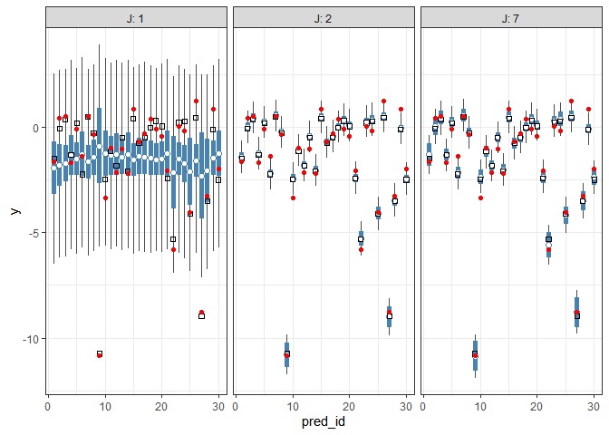
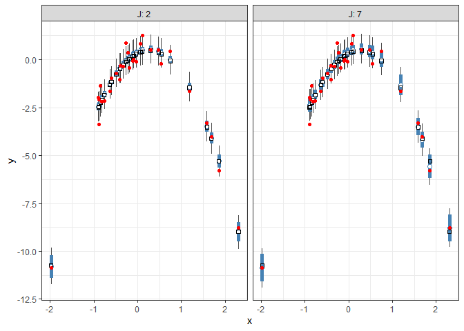
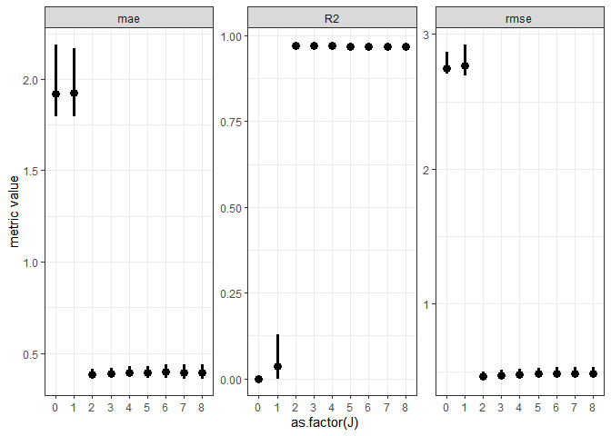
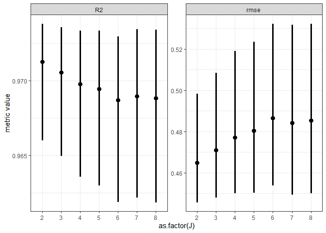
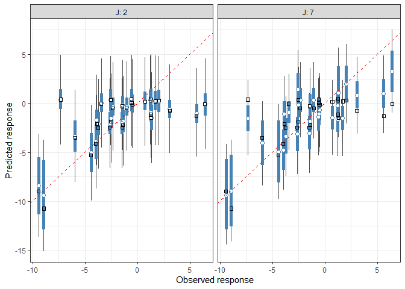

INFSCI 2595: Lecture 08/09
================
Dr. Joseph P. Yurko
September 18/25, 2019

## Load packages

This document uses the following packages:

``` r
library(dplyr)
library(ggplot2)
```

In addition, functions from the following `tidyverse` packages are used:
`tibble`, `tidyr`, and `purrr`. The `MASS` package is also required to
complete all code chunks.

## Linear?

Can you identify which of the following are **linear models**?

  
![ 
\\mu\_n = \\beta\_{0} + \\beta\_{1} x\_n \\\\ \\mu\_n = \\beta\_{0} +
\\beta\_{1} x\_{n,1} + \\beta\_{2} x\_{n,2} \\\\ \\mu\_n = \\beta\_{0} +
\\beta\_{1} x\_{n,1} + \\beta\_{2} x\_{n,2} + \\beta\_{3} x\_{n,1}
x\_{n,2} \\\\ \\mu\_{n} = \\beta\_{0} + \\beta\_{1} x\_{n,1} +
\\beta\_{2} x\_{n,1}^{2} \\\\ \\mu\_{n} = \\beta\_{0} + \\beta\_{1}
x\_{n,1} + \\beta\_{2} x\_{n,1}^{2} + \\beta\_{3} x\_{n,1}^{3} \\\\
\\mu\_{n} = \\beta\_{0} + \\beta\_{1} \\sin\\left( x\_{n} \\right) \\\\
\\mu\_{n} = \\beta\_0 + \\beta\_{1} \\sin\\left(1 + x\_{n}^{2} \\right)
\\\\ \\mu\_{n} = \\beta\_{0} \\exp\\left( \\beta\_{1} x\_{n} \\right)
](https://latex.codecogs.com/png.latex?%20%0A%5Cmu_n%20%3D%20%5Cbeta_%7B0%7D%20%2B%20%5Cbeta_%7B1%7D%20x_n%20%5C%5C%20%5Cmu_n%20%3D%20%5Cbeta_%7B0%7D%20%2B%20%5Cbeta_%7B1%7D%20x_%7Bn%2C1%7D%20%2B%20%5Cbeta_%7B2%7D%20x_%7Bn%2C2%7D%20%5C%5C%20%5Cmu_n%20%3D%20%5Cbeta_%7B0%7D%20%2B%20%5Cbeta_%7B1%7D%20x_%7Bn%2C1%7D%20%2B%20%5Cbeta_%7B2%7D%20x_%7Bn%2C2%7D%20%2B%20%5Cbeta_%7B3%7D%20x_%7Bn%2C1%7D%20x_%7Bn%2C2%7D%20%5C%5C%20%5Cmu_%7Bn%7D%20%3D%20%5Cbeta_%7B0%7D%20%2B%20%5Cbeta_%7B1%7D%20x_%7Bn%2C1%7D%20%2B%20%5Cbeta_%7B2%7D%20x_%7Bn%2C1%7D%5E%7B2%7D%20%5C%5C%20%5Cmu_%7Bn%7D%20%3D%20%5Cbeta_%7B0%7D%20%2B%20%5Cbeta_%7B1%7D%20x_%7Bn%2C1%7D%20%2B%20%5Cbeta_%7B2%7D%20x_%7Bn%2C1%7D%5E%7B2%7D%20%2B%20%5Cbeta_%7B3%7D%20x_%7Bn%2C1%7D%5E%7B3%7D%20%5C%5C%20%5Cmu_%7Bn%7D%20%3D%20%5Cbeta_%7B0%7D%20%2B%20%5Cbeta_%7B1%7D%20%5Csin%5Cleft%28%20x_%7Bn%7D%20%5Cright%29%20%5C%5C%20%5Cmu_%7Bn%7D%20%3D%20%5Cbeta_0%20%2B%20%5Cbeta_%7B1%7D%20%5Csin%5Cleft%281%20%2B%20x_%7Bn%7D%5E%7B2%7D%20%5Cright%29%20%5C%5C%20%5Cmu_%7Bn%7D%20%3D%20%5Cbeta_%7B0%7D%20%5Cexp%5Cleft%28%20%5Cbeta_%7B1%7D%20x_%7Bn%7D%20%5Cright%29%0A
" 
\\mu_n = \\beta_{0} + \\beta_{1} x_n \\\\ \\mu_n = \\beta_{0} + \\beta_{1} x_{n,1} + \\beta_{2} x_{n,2} \\\\ \\mu_n = \\beta_{0} + \\beta_{1} x_{n,1} + \\beta_{2} x_{n,2} + \\beta_{3} x_{n,1} x_{n,2} \\\\ \\mu_{n} = \\beta_{0} + \\beta_{1} x_{n,1} + \\beta_{2} x_{n,1}^{2} \\\\ \\mu_{n} = \\beta_{0} + \\beta_{1} x_{n,1} + \\beta_{2} x_{n,1}^{2} + \\beta_{3} x_{n,1}^{3} \\\\ \\mu_{n} = \\beta_{0} + \\beta_{1} \\sin\\left( x_{n} \\right) \\\\ \\mu_{n} = \\beta_0 + \\beta_{1} \\sin\\left(1 + x_{n}^{2} \\right) \\\\ \\mu_{n} = \\beta_{0} \\exp\\left( \\beta_{1} x_{n} \\right)
")  

Hint: only **one** of the above expressions is not a **linear model**.

The last expression, "), is **not** a linear
model. **Why?** What makes a model a **linear** model?

The answer lies not in the relationship between the response and input
variables, but with the **parameters**. If the relationships between the
response and the **parameters** are linear, then the model is a linear
model. To understand why, consider the ") function. What is
known and what is unknown? When we collect data we observed input-ouput
pairs,
. Thus, the
") function is **known**. We do not need to
learn the value of "), we can simply calculate.

However, we do not know the values of the
 and
 parameters. Those parameters must be *learned* from the
data. As long as the parameters are linearly related to the responses,
we can use the same mathematical formulation we saw previously to
estimate them. We will see why later in this report.

The last expression breaks that setup because the
 parameter is non-linearly related to the mean function.
Although it might seem like we will need a non-linear fitting technique,
look what happens if we take the natural-log of the expression:

  
![ 
\\log\\left\[\\mu\_n\\right\] = \\log\\left\[\\beta\_0\\right\] +
\\beta\_{1} x\_{n}
](https://latex.codecogs.com/png.latex?%20%0A%5Clog%5Cleft%5B%5Cmu_n%5Cright%5D%20%3D%20%5Clog%5Cleft%5B%5Cbeta_0%5Cright%5D%20%2B%20%5Cbeta_%7B1%7D%20x_%7Bn%7D%0A
" 
\\log\\left[\\mu_n\\right] = \\log\\left[\\beta_0\\right] + \\beta_{1} x_{n}
")  

Using this transformation, we need to learn the parameters
![\\log\[\\beta\_{0}\]](https://latex.codecogs.com/png.latex?%5Clog%5B%5Cbeta_%7B0%7D%5D
"\\log[\\beta_{0}]") and

which are linearly related to the log of the response. Thus, there are
techniques which allow us to *generalize* the linear modeling framework
to handle many different situations.

## Basis functions and predictors

To extend the linear model to handle non-linear input to output
relationships, we need to define a *basis*. We will apply our inputs to
those basis functions in order to define our new **design matrix**. The
simplest set of non-linear basis functions to consider is the polynomial
basis, where the basis functions take the form of increasing powers of
the input. For example, for a single input,
, the
-th basis function is:

  
 = x^{j}
")  

If we used a third order polynomial as our model, we would have a cubic
function:

  
 \\right) = \\beta_0 + \\beta_1 x + \\beta_2 x^2 + \\beta_3 x^3
")  
We can rewrite the above expression completely as a summation if we note
that , and so:

  
 \\right) = \\beta_0 + \\beta_1 x_n + \\beta_2 x_{n}^{2} + \\beta_3 x_{n}^{3}
")  
This raises an interesting nomenclature situation. Our cubic model
above, consists of 1 input, , but there are 3 terms in addition to the intercept. If we assemble
all of those terms into a **design matrix** we would have 4 columns even
though we have a single input. Using the nomenclature from lecture 07,
we would have said with one input,
, the design
matrix should have

columns. Here though, we clearly need 4 columns to our design matrix. We
will therefore describe each column in our design matrix as a
**predictor** or **feature** instead of as corresponding to an *input*.
In this way, the predictor can be a function of an input or of multiple
inputs.

Assembling a design matrix of basis functions is similar to assembling
the design matrix of inputs. The difference being, of course, that each
column is a predictor of the evaluated basis function. To make it clear
this design matrix consists of basis functions and not the
 inputs we will denote
it as
 instead of
. For the polynomial basis, if the basis is order
, the predictor or basis
function design matrix is a ") matrix. In general, the predictor design
matrix takes the form:

  
![ 
\\boldsymbol{\\Phi} = \\left\[\\begin{array}
{rrrr}
\\phi\_{1,0} & \\phi\_{1,1} & \\ldots & \\phi\_{1,J} \\\\
\\vdots & \\vdots & \\ddots & \\vdots\\\\
\\phi\_{N,0} & \\phi\_{N,1} & \\ldots & \\phi\_{N,J} 
\\end{array}\\right\]
](https://latex.codecogs.com/png.latex?%20%0A%5Cboldsymbol%7B%5CPhi%7D%20%3D%20%5Cleft%5B%5Cbegin%7Barray%7D%0A%7Brrrr%7D%0A%5Cphi_%7B1%2C0%7D%20%26%20%5Cphi_%7B1%2C1%7D%20%26%20%5Cldots%20%26%20%5Cphi_%7B1%2CJ%7D%20%5C%5C%0A%5Cvdots%20%26%20%5Cvdots%20%26%20%5Cddots%20%26%20%5Cvdots%5C%5C%0A%5Cphi_%7BN%2C0%7D%20%26%20%5Cphi_%7BN%2C1%7D%20%26%20%5Cldots%20%26%20%5Cphi_%7BN%2CJ%7D%20%0A%5Cend%7Barray%7D%5Cright%5D%0A
" 
\\boldsymbol{\\Phi} = \\left[\\begin{array}
{rrrr}
\\phi_{1,0} & \\phi_{1,1} & \\ldots & \\phi_{1,J} \\\\
\\vdots & \\vdots & \\ddots & \\vdots\\\\
\\phi_{N,0} & \\phi_{N,1} & \\ldots & \\phi_{N,J} 
\\end{array}\\right]
")  
For our cubic model example, the predictor design matrix is:

  
![ 
\\boldsymbol{\\Phi} = \\left\[\\begin{array}
{rrrr}
1 & x\_1 & x\_1^2 & x\_1^3 \\\\
\\vdots & \\vdots & \\vdots & \\vdots\\\\
1 & x\_N & x\_N^2 & x\_N^3 
\\end{array}\\right\]
](https://latex.codecogs.com/png.latex?%20%0A%5Cboldsymbol%7B%5CPhi%7D%20%3D%20%5Cleft%5B%5Cbegin%7Barray%7D%0A%7Brrrr%7D%0A1%20%26%20x_1%20%26%20x_1%5E2%20%26%20x_1%5E3%20%5C%5C%0A%5Cvdots%20%26%20%5Cvdots%20%26%20%5Cvdots%20%26%20%5Cvdots%5C%5C%0A1%20%26%20x_N%20%26%20x_N%5E2%20%26%20x_N%5E3%20%0A%5Cend%7Barray%7D%5Cright%5D%0A
" 
\\boldsymbol{\\Phi} = \\left[\\begin{array}
{rrrr}
1 & x_1 & x_1^2 & x_1^3 \\\\
\\vdots & \\vdots & \\vdots & \\vdots\\\\
1 & x_N & x_N^2 & x_N^3 
\\end{array}\\right]
")  
The unknown parameters are assembled into a
,1") column vector,
. Which for our cubic model looks like:

  
![ 
\\boldsymbol{\\beta} = \\left\[\\begin{array}
{r}
\\beta\_0 \\\\
\\beta\_1 \\\\
\\beta\_2 \\\\
\\beta\_3
\\end{array}\\right\]
](https://latex.codecogs.com/png.latex?%20%0A%5Cboldsymbol%7B%5Cbeta%7D%20%3D%20%5Cleft%5B%5Cbegin%7Barray%7D%0A%7Br%7D%0A%5Cbeta_0%20%5C%5C%0A%5Cbeta_1%20%5C%5C%0A%5Cbeta_2%20%5C%5C%0A%5Cbeta_3%0A%5Cend%7Barray%7D%5Cright%5D%0A
" 
\\boldsymbol{\\beta} = \\left[\\begin{array}
{r}
\\beta_0 \\\\
\\beta_1 \\\\
\\beta_2 \\\\
\\beta_3
\\end{array}\\right]
")  

The vector linear predictor values,
, can be written as the matrix-vector product of
the predictor design matrix and the unknown parameter column vector:

  
  

### Model fitting

The above relationship is identical to what we discussed in lecture 07\!
Because of that, all of the previous discussion of fitting or learning
of a linear model is still valid\! We merely have to replace the
 with
. To make that point clear, quadratic portion of
the log-likelihood written in terms of the predictor design matrix is:

  
^2 \\right) = -\\frac{1}{2\\sigma^2}\\left( \\mathbf{y} - \\boldsymbol{\\Phi}\\boldsymbol{\\beta} \\right)^{T} \\left( \\mathbf{y} - \\boldsymbol{\\Phi}\\boldsymbol{\\beta} \\right) 
")  

The Maximum Likelihood Estimate (MLE) on the unknown paramter vector,
, is therefore:

  
^{-1} \\boldsymbol{\\Phi}^{T} \\mathbf{y}
")  

Likewise, the poseterior covariance matrix under the assumption of an
infinitely diffuse prior and known likelihood standard deviation,
, is:

  
 = \\sigma^2 \\left( \\boldsymbol{\\Phi}^{T} \\boldsymbol{\\Phi} \\right)^{-1}
")  

Essentially, from the point of view of fitting the model, the only thing
that has changed is the nomenclature. (This is not entirely true…we have
to be careful about certain issues which we will discuss later on in the
course).

## Synthetic data

As we did in lecture 07, let’s create an example to practice working
with *linear basis function models*. We will generate synthetic data
from an assumed *true* model formulation. We will then see if we are
able to accurately and precisely learn the parameters of that model
given random observations. Our example problem will use a single input,
, which comes from a
standard normal distribution. We will assume
 is related to a
response, , through a
quadratic function with the following *true* parameters:

  
  
We will assume a relatively low noise level for our example problem with
. Thus, our *true* model formulation
is:

  
 \\\\ \\mu_{n,\\mathrm{true}} = \\beta_{0,\\mathrm{true}} + \\beta_{1, \\mathrm{true}} x_{n} + \\beta_{2,\\mathrm{true}} x_{n}^{2}
")  
Let’s code up the quadratic relationship into a function which accepts
two arguments, `x` and `beta_vec`. `x` is the input vector and
`beta_vec` is the
 vector.

``` r
my_quad_func <- function(x, beta_vec)
{
  beta_vec[1] + beta_vec[2] * x + beta_vec[3] * (x^2)
}
```

Next, let’s generate 100 random observations of the input
 from a standard normal:

``` r
set.seed(8001)
x_demo <- rnorm(n = 100, mean = 0, sd = 1)
```

The synthetic data are generated in the code chunk below. First, the
*true* parameter values are specified. Then the *true* linear predictor
is calculated with `my_quad_func()`. Finally, the linear predictor and
the *true* standard deviation are used to generate random observations.

``` r
### set true parameter values
beta_true <- c(0.33, 1.15, -2.25)
sigma_true <- 0.45

### evaluate linear predictor and generate random observations
set.seed(8002)
demo_df <- tibble::tibble(
  x = x_demo
) %>% 
  mutate(mu = my_quad_func(x, beta_true),
         y = rnorm(n = n(),
                   mean = mu,
                   sd = sigma_true))
```

Visualize the *true* quadratic relationship and the random (noisy)
observations.

``` r
demo_df %>% 
  ggplot(mapping = aes(x = x)) +
  geom_line(mapping = aes(y = mu),
            color = "black", size = 1.15) +
  geom_point(mapping = aes(y = y),
             color = "red", size = 2.5) +
  labs(y = "y") +
  theme_bw()
```

<!-- -->

Let’s separate the first 30 points from the remaining 70 points. We will
use these first 30 to build/fit our model. We will call these 30 points,
our training set. Note that, since we generated the points randomly,
selecting the first 30 is equivalent to randomly selected 30 out of 100
points. In general, we cannot make this assumption and we would randomly
subsample.

``` r
train_df <- demo_df %>% 
  tibble::rowid_to_column("obs_id") %>% 
  slice(1:30)
```

Let’s highlight our training set compared with the other **hold-out**
points.

``` r
demo_df %>% 
  tibble::rowid_to_column("obs_id") %>% 
  ggplot(mapping = aes(x = x)) +
  geom_line(mapping = aes(y = mu),
            color = "black", size = 1.15) +
  geom_point(mapping = aes(y = y,
                           color = obs_id < 31,
                           size = obs_id < 31)) +
  scale_color_manual("data split",
                     values = c("TRUE" = "red",
                                "FALSE" = "grey30"),
                     labels = c("TRUE" = "train",
                                "FALSE" = "hold-out")) +
  scale_size_manual("data split",
                    values = c("TRUE" = 3,
                               "FALSE" = 1.15),
                    labels = c("TRUE" = "train",
                               "FALSE" = "hold-out")) +
  labs(y = "y") +
  theme_bw() +
  theme(legend.position = "top")
```

<!-- -->

## Model selection

With our quadratic model, we have 3 linear predictor parameters and one
unknown standard deviation. Thus we have 4 unknown parameters\! However,
since we are dealing with a linear model, the model fitting exercise
will be the same as that used in lecture 07. Even though the functional
relationship is different, all of the “mechanics” of the fitting process
are the same. Thus, we can still use the Laplace approximation to
approximate the posterior with a MVN distribution.

We will therefore move onto a more challenging question. What if we did
not know the *true* input/output relationship? How would we proceed?
Would we start out immediately with a quadratic relationship? Would we
be able to say that such a model is significantly “better” or “more
appropriate” than a linear relationship? Could we say that a cubic model
is not needed?

Ultimately, in order to compare models we need to assess *performance*.
We must consider accuracy, how well does the model “fit” the data?
However, there is more to performance that simply reproducing the exact
response values within the training set. We need to consider if the
model will *generalize*, and understand if a model is too *complex*.

We will introduce these concepts with our simple quadratic example. We
will compare an intercept only model up to and including an eighth order
polynomial. We will therefore build and compare *9* different models\!

### Predictor design matrix

In order to evaluate the different model formulations, we will need to
either write a separate log-posterior function for each one, or write a
more general function. In order to write a general linear model
function, we will need to pass in a design matrix. Thus before writing
that function, let’s see how we can create efficiently create design
matrices.

Let’s first consider the quadratic relationship. The `train_df` object
already has a column for the  variable, named `x`. To complete the design matrix will need to
include a column of just 1s and a column equal to
. We can
manually create those terms with a `mutate()` call:

``` r
train_df %>% 
  mutate(intercept = 1,
         x_squared = x^2) %>% 
  select(intercept, x, x_squared)
```

    ## # A tibble: 30 x 3
    ##    intercept      x x_squared
    ##        <dbl>  <dbl>     <dbl>
    ##  1         1  1.19     1.41  
    ##  2         1  0.749    0.561 
    ##  3         1  0.482    0.232 
    ##  4         1 -0.636    0.404 
    ##  5         1 -0.110    0.0120
    ##  6         1 -0.843    0.711 
    ##  7         1  0.295    0.0871
    ##  8         1 -0.326    0.106 
    ##  9         1 -1.98     3.91  
    ## 10         1 -0.888    0.789 
    ## # ... with 20 more rows

In order to use the result within linear algebra operations we will need
to pipe the resulting `tibble` into the `as.matrix()` function. The code
chunk below saves the result to the variable `ex_design_mat_2` and then
prints the first 6 rows of that matrix to the screen with the `head()`
function.

``` r
ex_design_mat_2 <- train_df %>% 
  mutate(intercept = 1,
         x_squared = x^2) %>% 
  select(intercept, x, x_squared) %>% 
  as.matrix()

head(ex_design_mat_2)
```

    ##      intercept          x  x_squared
    ## [1,]         1  1.1868905 1.40870907
    ## [2,]         1  0.7488747 0.56081331
    ## [3,]         1  0.4815022 0.23184440
    ## [4,]         1 -0.6358824 0.40434647
    ## [5,]         1 -0.1097598 0.01204722
    ## [6,]         1 -0.8432582 0.71108438

Although simple to do, this procedure may not scale well to higher
dimensions. Therefore, we might like to use a more “programmatic”
solution. We will therefore introduce the `model.matrix()` function
which builds a design matrix using `R`’s formula interface. The formula
interface allows us to type a `"formula"` and it produces the necessary
columns of the *predictors*. This might sound confusing, so let’s just
try it out with our example. `model.matrix()` requires two primary
arguments, the `"formula"` and the data object. The names in the data
object are used to construct the columns of the design matrix to match
the specified formula. For our specific example we type:

``` r
design_quad <- model.matrix(y ~ x + I(x^2), train_df)
```

The formula interface reads as `<response> ~ <input expression>`. The
`~` therefore reads as “as a function of”. The specific formula typed
into `model.matrix()` reads as
“ is a function of
 and
”.
`model.matrix()` automatically creates a column for the intercept, thus
we do not need to specify it in the formula. The squared term looks a
little odd in the formula, but the `I()` function is the “As-is”
function. It enforces that we are using the
 variable squared.

Let’s now go ahead and print the first 6 rows of the design matrix to
the screen. As shown below the matrix has 3 columns and the first column
is named `"(Intercept)"` and consists of 1s.

``` r
head(design_quad)
```

    ##   (Intercept)          x     I(x^2)
    ## 1           1  1.1868905 1.40870907
    ## 2           1  0.7488747 0.56081331
    ## 3           1  0.4815022 0.23184440
    ## 4           1 -0.6358824 0.40434647
    ## 5           1 -0.1097598 0.01204722
    ## 6           1 -0.8432582 0.71108438

At first, the formula interface may not sound “programmatic”, but a
character string can be used to define the formula as shown below:

``` r
model.matrix(as.formula("y ~ x + I(x^2)"), train_df) %>% head()
```

    ##   (Intercept)          x     I(x^2)
    ## 1           1  1.1868905 1.40870907
    ## 2           1  0.7488747 0.56081331
    ## 3           1  0.4815022 0.23184440
    ## 4           1 -0.6358824 0.40434647
    ## 5           1 -0.1097598 0.01204722
    ## 6           1 -0.8432582 0.71108438

Alternatively, rather than typing out the formula, we can use the
`poly()` function. By default, `poly()` returns orthogonal polynomials.
To create the polynomials with the variables as is, and thus not return
orthogonal polynomials, we need to set the `raw` argument equal to
`TRUE`.

``` r
head(model.matrix(y ~ poly(x,2, raw = TRUE), train_df))
```

    ##   (Intercept) poly(x, 2, raw = TRUE)1 poly(x, 2, raw = TRUE)2
    ## 1           1               1.1868905              1.40870907
    ## 2           1               0.7488747              0.56081331
    ## 3           1               0.4815022              0.23184440
    ## 4           1              -0.6358824              0.40434647
    ## 5           1              -0.1097598              0.01204722
    ## 6           1              -0.8432582              0.71108438

Let’s now create the design matrices for the other 8 model forms we will
use.

``` r
design_int <- model.matrix(y ~ 1, train_df)

design_lin <- model.matrix(y ~ x, train_df)

design_cube <- model.matrix(y ~ x + I(x^2) + I(x^3), train_df)

design_4 <- model.matrix(y ~ x + I(x^2) + I(x^3) + I(x^4), train_df)

design_5 <- model.matrix(y ~ x + I(x^2) + I(x^3) + I(x^4) + I(x^5), train_df)

design_6 <- model.matrix(y ~ x + I(x^2) + I(x^3) + I(x^4) + I(x^5) + I(x^6), train_df)

design_7 <- model.matrix(y ~ x + I(x^2) + I(x^3) + I(x^4) + I(x^5) + I(x^6) + I(x^7), train_df)

design_8 <- model.matrix(y ~ x + I(x^2) + I(x^3) + I(x^4) + I(x^5) + I(x^6) + I(x^7) + I(x^8), train_df)
```

As a check, the first 6 rows of the intercept only and the 4th order
design matrices are printed below.

``` r
### intercept only
design_int %>% head()
```

    ##   (Intercept)
    ## 1           1
    ## 2           1
    ## 3           1
    ## 4           1
    ## 5           1
    ## 6           1

``` r
### 4th order design
design_4 %>% head()
```

    ##   (Intercept)          x     I(x^2)       I(x^3)       I(x^4)
    ## 1           1  1.1868905 1.40870907  1.671983427 1.9844612560
    ## 2           1  0.7488747 0.56081331  0.419978894 0.3145115660
    ## 3           1  0.4815022 0.23184440  0.111633598 0.0537518272
    ## 4           1 -0.6358824 0.40434647 -0.257116818 0.1634960678
    ## 5           1 -0.1097598 0.01204722 -0.001322301 0.0001451355
    ## 6           1 -0.8432582 0.71108438 -0.599627726 0.5056409921

### Probability model

Let’s write out a generic probability model that we will work with. We
will use independent zero mean gaussian priors on all linear predictor
parameters,
, with prior standard deviations equal to
. An exponential
prior is applied to
 with
a “rate” parameter equal to 1. Since all of the linear predictor
coefficients use the same standard deviation, we can write out our
generic probability model as:

  
 \\\\ \\mu_{n} = \\mathbf{x}_{n,:} \\boldsymbol{\\beta} \\\\ \\boldsymbol{\\beta} \\sim \\mathcal{N}\\left(\\boldsymbol{\\beta} \\mid \\mathbf{0}, \\left(2.5\\right)^2 \\cdot \\mathbf{I}_{J+1} \\right) \\\\ \\sigma \\sim \\mathrm{Exp} \\left(\\sigma \\mid 1 \\right)
")  

The prior on the linear predictor coefficients is written as a MVN
distribution. The term
 denotes the identity matrix with
 rows and
columns. Since the identity matrix consists of 1’s along the main
diagonal and zeros everywhere else, the MVN distribution defined above
states all parameters are independent with prior standard deviation
equal to .

Altneratively, we could have written the prior on the linear predictor
parameters as the product of
 normal
distributions. **Do you know why?**

  
 \\right)
")  

The exponential prior distribution is written as "). It has support only over positive
values and so it respects the lower bound of 0 on
. The
exponential distribution does not have an upper bound. The mean of an
exponential is equal to the inverse of the “rate” parameter, and so our
prior mean on the standard deviation is 1. Even though the exponential
distribution respects the natural constraints on
 we
still need to apply a transformation, such as the log-transformation, in
order to use the Laplace approximation. **Do you know why?**. To avoid
confusion with the basis function notation from earlier in this report,
the unbounded parameter will be denoted as
,
which is called “varphi” in LaTeX. The log-transformed unbounded
parameter is therefore defined as:

  
![ 
\\varphi = \\log\\left\[\\sigma\\right\]
](https://latex.codecogs.com/png.latex?%20%0A%5Cvarphi%20%3D%20%5Clog%5Cleft%5B%5Csigma%5Cright%5D%0A
" 
\\varphi = \\log\\left[\\sigma\\right]
")  

### Log-posterior function

Let’s now create our general log-posterior function. There are two input
arguments, `theta` and `my_info`. All unknown parameters are stored in
the `theta` vector. Even though we are working with the unbounded
transformed  variable, I am using denoting the argument to the
log-posterior function as `theta` to avoid confusion with the

variable itself. The first
 elements of
`theta` correspond to the linear predictor parameters
. The last element corresponds to the unbounded
standard deviation
.
The `my_info` list stores all other information necessary to evaluate
the log-posterior, just as we used previously. In addition to storing
the observations and hyperparameter information, `my_info` also stores
the number of linear predictor parameters with the variable
`length_beta`.

The log-posterior function is coded below. Note that the `sum()`
function is now wrapped around the log-prior density evaluation of the
 parameters. Also note that the `dexp()` function
is used for the log-prior density of
 with
hyperparameter defined as `sigma_rate`. **Do you understand each line of
code below?**

``` r
lm_logpost <- function(theta, my_info)
{
  # unpack the parameter vector
  beta_v <- theta[1:my_info$length_beta]
  
  # back-transform from phi to sigma
  lik_phi <- theta[my_info$length_beta + 1]
  lik_sigma <- exp(lik_phi)
  
  # extract design matrix
  X <- my_info$design_matrix
  
  # calculate the linear predictor
  mu <- as.vector(X %*% as.matrix(beta_v))
  
  # evaluate the log-likelihood
  log_lik <- sum(dnorm(x = my_info$yobs,
                       mean = mu,
                       sd = lik_sigma,
                       log = TRUE))
  
  # evaluate the log-prior
  log_prior_beta <- sum(dnorm(x = beta_v,
                              mean = my_info$mu_beta,
                              sd = my_info$tau_beta,
                              log = TRUE)) 
  
  log_prior_sigma <- dexp(x = lik_sigma,
                          rate = my_info$sigma_rate,
                          log = TRUE)
  
  log_prior <- log_prior_beta + log_prior_sigma
  
  # account for the transformation
  log_derive_adjust <- lik_phi
  
  # sum together
  log_lik + log_prior + log_derive_adjust
}
```

We will continue to use the same wrapper function to perform the Laplace
approximation.

``` r
my_laplace <- function(start_guess, logpost_func, ...)
{
  # code adapted from the `LearnBayes`` function `laplace()`
  fit <- optim(start_guess,
               logpost_func,
               gr = NULL,
               ...,
               method = "BFGS",
               hessian = TRUE,
               control = list(fnscale = -1, maxit = 1001))
  
  mode <- fit$par
  h <- -solve(fit$hessian)
  p <- length(mode)
  int <- p/2 * log(2 * pi) + 0.5 * log(det(h)) + logpost_func(mode, ...)
  list(mode = mode,
       var_matrix = h,
       log_evidence = int,
       converge = ifelse(fit$convergence == 0,
                         "YES", 
                         "NO"),
       iter_counts = fit$counts[1])
}
```

Let’s create a second wrapper function to allow us to loop over the
polynomial order. This wrapper function will manage assembling the
design matrix with the rest of the required information. Because we have
already created the design matrices, the first argument to
`manage_poly_order()` is a design matrix. The function randomly selects
an initial guess based on the number of columns in the design matrix.
**Given what you know about the posterior for a linear model, should we
be concerned about a random guess preventing the optimizer from finding
the posterior mode?**

``` r
manage_poly_order <- function(design_use, logpost_func, my_settings)
{
  # include the design matrix with the settings
  my_settings$design_matrix <- design_use
  
  # specify the number of linear predictor parameters
  my_settings$length_beta <- ncol(design_use)
  
  # generate random initial guess
  init_beta <- rnorm(my_settings$length_beta, 0, 1)
  
  init_phi <- log(rexp(n = 1, rate = my_settings$sigma_rate))
  
  # execute laplace approximation
  my_laplace(c(init_beta, init_phi), logpost_func, my_settings)
}
```

### Laplace approximation

The code chunk below creates our list of required information. The
syntax is consistent with the previous lectures, except now the
hyperparameter for the

prior distribution is set as the “rate” parameter of the exponential
distribution.

``` r
info_use <- list(
  yobs = train_df$y,
  mu_beta = 0,
  tau_beta = 2.5,
  sigma_rate = 1
)
```

We can now loop over all of the candidate models. The `purrr::map()`
function is used to execute the looping operation. Each Laplace
approximation result is stored as an element in a list. Notice that the
variable to iterate over is defined in-line as a list. Each element of
that list corresponds to one of the 9 design matrices we created
previously.

``` r
set.seed(8003)
laplace_results <- purrr::map(list(design_int, design_lin, design_quad,
                                   design_cube, design_4, design_5,
                                   design_6, design_7, design_8),
                              manage_poly_order,
                              logpost_func = lm_logpost,
                              my_settings = info_use)
```

The `laplace_results` object is a list of 9 elements. Each element is
itself a list containing the fields associated with the `my_laplace()`
results. For example, the intercept-only model as the result:

``` r
laplace_results[[1]]
```

    ## $mode
    ## [1] -1.5636212  0.9693285
    ## 
    ## $var_matrix
    ##             [,1]        [,2]
    ## [1,] 0.223557928 0.001697229
    ## [2,] 0.001697229 0.015185396
    ## 
    ## $log_evidence
    ## [1] -77.16908
    ## 
    ## $converge
    ## [1] "YES"
    ## 
    ## $iter_counts
    ## function 
    ##       26

The linear relationship model has the following result:

``` r
laplace_results[[2]]
```

    ## $mode
    ## [1] -1.5637871 -0.3261722  0.9625979
    ## 
    ## $var_matrix
    ##               [,1]          [,2]         [,3]
    ## [1,]  0.2206725786 -0.0004049856 0.0016759693
    ## [2,] -0.0004049856  0.2477777262 0.0003898351
    ## [3,]  0.0016759693  0.0003898351 0.0151981262
    ## 
    ## $log_evidence
    ## [1] -78.57587
    ## 
    ## $converge
    ## [1] "YES"
    ## 
    ## $iter_counts
    ## function 
    ##       54

The quadratic relationship model:

``` r
laplace_results[[3]]
```

    ## $mode
    ## [1]  0.3880648  1.1655207 -2.2714790 -0.8051664
    ## 
    ## $var_matrix
    ##               [,1]          [,2]          [,3]          [,4]
    ## [1,]  1.047567e-02  0.0028511073 -0.0043250037 -9.279224e-05
    ## [2,]  2.851107e-03  0.0096577562 -0.0032421865 -1.064626e-04
    ## [3,] -4.325004e-03 -0.0032421865  0.0048941852  8.941620e-05
    ## [4,] -9.279224e-05 -0.0001064626  0.0000894162  1.685341e-02
    ## 
    ## $log_evidence
    ## [1] -31.40609
    ## 
    ## $converge
    ## [1] "YES"
    ## 
    ## $iter_counts
    ## function 
    ##       44

We can extract the `converge` field to quickly see if all model builds
completed successfully. As show below, all laplace approximations did
complete succesfully.

``` r
purrr::map_chr(laplace_results, "converge")
```

    ## [1] "YES" "YES" "YES" "YES" "YES" "YES" "YES" "YES" "YES"

### Posterior predictions

We will start assessing model performance by predicting the training
set. We will first draw random samples from the MVN approximate
posterior, and then back-transform from

to .
Once we have those random samples we will make posterior predictions and
summarize those predictions.

Define a function which generates the random posterior samples.

``` r
draw_post_samples <- function(approx_result, length_beta, num_samples)
{
  MASS::mvrnorm(n = num_samples, 
                mu = approx_result$mode, 
                Sigma = approx_result$var_matrix) %>% 
    as.data.frame() %>% tbl_df() %>% 
    purrr::set_names(c(sprintf("beta_%0d", 1:length_beta), "phi")) %>% 
    mutate(sigma = exp(phi))
}
```

Next, define a function which makes posterior predictions and then
summarizes them. The first argument to `post_pred_summarize()` is a
design matrix. The name `Xnew` is used to represent predictions can be
made on potentially new, or test, predictor values. The second argument,
`Bmat`, is a matrix of the linear predictor parameters. The columns of
`Bmat` correspond to separate posterior samples of the
 column vector. The third argument,
`sigma_vector`, is a vector containing all posterior samples of the
likelihood standard deviation.

``` r
post_pred_summarize <- function(Xnew, Bmat, sigma_vector)
{
  # matrix of linear predictors
  Umat <- Xnew %*% Bmat
  
  # number of new prediction locations
  M <- nrow(Xnew)
  # number of posterior samples
  S <- ncol(Bmat)
  
  # assmeble matrix of sigma samples
  Rmat <- matrix(rep(sigma_vector, M), M, byrow = TRUE)
  
  # generate standard normal and assemble into matrix
  Zmat <- matrix(rnorm(M*S), M, byrow = TRUE)
  
  # calculate the random observation predictions
  Ymat <- Umat + Rmat * Zmat
  
  # summarize the linear predictor predictions
  mu_avg <- rowMeans(Umat)
  mu_q05 <- apply(Umat, 1, stats::quantile, probs = 0.05)
  mu_q95 <- apply(Umat, 1, stats::quantile, probs = 0.95)
  
  # summarize the posterior observation predictions
  y_avg <- rowMeans(Ymat)
  y_q05 <- apply(Ymat, 1, stats::quantile, probs = 0.05)
  y_q95 <- apply(Ymat, 1, stats::quantile, probs = 0.95)
  
  # package together
  cbind(mu_avg = mu_avg, mu_q05 = mu_q05, mu_q95 = mu_q95,
        y_avg = y_avg, y_q05 = y_q05, y_q95 = y_q95)
}
```

Define a function which manages drawing the posterior samples and making
predictions for a given Laplace approximation result.

``` r
predict_from_laplace <- function(mvn_result, newdata, num_post_samples)
{
  # draw posterior samples
  post <- draw_post_samples(mvn_result, ncol(newdata), num_post_samples)
  
  # separate linear predictor and sigma samples
  post_beta <- post %>% select(starts_with("beta_")) %>% as.matrix()
  
  post_sigma <- post %>% pull(sigma)
  
  # summarize posterior predictions
  post_pred_summarize(newdata, t(post_beta), post_sigma) %>% 
    as.data.frame() %>% tbl_df() %>% 
    mutate(J = ncol(newdata) - 1) %>% 
    tibble::rowid_to_column("pred_id")
}
```

Finally, make 10000 posterior predictions from each model.

``` r
set.seed(8005)
post_pred_train_all <- purrr::map2_dfr(laplace_results,
                                       list(design_int, design_lin, design_quad,
                                            design_cube, design_4, design_5,
                                            design_6, design_7, design_8),
                                       predict_from_laplace,
                                       num_post_samples = 1e4)
```

### Model performance

We can now use our summarized posterior predictions to get a sense of
the accuracy of the model, with respect to the training set. We will
explore the performance visually at first.

Because we have a relatively small number of training points, let’s plot
the predictive summaries on the y-axis vs the observation index on the
x-axis. For additional context, the *true* noise-free signal is shown as
a black square while the noisy observation is shown as a red dot. The
posterior linear prediction summaries are shown in blue, while the
posterior prediction summary in shown in grey.

``` r
post_pred_train_all %>% 
  left_join(train_df %>% 
              rename(pred_id = obs_id, 
                     mu_true = mu,
                     y_obs = y),
            by = "pred_id") %>% 
  ggplot(mapping = aes(x = pred_id)) +
  geom_linerange(mapping = aes(ymin = y_q05,
                               ymax = y_q95,
                               group = interaction(pred_id, J)),
                 color = "grey30") +
  geom_linerange(mapping = aes(ymin = mu_q05,
                               ymax = mu_q95,
                               group = interaction(pred_id, J)),
                 color = "steelblue", size = 1.85) +
  geom_point(mapping = aes(y = mu_avg),
             shape = 21, size = 2.25, color = "steelblue",
             fill = "white") +
  geom_point(mapping = aes(y = mu_true),
             shape = 0, color = "black") +
  geom_point(mapping = aes(y = y_obs),
             color = "red") +
  facet_wrap(~J, labeller = "label_both") +
  labs(y = "y") +
  theme_bw()
```

<!-- -->

Focus on the linear, quadratic, and 7th-order relationship models. The
linear relationship model,
, completely
misses a few of the training points. **Can you see which ones? Can you
guess which input values those data points correspond to?**

``` r
post_pred_train_all %>% 
  left_join(train_df %>% 
              rename(pred_id = obs_id, 
                     mu_true = mu,
                     y_obs = y),
            by = "pred_id") %>% 
  filter(J %in% c(1, 2, 7)) %>% 
  ggplot(mapping = aes(x = pred_id)) +
  geom_linerange(mapping = aes(ymin = y_q05,
                               ymax = y_q95,
                               group = interaction(pred_id, J)),
                 color = "grey30") +
  geom_linerange(mapping = aes(ymin = mu_q05,
                               ymax = mu_q95,
                               group = interaction(pred_id, J)),
                 color = "steelblue", size = 1.85) +
  geom_point(mapping = aes(y = mu_avg),
             shape = 21, size = 2.25, color = "steelblue",
             fill = "white") +
  geom_point(mapping = aes(y = mu_true),
             shape = 0, color = "black") +
  geom_point(mapping = aes(y = y_obs),
             color = "red") +
  facet_wrap(~J, labeller = "label_both") +
  labs(y = "y") +
  theme_bw()
```

<!-- -->

Next, visualize the prediction summaries with respect to the input.

``` r
post_pred_train_all %>% 
  left_join(train_df %>% 
              rename(pred_id = obs_id, 
                     mu_true = mu,
                     y_obs = y),
            by = "pred_id") %>% 
  ggplot(mapping = aes(x = x)) +
  geom_linerange(mapping = aes(ymin = y_q05,
                               ymax = y_q95,
                               group = interaction(pred_id, J)),
                 color = "grey30") +
  geom_linerange(mapping = aes(ymin = mu_q05,
                               ymax = mu_q95,
                               group = interaction(pred_id, J)),
                 color = "steelblue", size = 1.85) +
  geom_point(mapping = aes(y = mu_avg),
             shape = 21, size = 2.25, color = "steelblue",
             fill = "white") +
  geom_point(mapping = aes(y = mu_true),
             shape = 0, color = "black") +
  geom_point(mapping = aes(y = y_obs),
             color = "red") +
  facet_wrap(~J, labeller = "label_both") +
  labs(y = "y") +
  theme_bw()
```

<!-- -->

Focus on two specific models, the linear relationship and the quadratic
relationship. The posterior prediction portion which accounts for the
noise term, , and thus the alleatory source of uncertainty is
substantially higher in the linear relationship than the quadratic
relationship. **Why do you think that is?**

``` r
post_pred_train_all %>% 
  left_join(train_df %>% 
              rename(pred_id = obs_id, 
                     mu_true = mu,
                     y_obs = y),
            by = "pred_id") %>% 
  filter(J %in% c(1, 2)) %>% 
  ggplot(mapping = aes(x = x)) +
  geom_linerange(mapping = aes(ymin = y_q05,
                               ymax = y_q95,
                               group = interaction(pred_id, J)),
                 color = "grey30") +
  geom_linerange(mapping = aes(ymin = mu_q05,
                               ymax = mu_q95,
                               group = interaction(pred_id, J)),
                 color = "steelblue", size = 1.85) +
  geom_point(mapping = aes(y = mu_avg),
             shape = 21, size = 2.25, color = "steelblue",
             fill = "white") +
  geom_point(mapping = aes(y = mu_true),
             shape = 0, color = "black") +
  geom_point(mapping = aes(y = y_obs),
             color = "red") +
  facet_wrap(~J, labeller = "label_both") +
  labs(y = "y") +
  theme_bw()
```

<!-- -->

Next, compare the quadratic relationship with the 7-th order
relationship. **Can you spot any qualitative differences between the
two?**

``` r
post_pred_train_all %>% 
  left_join(train_df %>% 
              rename(pred_id = obs_id, 
                     mu_true = mu,
                     y_obs = y),
            by = "pred_id") %>% 
  filter(J %in% c(2, 7)) %>% 
  ggplot(mapping = aes(x = x)) +
  geom_linerange(mapping = aes(ymin = y_q05,
                               ymax = y_q95,
                               group = interaction(pred_id, J)),
                 color = "grey30") +
  geom_linerange(mapping = aes(ymin = mu_q05,
                               ymax = mu_q95,
                               group = interaction(pred_id, J)),
                 color = "steelblue", size = 1.85) +
  geom_point(mapping = aes(y = mu_avg),
             shape = 21, size = 2.25, color = "steelblue",
             fill = "white") +
  geom_point(mapping = aes(y = mu_true),
             shape = 0, color = "black") +
  geom_point(mapping = aes(y = y_obs),
             color = "red") +
  facet_wrap(~J, labeller = "label_both") +
  labs(y = "y") +
  theme_bw()
```

<!-- -->

Let’s now focus entirely on the relationship between the predictions and
the observed values. We are therefore assessing the *correlation*
between the predictions to the training responses. This type of figure
is called a **predicted-vs-observated** figure. The figure usually
includes a “45-degree” line along the diagonal. The points on the figure
will fall along this diagonal line only if the predictions perfectly
match the observed values. The predicted-vs-observed plot for all 9
models are shown below. The x-axis corresponds to the *noisy*
observation. Thus, to get a sense of the impact of the noise, the *true*
noise-free signal is also shown as a black square. Notice how the black
squares tightly follow the 45-degree line. The fact that the black
squares do not line up directly on the diagonal line is due to the
noise. It is important to note that in a non-synthetic data problem, we
will not know the *true* noise-free signal.

``` r
post_pred_train_all %>% 
  left_join(train_df %>% 
              rename(pred_id = obs_id, 
                     mu_true = mu,
                     y_obs = y),
            by = "pred_id") %>% 
  ggplot(mapping = aes(x = y_obs)) +
  geom_linerange(mapping = aes(ymin = y_q05,
                               ymax = y_q95,
                               group = interaction(pred_id, J)),
                 color = "grey30") +
  geom_linerange(mapping = aes(ymin = mu_q05,
                               ymax = mu_q95,
                               group = interaction(pred_id, J)),
                 color = "steelblue", size = 1.85) +
  geom_point(mapping = aes(y = mu_avg),
             shape = 21, size = 2.25, color = "steelblue",
             fill = "white") +
  geom_point(mapping = aes(y = mu_true),
             shape = 0, color = "black") +
  geom_abline(slope = 1, intercept = 0, color = "red", linetype = "dashed") +
  facet_wrap(~J, labeller = "label_both") +
  labs(y = "Predicted response",
       x = "Observed response") +
  theme_bw()
```

<!-- -->

As with the previous set of figures, let’s focus on the linear,
quadratic, and 7th order relationships.

``` r
post_pred_train_all %>% 
  left_join(train_df %>% 
              rename(pred_id = obs_id, 
                     mu_true = mu,
                     y_obs = y),
            by = "pred_id") %>% 
  filter(J %in% c(1, 2, 7)) %>% 
  ggplot(mapping = aes(x = y_obs)) +
  geom_linerange(mapping = aes(ymin = y_q05,
                               ymax = y_q95,
                               group = interaction(pred_id, J)),
                 color = "grey30") +
  geom_linerange(mapping = aes(ymin = mu_q05,
                               ymax = mu_q95,
                               group = interaction(pred_id, J)),
                 color = "steelblue", size = 1.85) +
  geom_point(mapping = aes(y = mu_avg),
             shape = 21, size = 2.25, color = "steelblue",
             fill = "white") +
  geom_point(mapping = aes(y = mu_true),
             shape = 0, color = "black") +
  geom_abline(slope = 1, intercept = 0, color = "red", linetype = "dashed") +
  facet_wrap(~J, labeller = "label_both") +
  labs(y = "Predicted response",
       x = "Observed response") +
  theme_bw()
```

<!-- -->

#### Performance metrics

In our visual comparisons, we were assessing model accuracy by how
“close” the predictions were to the observations. We were trying to
see if the predictions were *correlated* with the observations. Accuracy
and correlation can be quantified, and we actually already know how to
do so. Accuracy is easily represented by the errors or residuals. As
discussed in lecutre 07, minimizing the mean squared error is equivalent
to maximizing the the log-likelihood of the linear model. Thus, a useful
summary metric for comparing models is the root mean squared error
(RMSE). In addition to the RMSE, the mean absolute error (MAE) is
another common summary metric for the residuals. The MAE is less
sensitive to outliers because the error term is not squared.

In non-Bayesian models, the RMSE and MAE are estimated using the MLEs on
the linear predictor parameters. The model fitting exercise therefore
produces a single estimate for each performance metric. A Bayesian
framework on the other hand, is capable of estimating the posterior
*distribution* on the RMSE and MAE. Essentially, the RMSE and MAE
associated with each posterior sample on
 is calculated. The distribution can be
summarized to represent the most likely value and uncertainty around the
most likely value. If there are
 posterior samples, the
-th posterior sample on
the MSE is calculated as:

  
^2 \\right) = \\frac{1}{N} \\sum_{n=1}^{N} \\left( \\left(y_n - \\mathbf{x}_{n,:} \\boldsymbol{\\beta}_s \\right)^2 \\right)
")  

The -th posterior sample
on the RMSE is then:

  
  

Likewise, the -th
posterior sample on the MAE is calculated as:

  
 = \\frac{1}{N} \\sum_{n=1}^{N} \\left( \\left| y_n - \\mathbf{x}_{n,:} \\boldsymbol{\\beta}_s \\right| \\right)
")  

RMSE and MAE are accuracy measures, but when we were visualized the
predicted vs observed figure we discussed the *correlation* between the
predictions and the observations. The correlation is usually discussed
in terms of the coefficient of determination or
 (R-squared)
metric. R-squared is the proportion of variance explained by the model
and is usually defined as in non-Bayesian model as:

  
}}{\\mathrm{Var}\\left( y \\right)}
")  

The numerator is written to represent that the mean squared error is
evaluated at the MLEs on the linear predictor parameters. The
denominator is the variance of the response
 over the
 observations.

In a Bayesian framework, as with RMSE and MAE, we do not have a single
value for .
Instead, we have a posterior distribution on
. However, the
expression for 
that is used in Bayesian approaches is slightly different from that
given above. The -th
posterior sample’s  value is calculated as:

  
_s = \\frac{\\mathrm{Var}\\left(\\mu_s\\right)}{\\mathrm{Var}\\left( \\mu_s \\right) + \\mathrm{Var}\\left(y - \\mu_s \\right)}
")  

In the above formula, the variances are calculated across the
 observations. The
numerator is therefore the variance of the linear predictor across the
 observations for the
-th posterior sample.
The denomiator includes the variance of the error/residual between the
linear predictor and the observed responses across the
 observations.

The code chunk below defines a function which calculates and summarizes
the RMSE, MAE, and the Bayesian
 performance
metrics. The `post_pred_error_summarize()` function is setup similar to
`post_pred_summarize()`. The difference however is that the additional
argument `y_ref` is the vector of (noisy) responses we are comparing to.
The RMSE and MAE are calculated two different ways in
`post_pred_error_summarize()`. The first is as described above, in
relation to the linear predictor. The errors are also calculated in
relation to the random (alleatory) prediction to provide further
practice summarizing the predictions. The Bayesian
 is calculated
just as described above.

``` r
post_pred_error_summarize <- function(Xnew, Bmat, sigma_vector, y_ref)
{
  # matrix of linear predictors
  Umat <- Xnew %*% Bmat
  
  # number of new prediction locations
  M <- nrow(Xnew)
  # number of posterior samples
  S <- ncol(Bmat)
  
  # assmeble matrix of sigma samples
  Rmat <- matrix(rep(sigma_vector, M), M, byrow = TRUE)
  
  # generate standard normal and assemble into matrix
  Zmat <- matrix(rnorm(M*S), M, byrow = TRUE)
  
  # calculate the random observation predictions
  Ymat <- Umat + Rmat * Zmat
  
  # create the matrix of observed target values to compare to
  RefMat <- t(matrix(rep(y_ref, S), S, byrow = TRUE))
  
  # calculate the errors
  mu_errors_mat <- RefMat - Umat
  y_errors_mat <- RefMat - Ymat
  
  # summarize the linear predictor errors - calculate RMSE and MAE
  # each column is a separate posterior sample, so first need to 
  # summarize across the rows (the observations)
  mu_rmse_vec <- sqrt(colMeans(mu_errors_mat^2))
  mu_mae_vec <- colMeans(abs(mu_errors_mat))
  
  mu_rmse_avg <- mean(mu_rmse_vec)
  mu_rmse_q05 <- quantile(mu_rmse_vec, 0.05)
  mu_rmse_q95 <- quantile(mu_rmse_vec, 0.95)
  mu_mae_avg <- mean(mu_mae_vec)
  mu_mae_q05 <- quantile(mu_mae_vec, 0.05)
  mu_mae_q95 <- quantile(mu_mae_vec, 0.95)
  
  # summarize the posterior prediction errors - calculate RMSE and MAE
  y_rmse_vec <- sqrt(colMeans(y_errors_mat^2))
  y_mae_vec <- colMeans(abs(y_errors_mat))
  
  y_rmse_avg <- mean(y_rmse_vec)
  y_rmse_q05 <- quantile(y_rmse_vec, 0.05)
  y_rmse_q95 <- quantile(y_rmse_vec, 0.95)
  y_mae_avg <- mean(y_mae_vec)
  y_mae_q05 <- quantile(y_mae_vec, 0.05)
  y_mae_q95 <- quantile(y_mae_vec, 0.95)
  
  # calculate the Bayes R-squared
  mu_var_vec <- apply(Umat, 2, var)
  error_var_vec <- apply(mu_errors_mat, 2, var)
  bayes_R2_vec <- mu_var_vec / (mu_var_vec + error_var_vec)
  
  mu_R2_avg <- mean(bayes_R2_vec)
  mu_R2_q05 <- quantile(bayes_R2_vec, 0.05)
  mu_R2_q95 <- quantile(bayes_R2_vec, 0.95)
  
  # package together
  tibble::tibble(
    pred_from = c(rep(c("mu", "y"), each = 2), "mu"),
    metric_name = c(rep(c("rmse", "mae"), times = 2), "R2"),
    metric_avg = c(mu_rmse_avg, mu_mae_avg, y_rmse_avg, y_mae_avg, mu_R2_avg),
    metric_q05 = c(mu_rmse_q05, mu_mae_q05, y_rmse_q05, y_mae_q05, mu_R2_q05),
    metric_q95 = c(mu_rmse_q95, mu_mae_q95, y_rmse_q95, y_mae_q95, mu_R2_q95)
  )
}
```

Wrap into a function which manages the execution for a single model
type.

``` r
errors_from_laplace <- function(mvn_result, newdata, num_post_samples, y_target)
{
  # draw posterior samples
  post <- draw_post_samples(mvn_result, ncol(newdata), num_post_samples)
  
  # separate linear predictor and sigma samples
  post_beta <- post %>% select(starts_with("beta_")) %>% as.matrix()
  
  post_sigma <- post %>% pull(sigma)
  
  # summarize posterior prediction errors
  post_pred_error_summarize(newdata, t(post_beta), post_sigma, y_target) %>% 
    mutate(J = ncol(newdata) - 1)
}
```

Now, calculate the posterior error summary statistics for each model
type.

``` r
set.seed(8006)
post_pred_error_train_all <- purrr::map2_dfr(laplace_results,
                                             list(design_int, design_lin, design_quad,
                                                  design_cube, design_4, design_5,
                                                  design_6, design_7, design_8),
                                             errors_from_laplace,
                                             num_post_samples = 1e4,
                                             y_target = train_df$y)
```

The figure below compares the performance metric posterior summaries
across the model types. When the RMSE or MAE descreases sharply from the
linear to quadratic relationship, the
 value spikes up
close to 1.

``` r
post_pred_error_train_all %>% 
  filter(pred_from == "mu") %>% 
  ggplot(mapping = aes(x = as.factor(J))) +
  geom_linerange(mapping = aes(ymin = metric_q05,
                               ymax = metric_q95,
                               group = interaction(pred_from, metric_name, J),
                               color = pred_from),
                 size = 1.25,
                 position = position_dodge(0.25)) +
  geom_point(mapping = aes(y = metric_avg,
                           group = interaction(pred_from, metric_name, J),
                           color = pred_from),
             size = 2.85,
             position = position_dodge(0.25)) +
  facet_wrap(~metric_name, scales = "free_y") +
  ggthemes::scale_color_colorblind(guide = FALSE) +
  labs(y = "metric value") +
  theme_bw() +
  theme(legend.position = "top")
```

<!-- -->

Let’s focus on the  performance metric, just for
.

``` r
post_pred_error_train_all %>% 
  filter(pred_from == "mu") %>% 
  filter(metric_name == "R2") %>% 
  filter(J > 1) %>% 
  ggplot(mapping = aes(x = as.factor(J))) +
  geom_linerange(mapping = aes(ymin = metric_q05,
                               ymax = metric_q95,
                               group = interaction(pred_from, metric_name, J),
                               color = pred_from),
                 size = 1.25,
                 position = position_dodge(0.25)) +
  geom_point(mapping = aes(y = metric_avg,
                           group = interaction(pred_from, metric_name, J),
                           color = pred_from),
             size = 2.85,
             position = position_dodge(0.25)) +
  facet_wrap(~metric_name, scales = "free_y") +
  ggthemes::scale_color_colorblind(guide = FALSE) +
  labs(y = "metric value") +
  theme_bw() +
  theme(legend.position = "top")
```

<!-- -->

Likewise, zoom in on the RMSE metric just for
.

``` r
post_pred_error_train_all %>% 
  filter(pred_from == "mu") %>% 
  filter(metric_name == "rmse") %>% 
  filter(J > 1) %>% 
  ggplot(mapping = aes(x = as.factor(J))) +
  geom_linerange(mapping = aes(ymin = metric_q05,
                               ymax = metric_q95,
                               group = interaction(pred_from, metric_name, J),
                               color = pred_from),
                 size = 1.25,
                 position = position_dodge(0.25)) +
  geom_point(mapping = aes(y = metric_avg,
                           group = interaction(pred_from, metric_name, J),
                           color = pred_from),
             size = 2.85,
             position = position_dodge(0.25)) +
  facet_wrap(~metric_name, scales = "free_y") +
  ggthemes::scale_color_colorblind(guide = FALSE) +
  labs(y = "metric value") +
  theme_bw() +
  theme(legend.position = "top")
```

<!-- -->

### Bayesian model selection

In the first week of the semester, we introduced Bayes’ theorem with the
following terms:

  
  

However, in all lectures since week 1 we have written Bayes’ theorem as
a proportional statement:

  
  

The reason for this is that the denominator, the
, is very difficult to compute. In fact, in most
cases it cannot be computed analytically. The
, or the marginal likelihood, is the average prior
predictive density of the **data**. If all of the unknown parameters are
contained within
, then the marginal likelihood can be written
as:

  
 = \\int{p\\left( \\mathbf{y} \\mid \\mathbf{X},\\boldsymbol{\\theta}\\right) p\\left(\\boldsymbol{\\theta}\\right) d\\boldsymbol{\\theta}}
")  

The first term within the integral is the likelihood, $p(  ,) $. The
second term is the prior distribution on the unknown parameters,
"). We are therefore averaging, or
marginalizing, out the parameters with respect to the prior. The
marginal likelihood is therefore the probability of the observed
responses, accounting for all possible ways the model can fit the data.

It is important to note that the integration of the
 is over multiple dimensions. Integrating over many
dimensions can be challenging even if we estimate the integral
computationally. The simplest model we have considered so far, is the
intercept only model. It contains two unknown parameters,
. The integral is a
two-dimensional integral:

  
 = \\int{ \\int{p\\left( \\mathbf{y} \\mid \\mathbf{X},\\beta_0, \\sigma\\right) p\\left(\\beta_0, \\sigma\\right) d\\beta_0 d\\sigma} }
")  

If we are able to compute the marginal likelihood, we can use it to
compare models. By integrating over the prior, the marginal likelihood
considers all possible values the parameters are “allowed” to take.
Since the marginal likelihood averages the likelihood function, it
accounts for how accurate the linear predictor is relative to the
observed responses. Lastly, because of the integration, it “knows” the
total number of parameters, or degrees of freedom associated with a
model. The marginal likelihood therefore fully accounts for accuracy
while penalizing for complexity. As mentioned previously, the
 is very challenging to compute.

Fortunately, with the Laplace approximation we have a way to estimate
the
 This estimate is not perfect, but we can use it to
compare the models, within our approximate computational strategy. If we
define the posterior mode (the MAP) to be
 and and we have
 total unknown
parameters, the Laplace approximation to the
![\\log\\left\[\\mathrm{Evidence}
\\right\]](https://latex.codecogs.com/png.latex?%5Clog%5Cleft%5B%5Cmathrm%7BEvidence%7D%20%5Cright%5D
"\\log\\left[\\mathrm{Evidence} \\right]") is:

  
![ 
\\frac{P}{2}\\log\\left\[2\\pi\\right\] -\\frac{1}{2} \\log\\left\[
\\lvert \\mathbf{H}\\rvert\_{\\hat{\\boldsymbol{\\theta}}} \\rvert
\\right\] + \\log \\left\[p\\left( \\mathbf{y} \\mid
\\mathbf{X},\\hat{\\boldsymbol{\\theta}} \\right) \\right\] + \\log
\\left\[p\\left(\\hat{\\boldsymbol{\\theta}}\\right) \\right\]
](https://latex.codecogs.com/png.latex?%20%0A%5Cfrac%7BP%7D%7B2%7D%5Clog%5Cleft%5B2%5Cpi%5Cright%5D%20-%5Cfrac%7B1%7D%7B2%7D%20%5Clog%5Cleft%5B%20%5Clvert%20%5Cmathbf%7BH%7D%5Crvert_%7B%5Chat%7B%5Cboldsymbol%7B%5Ctheta%7D%7D%7D%20%5Crvert%20%5Cright%5D%20%2B%20%5Clog%20%5Cleft%5Bp%5Cleft%28%20%5Cmathbf%7By%7D%20%5Cmid%20%5Cmathbf%7BX%7D%2C%5Chat%7B%5Cboldsymbol%7B%5Ctheta%7D%7D%20%5Cright%29%20%5Cright%5D%20%2B%20%5Clog%20%5Cleft%5Bp%5Cleft%28%5Chat%7B%5Cboldsymbol%7B%5Ctheta%7D%7D%5Cright%29%20%5Cright%5D%0A
" 
\\frac{P}{2}\\log\\left[2\\pi\\right] -\\frac{1}{2} \\log\\left[ \\lvert \\mathbf{H}\\rvert_{\\hat{\\boldsymbol{\\theta}}} \\rvert \\right] + \\log \\left[p\\left( \\mathbf{y} \\mid \\mathbf{X},\\hat{\\boldsymbol{\\theta}} \\right) \\right] + \\log \\left[p\\left(\\hat{\\boldsymbol{\\theta}}\\right) \\right]
")  
The term
 denotes that the
Hessian matrix of the log-posterior is evaluated at the posterior mode,
. By examining the formula above, you can
guess that the log-determinant of the Hessian acts as a penalty term. We
will discuss a more intuitive reason why later on.

If we define the evidence for model
 as
"), we can compare
two models by calculating the ratios of their marginal likelihoods. This
ratio is referred to as the **Bayes Factor**. The Bayes Factor of model
0 relative to model 1 is therefore:

  
}{p\\left(\\mathbf{y} \\mid \\mathbf{X}, M_1\\right)}
")  

If the Bayes Factor is much greater than one, then it is expected that
the Model 0 is more plausible than Model 1.

This concept can be extended to comparing multiple models. In fact, we
can use the marginal likelihood to estimate the posterior probability
that the data supports a model. To see how to do that, let’s first
extract the marginal likelihoods associated with all of the models we
tried in this example:

``` r
model_evidence <- purrr::map_dbl(laplace_results, "log_evidence")
```

If we assume all models are equally probable *a priori* then the
posterior model probabilities are just the Evidence for each model
divided by the sum of the Evidences. As shown in the result below, the
posterior probability of the quadratic relationship is almost
    98%\!

``` r
signif(100*exp(model_evidence) / sum(exp(model_evidence)), 3)
```

    ## [1] 1.30e-18 3.19e-19 9.77e+01 2.24e+00 4.59e-02 1.34e-03 4.70e-05 2.10e-06
    ## [9] 9.28e-08

## Diffuse prior

Let’s retry our model fitting and comparison exercise, but this time
using a very diffuse prior on the linear predictor parameters. Instead
of using a prior standard deviation of 2.5, we will now use a prior
standard deviation of 25:

  
 \\right)
")  

The code chunk below defines a new list of required information, which
uses `tau_beta = 25`.

``` r
info_diffuse <- list(
  yobs = train_df$y,
  mu_beta = 0,
  tau_beta = 25,
  sigma_rate = 1
)
```

The code chunk below executes the laplace approximation on all 9 models,
but now with the diffuse prior
.

``` r
set.seed(8051)
laplace_diffuse <- purrr::map(list(design_int, design_lin, design_quad,
                                   design_cube, design_4, design_5,
                                   design_6, design_7, design_8),
                              manage_poly_order,
                              logpost_func = lm_logpost,
                              my_settings = info_diffuse)
```

With the approximate posteriors in place, let’s now make posterior
predictions of the training set.

``` r
set.seed(8052)
post_pred_train_dif <- purrr::map2_dfr(laplace_diffuse,
                                       list(design_int, design_lin, design_quad,
                                            design_cube, design_4, design_5,
                                            design_6, design_7, design_8),
                                       predict_from_laplace,
                                       num_post_samples = 1e4)
```

The predicted vs observed figure for the diffuse prior case:

``` r
post_pred_train_dif %>% 
  left_join(train_df %>% 
              rename(pred_id = obs_id, 
                     mu_true = mu,
                     y_obs = y),
            by = "pred_id") %>% 
  ggplot(mapping = aes(x = y_obs)) +
  geom_linerange(mapping = aes(ymin = y_q05,
                               ymax = y_q95,
                               group = interaction(pred_id, J)),
                 color = "grey30") +
  geom_linerange(mapping = aes(ymin = mu_q05,
                               ymax = mu_q95,
                               group = interaction(pred_id, J)),
                 color = "steelblue", size = 1.85) +
  geom_point(mapping = aes(y = mu_avg),
             shape = 21, size = 2.25, color = "steelblue",
             fill = "white") +
  geom_point(mapping = aes(y = mu_true),
             shape = 0, color = "black") +
  geom_abline(slope = 1, intercept = 0, color = "red", linetype = "dashed") +
  facet_wrap(~J, labeller = "label_both") +
  labs(y = "Predicted response",
       x = "Observed response") +
  theme_bw()
```

<!-- -->

Focus just on the linear, quadratic, and 7th order relationships:

``` r
post_pred_train_dif %>% 
  left_join(train_df %>% 
              rename(pred_id = obs_id, 
                     mu_true = mu,
                     y_obs = y),
            by = "pred_id") %>% 
  filter(J %in% c(1, 2, 7)) %>% 
  ggplot(mapping = aes(x = y_obs)) +
  geom_linerange(mapping = aes(ymin = y_q05,
                               ymax = y_q95,
                               group = interaction(pred_id, J)),
                 color = "grey30") +
  geom_linerange(mapping = aes(ymin = mu_q05,
                               ymax = mu_q95,
                               group = interaction(pred_id, J)),
                 color = "steelblue", size = 1.85) +
  geom_point(mapping = aes(y = mu_avg),
             shape = 21, size = 2.25, color = "steelblue",
             fill = "white") +
  geom_point(mapping = aes(y = mu_true),
             shape = 0, color = "black") +
  geom_abline(slope = 1, intercept = 0, color = "red", linetype = "dashed") +
  facet_wrap(~J, labeller = "label_both") +
  labs(y = "Predicted response",
       x = "Observed response") +
  theme_bw()
```

<!-- -->

The code chunk below estimates the performance metrics for the case with
the diffuse prior.

``` r
set.seed(8053)
post_pred_error_train_dif <- purrr::map2_dfr(laplace_diffuse,
                                             list(design_int, design_lin, design_quad,
                                                  design_cube, design_4, design_5,
                                                  design_6, design_7, design_8),
                                             errors_from_laplace,
                                             num_post_samples = 1e4,
                                             y_target = train_df$y)
```

The figure below gives the Bayesian
 and RMSE metric
posterior summaries for the
 models. The
results are consistent with those from the more informative prior.

``` r
post_pred_error_train_all %>% 
  filter(pred_from == "mu") %>% 
  filter(metric_name %in% c("rmse", "R2")) %>% 
  filter(J > 1) %>% 
  ggplot(mapping = aes(x = as.factor(J))) +
  geom_linerange(mapping = aes(ymin = metric_q05,
                               ymax = metric_q95,
                               group = interaction(pred_from, metric_name, J),
                               color = pred_from),
                 size = 1.25,
                 position = position_dodge(0.25)) +
  geom_point(mapping = aes(y = metric_avg,
                           group = interaction(pred_from, metric_name, J),
                           color = pred_from),
             size = 2.85,
             position = position_dodge(0.25)) +
  facet_wrap(~metric_name, scales = "free_y") +
  ggthemes::scale_color_colorblind(guide = FALSE) +
  labs(y = "metric value") +
  theme_bw() +
  theme(legend.position = "top")
```

<!-- -->

Let’s now extract approximate the marginal likelihood values associated
with each model starting from the diffuse prior.

``` r
diffuse_evidence <- purrr::map_dbl(laplace_diffuse, "log_evidence")
```

Comparing all of the models based on their
 values reveals that the quadratic relationship is
even more likely to be the right model\! **Why do you think this is the
result?**

``` r
signif(100*exp(diffuse_evidence) / sum(exp(diffuse_evidence)), 3)
```

    ## [1] 9.74e-17 2.45e-18 9.98e+01 2.28e-01 4.83e-04 1.39e-06 5.15e-09 3.78e-11
    ## [9] 2.87e-13

## Noisy data

Our synthetic data example used a relatively low

value to generate the random observations. Let’s retry everything, but
this time with higher noise level of . Split the noisy dataset into the same 30
training points with respect to the
 values.

``` r
sigma_noisy <- 2.75

### evaluate linear predictor and generate random observations
set.seed(8100)
noisy_df <- tibble::tibble(
  x = x_demo
) %>% 
  mutate(mu = my_quad_func(x, beta_true),
         y = rnorm(n = n(),
                   mean = mu,
                   sd = sigma_noisy))

### create noisy training set
train_noisy <- noisy_df %>% 
  tibble::rowid_to_column("obs_id") %>% 
  slice(1:30)
```

Visualize the noisy dataset relative to the true noise-free quadratic
relationship:

``` r
noisy_df %>% 
  tibble::rowid_to_column("obs_id") %>% 
  ggplot(mapping = aes(x = x)) +
  geom_line(mapping = aes(y = mu),
            color = "black", size = 1.15) +
  geom_point(mapping = aes(y = y,
                           color = obs_id < 31,
                           size = obs_id < 31)) +
  scale_color_manual("data split",
                     values = c("TRUE" = "red",
                                "FALSE" = "grey30"),
                     labels = c("TRUE" = "train",
                                "FALSE" = "hold-out")) +
  scale_size_manual("data split",
                    values = c("TRUE" = 3,
                               "FALSE" = 1.15),
                    labels = c("TRUE" = "train",
                               "FALSE" = "hold-out")) +
  labs(y = "y") +
  theme_bw() +
  theme(legend.position = "top")
```

<!-- -->

In the code chunk below, we reperform the Laplace approximation for each
of the model types. We can use the exact same design matrices as we did
before because the 
values are still the same. Let’s continue to use the diffuse prior on
the linear predictor parameters.

``` r
diffuse_noisy <- list(
  yobs = train_noisy$y,
  mu_beta = 0,
  tau_beta = 25,
  sigma_rate = 1.0
)

set.seed(8101)
laplace_noisy <- purrr::map(list(design_int, design_lin, design_quad,
                                 design_cube, design_4, design_5,
                                 design_6, design_7, design_8),
                            manage_poly_order,
                            logpost_func = lm_logpost,
                            my_settings = diffuse_noisy)
```

Let’s check that each of the model types converged:

``` r
purrr::map_chr(laplace_noisy, "converge")
```

    ## [1] "YES" "YES" "YES" "YES" "YES" "YES" "YES" "YES" "YES"

Look at the Laplace approximation result for the quadratic model.

``` r
laplace_noisy[[3]]
```

    ## $mode
    ## [1]  0.3427512  0.8878598 -2.0360100  0.9810242
    ## 
    ## $var_matrix
    ##               [,1]          [,2]          [,3]          [,4]
    ## [1,]  3.734305e-01  1.017447e-01 -1.542363e-01 -2.566078e-05
    ## [2,]  1.017447e-01  3.442155e-01 -1.156245e-01 -2.794791e-05
    ## [3,] -1.542363e-01 -1.156245e-01  1.744176e-01  2.464201e-05
    ## [4,] -2.566078e-05 -2.794791e-05  2.464201e-05  1.515111e-02
    ## 
    ## $log_evidence
    ## [1] -87.60736
    ## 
    ## $converge
    ## [1] "YES"
    ## 
    ## $iter_counts
    ## function 
    ##       40

Next, make posterior predictions on the training set based on our
approximate MVN posterior distributions.

``` r
set.seed(8102)
post_pred_train_noisy <- purrr::map2_dfr(laplace_noisy,
                                         list(design_int, design_lin, design_quad,
                                              design_cube, design_4, design_5,
                                              design_6, design_7, design_8),
                                         predict_from_laplace,
                                         num_post_samples = 1e4)
```

Let’s look at the predictions with respect the input
. Can you describe what
the higher order models are doing in the figure below? Remember that the
black squares are the *true* noise-free signal. The red dots are the
*noisy* observations.

``` r
post_pred_train_noisy %>% 
  left_join(train_noisy %>% 
              rename(pred_id = obs_id, 
                     mu_true = mu,
                     y_obs = y),
            by = "pred_id") %>% 
  ggplot(mapping = aes(x = x)) +
  geom_linerange(mapping = aes(ymin = y_q05,
                               ymax = y_q95,
                               group = interaction(pred_id, J)),
                 color = "grey30") +
  geom_linerange(mapping = aes(ymin = mu_q05,
                               ymax = mu_q95,
                               group = interaction(pred_id, J)),
                 color = "steelblue", size = 1.85) +
  geom_point(mapping = aes(y = mu_avg),
             shape = 21, size = 2.25, color = "steelblue",
             fill = "white") +
  geom_point(mapping = aes(y = mu_true),
             shape = 0, color = "black") +
  geom_point(mapping = aes(y = y_obs),
             color = "red") +
  facet_wrap(~J, labeller = "label_both") +
  labs(y = "y") +
  theme_bw()
```

<!-- -->

If the above figure is too busy, let’s focus just on the quadratic and
7-th order polynomial relationships. Even though the noise level was
over 6x greater than the previous example, the posterior predictions
from the quadratic relationship appear quite close to the *true*
noise-free qaudratic trend. The *noisy* observed training responses, are
just that, noisy observations around the linear predictor. However, as
shown below, the 7-th order polynomial has posterior predicted means
(the white dots) usually closer to the *noisy* red dots, than the *true*
black squares. The 7-th order polynomial is “flexible” enough to
“explain” the noisy in the data. **Is this a good thing?**

``` r
post_pred_train_noisy %>% 
  left_join(train_noisy %>% 
              rename(pred_id = obs_id, 
                     mu_true = mu,
                     y_obs = y),
            by = "pred_id") %>% 
  filter(J %in% c(2, 7)) %>% 
  ggplot(mapping = aes(x = x)) +
  geom_linerange(mapping = aes(ymin = y_q05,
                               ymax = y_q95,
                               group = interaction(pred_id, J)),
                 color = "grey30") +
  geom_linerange(mapping = aes(ymin = mu_q05,
                               ymax = mu_q95,
                               group = interaction(pred_id, J)),
                 color = "steelblue", size = 1.85) +
  geom_point(mapping = aes(y = mu_avg),
             shape = 21, size = 2.25, color = "steelblue",
             fill = "white") +
  geom_point(mapping = aes(y = mu_true),
             shape = 0, color = "black") +
  geom_point(mapping = aes(y = y_obs),
             color = "red") +
  facet_wrap(~J, labeller = "label_both") +
  labs(y = "y") +
  theme_bw()
```

<!-- -->

To get an idea about what’s happening with the higher order models,
let’s summarize the posterior distributions on the
 parameters across all models. The function
defined in the code chunk below extracts the posterior means and
posterior standard deviations from the Laplace approximation result
directly. The sigma and
sigma
posterior intervals around the posterior mean are calculated and stored
as a `tibble` per parameter.

``` r
extract_beta_post_summaries <- function(length_beta, mvn_result)
{
  # posterior means
  beta_means <- mvn_result$mode[1:length_beta]
  
  # posterior standard deviations
  beta_sd <- sqrt(diag(mvn_result$var_matrix))[1:length_beta]
  
  # return the posterior mean +/-1sigma and +/-2sigma intervals
  tibble::tibble(
    post_mean = beta_means,
    post_sd = beta_sd
  ) %>% 
    mutate(post_lwr_2 = post_mean - 2*post_sd,
           post_upr_2 = post_mean + 2*post_sd,
           post_lwr_1 = post_mean - 1*post_sd,
           post_upr_1 = post_mean + 1*post_sd) %>% 
    tibble::rowid_to_column("param_num") %>% 
    mutate(beta_num = param_num - 1) %>% 
    mutate(beta_name = sprintf("beta[%d]", beta_num),
           J = length_beta -1)
}
```

Let’s now iterate over all of the models.

``` r
post_beta_summary_noisy <- purrr::map2_dfr(seq_along(laplace_noisy),
                                           laplace_noisy,
                                           extract_beta_post_summaries)
```

Let’s now visualize the posterior summaries on all linear predictor
parameters across all models. The code chunk below creates a figure
which breaks up the results into separate facets per

parameter. The y-axis represents the parameter value and the x-axis
corresponds to the separate models. All 9 models include an intercept,

thus there are 9 separate results in the

facet. Only the most complex model,
, has the

parameter which is why the

facet contains a single model. The (marginal) posterior on the
 parameters are represented by a dot to denote
the posterior mean, a thick vertical line to denote the
sigma
interval, and the thin vertical line shows the
sigma
interval around the posterior mean. Thus, there is approximately 95%
posterior probability the parameter is contained in the interval spanned
by the thin vertical lines. Two sets of horizontal reference lines are
displayed in each facet. The solid grey line corresponds to a parameter
value of 0. The dashed red line denotes the *true* parameter value used
to generate the *true* noise-free signal. All parameters after

have a true value of 0 because they were not included in the *true*
noise-free relationship.

``` r
post_beta_summary_noisy %>% 
  ggplot(mapping = aes(x = as.factor(J))) +
  geom_hline(yintercept = 0, color = "grey50") +
  geom_linerange(mapping = aes(group = interaction(J, beta_name),
                               ymin = post_lwr_2,
                               ymax = post_upr_2),
                 color = "grey30", size = .5) +
  geom_linerange(mapping = aes(group = interaction(J, beta_name),
                               ymin = post_lwr_1,
                               ymax = post_upr_1),
                 color = "black", size = 1.25) +
  geom_point(mapping = aes(group = interaction(J, beta_name),
                           y = post_mean),
             color = "black", size = 2) +
  geom_hline(data = tibble::tibble(beta_name = sprintf("beta[%d]", 0:8),
                                   beta_true_val = c(beta_true, rep(0, 6))),
             mapping = aes(yintercept = beta_true_val),
             color = "red", linetype = "dashed") +
  facet_wrap(~beta_name, labeller = label_parsed,
             scales = "free") +
  labs(y = expression(beta)) +
  theme_bw()
```

<!-- -->

Look at the posterior summaries on the

and  parameters within the
 and
 relationships.
The posterior means are “far” from 0 with values near 15 and -20, for

and , respectively. However, what’s even more striking is that
the posteriors are definitely non-zero. The middle 95% uncertainty
intervals are above parameter values of 5 and -5, respectively.

The  and
 model behavior
is therefore due to the several of the parameters taking “large” values.
The 4th order terms are therefore amplified to provide sufficient
“flexibility” to match the observations. These large parameter values
are “allowed” because we used a sufficiently diffuse prior.

Now that we know why the models are behaving the way they are, how can
we go about assessing their performance? In a real problem, we will not
know the *true* noise-free signal. We will only have the *noisy*
observations. So if we compare our model predictions to the observed
responses, what do you think those performance metrics will tell us?
Let’s first consider the predicted vs observed figure:

``` r
post_pred_train_noisy %>% 
  left_join(train_noisy %>% 
              rename(pred_id = obs_id, 
                     mu_true = mu,
                     y_obs = y),
            by = "pred_id") %>% 
  ggplot(mapping = aes(x = y_obs)) +
  geom_linerange(mapping = aes(ymin = y_q05,
                               ymax = y_q95,
                               group = interaction(pred_id, J)),
                 color = "grey30") +
  geom_linerange(mapping = aes(ymin = mu_q05,
                               ymax = mu_q95,
                               group = interaction(pred_id, J)),
                 color = "steelblue", size = 1.85) +
  geom_point(mapping = aes(y = mu_avg),
             shape = 21, size = 2.25, color = "steelblue",
             fill = "white") +
  geom_point(mapping = aes(y = mu_true),
             shape = 0, color = "black") +
  geom_abline(slope = 1, intercept = 0, color = "red", linetype = "dashed") +
  facet_wrap(~J, labeller = "label_both") +
  labs(y = "Predicted response",
       x = "Observed response") +
  theme_bw()
```

<!-- -->

As we did previously, let’s focus on the quadratic and 7th order
polynomial. The black squares still denote the *true* noise free signal.
The quadratic relationship may not follow the “45-degree” line, but
posterior predictions compare quite well with the black squares\!

``` r
post_pred_train_noisy %>% 
  left_join(train_noisy %>% 
              rename(pred_id = obs_id, 
                     mu_true = mu,
                     y_obs = y),
            by = "pred_id") %>% 
  filter(J %in% c(2, 7)) %>% 
  ggplot(mapping = aes(x = y_obs)) +
  geom_linerange(mapping = aes(ymin = y_q05,
                               ymax = y_q95,
                               group = interaction(pred_id, J)),
                 color = "grey30") +
  geom_linerange(mapping = aes(ymin = mu_q05,
                               ymax = mu_q95,
                               group = interaction(pred_id, J)),
                 color = "steelblue", size = 1.85) +
  geom_point(mapping = aes(y = mu_avg),
             shape = 21, size = 2.25, color = "steelblue",
             fill = "white") +
  geom_point(mapping = aes(y = mu_true),
             shape = 0, color = "black") +
  geom_abline(slope = 1, intercept = 0, color = "red", linetype = "dashed") +
  facet_wrap(~J, labeller = "label_both") +
  labs(y = "Predicted response",
       x = "Observed response") +
  theme_bw()
```

<!-- -->

We had already seen that the quadratic relationship correctly captures
the *true* noise-free trend. But, if all we had available to us were the
*noisy* responses, would the predicted vs observed figure tell us the
quadratic relationship is the correct formulation? The figure below is
the same as the above figure, except with the black squares removed.
Based on the figure below, which of the two models would you feel is
better?

``` r
post_pred_train_noisy %>% 
  left_join(train_noisy %>% 
              rename(pred_id = obs_id, 
                     mu_true = mu,
                     y_obs = y),
            by = "pred_id") %>% 
  filter(J %in% c(2, 7)) %>% 
  ggplot(mapping = aes(x = y_obs)) +
  geom_linerange(mapping = aes(ymin = y_q05,
                               ymax = y_q95,
                               group = interaction(pred_id, J)),
                 color = "grey30") +
  geom_linerange(mapping = aes(ymin = mu_q05,
                               ymax = mu_q95,
                               group = interaction(pred_id, J)),
                 color = "steelblue", size = 1.85) +
  geom_point(mapping = aes(y = mu_avg),
             shape = 21, size = 2.25, color = "steelblue",
             fill = "white") +
  # geom_point(mapping = aes(y = mu_true),
  #            shape = 0, color = "black") +
  geom_abline(slope = 1, intercept = 0, color = "red", linetype = "dashed") +
  facet_wrap(~J, labeller = "label_both") +
  labs(y = "Predicted response",
       x = "Observed response") +
  theme_bw()
```

<!-- -->

We routinely work with predictive *distributions* in a Bayesian setting.
If you have worked with models previously, visualizing and assessing
performance under uncertainty might be new to you. You may have seen
predicted vs observed figures before, but they were most likely between
predicted *point estimates* vs observations. The figure below simply
shows the posterior predicted means with respect to the observed
responses. If this was all we visualized, which relationship would you
think is fitting the observations better?

``` r
post_pred_train_noisy %>% 
  left_join(train_noisy %>% 
              rename(pred_id = obs_id, 
                     mu_true = mu,
                     y_obs = y),
            by = "pred_id") %>% 
  filter(J %in% c(2, 7)) %>% 
  ggplot(mapping = aes(x = y_obs)) +
  # geom_linerange(mapping = aes(ymin = y_q05,
  #                              ymax = y_q95,
  #                              group = interaction(pred_id, J)),
  #                color = "grey30") +
  # geom_linerange(mapping = aes(ymin = mu_q05,
  #                              ymax = mu_q95,
  #                              group = interaction(pred_id, J)),
  #                color = "steelblue", size = 1.85) +
  geom_point(mapping = aes(y = mu_avg),
             shape = 21, size = 4, color = "steelblue",
             fill = "white") +
  # geom_point(mapping = aes(y = mu_true),
  #            shape = 0, color = "black") +
  geom_abline(slope = 1, intercept = 0, color = "red", linetype = "dashed") +
  facet_wrap(~J, labeller = "label_both") +
  labs(y = "Predicted response",
       x = "Observed response") +
  theme_bw()
```

<!-- -->

Let’s now calculate the posterior error metrics for
 through
. Based on the
predicted vs observed figures, which relationships do you think will
have the best performance metric values? Remember that, as in a real
problem, the performance metrics are calculated with respect to the
*noisy* observations.

``` r
set.seed(8103)
post_pred_error_train_noisy <- purrr::map2_dfr(laplace_noisy,
                                               list(design_int, design_lin, design_quad,
                                                    design_cube, design_4, design_5,
                                                    design_6, design_7, design_8),
                                               errors_from_laplace,
                                               num_post_samples = 1e4,
                                               y_target = train_noisy$y)
```

Visualizing the RMSE, MAE, and the
 posterior
summaries reveals, that the
 and
 models are
considered the best. A “step change”" still exists between the linear
and quadratic relationships, the RMSE and MAE both decrease sharply
between  and
. However, a
second smaller “step change” occurs between
 and
.Compare the
model types based on the error metrics.

``` r
post_pred_error_train_noisy %>% 
  filter(pred_from == "mu") %>% 
  ggplot(mapping = aes(x = as.factor(J))) +
  geom_linerange(mapping = aes(ymin = metric_q05,
                               ymax = metric_q95,
                               group = interaction(pred_from, metric_name, J),
                               color = pred_from),
                 size = 1.25,
                 position = position_dodge(0.25)) +
  geom_point(mapping = aes(y = metric_avg,
                           group = interaction(pred_from, metric_name, J),
                           color = pred_from),
             size = 2.85,
             position = position_dodge(0.25)) +
  facet_wrap(~metric_name, scales = "free_y") +
  ggthemes::scale_color_colorblind(guide = FALSE) +
  labs(y = "metric value") +
  theme_bw() +
  theme(legend.position = "top")
```

<!-- -->

The performance metrics calculated with respect to the training set are
not helping us. We would be fooled by the noise into thinking the
highest order, the most complex, models are the best. **We will reach
the same conclusion if we compare the models using the marginal
likelihood, the
?** The code chunk below extracts the log of the
 for each model and then estimates the posterior
probability per model.

``` r
noisy_evidence <- purrr::map_dbl(laplace_noisy, "log_evidence")

signif(100*exp(noisy_evidence) / sum(exp(noisy_evidence)), 4)
```

    ## [1] 2.671e+01 9.044e-01 7.120e+01 1.172e+00 1.681e-02 3.519e-04 2.651e-05
    ## [8] 6.689e-06 2.416e-07

Let’s visualize the posterior model probability with a bar chart to make
it easier to see the difference between the models. As shown below, the
quadratic relationship,
, has the
highest posterior probability\! The model with the second highest
probabilit is the intercept-only model,
. All models
above 4th order, , have posterior probabilities of essentially zero.

``` r
tibble::tibble(
  J = seq_along(noisy_evidence) - 1,
  model_prob = exp(noisy_evidence) / sum(exp(noisy_evidence))
) %>% 
  ggplot(mapping = aes(x = as.factor(J),
                       y = model_prob)) +
  geom_bar(stat = "identity") + 
  coord_cartesian(ylim = c(0, 1)) +
  labs(y = "Posterior model probability") +
  theme_bw()
```

<!-- -->

What’s going on? Does the marginal likelihood know the *true* noise-free
value? No. The marginal likelihood *marginalizes* or **integrates** over
the *prior*. All parameter values allowed by the prior are therefore
considered. As we have seen, the relationships with more terms have the
lowest error metrics. They are “flexible” models because they have more
terms and thus more parameters to fit the observations. Flexibility, or
complexity, is a double-edged sword. We want a model complex enough to
resolve the input to output relationships we care about. But, we do not
want to be so complex that we are essentially *interpolating* the noise.
We want to find the *simplest* model that captures the *noise-free*
trend. The marginal likelihood, the
, is helping us find that model.

To help understand why, let’s return to the Laplace approximation’s
estimate to the log marginal likelihood:

  
![ 
\\frac{P}{2}\\log\\left\[2\\pi\\right\] -\\frac{1}{2} \\log\\left\[
\\lvert \\mathbf{H}\\rvert\_{\\hat{\\boldsymbol{\\theta}}} \\rvert
\\right\] + \\log \\left\[p\\left( \\mathbf{y} \\mid
\\mathbf{X},\\hat{\\boldsymbol{\\theta}} \\right) \\right\] + \\log
\\left\[p\\left(\\hat{\\boldsymbol{\\theta}}\\right) \\right\]
](https://latex.codecogs.com/png.latex?%20%0A%5Cfrac%7BP%7D%7B2%7D%5Clog%5Cleft%5B2%5Cpi%5Cright%5D%20-%5Cfrac%7B1%7D%7B2%7D%20%5Clog%5Cleft%5B%20%5Clvert%20%5Cmathbf%7BH%7D%5Crvert_%7B%5Chat%7B%5Cboldsymbol%7B%5Ctheta%7D%7D%7D%20%5Crvert%20%5Cright%5D%20%2B%20%5Clog%20%5Cleft%5Bp%5Cleft%28%20%5Cmathbf%7By%7D%20%5Cmid%20%5Cmathbf%7BX%7D%2C%5Chat%7B%5Cboldsymbol%7B%5Ctheta%7D%7D%20%5Cright%29%20%5Cright%5D%20%2B%20%5Clog%20%5Cleft%5Bp%5Cleft%28%5Chat%7B%5Cboldsymbol%7B%5Ctheta%7D%7D%5Cright%29%20%5Cright%5D%0A
" 
\\frac{P}{2}\\log\\left[2\\pi\\right] -\\frac{1}{2} \\log\\left[ \\lvert \\mathbf{H}\\rvert_{\\hat{\\boldsymbol{\\theta}}} \\rvert \\right] + \\log \\left[p\\left( \\mathbf{y} \\mid \\mathbf{X},\\hat{\\boldsymbol{\\theta}} \\right) \\right] + \\log \\left[p\\left(\\hat{\\boldsymbol{\\theta}}\\right) \\right]
")  
In the case of an infinitely diffuse prior, the impact of the log-prior
goes away, the log marginal likelihood estimate is therefore:

  
![ 
\\frac{P}{2}\\log\\left\[2\\pi\\right\] -\\frac{1}{2} \\log\\left\[
\\lvert \\mathbf{H}\\rvert\_{\\hat{\\boldsymbol{\\theta}}} \\rvert
\\right\] + \\log \\left\[p\\left( \\mathbf{y} \\mid
\\mathbf{X},\\hat{\\boldsymbol{\\theta}} \\right) \\right\]
](https://latex.codecogs.com/png.latex?%20%0A%5Cfrac%7BP%7D%7B2%7D%5Clog%5Cleft%5B2%5Cpi%5Cright%5D%20-%5Cfrac%7B1%7D%7B2%7D%20%5Clog%5Cleft%5B%20%5Clvert%20%5Cmathbf%7BH%7D%5Crvert_%7B%5Chat%7B%5Cboldsymbol%7B%5Ctheta%7D%7D%7D%20%5Crvert%20%5Cright%5D%20%2B%20%5Clog%20%5Cleft%5Bp%5Cleft%28%20%5Cmathbf%7By%7D%20%5Cmid%20%5Cmathbf%7BX%7D%2C%5Chat%7B%5Cboldsymbol%7B%5Ctheta%7D%7D%20%5Cright%29%20%5Cright%5D%0A
" 
\\frac{P}{2}\\log\\left[2\\pi\\right] -\\frac{1}{2} \\log\\left[ \\lvert \\mathbf{H}\\rvert_{\\hat{\\boldsymbol{\\theta}}} \\rvert \\right] + \\log \\left[p\\left( \\mathbf{y} \\mid \\mathbf{X},\\hat{\\boldsymbol{\\theta}} \\right) \\right]
")  
The Hessian matrix consists of summing up the local curvature associated
with each of the 
independent likelihoods. Assuming it is well behaved, we can approximate
the Hessian matrix based on a fixed matrix
:

  
![ 
\\log \\left\[\\lvert \\mathbf{H} \\rvert \\right\] \\approx \\log
\\left\[N^{P} \\lvert \\mathbf{H} \\rvert \\right\] =
P\\log\\left\[N\\right\] + \\log\\left\[ \\lvert \\mathbf{A} \\rvert
\\right\]
](https://latex.codecogs.com/png.latex?%20%0A%5Clog%20%5Cleft%5B%5Clvert%20%5Cmathbf%7BH%7D%20%5Crvert%20%5Cright%5D%20%5Capprox%20%5Clog%20%5Cleft%5BN%5E%7BP%7D%20%5Clvert%20%5Cmathbf%7BH%7D%20%5Crvert%20%5Cright%5D%20%3D%20P%5Clog%5Cleft%5BN%5Cright%5D%20%2B%20%5Clog%5Cleft%5B%20%5Clvert%20%5Cmathbf%7BA%7D%20%5Crvert%20%5Cright%5D%0A
" 
\\log \\left[\\lvert \\mathbf{H} \\rvert \\right] \\approx \\log \\left[N^{P} \\lvert \\mathbf{H} \\rvert \\right] = P\\log\\left[N\\right] + \\log\\left[ \\lvert \\mathbf{A} \\rvert \\right]
")  
Substituting this expression into the Laplace approximation’s log
marginal likelihood estimate and dropping all terms that do not involve
the number of observations we have the following estimate to the log
marginal likelihood:

  
![ 
\\log \\left\[ p\\left(\\mathbf{y} \\mid \\mathbf{X},
\\hat{\\boldsymbol{\\theta}} \\right) \\right\] - \\frac{P}{2}
\\log\\left\[N\\right\]
](https://latex.codecogs.com/png.latex?%20%0A%5Clog%20%5Cleft%5B%20p%5Cleft%28%5Cmathbf%7By%7D%20%5Cmid%20%5Cmathbf%7BX%7D%2C%20%5Chat%7B%5Cboldsymbol%7B%5Ctheta%7D%7D%20%5Cright%29%20%5Cright%5D%20-%20%5Cfrac%7BP%7D%7B2%7D%20%5Clog%5Cleft%5BN%5Cright%5D%0A
" 
\\log \\left[ p\\left(\\mathbf{y} \\mid \\mathbf{X}, \\hat{\\boldsymbol{\\theta}} \\right) \\right] - \\frac{P}{2} \\log\\left[N\\right]
")  
This approximation is known as the Bayesian Information Criterion or
BIC. Our penalty term has a simple and interpretable expression. We
penalize our model based on the number of parameters and the number of
observations. Although the name includes the word Bayesian, the BIC is
not truly Bayesian. After all it assumes the prior has negligible
contribution\! However, due to its simplicity it is a common performance
metric to penalize the number of parameters. Other such metrics exist,
such as the Akaike Information Criterion (AIC), the Deviance Information
Criterion (DIC), and the Widely Applicable Information Criterion (WAIC).
The AIC is similar to the BIC, but penalizes the number of parameters
less harshly than the BIC. The DIC and WAIC are more commonly used in
full Bayesian analyses.

For our purposes, because we are using the Laplace Approximation
directly, we do not need to use the BIC. We will use the log marginal
likelihood estimate provided by the Laplace Approximation. However,
deriving the BIC provides a useful intuitive sense for what the penalty
term is doing. As more parameters are added to the model, a negative
contribution to the marginal likelihood is repeatedly applied.
