INFSCI 2595: Lecture 09/10
================
Dr. Joseph P. Yurko
September 25, 2019

## Load packages

This document uses the following packages.

``` r
library(dplyr)
library(ggplot2)
```

## Limitations of the linear model

We have covered how to fit, apply, and assess the performance of a
linear model. A generic probability model can be written as:

  
 \\\\
\\mu_n = \\boldsymbol{\\phi}_{n, :} \\boldsymbol{\\beta} \\\\
\\boldsymbol{\\beta} \\sim \\prod_{j=0}^{J+1} \\left( \\mathrm{normal} \\left(\\beta_j \\mid 0, \\tau \\right) \\right) \\\\
\\sigma \\sim \\mathrm{Exp} \\left(\\sigma \\mid \\lambda \\right)
")  

In the above model, the linear predictor,
, depends on
the ") predictor design matrix
. The linear predictor parameters are assumed *a
priori* independent each with prior mean zero and the same standard
deviation .
The noise, , has an Exponential prior with rate parameter
.

We can tackle a wide variety of problems with this model formulation. As
we saw, we can try out non-linear relationships and try to find the find
simplest model from a suite of different candidate models.

However, what are some key limitations of our formulation? First, the
noise  is a constant. The observations are normally distributed
around the linear predictor with the same standard deviation. Although
this is a useful assumption, the noise is not always constant in
reality. The noise can vary for a number of reasons. For example,

could depend on the magnitude of the output. Consider a situation where
the response changes multiple orders of magnitude. If the noise is $$10%
around the mean, the magnitude of
 will
be different at the low and high ends of the response scale. To handle
situations like these, transformations such as log or the more general
Box-Cox and Yeo-Johnson transformations are useful.

Another reason could be that

depends on the inputs. We might therefore need to model the standard
deviation and the linear predictor\!

What about limitations of using a Gaussian likelihood? When could this
be a limitation? What if we wanted to model an event? In the first few
lectures of this course we discussed the Bernoulli and Binomial
distributions. The observations were not continuous values, but discrete
counts of the number of times we saw an event. In the case of the
Bernoulli distribution, we either saw the event or we did not see the
event. With the Binomial distribution, we counted the total number of
times we saw the event out of the total number of trials. As we
discussed, the Bernoulli is a special case of the Binomial with trial
size equal to 1.

In the case of a Bernoulli trial, we encoded the event as a value of 1
and the non-event as a value of 0. Since we are interested in a
response, let’s write the -th response as:

  
  

**Would a continuous distribution like the Gaussian be appropriate for
modeling two possible values?**

**NO\!**

## Likelihood

When modeling, we need to consider more than just a functional
relationship,
"). We need to consider the distribution associated
with the likelihood. That’s why in this course we wrote the linear model
in the style that we have; to make it explicit the likelihood is a
Gaussian. In the case of modeling a **binary event**, it is clear we
cannot use the Gaussian. We need to use the Binomial distribution, or
when the trial size equals 1, we can equivalently use the Bernoulli
distribution. Thus, the likelihood of a binary outcome
 with trial size
of 1 and probability of the event
 is:

  
 = \\mathrm{Bernoulli} \\left( y_n \\mid \\mu_n \\right) = \\left(\\mu_n \\right)^{y_n} \\left( 1 - \\mu_n\\right)^{1-y_n}
")  

## What do we model?

Based on the notation of the Binomial likelihood, can you guess what we
will model? When we used a Gaussian likelihood, we related the mean to
the inputs via a deterministic function. What’s the mean associated with
a Bernoulli random variable? It’s just the probability of the event:

  
![ 
\\mathbb{E}\\left\[y\_n \\right\] = \\mu\_n
](https://latex.codecogs.com/png.latex?%20%0A%5Cmathbb%7BE%7D%5Cleft%5By_n%20%5Cright%5D%20%3D%20%5Cmu_n%0A
" 
\\mathbb{E}\\left[y_n \\right] = \\mu_n
")  

Thus, by placing a functional relationship between the inputs and the
mean, we are representing the probability of the event by a
deterministic function\! Therefore, the probability of the event,
, is
not constant. Depending on the input configurations, each of the
 observations may have a separate event probability.

You might be wondering then, if the probability of the event is varying,
doesn’t that violate the assumption of the Binomial? After all, we had a
homework question around this very thing. We are using the assumption
that the observations are **conditionally independent** given the event
probability. Under this assumption, we are **not** violating the
assumptions of the Binomial distribution.

Can we proceed just as we did with the Gaussian likelihood scenario?
Remember, we started out modeling a the mean as a linear relationship
with a single input:

  
  

Can we do the same thing here? What’s different since
 is a
**probability**? Being a probability
 is
bounded between 0 and 1. Would the simple linear relationship above
respect those natural constraints? For example, if  and ,  will equal 
when . Similarly,  when . The
relationship therefore cannot respect the natural lower and upper bounds
of a probability\!

How can we overcome this limitation? We can apply a transformation\! We
will transform the bounded
 to an
unbounded variable
. We
will apply a deterministic function to the relationship of the unbounded
variable with the input. Our probability model will therefore take the
form:

  
 \\\\ g\\left(\\mu_n \\right) = \\beta_0 + \\beta_1 x_n
")  

We have **generalized** our linear modeling framework. Our basic
relationship has been extended beyond the Gaussian likelihood to a
different distribution. For those reasons this idea is referred to as
the Generalized Linear Model (GLM). The Bernoulli/Binomial likelihood is
just one example of a GLM. Different likelihoods represent different
types of outcomes. We will focus on the binary outcome for now.

## Link function

We need to transform a probability into an unbounded variable. We
introduced one possible way to do this several lectures ago, but we did
not discuss the transformation in detail: the **logit function**. For a
fraction or probability
, the logit
function is the *log-odds ratio*. The odds is the probability divided by
one minus the probability. The log-odds is just the natural log of that
ratio:

  
![ 
\\mathrm{logit}\\left( \\mu \\right) = \\log\\left\[\\frac{\\mu}{1 -
\\mu} \\right\]
](https://latex.codecogs.com/png.latex?%20%0A%5Cmathrm%7Blogit%7D%5Cleft%28%20%5Cmu%20%5Cright%29%20%3D%20%5Clog%5Cleft%5B%5Cfrac%7B%5Cmu%7D%7B1%20-%20%5Cmu%7D%20%5Cright%5D%0A
" 
\\mathrm{logit}\\left( \\mu \\right) = \\log\\left[\\frac{\\mu}{1 - \\mu} \\right]
")  

The figure below plots the logit-transformation on the y-axis and the
corresponding probability value on the x-axis. The figure includes
several useful reference lines. The grey vertical lines at
 and

denote the asymptotic behavior. At
 the
logit-transformation goes to ,
while at  the logit-transformation goes to
. The red vertical and horizontal lines are used to denote
that probability value of 0.5,

corresponds to a logit value of 0. Note the differences in the slope of
the logit-transformation between the “middle” of the figure compared to
that at the asymptotic “edges”. Between
 and

") appears roughly linear. The slope
is constant. We get a near linear mapping from the x-axis,
, to the
y-axis,
"). However, as
 gets closer
and closer to 0 and 1, the relationship becomes clearly non-linear. The
slope gets steeper and steeper as the value asymptotically approaches

and . Thus, small changes in
 near 0 or 1
result in large changes in
").

``` r
tibble::tibble(mu = seq(1e-4, .9999, length.out = 1001)) %>% 
  mutate(logit_val = boot::logit(mu)) %>% 
  ggplot(mapping = aes(x = mu, y = logit_val)) +
  geom_hline(yintercept = 0, color = "red", size = 1.0) +
  geom_vline(xintercept = 0.5, color = "red", size = 1.0) +
  geom_vline(xintercept = c(0, 1.0), color = "grey30", size = 1.0) +
  geom_line(mapping = aes(group = 1), 
            color = "black", size = 1.25) +
  labs(y = expression("logit("*mu*")"),
       x = expression(mu)) +
  theme_bw()
```

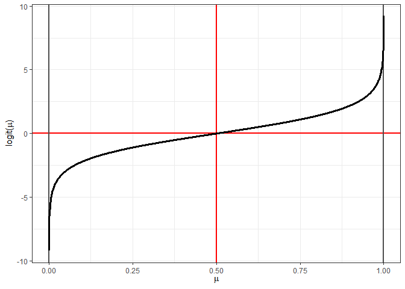<!-- -->

The transformation is usually referred to as the **link** function of
the GLM. We are “linking” our linear predictor to the variable we care
about,  in
this case, through the transformation. The probability model for our
specific case of Binomial likelihood with size of 1 and a logit-link
function with a single input and single predictor can therefore be
written as:

  
 \\\\ \\mathrm{logit}\\left(\\mu\\right) = \\beta_0 + \\beta_1 x_n
")  

We can recover the probability,
, by inverting
the logit-transformation. The inverse-logit is referred to as the
**logistic** function. The logistic is a sigmoid or “S-curve” because,
as shown in the figure below, it looks like an “S”. The logistic
function makes it more clear that we are “compressing” or “squishing”
the value of 
near 0 and 1 as we continue to increase the unbounded logit-transformed
variable. Large changes in the x-axis in the figure below above 5 or
below -5, produce very small changes in the y-axis value.

``` r
tibble::tibble(logit_val = seq(-10, 10, length.out = 1001)) %>% 
  mutate(mu = boot::inv.logit(logit_val)) %>% 
  ggplot(mapping = aes(x = logit_val, y = mu)) +
  geom_hline(yintercept = c(0, 1.0), color = "grey30", size = 1.0) +
  geom_vline(xintercept = 0, color = "red", size = 1.0) +
  geom_hline(yintercept = 0.5, color = "red", size = 1.0) +
  geom_line(mapping = aes(group = 1), 
            color = "black", size = 1.25) +
  labs(x = expression("logit("*mu*")"),
       y = expression(mu)) +
  theme_bw()
```

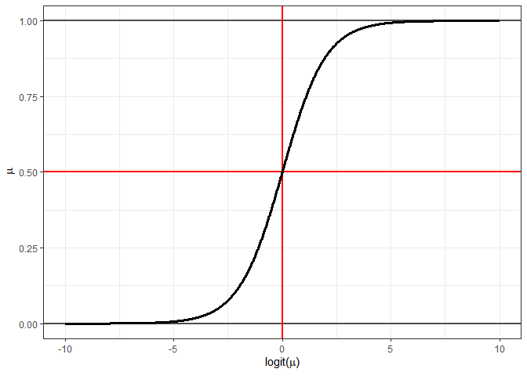<!-- -->

To make the inverse relationship a little more clear, let’s define our
unbounded variable as
:

  
![ 
\\eta = \\mathrm{logit}\\left(\\mu\\right) =
\\log\\left\[\\frac{\\mu}{1-\\mu} \\right\]
](https://latex.codecogs.com/png.latex?%20%0A%5Ceta%20%3D%20%5Cmathrm%7Blogit%7D%5Cleft%28%5Cmu%5Cright%29%20%3D%20%5Clog%5Cleft%5B%5Cfrac%7B%5Cmu%7D%7B1-%5Cmu%7D%20%5Cright%5D%0A
" 
\\eta = \\mathrm{logit}\\left(\\mu\\right) = \\log\\left[\\frac{\\mu}{1-\\mu} \\right]
")  

The probability is therefore equal to the inverse-logit of
 which is
defined as the *logistic* function:

  
 = \\mathrm{logistic}\\left(\\eta\\right)
")  

Substituting in the expression for the log-odds ratio into the
inverse-logit reveals a non-linear relationship between
 and
:

  
} = \\frac{\\exp\\left(\\eta \\right)}{1 + \\exp\\left(\\eta \\right)}
")  

Our probability model can therefore be written in terms of the unbounded
variable :

  
 \\\\ \\mu_n = \\mathrm{logit}^{-1}\\left(\\eta_n \\right) \\\\ \\eta_n = \\beta_0 + \\beta_1 x_n
")  

## Linear predictor

In our generalized linear modeling framework,
 is our
**linear predictor**. It is what we are applying our linear model to.
Even though we have introduced the GLM with a single predictor from a
single input, we can extend to include multiple and multiple predictors
relatively easily. In the case of a design matrix,
, consisting of
 rows and
 columns (where
 is the number of
inputs) the -th linear
predictor is:

  
  

If we instead have a *predictor* design matrix,
, of 
rows and 
columns (where  is the
polynomial order or more generally the number of predictors), the
-th linear predictor is:

  
  

The point of showing these is that the matrix notation we discussed last
week for linear models is also applicable to our GLM. The vector of
 linear predictor
values,
, can be written as the matrix product of:

  
  

or using the predictor design matrix notation:

  
  

## Model behavior

### Linear predictor and link function

Let’s now visualize trends of
 and
 with respect
to an input. We will continue to use the single input, single predictor
example for now. Let’s see how the two variables vary with respect to
that input, for different combinations of the intercept and slope. The
code chunk below defines a grid of all combinations between the
intercept , the slope
,
and the input,  using
the `expand.grid()` function. Seven specific values of the slope are
used between -2 and +2, and 3 specific intercept values are used within
the grid. The input is evaluated between the interval ![x \\in
\\left\[-4.5, 4.5\]](https://latex.codecogs.com/png.latex?x%20%5Cin%20%5Cleft%5B-4.5%2C%204.5%5D
"x \\in \\left[-4.5, 4.5]"). The result of `expand.grid()` is piped into
`mutate()` where the linear predictor `eta` is calculated, as well as
the probability `mu`.

``` r
trend_grid <- expand.grid(beta_0 = c(-2, 0, 2),
                          beta_1 = -3:3,
                          x = seq(-4.5, 4.5, length.out = 251),
                          KEEP.OUT.ATTRS = FALSE,
                          stringsAsFactors = FALSE) %>% 
  mutate(eta = beta_0 + beta_1 * x,
         mu = boot::inv.logit(eta))
```

Let’s first look at the trends of the linear predictor,
, with
respect to the input. Based on last week’s lectures, you should already
know how to interpret the figure below. There is **no difference**
between the trends of the linear predictor within a GLM and the trends
we discussed of the linear predictor of the standard linear model. In
the figure below, each color corresponds to a separate slope, while the
horizontal facets display the intercept value.

``` r
trend_grid %>% 
  ggplot(mapping = aes(x = x, y = eta)) +
  geom_hline(yintercept = 0, color = "grey30", linetype = "dashed") +
  geom_line(mapping = aes(group = interaction(beta_0, beta_1),
                          color = as.factor(beta_1)),
            size = 1.15) +
  facet_grid(. ~ beta_0, labeller = label_bquote(cols = beta[0]*"="*.(beta_0))) +
  ggthemes::scale_color_colorblind(expression(beta[1])) +
  scale_x_continuous(breaks = seq(-4, 4, by = 2)) +
  labs(y = expression(eta)) +
  theme_bw() +
  theme(legend.position = "top") +
  guides(color = guide_legend(nrow = 1))
```

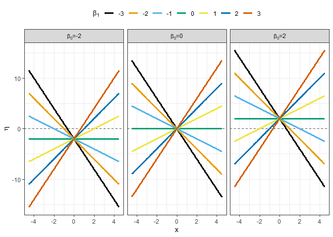<!-- -->

However, what will the probability,
, look like
with respect to ? As we
saw when we visualized the inverse-logit function,
 greater
than 4 and less than -4 correspond to very small changes in the
. We are
within the asymptotic “zone” and so the probability cannot continue to
increase or decrease as the same rate. The level of change must slow
down to respect the natural lower and upper constraints on the
probability. The figure below plots
 with respect
to  using the same color
scheme as the linear predictor figure.

``` r
trend_grid %>% 
  ggplot(mapping = aes(x = x, y = mu)) +
  geom_hline(yintercept = boot::inv.logit(0), color = "grey30", linetype = "dashed") +
  geom_line(mapping = aes(group = interaction(beta_0, beta_1),
                          color = as.factor(beta_1)),
            size = 1.15) +
  facet_grid(. ~ beta_0, labeller = label_bquote(cols = beta[0]*"="*.(beta_0))) +
  ggthemes::scale_color_colorblind(expression(beta[1])) +
  scale_x_continuous(breaks = seq(-4, 4, by = 2)) +
  labs(y = expression(mu)) +
  theme_bw() +
  theme(legend.position = "top") +
  guides(color = guide_legend(nrow = 1))
```

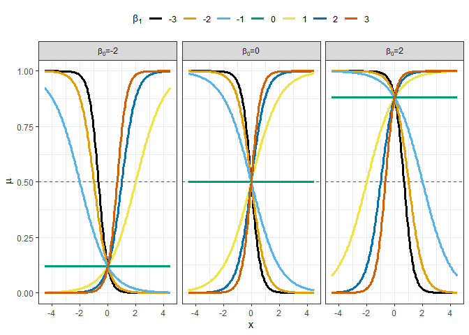<!-- -->

The figure above might be a little confusing to look at. So let’s
isolate the  and
 curve. The figure below plots the linear predictor and the
probability as two separate vertical facets. The top row is
 and the
bottom row is . With the slope equal to 0, we have no trend in either variable
with respect to the input. However, look at the value of the linear
predictor compared with the probability.

corresponds to
\!

``` r
slope_colors <- trend_grid %>% 
  distinct(beta_1) %>% 
  arrange(beta_1) %>% 
  mutate(color_use = ggthemes::colorblind_pal()(n()))

slope_colors_show <- slope_colors$color_use
names(slope_colors_show) <- as.character(slope_colors$beta_1)

trend_grid %>% 
  tibble::rowid_to_column() %>% 
  tidyr::gather(key = "variable_name", value = "value", 
                -beta_0, -beta_1, -x, -rowid) %>% 
  mutate(beta_0_label = sprintf("beta[0]:%d", beta_0)) %>% 
  filter(beta_0 == 0, beta_1 == 0) %>% 
  ggplot(mapping = aes(x = x, y = value)) +
  geom_vline(xintercept = 0, color = "grey30", linetype = "dashed") +
  geom_line(mapping = aes(group = interaction(beta_0, 
                                              beta_1,
                                              variable_name),
                          color = as.factor(beta_1)), 
            size = 1.15) +
  facet_grid(variable_name ~ beta_0_label,
             labeller = label_parsed,
             scales = "free_y") +
  scale_color_manual(expression(beta[1]),
                     values = slope_colors_show) +
  scale_x_continuous(breaks = seq(-4, 4, by = 2)) +
  theme_bw() +
  theme(legend.position = "top") +
  guides(color = guide_legend(nrow = 1))
```

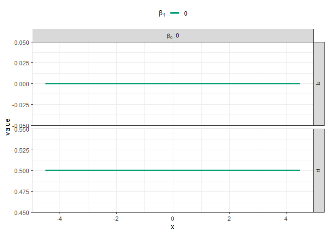<!-- -->

Next, include the case of a positive slope,
. The linear predictor,
, is now
increasing left to right in the figure below. The probability,
, now follows
the S-curve shape we discussed earlier. The five vertical dashed lines
located at -3 through +3 are meant to help visualize the impact of the
“compression” as  approaches 0 and 1. As the input continues to increase (or
descrease) above 4 (below -4) the probability only changes by a little
bit. The impact of the input has essentially saturated.

``` r
trend_grid %>% 
  tibble::rowid_to_column() %>% 
  tidyr::gather(key = "variable_name", value = "value", 
                -beta_0, -beta_1, -x, -rowid) %>% 
  mutate(beta_0_label = sprintf("beta[0]:%d", beta_0)) %>% 
  filter(beta_0 == 0, beta_1 %in% c(0, 1)) %>% 
  ggplot(mapping = aes(x = x, y = value)) +
  geom_vline(xintercept = -3:3, color = "grey30", linetype = "dashed") +
  geom_line(mapping = aes(group = interaction(beta_0, 
                                              beta_1,
                                              variable_name),
                          color = as.factor(beta_1)), 
            size = 1.15) +
  facet_grid(variable_name ~ beta_0_label,
             labeller = label_parsed,
             scales = "free_y") +
  scale_color_manual(expression(beta[1]),
                     values = slope_colors_show) +
  scale_x_continuous(breaks = seq(-4, 4, by = 2)) +
  theme_bw() +
  theme(legend.position = "top") +
  guides(color = guide_legend(nrow = 1))
```

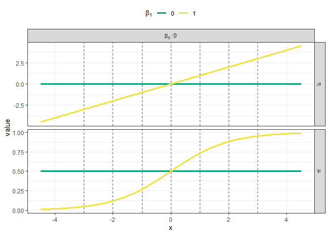<!-- -->

As we increase the slope to , the linear predictor is simply a steeper line. That
increased slope “translates” into a sharper more “refined” S-curve for
. The
probability increases from
 at  to
 by . The input value associated with the probability
saturating is closer to
 than it was
with .

``` r
trend_grid %>% 
  tibble::rowid_to_column() %>% 
  tidyr::gather(key = "variable_name", value = "value", 
                -beta_0, -beta_1, -x, -rowid) %>% 
  mutate(beta_0_label = sprintf("beta[0]:%d", beta_0)) %>% 
  filter(beta_0 == 0, beta_1 %in% c(0, 1, 2)) %>% 
  ggplot(mapping = aes(x = x, y = value)) +
  geom_vline(xintercept = -3:3, color = "grey30", linetype = "dashed") +
  geom_line(mapping = aes(group = interaction(beta_0, 
                                              beta_1,
                                              variable_name),
                          color = as.factor(beta_1)), 
            size = 1.15) +
  facet_grid(variable_name ~ beta_0_label,
             labeller = label_parsed,
             scales = "free_y") +
  scale_color_manual(expression(beta[1]),
                     values = slope_colors_show) +
  scale_x_continuous(breaks = seq(-4, 4, by = 2)) +
  theme_bw() +
  theme(legend.position = "top") +
  guides(color = guide_legend(nrow = 1))
```

<!-- -->

Increasing the slope even more to  yields an even sharper S-curve. The probability has
nearly saturated for input values greater than 1 or less than -1. **What
would happen as the slope continues to increase?**

``` r
trend_grid %>% 
  tibble::rowid_to_column() %>% 
  tidyr::gather(key = "variable_name", value = "value", 
                -beta_0, -beta_1, -x, -rowid) %>% 
  mutate(beta_0_label = sprintf("beta[0]:%d", beta_0)) %>% 
  filter(beta_0 == 0, beta_1 %in% c(0, 1, 2, 3)) %>% 
  ggplot(mapping = aes(x = x, y = value)) +
  geom_vline(xintercept = -3:3, color = "grey30", linetype = "dashed") +
  geom_line(mapping = aes(group = interaction(beta_0, 
                                              beta_1,
                                              variable_name),
                          color = as.factor(beta_1)), 
            size = 1.15) +
  facet_grid(variable_name ~ beta_0_label,
             labeller = label_parsed,
             scales = "free_y") +
  scale_color_manual(expression(beta[1]),
                     values = slope_colors_show) +
  scale_x_continuous(breaks = seq(-4, 4, by = 2)) +
  theme_bw() +
  theme(legend.position = "top") +
  guides(color = guide_legend(nrow = 1))
```

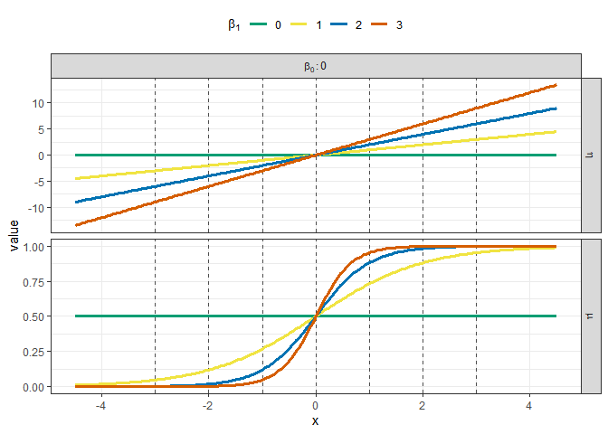<!-- -->

We can make similar statements about the behavior of the linear
predictor and probability for negative slopes, except that the
probability is decreasing as the input increases, as shown below.

``` r
trend_grid %>% 
  tibble::rowid_to_column() %>% 
  tidyr::gather(key = "variable_name", value = "value", 
                -beta_0, -beta_1, -x, -rowid) %>% 
  mutate(beta_0_label = sprintf("beta[0]:%d", beta_0)) %>% 
  filter(beta_0 == 0, beta_1 %in% -3:0) %>% 
  ggplot(mapping = aes(x = x, y = value)) +
  geom_vline(xintercept = -3:3, color = "grey30", linetype = "dashed") +
  geom_line(mapping = aes(group = interaction(beta_0, 
                                              beta_1,
                                              variable_name),
                          color = as.factor(beta_1)), 
            size = 1.15) +
  facet_grid(variable_name ~ beta_0_label,
             labeller = label_parsed,
             scales = "free_y") +
  scale_color_manual(expression(beta[1]),
                     values = slope_colors_show) +
  scale_x_continuous(breaks = seq(-4, 4, by = 2)) +
  theme_bw() +
  theme(legend.position = "top") +
  guides(color = guide_legend(nrow = 1))
```

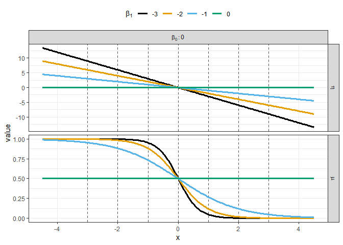<!-- -->

The impact of the intercept,
,
at first might seem confusing. So first consider that the linear
predictor behavior is the same as the behavior of the ordinary linear
model. Changing the intercept simply shifts the line up or down on the
y-axis. The figure below focuses on the  case, to make it clear the whole curve shifts up or
down, which is why there’s a single horizontal line in each subplot. The
intercept increases left to right, which is why the lines have a
“stair-step” like behavior, left to right. The probability behaves the
exact same way. A negative intercept decreases the probability
“intercept” away from 0.5, while increasing the

increases the probability above 0.5.

``` r
trend_grid %>% 
  tibble::rowid_to_column() %>% 
  tidyr::gather(key = "variable_name", value = "value", 
                -beta_0, -beta_1, -x, -rowid) %>% 
  mutate(beta_0_label = sprintf("beta[0]:%d", beta_0)) %>% 
  filter(beta_1 %in% 0) %>% 
  ggplot(mapping = aes(x = x, y = value)) +
  geom_vline(xintercept = -3:3, color = "grey30", linetype = "dashed") +
  geom_line(mapping = aes(group = interaction(beta_0, 
                                              beta_1,
                                              variable_name),
                          color = as.factor(beta_1)), 
            size = 1.15) +
  facet_grid(variable_name ~ beta_0_label,
             labeller = label_parsed,
             scales = "free_y") +
  scale_color_manual(expression(beta[1]),
                     values = slope_colors_show) +
  scale_x_continuous(breaks = seq(-4, 4, by = 2)) +
  theme_bw() +
  theme(legend.position = "top") +
  guides(color = guide_legend(nrow = 1))
```

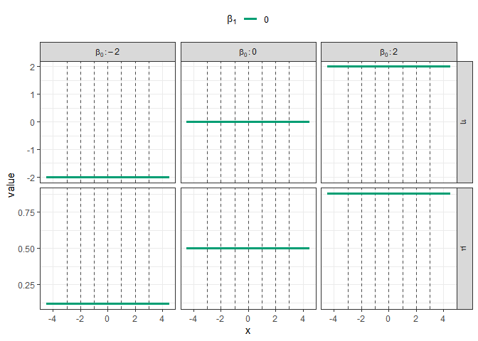<!-- -->

Changing  with a non-zero slope, has the impact of shifting the
location of the “50-50” chance. Or we can view the impact relative to
changing the input value associated with the probability saturating near
1 (or 0). For example, consider the case of  in the figure below (the yellow curves). With
 the probability begins to saturate near 1 at input values
above 4. However, increasing the intercept to  “shifts the probability curve”. The probability starts
to saturate near 1 for input values above 2. When the intercept
decreases below 0, as with  the probability saturates near 0 at input values near
-2 instead of at input values near -4 when .

``` r
trend_grid %>% 
  tibble::rowid_to_column() %>% 
  tidyr::gather(key = "variable_name", value = "value", 
                -beta_0, -beta_1, -x, -rowid) %>% 
  mutate(beta_0_label = sprintf("beta[0]:%d", beta_0)) %>% 
  filter(beta_1 %in% -1:1) %>% 
  ggplot(mapping = aes(x = x, y = value)) +
  geom_vline(xintercept = -3:3, color = "grey30", linetype = "dashed") +
  geom_line(mapping = aes(group = interaction(beta_0, 
                                              beta_1,
                                              variable_name),
                          color = as.factor(beta_1)), 
            size = 1.15) +
  facet_grid(variable_name ~ beta_0_label,
             labeller = label_parsed,
             scales = "free_y") +
  scale_color_manual(expression(beta[1]),
                     values = slope_colors_show) +
  scale_x_continuous(breaks = seq(-4, 4, by = 2)) +
  theme_bw() +
  theme(legend.position = "top") +
  guides(color = guide_legend(nrow = 1))
```

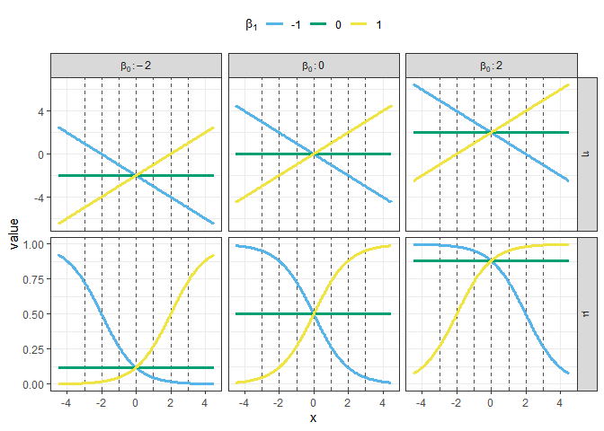<!-- -->

### Observations

When we were discussing trends trends for the linear model, after
visualizing the linear predictor we discussed how to visualize the
uncertainty in the response around the linear predictor. How can we do
that now? In a Bernoulli trial the observation will be what? The
observation is a binary variable, encoded as being either 0 or 1. Thus,
we cannot visualize uncertainty bands of probable values around the
linear predictor. The  variable is itself a probability and so represents the chance of
observing the event \!

To see why that is the case, the code chunk below generates a random
outcome, , for each
unique value of the input  based on the calculated probability of the event
. Thus we call
a random number generator associated with the likelihood:

  

")  

``` r
set.seed(9001)
rand_grid <- trend_grid %>% 
  mutate(y = rbinom(n = n(), size = 1, prob = mu))
```

Let’s now plot the random Bernoulli outcomes for each combination of the
slope and intercept with respect to the input. The y-axis can therefore
take either 0 or 1. The slopes are shown with the horizontal facets, and
the intercepts are depicted with the vertical facets. A reference
vertical grey dashed line is given to correspond to
.

``` r
rand_grid %>% 
  mutate(beta_0_plot = forcats::fct_rev(as.factor(beta_0))) %>% 
  ggplot(mapping = aes(x = x, y = y)) +
  geom_point() +
  geom_vline(xintercept = 0, color = "grey30", linetype = "dashed") +
  facet_grid(beta_0_plot ~ beta_1,
             labeller = label_bquote(rows = beta[0]*"="*.(as.numeric(as.character(beta_0_plot))),
                                     cols = beta[1]*"="*.(beta_1))) +
  theme_bw()
```

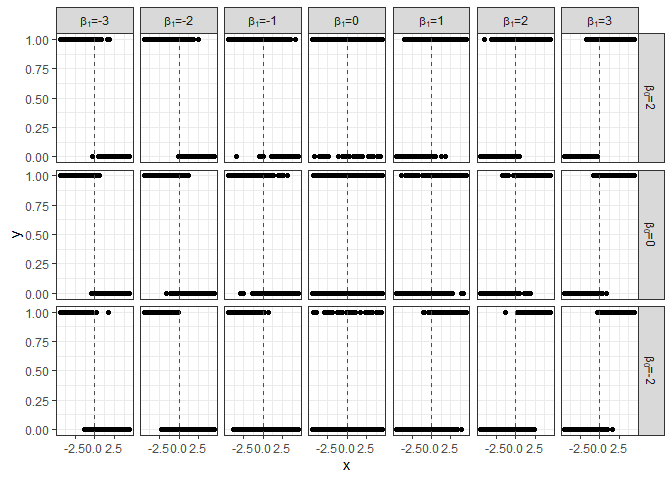<!-- -->

To try and make a little easier to tell that we have many dots on top of
each other, let’s jitter the points around the y-axis using the
`geom_jitter()` geom. The marker transparency is also set such that it
takes it 4 points directly on top of each other to yield a fully opague
point. An important trend to take away from the figure below is that as
the slope gets more negative or positive, the “separation” between
 and
 increases.
Separation refers to distinct intervals in
 associated with just a
single outcome. When
 and
 there is no “direction” preference. We are equally likely
to see the event compared to not seeing the event across all values of
. However, as the slope
moves away from zero a vertical can start to be drawn between the two
outcomes. Consider the right most column of subplots. For
 we typically
see , however
for  we
typically . As
the intercept increases from
 to
 (bottom row to top row) we get an additional increase in
the chance of the event,
.

``` r
rand_grid %>% 
  mutate(beta_0_plot = forcats::fct_rev(as.factor(beta_0))) %>% 
  ggplot(mapping = aes(x = x, y = y)) +
  geom_jitter(width = 0, height = 0.025, alpha = 0.25) +
  geom_vline(xintercept = 0, color = "grey30", linetype = "dashed") +
  facet_grid(beta_0_plot ~ beta_1,
             labeller = label_bquote(rows = beta[0]*"="*.(as.numeric(as.character(beta_0_plot))),
                                     cols = beta[1]*"="*.(beta_1))) +
  theme_bw()
```

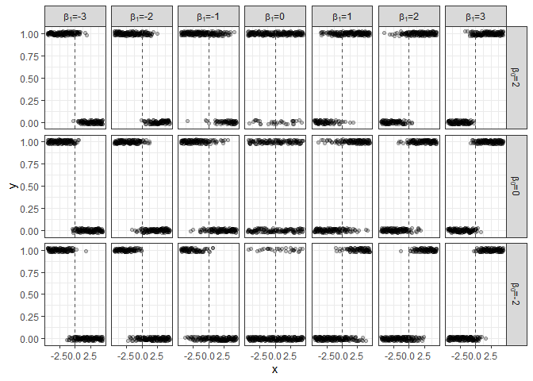<!-- -->

With the event plotted as either 0 or 1 we can also include the
probability, ,
on the same figure. The figure below includes
 with respect
to  as a transparent red
curve. A reference horizontal line at 0.5 is also included. When
 is greater
than 0.5, we see more dots at
 than we do at
. We can tell
that is the case based on the the transparency of the markers. When the
probability gets close to 1 or 0, we nearly exclusively see the event or
non-event, respectively.

``` r
rand_grid %>% 
  mutate(beta_0_plot = forcats::fct_rev(as.factor(beta_0))) %>% 
  ggplot(mapping = aes(x = x, y = y)) +
  geom_jitter(width = 0, height = 0.025, alpha = 0.25) +
  geom_line(mapping = aes(y = mu,
                          group = interaction(beta_0, beta_1)),
            color = "red", size = 1.5, alpha = 0.5) +
  geom_hline(yintercept = 0.5, color = "grey30", linetype = "dashed") +
  geom_vline(xintercept = 0, color = "grey30", linetype = "dashed") +
  facet_grid(beta_0_plot ~ beta_1,
             labeller = label_bquote(rows = beta[0]*"="*.(as.numeric(as.character(beta_0_plot))),
                                     cols = beta[1]*"="*.(beta_1))) +
  theme_bw()
```

<!-- -->

## Model fitting

### Synthetic data

Let’s create a synthetic data example to practice fitting the model,
just as we did with the linear model. We will continue to use a single
input and single predictor. The *true* parameter values of the *data
generating process* are specified to be:

  
  

Our input  will be
assumed to be a standard normal random variable. In the code code below,
100 random input observations are generated. The *true* linear predictor
is evaluated at each random input value. The event probability is
calculated by back-transforming the linear predictor through the
inverse-logit function, and then the Bernoulli random outcome is
generated. Using the terminology from last week, the Bernoulli random
outcome is our **alleatory** source of uncertainty “around” the
probability of the event.

``` r
beta_0_true <- -0.25
beta_1_true <- 0.75

set.seed(9002)
x <- rnorm(n = 100)

demo_df <- tibble::tibble(
  x = x
) %>% 
  mutate(eta = beta_0_true + beta_1_true * x,
         mu = boot::inv.logit(eta),
         y = rbinom(n = n(), size = 1, prob = mu))
```

Out of our random 100 observations, let’s take the first 10 as our
training set. Let’s visualize our randomly generated input values as a
“run style chart” where we plot the observation id as the x-axis and
the input value as the y-axis. The input mean of 0 and
 standard
deviation intervals are shown as solid and dashed horizontal lines,
respectively. The first 10 observations are marked by orange dots, while
the others have black dots.

``` r
demo_df %>% 
  tibble::rowid_to_column("obs_id") %>% 
  ggplot(mapping = aes(x = obs_id, y = x)) +
  geom_hline(yintercept = 0, color = "grey30", linetype = "solid") +
  geom_hline(yintercept = c(-1, 1), color = "grey30", linetype = "dashed") +
  geom_line(mapping = aes(group = 1), size = 1.15, color = "grey50") +
  geom_point(size = 3,
             mapping = aes(color = obs_id < 11)) +
  scale_color_manual("First 10 observations?",
                     values = c("TRUE" = "darkorange",
                                "FALSE" = "black")) +
  theme_bw() +
  theme(legend.position = "top")
```

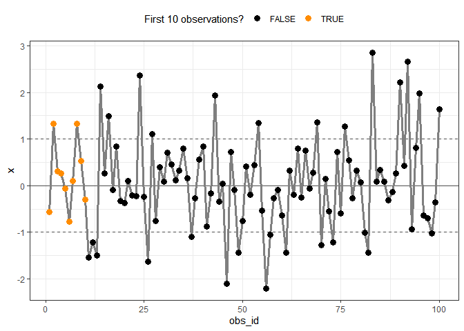<!-- -->

The *true* linear predictor and *true* event probability for the 100
observations are shown below. The first 10 data points are marked in
orange Notice that the first 10 observations all have *true* event
probabilities between 0.25 and 0.75.

``` r
demo_df %>% 
  tibble::rowid_to_column("obs_id") %>% 
  tidyr::gather(key = "variable_name", value = "value",
                -x, -y, -obs_id) %>% 
  ggplot(mapping = aes(x = x, y = value)) +
  geom_line(mapping = aes(group = variable_name),
            color = "grey50", size = 1.15) +
  geom_point(mapping = aes(color = obs_id < 11,
                           size = obs_id < 11)) +
  facet_grid(variable_name ~ ., scales = "free_y", labeller = label_parsed) +
  scale_color_manual("First 10 observations?",
                     values = c("TRUE" = "darkorange",
                                "FALSE" = "black")) +
  scale_size_manual("First 10 observations?",
                    values = c("TRUE" = 3,
                               "FALSE" = 1)) +
  theme_bw() +
  theme(legend.position = "top")
```

<!-- -->

Let’s now display the random Bernoulli outcome
 as either 0 or 1 on the
y-axis with respect to the input
. The *true* event
probability is also included but as a red curve. The separate
observations are jittered around the 0 and 1 values on the y-axis. The
first 10 observations are again marked as orange dots.

``` r
demo_df %>% 
  tibble::rowid_to_column("obs_id") %>% 
  ggplot(mapping = aes(x = x)) +
  geom_line(mapping = aes(group = 1,
                          y = mu),
            color = "red", size = 1.25, alpha = 0.5) +
  geom_jitter(mapping = aes(y = y,
                            color = obs_id < 11,
                            size = obs_id < 11),
              width = 0, 
              height = 0.05) +
  scale_color_manual("First 10 observations?",
                     values = c("TRUE" = "darkorange",
                                "FALSE" = "black")) +
  scale_size_manual("First 10 observations?",
                    values = c("TRUE" = 3,
                               "FALSE" = 1)) +
  labs(y = "y") +
  theme_bw() +
  theme(legend.position = "top")
```

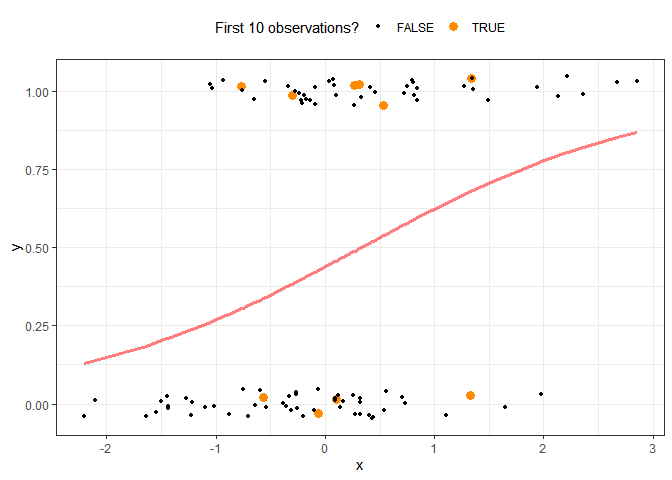<!-- -->

### Learning

Given our observations for the input,
, and the binary outcome
(response), , can we
learn the correct parameter values of our GLM? For our single input,
single predictor example, the posterior on the **two** unknown
parameters is:

  
 \\propto p\\left(\\mathbf{y} \\mid \\mathbf{x}, \\beta_0, \\beta_1 \\right) p\\left(\\beta_0, \\beta_1\\right)
")  

Is this any different in concept from what we covered with the linear
model? No, the concepts are all the same. We can thus use the same
computational tools that we used before. In fact, since this example is
just a **two** parameter problem, we can use the grid approximation to
evaluate the log-posterior\! Thus, we will first perform the grid
approximation to see what the true log-posterior looks like. Then we
will approximate it with the Laplace approximation, and compare our
approximation to the true answer.

However, before doing that, we must specify our prior distributions.
Let’s start out with with independent standard normal priors on the
intercept and slope. **Based on the previous lectures, would you say the
standard normal is an informative or diffuse prior?** The probability
model can therefore be written as:

  
 \\\\ \\mu_n = \\mathrm{logit}^{-1}\\left(\\eta_n \\right) \\\\ \\eta_n = \\beta_0 + \\beta_1 x_n \\\\ \\beta_0 \\sim \\mathrm{normal}\\left(0, 1\\right) \\\\ \\beta_1 \\sim \\mathrm{normal}\\left(0, 1\\right)
")  

Before proceeding further, based on the above model, do we need to
consider the change of variables derivative? After all we are applying a
logit-transformation to constrain the probability between 0 and 1.
**What do you think?** If you are unsure, look at the posterior
distribution. We are interested in determining the posterior
distribution on the linear predictor parameters, . Have we applied a
transformatioin to those parameters? No, we have not. With our GLM, the
probability is a non-linear **deterministic** function given the linear
predictor parameters and the input.

#### Log-posterior

We need to define our log-posterior function before we can attempt
either the Grid or Laplace approximations. The code chunk below defines
the `logistic_logpost()` function. As with our other log-posterior
functions, it accepts two input arguments. The first, `unknown_params`,
is a vector containing all of the unknown parameters we need to learn.
In this problem, the first element corresponds to

and the second element is
.
The second argument to `logistic_logpost()` is a list, `my_info`, which
contains all information necessary to evaluating the log-posterior.
Notice that the code itself is similar to the log-posterior function
from the previous lectures. The log-likelihood is still the summation
over  separate
likelihoods, but now we are using the `dbinom()` function instead of the
`dnorm()` function. **Why is the `size` argument set equal to 1 in the
`dbinom()` call?** Also, note how the event probability, `mu`, is
calculated after the linear predictor `eta`.

``` r
logistic_logpost <- function(unknown_params, my_info)
{
  # unpack the parameter vector
  beta_0 <- unknown_params[1]
  beta_1 <- unknown_params[2]
  
  # calculate linear predictor
  eta <- beta_0 + beta_1 * my_info$xobs
  
  # calculate the event probability
  mu <- boot::inv.logit(eta)
  
  # evaluate the log-likelihood
  log_lik <- sum(dbinom(x = my_info$yobs,
                        size = 1,
                        prob = mu,
                        log = TRUE))
  
  # evaluate the log-prior
  log_prior <- dnorm(x = beta_0,
                     mean = my_info$b0_mu,
                     sd = my_info$b0_sd,
                     log = TRUE) +
    dnorm(x = beta_1,
          mean = my_info$b1_mu,
          sd = my_info$b1_sd,
          log = TRUE)
  
  # sum together
  log_lik + log_prior
}
```

The required information to evaluate the log-posterior function is
created below. The complete `demo_df` data set is split into the first
10 and remaining 90 observations. The input and response variables are
then assigned to the `xobs` and `yobs` elements within the list
`info_use`, as required by the `logistic_logpost()` function.

``` r
train_df <- demo_df %>% 
  slice(1:10)

info_use <- list(
  xobs = train_df$x,
  yobs = train_df$y,
  b0_mu = 0,
  b0_sd = 1,
  b1_mu = 0, 
  b1_sd = 1
)
```

#### Grid approximation

Before evaluating and visualizing the log-posterior 2D surface, let’s
first visualize the log-posterior with respect to one parameter at a
time. The code chunk below defines two sets of grids. The first,
`int_grid`, a fine grid of intercept values for 5 specific slope values.
The second, `slope_grid`, is the opposite; a fine grid of slope values
for 5 specific intercepts.

``` r
int_grid <- expand.grid(beta_0 = seq(-3, 3, length.out = 251),
                        beta_1 = -2:2,
                        KEEP.OUT.ATTRS = FALSE,
                        stringsAsFactors = FALSE) %>% 
  as.data.frame() %>% tbl_df()

slope_grid <- expand.grid(beta_0 = -2:2,
                          beta_1 = seq(-3, 3, length.out = 251),
                          KEEP.OUT.ATTRS = FALSE,
                          stringsAsFactors = FALSE) %>% 
  as.data.frame() %>% tbl_df()
```

A “wrapper” function is defined below which allows us to evaluate our
log-posterior function. The `eval_logpost()` function below is slightly
different from “wrapper” functions in previous lectures. The specific
function to call is passed in as the third input argument.

``` r
eval_logpost <- function(b0_val, b1_val, logpost_func, my_info)
{
  logpost_func(c(b0_val, b1_val), my_info)
}
```

Let’s now evaluate our log-posterior function at the three specific
slope values over the fine grid of intercepts.

``` r
log_post_wrt_b0 <- purrr::map2_dbl(int_grid$beta_0,
                                   int_grid$beta_1,
                                   eval_logpost,
                                   logpost_func = logistic_logpost,
                                   my_info = info_use)
```

The figure below plots the renormalized log-posterior with respect to
the intercept. The colors denote the slope and are consistent with the
figures shown earlier in this report. The *true* intercept,
, which generates the *true* linear
predictor is marked by the vertical dashed red line. **Can you interpret
the figure below? What feature is most apparent in the figure below?**
Which slope and intercept combination seems most plausible?

``` r
int_grid %>% 
  mutate(log_post = log_post_wrt_b0,
         log_post_2 = log_post - max(log_post)) %>% 
  ggplot(mapping = aes(x = beta_0, y = log_post_2)) +
  geom_line(mapping = aes(group = beta_1,
                          color = as.factor(beta_1)),
            size = 1.15) +
  geom_vline(xintercept = beta_0_true, color = "red", linetype = "dashed") +
  scale_color_manual(expression(beta[1]),
                     values = slope_colors_show) +
  labs(x = expression(beta[0]),
       y = "log-posterior") +
  theme_bw() +
  theme(legend.position = "top")
```

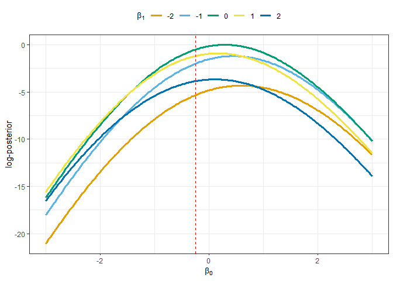<!-- -->

Next, let’s evaluate the log-posterior over the fine grid of slope
values at a few specific intercepts.

``` r
log_post_wrt_b1 <- purrr::map2_dbl(slope_grid$beta_0,
                                   slope_grid$beta_1,
                                   eval_logpost,
                                   logpost_func = logistic_logpost,
                                   my_info = info_use)
```

The figure below visualizes the renormalized log-posterior with respect
to the slope parameter. The colors now denote the intercept value, and a
different color scheme is used compared to the figure above. The *true*
slope parameter,
, which generated the *true* linear
predictor is shown as a red dashed vertical line. **As with the previous
figure, what stands out about each individual curve, in the figure
below?**

``` r
slope_grid %>% 
  mutate(log_post = log_post_wrt_b1,
         log_post_2 = log_post - max(log_post)) %>% 
  ggplot(mapping = aes(x = beta_1, y = log_post_2)) +
  geom_line(mapping = aes(group = beta_0,
                          color = as.factor(beta_0)),
            size = 1.15) +
  geom_vline(xintercept = beta_1_true, color = "red", linetype = "dashed") +
  scale_color_brewer(expression(beta[0]),
                     palette = "Set1") +
  labs(x = expression(beta[1]),
       y = "log-posterior") +
  theme_bw() +
  theme(legend.position = "top")
```

<!-- -->

Let’s now define a fine grid over both the intercept and the slope.

``` r
beta_grid <- expand.grid(beta_0 = seq(-3, 3, length.out = 251),
                         beta_1 = seq(-3, 3, length.out = 251),
                         KEEP.OUT.ATTRS = FALSE,
                         stringsAsFactors = FALSE) %>% 
  as.data.frame() %>% tbl_df()
```

And evaluate the log-posterior over that fine two-dimensional grid.

``` r
log_post_2d_grid <- purrr::map2_dbl(beta_grid$beta_0,
                                    beta_grid$beta_1,
                                    eval_logpost,
                                    logpost_func = logistic_logpost,
                                    my_info = info_use)
```

The log-posterior surface with respect to the

and  parameters is visualized below. The color scheme and contour
schemes are consist with the previous lectures. Where is the posterior
mode relative to the true parameter values? **More importantly however,
the log-posterior has a single mode\!**

``` r
beta_grid %>% 
  mutate(log_post = log_post_2d_grid) %>% 
  mutate(log_post_2 = log_post - max(log_post)) %>% 
  ggplot(mapping = aes(x = beta_1, y = beta_0)) +
  geom_raster(mapping = aes(fill = log_post_2)) +
  stat_contour(mapping = aes(z = log_post_2),
               breaks = log(c(0.01/100, 0.01, 0.1, 0.5, 0.9)),
               size = 1.05,
               color = "black") +
  geom_hline(yintercept = beta_0_true,
             color = "red", linetype = "dashed") +
  geom_vline(xintercept = beta_1_true,
             color = "red", linetype = "dashed") +
  coord_fixed(ratio = 1) +
  scale_fill_viridis_c(guide = FALSE, option = "viridis",
                       limits = log(c(0.01/100, 1.0))) +
  labs(x = expression(beta[1]), y = expression(beta[0]),
       title = "Log-posterior based on N = 10 observations") +
  theme_bw() +
  theme(legend.position = "top",
        axis.text = element_text(size = 12),
        axis.title = element_text(size = 12))
```

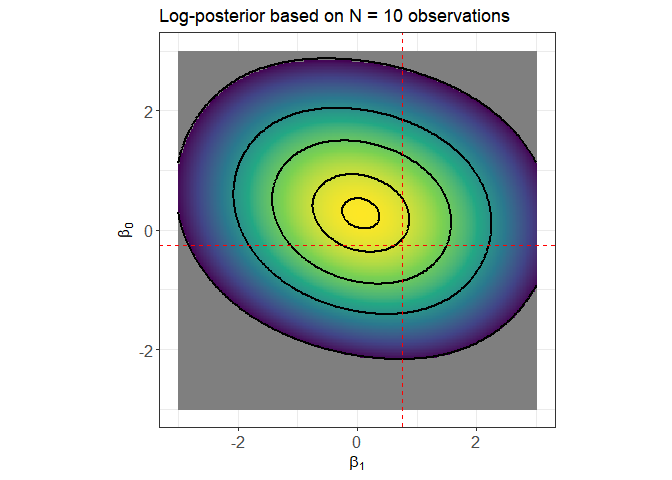<!-- -->

##### Changing sample size

What happens to our log-posterior surface as we increase the sample
size? We should expact that at some point the posterior should
“compress” around the true parameter values. The code chunk below
creates a wrapper function which manages the execution of the
log-posterior surface with respect the desired number of
observations.

``` r
manage_log_post_exec <- function(num_obs, avail_data, logpost_func, my_settings, grid_use)
{
  # pass in the correct number of input/output observations
  my_settings$xobs <- avail_data$x[1:num_obs]
  my_settings$yobs <- avail_data$y[1:num_obs]
  
  lp_val <- purrr::map2_dbl(grid_use$beta_0,
                            grid_use$beta_1,
                            eval_logpost,
                            logpost_func,
                            my_info = my_settings)
  
  grid_use %>% 
    mutate(log_post = lp_val,
           N = num_obs)
}
```

Rather than incrementing by one data point at a time, we will add 2 data
points at a time. The code chunk calculates the log-posterior for up to
the first 30 data points.

``` r
hyper_list_01 <- list(
  b0_mu = 0,
  b0_sd = 1,
  b1_mu = 0,
  b1_sd = 1
)

log_post_surface_result_01 <- purrr::map_dfr(seq(2, 30, by = 2),
                                             manage_log_post_exec,
                                             avail_data = demo_df,
                                             logpost_func = logistic_logpost,
                                             my_settings = hyper_list_01,
                                             grid_use = beta_grid)
```

For context, the code chunk below evaluates the log-prior over the same
intercept and slope combinations.

``` r
### evaluate the log-prior density with `mvtnorm::dmvnorm()`
beta_prior_log_density <- mvtnorm::dmvnorm(as.matrix(beta_grid),
                                           mean = c(info_use$b0_mu, info_use$b1_mu),
                                           sigma = matrix(c(info_use$b0_sd^2, 0, 0, info_use$b1_sd^2),
                                                          nrow = 2,
                                                          byrow = TRUE),
                                           log = TRUE)

### bring the result to the grid of values
beta_prior_grid <- beta_grid %>% 
  mutate(log_prior = beta_prior_log_density)
```

Combine the log-prior with the log-posterior evaluation and plot the
log-posterior contour surfaces based on the number of data points. The
posterior uncertainty does start to compress around the true parameter
values, but at a slower rate compared with our original linear model
example. **Any ideas as to why?**

``` r
beta_prior_grid %>% 
  rename(log_post = log_prior) %>% 
  mutate(N = 0) %>% 
  bind_rows(log_post_surface_result_01) %>% 
  group_by(N) %>% 
  mutate(max_log_post = max(log_post)) %>% 
  ungroup() %>% 
  mutate(log_post_2 = log_post - max_log_post) %>% 
  ggplot(mapping = aes(x = beta_1, y = beta_0)) +
  stat_contour(mapping = aes(z = log_post_2,
                             group = N),
               breaks = log(c(0.01/100, 0.01, 0.1, 0.5, 0.9)),
               size = 1.05,
               color = "black") +
  geom_hline(yintercept = beta_0_true,
             color = "red", linetype = "dashed") +
  geom_vline(xintercept = beta_1_true,
             color = "red", linetype = "dashed") +
  coord_fixed(ratio = 1) +
  facet_wrap(~N, labeller = "label_both") +
  labs(x = expression(beta[1]), y = expression(beta[0])) +
  theme_bw()
```

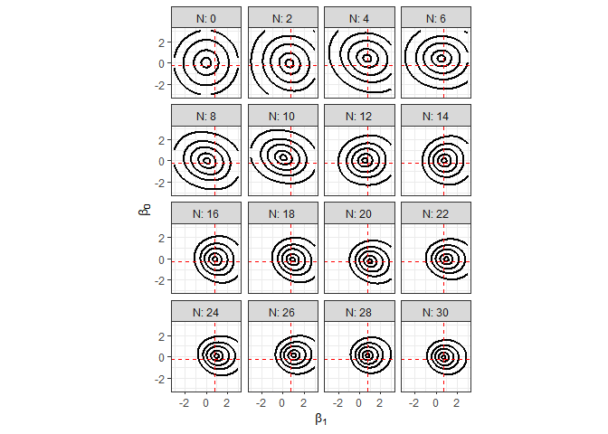<!-- -->

##### Diffuse prior

Let’s now recalculate our log-posterior surfaces but starting from a
diffuse prior. We will use prior standard deviations of 5 on both
parameters. The code chunk below defines the new list of diffuse
hyperparameters, and then reperforms sequentially adding two data points
at a time.

``` r
hyper_diffuse_01 <- list(
  b0_mu = 0,
  b0_sd = 5,
  b1_mu = 0,
  b1_sd = 5
)

log_post_surface_diffuse_01 <- purrr::map_dfr(seq(2, 30, by = 2),
                                              manage_log_post_exec,
                                              avail_data = demo_df,
                                              logpost_func = logistic_logpost,
                                              my_settings = hyper_diffuse_01,
                                              grid_use = beta_grid)
```

Evaluate the log-density of the diffuse prior over the grid of parameter
values.

``` r
beta_prior_log_diffuse <- mvtnorm::dmvnorm(as.matrix(beta_grid),
                                           mean = c(hyper_diffuse_01$b0_mu, hyper_diffuse_01$b1_mu),
                                           sigma = matrix(c(hyper_diffuse_01$b0_sd^2, 
                                                            0, 
                                                            0, 
                                                            hyper_diffuse_01$b1_sd^2),
                                                          nrow = 2,
                                                          byrow = TRUE),
                                           log = TRUE)

beta_diffuse_grid <- beta_grid %>% 
  mutate(log_prior = beta_prior_log_diffuse)
```

And now visualize the log-posterior density contours as a function of
the number of data points. **What’s going on with the prior,
?**

``` r
beta_diffuse_grid %>% 
  rename(log_post = log_prior) %>% 
  mutate(N = 0) %>% 
  bind_rows(log_post_surface_diffuse_01) %>% 
  group_by(N) %>% 
  mutate(max_log_post = max(log_post)) %>% 
  ungroup() %>% 
  mutate(log_post_2 = log_post - max_log_post) %>% 
  ggplot(mapping = aes(x = beta_1, y = beta_0)) +
  stat_contour(mapping = aes(z = log_post_2,
                             group = N),
               breaks = log(c(0.01/100, 0.01, 0.1, 0.5, 0.9)),
               size = 1.05,
               color = "black") +
  geom_hline(yintercept = beta_0_true,
             color = "red", linetype = "dashed") +
  geom_vline(xintercept = beta_1_true,
             color = "red", linetype = "dashed") +
  coord_fixed(ratio = 1) +
  facet_wrap(~N, labeller = "label_both") +
  labs(x = expression(beta[1]), y = expression(beta[0])) +
  theme_bw()
```

<!-- -->

So even with a diffuse prior, the likelihood is giving a result that is
unimodal\! With a few observations and a diffuse prior, the posterior is
very “broad”, but still unimodal. **Based on these results do you think
the Laplace approximation is an appropriate inference strategy? Why or
why not?**

#### Laplace approximation

We will sequentially apply the Laplace approximation, just as we did the
Grid approximation previously. For each of the 15 sets of observations,
we will approximate the posterior with a MVN distribution. The code
chunk below defines the Laplace approximation function we have used the
last few lectures:

``` r
my_laplace <- function(start_guess, logpost_func, ...)
{
  # code adapted from the `LearnBayes`` function `laplace()`
  fit <- optim(start_guess,
               logpost_func,
               gr = NULL,
               ...,
               method = "BFGS",
               hessian = TRUE,
               control = list(fnscale = -1, maxit = 1001))
  
  mode <- fit$par
  h <- -solve(fit$hessian)
  p <- length(mode)
  int <- p/2 * log(2 * pi) + 0.5 * log(det(h)) + logpost_func(mode, ...)
  list(mode = mode,
       var_matrix = h,
       log_evidence = int,
       converge = ifelse(fit$convergence == 0,
                         "YES", 
                         "NO"),
       iter_counts = fit$counts[1])
}
```

We will reuse the “manager” function which executes the Laplace
approximation for a desired number of
observations.

``` r
viz_mvn_approx_post <- function(num_obs, avail_data, my_settings, grid_use, init_guess, logpost_func)
{
  # add in the observations correctly
  my_settings$xobs <- avail_data$x[1:num_obs]
  my_settings$yobs <- avail_data$y[1:num_obs]
  
  # execute the laplace approximation
  laplace_result <- my_laplace(init_guess, logpost_func, my_settings)
  
  # evaluate the MVN approx posterior log-density
  approx_logpost <- mvtnorm::dmvnorm(as.matrix(grid_use),
                                     mean = laplace_result$mode,
                                     sigma = laplace_result$var_matrix,
                                     log = TRUE)
  
  # package everything together
  grid_use %>% 
    mutate(log_post = approx_logpost) %>% 
    mutate(N = num_obs,
           type = "Laplace")
}
```

Let’s apply the Laplace approximation using based on the diffuse prior
specification:

``` r
approx_log_post_surface_diffuse_01 <- purrr::map_dfr(seq(2, 30, by = 2),
                                                     viz_mvn_approx_post,
                                                     avail_data = demo_df,
                                                     my_settings = hyper_diffuse_01,
                                                     grid_use = beta_grid,
                                                     init_guess = c(1, -1),
                                                     logpost_func = logistic_logpost)
```

The code chunk below generates a figure which overlays the Laplace
approximation result with dashed red contours on top of the true
log-posterior contours. The figure below focuses on a subset of the
cases to help make it easier to see each subplot.

``` r
beta_prior_grid %>% 
  mutate(N = 0) %>% 
  bind_rows(log_post_surface_diffuse_01) %>% 
  mutate(type = "Grid") %>% 
  bind_rows(approx_log_post_surface_diffuse_01) %>% 
  filter(N %in% c(4, 6, 12, 18, 24, 30)) %>% 
  group_by(N, type) %>% 
  mutate(max_log_post = max(log_post)) %>% 
  ungroup() %>% 
  mutate(log_post_2 = log_post - max_log_post) %>% 
  ggplot(mapping = aes(x = beta_1, y = beta_0)) +
  stat_contour(mapping = aes(z = log_post_2,
                             group = interaction(N, type),
                             color = type,
                             linetype = type),
               breaks = log(c(0.01/100, 0.01, 0.1, 0.5, 0.9)),
               size = 1.05) +
  geom_hline(yintercept = beta_0_true,
             color = "navyblue", linetype = "dashed") +
  geom_vline(xintercept = beta_1_true,
             color = "navyblue", linetype = "dashed") +
  coord_fixed(ratio = 1) +
  facet_wrap(~N, labeller = "label_both") +
  scale_color_manual("Method",
                     values = c("Grid" = "black",
                                "Laplace" = "red")) +
  scale_linetype_manual("Method",
                        values = c("Grid" = "solid",
                                   "Laplace" = "dashed")) +
  labs(x = expression(beta[1]), y = expression(beta[0])) +
  theme_bw()
```

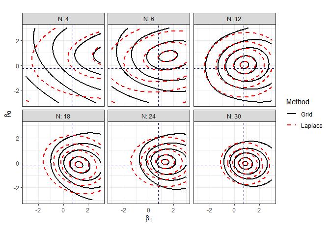<!-- -->

## Derivation

What’s going on here? Why does the MVN appear to be a quite accurate
approximation to the true posterior, especially as the number of data
points increases? To answer these questions we need to dive back into
the math.

As we did in Lecture 07, let’s assume that we are working with an
infinitely diffuse prior. Thus, the log-posterior is approximately equal
to the log-likelihood. If the unknown linear predictor parameters are
contained within the vector
, the log-posterior is approximately:

  
![ 
\\log \\left\[ p\\left(\\boldsymbol{\\beta} \\mid \\mathbf{y},
\\mathbf{x} \\right) \\right\] \\approx \\log \\left\[ p\\left(
\\mathbf{y} \\mid \\mathbf{x}, \\boldsymbol{\\beta} \\right) \\right\]
](https://latex.codecogs.com/png.latex?%20%0A%5Clog%20%5Cleft%5B%20p%5Cleft%28%5Cboldsymbol%7B%5Cbeta%7D%20%5Cmid%20%5Cmathbf%7By%7D%2C%20%5Cmathbf%7Bx%7D%20%5Cright%29%20%5Cright%5D%20%5Capprox%20%5Clog%20%5Cleft%5B%20p%5Cleft%28%20%5Cmathbf%7By%7D%20%5Cmid%20%5Cmathbf%7Bx%7D%2C%20%5Cboldsymbol%7B%5Cbeta%7D%20%5Cright%29%20%5Cright%5D%0A
" 
\\log \\left[ p\\left(\\boldsymbol{\\beta} \\mid \\mathbf{y}, \\mathbf{x} \\right) \\right] \\approx \\log \\left[ p\\left( \\mathbf{y} \\mid \\mathbf{x}, \\boldsymbol{\\beta} \\right) \\right]
")  

The log-likelihood is the sum of the
 *conditionally*
independent Bernoulli likelihoods:

  
![ 
\\log \\left\[ p\\left( \\mathbf{y} \\mid \\mathbf{x},
\\boldsymbol{\\beta} \\right) \\right\] \\rightarrow \\log \\left\[
p\\left( \\mathbf{y} \\mid \\mathbf{x}, \\boldsymbol{\\mu} \\right)
\\right\] = \\sum\_{n=1}^{N} \\left( y\_n \\log \\left\[\\mu\_n
\\right\] + \\left(1 - y\_n\\right) \\log \\left\[1-\\mu\_n \\right\]
\\right) \\\\ \\mu\_n = \\mathrm{logit}^{-1}\\left(\\eta\_n \\right)
\\\\ \\eta\_n = \\beta\_0 + \\beta\_1 x\_n
](https://latex.codecogs.com/png.latex?%20%0A%5Clog%20%5Cleft%5B%20p%5Cleft%28%20%5Cmathbf%7By%7D%20%5Cmid%20%5Cmathbf%7Bx%7D%2C%20%5Cboldsymbol%7B%5Cbeta%7D%20%5Cright%29%20%5Cright%5D%20%5Crightarrow%20%5Clog%20%5Cleft%5B%20p%5Cleft%28%20%5Cmathbf%7By%7D%20%5Cmid%20%5Cmathbf%7Bx%7D%2C%20%5Cboldsymbol%7B%5Cmu%7D%20%5Cright%29%20%5Cright%5D%20%3D%20%5Csum_%7Bn%3D1%7D%5E%7BN%7D%20%5Cleft%28%20y_n%20%5Clog%20%5Cleft%5B%5Cmu_n%20%5Cright%5D%20%2B%20%5Cleft%281%20-%20y_n%5Cright%29%20%5Clog%20%5Cleft%5B1-%5Cmu_n%20%5Cright%5D%20%5Cright%29%20%5C%5C%20%5Cmu_n%20%3D%20%5Cmathrm%7Blogit%7D%5E%7B-1%7D%5Cleft%28%5Ceta_n%20%5Cright%29%20%5C%5C%20%5Ceta_n%20%3D%20%5Cbeta_0%20%2B%20%5Cbeta_1%20x_n%0A
" 
\\log \\left[ p\\left( \\mathbf{y} \\mid \\mathbf{x}, \\boldsymbol{\\beta} \\right) \\right] \\rightarrow \\log \\left[ p\\left( \\mathbf{y} \\mid \\mathbf{x}, \\boldsymbol{\\mu} \\right) \\right] = \\sum_{n=1}^{N} \\left( y_n \\log \\left[\\mu_n \\right] + \\left(1 - y_n\\right) \\log \\left[1-\\mu_n \\right] \\right) \\\\ \\mu_n = \\mathrm{logit}^{-1}\\left(\\eta_n \\right) \\\\ \\eta_n = \\beta_0 + \\beta_1 x_n
")  

We need to calculate the gradient of the log-posterior with respect to
each of the unknown parameters in order to find the mode. To help with
the notation, the likelihood associated with the
-th observation is
defined as:

  
![ 
L\_n = y\_n \\log \\left\[\\mu\_n \\right\] + \\left(1 - y\_n\\right)
\\log \\left\[1-\\mu\_n \\right\]
](https://latex.codecogs.com/png.latex?%20%0AL_n%20%3D%20y_n%20%5Clog%20%5Cleft%5B%5Cmu_n%20%5Cright%5D%20%2B%20%5Cleft%281%20-%20y_n%5Cright%29%20%5Clog%20%5Cleft%5B1-%5Cmu_n%20%5Cright%5D%0A
" 
L_n = y_n \\log \\left[\\mu_n \\right] + \\left(1 - y_n\\right) \\log \\left[1-\\mu_n \\right]
")  

We will use the chain rule to calculate the partial first derivative of
 with respect to

and :

  
  

  
  

Inspecting the two derivatives above reveals the only difference between
them is due the paritial derivative of the **linear predictor** with
respect to each parameter. Let’s now step through each derivative. The
-th log-likelihood’s
partial with respect to the probability of the
-th observation is:

  
  

It can be shown that the derivative of the probability with respect to
the linear predictor is the **variance** of the Bernoulli random
variable with event probability
:

  

")  

The partial derivatives of the linear predictor with respect to each
parameter:

  
  

  
  

Combine all of the terms within the chain rule:

  
 \\left( \\mu_n \\left(1 - \\mu_n \\right) \\right) \\left(1\\right) = y_n \\left(1 - \\mu_n\\right) - \\mu_n \\left(1 - y_n\\right)
")  

  
 \\left( \\mu_n \\left(1 - \\mu_n \\right) \\right) \\left(x_n \\right) = \\left(y_n \\left(1 - \\mu_n\\right) - \\mu_n \\left(1 - y_n\\right) \\right) x_n
")  

And then simplify to give:

  
  

  
 x_n
")  

We can make use of a trick we applied to the linear model formulation to
extend the derivative calculations to more inputs and predictors. Let’s
define a “fake” input,  for all
 observations. We can therefore write the linear predictor
as:

  
 = \\mathbf{x_{n,:}} \\boldsymbol{\\beta}
")  

The partial derivative of the
-th linear predictor
with respect to the -th
linear predictor parameter is simply:

  
  

We can therefore define the partial derivative of the
-th log likelihood with
respect to the -th
parameter as:

  
 x_{n,d}
")  

Before continuing, let’s pause and inspect the above expression in more
detail. The partial derivative of the
-th log-likelihood with
respect to the -th
parameter depends on
. The
probability is give as the inverse logit of the linear predictor:

  
 \\right) x_{n,d}
")  

Substituting in the logistic function into the derivative gives:

  
}{1+\\exp\\left(\\eta_n\\right)} \\right) x_{n,d}
")  

Plugging in the general expression for the linear predictor reveals that
the derivative is a non-linear function of the unknown parameters:

  
}{1+\\exp\\left(\\mathbf{x_{n,:}} \\boldsymbol{\\beta}\\right)} \\right) x_{n,d}
")  

Because of this, a closed form solution to the linear predictor
parameters,
, does not exist. We are therefore forced to
numerically determine the posterior mode.

Returning to the expression for the derivative of the
-likelihood, we can sum
up all  likelihoods to
give:

  
 x_{n,d} \\right)
")  

The above summation can be written in vector notation as:

  

")  

If the inputs are organized into a design matrix,
, with 
rows and 
columns, then the gradient vector
, containing
 terms, can be
written in matrix notation as:

  

")  

In the two previous expressions, the vector
 is a  column vector containing the event probability associated
with each observation, ![\\mathbf{\\mu} =
\\left\[\\mu\_1,...,\\mu\_n,...,\\mu\_N
\\right\]^T](https://latex.codecogs.com/png.latex?%5Cmathbf%7B%5Cmu%7D%20%3D%20%5Cleft%5B%5Cmu_1%2C...%2C%5Cmu_n%2C...%2C%5Cmu_N%20%5Cright%5D%5ET
"\\mathbf{\\mu} = \\left[\\mu_1,...,\\mu_n,...,\\mu_N \\right]^T").
Where have we seen a term like this before? The gradient of the linear
model log-likelihood with respect to the
\! The gradient vector is different now due to
the subtraction of the observed outcome vector by the unknown vector of
observation event probabilities.

Let’s now derive the terms within the Hessian matrix of second
derivatives. The second derivative of the
-th likelihood with
respect to the -th
parameter is:

  
 = -x_{n,d} \\frac{\\partial \\mu_n}{\\partial \\beta_d} = -x_{n,d} \\frac{\\partial \\mu_n}{\\partial \\eta_n} \\frac{\\partial \\eta_n}{\\partial \\beta_d} = -x_{n,d} \\mu_n \\left(1 - \\mu_n\\right) x_{n,d}
")  

Simplifying the above expression gives:

  
 \\left( x_{n,d} \\right)^2
")  

The cross-derivative terms will be determined by considering the
-th and
-th parameters:

  
 = -x_{n,d} \\frac{\\partial \\mu_n}{\\partial \\beta_{d\\prime}} = -x_{n,d} \\frac{\\partial \\mu_n}{\\partial \\eta_n} \\frac{\\partial \\eta_n}{\\partial \\beta_{d\\prime}} = -x_{n,d} \\mu_n \\left(1 -\\mu_n \\right) x_{n,d\\prime}
")  

Each of the above expressions are associated with a single observation.
Thus, we need to sum over all
 observations. Before
doing that though, consider that the terms along the main diagonal will
be summing the squared inputs. The off-diagonal terms will be summing up
the product of each input pair-wise combination of inputs. This is
analogous to the **sum of squares** matrix from the linear model\! In
this context however, there is an additional **weighting** factor equal
to the variance of the Bernoulli random variable. The Hessian matrix can
therefore be written as:

  
 \\mathbf{x}_{n,:}^{T} \\mathbf{x}_{n,:}\\right)
")  

We can simplify the Hessian matrix expression by defining a **diagonal**
matrix
, which has zero in all elements except those along the
main diagonal:

  
 \\}_{n=1}^{N}
")  

The Hessian matrix can now be written in matrix notation using the
design matrix
 and the
 matrix:

  
  

The negative Hessian matrix has several unique properties. For our
purposes, the most important is that it is a positive definite matrix,
and thus a unique global optimum exists\!

When we performed the Laplace approximation, `optim()` performed an
approximate Newton method to find the posterior mode. The approximate
Newton method estimates the full Hessian matrix using the gradient.
However, under the assumption of an infinitely diffuse prior the Hessian
matrix can be calculated assuming we know
 for
each data point. The classic approach to finding the MLE (the MAP with
an infinitely diffuse prior) is to iterate from an initial guess (just
like `optim()`) until convergence. However, rather than estimating the
Hessian, the exact Hessian matrix is used. Iterating like this yields
the new guess for the unknown parameters to be equal to the solution of
a **weighted** least squares problem. The weights are set by the
 matrix. This solution method to logistic regression is
known as the Iteratively Reweighted Least Squares (IRLS) approach. The
term *reweighted* is used to represent that the
 matrix is recalculated based on the updated guess on the
unknown parameters.

In the context of the Laplace approximation though, we can use the
expression for the Hessian to help us understand the behavior of the
marginal posterior variance associated with each parameter. Let’s
consider the case of the diffuse prior on
 with the 10 observations. We need to find the
posterior mode in order to correctly evaluate the Hessian matrix, so
let’s execute the Laplace approximation for this case.

``` r
info_diffuse <- list(
  xobs = train_df$x,
  yobs = train_df$y,
  b0_mu = 0,
  b0_sd = 5,
  b1_mu = 0, 
  b1_sd = 5
)

laplace_diffuse_N10 <- my_laplace(c(1, -1), logistic_logpost, info_diffuse)
```

The posterior mode on the parameters is:

``` r
laplace_diffuse_N10$mode
```

    ## [1] 0.38559206 0.06298872

Let’s now assemble the design matrix for the 10 observations.

``` r
Xmat <- train_df %>% 
  mutate(int_var = 1) %>% 
  select(int_var, x) %>% 
  as.matrix()
```

The weighting matrix
 is calculated based on the
 mode:

``` r
Smat <- train_df %>% 
  mutate(eta_map = laplace_diffuse_N10$mode[1] + laplace_diffuse_N10$mode[2] * x,
         mu_map = boot::inv.logit(eta_map),
         y_var_map = mu_map * (1 - mu_map)) %>% 
  pull(y_var_map) %>% 
  diag()
```

We can now calculate the Hessian matrix around the posterior mode:

``` r
Hmat <- -t(Xmat) %*% Smat %*% Xmat
```

Now, assuming that our prior standard deviation on the unknown
s was sufficiently diffuse, the posterior
covariance matrix is equal to:

``` r
post_covmat <- -solve(Hmat)
```

Print out our estimate to the posterior covariance matrix and compare to
the posterior covariance matrix returned from the Laplace approximation
directly:

``` r
post_covmat
```

    ##            int_var          x
    ## int_var  0.4570303 -0.1932815
    ## x       -0.1932815  0.9175586

``` r
laplace_diffuse_N10$var_matrix
```

    ##            [,1]      [,2]
    ## [1,]  0.4474351 -0.183102
    ## [2,] -0.1831020  0.883709

As shown above, our approximation is fairly close to the posterior
covariance matrix returned from the Laplace approximation. So to get a
sense of the influence of the weighting matrix,
, print out the “weights” for each of the 10 observations
below. The weights are roughly constant near
    0.24.

``` r
diag(Smat)
```

    ##  [1] 0.2425047 0.2367064 0.2400184 0.2401561 0.2411248 0.2430348 0.2406358
    ##  [8] 0.2367208 0.2393330 0.2417868

The sum of squares matrix associated with the 10 observations is:

``` r
t(Xmat) %*% Xmat
```

    ##           int_var        x
    ## int_var 10.000000 2.163996
    ## x        2.163996 5.022853

Contrast the above result with that from the **weighted** sum of
squares:

``` r
t(Xmat) %*% Smat %*% Xmat
```

    ##           int_var         x
    ## int_var 2.4020215 0.5059799
    ## x       0.5059799 1.1964321

Because the posterior covariance is the inverse of the (negative)
inverse of the Hessian matrix, we can see that the **weighting** matrix
has the effect of reducing the posterior precision on each parameter.

#### Rare events

Let’s now see what happens if we were dealing with a rare event case.
So, perhaps the event, , has a constant 5% chance of occuring. For simplicity, we will
assume the same design matrix, thus we only need to change the weighting
 matrix. The elements along the main diagonal are
therefore:

``` r
Srare <- diag(rep(0.05 * (1 - 0.05), nrow(Xmat)))

diag(Srare)
```

    ##  [1] 0.0475 0.0475 0.0475 0.0475 0.0475 0.0475 0.0475 0.0475 0.0475 0.0475

The weighted sum of squares matrix for this rare event case is then:

``` r
t(Xmat) %*% Srare %*% Xmat
```

    ##           int_var         x
    ## int_var 0.4750000 0.1027898
    ## x       0.1027898 0.2385855

Which means the approximate posterior covariance matrix on the intercept
and slope is:

``` r
-solve(-t(Xmat) %*% Srare %*% Xmat)
```

    ##           int_var         x
    ## int_var  2.321721 -1.000267
    ## x       -1.000267  4.622315

In this situation, the posterior variances on the intercept and slope
are over 8x higher than in our synthetic data example\! As a reminder,
our example had *true* event probabilities between 0.3 and 0.7. Thus, we
were within that “near linear region” of the
    logit-transformation.

``` r
train_df %>% pull(mu)
```

    ##  [1] 0.3371830 0.6793371 0.4955158 0.4869468 0.4255505 0.3039067 0.4567415
    ##  [8] 0.6786508 0.5373387 0.3830444

Now, what happens if instead of a constant rare event, we have a clear
distinction in the input space associated with the event. For example,
assume that the event probability is 0.05 when
 and the event
probability is 0.95 when
. What do you
think happens to our posterior covariance matrix under this situation?
As shown below we will get the same answer\!

``` r
train_df %>% 
  mutate(mu_sep = ifelse(x < 0, 0.05, 0.95),
         s_sep = mu_sep * (1 - mu_sep)) %>% 
  select(x, mu_sep, s_sep)
```

    ## # A tibble: 10 x 3
    ##          x mu_sep  s_sep
    ##      <dbl>  <dbl>  <dbl>
    ##  1 -0.568    0.05 0.0475
    ##  2  1.33     0.95 0.0475
    ##  3  0.309    0.95 0.0475
    ##  4  0.264    0.95 0.0475
    ##  5 -0.0667   0.05 0.0475
    ##  6 -0.772    0.05 0.0475
    ##  7  0.102    0.95 0.0475
    ##  8  1.33     0.95 0.0475
    ##  9  0.533    0.95 0.0475
    ## 10 -0.302    0.05 0.0475
