INFSCI 2595: Lecture 12
================
Dr. Joseph P. Yurko
October 2, 2019

## Load packages

``` r
library(dplyr)
library(ggplot2)
```

## Posterior predictions

After fitting a logistic regression model, how do we make posterior
predictions? How did we make posterior predictions with the linear
model?

  - Create test design matrix,
    , at
     input
    “positions”.  
  - Generate  random
    posterior samples of the linear predictor parameters,
    .  
  - Evaluate the linear predictor for at the
     test input
    positions and all 
    posterior samples.

What’s the next thing to do for the logistic regression model?

  - Back-transform the linear predictor to the event probability.  
  - Generate random observations from the Binomial (Bernoulli)
    likelihood.

### Synthetic data

We will regenerate the same synthetic dataset from last lecture. After
fitting the model, we will make posterior predictions over a test grid.

Create the complete synthetic dataset based on the specified *true*
parameter values.

``` r
beta_0_true <- -0.25
beta_1_true <- 0.75

set.seed(9002)
x <- rnorm(n = 100)

demo_df <- tibble::tibble(
  x = x
) %>% 
  mutate(eta = beta_0_true + beta_1_true * x,
         mu = boot::inv.logit(eta),
         y = rbinom(n = n(), size = 1, prob = mu))
```

### Learning

Let’s specify the log-posterior function using matrix math notation
instead of the simple expression for the linear predictor. This will
allow us to scale to more predictors later on.

``` r
logistic_logpost <- function(unknown_params, my_info)
{
  # all unknown_params are linear predictor params!
  
  # calculate linear predictor
  X <- my_info$design_matrix
  
  eta <- as.vector(X %*% as.matrix(unknown_params))
  
  # calculate the event probability
  mu <- boot::inv.logit(eta)
  
  # evaluate the log-likelihood
  log_lik <- sum(dbinom(x = my_info$yobs,
                        size = 1,
                        prob = mu,
                        log = TRUE))
  
  # evaluate the log-prior
  log_prior <- sum(dnorm(x = unknown_params,
                         mean = my_info$mu_beta,
                         sd = my_info$tau_beta,
                         log = TRUE))
  
  # sum together
  log_lik + log_prior
}
```

Use the first 30 observations as the training set, instead of the first
10. Specify the prior distributions as normal with prior standard
deviations equal to 2. In the previous lecture, we passed we will use
the `model.matrix()`

``` r
train_df <- demo_df %>% 
  slice(1:30)

Xmat <- model.matrix( ~ x, train_df)

info_use <- list(
  design_matrix = Xmat,
  yobs = train_df$y,
  mu_beta = 0,
  tau_beta = 2
)
```

We will continue to use the same `my_laplace()` function.

``` r
my_laplace <- function(start_guess, logpost_func, ...)
{
  # code adapted from the `LearnBayes`` function `laplace()`
  fit <- optim(start_guess,
               logpost_func,
               gr = NULL,
               ...,
               method = "BFGS",
               hessian = TRUE,
               control = list(fnscale = -1, maxit = 1001))
  
  mode <- fit$par
  h <- -solve(fit$hessian)
  p <- length(mode)
  int <- p/2 * log(2 * pi) + 0.5 * log(det(h)) + logpost_func(mode, ...)
  list(mode = mode,
       var_matrix = h,
       log_evidence = int,
       converge = ifelse(fit$convergence == 0,
                         "YES", 
                         "NO"),
       iter_counts = fit$counts[1])
}
```

Fit the Bayesian logistic regression model with the Laplace
approximation.

``` r
fit_demo <- my_laplace(rep(0, ncol(Xmat)), logistic_logpost, info_use)

fit_demo
```

    ## $mode
    ## [1] -0.06276174  0.82940339
    ## 
    ## $var_matrix
    ##             [,1]        [,2]
    ## [1,]  0.14764746 -0.01000762
    ## [2,] -0.01000762  0.19751155
    ## 
    ## $log_evidence
    ## [1] -21.83461
    ## 
    ## $converge
    ## [1] "YES"
    ## 
    ## $iter_counts
    ## function 
    ##       23

### Prediction functions

Let’s now create a set of prediction functions. First, define a function
which generates random samples from the MVN approximate posterior
distribution.

``` r
draw_post_samples <- function(approx_result, num_samples)
{
  MASS::mvrnorm(n = num_samples, 
                mu = approx_result$mode, 
                Sigma = approx_result$var_matrix) %>% 
    as.data.frame() %>% tbl_df() %>% 
    purrr::set_names(c(sprintf("beta_%0d", 1:length(approx_result$mode) - 1)))
}
```

Next, create a function which makes posterior predictions based on a
test input matrix and posterior linear predictor samples. When we made
the analogous function for the (standard) linear model we summarized the
posterior predictions. The function below however, returns the posterior
predictive samples, instead of summarizing.

``` r
make_post_predict <- function(Xnew, Bmat)
{
  # linear predictor posterior samples
  eta_mat <- Xnew %*% Bmat
  
  # back transform to the probability
  mu_mat <- boot::inv.logit(eta_mat)
  
  list(eta = eta_mat, mu = mu_mat)
}
```

Let’s now wrap both of the above functions within a manager function.

``` r
predict_from_laplace <- function(mvn_result, Xnew, num_samples)
{
  post <- draw_post_samples(mvn_result, num_samples)
  
  pred_samples <- make_post_predict(Xnew, t(as.matrix(post)))
  
  # reshape predictions
  eta_df <- pred_samples$eta %>% 
    t() %>% 
    as.data.frame() %>% 
    tbl_df() %>% 
    tibble::rowid_to_column("post_id") %>% 
    tidyr::gather(key = "pred_id", value = "eta", -post_id) %>% 
    mutate_at(c("pred_id"), as.numeric)
  
  mu_df <- pred_samples$mu %>% 
    t() %>% 
    as.data.frame() %>% 
    tbl_df() %>% 
    tibble::rowid_to_column("post_id") %>% 
    tidyr::gather(key = "pred_id", value = "mu", -post_id) %>% 
    mutate_at(c("pred_id"), as.numeric)
  
  eta_df %>% 
    left_join(mu_df, 
              by = c("post_id", "pred_id"))
}
```

#### Test grid

Let’s define a simple test grid that covers the range of the input
values in the complete demo dataset. That test grid will be then
“converted” into the test design matrix with the `model.matrix()`
function.

``` r
xnew <- seq(min(x), max(x), length.out = 31)

test_df <- tibble::tibble(x = xnew)

Xtest <- model.matrix( ~ x, test_df)
```

And now, let’s make posterior predictions over the test grid.

``` r
set.seed(12002)

pred_demo_samples <- predict_from_laplace(fit_demo, Xtest, 1e4)
```

Let’s now summarize the posterior predictions on the linear predictor
and on the event probability at each unique prediction “position”.

``` r
pred_demo_summary <- pred_demo_samples %>% 
  tidyr::gather(key = "output_name", value = "value", -post_id, -pred_id) %>% 
  group_by(pred_id, output_name) %>% 
  summarise(avg_val = mean(value),
            q05_val = quantile(value, 0.05),
            q25_val = quantile(value, 0.25),
            med_val = median(value),
            q75_val = quantile(value, 0.75),
            q95_val = quantile(value, 0.95)) %>% 
  ungroup() %>% 
  left_join(test_df %>% 
              tibble::rowid_to_column("pred_id"),
            by = "pred_id")
```

#### Comparison with true responses

Let’s now compare the posterior predictions on the linear predictor,
, and the
event probability, , with the *true* values defined for the synthetic data problem.

``` r
pred_demo_summary %>% 
  ggplot(mapping = aes(x = x)) +
  geom_ribbon(mapping = aes(ymin = q05_val,
                            ymax = q95_val,
                            group = output_name),
              fill = "dodgerblue", alpha = 0.45) +
  geom_ribbon(mapping = aes(ymin = q25_val,
                            ymax = q75_val,
                            group = output_name),
              fill = "dodgerblue", alpha = 0.45) +
  geom_line(mapping = aes(y = med_val,
                          group = output_name),
            color = "navyblue") +
  geom_line(mapping = aes(y = avg_val,
                          group = output_name),
            color = "white", linetype = "dashed") +
  geom_line(data = demo_df %>% 
              tibble::rowid_to_column("obs_id") %>% 
              tidyr::gather(key = "output_name", value = "value",
                            -obs_id, -x) %>% 
              filter(output_name != "y"),
            mapping = aes(x = x, y = value,
                          group = output_name),
            color = "red") +
  facet_grid(output_name ~ ., labeller = label_parsed,
             scales = "free_y") +
  labs(y = "value") +
  theme_bw()
```

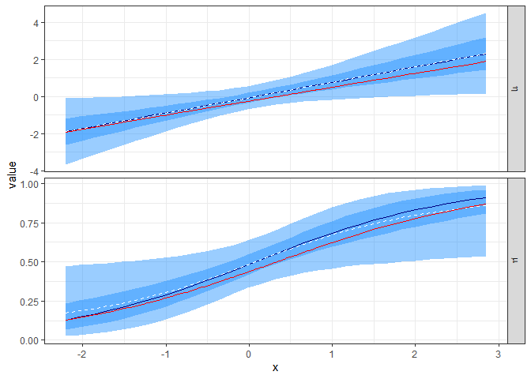<!-- -->

What about the binary outcome? The posterior predictive mean gives us
our posterior *expected* probability of the event with respect to the
input . However,
considerable uncertainty can exist in the event probability. Accounting
for the *epistemic* uncertainty on
 is
straightforward in the Bayesian apporach. We simply use each posterior
predicted event probability in the Binomial (Bernoulli) distribution and
generate random outcomes. **Why can we do this?**

``` r
set.seed(12003)

pred_demo_results <- pred_demo_samples %>% 
  mutate(y = rbinom(n = n(), size = 1, prob = mu))
```

Plot the posterior probability of observing the event, , based on
the 30 training observations.

``` r
pred_demo_results %>% 
  group_by(pred_id) %>% 
  summarise(num_post = n(),
            prob_event = mean(y == 1)) %>% 
  ungroup() %>% 
  left_join(test_df %>% 
              tibble::rowid_to_column("pred_id"),
            by = "pred_id") %>% 
  ggplot(mapping = aes(x = x)) +
  geom_jitter(data = train_df,
              mapping = aes(y = y),
              width = 0, height = 0.05,
              color = "grey30") +
  geom_line(mapping = aes(y = prob_event),
            color = "black", size = 1.15) +
  geom_line(data = demo_df,
            mapping = aes(x = x, y = mu),
            color = "red", alpha = 0.5, size = 2) +
  theme_bw()
```

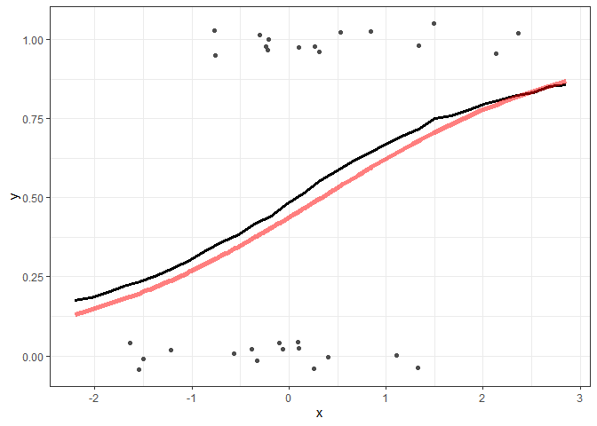<!-- -->

## Multiple predictors

### Two inputs

#### Linear additive predictors

As with the standard linear model, we can extend our **generalized**
linear model approach to more than a single predictor. Let’s consider a
two input case, where the binary response depends on two linear additive
relationships:

  
 \\\\ \\mu_n = \\mathrm{logit}^{-1}\\left(\\eta_n \\right) \\\\ \\eta_n = \\beta_0 + \\beta_1 x_{n,1} + \\beta_2 x_{n,2}
")  

We will specify that the true parameter values are:

``` r
beta_true_2_inputs <- c(0.25, -1.25, 0.85)
```

Let’s first calculate the probability of the event over a fine grid of
input values.

``` r
fine_grid_2_inputs <- expand.grid(x1 = seq(-3.5, 3.5, length.out = 225),
                                  x2 = seq(-3.5, 3.5, length.out = 225),
                                  KEEP.OUT.ATTRS = FALSE, 
                                  stringsAsFactors = FALSE) %>% 
  mutate(eta = beta_true_2_inputs[1] + beta_true_2_inputs[2]*x1 + beta_true_2_inputs[3]*x2,
         mu = boot::inv.logit(eta))
```

The probability of the event with respect to the two inputs is displayed
as contour plot below. The black line denotes the 50% probability
**boundary**. To the left of the boundary, in the figrue below, the
event is more probable than the non-event. This separation line is
therefore known as the **decision boundary** because it represents the
separation of one **class** being more probable than the other.

``` r
fine_grid_2_inputs %>% 
  ggplot(mapping = aes(x = x1, y = x2)) +
  geom_raster(mapping = aes(fill = mu)) +
  stat_contour(mapping = aes(z = mu),
               breaks = 0.5,
               size = 1.25,
               color = "black") +
  coord_fixed(ratio = 1) +
  scale_fill_viridis_c() +
  theme_bw()
```

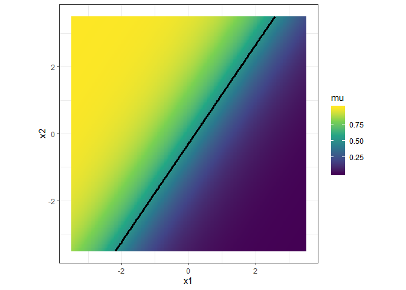<!-- -->

Generate 250 random observations assuming that the inputs come from
independent standard normals. Based on those input values, evaluate the
linear predictor and then the event probability. Finally generate a
random Bernoulli outcome, given that event probability.

``` r
set.seed(12004)
input_1 <- rnorm(n = 250)
input_2 <- rnorm(n = 250)

two_demo_df <- tibble::tibble(
  x1 = input_1,
  x2 = input_2
) %>% 
  mutate(eta = beta_true_2_inputs[1] + beta_true_2_inputs[2]*x1 + beta_true_2_inputs[3]*x2,
         mu = boot::inv.logit(eta),
         y = rbinom(n = n(), size = 1, prob = mu))
```

Plot the 250 random observations of the binary outcome on the
probability surface plot.

``` r
fine_grid_2_inputs %>% 
  ggplot(mapping = aes(x = x1, y = x2)) +
  geom_raster(mapping = aes(fill = mu)) +
  stat_contour(mapping = aes(z = mu),
               breaks = 0.5,
               size = 1.25,
               color = "black") +
  geom_point(data = two_demo_df,
             mapping = aes(shape = as.factor(y),
                           color = as.factor(y))) +
  coord_fixed(ratio = 1) +
  scale_fill_viridis_c() +
  scale_color_manual("y", 
                     values = c("0" = "white",
                                "1" = "black")) +
  scale_shape_discrete("y") +
  theme_bw() +
  theme(legend.key = element_rect(fill = "grey50"))
```

<!-- -->

We can also discretize the probability scale into “bins” rather than
looking at the “smooth” color gradients.

``` r
fine_grid_2_inputs %>% 
  ggplot(mapping = aes(x = x1, y = x2)) +
  geom_raster(mapping = aes(fill = cut(mu, 
                                     breaks = seq(0, 1, by = 0.25),
                                     include.lowest = TRUE))) +
  stat_contour(mapping = aes(z = mu),
               breaks = 0.5,
               size = 1.25,
               color = "black") +
  geom_point(data = two_demo_df,
             mapping = aes(shape = as.factor(y),
                           color = as.factor(y))) +
  coord_fixed(ratio = 1) +
  scale_fill_viridis_d(expression(mu)) +
  scale_color_manual("y", 
                     values = c("0" = "white",
                                "1" = "black")) +
  scale_shape_discrete("y") +
  theme_bw() +
  theme(legend.key = element_rect(fill = "grey50"))
```

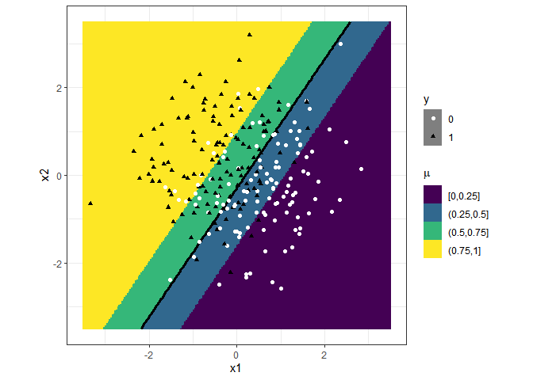<!-- -->

#### Interactions

Our linear predictor can also include an interaction between the two
inputs. An interaction is a multiplication between two variables. The
linear predictor is still linear with respect to the unknown parameters
within the relationship. The probability model for two interacting
inputs increasing the number of parameters by 1, compared with our
previous relationship:

  
 \\\\ \\mu_n = \\mathrm{logit}^{-1}\\left(\\eta_n \\right) \\\\ \\eta_n = \\beta_0 + \\beta_1 x_{n,1} + \\beta_2 x_{n,2} + \\beta_3 x_{n,1} x_{n,2}
")  

Let’s add an interaction term to our 2 input synthetic data demo. We
will use the same set of randomly generated input values,
 and
, along with the
same , , and

parameters. Let’s see what happens if try out 9 different

values between -2.5 and +2.5. **What will the results look like for
?** The code chunk below define a a function,
`bernoulli_prob_interact()` which calculates the event probability for
specific a set of
,
,
and , and

parameters. The function is defined to help us build off our previous
example.

``` r
bernoulli_prob_interact <- function(beta_3, inputs_df, beta_vec)
{
  tibble::tibble(
  x1 = inputs_df$x1,
  x2 = inputs_df$x2
) %>% 
  mutate(eta = beta_vec[1] + beta_vec[2]*x1 + beta_vec[3]*x2 + beta_3 * x1 * x2,
         mu = boot::inv.logit(eta),
         beta_3 = beta_3)
}
```

We can now apply our `bernoulli_prob_interact()` function to the
specific set of 250 input pairs and the fine grid of input pairs. This
will allow us to compare the randomly generated binary outcomes or
**classess** relative to the event probability *surface* based on the
changing interaction parameter.

``` r
beta_3_true <- seq(-2.5, 2.5, length.out = 9)

set.seed(12005)
interact_demo_df <- purrr::map_dfr(beta_3_true,
                                   bernoulli_prob_interact,
                                   inputs_df = tibble::tibble(x1 = input_1, 
                                                              x2 = input_2),
                                   beta_vec = beta_true_2_inputs) %>% 
  mutate(y = rbinom(n = n(), size = 1, prob = mu))

interact_fine_grid <- purrr::map_dfr(beta_3_true,
                                     bernoulli_prob_interact,
                                     inputs_df = expand.grid(x1 = seq(-3.5, 3.5, length.out = 225),
                                                             x2 = seq(-3.5, 3.5, length.out = 225),
                                                             KEEP.OUT.ATTRS = FALSE,
                                                             stringsAsFactors = FALSE),
                                     beta_vec = beta_true_2_inputs)
```

Let’s visualize the event probability surface based on the specific
values of the interaction parameter.

``` r
interact_fine_grid %>% 
  ggplot(mapping = aes(x = x1, y = x2)) +
  geom_raster(mapping = aes(fill = cut(mu, 
                                       breaks = seq(0, 1, by = 0.25),
                                       include.lowest = TRUE))) +
  stat_contour(mapping = aes(z = mu),
               breaks = 0.5,
               size = 1.25,
               color = "black") +
  coord_fixed(ratio = 1) +
  facet_wrap(~beta_3, labeller = "label_both") +
  scale_fill_viridis_d(expression(mu)) +
  theme_bw()
```

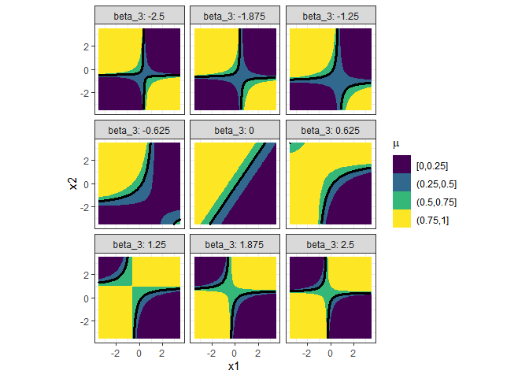<!-- -->

What’s going on here? Let’s first look at the linear predictor with
respect to 
colored based on . We’ll focus on a single value for the interaction parameter,
.
**What’s happening to the slope of the linear predictor with respect to
 as
 changes within
each subplot?**

``` r
interact_fine_grid %>% 
  filter(beta_3 == -1.25) %>% 
  ggplot(mapping = aes(x = x1, y = eta)) +
  geom_line(mapping = aes(group = interaction(x2, beta_3),
                          color = x2)) +
  facet_wrap(~beta_3, labeller = "label_both") +
  scale_color_viridis_c(option = "inferno") +
  labs(y = expression(eta)) +
  theme_bw()
```

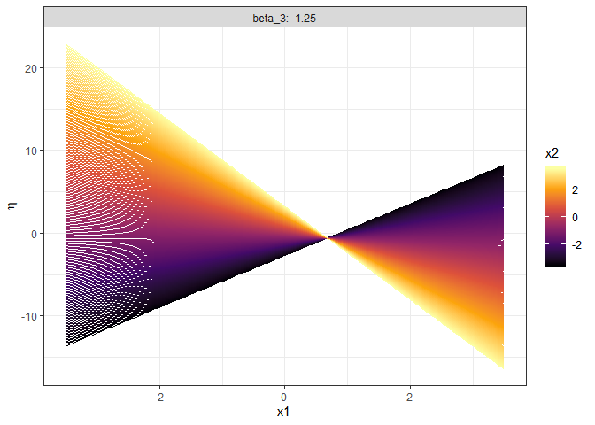<!-- -->

The interaction term is causing the slope associated with
 to **depend** on
. To see that is
indeed the case, let’s rewrite the linear predictor relationship.

  
 x_{n,1} + \\beta_2 x_{n,2}
")  

The term ") is a modified slope
acting on the first input,
.

#### Quadratic terms

We can also include polynomial orders just as we did with the linear
model. In fact, we could use any **basis** function that we could use
with the linear model in the **generalized** linear model. If we use
quadratic terms, our probability model becomes:

  
 \\\\ \\mu_n = \\mathrm{logit}^{-1}\\left(\\eta_n \\right) \\\\ \\eta_n = \\beta_0 + \\beta_1 x_{n,1} + \\beta_2 x_{n,2} + \\beta_3 x_{n,1} x_{n,2} + \\beta_4 x_{n,1}^2 + \\beta_5 x_{n,2}^2
")  

In the code chunk below, a new function is defined which allows us to
build off the initial
example.

``` r
bernoulli_prob_quad <- function(beta_3, beta_4, beta_5, inputs_df, beta_vec)
{
  tibble::tibble(
  x1 = inputs_df$x1,
  x2 = inputs_df$x2
) %>% 
  mutate(eta = beta_vec[1] + beta_vec[2]*x1 + beta_vec[3]*x2 + beta_3 * x1 * x2 +
           beta_4 * x1^2 + beta_5 * x2^2,
         mu = boot::inv.logit(eta),
         beta_3 = beta_3,
         beta_4 = beta_4, 
         beta_5 = beta_5)
}
```

Let’s try out 3 specific values for the quadratic parameters. The code
chunk below defines a grid between
,

and , each with values of `-1:1`.

``` r
beta_extra_terms <- expand.grid(beta_3 = -1:1,
                                beta_4 = -1:1,
                                beta_5 = -1:1,
                                KEEP.OUT.ATTRS = FALSE,
                                stringsAsFactors = FALSE) %>% 
  as.data.frame() %>% tbl_df()

quad_fine_grid <- purrr::pmap_dfr(list(beta_extra_terms$beta_3,
                                       beta_extra_terms$beta_4,
                                       beta_extra_terms$beta_5),
                                  bernoulli_prob_quad,
                                  inputs_df = expand.grid(x1 = seq(-3.5, 3.5, length.out = 225),
                                                          x2 = seq(-3.5, 3.5, length.out = 225),
                                                          KEEP.OUT.ATTRS = FALSE,
                                                          stringsAsFactors = FALSE),
                                  beta_vec = beta_true_2_inputs)
```

Let’s first visualize the event probability surface when , at each of the combinations of the quadratic
parameters.

``` r
quad_fine_grid %>% 
  mutate(beta_5 = forcats::fct_rev(as.factor(beta_5))) %>% 
  filter(beta_3 == 0) %>% 
  ggplot(mapping = aes(x = x1, y = x2)) +
  geom_raster(mapping = aes(fill = cut(mu,
                                       breaks = seq(0, 1, by = 0.25),
                                       include.lowest = TRUE))) +
  stat_contour(mapping = aes(z = mu),
               breaks = 0.5,
               size = 1.25,
               color = "black") +
  coord_fixed(ratio = 1) +
  facet_grid(beta_5 ~ beta_4, labeller = "label_both") +
  scale_fill_viridis_d(expression(mu)) +
  theme_bw()
```

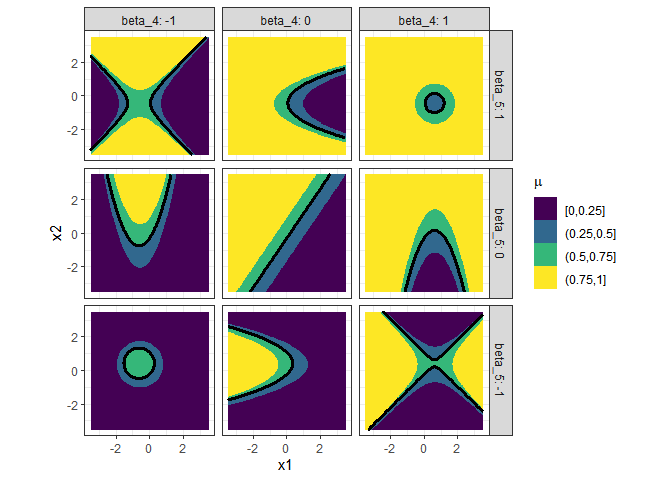<!-- -->

And now when .

``` r
quad_fine_grid %>% 
  mutate(beta_5 = forcats::fct_rev(as.factor(beta_5))) %>% 
  filter(beta_3 == -1) %>% 
  ggplot(mapping = aes(x = x1, y = x2)) +
  geom_raster(mapping = aes(fill = cut(mu,
                                       breaks = seq(0, 1, by = 0.25),
                                       include.lowest = TRUE))) +
  stat_contour(mapping = aes(z = mu),
               breaks = 0.5,
               size = 1.25,
               color = "black") +
  coord_fixed(ratio = 1) +
  facet_grid(beta_5 ~ beta_4, labeller = "label_both") +
  scale_fill_viridis_d(expression(mu)) +
  theme_bw()
```

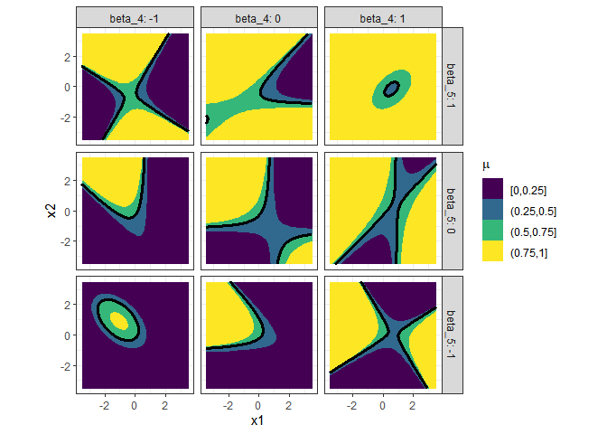<!-- -->

And finally for the case of the positive interaction parameter,
.

``` r
quad_fine_grid %>% 
  mutate(beta_5 = forcats::fct_rev(as.factor(beta_5))) %>% 
  filter(beta_3 == 1) %>% 
  ggplot(mapping = aes(x = x1, y = x2)) +
  geom_raster(mapping = aes(fill = cut(mu,
                                       breaks = seq(0, 1, by = 0.25),
                                       include.lowest = TRUE))) +
  stat_contour(mapping = aes(z = mu),
               breaks = 0.5,
               size = 1.25,
               color = "black") +
  coord_fixed(ratio = 1) +
  facet_grid(beta_5 ~ beta_4, labeller = "label_both") +
  scale_fill_viridis_d(expression(mu)) +
  theme_bw()
```

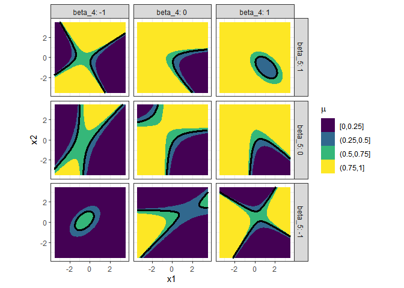<!-- -->

## Decisions

Whether we learn a simple model with a single input or a model with many
inputs involving complicated basis functions, our logistic regression
model predicts the event probability. How can we make a **decision**
based on that predicted probability? We are therefore **classifying**
the outcome as either the event,
, or the
non-event, .

The decision problem is based on comparing a predicted probability with
a threshold value. The typical threshold is . **Can you think why that is the case?** What does it mean
if the predicted probability is 60%? The model feels that the event will
occur on average 60% of the time. The  value is referred to as the **decision boundary** because
it separates the predicted classes from each other.

Let’s visualize the decision boundary and predicted classes for the
quadratic model when . In the figure below, the decision boundary is the white
curve separating the red and blue regions. Red denotes the event, while
blue represents the non-event.

``` r
quad_fine_grid %>% 
  mutate(beta_5 = forcats::fct_rev(as.factor(beta_5))) %>% 
  mutate(outcome = ifelse(mu > 0.5, "event", "non-event")) %>% 
  filter(beta_3 == 0) %>% 
  ggplot(mapping = aes(x = x1, y = x2)) +
  geom_raster(mapping = aes(fill = outcome)) +
  stat_contour(mapping = aes(z = mu),
               breaks = 0.5,
               size = 1.25,
               color = "white") +
  coord_fixed(ratio = 1) +
  facet_grid(beta_5 ~ beta_4, labeller = "label_both") +
  scale_fill_brewer(palette = "Set1") +
  theme_bw()
```

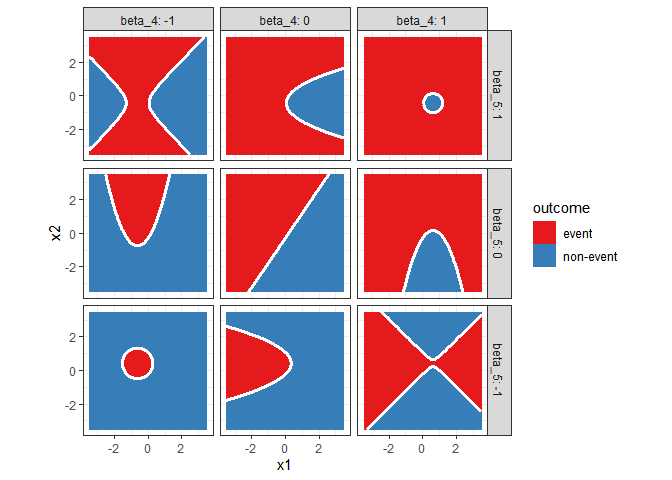<!-- -->

## Classification performance metrics

The observed responses to the logistic regression model are either 1s or
0s, events or non-events. By making a decision, we “converted” our
predicted probability into a predicted class. Therefore, it is natural
to compare our predicted **classifications** relative to the observed
outcomes.

The simplest metric to consider is **accuracy**, the number of correctly
predicted outcomes divided by the total number of observations. Although
useful, accuracy does not consider the **type** of error when the
prediction is incorrect. With a binary outcome, there are **4**
combinations of predicted class and observed class. The 4 combinations
can be visualized with a **confusion matrix**.

A basic confusion matrix is shown below, with the predicted outcome on
the vertical axis and the observed or reference outcome on the
horizontal axis. The combinations are labeled with phrases that describe
the type of prediction and whether that prediction was correct or not.
**TRUE-POSITIVE**, ,
is a correctly predicted event, while **TRUE-NEGATIVE**,
, is a correctly
predicted non-event. The correct predictions are along the main diagonal
of the confusion matrix. Errors or mis-classifications, however, are
along the off-diagonal. A **FALSE-POSITIVE**,
, was predicted to be
the event but is actually a non-event. A **FALSE-NEGATIVE**,
, is the opposite
error, the model predicted a non-event, but the event was in fact
observed. When using confusion matrices to assess model performance, the
number of samples associated with each combination (or the fraction of
total samples) will be displayed in the cells of the confusion matrix,
rather than the phrases as shown below.

``` r
expand.grid(predicted_class = c("event", "non-event"),
            observed_class = c("event", "non-event"),
            KEEP.OUT.ATTRS = FALSE,
            stringsAsFactors = FALSE) %>% 
  mutate(accurate_pred = ifelse(predicted_class == observed_class,
                                "TRUE",
                                "FALSE"),
         predicted_type = ifelse(predicted_class == "event",
                                 "POSITIVE", 
                                 "NEGATIVE")) %>% 
  tidyr::unite(confusion_cell,
               c("accurate_pred", "predicted_type"),
               sep = "-") %>% 
  mutate(predicted_class = forcats::fct_rev(as.factor(predicted_class))) %>% 
  ggplot(mapping = aes(x = observed_class, y = predicted_class)) +
  geom_tile(color = "black", fill = NA) +
  geom_text(mapping = aes(label = confusion_cell)) +
  theme(panel.grid = element_blank())
```

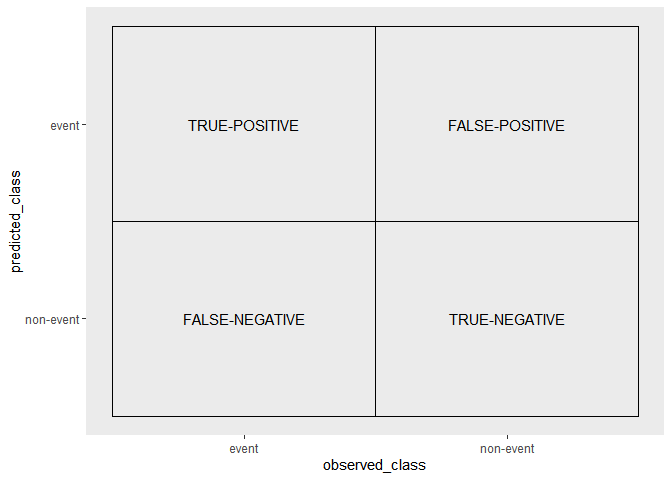<!-- -->

The overall model accuracy is just the sum of the samples along the main
diagonal divided by the sum of all cells in the confusion matrix. Using
the short hand notation for the names of the four combinations, the
accuracy is:

  
  

Hopefully you can see that not all errors are considered the same. The
specific problem or application under consideration will dictate which
**type** of error is worse. Different performance metrics exist for
evaluating and comparing trade-offs between the different type of
errors.

The **sensitivity** or **true positive rate** is the rate that the event
is correctly predicted out of all observed events. The sensitivity can
be written as:

  
  

On the other hand, the **specificity** is the fraction of corretly
predicted non-events out of all observed non-events.

  
  

The **False Positive Rate** (FPR) is one minus the specificity.

The sensitivity and specificity trade-off each other. For example, if we
change our decision threshold from 0.5 to 0.4 we will predict the event
more often. We will thus decrease the number of false negatives, which
improves . However, we will increase the number of false positives,
which decreases the
. Thus, changing the threshold which defines the decision
boundary will favor one of the two metrics. The Receiver Operating
Characteristic (ROC) curve is to visualize these trends Understanding
those trade-offs leads to the Receiver Operating Characteristic (ROC)
curve.

## Two input demo

Let’s calculate these performance metrics using the two input demo we
introduced earlier. Rememeber that dataset consisted of 250. The model
is an additive linear relationship between
 and
. We will use the
first 75 observations to fit our model.

``` r
two_train_df <- two_demo_df %>% 
  slice(1:75)
```

We need to create the design matrix, which will now include a column for
each input.

``` r
X2mat <- model.matrix( ~ x1 + x2, two_train_df)

X2mat %>% head()
```

    ##   (Intercept)        x1         x2
    ## 1           1 0.9022397 -0.6282464
    ## 2           1 0.5135305  0.3344607
    ## 3           1 0.4599287 -0.3601934
    ## 4           1 1.1218179  0.6785305
    ## 5           1 0.2058565 -2.3277440
    ## 6           1 1.3068918  0.2802122

We will use the same prior specification as before, which has a prior
standard deviation of 2 for the linear predictor parameters.

``` r
info_two <- list(
  design_matrix = X2mat,
  yobs = two_train_df$y,
  mu_beta = 0,
  tau_beta = 2
)
```

And now execute the Laplace Approximation.

``` r
fit_two <- my_laplace(rep(0, ncol(X2mat)), logistic_logpost, info_two)

fit_two
```

    ## $mode
    ## [1] -0.07608561 -1.32120246  1.18815852
    ## 
    ## $var_matrix
    ##             [,1]        [,2]        [,3]
    ## [1,]  0.09158384 -0.02425422 -0.01203356
    ## [2,] -0.02425422  0.16400399 -0.03076197
    ## [3,] -0.01203356 -0.03076197  0.11023907
    ## 
    ## $log_evidence
    ## [1] -39.95845
    ## 
    ## $converge
    ## [1] "YES"
    ## 
    ## $iter_counts
    ## function 
    ##       29

With the model fit, let’s first evaluate the confusion matrix on the
training set. As a reference point, let’s see the fraction of the
training samples that contained the event:

``` r
mean(two_train_df$y == 1)
```

    ## [1] 0.4666667

We are pretty close a **balanced** dataset. Nearly 0 of the training
samples were associated with the event, Conversely, nearly 1 contained
the non-event. With just two classes (a binary outcome) and a
**balanced** dataset, our baseline performance or **no-information
rate** is 0.5. We do not need a *predictive* model to randomly guess 50%
of the samples will contain the event. This becomes a useful
**benchmark** for assessing our model’s accuracy, we want our model to
be better than just random guesses. **How would this benchmark change if
we did not have a balanced dataset?**

We will now make posterior predictions of the training points using the
functions we previously defined. Let’s use 10,000 posterior samples as
we did in the 1D demo.

``` r
set.seed(12007)

pred_two_demo_train <- predict_from_laplace(fit_two, X2mat, 1e4)
```

As a check, since we in fact know the *true* event probability at each
training point for this toy example, let’s compare the posterior
prediction summaries on
 with the
known *true* event probability. A dashed horizontal grey line denotes
the 50% probability level. The *true* event probabilities are denoted by
red markers. An open circle corresponds to a non-event, while a solid
triangle denotes the event was observed. **How can the observed outcome
be a non-event if the true probability,
, is above
0.5?**

``` r
pred_two_demo_train %>% 
  tidyr::gather(key = "output_name", value = "value",
                -post_id, -pred_id) %>% 
  group_by(pred_id, output_name) %>% 
  summarise(avg_val = mean(value),
            q05_val = quantile(value, 0.05),
            q25_val = quantile(value, 0.25),
            med_val = median(value),
            q75_val = quantile(value, 0.75),
            q95_val = quantile(value, 0.95)) %>% 
  ungroup() %>% 
  left_join(two_train_df %>% 
              tibble::rowid_to_column("pred_id") %>% 
              tidyr::gather(key = "output_name", value = "true_value",
                            -x1, -x2, -pred_id, -y),
            by = c("pred_id", "output_name")) %>% 
  filter(output_name == "mu") %>% 
  ggplot(mapping = aes(x = pred_id)) +
  geom_hline(yintercept = 0.5, linetype = "dashed", color = "grey30",
             size = 1.25) +
  geom_linerange(mapping = aes(ymin = q05_val,
                               ymax = q95_val,
                               group = interaction(output_name, pred_id)),
                 color = "black") +
  geom_linerange(mapping = aes(ymin = q25_val,
                               ymax = q75_val,
                               group = interaction(output_name, pred_id)),
                 color = "steelblue", size = 1.25) +
  geom_point(mapping = aes(y = avg_val),
             fill = "white", color = "navyblue", size = 2.5,
             shape = 21) +
  geom_point(mapping = aes(y = med_val),
             color = "black", shape = 3, size = 2.5) +
  geom_point(mapping = aes(y = true_value,
                           shape = as.factor(y)),
             color = "red", size = 1.5) +
  scale_shape_manual("y",
                     values = c("1" = 17,
                                "0" = 1)) +
  labs(y = expression(mu)) +
  theme_bw()
```

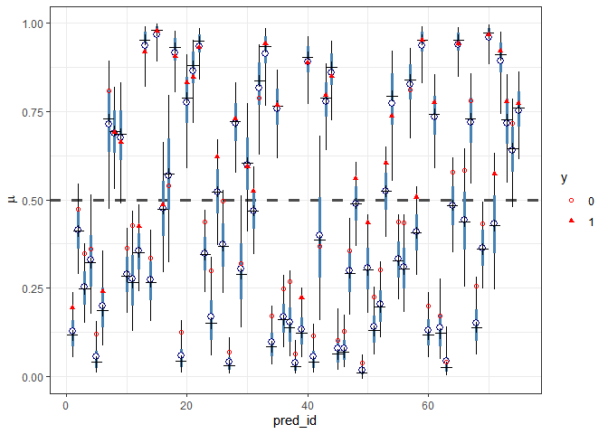<!-- -->

We have been discussing evaluating our model with a confusion matrix.
However, as the figure above shows, we have a *distribution* of event
probabilities at each training point. **Which probability should we use
in our decision rule? How should we decide what the predicted class
is?**

When we calculated regression performance metrics for the standard
linear model, we used the posterior prediction samples to calculate the
samples of the performance metrics. We summarized the posterior
performance metric **distributions** to understand the expected
performance and the uncertainty in the performance. **We will do the
same thing here.** For each posterior sample
, we will:

  - Decide the predicted class at each point,
    , based on if
     is above a threshold value, such as 0.5.  
  - Calculate the number of samples associated with each combination of
    the confusion matrix.  
  - Calculate the
    ,
     and
    .

Since we will have  posterior predictions of
 for all
 training points, we will have
 decision samples the
 points. We therefore
will have  confusion
matrices\! **Why is that useful?** We can use the
 samples to estimate the
**uncertainty** associated with each performance metric\!

Let’s define a function which executes these calculations for us. The
function `post_confusion_matrix()` has four input arguments. The first,
`threshold`, is the probability threshold to decide the predicted class.
The second, `post_preds`, is the long-format posterior predictions, and
the third, `target_info`, is a data.frame of the target or reference
outcomes. The fourth argument, `confuse_settings`, contains useful
information about
names.

``` r
calc_post_confusion_matrix <- function(threshold, post_preds, target_info, confuse_settings)
{
  post_preds %>% 
  left_join(target_info,
            by = "pred_id") %>% 
  mutate(pred_class = ifelse(mu > threshold,
                             confuse_settings$event_name,
                             confuse_settings$nonevent_name)) %>% 
  right_join(confuse_settings$combo_info, 
             by = c("pred_class", "observe_class")) %>% 
  count(post_id, confusion_cell) %>% 
  select(post_id, confusion_cell, n) %>% 
  tidyr::spread(confusion_cell, n) %>% 
  mutate(accuracy = (TRUE_POSITIVE + TRUE_NEGATIVE) /
             (TRUE_POSITIVE + TRUE_NEGATIVE + FALSE_POSITIVE + FALSE_NEGATIVE),
           sensitivity = TRUE_POSITIVE / (TRUE_POSITIVE + FALSE_NEGATIVE),
           specificity = TRUE_NEGATIVE / (TRUE_NEGATIVE + FALSE_POSITIVE))
}
```

We need to create some data objects before applying our function. The
code chunk below sets up those objects.

``` r
### get the training set outcomes in the right format
train_outcomes <- two_train_df %>% 
  mutate(observe_class = ifelse(y == 1, 
                                "event",
                                "non-event")) %>% 
  tibble::rowid_to_column("pred_id") %>% 
  select(pred_id, observe_class)

### setup the confusion matrix naming convention
confusion_info <- list(
  event_name = "event",
  nonevent_name = "non-event"
)

### associated the confusion matrix cell (combination) names correctly
confusion_combo_names <- expand.grid(pred_class = c("event", "non-event"),
            observe_class = c("event", "non-event"),
            KEEP.OUT.ATTRS = FALSE,
            stringsAsFactors = FALSE) %>% 
  mutate(accurate_pred = ifelse(pred_class == observe_class,
                                "TRUE",
                                "FALSE"),
         predicted_type = ifelse(pred_class == "event",
                                 "POSITIVE", 
                                 "NEGATIVE")) %>% 
  tidyr::unite(confusion_cell,
               c("accurate_pred", "predicted_type"),
               sep = "_")

confusion_info$combo_info <- confusion_combo_names
```

We can now calculate the confusion matrix for all posterior samples,
with a threshold value of
0.5.

``` r
post_confusion_mat_two_train <- calc_post_confusion_matrix(0.5, pred_two_demo_train, train_outcomes, confusion_info)
```

Let’s check the results for a few posterior samples.

``` r
post_confusion_mat_two_train %>% 
  filter(post_id == 1)
```

    ## # A tibble: 1 x 8
    ##   post_id FALSE_NEGATIVE FALSE_POSITIVE TRUE_NEGATIVE TRUE_POSITIVE
    ##     <int>          <int>          <int>         <int>         <int>
    ## 1       1              5             10            30            30
    ## # ... with 3 more variables: accuracy <dbl>, sensitivity <dbl>,
    ## #   specificity <dbl>

``` r
post_confusion_mat_two_train %>% 
  filter(post_id == 3)
```

    ## # A tibble: 1 x 8
    ##   post_id FALSE_NEGATIVE FALSE_POSITIVE TRUE_NEGATIVE TRUE_POSITIVE
    ##     <int>          <int>          <int>         <int>         <int>
    ## 1       3             10              5            35            25
    ## # ... with 3 more variables: accuracy <dbl>, sensitivity <dbl>,
    ## #   specificity <dbl>

``` r
post_confusion_mat_two_train %>% 
  filter(post_id == 5)
```

    ## # A tibble: 1 x 8
    ##   post_id FALSE_NEGATIVE FALSE_POSITIVE TRUE_NEGATIVE TRUE_POSITIVE
    ##     <int>          <int>          <int>         <int>         <int>
    ## 1       5              6              8            32            29
    ## # ... with 3 more variables: accuracy <dbl>, sensitivity <dbl>,
    ## #   specificity <dbl>

We can now summarize the posterior samples on each
metric.

``` r
post_confusion_matrix_two_train_summary <- post_confusion_mat_two_train %>% 
  tidyr::gather(key = "metric_name", value = "value", -post_id) %>% 
  group_by(metric_name) %>% 
  summarise(num_post = n(),
            avg_val = mean(value, na.rm = TRUE),
            q05_val = quantile(value, 0.05, na.rm = TRUE),
            q25_val = quantile(value, 0.25, na.rm = TRUE),
            med_val = median(value, na.rm = TRUE),
            q75_val = quantile(value, 0.75, na.rm = TRUE),
            q95_val = quantile(value, 0.95, na.rm = TRUE)) %>% 
  ungroup()
```

Display the results in a table:

``` r
post_confusion_matrix_two_train_summary %>% 
  select(-num_post) %>% 
  mutate_at(2:7, function(x){signif(x, 4)}) %>% 
  knitr::kable()
```

| metric\_name    | avg\_val | q05\_val | q25\_val | med\_val | q75\_val | q95\_val |
| :-------------- | -------: | -------: | -------: | -------: | -------: | -------: |
| accuracy        |   0.7799 |   0.7467 |   0.7600 |   0.7867 |     0.80 |   0.8133 |
| FALSE\_NEGATIVE |   9.4850 |   5.0000 |   7.0000 |  10.0000 |    12.00 |  13.0000 |
| FALSE\_POSITIVE |   7.0230 |   5.0000 |   6.0000 |   7.0000 |     8.00 |  11.0000 |
| sensitivity     |   0.7290 |   0.6286 |   0.6571 |   0.7143 |     0.80 |   0.8571 |
| specificity     |   0.8244 |   0.7250 |   0.8000 |   0.8250 |     0.85 |   0.8750 |
| TRUE\_NEGATIVE  |  32.9800 |  29.0000 |  32.0000 |  33.0000 |    34.00 |  35.0000 |
| TRUE\_POSITIVE  |  25.5100 |  22.0000 |  23.0000 |  25.0000 |    28.00 |  30.0000 |

We can also print the the summary statistics on the confusion table. The
figure below writes the 25th, median, and 75th quantile values
associated with the confusion matrix cells.

``` r
confusion_info$combo_info
```

    ##   pred_class observe_class confusion_cell
    ## 1      event         event  TRUE_POSITIVE
    ## 2  non-event         event FALSE_NEGATIVE
    ## 3      event     non-event FALSE_POSITIVE
    ## 4  non-event     non-event  TRUE_NEGATIVE

``` r
post_confusion_matrix_two_train_summary %>% 
  inner_join(confusion_info$combo_info,
             by = c("metric_name" = "confusion_cell")) %>% 
  mutate(cell_display = sprintf("%2d, %2d, %2d", q25_val, med_val, q75_val)) %>% 
  mutate(pred_class = forcats::fct_rev(as.factor(pred_class))) %>% 
  ggplot(mapping = aes(x = observe_class, y = pred_class)) +
  geom_tile(fill = NA, color = "black") +
  geom_text(mapping = aes(label = cell_display)) +
  theme(panel.grid = element_blank())
```

<!-- -->

And now let’s visualize the performance metrics with their uncertainty.

``` r
post_confusion_matrix_two_train_summary %>% 
  filter(metric_name %in% c("accuracy", 
                            "sensitivity",
                            "specificity")) %>% 
  ggplot(mapping = aes(x = metric_name)) +
  geom_linerange(mapping = aes(ymin = q05_val,
                               ymax = q95_val,
                               group = metric_name),
                 color = "black") +
  geom_linerange(mapping = aes(ymin = q25_val,
                               ymax = q75_val,
                               group = metric_name),
                 color = "steelblue", size = 2) +
  geom_point(mapping = aes(y = avg_val),
             shape = 21, fill = "white", 
             color = "navyblue", size = 3.5) +
  geom_point(mapping = aes(y = med_val),
             shape = 3, size = 3.5) +
  labs(y = "metric value") +
  theme_bw()
```

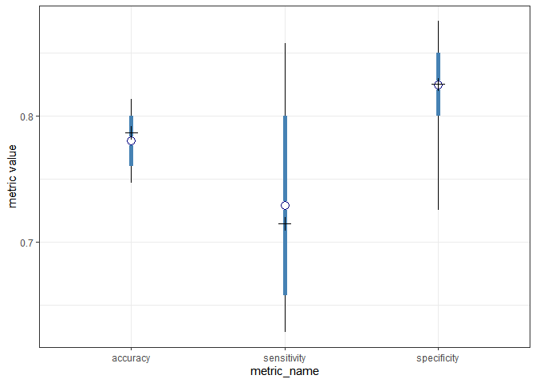<!-- -->

To calculate the ROC curve, we need to recalculate the confusion matrix
at different threshold levels. The code chunk below defines a function
which wraps the confusion matrix calculation and summarization steps
into a single function, `calc_post_roc_summary()`. The arguments are
consistent with the the `calc_post_confusion_matrix()`
function.

``` r
calc_post_roc_summary <- function(threshold, post_preds, target_info, confuse_settings)
{
  calc_post_confusion_matrix(threshold, post_preds, target_info, confuse_settings) %>% 
    tidyr::gather(key = "metric_name", value = "value", -post_id) %>% 
    group_by(metric_name) %>% 
    summarise(num_post = n(),
              avg_val = mean(value, na.rm = TRUE),
              q05_val = quantile(value, 0.05, na.rm = TRUE),
              q25_val = quantile(value, 0.25, na.rm = TRUE),
              med_val = median(value, na.rm = TRUE),
              q75_val = quantile(value, 0.75, na.rm = TRUE),
              q95_val = quantile(value, 0.95, na.rm = TRUE)) %>% 
    ungroup() %>% 
    filter(metric_name %in% c("sensitivity", "specificity")) %>% 
    mutate(threshold = threshold)
}
```

The code chunk below then calculates the ROC curve for our demonstration
problem by looping over threshold values from near 0 to near 1.

``` r
post_roc_two_train_summary <- purrr::map_dfr(seq(0.0, 1.0, by = 0.025),
                                             calc_post_roc_summary,
                                             post_preds = pred_two_demo_train,
                                             target_info = train_outcomes,
                                             confuse_settings = confusion_info)
```

To help with the visualization, the data are reshaped into a very tall
format.

``` r
post_roc_two_train_summary_lf <- post_roc_two_train_summary %>% 
  select(-num_post) %>% 
  tidyr::gather(key = "stat_name", value = "stat_value", 
                -threshold, -metric_name) %>% 
  tidyr::separate(stat_name,
                  c("summary_stat", "val_word"),
                  sep = "_") %>% 
  select(threshold, metric_name, summary_stat, stat_value) %>% 
  tidyr::spread(metric_name, stat_value)
```

And now let’s visualize the ROC curve, by plotting the **trajectory** of
the sensitivity (the true positive rate) compared with the false
positive rate. In the figure below, we focus on the trajectories
associated with the 25th and 75th quantiles around the median. A
45-degree diagonal reference line is also included as a reference.

``` r
post_roc_two_train_summary_lf %>% 
  filter(summary_stat %in% c("q25", "med", "q75")) %>% 
  mutate(summary_stat = factor(summary_stat, levels = c("q25", "med", "q75"))) %>% 
  ggplot(mapping = aes(x = 1 - specificity,
                       y = sensitivity)) +
  geom_abline(slope = 1, intercept = 0, 
              color = "grey30", linetype = "dashed") +
  geom_line(mapping = aes(group = summary_stat,
                          color = summary_stat),
            size = 1.15) +
  ggthemes::scale_color_colorblind() +
  theme_bw() +
  theme(legend.position = "top") +
  guides(color = guide_legend(nrow = 1))
```

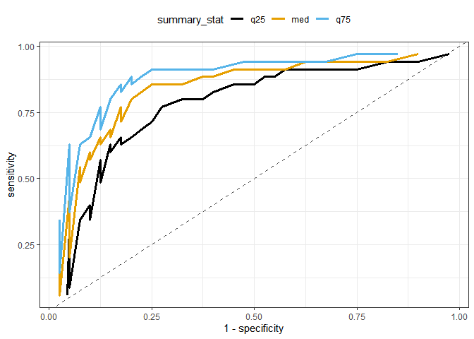<!-- -->

The ROC curve is a **trade-off** curve between the true positive rate
and false positive rate. To help make it more clear that the threshold
value is in fact changing, let’s focus just on the median ROC curve and
color the curve based on the threshold. As shown below, the sensitivity
increases rapidly as the threshold value decreases from 1 to 0.75.
However, once the threshold is less than 0.25, the sensitivity’s
increase is much more gradual. The specificity decreases (thus
increasing the false positive rate) quickly as the threshold continues
decreasing to zero.

``` r
post_roc_two_train_summary_lf %>% 
  filter(summary_stat %in% c("med")) %>% 
  mutate(summary_stat = factor(summary_stat, levels = c("q25", "med", "q75"))) %>% 
  ggplot(mapping = aes(x = 1 - specificity,
                       y = sensitivity)) +
  geom_abline(slope = 1, intercept = 0, 
              color = "grey30", linetype = "dashed") +
  geom_line(mapping = aes(group = summary_stat,
                          color = cut(threshold,
                                      breaks = seq(0, 1, by = 0.25),
                                      include.lowest = TRUE)),
            size = 1.25) +
  scale_color_viridis_d("threshold") +
  theme_bw() +
  theme(legend.position = "top") +
  guides(color = guide_legend(nrow = 1))
```

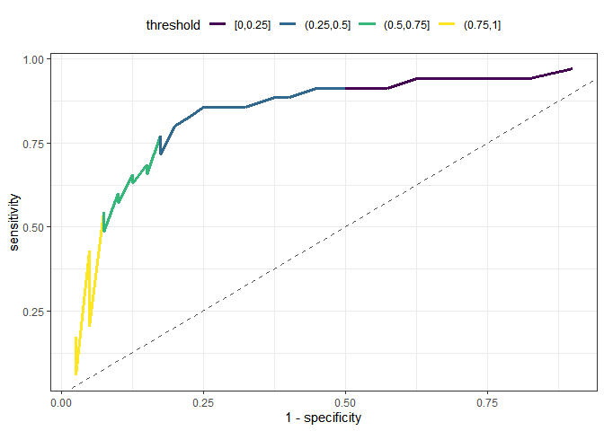<!-- -->

The ideal model would have a ROC curve that appears as a step. The
sensitivity would spike from 0 to 1 at a constant value of zero for the
false positive rate. Then, the sensitivity would remain constant at 1 as
the false positive rate increases from 0 to 1. Based on this ideal
behavior, we can summarize the entire ROC curve by integrating it. The
area under the ROC curve, or AUC, would be 1 for the ideal model. As a
reference point, the AUC for a completely ineffective model following
the 45-degree line would be 0.5.

## Calibration curves

With our synthetic data example, we were able to compare the predicted
event probability with the known *true* event probability. We previously
visualized the comparison with respect to an index, but we could also
relate the prediction to the observed in a predicted vs observed style
figure.

``` r
pred_two_demo_train %>% 
  tidyr::gather(key = "output_name", value = "value",
                -post_id, -pred_id) %>% 
  group_by(pred_id, output_name) %>% 
  summarise(avg_val = mean(value),
            q05_val = quantile(value, 0.05),
            q25_val = quantile(value, 0.25),
            med_val = median(value),
            q75_val = quantile(value, 0.75),
            q95_val = quantile(value, 0.95)) %>% 
  ungroup() %>% 
  left_join(two_train_df %>% 
              tibble::rowid_to_column("pred_id") %>% 
              tidyr::gather(key = "output_name", value = "true_value",
                            -x1, -x2, -pred_id, -y),
            by = c("pred_id", "output_name")) %>% 
  filter(output_name == "mu") %>% 
  ggplot(mapping = aes(x = true_value)) +
  geom_abline(slope = 1, intercept = 0, 
              color = "red", linetype = "dashed") +
  geom_linerange(mapping = aes(ymin = q05_val,
                               ymax = q95_val,
                               group = interaction(output_name, pred_id)),
                 color = "black") +
  geom_linerange(mapping = aes(ymin = q25_val,
                               ymax = q75_val,
                               group = interaction(output_name, pred_id)),
                 color = "steelblue", size = 1.25) +
  geom_point(mapping = aes(y = avg_val),
             fill = "white", color = "navyblue", size = 2.5,
             shape = 21) +
  geom_point(mapping = aes(y = med_val),
             color = "black", shape = 3, size = 2.5) +
  scale_shape_manual("y",
                     values = c("1" = 17,
                                "0" = 1)) +
  labs(x = "true event probability",
       y = "predicted event probability") +
  theme_bw()
```

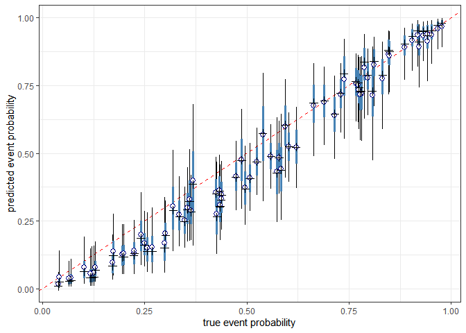<!-- -->

Unfortunately, we cannot create such a figure in a real problem.
**Why?**

A **calibration curve** is an attempt to estimate this style of figure.
We break up the range of the predicted probabilities into discrete bins.
Within each bin, we calculate the fraction of observed events out of the
total observations. We then compare that fraction to the bin center
point. For example, if we predict the event probability is to be between
0.35 and 0.45, we would hope that on average to observe the event
roughly 40% of the time within that bin. A **well calibrated model** is
therefore a model that has the empirical event fractions line up with
the binned predicted probabilities.

With our two input demo, we will base our calibration curve on the
predicted probability after accounting for the aleatory source of
uncertainty. The code chunk below generates random Bernoulli outcomes
for each posterior sample of the unknown parameters at all training
points.

``` r
set.seed(12009)

pred_two_demo_train_results <- pred_two_demo_train %>% 
  mutate(y = rbinom(n = n(), size = 1, prob = mu))
```

Let’s compare the predicted probability accounting for both sources of
uncertainty with the true probability.

``` r
pred_two_demo_train_results %>% 
  group_by(pred_id) %>% 
  summarise(num_post = n(),
            pred_prob = mean(y == 1)) %>% 
  left_join(two_train_df %>% 
              tibble::rowid_to_column("pred_id") %>% 
              select(pred_id, mu_true = mu),
            by = "pred_id") %>% 
  ggplot(mapping = aes(x = mu_true, y = pred_prob)) +
  geom_abline(slope = 1, intercept = 0, 
              color = "red", linetype = "dashed") +
  geom_point(size = 4) +
  labs(x = "true event probability",
       y = "predicted event probability") +
  theme_bw()
```

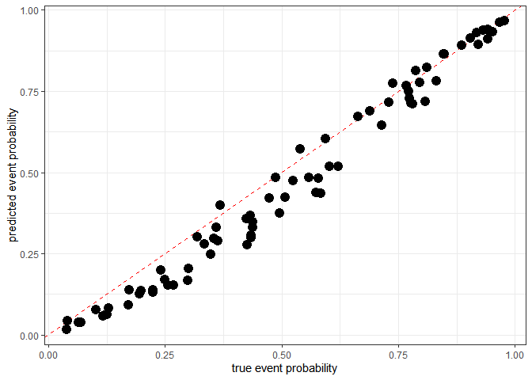<!-- -->

Let’s now break up the predicted probability into discrete intervals.
For example, let’s use intervals of 0.1.

``` r
pred_two_demo_train_bins <- pred_two_demo_train_results %>% 
  group_by(pred_id) %>% 
  summarise(num_post = n(),
            pred_prob = mean(y == 1)) %>% 
  left_join(two_train_df %>% 
              tibble::rowid_to_column("pred_id") %>% 
              select(pred_id, y),
            by = "pred_id") %>% 
  mutate(pred_bins = cut(pred_prob,
                         breaks = seq(0, 1, by = 0.1),
                         include.lowest = TRUE)) %>% 
  group_by(pred_bins) %>% 
  summarise(num_obs = n(),
            bin_avg = mean(pred_prob),
            obs_frac = mean(y == 1))
```

First, let’s check how many samples are within each of our discrete
bins. As shown below, a draw back of this approach is that some bins can
have relatively few observations.

``` r
pred_two_demo_train_bins %>% 
  ggplot(mapping = aes(x = bin_avg, y = num_obs)) +
  geom_bar(stat = "identity") +
  theme_bw()
```

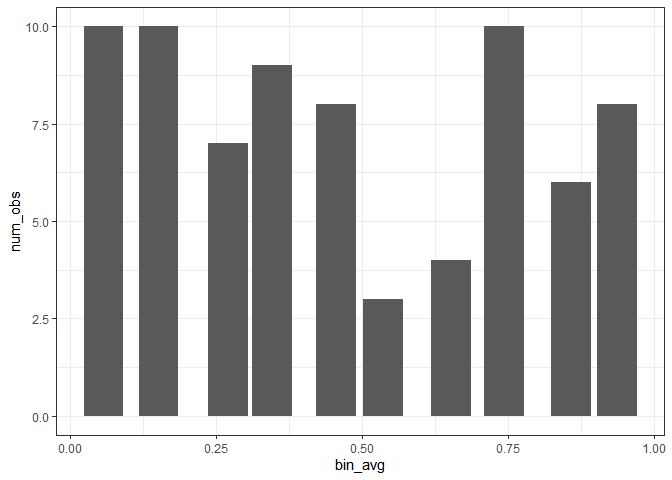<!-- -->

We could alleviate this issue by using fewer bins, but then we will not
have less resolution in the final calibration curve. For comparison, the
code chunk below uses bin widths of 0.2 instead of 0.1.

``` r
pred_two_demo_train_bins_b <- pred_two_demo_train_results %>% 
  group_by(pred_id) %>% 
  summarise(num_post = n(),
            pred_prob = mean(y == 1)) %>% 
  left_join(two_train_df %>% 
              tibble::rowid_to_column("pred_id") %>% 
              select(pred_id, y),
            by = "pred_id") %>% 
  mutate(pred_bins = cut(pred_prob,
                         breaks = seq(0, 1, by = 0.2),
                         include.lowest = TRUE)) %>% 
  group_by(pred_bins) %>% 
  summarise(num_obs = n(),
            bin_avg = mean(pred_prob),
            obs_frac = mean(y == 1))
```

The number of samples per bin are now:

``` r
pred_two_demo_train_bins_b %>% 
  ggplot(mapping = aes(x = bin_avg, y = num_obs)) +
  geom_bar(stat = "identity") +
  theme_bw()
```

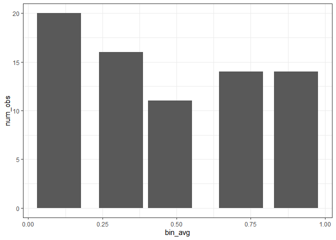<!-- -->

The calibration curves for the different number of bins are shown below.

``` r
pred_two_demo_train_bins %>% 
  mutate(bin_width = 0.1) %>% 
  bind_rows(pred_two_demo_train_bins_b %>% 
              mutate(bin_width = 0.2)) %>% 
  ggplot(mapping = aes(x = bin_avg, y = obs_frac)) +
  geom_abline(slope = 1, intercept = 0,
              color = "red", linetype = "dashed") +
  geom_line(mapping = aes(color = as.factor(bin_width),
                          group = bin_width),
            size = 1.15) +
  geom_point(mapping = aes(color = as.factor(bin_width),
                           shape = as.factor(bin_width)), 
             size = 3.5) +
  ggthemes::scale_color_colorblind("Bin width") +
  scale_shape_discrete("Bin width") +
  labs(x = "predicted probability bin average",
       y = "observed event fraction") +
  theme_bw() +
  theme(legend.position = "top")
```

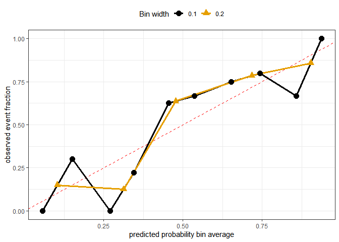<!-- -->

## Evidence

In addition to the previous metrics, we have another important metric to
consider, the **marginal likelihood**. As we discussed previously, the
marginal likelihood accounts for the model fit through the likelihood.
With standard linear models, that likelihood was a Gaussian. The
likelihood of the logistic regression model is not a Gaussian, it’s a
Binomial. Even though the distribution has changed, the likelihood can
still be calculated. The “fit” is now the probability of observing the
event or non-event based on the predicted probability, rather than the
sum of squared residuals of a continuous response.

Metrics such as accuracy, sensitivity, and specificity, can be overfit
to a training set. Thus, just as we discussed with the standard linear
model we need to consider some penalty term to guard against
overfitting. The marginal likelihood accounts for the model complexity.
With the Laplace approximation, we saw that complexity penalty is
related to the curvature of the log-posterior density. We can therefore
use the marginal likelihood to compare models in the same manner that we
did with regression\!

## Bayesian model selection

Let’s compare 6 model formulations with our two inputs demonstration
problem. We will compare an intercept only model, a model with just
input 1, a model with just input 2, a model with both inputs, a model
with an interaction term, and a quadratic model. We have already created
the model with both inputs, so let’s create the required design matrices
for the other models below.

``` r
X2_constant <- model.matrix( ~ 1, two_train_df)

X2_x1 <- model.matrix( ~ x1, two_train_df)

X2_x2 <- model.matrix( ~ x2, two_train_df)

X2_interact <- model.matrix( ~ x1 * x2, two_train_df)

X2_quad <- model.matrix( ~ x1 * x2 + I(x1^2) + I(x2^2), two_train_df)
```

The intercept-only and interaction based model design matrices are shown
below.

``` r
X2_constant %>% head()
```

    ##   (Intercept)
    ## 1           1
    ## 2           1
    ## 3           1
    ## 4           1
    ## 5           1
    ## 6           1

``` r
X2_interact %>% head()
```

    ##   (Intercept)        x1         x2      x1:x2
    ## 1           1 0.9022397 -0.6282464 -0.5668288
    ## 2           1 0.5135305  0.3344607  0.1717558
    ## 3           1 0.4599287 -0.3601934 -0.1656633
    ## 4           1 1.1218179  0.6785305  0.7611877
    ## 5           1 0.2058565 -2.3277440 -0.4791813
    ## 6           1 1.3068918  0.2802122  0.3662070

Let’s make a wrapper function which performs the model fitting for us.

``` r
manage_logistic_fit <- function(design_use, logpost_func, add_info)
{
  add_info$design_matrix <- design_use
  
  my_laplace(rep(0, ncol(design_use)), logpost_func, add_info)
}
```

We will use a more diffuse prior relative to the previous fit. This time
we will set the prior standard deviation on the linear predictor
parameters to be 5.

``` r
info_two_add <- list(
  yobs = two_train_df$y,
  mu_beta = 0,
  tau_beta = 5
)

fit_two_all <- purrr::map(list(X2_constant,
                               X2_x1, 
                               X2_x2, 
                               X2mat,
                               X2_interact,
                               X2_quad),
                          manage_logistic_fit,
                          logpost_func = logistic_logpost,
                          add_info = info_two_add)

purrr::map_chr(fit_two_all, "converge")
```

    ## [1] "YES" "YES" "YES" "YES" "YES" "YES"

Calculate the posterior model weights (probabilities). **Which model is
best?**

``` r
model_evidence <- purrr::map_dbl(fit_two_all, "log_evidence")

exp(model_evidence) / sum(exp(model_evidence))
```

    ## [1] 1.835805e-06 5.154508e-04 2.344445e-03 5.575054e-01 4.337428e-01
    ## [6] 5.890128e-03

Let’s visualize the posterior model weights with a bar chart.

``` r
tibble::tibble(
  model_name = c("intercept-only", "x1-only", "x2-only",
                 "linear additive",
                 "linear with interaction",
                 "quadratic"),
  model_weight = exp(model_evidence) / sum(exp(model_evidence))
) %>% 
  mutate(model_name = factor(model_name,
                             levels = c("intercept-only", "x1-only", "x2-only",
                                        "linear additive",
                                        "linear with interaction",
                                        "quadratic"))) %>% 
  ggplot(mapping = aes(x = model_name, y = model_weight)) +
  geom_bar(stat = "identity") +
  theme_bw()
```

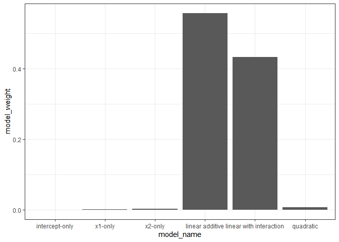<!-- -->

For this specific problem, we have a near split between the linear
additive and the linear with interaction models. The final conclusions
are not as definitive as they were in the standard linear model
examples. **Why do you think that is?**

### Train vs Test class performance

#### Training set

Let’s now compare the 4 of the models through posterior predictions.
Let’s first predict the training set.

``` r
set.seed(120111)

pred_demo_x1only_train <- predict_from_laplace(fit_two_all[[2]], X2_x1, 1e4)

pred_demo_x2only_train <- predict_from_laplace(fit_two_all[[3]], X2_x2, 1e4)

pred_demo_additive_train <- predict_from_laplace(fit_two_all[[4]], X2mat, 1e4)

pred_demo_interact_train <- predict_from_laplace(fit_two_all[[5]], X2_interact, 1e4)

pred_demo_quad_train <- predict_from_laplace(fit_two_all[[6]], X2_quad, 1e4)
```

Next, calculate the posterior confusion matrix, based on a threshold of
0.5, for each model.

``` r
post_cmat_demo_x1only_train <- calc_post_confusion_matrix(0.5,
                                                          pred_demo_x1only_train,
                                                          train_outcomes,
                                                          confusion_info)

post_cmat_demo_x2only_train <- calc_post_confusion_matrix(0.5,
                                                          pred_demo_x2only_train,
                                                          train_outcomes,
                                                          confusion_info)

post_cmat_demo_additive_train <- calc_post_confusion_matrix(0.5, 
                                                            pred_demo_additive_train, 
                                                            train_outcomes, 
                                                            confusion_info)

post_cmat_demo_interact_train <- calc_post_confusion_matrix(0.5, 
                                                            pred_demo_interact_train, 
                                                            train_outcomes, 
                                                            confusion_info)

post_cmat_demo_quad_train <- calc_post_confusion_matrix(0.5,
                                                        pred_demo_quad_train, 
                                                        train_outcomes,
                                                        confusion_info)
```

Let’s visualize the performance metrics posterior summaries and compare
the three models.

``` r
post_cmat_demo_train_summaries <- post_cmat_demo_x1only_train %>% 
  mutate(model_name = c("x1-only")) %>% 
  bind_rows(post_cmat_demo_x2only_train %>% 
              mutate(model_name = c("x2-only"))) %>% 
  bind_rows(post_cmat_demo_additive_train %>% 
              mutate(model_name = "linear additive")) %>% 
  bind_rows(post_cmat_demo_interact_train %>% 
              mutate(model_name = "linear with interaction")) %>% 
  bind_rows(post_cmat_demo_quad_train %>% 
              mutate(model_name = "quadratic")) %>% 
  tidyr::gather(key = "metric_name", value = "value", -post_id, -model_name) %>% 
  group_by(model_name, metric_name) %>% 
  summarise(num_post = n(),
            avg_val = mean(value, na.rm = TRUE),
            q05_val = quantile(value, 0.05, na.rm = TRUE),
            q25_val = quantile(value, 0.25, na.rm = TRUE),
            med_val = median(value, na.rm = TRUE),
            q75_val = quantile(value, 0.75, na.rm = TRUE),
            q95_val = quantile(value, 0.95, na.rm = TRUE)) %>% 
  ungroup()

post_cmat_demo_train_summaries %>% 
  filter(metric_name %in% c("accuracy", 
                            "sensitivity",
                            "specificity")) %>% 
  mutate(model_name = factor(model_name,
                             levels = c("x1-only", "x2-only",
                                        "linear additive",
                                        "linear with interaction",
                                        "quadratic"))) %>% 
  ggplot(mapping = aes(x = metric_name)) +
  geom_linerange(mapping = aes(ymin = q05_val,
                               ymax = q95_val,
                               group = interaction(metric_name,
                                                   model_name),
                               color = model_name),
                 color = "black",
                 position = position_dodge(0.25)) +
  geom_linerange(mapping = aes(ymin = q25_val,
                               ymax = q75_val,
                               group = interaction(metric_name,
                                                   model_name),
                               color = model_name), 
                 size = 2,
                 position = position_dodge(0.25)) +
  geom_point(mapping = aes(y = avg_val,
                           group = interaction(metric_name,
                                               model_name)),
             shape = 21, fill = "white", 
             color = "navyblue", size = 3.5,
             position = position_dodge(0.25)) +
  geom_point(mapping = aes(y = med_val,
                           group = interaction(metric_name,
                                               model_name)),
             shape = 3, size = 3.5,
             position = position_dodge(0.25)) +
  ggthemes::scale_color_colorblind("Model") +
  labs(y = "metric value") +
  theme_bw() +
  theme(legend.position = "top")
```

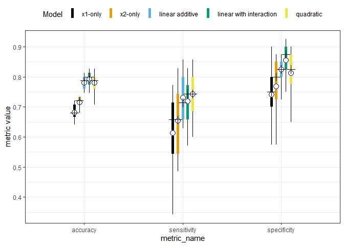<!-- -->

#### Hold-out test set

Let’s now repeat the predictions on the points not used to train the
models. The code chunk below defines the hold-out test dataset and then
creates the test design matrices for models.

``` r
two_holdout_df <- two_demo_df %>% 
  tibble::rowid_to_column("obs_id") %>% 
  filter(obs_id > 75) %>% 
  select(-obs_id)

X2_x1_test <- model.matrix( ~ x1, two_holdout_df)

X2_x2_test <- model.matrix( ~ x2, two_holdout_df)

X2_add_test <- model.matrix( ~ x1 + x2, two_holdout_df)

X2_interact_test <- model.matrix( ~ x1 * x2, two_holdout_df)

X2_quad_test <- model.matrix( ~ x1 * x2 + I(x1^2) + I(x2^2), two_holdout_df)
```

The code chunk below makes the posterior predictions with each model,
then calculates the posterior confusion matrices based on the
**hold-out** dataset.

``` r
### posterior predictions on the hold-out set
pred_demo_x1only_test <- predict_from_laplace(fit_two_all[[2]], X2_x1_test, 1e4)

pred_demo_x2only_test <- predict_from_laplace(fit_two_all[[3]], X2_x2_test, 1e4)

pred_demo_additive_test <- predict_from_laplace(fit_two_all[[4]], X2_add_test, 1e4)

pred_demo_interact_test <- predict_from_laplace(fit_two_all[[5]], X2_interact_test, 1e4)

pred_demo_quad_test <- predict_from_laplace(fit_two_all[[6]], X2_quad_test, 1e4)

### get the HOLD-OUT test set outcomes in the right format
test_outcomes <- two_holdout_df %>% 
  mutate(observe_class = ifelse(y == 1, 
                                "event",
                                "non-event")) %>% 
  tibble::rowid_to_column("pred_id") %>% 
  select(pred_id, observe_class)

### confusion matrices on the hold-out set
post_cmat_demo_x1only_test <- calc_post_confusion_matrix(0.5, 
                                                         pred_demo_x1only_test, 
                                                         test_outcomes, 
                                                         confusion_info)

post_cmat_demo_x2only_test <- calc_post_confusion_matrix(0.5, 
                                                         pred_demo_x2only_test, 
                                                         test_outcomes, 
                                                         confusion_info)

post_cmat_demo_additive_test <- calc_post_confusion_matrix(0.5, 
                                                            pred_demo_additive_test, 
                                                            test_outcomes, 
                                                            confusion_info)

post_cmat_demo_interact_test <- calc_post_confusion_matrix(0.5, 
                                                            pred_demo_interact_test, 
                                                            test_outcomes, 
                                                            confusion_info)

post_cmat_demo_quad_test <- calc_post_confusion_matrix(0.5,
                                                        pred_demo_quad_test, 
                                                        test_outcomes,
                                                        confusion_info)
```

Finally, let’s compare the models on the hold-out test set.

``` r
post_cmat_demo_test_summaries <- post_cmat_demo_additive_test %>% 
  mutate(model_name = "linear additive") %>% 
  bind_rows(post_cmat_demo_x1only_test %>% 
              mutate(model_name = "x1-only")) %>% 
  bind_rows(post_cmat_demo_x2only_test %>% 
              mutate(model_name = "x2-only")) %>% 
  bind_rows(post_cmat_demo_interact_test %>% 
              mutate(model_name = "linear with interaction")) %>% 
  bind_rows(post_cmat_demo_quad_test %>% 
              mutate(model_name = "quadratic")) %>% 
  tidyr::gather(key = "metric_name", value = "value", -post_id, -model_name) %>% 
  group_by(model_name, metric_name) %>% 
  summarise(num_post = n(),
            avg_val = mean(value, na.rm = TRUE),
            q05_val = quantile(value, 0.05, na.rm = TRUE),
            q25_val = quantile(value, 0.25, na.rm = TRUE),
            med_val = median(value, na.rm = TRUE),
            q75_val = quantile(value, 0.75, na.rm = TRUE),
            q95_val = quantile(value, 0.95, na.rm = TRUE)) %>% 
  ungroup()

post_cmat_demo_test_summaries %>% 
  filter(metric_name %in% c("accuracy", 
                            "sensitivity",
                            "specificity")) %>% 
  mutate(model_name = factor(model_name,
                             levels = c("x1-only", "x2-only",
                                        "linear additive",
                                        "linear with interaction",
                                        "quadratic"))) %>% 
  ggplot(mapping = aes(x = metric_name)) +
  geom_linerange(mapping = aes(ymin = q05_val,
                               ymax = q95_val,
                               group = interaction(metric_name,
                                                   model_name),
                               color = model_name),
                 color = "black",
                 position = position_dodge(0.25)) +
  geom_linerange(mapping = aes(ymin = q25_val,
                               ymax = q75_val,
                               group = interaction(metric_name,
                                                   model_name),
                               color = model_name), 
                 size = 2,
                 position = position_dodge(0.25)) +
  geom_point(mapping = aes(y = avg_val,
                           group = interaction(metric_name,
                                               model_name)),
             shape = 21, fill = "white", 
             color = "navyblue", size = 3.5,
             position = position_dodge(0.25)) +
  geom_point(mapping = aes(y = med_val,
                           group = interaction(metric_name,
                                               model_name)),
             shape = 3, size = 3.5,
             position = position_dodge(0.25)) +
  ggthemes::scale_color_colorblind("Model") +
  labs(y = "metric value") +
  theme_bw() +
  theme(legend.position = "top")
```

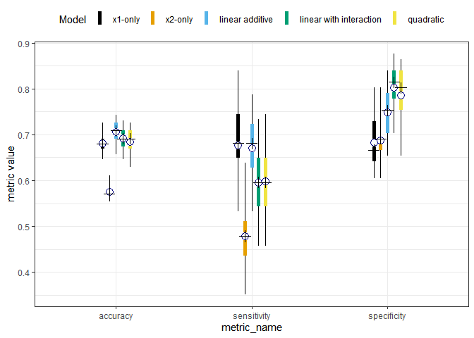<!-- -->
