INFSCI 2595: Lecture 12/14
================
Dr. Joseph P. Yurko
October 9, 2019

## Load packages

``` r
library(dplyr)
library(ggplot2)
```

## Posterior predictions

After fitting a logistic regression model, how do we make posterior
predictions? How did we make posterior predictions with the linear
model?

  - Create test design matrix,
    , at
     input
    “positions”.  
  - Generate  random
    posterior samples of the linear predictor parameters,
    .  
  - Evaluate the linear predictor for at the
     test input
    positions and all 
    posterior samples.

What’s the next thing to do for the logistic regression model?

  - Back-transform the linear predictor to the event probability.  
  - Generate random observations from the Binomial (Bernoulli)
    likelihood.

### Synthetic data

We will regenerate the same synthetic dataset from last lecture. After
fitting the model, we will make posterior predictions over a test grid.

Create the complete synthetic dataset based on the specified *true*
parameter values.

``` r
beta_0_true <- -0.25
beta_1_true <- 0.75

set.seed(9002)
x <- rnorm(n = 100)

demo_df <- tibble::tibble(
  x = x
) %>% 
  mutate(eta = beta_0_true + beta_1_true * x,
         mu = boot::inv.logit(eta),
         y = rbinom(n = n(), size = 1, prob = mu))
```

### Learning

Let’s specify the log-posterior function using matrix math notation
instead of the simple expression for the linear predictor. This will
allow us to scale to more predictors later on.

``` r
logistic_logpost <- function(unknown_params, my_info)
{
  # all unknown_params are linear predictor params!
  
  # calculate linear predictor
  X <- my_info$design_matrix
  
  eta <- as.vector(X %*% as.matrix(unknown_params))
  
  # calculate the event probability
  mu <- boot::inv.logit(eta)
  
  # evaluate the log-likelihood
  log_lik <- sum(dbinom(x = my_info$yobs,
                        size = 1,
                        prob = mu,
                        log = TRUE))
  
  # evaluate the log-prior
  log_prior <- sum(dnorm(x = unknown_params,
                         mean = my_info$mu_beta,
                         sd = my_info$tau_beta,
                         log = TRUE))
  
  # sum together
  log_lik + log_prior
}
```

Use the first 30 observations as the training set, instead of the first
10. Specify the prior distributions as normal with prior standard
deviations equal to 2. In the previous lecture, we passed we will use
the `model.matrix()`

``` r
train_df <- demo_df %>% 
  slice(1:30)

Xmat <- model.matrix( ~ x, train_df)

info_use <- list(
  design_matrix = Xmat,
  yobs = train_df$y,
  mu_beta = 0,
  tau_beta = 2
)
```

We will continue to use the same `my_laplace()` function.

``` r
my_laplace <- function(start_guess, logpost_func, ...)
{
  # code adapted from the `LearnBayes`` function `laplace()`
  fit <- optim(start_guess,
               logpost_func,
               gr = NULL,
               ...,
               method = "BFGS",
               hessian = TRUE,
               control = list(fnscale = -1, maxit = 1001))
  
  mode <- fit$par
  h <- -solve(fit$hessian)
  p <- length(mode)
  int <- p/2 * log(2 * pi) + 0.5 * log(det(h)) + logpost_func(mode, ...)
  list(mode = mode,
       var_matrix = h,
       log_evidence = int,
       converge = ifelse(fit$convergence == 0,
                         "YES", 
                         "NO"),
       iter_counts = fit$counts[1])
}
```

Fit the Bayesian logistic regression model with the Laplace
approximation.

``` r
fit_demo <- my_laplace(rep(0, ncol(Xmat)), logistic_logpost, info_use)

fit_demo
```

    ## $mode
    ## [1] -0.06276174  0.82940339
    ## 
    ## $var_matrix
    ##             [,1]        [,2]
    ## [1,]  0.14764746 -0.01000762
    ## [2,] -0.01000762  0.19751155
    ## 
    ## $log_evidence
    ## [1] -21.83461
    ## 
    ## $converge
    ## [1] "YES"
    ## 
    ## $iter_counts
    ## function 
    ##       23

### Prediction functions

Let’s now create a set of prediction functions. First, define a function
which generates random samples from the MVN approximate posterior
distribution.

``` r
draw_post_samples <- function(approx_result, num_samples)
{
  MASS::mvrnorm(n = num_samples, 
                mu = approx_result$mode, 
                Sigma = approx_result$var_matrix) %>% 
    as.data.frame() %>% tbl_df() %>% 
    purrr::set_names(c(sprintf("beta_%0d", 1:length(approx_result$mode) - 1)))
}
```

Next, create a function which makes posterior predictions based on a
test input matrix and posterior linear predictor samples. When we made
the analogous function for the (standard) linear model we summarized the
posterior predictions. The function below however, returns the posterior
predictive samples, instead of summarizing.

``` r
make_post_predict <- function(Xnew, Bmat)
{
  # linear predictor posterior samples
  eta_mat <- Xnew %*% Bmat
  
  # back transform to the probability
  mu_mat <- boot::inv.logit(eta_mat)
  
  list(eta = eta_mat, mu = mu_mat)
}
```

Let’s now wrap both of the above functions within a manager function.

``` r
predict_from_laplace <- function(mvn_result, Xnew, num_samples)
{
  post <- draw_post_samples(mvn_result, num_samples)
  
  pred_samples <- make_post_predict(Xnew, t(as.matrix(post)))
  
  # reshape predictions
  eta_df <- pred_samples$eta %>% 
    t() %>% 
    as.data.frame() %>% 
    tbl_df() %>% 
    tibble::rowid_to_column("post_id") %>% 
    tidyr::gather(key = "pred_id", value = "eta", -post_id) %>% 
    mutate_at(c("pred_id"), as.numeric)
  
  mu_df <- pred_samples$mu %>% 
    t() %>% 
    as.data.frame() %>% 
    tbl_df() %>% 
    tibble::rowid_to_column("post_id") %>% 
    tidyr::gather(key = "pred_id", value = "mu", -post_id) %>% 
    mutate_at(c("pred_id"), as.numeric)
  
  eta_df %>% 
    left_join(mu_df, 
              by = c("post_id", "pred_id"))
}
```

#### Test grid

Let’s define a simple test grid that covers the range of the input
values in the complete demo dataset. That test grid will be then
“converted” into the test design matrix with the `model.matrix()`
function.

``` r
xnew <- seq(min(x), max(x), length.out = 31)

test_df <- tibble::tibble(x = xnew)

Xtest <- model.matrix( ~ x, test_df)
```

And now, let’s make posterior predictions over the test grid.

``` r
set.seed(12002)

pred_demo_samples <- predict_from_laplace(fit_demo, Xtest, 1e4)
```

Let’s now summarize the posterior predictions on the linear predictor
and on the event probability at each unique prediction “position”.

``` r
pred_demo_summary <- pred_demo_samples %>% 
  tidyr::gather(key = "output_name", value = "value", -post_id, -pred_id) %>% 
  group_by(pred_id, output_name) %>% 
  summarise(avg_val = mean(value),
            q05_val = quantile(value, 0.05),
            q25_val = quantile(value, 0.25),
            med_val = median(value),
            q75_val = quantile(value, 0.75),
            q95_val = quantile(value, 0.95)) %>% 
  ungroup() %>% 
  left_join(test_df %>% 
              tibble::rowid_to_column("pred_id"),
            by = "pred_id")
```

#### Comparison with true responses

Let’s now compare the posterior predictions on the linear predictor,
, and the
event probability, , with the *true* values defined for the synthetic data problem.

``` r
pred_demo_summary %>% 
  ggplot(mapping = aes(x = x)) +
  geom_ribbon(mapping = aes(ymin = q05_val,
                            ymax = q95_val,
                            group = output_name),
              fill = "dodgerblue", alpha = 0.45) +
  geom_ribbon(mapping = aes(ymin = q25_val,
                            ymax = q75_val,
                            group = output_name),
              fill = "dodgerblue", alpha = 0.45) +
  geom_line(mapping = aes(y = med_val,
                          group = output_name),
            color = "navyblue") +
  geom_line(mapping = aes(y = avg_val,
                          group = output_name),
            color = "white", linetype = "dashed") +
  geom_line(data = demo_df %>% 
              tibble::rowid_to_column("obs_id") %>% 
              tidyr::gather(key = "output_name", value = "value",
                            -obs_id, -x) %>% 
              filter(output_name != "y"),
            mapping = aes(x = x, y = value,
                          group = output_name),
            color = "red") +
  facet_grid(output_name ~ ., labeller = label_parsed,
             scales = "free_y") +
  labs(y = "value") +
  theme_bw()
```

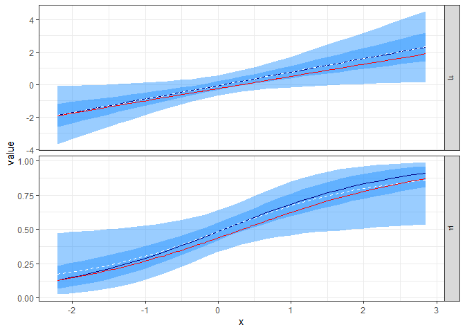<!-- -->

What about the binary outcome? The posterior predictive mean gives us
our posterior *expected* probability of the event with respect to the
input . However,
considerable uncertainty can exist in the event probability. Accounting
for the *epistemic* uncertainty on
 is
straightforward in the Bayesian apporach. We simply use each posterior
predicted event probability in the Binomial (Bernoulli) distribution and
generate random outcomes. **Why can we do this?**

``` r
set.seed(12003)

pred_demo_results <- pred_demo_samples %>% 
  mutate(y = rbinom(n = n(), size = 1, prob = mu))
```

Plot the posterior probability of observing the event, , based on
the 30 training observations.

``` r
pred_demo_results %>% 
  group_by(pred_id) %>% 
  summarise(num_post = n(),
            prob_event = mean(y == 1)) %>% 
  ungroup() %>% 
  left_join(test_df %>% 
              tibble::rowid_to_column("pred_id"),
            by = "pred_id") %>% 
  ggplot(mapping = aes(x = x)) +
  geom_jitter(data = train_df,
              mapping = aes(y = y),
              width = 0, height = 0.05,
              color = "grey30") +
  geom_line(mapping = aes(y = prob_event),
            color = "black", size = 1.15) +
  geom_line(data = demo_df,
            mapping = aes(x = x, y = mu),
            color = "red", alpha = 0.5, size = 2) +
  theme_bw()
```

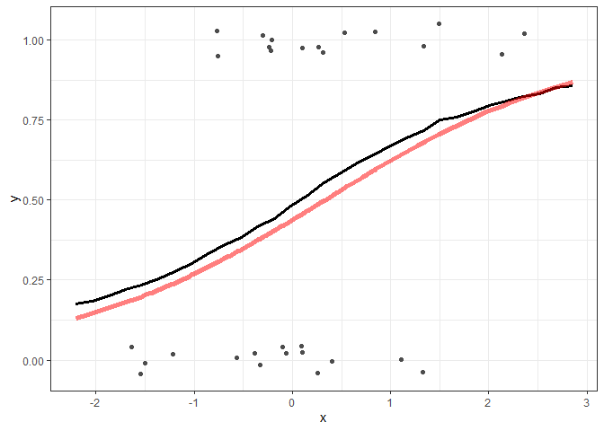<!-- -->

## Multiple predictors

### Two inputs

#### Linear additive predictors

As with the standard linear model, we can extend our **generalized**
linear model approach to more than a single predictor. Let’s consider a
two input case, where the binary response depends on two linear additive
relationships:

  
 \\\\ \\mu_n = \\mathrm{logit}^{-1}\\left(\\eta_n \\right) \\\\ \\eta_n = \\beta_0 + \\beta_1 x_{n,1} + \\beta_2 x_{n,2}
")  

We will specify that the true parameter values are:

``` r
beta_true_2_inputs <- c(0.25, -1.25, 0.85)
```

Let’s first calculate the probability of the event over a fine grid of
input values.

``` r
fine_grid_2_inputs <- expand.grid(x1 = seq(-3.5, 3.5, length.out = 225),
                                  x2 = seq(-3.5, 3.5, length.out = 225),
                                  KEEP.OUT.ATTRS = FALSE, 
                                  stringsAsFactors = FALSE) %>% 
  mutate(eta = beta_true_2_inputs[1] + beta_true_2_inputs[2]*x1 + beta_true_2_inputs[3]*x2,
         mu = boot::inv.logit(eta))
```

The probability of the event with respect to the two inputs is displayed
as contour plot below. The black line denotes the 50% probability
**boundary**. To the left of the boundary, in the figrue below, the
event is more probable than the non-event. This separation line is
therefore known as the **decision boundary** because it represents the
separation of one **class** being more probable than the other.

``` r
fine_grid_2_inputs %>% 
  ggplot(mapping = aes(x = x1, y = x2)) +
  geom_raster(mapping = aes(fill = mu)) +
  stat_contour(mapping = aes(z = mu),
               breaks = 0.5,
               size = 1.25,
               color = "black") +
  coord_fixed(ratio = 1) +
  scale_fill_viridis_c() +
  theme_bw()
```

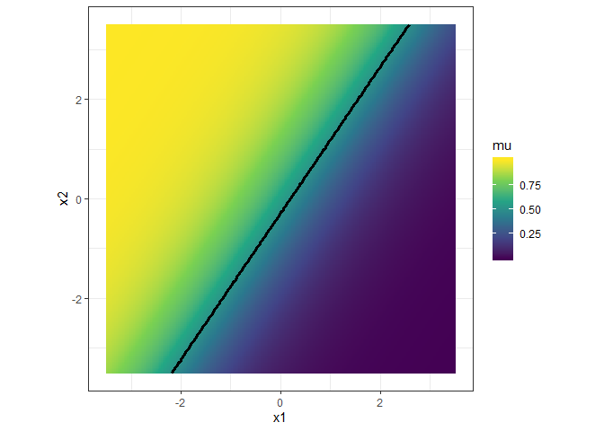<!-- -->

Generate 250 random observations assuming that the inputs come from
independent standard normals. Based on those input values, evaluate the
linear predictor and then the event probability. Finally generate a
random Bernoulli outcome, given that event probability.

``` r
set.seed(12004)
input_1 <- rnorm(n = 250)
input_2 <- rnorm(n = 250)

two_demo_df <- tibble::tibble(
  x1 = input_1,
  x2 = input_2
) %>% 
  mutate(eta = beta_true_2_inputs[1] + beta_true_2_inputs[2]*x1 + beta_true_2_inputs[3]*x2,
         mu = boot::inv.logit(eta),
         y = rbinom(n = n(), size = 1, prob = mu))
```

Plot the 250 random observations of the binary outcome on the
probability surface plot.

``` r
fine_grid_2_inputs %>% 
  ggplot(mapping = aes(x = x1, y = x2)) +
  geom_raster(mapping = aes(fill = mu)) +
  stat_contour(mapping = aes(z = mu),
               breaks = 0.5,
               size = 1.25,
               color = "black") +
  geom_point(data = two_demo_df,
             mapping = aes(shape = as.factor(y),
                           color = as.factor(y))) +
  coord_fixed(ratio = 1) +
  scale_fill_viridis_c() +
  scale_color_manual("y", 
                     values = c("0" = "white",
                                "1" = "black")) +
  scale_shape_discrete("y") +
  theme_bw() +
  theme(legend.key = element_rect(fill = "grey50"))
```

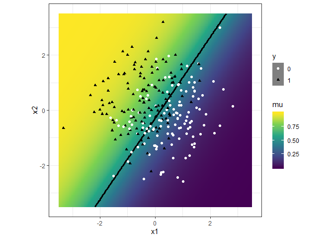<!-- -->

We can also discretize the probability scale into “bins” rather than
looking at the “smooth” color gradients.

``` r
fine_grid_2_inputs %>% 
  ggplot(mapping = aes(x = x1, y = x2)) +
  geom_raster(mapping = aes(fill = cut(mu, 
                                     breaks = seq(0, 1, by = 0.25),
                                     include.lowest = TRUE))) +
  stat_contour(mapping = aes(z = mu),
               breaks = 0.5,
               size = 1.25,
               color = "black") +
  geom_point(data = two_demo_df,
             mapping = aes(shape = as.factor(y),
                           color = as.factor(y))) +
  coord_fixed(ratio = 1) +
  scale_fill_viridis_d(expression(mu)) +
  scale_color_manual("y", 
                     values = c("0" = "white",
                                "1" = "black")) +
  scale_shape_discrete("y") +
  theme_bw() +
  theme(legend.key = element_rect(fill = "grey50"))
```

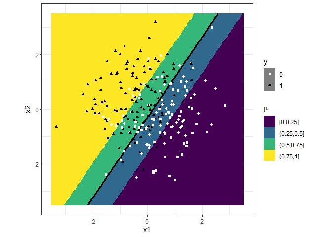<!-- -->

#### Interactions

Our linear predictor can also include an interaction between the two
inputs. An interaction is a multiplication between two variables. The
linear predictor is still linear with respect to the unknown parameters
within the relationship. The probability model for two interacting
inputs increasing the number of parameters by 1, compared with our
previous relationship:

  
 \\\\ \\mu_n = \\mathrm{logit}^{-1}\\left(\\eta_n \\right) \\\\ \\eta_n = \\beta_0 + \\beta_1 x_{n,1} + \\beta_2 x_{n,2} + \\beta_3 x_{n,1} x_{n,2}
")  

Let’s add an interaction term to our 2 input synthetic data demo. We
will use the same set of randomly generated input values,
 and
, along with the
same , , and

parameters. Let’s see what happens if try out 9 different

values between -2.5 and +2.5. **What will the results look like for
?** The code chunk below define a a function,
`bernoulli_prob_interact()` which calculates the event probability for
specific a set of
,
,
and , and

parameters. The function is defined to help us build off our previous
example.

``` r
bernoulli_prob_interact <- function(beta_3, inputs_df, beta_vec)
{
  tibble::tibble(
  x1 = inputs_df$x1,
  x2 = inputs_df$x2
) %>% 
  mutate(eta = beta_vec[1] + beta_vec[2]*x1 + beta_vec[3]*x2 + beta_3 * x1 * x2,
         mu = boot::inv.logit(eta),
         beta_3 = beta_3)
}
```

We can now apply our `bernoulli_prob_interact()` function to the
specific set of 250 input pairs and the fine grid of input pairs. This
will allow us to compare the randomly generated binary outcomes or
**classess** relative to the event probability *surface* based on the
changing interaction parameter.

``` r
beta_3_true <- seq(-2.5, 2.5, length.out = 9)

set.seed(12005)
interact_demo_df <- purrr::map_dfr(beta_3_true,
                                   bernoulli_prob_interact,
                                   inputs_df = tibble::tibble(x1 = input_1, 
                                                              x2 = input_2),
                                   beta_vec = beta_true_2_inputs) %>% 
  mutate(y = rbinom(n = n(), size = 1, prob = mu))

interact_fine_grid <- purrr::map_dfr(beta_3_true,
                                     bernoulli_prob_interact,
                                     inputs_df = expand.grid(x1 = seq(-3.5, 3.5, length.out = 225),
                                                             x2 = seq(-3.5, 3.5, length.out = 225),
                                                             KEEP.OUT.ATTRS = FALSE,
                                                             stringsAsFactors = FALSE),
                                     beta_vec = beta_true_2_inputs)
```

Let’s visualize the event probability surface based on the specific
values of the interaction parameter.

``` r
interact_fine_grid %>% 
  ggplot(mapping = aes(x = x1, y = x2)) +
  geom_raster(mapping = aes(fill = cut(mu, 
                                       breaks = seq(0, 1, by = 0.25),
                                       include.lowest = TRUE))) +
  stat_contour(mapping = aes(z = mu),
               breaks = 0.5,
               size = 1.25,
               color = "black") +
  coord_fixed(ratio = 1) +
  facet_wrap(~beta_3, labeller = "label_both") +
  scale_fill_viridis_d(expression(mu)) +
  theme_bw()
```

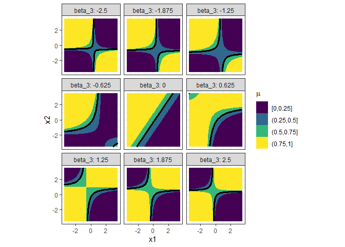<!-- -->

What’s going on here? Let’s first look at the linear predictor with
respect to 
colored based on . We’ll focus on a single value for the interaction parameter,
.
**What’s happening to the slope of the linear predictor with respect to
 as
 changes within
each subplot?**

``` r
interact_fine_grid %>% 
  filter(beta_3 == -1.25) %>% 
  ggplot(mapping = aes(x = x1, y = eta)) +
  geom_line(mapping = aes(group = interaction(x2, beta_3),
                          color = x2)) +
  facet_wrap(~beta_3, labeller = "label_both") +
  scale_color_viridis_c(option = "inferno") +
  labs(y = expression(eta)) +
  theme_bw()
```

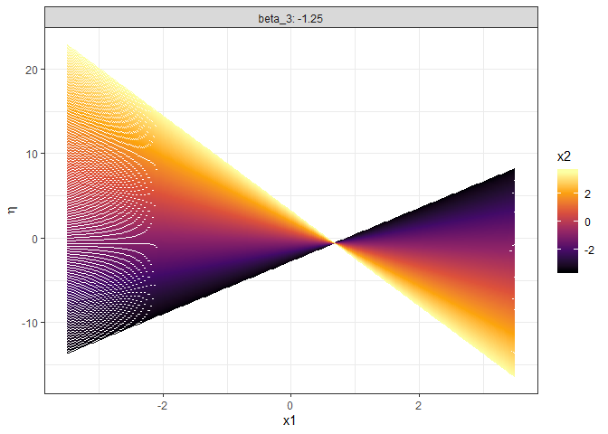<!-- -->

The interaction term is causing the slope associated with
 to **depend** on
. To see that is
indeed the case, let’s rewrite the linear predictor relationship.

  
 x_{n,1} + \\beta_2 x_{n,2}
")  

The term ") is a modified slope
acting on the first input,
.

#### Quadratic terms

We can also include polynomial orders just as we did with the linear
model. In fact, we could use any **basis** function that we could use
with the linear model in the **generalized** linear model. If we use
quadratic terms, our probability model becomes:

  
 \\\\ \\mu_n = \\mathrm{logit}^{-1}\\left(\\eta_n \\right) \\\\ \\eta_n = \\beta_0 + \\beta_1 x_{n,1} + \\beta_2 x_{n,2} + \\beta_3 x_{n,1} x_{n,2} + \\beta_4 x_{n,1}^2 + \\beta_5 x_{n,2}^2
")  

In the code chunk below, a new function is defined which allows us to
build off the initial
example.

``` r
bernoulli_prob_quad <- function(beta_3, beta_4, beta_5, inputs_df, beta_vec)
{
  tibble::tibble(
  x1 = inputs_df$x1,
  x2 = inputs_df$x2
) %>% 
  mutate(eta = beta_vec[1] + beta_vec[2]*x1 + beta_vec[3]*x2 + beta_3 * x1 * x2 +
           beta_4 * x1^2 + beta_5 * x2^2,
         mu = boot::inv.logit(eta),
         beta_3 = beta_3,
         beta_4 = beta_4, 
         beta_5 = beta_5)
}
```

Let’s try out 3 specific values for the quadratic parameters. The code
chunk below defines a grid between
,

and , each with values of `-1:1`.

``` r
beta_extra_terms <- expand.grid(beta_3 = -1:1,
                                beta_4 = -1:1,
                                beta_5 = -1:1,
                                KEEP.OUT.ATTRS = FALSE,
                                stringsAsFactors = FALSE) %>% 
  as.data.frame() %>% tbl_df()

quad_fine_grid <- purrr::pmap_dfr(list(beta_extra_terms$beta_3,
                                       beta_extra_terms$beta_4,
                                       beta_extra_terms$beta_5),
                                  bernoulli_prob_quad,
                                  inputs_df = expand.grid(x1 = seq(-3.5, 3.5, length.out = 225),
                                                          x2 = seq(-3.5, 3.5, length.out = 225),
                                                          KEEP.OUT.ATTRS = FALSE,
                                                          stringsAsFactors = FALSE),
                                  beta_vec = beta_true_2_inputs)
```

Let’s first visualize the event probability surface when , at each of the combinations of the quadratic
parameters.

``` r
quad_fine_grid %>% 
  mutate(beta_5 = forcats::fct_rev(as.factor(beta_5))) %>% 
  filter(beta_3 == 0) %>% 
  ggplot(mapping = aes(x = x1, y = x2)) +
  geom_raster(mapping = aes(fill = cut(mu,
                                       breaks = seq(0, 1, by = 0.25),
                                       include.lowest = TRUE))) +
  stat_contour(mapping = aes(z = mu),
               breaks = 0.5,
               size = 1.25,
               color = "black") +
  coord_fixed(ratio = 1) +
  facet_grid(beta_5 ~ beta_4, labeller = "label_both") +
  scale_fill_viridis_d(expression(mu)) +
  theme_bw()
```

<!-- -->

And now when .

``` r
quad_fine_grid %>% 
  mutate(beta_5 = forcats::fct_rev(as.factor(beta_5))) %>% 
  filter(beta_3 == -1) %>% 
  ggplot(mapping = aes(x = x1, y = x2)) +
  geom_raster(mapping = aes(fill = cut(mu,
                                       breaks = seq(0, 1, by = 0.25),
                                       include.lowest = TRUE))) +
  stat_contour(mapping = aes(z = mu),
               breaks = 0.5,
               size = 1.25,
               color = "black") +
  coord_fixed(ratio = 1) +
  facet_grid(beta_5 ~ beta_4, labeller = "label_both") +
  scale_fill_viridis_d(expression(mu)) +
  theme_bw()
```

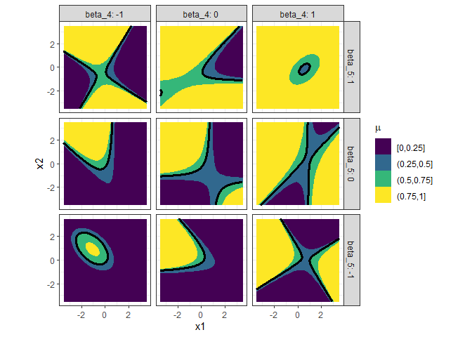<!-- -->

And finally for the case of the positive interaction parameter,
.

``` r
quad_fine_grid %>% 
  mutate(beta_5 = forcats::fct_rev(as.factor(beta_5))) %>% 
  filter(beta_3 == 1) %>% 
  ggplot(mapping = aes(x = x1, y = x2)) +
  geom_raster(mapping = aes(fill = cut(mu,
                                       breaks = seq(0, 1, by = 0.25),
                                       include.lowest = TRUE))) +
  stat_contour(mapping = aes(z = mu),
               breaks = 0.5,
               size = 1.25,
               color = "black") +
  coord_fixed(ratio = 1) +
  facet_grid(beta_5 ~ beta_4, labeller = "label_both") +
  scale_fill_viridis_d(expression(mu)) +
  theme_bw()
```

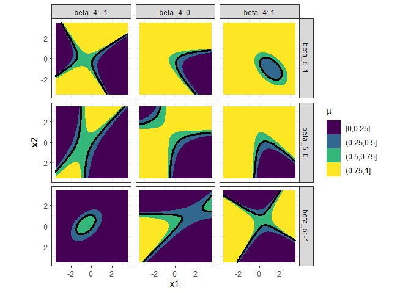<!-- -->

## Decisions

Whether we learn a simple model with a single input or a model with many
inputs involving complicated basis functions, our logistic regression
model predicts the event probability. How can we make a **decision**
based on that predicted probability? We are therefore **classifying**
the outcome as either the event,
, or the
non-event, .

The decision problem is based on comparing a predicted probability with
a threshold value. The typical threshold is . **Can you think why that is the case?** What does it mean
if the predicted probability is 60%? The model feels that the event will
occur on average 60% of the time. The  value is referred to as the **decision boundary** because
it separates the predicted classes from each other.

Let’s visualize the decision boundary and predicted classes for the
quadratic model when . In the figure below, the decision boundary is the white
curve separating the red and blue regions. Red denotes the event, while
blue represents the non-event.

``` r
quad_fine_grid %>% 
  mutate(beta_5 = forcats::fct_rev(as.factor(beta_5))) %>% 
  mutate(outcome = ifelse(mu > 0.5, "event", "non-event")) %>% 
  filter(beta_3 == 0) %>% 
  ggplot(mapping = aes(x = x1, y = x2)) +
  geom_raster(mapping = aes(fill = outcome)) +
  stat_contour(mapping = aes(z = mu),
               breaks = 0.5,
               size = 1.25,
               color = "white") +
  coord_fixed(ratio = 1) +
  facet_grid(beta_5 ~ beta_4, labeller = "label_both") +
  scale_fill_brewer(palette = "Set1") +
  theme_bw()
```

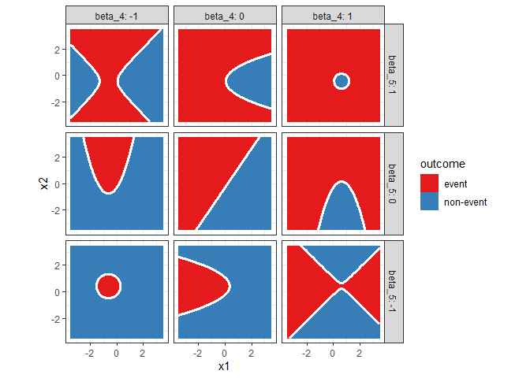<!-- -->

## Classification performance metrics

The observed responses to the logistic regression model are either 1s or
0s, events or non-events. By making a decision, we “converted” our
predicted probability into a predicted class. Therefore, it is natural
to compare our predicted **classifications** relative to the observed
outcomes.

The simplest metric to consider is **accuracy**, the number of correctly
predicted outcomes divided by the total number of observations. Although
useful, accuracy does not consider the **type** of error when the
prediction is incorrect. With a binary outcome, there are **4**
combinations of predicted class and observed class. The 4 combinations
can be visualized with a **confusion matrix**.

A basic confusion matrix is shown below, with the predicted outcome on
the vertical axis and the observed or reference outcome on the
horizontal axis. The combinations are labeled with phrases that describe
the type of prediction and whether that prediction was correct or not.
**TRUE-POSITIVE**, ,
is a correctly predicted event, while **TRUE-NEGATIVE**,
, is a correctly
predicted non-event. The correct predictions are along the main diagonal
of the confusion matrix. Errors or mis-classifications, however, are
along the off-diagonal. A **FALSE-POSITIVE**,
, was predicted to be
the event but is actually a non-event. A **FALSE-NEGATIVE**,
, is the opposite
error, the model predicted a non-event, but the event was in fact
observed. When using confusion matrices to assess model performance, the
number of samples associated with each combination (or the fraction of
total samples) will be displayed in the cells of the confusion matrix,
rather than the phrases as shown below.

``` r
expand.grid(predicted_class = c("event", "non-event"),
            observed_class = c("event", "non-event"),
            KEEP.OUT.ATTRS = FALSE,
            stringsAsFactors = FALSE) %>% 
  mutate(accurate_pred = ifelse(predicted_class == observed_class,
                                "TRUE",
                                "FALSE"),
         predicted_type = ifelse(predicted_class == "event",
                                 "POSITIVE", 
                                 "NEGATIVE")) %>% 
  tidyr::unite(confusion_cell,
               c("accurate_pred", "predicted_type"),
               sep = "-") %>% 
  mutate(predicted_class = forcats::fct_rev(as.factor(predicted_class))) %>% 
  ggplot(mapping = aes(x = observed_class, y = predicted_class)) +
  geom_tile(color = "black", fill = NA) +
  geom_text(mapping = aes(label = confusion_cell)) +
  theme(panel.grid = element_blank())
```

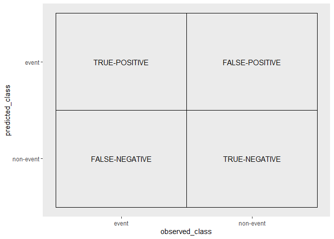<!-- -->

The overall model accuracy is just the sum of the samples along the main
diagonal divided by the sum of all cells in the confusion matrix. Using
the short hand notation for the names of the four combinations, the
accuracy is:

  
  

Hopefully you can see that not all errors are considered the same. The
specific problem or application under consideration will dictate which
**type** of error is worse. Different performance metrics exist for
evaluating and comparing trade-offs between the different type of
errors.

The **sensitivity** or **true positive rate** is the rate that the event
is correctly predicted out of all observed events. The sensitivity can
be written as:

  
  

On the other hand, the **specificity** is the fraction of corretly
predicted non-events out of all observed non-events.

  
  

The **False Positive Rate** (FPR) is one minus the specificity.

The sensitivity and specificity trade-off each other. For example, if we
change our decision threshold from 0.5 to 0.4 we will predict the event
more often. We will thus decrease the number of false negatives, which
improves . However, we will increase the number of false positives,
which decreases the
. Thus, changing the threshold which defines the decision
boundary will favor one of the two metrics. Understanding the trade-off
between  and
 leads to the Receiver Operating Characteristic (ROC)
curve.

## Two input demo

### Training set

Let’s calculate these performance metrics using the two input demo we
introduced earlier. Rememeber that dataset consisted of 250. The model
is an additive linear relationship between
 and
. We will use the
first 75 observations to fit our model.

``` r
two_train_df <- two_demo_df %>% 
  slice(1:75)
```

The 75 training points displayed relative to the *true* event
probability surface:

``` r
fine_grid_2_inputs %>% 
  ggplot(mapping = aes(x = x1, y = x2)) +
  geom_raster(mapping = aes(fill = cut(mu, 
                                     breaks = seq(0, 1, by = 0.25),
                                     include.lowest = TRUE))) +
  stat_contour(mapping = aes(z = mu),
               breaks = 0.5,
               size = 1.25,
               color = "black") +
  geom_point(data = two_train_df,
             mapping = aes(shape = as.factor(y),
                           color = as.factor(y)),
             size = 2) +
  coord_fixed(ratio = 1) +
  scale_fill_viridis_d(expression(mu)) +
  scale_color_manual("y", 
                     values = c("0" = "white",
                                "1" = "black")) +
  scale_shape_discrete("y") +
  theme_bw() +
  theme(legend.key = element_rect(fill = "grey50"))
```

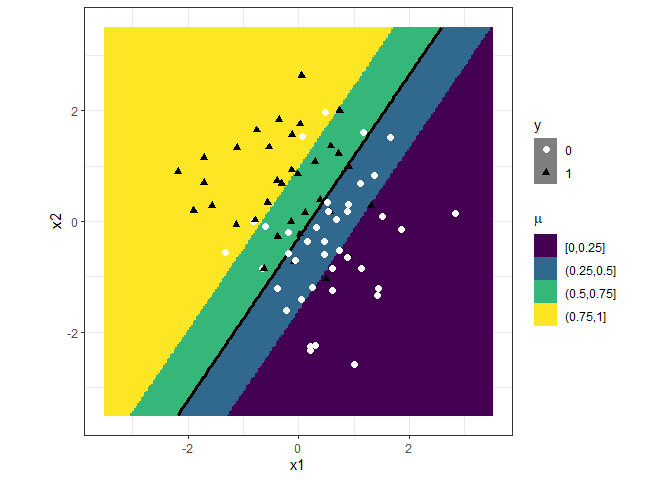<!-- -->

We need to create the design matrix, which will now include a column for
each input.

``` r
X2mat <- model.matrix( ~ x1 + x2, two_train_df)

X2mat %>% head()
```

    ##   (Intercept)        x1         x2
    ## 1           1 0.9022397 -0.6282464
    ## 2           1 0.5135305  0.3344607
    ## 3           1 0.4599287 -0.3601934
    ## 4           1 1.1218179  0.6785305
    ## 5           1 0.2058565 -2.3277440
    ## 6           1 1.3068918  0.2802122

We will use a more diffuse prior specification than before, with a prior
standard deviation of 5 for the linear predictor parameters.

``` r
info_two <- list(
  design_matrix = X2mat,
  yobs = two_train_df$y,
  mu_beta = 0,
  tau_beta = 5
)
```

And now execute the Laplace Approximation.

``` r
fit_two <- my_laplace(rep(0, ncol(X2mat)), logistic_logpost, info_two)

fit_two
```

    ## $mode
    ## [1] -0.07346223 -1.37783326  1.22680601
    ## 
    ## $var_matrix
    ##             [,1]        [,2]        [,3]
    ## [1,]  0.09577770 -0.02671261 -0.01252461
    ## [2,] -0.02671261  0.17896836 -0.03670057
    ## [3,] -0.01252461 -0.03670057  0.11827182
    ## 
    ## $log_evidence
    ## [1] -42.26975
    ## 
    ## $converge
    ## [1] "YES"
    ## 
    ## $iter_counts
    ## function 
    ##       32

### Training set predictions

With the model fit, let’s first evaluate the confusion matrix on the
training set. As a reference point, let’s see the fraction of the
training samples that contained the event:

``` r
mean(two_train_df$y == 1)
```

    ## [1] 0.4666667

We are pretty close a **balanced** dataset. Nearly 0 of the training
samples were associated with the event, Conversely, nearly 1 contained
the non-event. With just two classes (a binary outcome) and a
**balanced** dataset, our baseline performance or **no-information
rate** is 0.5. We do not need a *predictive* model to randomly guess 50%
of the samples will contain the event. This becomes a useful
**benchmark** for assessing our model’s accuracy, we want our model to
be better than just random guesses. **How would this benchmark change if
we did not have a balanced dataset?**

We will now make posterior predictions of the training points using the
functions we previously defined. Let’s use 10,000 posterior samples as
we did in the 1D demo.

``` r
set.seed(12007)

pred_two_demo_train <- predict_from_laplace(fit_two, X2mat, 1e4)
```

As a check, since we in fact know the *true* event probability at each
training point for this toy example, let’s compare the posterior
prediction summaries on
 with the
known *true* event probability. A dashed horizontal grey line denotes
the 50% probability level. The *true* event probabilities are denoted by
red markers. An open circle corresponds to a non-event, while a solid
triangle denotes the event was observed. **How can the observed outcome
be a non-event if the true probability,
, is above
0.5?**

``` r
pred_two_demo_train %>% 
  tidyr::gather(key = "output_name", value = "value",
                -post_id, -pred_id) %>% 
  group_by(pred_id, output_name) %>% 
  summarise(avg_val = mean(value),
            q05_val = quantile(value, 0.05),
            q25_val = quantile(value, 0.25),
            med_val = median(value),
            q75_val = quantile(value, 0.75),
            q95_val = quantile(value, 0.95)) %>% 
  ungroup() %>% 
  left_join(two_train_df %>% 
              tibble::rowid_to_column("pred_id") %>% 
              tidyr::gather(key = "output_name", value = "true_value",
                            -x1, -x2, -pred_id, -y),
            by = c("pred_id", "output_name")) %>% 
  filter(output_name == "mu") %>% 
  ggplot(mapping = aes(x = pred_id)) +
  geom_hline(yintercept = 0.5, linetype = "dashed", color = "grey30",
             size = 1.25) +
  geom_linerange(mapping = aes(ymin = q05_val,
                               ymax = q95_val,
                               group = interaction(output_name, pred_id)),
                 color = "black") +
  geom_linerange(mapping = aes(ymin = q25_val,
                               ymax = q75_val,
                               group = interaction(output_name, pred_id)),
                 color = "steelblue", size = 1.25) +
  geom_point(mapping = aes(y = avg_val),
             fill = "white", color = "navyblue", size = 2.5,
             shape = 21) +
  geom_point(mapping = aes(y = med_val),
             color = "black", shape = 3, size = 2.5) +
  geom_point(mapping = aes(y = true_value,
                           shape = as.factor(y)),
             color = "red", size = 1.5) +
  scale_shape_manual("y",
                     values = c("1" = 17,
                                "0" = 1)) +
  labs(x = "training point index",
       y = expression(mu)) +
  theme_bw()
```

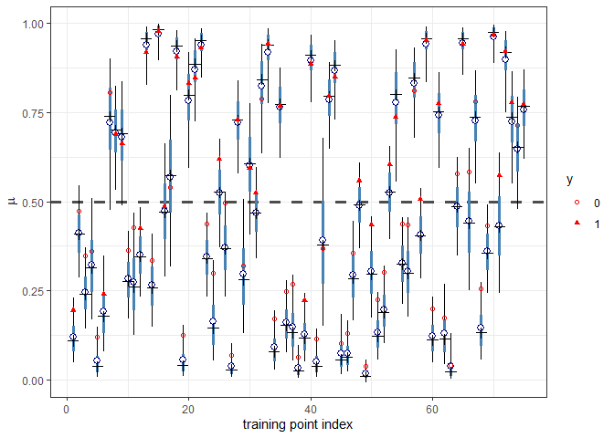<!-- -->

### Training set decisions

We have been discussing evaluating our model with a confusion matrix.
However, as the figure above shows, we have a *distribution* of event
probabilities at each training point. **Which probability should we use
in our decision rule? How should we decide what the predicted class
is?**

When we calculated regression performance metrics for the standard
linear model, we used the posterior prediction samples to calculate the
samples of the performance metrics. We summarized the posterior
performance metric **distributions** to understand the expected
performance and the uncertainty in the performance. **We will do the
same thing here.** For each posterior sample
, we will:

  - Decide the predicted class at each point,
    , based on if
     is above a threshold value, such as 0.5.  
  - Calculate the number of samples associated with each combination of
    the confusion matrix.  
  - Calculate the
    ,
     and
    .

Since we will have  posterior predictions of
 for all
 training points, we will have
 decision samples the
 points. We therefore
will have  confusion
matrices\! **Why is that useful?** We can use the
 samples to estimate the
**uncertainty** associated with each performance metric\!

To help make these steps clear, let’s focus on a few training points.
Training point 1 has the posterior predictive distribution on
 around the
*true* low event probability, even though the event was observed. The
posterior predictions on the other three points are all in the correct
“ballpark” of the corresponding *true* event probabilities. Training
point 35 has a high *true* event probability and the event was observed.
Training point 68 has a low *true* event probability and the event was
not observed. Training point 48, however, has a *true* event probability
of near 50%.

``` r
pred_two_demo_train %>% 
  tidyr::gather(key = "output_name", value = "value",
                -post_id, -pred_id) %>% 
  group_by(pred_id, output_name) %>% 
  summarise(avg_val = mean(value),
            q05_val = quantile(value, 0.05),
            q25_val = quantile(value, 0.25),
            med_val = median(value),
            q75_val = quantile(value, 0.75),
            q95_val = quantile(value, 0.95)) %>% 
  ungroup() %>% 
  left_join(two_train_df %>% 
              tibble::rowid_to_column("pred_id") %>% 
              tidyr::gather(key = "output_name", value = "true_value",
                            -x1, -x2, -pred_id, -y),
            by = c("pred_id", "output_name")) %>% 
  filter(output_name == "mu") %>% 
  filter(pred_id %in% c(1, 35, 48, 68)) %>% 
  ggplot(mapping = aes(x = as.factor(pred_id))) +
  geom_hline(yintercept = 0.5, linetype = "dashed", color = "grey30",
             size = 1.25) +
  geom_linerange(mapping = aes(ymin = q05_val,
                               ymax = q95_val,
                               group = interaction(output_name, pred_id)),
                 color = "black") +
  geom_linerange(mapping = aes(ymin = q25_val,
                               ymax = q75_val,
                               group = interaction(output_name, pred_id)),
                 color = "steelblue", size = 1.25) +
  geom_point(mapping = aes(y = avg_val),
             fill = "white", color = "navyblue", size = 2.5,
             shape = 21) +
  geom_point(mapping = aes(y = med_val),
             color = "black", shape = 3, size = 2.5) +
  geom_point(mapping = aes(y = true_value,
                           shape = as.factor(y)),
             color = "red", size = 1.5) +
  scale_shape_manual("y",
                     values = c("1" = 17,
                                "0" = 1)) +
  labs(x = "training point index",
       y = expression(mu)) +
  theme_bw()
```

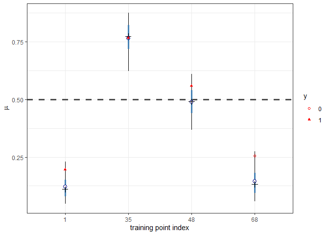<!-- -->

The 10000 posterior predictions were summarized in the above figure.
However, each of the
 posterior predictions are just single values. The first 50
posterior predictions of
 are plotted
as a run style chart in the figure below. The color denotes the training
point index.

``` r
pred_two_demo_train %>% 
  filter(pred_id %in% c(1, 35, 48, 68)) %>% 
  filter(post_id < 51) %>% 
  ggplot(mapping = aes(x = post_id,
                       y = mu)) +
  geom_line(mapping = aes(group = pred_id,
                          color = as.factor(pred_id)),
            size = 1.15) +
  geom_point(mapping = aes(color = as.factor(pred_id)),
             size = 3.5) +
  ggthemes::scale_color_colorblind("training point index") +
  labs(x = "posterior sample index, s",
       y = expression(mu)) +
  theme_bw() +
  theme(legend.position = "top")
```

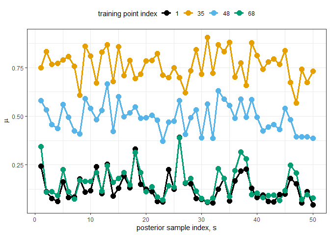<!-- -->

To make a decision about the class, we compare the predicted probability
with a threshold value. The figure below repeats the run style chart
above, but now the marker shape denotes the class decision relative to
the 50% probability threshold (which is shown as the grey horizontal
line). A marker with the triangle pointing upwards represents the
predicted probability is greater than the threshold, while a downward
pointing triangle denotes the predicted probability is less than the
threshold.

``` r
pred_two_demo_train %>% 
  filter(pred_id %in% c(1, 35, 48, 68)) %>% 
  filter(post_id < 51) %>% 
  ggplot(mapping = aes(x = post_id,
                       y = mu)) +
  geom_hline(yintercept = 0.5,
             color = "grey30",
             size = 1.25) +
  geom_line(mapping = aes(group = pred_id,
                          color = as.factor(pred_id)),
            size = 1.15) +
  geom_point(mapping = aes(color = as.factor(pred_id),
                           fill = as.factor(pred_id),
                           shape = mu > 0.5),
             size = 3.5) +
  ggthemes::scale_color_colorblind("training point index") +
  ggthemes::scale_fill_colorblind("training point index") +
  scale_shape_manual(expression(mu*">0.5"),
                     values = c("TRUE" = 24,
                                "FALSE" = 25)) +
  labs(x = "posterior sample index, s",
       y = expression(mu)) +
  theme_bw() +
  theme(legend.position = "top")
```

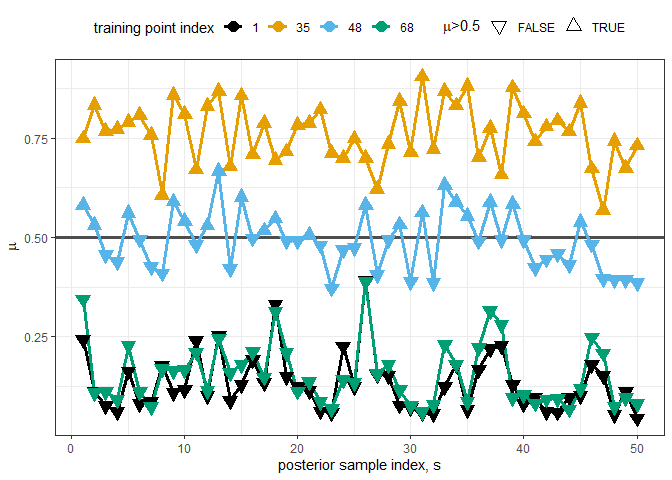<!-- -->

We can now compare our predicted class with the observed class. The
figure below sets the marker fill based on the prediction accuracy. An
incorrect predicted decision is filled red while a correctly predicted
decision is filled blue. Training points 1, 35, and 68 have all of their
markers with the same fill. For the displayed 50 posterior prediction
samples, both training points 35 and 68 are always accurate relative to
their observed class. Training point 1, however, is always inaccurate
relative to the observed class. As previously discussed, training point
1’s observed class is the event even though the *true* event probability
is low. With a decision boundary of 50%, we will **always** misclassify
training point 1 if our predicted probabilities are near the truth\!
Training point 48 has a posterior predictive distribution centered
around 0.5. The decisions are therefore alternating between being
accurate vs being incorrect as the posterior predicted probability
“bounces” around 0.5.

``` r
pred_two_demo_train %>% 
  left_join(two_train_df %>% 
              tibble::rowid_to_column("pred_id") %>% 
              select(pred_id, y),
            by = "pred_id") %>% 
  mutate(pred_class = ifelse(mu > 0.5,
                             1,
                             0),
         pred_accurate = pred_class == y) %>% 
  filter(pred_id %in% c(1, 35, 48, 68)) %>% 
  filter(post_id < 51) %>% 
  ggplot(mapping = aes(x = post_id,
                       y = mu)) +
  geom_hline(yintercept = 0.5,
             color = "grey30",
             size = 1.25) +
  geom_line(mapping = aes(group = pred_id,
                          color = as.factor(pred_id)),
            size = 1.15) +
  geom_point(mapping = aes(color = as.factor(pred_id),
                           fill = pred_accurate,
                           shape = as.factor(pred_class)),
             size = 3.5) +
  ggthemes::scale_color_colorblind("n") +
  scale_fill_manual("Accurate?",
                    values = c("TRUE" = "navyblue",
                               "FALSE" = "red")) +
  scale_shape_manual(expression(mu*">0.5"),
                     values = c("1" = 24,
                                "0" = 25),
                     labels = c("1" = "TRUE",
                                "0" = "FALSE")) +
  labs(x = "posterior sample index, s",
       y = expression(mu)) +
  theme_bw() +
  theme(legend.position = "top",
        legend.text = element_text(size = 8)) +
  guides(fill = guide_legend(override.aes = list(shape = 22)))
```

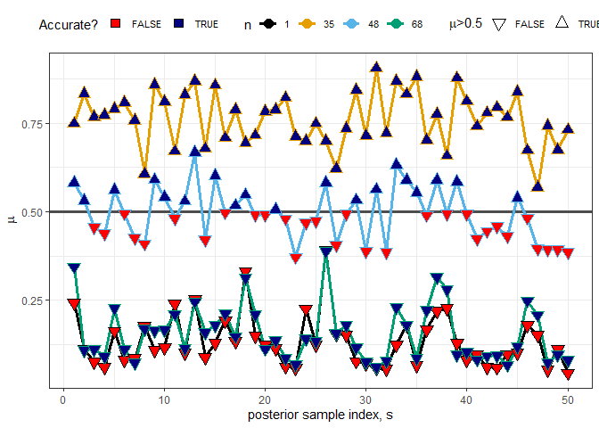<!-- -->

As we saw in the discussion of the confusion matrix, there are two types
of errors, FALSE-POSITIVE and FALSE-NEGATIVE. We will modify the colors
and marker shapes in our figure above to illustrate these errors. The
figure below uses the marker shape to denote accuracy. An “X”
corresponds to a misclassifiation, a FALSE, and a circle denotes an
accurate decision, a TRUE. The marker color corresponds to the predicted
decision, black for the non-event or NEGATIVE and orange for the event
or POSITIVE. The shape and color combinations therefore provide the 4
combinations or cells of the confusion matrix.

``` r
pred_two_demo_train %>% 
  left_join(two_train_df %>% 
              tibble::rowid_to_column("pred_id") %>% 
              select(pred_id, y),
            by = "pred_id") %>% 
  mutate(pred_class = ifelse(mu > 0.5,
                             1,
                             0),
         pred_accurate = pred_class == y) %>% 
  filter(pred_id %in% c(1, 35, 48, 68)) %>% 
  filter(post_id < 51) %>% 
  ggplot(mapping = aes(x = post_id,
                       y = mu)) +
  geom_hline(yintercept = 0.5,
             color = "grey30",
             size = 1.25) +
  geom_line(mapping = aes(group = pred_id),
            size = 1.15,
            color = "grey") +
  geom_point(mapping = aes(shape = pred_accurate,
                           color = as.factor(pred_class)),
             size = 3.5) +
  ggthemes::scale_color_colorblind("Predicted decision/class",
                                   labels = c("1" = "POSITIVE (y=1)",
                                              "0" = "NEGATIVE (y=0)")) +
  scale_shape_manual("Accurate?",
                     values = c("TRUE" = 1,
                                "FALSE" = 4)) +
  labs(x = "posterior sample index, s",
       y = expression(mu)) +
  theme_bw() +
  theme(legend.position = "top",
        legend.text = element_text(size = 8))
```

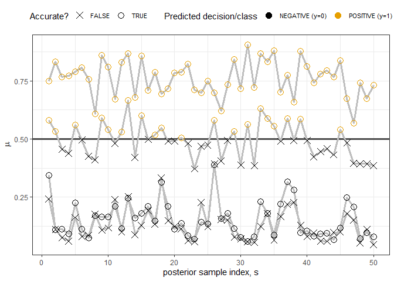<!-- -->

In order to evaluate the complete confusion matrix, we need to consider
all training points, not just the 4 specific training points we’ve
focused on.

``` r
pred_two_demo_train %>% 
  left_join(two_train_df %>% 
              tibble::rowid_to_column("pred_id") %>% 
              select(pred_id, y),
            by = "pred_id") %>% 
  mutate(pred_class = ifelse(mu > 0.5,
                             1,
                             0),
         pred_accurate = pred_class == y) %>% 
  filter(post_id < 51) %>% 
  ggplot(mapping = aes(x = post_id,
                       y = mu)) +
  geom_hline(yintercept = 0.5,
             color = "grey30",
             size = 1.25) +
  geom_line(mapping = aes(group = pred_id),
            color = "grey") +
  geom_point(mapping = aes(shape = pred_accurate,
                           color = as.factor(pred_class))) +
  ggthemes::scale_color_colorblind("Predicted decision/class",
                                   labels = c("1" = "POSITIVE (y=1)",
                                              "0" = "NEGATIVE (y=0)")) +
  scale_shape_manual("Accurate?",
                     values = c("TRUE" = 1,
                                "FALSE" = 4)) +
  labs(x = "posterior sample index, s",
       y = expression(mu)) +
  theme_bw() +
  theme(legend.position = "top",
        legend.text = element_text(size = 8))
```

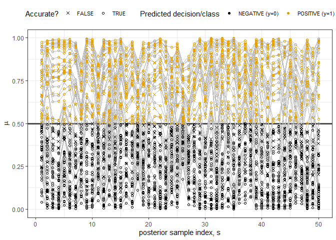<!-- -->

The above figure is way too busy, so let’s focus on just the first 4
posterior samples,
, and flip the axes. The predicted probability is now
displayed on the x-axis and the posterior sample index
 is shown on the y-axis,
in the figure below. Each grey line depicts a different training point.
“Choppy lines” that seem to move between the two halves of the figure
below represent training points that have substantial “movement” in the
predicted event probability
 over the 4
posterior samples. “Choppy lines” therefore depict uncertainty in the
event probability.

``` r
pred_two_demo_train %>% 
  left_join(two_train_df %>% 
              tibble::rowid_to_column("pred_id") %>% 
              select(pred_id, y),
            by = "pred_id") %>% 
  mutate(pred_class = ifelse(mu > 0.5,
                             1,
                             0),
         pred_accurate = pred_class == y) %>% 
  filter(post_id < 5) %>% 
  ggplot(mapping = aes(x = post_id,
                       y = mu)) +
  geom_hline(yintercept = 0.5,
             color = "grey30",
             size = 1.25) +
  geom_line(mapping = aes(group = pred_id),
            color = "grey") +
  geom_point(mapping = aes(shape = pred_accurate,
                           color = as.factor(pred_class)),
             size = 3.5) +
  coord_flip() +
  ggthemes::scale_color_colorblind("Predicted decision/class",
                                   labels = c("1" = "POSITIVE (y=1)",
                                              "0" = "NEGATIVE (y=0)")) +
  scale_shape_manual("Accurate?",
                     values = c("TRUE" = 1,
                                "FALSE" = 4)) +
  labs(x = "posterior sample index, s",
       y = expression(mu)) +
  theme_bw() +
  theme(legend.position = "top",
        legend.text = element_text(size = 8))
```

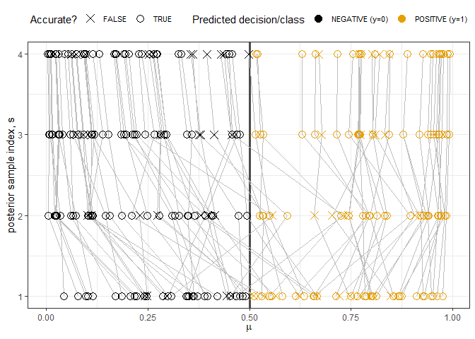<!-- -->

The cells of the confusion matrix are determined by simply counting up
the circles and “X”s per color in the figure above. The confusion
matrices associated with the first 4 posterior samples are shown below.
The values displayed in the cells of the confusion matrix change with
each posterior sample.

``` r
pred_two_demo_train %>% 
  left_join(two_train_df %>% 
              tibble::rowid_to_column("pred_id") %>% 
              select(pred_id, y),
            by = "pred_id") %>% 
  mutate(pred_class = ifelse(mu > 0.5,
                             "event",
                             "non-event"),
         obs_class = ifelse(y == 1,
                            "event",
                            "non-event")) %>% 
  mutate(pred_class = factor(pred_class,
                             levels = c("non-event", "event")),
         obs_class = factor(obs_class,
                            levels = c("event", "non-event"))) %>% 
  filter(post_id < 5) %>% 
  count(post_id, pred_class, obs_class) %>% 
  ggplot(mapping = aes(x = obs_class, 
                       y = pred_class)) +
  geom_tile(fill = NA, color = "black") +
  geom_text(mapping = aes(label = n)) +
  facet_wrap( ~ post_id, labeller = label_bquote(.(sprintf("s=%d", post_id)))) +
  theme(panel.grid = element_blank())
```

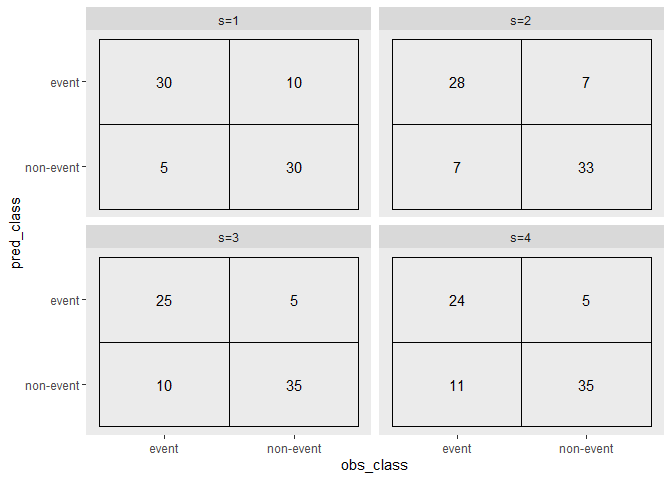<!-- -->

### Training set confusion matrix

We can calculate the confusion matrix associated with all
 posterior samples, and
then summarize the confusion matrices across all samples. Let’s define a
function which executes these calculations for us. The function
`post_confusion_matrix()` has four input arguments. The first,
`threshold`, is the probability threshold to decide the predicted class.
The second, `post_preds`, is the long-format posterior predictions, and
the third, `target_info`, is a data.frame of the target or reference
outcomes. The fourth argument, `confuse_settings`, contains useful
information about names. In addition to counting the cells of the
confusion matrix, the `calc_post_confusion_matrix()` function also
calculates the Accuracy, Sensitivity, and Specificity associated with
each posterior sample, based on the defined `threshold`
value.

``` r
calc_post_confusion_matrix <- function(threshold, post_preds, target_info, confuse_settings)
{
  post_preds %>% 
  left_join(target_info,
            by = "pred_id") %>% 
  mutate(pred_class = ifelse(mu > threshold,
                             confuse_settings$event_name,
                             confuse_settings$nonevent_name)) %>% 
  right_join(confuse_settings$combo_info, 
             by = c("pred_class", "observe_class")) %>% 
  count(post_id, confusion_cell) %>% 
  select(post_id, confusion_cell, n) %>% 
  tidyr::spread(confusion_cell, n) %>% 
  mutate(accuracy = (TRUE_POSITIVE + TRUE_NEGATIVE) /
             (TRUE_POSITIVE + TRUE_NEGATIVE + FALSE_POSITIVE + FALSE_NEGATIVE),
           sensitivity = TRUE_POSITIVE / (TRUE_POSITIVE + FALSE_NEGATIVE),
           specificity = TRUE_NEGATIVE / (TRUE_NEGATIVE + FALSE_POSITIVE))
}
```

We need to create some data objects before applying our function. The
code chunk below sets up those objects.

``` r
### assemble the training set outcomes in the right format
train_outcomes <- two_train_df %>% 
  mutate(observe_class = ifelse(y == 1, 
                                "event",
                                "non-event")) %>% 
  tibble::rowid_to_column("pred_id") %>% 
  select(pred_id, observe_class)

### setup the confusion matrix naming convention
confusion_info <- list(
  event_name = "event",
  nonevent_name = "non-event"
)

### associate the confusion matrix cell (combination) names correctly
confusion_combo_names <- expand.grid(pred_class = c("event", "non-event"),
            observe_class = c("event", "non-event"),
            KEEP.OUT.ATTRS = FALSE,
            stringsAsFactors = FALSE) %>% 
  mutate(accurate_pred = ifelse(pred_class == observe_class,
                                "TRUE",
                                "FALSE"),
         predicted_type = ifelse(pred_class == "event",
                                 "POSITIVE", 
                                 "NEGATIVE")) %>% 
  tidyr::unite(confusion_cell,
               c("accurate_pred", "predicted_type"),
               sep = "_")

confusion_info$combo_info <- confusion_combo_names
```

We can now calculate the confusion matrix for all posterior samples,
with a threshold value of
0.5.

``` r
post_confusion_mat_two_train <- calc_post_confusion_matrix(0.5, pred_two_demo_train, train_outcomes, confusion_info)
```

Let’s check the results for a few posterior samples. The results of the
first three posterior samples are printed below. As you can see, they
are consistent with the confusion matrices we visualized previously.

``` r
post_confusion_mat_two_train %>% 
  filter(post_id == 1)
```

    ## # A tibble: 1 x 8
    ##   post_id FALSE_NEGATIVE FALSE_POSITIVE TRUE_NEGATIVE TRUE_POSITIVE
    ##     <int>          <int>          <int>         <int>         <int>
    ## 1       1              5             10            30            30
    ## # ... with 3 more variables: accuracy <dbl>, sensitivity <dbl>,
    ## #   specificity <dbl>

``` r
post_confusion_mat_two_train %>% 
  filter(post_id == 2)
```

    ## # A tibble: 1 x 8
    ##   post_id FALSE_NEGATIVE FALSE_POSITIVE TRUE_NEGATIVE TRUE_POSITIVE
    ##     <int>          <int>          <int>         <int>         <int>
    ## 1       2              7              7            33            28
    ## # ... with 3 more variables: accuracy <dbl>, sensitivity <dbl>,
    ## #   specificity <dbl>

``` r
post_confusion_mat_two_train %>% 
  filter(post_id == 3)
```

    ## # A tibble: 1 x 8
    ##   post_id FALSE_NEGATIVE FALSE_POSITIVE TRUE_NEGATIVE TRUE_POSITIVE
    ##     <int>          <int>          <int>         <int>         <int>
    ## 1       3             10              5            35            25
    ## # ... with 3 more variables: accuracy <dbl>, sensitivity <dbl>,
    ## #   specificity <dbl>

We can now summarize the posterior samples on each
metric.

``` r
post_confusion_matrix_two_train_summary <- post_confusion_mat_two_train %>% 
  tidyr::gather(key = "metric_name", value = "value", -post_id) %>% 
  group_by(metric_name) %>% 
  summarise(num_post = n(),
            avg_val = mean(value, na.rm = TRUE),
            q05_val = quantile(value, 0.05, na.rm = TRUE),
            q25_val = quantile(value, 0.25, na.rm = TRUE),
            med_val = median(value, na.rm = TRUE),
            q75_val = quantile(value, 0.75, na.rm = TRUE),
            q95_val = quantile(value, 0.95, na.rm = TRUE)) %>% 
  ungroup()
```

The posterior confusion matrix summaries are displayed in the figure
below. Each cell is summarized by displaying the 5th quantile, 25th
quantile, median, 75th quantile, and 95th quantiles. Each cell therefore
represents the middle 50% uncertainty interval with the 2nd and 4th
printed values, and the middle 90% uncertainty interval with the first
and last printed values. The posterior mean is displayed by the blue
text below the quantiles. As shown below, the TRUE-POSITIVE cell is
rather uncertain, with the middle 90% uncertainty spanning 22 through 30
observations.

``` r
post_confusion_matrix_two_train_summary %>% 
  inner_join(confusion_info$combo_info,
             by = c("metric_name" = "confusion_cell")) %>% 
  mutate(cell_display = sprintf("%2d, %2d, %2d, %2d, %2d", 
                                q05_val, q25_val, med_val, q75_val, q95_val)) %>% 
  mutate(pred_class = forcats::fct_rev(as.factor(pred_class))) %>% 
  ggplot(mapping = aes(x = observe_class, y = pred_class)) +
  geom_tile(fill = NA, color = "black") +
  geom_text(mapping = aes(label = cell_display)) +
  geom_text(mapping = aes(label = signif(avg_val, 3)),
            color = "blue",
            nudge_y = -0.1) +
  theme(panel.grid = element_blank())
```

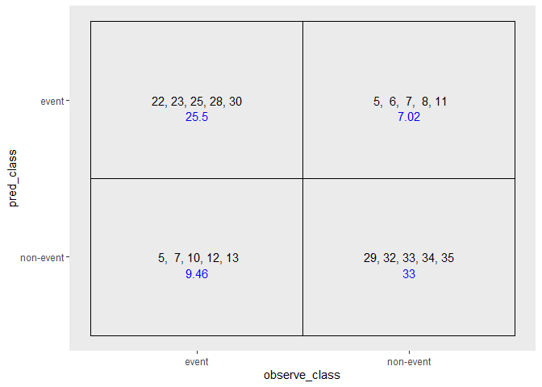<!-- -->

At this point you might be wondering, “what’s the right answer?” Because
this is a toy problem, we can make decisions based on the *true* event
probabilities. We are therefore able to evaluate the *true* confusion
matrix associated with a particular threshold. The figure below prints
the same posterior confusion matrix cell summaries as before, but now
includes the *true* confusion matrix as red text.

``` r
post_confusion_matrix_two_train_summary %>% 
  inner_join(confusion_info$combo_info,
             by = c("metric_name" = "confusion_cell")) %>% 
  mutate(cell_display = sprintf("%2d, %2d, %2d, %2d, %2d", 
                                q05_val, q25_val, med_val, q75_val, q95_val)) %>% 
  mutate(pred_class = forcats::fct_rev(as.factor(pred_class))) %>% 
  ggplot(mapping = aes(x = observe_class, y = pred_class)) +
  geom_tile(fill = NA, color = "black") +
  geom_text(mapping = aes(label = cell_display)) +
  geom_text(mapping = aes(label = signif(avg_val, 3)),
            color = "blue",
            nudge_y = -0.1) +
  geom_text(data = two_train_df %>% 
              mutate(pred_class = ifelse(mu > 0.5,
                                         "event",
                                         "non-event"),
                     observe_class = ifelse(y == 1,
                                            "event",
                                            "non-event")) %>% 
              mutate(pred_class = forcats::fct_rev(as.factor(pred_class))) %>% 
              count(pred_class, observe_class),
            mapping = aes(label = n),
            color = "red",
            nudge_y = 0.1) +
  theme(panel.grid = element_blank())
```

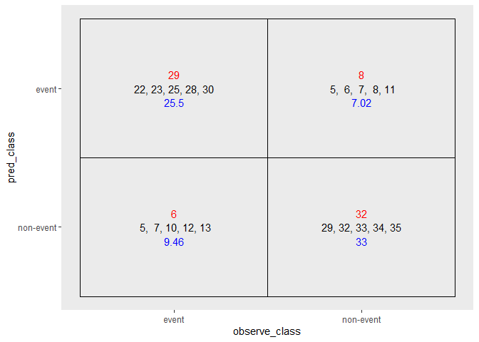<!-- -->

As shown above, the *true* TRUE-POSITIVE count is 29 out of 75 samples.
The *true* count is therefore above the 75th quantile of the posterior
predicted TRUE-POSITIVE count. Thus, even though the *true*
TRUE-POSITIVE count is contained within the middle 90% uncertainty
interval, the *true* value is considered relatively unlikely by the
model. To show that, the posterior probability that the predicted
TRUE-POSITIVE count is less than the *true* TRUE-POSITIVE is:

``` r
mean(post_confusion_mat_two_train$TRUE_POSITIVE < 29)
```

    ## [1] 0.869

And, the posterior probability that the predicted TRUE-POSITIVE count is
within 
samples around the *true* value
is:

``` r
mean(between(post_confusion_mat_two_train$TRUE_POSITIVE, 29 - 2, 29 + 2))
```

    ## [1] 0.3932

Let’s now examine the posterior summaries on the Accuracy, Sensitivity,
and the Specificity performance metrics. The color conventions are
consistent with the other figures, where the white circle is the
posterior mean on the metric, the blue vertical bar is the middle 50%
uncertainty interval, and the outer thin black line is the middle 90%
uncertainty interval. As shown below, the posterior mean on the Accuracy
is around 78% with the middle 50% uncertainty interval between 75% and
80%.

``` r
post_confusion_matrix_two_train_summary %>% 
  filter(metric_name %in% c("accuracy", 
                            "sensitivity",
                            "specificity")) %>% 
  ggplot(mapping = aes(x = metric_name)) +
  geom_linerange(mapping = aes(ymin = q05_val,
                               ymax = q95_val,
                               group = metric_name),
                 color = "black") +
  geom_linerange(mapping = aes(ymin = q25_val,
                               ymax = q75_val,
                               group = metric_name),
                 color = "steelblue", size = 2) +
  geom_point(mapping = aes(y = avg_val),
             shape = 21, fill = "white", 
             color = "navyblue", size = 3.5) +
  geom_point(mapping = aes(y = med_val),
             shape = 3, size = 3.5) +
  labs(y = "metric value",
       x = "metric name") +
  theme_bw()
```

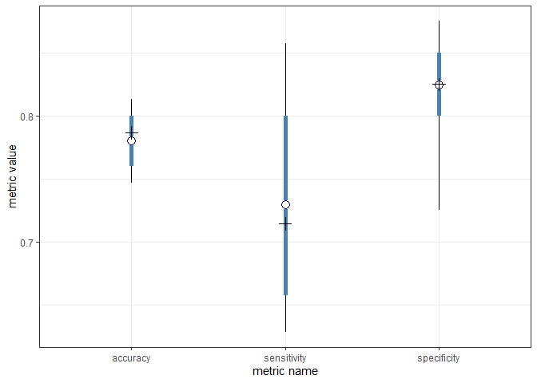<!-- -->

As we did with the confusion matrix, let’s compare our posterior
summaries to the metrics associated with the *true* event probability,
based on a threshold value of 0.5. The metrics based on the *true* event
probabilities and the 0.5 threshold value are shown as red “X”s in the
figure below. The true accuracy is around 81%, which is quite close to
the model’s accuracy. However, we know from looking at the confusion
matrices, accuracy does not tell the whole story. The sensitivity is
more uncertain than the accuracy, in this example, with a middle 90%
uncertainty interval from less than 65% to greater than 85%.

``` r
post_confusion_matrix_two_train_summary %>% 
  filter(metric_name %in% c("accuracy", 
                            "sensitivity",
                            "specificity")) %>% 
  ggplot(mapping = aes(x = metric_name)) +
  geom_linerange(mapping = aes(ymin = q05_val,
                               ymax = q95_val,
                               group = metric_name),
                 color = "black") +
  geom_linerange(mapping = aes(ymin = q25_val,
                               ymax = q75_val,
                               group = metric_name),
                 color = "steelblue", size = 2) +
  geom_point(mapping = aes(y = avg_val),
             shape = 21, fill = "white", 
             color = "navyblue", size = 3.5) +
  geom_point(mapping = aes(y = med_val),
             shape = 3, size = 3.5) +
  geom_point(data = two_train_df %>% 
               mutate(pred_class = ifelse(mu > 0.5,
                                          "event",
                                          "non-event"),
                      observe_class = ifelse(y == 1,
                                             "event",
                                             "non-event")) %>% 
               count(pred_class, observe_class) %>% 
               left_join(confusion_combo_names,
                         by = c("pred_class", "observe_class")) %>% 
               select(confusion_cell, n) %>% 
               tidyr::spread(confusion_cell, n) %>% 
               mutate(accuracy = (TRUE_POSITIVE + TRUE_NEGATIVE) /
                        (TRUE_POSITIVE + TRUE_NEGATIVE + FALSE_POSITIVE + FALSE_NEGATIVE),
                      sensitivity = TRUE_POSITIVE / (TRUE_POSITIVE + FALSE_NEGATIVE),
                      specificity = TRUE_NEGATIVE / (TRUE_NEGATIVE + FALSE_POSITIVE)) %>% 
               tidyr::gather(key = "metric_name", value = "true_value") %>% 
               filter(metric_name %in% c("accuracy", 
                                         "sensitivity",
                                         "specificity")),
             mapping = aes(x = metric_name, y = true_value),
             color = "red", shape = 4, size = 3) +
  labs(y = "metric value",
       x = "metric name") +
  theme_bw()
```

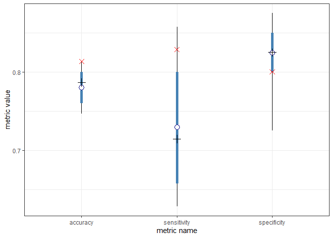<!-- -->

#### Increasing sample size

How would you expect the performance metrics to change if we increase
the training set size? Let’s try it out and see what happens. In the
code chunk below, we define a new training set, `two_train_big`, with
150 training points. Thus we doubled the training set size. The new
“bigger” training set is visualized relative to the true event
probability surface.

``` r
two_train_big <- two_demo_df %>% 
  slice(1:150)

fine_grid_2_inputs %>% 
  ggplot(mapping = aes(x = x1, y = x2)) +
  geom_raster(mapping = aes(fill = cut(mu, 
                                     breaks = seq(0, 1, by = 0.25),
                                     include.lowest = TRUE))) +
  stat_contour(mapping = aes(z = mu),
               breaks = 0.5,
               size = 1.25,
               color = "black") +
  geom_point(data = two_train_big,
             mapping = aes(shape = as.factor(y),
                           color = as.factor(y)),
             size = 2) +
  coord_fixed(ratio = 1) +
  scale_fill_viridis_d(expression(mu)) +
  scale_color_manual("y", 
                     values = c("0" = "white",
                                "1" = "black")) +
  scale_shape_discrete("y") +
  theme_bw() +
  theme(legend.key = element_rect(fill = "grey50"))
```

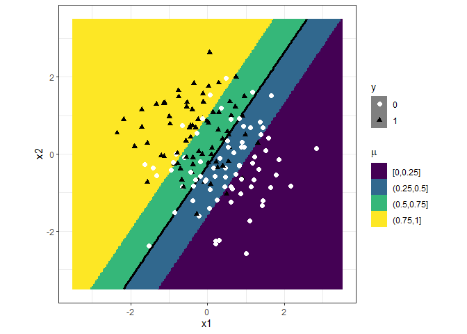<!-- -->

As we did previously, let’s check the fraction of observations
corresponding to the event. It’s close to what we had previously, and so
is balanced.

``` r
mean(two_train_big$y == 1)
```

    ## [1] 0.4933333

To fit our model, we must define the new design matrix and package
everything together in the list of required information.

``` r
X2big <- model.matrix( ~ x1 + x2, two_train_big)

info_big <- list(
  design_matrix = X2big,
  yobs = two_train_big$y,
  mu_beta = 0,
  tau_beta = 5
)
```

And finally, we can train or fit our Bayesian logistic regression model
with the Laplace approximation. **Why can we not compare the
log-evidence between this model with the original model?**

``` r
fit_big <- my_laplace(rep(0, ncol(X2big)), logistic_logpost, info_big)

fit_big
```

    ## $mode
    ## [1] -0.01099199 -1.24498341  1.21425648
    ## 
    ## $var_matrix
    ##              [,1]         [,2]         [,3]
    ## [1,]  0.041782530 -0.005521437 -0.003856065
    ## [2,] -0.005521437  0.073739966 -0.018211315
    ## [3,] -0.003856065 -0.018211315  0.062413993
    ## 
    ## $log_evidence
    ## [1] -82.96525
    ## 
    ## $converge
    ## [1] "YES"
    ## 
    ## $iter_counts
    ## function 
    ##       17

Let’s compare the
 parameter posteriors with those from the
original training set. As shown below, the posterior uncertainty is
reduced for the model stemming from the larger training set compared
with the original training set.

``` r
tibble::tibble(
  post_mean = fit_two$mode,
  post_sd = sqrt(diag(fit_two$var_matrix))
) %>% 
  mutate(param_name = sprintf("beta_%d", 1:n() - 1)) %>% 
  mutate(N = nrow(two_train_df)) %>% 
  bind_rows(
    tibble::tibble(post_mean = fit_big$mode,
                   post_sd = sqrt(diag(fit_big$var_matrix))) %>% 
      mutate(param_name = sprintf("beta_%d", 1:n() - 1)) %>% 
      mutate(N = nrow(two_train_big))) %>% 
  ggplot(mapping = aes(x = as.factor(N))) +
  geom_linerange(mapping = aes(ymin = post_mean - 2*post_sd,
                               ymax = post_mean + 2*post_sd,
                               group = interaction(param_name, N))) +
  geom_linerange(mapping = aes(ymin = post_mean - post_sd,
                               ymax = post_mean + post_sd,
                               group = interaction(param_name, N)),
                 size = 1.35) +
  geom_point(mapping = aes(y = post_mean,
                           group = interaction(param_name, N)),
             size = 2.5) +
  geom_hline(data = tibble::tibble(true_value = beta_true_2_inputs,
                                   param_name = sprintf("beta_%d", 0:2)),
             mapping = aes(yintercept = true_value),
             color = "red", linetype = "dashed") +
  facet_wrap( ~ param_name, scales = "free_y") +
  labs(y = expression(beta)) +
  theme_bw()
```

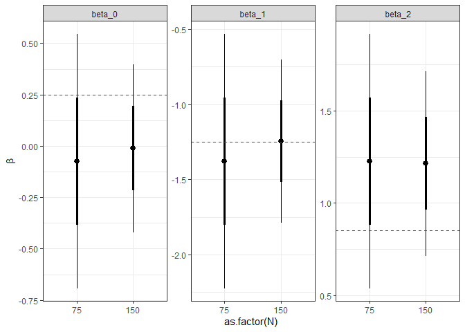<!-- -->

We can now make posterior predictions of the new larger training set.

``` r
set.seed(12008)

pred_big_demo_train <- predict_from_laplace(fit_big, X2big, 1e4)
```

The event probability posterior predictions are summarized below, a
vertical grey line denotes the 75th training point. Thus, all points to
the left of the vertical line were used in the original model. There are
a few differences in the predictions relative to what we had previously,
but the most part the overall trends appear similar.

``` r
pred_big_demo_train %>% 
  tidyr::gather(key = "output_name", value = "value",
                -post_id, -pred_id) %>% 
  group_by(pred_id, output_name) %>% 
  summarise(avg_val = mean(value),
            q05_val = quantile(value, 0.05),
            q25_val = quantile(value, 0.25),
            med_val = median(value),
            q75_val = quantile(value, 0.75),
            q95_val = quantile(value, 0.95)) %>% 
  ungroup() %>% 
  left_join(two_train_big %>% 
              tibble::rowid_to_column("pred_id") %>% 
              tidyr::gather(key = "output_name", value = "true_value",
                            -x1, -x2, -pred_id, -y),
            by = c("pred_id", "output_name")) %>% 
  filter(output_name == "mu") %>% 
  ggplot(mapping = aes(x = pred_id)) +
  geom_hline(yintercept = 0.5, linetype = "dashed", color = "grey30",
             size = 1.25) +
  geom_vline(xintercept = 75, color = "grey", size = 1.25) +
  geom_linerange(mapping = aes(ymin = q05_val,
                               ymax = q95_val,
                               group = interaction(output_name, pred_id)),
                 color = "black") +
  geom_linerange(mapping = aes(ymin = q25_val,
                               ymax = q75_val,
                               group = interaction(output_name, pred_id)),
                 color = "steelblue", size = 1.25) +
  geom_point(mapping = aes(y = avg_val),
             fill = "white", color = "navyblue", size = 2.5,
             shape = 21) +
  geom_point(mapping = aes(y = med_val),
             color = "black", shape = 3, size = 2.5) +
  geom_point(mapping = aes(y = true_value,
                           shape = as.factor(y)),
             color = "red", size = 1.5) +
  scale_shape_manual("y",
                     values = c("1" = 17,
                                "0" = 1)) +
  labs(x = "training point index",
       y = expression(mu)) +
  theme_bw()
```

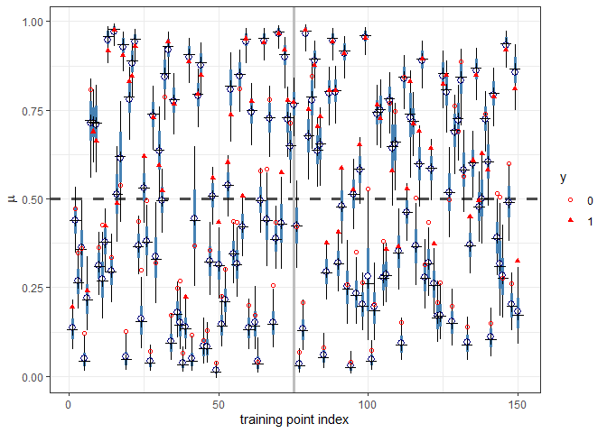<!-- -->

Let’s now recalculate the posterior confusion matrix based on the
thresold value of 0.5.

``` r
### assemble the training set outcomes in the right format
train_outcomes_big <- two_train_big %>% 
  mutate(observe_class = ifelse(y == 1, 
                                "event",
                                "non-event")) %>% 
  tibble::rowid_to_column("pred_id") %>% 
  select(pred_id, observe_class)

post_confusion_mat_big_train <- calc_post_confusion_matrix(0.5, pred_big_demo_train, 
                                                           train_outcomes_big, confusion_info)
```

The posterior confusion matrix is summarized
below.

``` r
post_confusion_matrix_big_train_summary <- post_confusion_mat_big_train %>% 
  tidyr::gather(key = "metric_name", value = "value", -post_id) %>% 
  group_by(metric_name) %>% 
  summarise(num_post = n(),
            avg_val = mean(value, na.rm = TRUE),
            q05_val = quantile(value, 0.05, na.rm = TRUE),
            q25_val = quantile(value, 0.25, na.rm = TRUE),
            med_val = median(value, na.rm = TRUE),
            q75_val = quantile(value, 0.75, na.rm = TRUE),
            q95_val = quantile(value, 0.95, na.rm = TRUE)) %>% 
  ungroup()

post_confusion_matrix_big_train_summary %>% 
  inner_join(confusion_info$combo_info,
             by = c("metric_name" = "confusion_cell")) %>% 
  mutate(cell_display = sprintf("%2d, %2d, %2d, %2d, %2d", 
                                q05_val, q25_val, med_val, q75_val, q95_val)) %>% 
  mutate(pred_class = forcats::fct_rev(as.factor(pred_class))) %>% 
  ggplot(mapping = aes(x = observe_class, y = pred_class)) +
  geom_tile(fill = NA, color = "black") +
  geom_text(mapping = aes(label = cell_display)) +
  geom_text(mapping = aes(label = signif(avg_val, 3)),
            color = "blue",
            nudge_y = -0.1) +
  geom_text(data = two_train_big %>% 
              mutate(pred_class = ifelse(mu > 0.5,
                                         "event",
                                         "non-event"),
                     observe_class = ifelse(y == 1,
                                            "event",
                                            "non-event")) %>% 
              mutate(pred_class = forcats::fct_rev(as.factor(pred_class))) %>% 
              count(pred_class, observe_class),
            mapping = aes(label = n),
            color = "red",
            nudge_y = 0.1) +
  theme(panel.grid = element_blank())
```

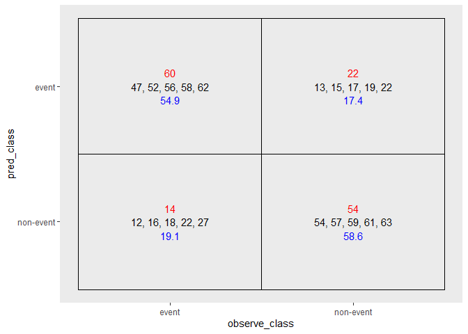<!-- -->

The performance metric posterior summaries reveal the posterior mean
accuracy is close to the *true* accuracy, but the posterior specificity
appears worse relative to the *true* specificity.

``` r
post_confusion_matrix_big_train_summary %>% 
  filter(metric_name %in% c("accuracy", 
                            "sensitivity",
                            "specificity")) %>% 
  ggplot(mapping = aes(x = metric_name)) +
  geom_linerange(mapping = aes(ymin = q05_val,
                               ymax = q95_val,
                               group = metric_name),
                 color = "black") +
  geom_linerange(mapping = aes(ymin = q25_val,
                               ymax = q75_val,
                               group = metric_name),
                 color = "steelblue", size = 2) +
  geom_point(mapping = aes(y = avg_val),
             shape = 21, fill = "white", 
             color = "navyblue", size = 3.5) +
  geom_point(mapping = aes(y = med_val),
             shape = 3, size = 3.5) +
  geom_point(data = two_train_big %>% 
               mutate(pred_class = ifelse(mu > 0.5,
                                          "event",
                                          "non-event"),
                      observe_class = ifelse(y == 1,
                                             "event",
                                             "non-event")) %>% 
               count(pred_class, observe_class) %>% 
               left_join(confusion_combo_names,
                         by = c("pred_class", "observe_class")) %>% 
               select(confusion_cell, n) %>% 
               tidyr::spread(confusion_cell, n) %>% 
               mutate(accuracy = (TRUE_POSITIVE + TRUE_NEGATIVE) /
                        (TRUE_POSITIVE + TRUE_NEGATIVE + FALSE_POSITIVE + FALSE_NEGATIVE),
                      sensitivity = TRUE_POSITIVE / (TRUE_POSITIVE + FALSE_NEGATIVE),
                      specificity = TRUE_NEGATIVE / (TRUE_NEGATIVE + FALSE_POSITIVE)) %>% 
               tidyr::gather(key = "metric_name", value = "true_value") %>% 
               filter(metric_name %in% c("accuracy", 
                                         "sensitivity",
                                         "specificity")),
             mapping = aes(x = metric_name, y = true_value),
             color = "red", shape = 4, size = 3) +
  labs(y = "metric value",
       x = "metric name") +
  theme_bw()
```

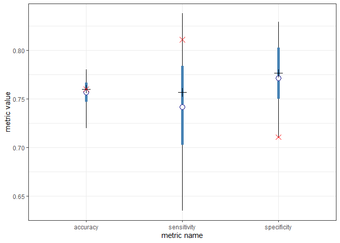<!-- -->

### Training set ROC curve

All of the previous results were based on a threshold value of 0.5. We
*classified* the result as the event if the predicted probability was
greater than 0.5. However, what if we used 0.35? Or, perhaps a threshold
value of 0.65? Could we modify the errors if we changed the threshold?
Or put another way, how sensitive are the misclassifications to our
threshold choice?

Let’s return to the original training set and corresponding model and
plot first 50 posterior predictions as the run style chart for 4
specific training points. However, this time, the marker shapes are
based on the predicted probability exceeding 0.225 instead of 0.5. By
lowering the threshold to 0.225, the 50 posterior predictions for
training point 48 are now correctly classified\! In fact, with the
threshold set the way it is, several of the posterior samples shown
below in the run style chart are also correctly classified.

``` r
pred_two_demo_train %>% 
  left_join(two_train_df %>% 
              tibble::rowid_to_column("pred_id") %>% 
              select(pred_id, y),
            by = "pred_id") %>% 
  mutate(pred_class = ifelse(mu > 0.225,
                             1,
                             0),
         pred_accurate = pred_class == y) %>% 
  filter(pred_id %in% c(1, 35, 48, 68)) %>% 
  filter(post_id < 51) %>% 
  ggplot(mapping = aes(x = post_id,
                       y = mu)) +
  geom_hline(yintercept = 0.225,
             color = "grey30",
             size = 1.25) +
  geom_line(mapping = aes(group = pred_id,
                          color = as.factor(pred_id)),
            size = 1.15) +
  geom_point(mapping = aes(color = as.factor(pred_id),
                           fill = pred_accurate,
                           shape = as.factor(pred_class)),
             size = 3.5) +
  ggthemes::scale_color_colorblind("n") +
  scale_fill_manual("Accurate?",
                    values = c("TRUE" = "navyblue",
                               "FALSE" = "red")) +
  scale_shape_manual(expression(mu*">0.225"),
                     values = c("1" = 24,
                                "0" = 25),
                     labels = c("1" = "TRUE",
                                "0" = "FALSE")) +
  labs(x = "posterior sample index, s",
       y = expression(mu)) +
  theme_bw() +
  theme(legend.position = "top",
        legend.text = element_text(size = 8)) +
  guides(fill = guide_legend(override.aes = list(shape = 22)))
```

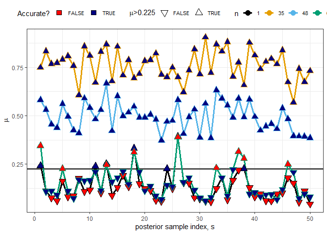<!-- -->

If we raise the threshold value to 0.775 compared to 0.5, the opposite
result occurs. All of the predictions for training point 48 are now
incorrectly classified relative to the observation. In fact, many of the
posterior predictions at training point 35 are misclassified as well,
based on this threshold value.

``` r
pred_two_demo_train %>% 
  left_join(two_train_df %>% 
              tibble::rowid_to_column("pred_id") %>% 
              select(pred_id, y),
            by = "pred_id") %>% 
  mutate(pred_class = ifelse(mu > 0.775,
                             1,
                             0),
         pred_accurate = pred_class == y) %>% 
  filter(pred_id %in% c(1, 35, 48, 68)) %>% 
  filter(post_id < 51) %>% 
  ggplot(mapping = aes(x = post_id,
                       y = mu)) +
  geom_hline(yintercept = 0.775,
             color = "grey30",
             size = 1.25) +
  geom_line(mapping = aes(group = pred_id,
                          color = as.factor(pred_id)),
            size = 1.15) +
  geom_point(mapping = aes(color = as.factor(pred_id),
                           fill = pred_accurate,
                           shape = as.factor(pred_class)),
             size = 3.5) +
  ggthemes::scale_color_colorblind("n") +
  scale_fill_manual("Accurate?",
                    values = c("TRUE" = "navyblue",
                               "FALSE" = "red")) +
  scale_shape_manual(expression(mu*">0.775"),
                     values = c("1" = 24,
                                "0" = 25),
                     labels = c("1" = "TRUE",
                                "0" = "FALSE")) +
  labs(x = "posterior sample index, s",
       y = expression(mu)) +
  theme_bw() +
  theme(legend.position = "top",
        legend.text = element_text(size = 8)) +
  guides(fill = guide_legend(override.aes = list(shape = 22)))
```

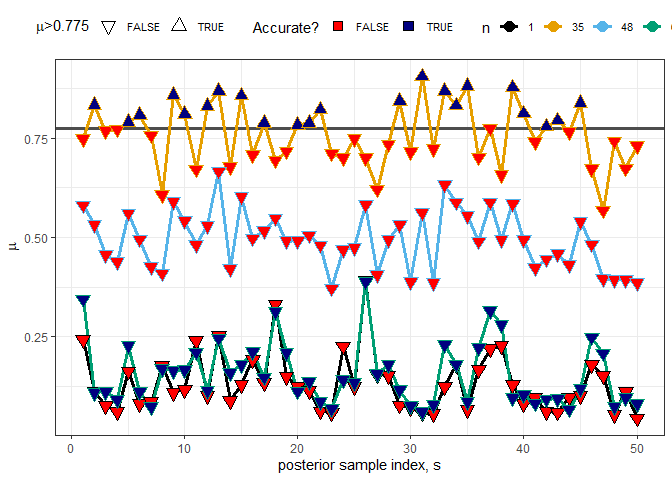<!-- -->

We could try out many different values for threshold, and remember the
above results are only for 4 specific training points. There are 71
other points in the training set to consider\! We can use the Receiver
Operator Characteristic (ROC) curve to help understand the error
trade-off across all points over a wide variety of thresholds. The ROC
curve plots the trajectory of the sensitivity (the true positive rate)
with respect to the false positive rate (one minus the specificity) as a
threshold is increased from near 0 to near 1.

To create the ROC curve, we need to recalculate the confusion matrix
performance metrics at different threshold values. Let’s start out by
considering just the first 10 posterior samples. The code chunk below
creates a manager function to help out the book keeping, and then
iterates over many threshold values with
`purrr::map_dfr()`.

``` r
manage_confusion_matrix <- function(threshold, post_preds, target_info, confuse_settings)
{
  post_ids <- post_preds %>% 
    distinct(post_id) %>% 
    arrange(post_id) %>% 
    pull()
  
  combo_info_grid <- expand.grid(confusion_cell = confuse_settings$combo_info$confusion_cell,
                                 post_id = post_ids,
                                 KEEP.OUT.ATTRS = FALSE,
                                 stringsAsFactors = FALSE) %>% 
    as.data.frame() %>% tbl_df() %>% 
    left_join(confuse_settings$combo_info,
              by = "confusion_cell")
  
  post_preds %>% 
    left_join(target_info,
              by = "pred_id") %>% 
    mutate(pred_class = ifelse(mu > threshold,
                               confusion_info$event_name,
                               confusion_info$nonevent_name)) %>% 
    count(post_id, observe_class, pred_class) %>% 
    right_join(combo_info_grid,
               by = c("pred_class", "observe_class", "post_id")) %>% 
    mutate(n = ifelse(is.na(n), 0, n)) %>% 
    select(post_id, confusion_cell, n) %>% 
    tidyr::spread(confusion_cell, n) %>% 
    mutate(accuracy = (TRUE_POSITIVE + TRUE_NEGATIVE) /
             (TRUE_POSITIVE + TRUE_NEGATIVE + FALSE_POSITIVE + FALSE_NEGATIVE),
           sensitivity = TRUE_POSITIVE / (TRUE_POSITIVE + FALSE_NEGATIVE),
           specificity = TRUE_NEGATIVE / (TRUE_NEGATIVE + FALSE_POSITIVE)) %>% 
    mutate(threshold = threshold)
}

post_confusion_mat_two_train_for_roc <- purrr::map_dfr(seq(0, 1, by = 0.01),
                                                       manage_confusion_matrix,
                                                       pred_two_demo_train %>% 
                                                         filter(post_id %in% 1:10),
                                                       train_outcomes,
                                                       confusion_info)
```

Let’s now look at just two ROC curves. These curves are a little
confusing at first to interpret because the threshold is *implicitly*
defined.

``` r
post_confusion_mat_two_train_for_roc %>% 
  filter(post_id %in% 1:2) %>% 
  group_by(post_id, specificity) %>% 
  summarise(sensitivity = min(sensitivity)) %>% 
  ungroup() %>% 
  ggplot(mapping = aes(x = 1 - specificity,
                       y = sensitivity)) +
  geom_step(mapping = aes(group = post_id),
            size = 1.2) +
  geom_abline(slope = 1, intercept = 0,
              linetype = "dashed", color = "grey30") +
  facet_wrap(~post_id, labeller = label_bquote(.(sprintf("s=%d", post_id)))) +
  theme_bw()
```

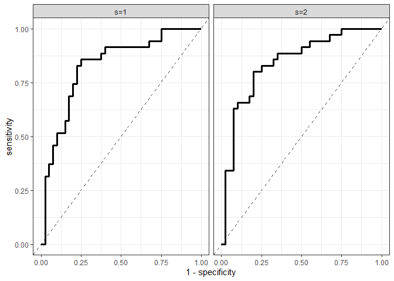<!-- -->

To help, let’s color the curve by the treshold value discretized into
0.25 intervals. As shown below, the sensitivity increases rapidly as the
threshold is decreased from 1 to 0.75. Threshold values near 1 require a
predicted probability of nearly 100% in order to classify the event\!
Thus, decreasing the threshold below 1 allows some events to be
correctly classified, which increases the true positive rate. At some
threshold level, however, the true positive rate essentially saturates.
Continuing to decrease the threshold increases the true positive rate
only slightly. Consider the left facet below, when the threshold is
decreased from 0.5 to 0, the sensitivity increases from just about 0.8
to 1.0. The greater impact, in that threshold regime, is on the false
positive rate, which increases from about 0.25 to 1.0. **With that in
mind, what do you think the ideal ROC curve looks like?** Note that, the
45 degree diagonal line corresponds to the complete balance between
sensitivity and false positive rate.

``` r
post_confusion_mat_two_train_for_roc %>% 
  filter(post_id %in% 1:2) %>% 
  group_by(post_id, specificity) %>% 
  summarise(sensitivity = min(sensitivity),
            threshold = min(threshold)) %>% 
  ungroup() %>% 
  ggplot(mapping = aes(x = 1 - specificity,
                       y = sensitivity)) +
  geom_step(mapping = aes(group = post_id,
                          color = cut(threshold,
                                      breaks = seq(0, 1, by = 0.25),
                                      include.lowest = TRUE)),
            size = 1.2) +
  geom_abline(slope = 1, intercept = 0,
              linetype = "dashed", color = "grey30") +
  facet_wrap(~post_id, labeller = label_bquote(.(sprintf("s=%d", post_id)))) +
  scale_color_viridis_d("threshold") +
  theme_bw() +
  theme(legend.position = "top") +
  guides(color = guide_legend(nrow = 1))
```

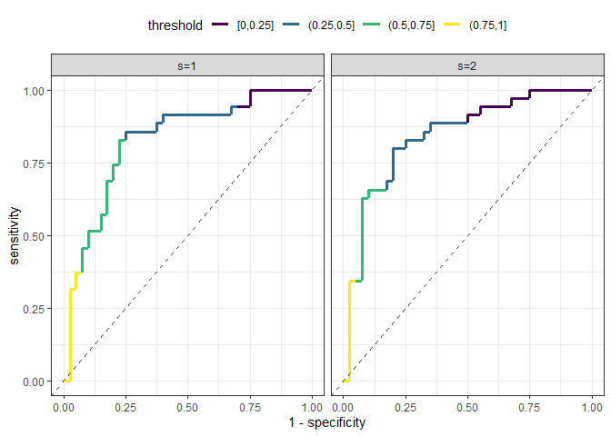<!-- -->

The ideal model would have a ROC curve that appears as a step. The
sensitivity would spike from 0 to 1 at a constant value of zero for the
false positive rate. Then, the sensitivity would remain constant at 1 as
the false positive rate increases from 0 to 1. Based on this ideal
behavior, we can summarize the entire ROC curve by integrating it. The
area under the ROC curve, or **AUC**, would be 1 for the ideal model. As
a reference point, the AUC for a completely ineffective model following
the 45-degree line would be 0.5.

Today, we’ll stick with the ROC curve directly, rather than integrating
it. Let’s now include all 10 posterior samples of the ROC curve on the
same figure.

``` r
post_confusion_mat_two_train_for_roc %>% 
  group_by(post_id, specificity) %>% 
  summarise(sensitivity = min(sensitivity)) %>% 
  ungroup() %>% 
  ggplot(mapping = aes(x = 1 - specificity,
                       y = sensitivity)) +
  geom_step(mapping = aes(group = post_id),
            size = 1.2,
            alpha = 0.5) +
  geom_abline(slope = 1, intercept = 0,
              linetype = "dashed", color = "grey30") +
  theme_bw()
```

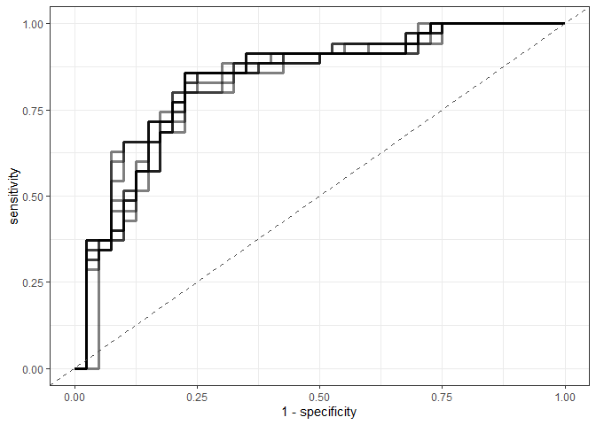<!-- -->

Each ROC curve is associated with a different posterior sample on the
linear predictor
 parameters. Thus, we are starting to assess our
uncertainty in the ROC curve due to the uncertainty in
. In the code chunk below, the ROC curve is
calculated for the first 1000 posterior samples. The 1000 ROC curves are
then visualized to give us a better understanding of the
uncertainty.

``` r
post_confusion_mat_two_train_for_roc_1000 <- purrr::map_dfr(seq(0, 1, by = 0.01),
                                                            manage_confusion_matrix,
                                                            pred_two_demo_train %>% 
                                                              filter(post_id %in% 1:1000),
                                                            train_outcomes,
                                                            confusion_info)

post_confusion_mat_two_train_for_roc_1000 %>% 
  group_by(post_id, specificity) %>% 
  summarise(sensitivity = min(sensitivity)) %>% 
  ungroup() %>% 
  ggplot(mapping = aes(x = 1 - specificity,
                       y = sensitivity)) +
  geom_step(mapping = aes(group = post_id),
            size = 1.2,
            alpha = 0.1) +
  geom_abline(slope = 1, intercept = 0,
              linetype = "dashed", color = "grey30") +
  theme_bw()
```

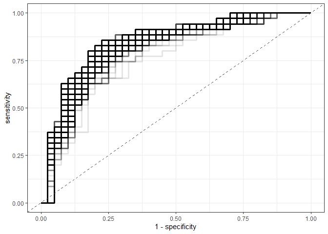<!-- -->

Let’s now calculate the *true* ROC curve using the *true* event
probability for this toy problem and compare with the posterior ROC
curve uncertainty. As shown below, the model’s ROC curve uncertainty
appears to surround the *true* ROC curve. The *true* ROC curve seems to
move back and fourth between the upper and lower quantiles of the
model’s ROC uncertainty band.

``` r
true_roc_curve <- purrr::map_dfr(seq(0, 1, by = 0.01),
                                 manage_confusion_matrix,
                                 two_train_df %>% 
                                   tibble::rowid_to_column("pred_id") %>% 
                                   select(pred_id, mu) %>% 
                                   mutate(post_id = 1),
                                 train_outcomes,
                                 confusion_info)

post_confusion_mat_two_train_for_roc_1000 %>% 
  group_by(post_id, specificity) %>% 
  summarise(sensitivity = min(sensitivity)) %>% 
  ungroup() %>% 
  ggplot(mapping = aes(x = 1 - specificity,
                       y = sensitivity)) +
  geom_step(mapping = aes(group = post_id),
            size = 1.2,
            alpha = 0.1) +
  geom_line(data = true_roc_curve %>% 
              group_by(post_id, specificity) %>% 
              summarise(sensitivity = min(sensitivity)) %>% 
              ungroup(),
            mapping = aes(x = 1 - specificity,
                          y = sensitivity,
                          group = post_id),
            color = "red", size = 1.2) +
  geom_abline(slope = 1, intercept = 0,
              linetype = "dashed", color = "grey30") +
  theme_bw()
```

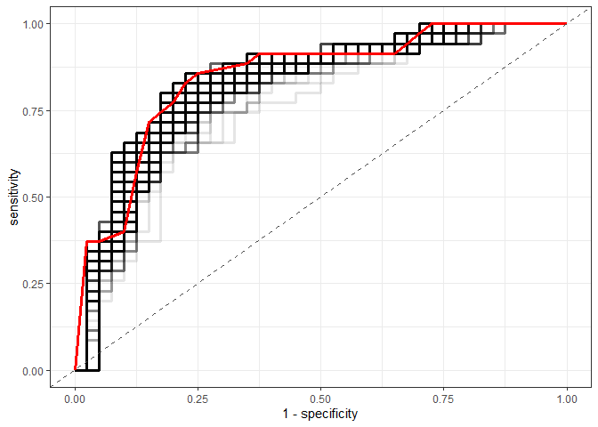<!-- -->

## Calibration curves

The previous sets of metrics are all based around comparing the
predicted classes with observed classes. With our synthetic data
example, since we know the *true* event probability, we can create a
predicted vs observed style figure, similar to what we did in regression
problems. The figure below plots the predicted event probability at each
training point with respect to the *true* value. The figure helps us see
that the model, on average, typically under predicts the event
probability.

``` r
pred_two_demo_train %>% 
  tidyr::gather(key = "output_name", value = "value",
                -post_id, -pred_id) %>% 
  group_by(pred_id, output_name) %>% 
  summarise(avg_val = mean(value),
            q05_val = quantile(value, 0.05),
            q25_val = quantile(value, 0.25),
            med_val = median(value),
            q75_val = quantile(value, 0.75),
            q95_val = quantile(value, 0.95)) %>% 
  ungroup() %>% 
  left_join(two_train_df %>% 
              tibble::rowid_to_column("pred_id") %>% 
              tidyr::gather(key = "output_name", value = "true_value",
                            -x1, -x2, -pred_id, -y),
            by = c("pred_id", "output_name")) %>% 
  filter(output_name == "mu") %>% 
  ggplot(mapping = aes(x = true_value)) +
  geom_abline(slope = 1, intercept = 0, 
              color = "red", linetype = "dashed") +
  geom_linerange(mapping = aes(ymin = q05_val,
                               ymax = q95_val,
                               group = interaction(output_name, pred_id)),
                 color = "black") +
  geom_linerange(mapping = aes(ymin = q25_val,
                               ymax = q75_val,
                               group = interaction(output_name, pred_id)),
                 color = "steelblue", size = 1.25) +
  geom_point(mapping = aes(y = avg_val),
             fill = "white", color = "navyblue", size = 2.5,
             shape = 21) +
  geom_point(mapping = aes(y = med_val),
             color = "black", shape = 3, size = 2.5) +
  scale_shape_manual("y",
                     values = c("1" = 17,
                                "0" = 1)) +
  labs(x = "true event probability",
       y = "predicted event probability") +
  theme_bw()
```

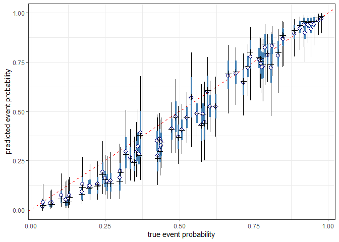<!-- -->

Unfortunately, we cannot create such a figure in a real problem\!
**Why?**

A **calibration curve** is an attempt to estimate the predicted vs true
event probability by using the observed samples directly. We first need
to bin or discretize the predicted probabilities. The figure below,
illustrates one way to do that. The vertical axis includes 11 evenly
spaced points between 0 and 1, thus creating 10 bins of equal size.

``` r
pred_two_demo_train %>% 
  tidyr::gather(key = "output_name", value = "value",
                -post_id, -pred_id) %>% 
  group_by(pred_id, output_name) %>% 
  summarise(avg_val = mean(value),
            q05_val = quantile(value, 0.05),
            q25_val = quantile(value, 0.25),
            med_val = median(value),
            q75_val = quantile(value, 0.75),
            q95_val = quantile(value, 0.95)) %>% 
  ungroup() %>% 
  left_join(two_train_df %>% 
              tibble::rowid_to_column("pred_id") %>% 
              tidyr::gather(key = "output_name", value = "true_value",
                            -x1, -x2, -pred_id, -y),
            by = c("pred_id", "output_name")) %>% 
  filter(output_name == "mu") %>% 
  ggplot(mapping = aes(x = true_value)) +
  geom_abline(slope = 1, intercept = 0, 
              color = "red", linetype = "dashed") +
  geom_linerange(mapping = aes(ymin = q05_val,
                               ymax = q95_val,
                               group = interaction(output_name, pred_id)),
                 color = "black") +
  geom_linerange(mapping = aes(ymin = q25_val,
                               ymax = q75_val,
                               group = interaction(output_name, pred_id)),
                 color = "steelblue", size = 1.25) +
  geom_point(mapping = aes(y = avg_val),
             fill = "white", color = "navyblue", size = 2.5,
             shape = 21) +
  geom_point(mapping = aes(y = med_val),
             color = "black", shape = 3, size = 2.5) +
  geom_hline(yintercept = seq(0, 1, by = 0.10),
             color = "grey30", size = 1.2) +
  scale_shape_manual("y",
                     values = c("1" = 17,
                                "0" = 1)) +
  labs(x = "true event probability",
       y = "predicted event probability") +
  theme_bw()
```

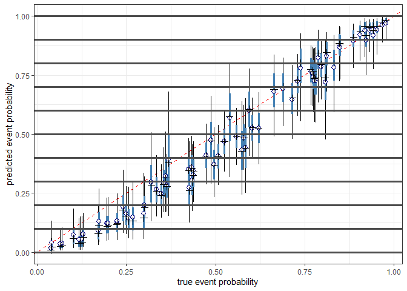<!-- -->

Within each bin, we count the number of observations and calculate the
fraction of those observations which correspond to the event. We use
this fraction as an estimate to the observed event fraction for that
particular binned predicted probability. The bin represents the
predicted probability and we now have an estimate to the fraction of
events associated with each predicted probability. **How can we intepret
this figure if the empirical event fraction within the bin is close to
the bin midpoint?**

Consider the bin between predicted probability of 0.2 and 0.3, the bin
midpoint (or center) is 0.25. Thus, the model expects that on average
the event should occur roughly 25% within that particular bin. If we
instead observed the event 70% of the time, our model would seem to be
underpredicting the event probability. However, if the event occured 5%
of the time within that bin, our model would seem to be overpredicting
the event probability. Therefore, a **well-calibrated** model is one
that has empirical event rates consistent with the predicted
probability.

Let’s try this out with the 10 evenly sized intervals for the predicted
probability, .
Just as we saw with the confusion matrix and the ROC curve, since we
have a posterior predictive **distribution** for the probability, we
will have a **distribution** of calibration curves\!

``` r
### set up the number of bins
bin_edges <- seq(0, 1, by = 0.1)

### some useful book keeping info per bin
bin_info <- tibble::tibble(
  bin_end = bin_edges
) %>% 
  mutate(bin_start = lag(bin_end)) %>% 
  na.omit() %>% 
  tibble::rowid_to_column("bin_id") %>% 
  mutate(bin_center = 0.5*(bin_start + bin_end)) %>% 
  mutate(bin_factor = cut(bin_center,
                          breaks = seq(0, 1, by = 0.1),
                          include.lowest = TRUE))

### calculate calibration curve estimates per bin per posterior sample
cal_curve_10_bins_two_train <- pred_two_demo_train %>% 
  mutate(bin_factor = cut(mu,
                          breaks = seq(0, 1, by = 0.1),
                          include.lowest = TRUE)) %>% 
  right_join(bin_info,
             by = "bin_factor") %>% 
  left_join(two_train_df %>% 
              tibble::rowid_to_column("pred_id") %>% 
              select(pred_id, y),
            by = "pred_id") %>% 
  group_by(post_id, bin_id, bin_center, bin_factor) %>% 
  summarise(num_rows = n(),
            num_pred = n_distinct(pred_id),
            pred_avg_mu = mean(mu),
            event_fraction = mean(y == 1)) %>% 
  ungroup()
```

Let’s now visualize the calibration curves for the first 4 posterior
samples. The calibration curve plots the predicted binned probability
bin center on the x-axis and the estimate event fraction on the y-axis.
A 45-degree line is included with each facet. A perfectly calibrated
model is one that has the empirical event fraction following the
45-degree line.

``` r
cal_curve_10_bins_two_train %>% 
  filter(post_id %in% 1:4) %>% 
  ggplot(mapping = aes(x = bin_center,
                       y = event_fraction)) +
  geom_line(mapping = aes(group = post_id),
            size = 1.15) +
  geom_point(size = 3.5) +
  geom_abline(slope = 1, intercept = 0,
              color = "red", linetype = "dashed",
              size = 1.2) +
  coord_cartesian(xlim = c(0, 1), ylim = c(0, 1)) +
  facet_wrap(~post_id, labeller = label_bquote(.(sprintf("s=%d", post_id)))) +
  scale_x_continuous(breaks = seq(0, 1, by = 0.1)) +
  labs(x = "predicted probability bin center",
       y = "empirical event fraction per bin") +
  theme_bw()
```

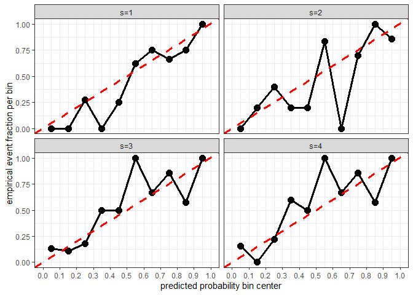<!-- -->

To start to get an idea about the uncertainty in the calibration curve,
let’s plot the first 100 posterior samples together. The figure below
looks like the calibration curve is all over the place\!

``` r
cal_curve_10_bins_two_train %>% 
  filter(post_id %in% 1:100) %>% 
  ggplot(mapping = aes(x = bin_center,
                       y = event_fraction)) +
  geom_line(mapping = aes(group = post_id),
            size = 1.15,
            alpha = 0.1) +
  geom_point(size = 2, alpha = 0.1) +
  geom_abline(slope = 1, intercept = 0,
              color = "red", linetype = "dashed",
              size = 1.2) +
  coord_cartesian(xlim = c(0, 1), ylim = c(0, 1)) +
  scale_x_continuous(breaks = seq(0, 1, by = 0.1)) +
  labs(x = "predicted probability bin center",
       y = "empirical event fraction per bin") +
  theme_bw()
```

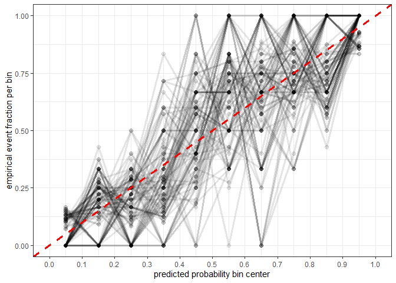<!-- -->

Let’s summarize the calibration curve posterior uncertainty with
boxplots. The posterior median event fraction per bin appears relatively
well calibrated, but as you can see below there’s substantial
uncertainty in the event fraction per bin.

``` r
cal_curve_10_bins_two_train %>% 
  ggplot(mapping = aes(x = bin_center,
                       y = event_fraction)) +
  geom_boxplot(mapping = aes(group = bin_center)) +
  geom_abline(slope = 1, intercept = 0,
              color = "red", linetype = "dashed") +
  coord_cartesian(xlim = c(0, 1), ylim = c(0, 1)) +
  scale_x_continuous(breaks = seq(0, 1, by = 0.1)) +
  labs(x = "predicted probability bin center",
       y = "empirical event fraction per bin") +
  theme_bw()
```

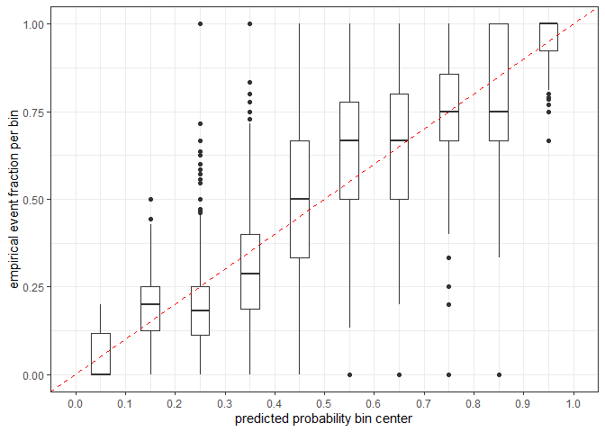<!-- -->

As you can guess, the final result of the calibration curve will depend
on the number of bins we choose to use. If we have very limited data, it
can be difficult to create a calibration curve. When we have a lot of
data however, it can provide a useful visualization for the “long run”
behavior of a model. We are giving up point-wise accuracy in order to
understand if the observed event rate is consistent with the model’s
prediction of the event probability.

Let’s remake the calibration curve using 5 evenly spaced bins just to
see what a courser curve looks like. With fewer bins, we are less
susceptible to sample size issues within each bin. That’s why the
uncertainty per bin appears lower than the uncertainty in the figure
with 10 bins.

``` r
### set up the number of bins
bin_edges_5 <- seq(0, 1, by = 0.2)

### some useful book keeping info per bin
bin_info_5 <- tibble::tibble(
  bin_end = bin_edges_5
) %>% 
  mutate(bin_start = lag(bin_end)) %>% 
  na.omit() %>% 
  tibble::rowid_to_column("bin_id") %>% 
  mutate(bin_center = 0.5*(bin_start + bin_end)) %>% 
  mutate(bin_factor = cut(bin_center,
                          breaks = seq(0, 1, by = 0.2),
                          include.lowest = TRUE))

### calculate calibration curve estimates per bin per posterior sample
cal_curve_5_bins_two_train <- pred_two_demo_train %>% 
  mutate(bin_factor = cut(mu,
                          breaks = seq(0, 1, by = 0.2),
                          include.lowest = TRUE)) %>% 
  right_join(bin_info_5,
             by = "bin_factor") %>% 
  left_join(two_train_df %>% 
              tibble::rowid_to_column("pred_id") %>% 
              select(pred_id, y),
            by = "pred_id") %>% 
  group_by(post_id, bin_id, bin_center, bin_factor) %>% 
  summarise(num_rows = n(),
            num_pred = n_distinct(pred_id),
            pred_avg_mu = mean(mu),
            event_fraction = mean(y == 1)) %>% 
  ungroup()

### summarize with box plots
cal_curve_5_bins_two_train %>% 
  ggplot(mapping = aes(x = bin_center,
                       y = event_fraction)) +
  geom_boxplot(mapping = aes(group = bin_center)) +
  geom_abline(slope = 1, intercept = 0,
              color = "red", linetype = "dashed") +
  coord_cartesian(xlim = c(0, 1), ylim = c(0, 1)) +
  scale_x_continuous(breaks = seq(0, 1, by = 0.1)) +
  labs(x = "predicted probability bin center",
       y = "empirical event fraction per bin") +
  theme_bw()
```

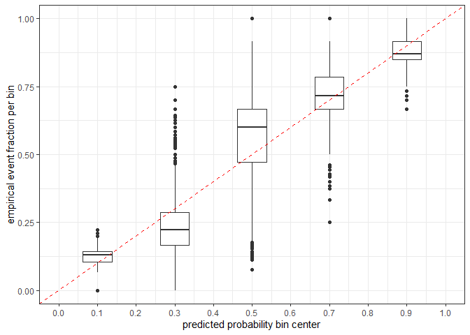<!-- -->

## Evidence

In addition to the previous metrics, we have another important metric to
consider, the **marginal likelihood**. As we discussed previously, the
marginal likelihood accounts for the model fit through the likelihood.
With standard linear models, that likelihood was a Gaussian. The
likelihood of the logistic regression model is not a Gaussian, it’s a
Binomial. Even though the distribution has changed, the likelihood can
still be calculated. The “fit” is now the probability of observing the
event or non-event based on the predicted probability, rather than the
sum of squared residuals of a continuous response.

Metrics such as accuracy, sensitivity, and specificity, can be overfit
to a training set. Thus, just as we discussed with the standard linear
model we need to consider some penalty term to guard against
overfitting. The marginal likelihood accounts for the model complexity.
With the Laplace approximation, we saw that complexity penalty is
related to the curvature of the log-posterior density. We can therefore
use the marginal likelihood to compare models in the same manner that we
did with regression\! Deviance, AIC, and BIC metrics

## Bayesian model selection

Let’s compare 6 model formulations with our two inputs demonstration
problem. We will compare an intercept only model, a model with just
input 1, a model with just input 2, a model with both inputs, a model
with an interaction term, and a quadratic model. We have already created
the model with both inputs, so let’s create the required design matrices
for the other models below.

``` r
X2_constant <- model.matrix( ~ 1, two_train_df)

X2_x1 <- model.matrix( ~ x1, two_train_df)

X2_x2 <- model.matrix( ~ x2, two_train_df)

X2_interact <- model.matrix( ~ x1 * x2, two_train_df)

X2_quad <- model.matrix( ~ x1 * x2 + I(x1^2) + I(x2^2), two_train_df)
```

The intercept-only and interaction based model design matrices are shown
below.

``` r
X2_constant %>% head()
```

    ##   (Intercept)
    ## 1           1
    ## 2           1
    ## 3           1
    ## 4           1
    ## 5           1
    ## 6           1

``` r
X2_interact %>% head()
```

    ##   (Intercept)        x1         x2      x1:x2
    ## 1           1 0.9022397 -0.6282464 -0.5668288
    ## 2           1 0.5135305  0.3344607  0.1717558
    ## 3           1 0.4599287 -0.3601934 -0.1656633
    ## 4           1 1.1218179  0.6785305  0.7611877
    ## 5           1 0.2058565 -2.3277440 -0.4791813
    ## 6           1 1.3068918  0.2802122  0.3662070

Let’s make a wrapper function which performs the model fitting for us.

``` r
manage_logistic_fit <- function(design_use, logpost_func, add_info)
{
  add_info$design_matrix <- design_use
  
  my_laplace(rep(0, ncol(design_use)), logpost_func, add_info)
}
```

We will continue to use the prior standard deviation on the linear
predictor parameters to be
. The code chunk below trains the linear additive
model along with the other 5 models just to keep all models together.

``` r
info_two_add <- list(
  yobs = two_train_df$y,
  mu_beta = 0,
  tau_beta = 5
)

fit_two_all <- purrr::map(list(X2_constant,
                               X2_x1, 
                               X2_x2, 
                               X2mat,
                               X2_interact,
                               X2_quad),
                          manage_logistic_fit,
                          logpost_func = logistic_logpost,
                          add_info = info_two_add)

purrr::map_chr(fit_two_all, "converge")
```

    ## [1] "YES" "YES" "YES" "YES" "YES" "YES"

Calculate the posterior model weights (probabilities). **Which model is
best?**

``` r
model_evidence <- purrr::map_dbl(fit_two_all, "log_evidence")

exp(model_evidence) / sum(exp(model_evidence))
```

    ## [1] 1.835805e-06 5.154508e-04 2.344445e-03 5.575054e-01 4.337428e-01
    ## [6] 5.890128e-03

Let’s visualize the posterior model weights with a bar chart.

``` r
tibble::tibble(
  model_name = c("intercept-only", "x1-only", "x2-only",
                 "linear additive",
                 "linear with interaction",
                 "quadratic"),
  model_weight = exp(model_evidence) / sum(exp(model_evidence))
) %>% 
  mutate(model_name = factor(model_name,
                             levels = c("intercept-only", "x1-only", "x2-only",
                                        "linear additive",
                                        "linear with interaction",
                                        "quadratic"))) %>% 
  ggplot(mapping = aes(x = model_name, y = model_weight)) +
  geom_bar(stat = "identity") +
  theme_bw()
```

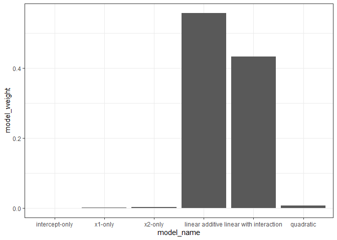<!-- -->

For this specific problem, we have a near split between the linear
additive and the linear with interaction models. The final conclusions
are not as definitive as they were in the standard linear model
examples. **Why do you think that is?**

### Train vs Test class performance

#### Training set

Let’s now compare the 4 of the models through posterior predictions.
Let’s first predict the training set.

``` r
set.seed(120111)

pred_demo_x1only_train <- predict_from_laplace(fit_two_all[[2]], X2_x1, 1e4)

pred_demo_x2only_train <- predict_from_laplace(fit_two_all[[3]], X2_x2, 1e4)

pred_demo_additive_train <- predict_from_laplace(fit_two_all[[4]], X2mat, 1e4)

pred_demo_interact_train <- predict_from_laplace(fit_two_all[[5]], X2_interact, 1e4)

pred_demo_quad_train <- predict_from_laplace(fit_two_all[[6]], X2_quad, 1e4)
```

Next, calculate the posterior confusion matrix, based on a threshold of
0.5, for each model.

``` r
post_cmat_demo_x1only_train <- calc_post_confusion_matrix(0.5,
                                                          pred_demo_x1only_train,
                                                          train_outcomes,
                                                          confusion_info)

post_cmat_demo_x2only_train <- calc_post_confusion_matrix(0.5,
                                                          pred_demo_x2only_train,
                                                          train_outcomes,
                                                          confusion_info)

post_cmat_demo_additive_train <- calc_post_confusion_matrix(0.5, 
                                                            pred_demo_additive_train, 
                                                            train_outcomes, 
                                                            confusion_info)

post_cmat_demo_interact_train <- calc_post_confusion_matrix(0.5, 
                                                            pred_demo_interact_train, 
                                                            train_outcomes, 
                                                            confusion_info)

post_cmat_demo_quad_train <- calc_post_confusion_matrix(0.5,
                                                        pred_demo_quad_train, 
                                                        train_outcomes,
                                                        confusion_info)
```

Let’s visualize the performance metrics posterior summaries and compare
the three models.

``` r
post_cmat_demo_train_summaries <- post_cmat_demo_x1only_train %>% 
  mutate(model_name = c("x1-only")) %>% 
  bind_rows(post_cmat_demo_x2only_train %>% 
              mutate(model_name = c("x2-only"))) %>% 
  bind_rows(post_cmat_demo_additive_train %>% 
              mutate(model_name = "linear additive")) %>% 
  bind_rows(post_cmat_demo_interact_train %>% 
              mutate(model_name = "linear with interaction")) %>% 
  bind_rows(post_cmat_demo_quad_train %>% 
              mutate(model_name = "quadratic")) %>% 
  tidyr::gather(key = "metric_name", value = "value", -post_id, -model_name) %>% 
  group_by(model_name, metric_name) %>% 
  summarise(num_post = n(),
            avg_val = mean(value, na.rm = TRUE),
            q05_val = quantile(value, 0.05, na.rm = TRUE),
            q25_val = quantile(value, 0.25, na.rm = TRUE),
            med_val = median(value, na.rm = TRUE),
            q75_val = quantile(value, 0.75, na.rm = TRUE),
            q95_val = quantile(value, 0.95, na.rm = TRUE)) %>% 
  ungroup()

post_cmat_demo_train_summaries %>% 
  filter(metric_name %in% c("accuracy", 
                            "sensitivity",
                            "specificity")) %>% 
  mutate(model_name = factor(model_name,
                             levels = c("x1-only", "x2-only",
                                        "linear additive",
                                        "linear with interaction",
                                        "quadratic"))) %>% 
  ggplot(mapping = aes(x = metric_name)) +
  geom_linerange(mapping = aes(ymin = q05_val,
                               ymax = q95_val,
                               group = interaction(metric_name,
                                                   model_name),
                               color = model_name),
                 color = "black",
                 position = position_dodge(0.25)) +
  geom_linerange(mapping = aes(ymin = q25_val,
                               ymax = q75_val,
                               group = interaction(metric_name,
                                                   model_name),
                               color = model_name), 
                 size = 2,
                 position = position_dodge(0.25)) +
  geom_point(mapping = aes(y = avg_val,
                           group = interaction(metric_name,
                                               model_name)),
             shape = 21, fill = "white", 
             color = "navyblue", size = 3.5,
             position = position_dodge(0.25)) +
  geom_point(mapping = aes(y = med_val,
                           group = interaction(metric_name,
                                               model_name)),
             shape = 3, size = 3.5,
             position = position_dodge(0.25)) +
  ggthemes::scale_color_colorblind("Model") +
  labs(y = "metric value") +
  theme_bw() +
  theme(legend.position = "top")
```

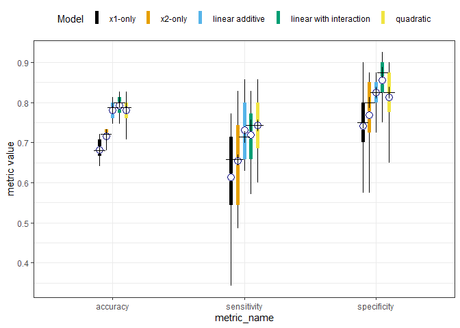<!-- -->

#### Hold-out test set

Let’s now repeat the predictions on the points not used to train the
models. The code chunk below defines the hold-out test dataset and then
creates the test design matrices for models.

``` r
two_holdout_df <- two_demo_df %>% 
  tibble::rowid_to_column("obs_id") %>% 
  filter(obs_id > 75) %>% 
  select(-obs_id)

X2_x1_test <- model.matrix( ~ x1, two_holdout_df)

X2_x2_test <- model.matrix( ~ x2, two_holdout_df)

X2_add_test <- model.matrix( ~ x1 + x2, two_holdout_df)

X2_interact_test <- model.matrix( ~ x1 * x2, two_holdout_df)

X2_quad_test <- model.matrix( ~ x1 * x2 + I(x1^2) + I(x2^2), two_holdout_df)
```

The code chunk below makes the posterior predictions with each model,
then calculates the posterior confusion matrices based on the
**hold-out** dataset.

``` r
### posterior predictions on the hold-out set
pred_demo_x1only_test <- predict_from_laplace(fit_two_all[[2]], X2_x1_test, 1e4)

pred_demo_x2only_test <- predict_from_laplace(fit_two_all[[3]], X2_x2_test, 1e4)

pred_demo_additive_test <- predict_from_laplace(fit_two_all[[4]], X2_add_test, 1e4)

pred_demo_interact_test <- predict_from_laplace(fit_two_all[[5]], X2_interact_test, 1e4)

pred_demo_quad_test <- predict_from_laplace(fit_two_all[[6]], X2_quad_test, 1e4)

### get the HOLD-OUT test set outcomes in the right format
test_outcomes <- two_holdout_df %>% 
  mutate(observe_class = ifelse(y == 1, 
                                "event",
                                "non-event")) %>% 
  tibble::rowid_to_column("pred_id") %>% 
  select(pred_id, observe_class)

### confusion matrices on the hold-out set
post_cmat_demo_x1only_test <- calc_post_confusion_matrix(0.5, 
                                                         pred_demo_x1only_test, 
                                                         test_outcomes, 
                                                         confusion_info)

post_cmat_demo_x2only_test <- calc_post_confusion_matrix(0.5, 
                                                         pred_demo_x2only_test, 
                                                         test_outcomes, 
                                                         confusion_info)

post_cmat_demo_additive_test <- calc_post_confusion_matrix(0.5, 
                                                            pred_demo_additive_test, 
                                                            test_outcomes, 
                                                            confusion_info)

post_cmat_demo_interact_test <- calc_post_confusion_matrix(0.5, 
                                                            pred_demo_interact_test, 
                                                            test_outcomes, 
                                                            confusion_info)

post_cmat_demo_quad_test <- calc_post_confusion_matrix(0.5,
                                                        pred_demo_quad_test, 
                                                        test_outcomes,
                                                        confusion_info)
```

Finally, let’s compare the models on the hold-out test set.

``` r
post_cmat_demo_test_summaries <- post_cmat_demo_additive_test %>% 
  mutate(model_name = "linear additive") %>% 
  bind_rows(post_cmat_demo_x1only_test %>% 
              mutate(model_name = "x1-only")) %>% 
  bind_rows(post_cmat_demo_x2only_test %>% 
              mutate(model_name = "x2-only")) %>% 
  bind_rows(post_cmat_demo_interact_test %>% 
              mutate(model_name = "linear with interaction")) %>% 
  bind_rows(post_cmat_demo_quad_test %>% 
              mutate(model_name = "quadratic")) %>% 
  tidyr::gather(key = "metric_name", value = "value", -post_id, -model_name) %>% 
  group_by(model_name, metric_name) %>% 
  summarise(num_post = n(),
            avg_val = mean(value, na.rm = TRUE),
            q05_val = quantile(value, 0.05, na.rm = TRUE),
            q25_val = quantile(value, 0.25, na.rm = TRUE),
            med_val = median(value, na.rm = TRUE),
            q75_val = quantile(value, 0.75, na.rm = TRUE),
            q95_val = quantile(value, 0.95, na.rm = TRUE)) %>% 
  ungroup()

post_cmat_demo_test_summaries %>% 
  filter(metric_name %in% c("accuracy", 
                            "sensitivity",
                            "specificity")) %>% 
  mutate(model_name = factor(model_name,
                             levels = c("x1-only", "x2-only",
                                        "linear additive",
                                        "linear with interaction",
                                        "quadratic"))) %>% 
  ggplot(mapping = aes(x = metric_name)) +
  geom_linerange(mapping = aes(ymin = q05_val,
                               ymax = q95_val,
                               group = interaction(metric_name,
                                                   model_name),
                               color = model_name),
                 color = "black",
                 position = position_dodge(0.25)) +
  geom_linerange(mapping = aes(ymin = q25_val,
                               ymax = q75_val,
                               group = interaction(metric_name,
                                                   model_name),
                               color = model_name), 
                 size = 2,
                 position = position_dodge(0.25)) +
  geom_point(mapping = aes(y = avg_val,
                           group = interaction(metric_name,
                                               model_name)),
             shape = 21, fill = "white", 
             color = "navyblue", size = 3.5,
             position = position_dodge(0.25)) +
  geom_point(mapping = aes(y = med_val,
                           group = interaction(metric_name,
                                               model_name)),
             shape = 3, size = 3.5,
             position = position_dodge(0.25)) +
  ggthemes::scale_color_colorblind("Model") +
  labs(y = "metric value") +
  theme_bw() +
  theme(legend.position = "top")
```

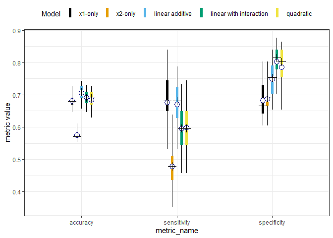<!-- -->
