INFSCI 2595: Lecture 15
================
Dr. Joseph P. Yurko
October 16, 2019

## Load packages

``` r
library(dplyr)
library(ggplot2)
```

## Synthetic data

Several weeks ago we introduced the idea of model complexity. We used a
synthetic data example, where the known true function we wished to learn
was a quadratic relationship.

``` r
my_quad_func <- function(x, beta_vec)
{
  beta_vec[1] + beta_vec[2] * x + beta_vec[3] * (x^2)
}
```

The **true** parameters for that relationship, as well as the true
**noise** for the problem are given below.

``` r
set.seed(8001)
x_demo <- rnorm(n = 100, mean = 0, sd = 1)

### set true parameter values
beta_true <- c(0.33, 1.15, -2.25)
sigma_noisy <- 2.75

### evaluate linear predictor and generate random observations
set.seed(8100)
noisy_df <- tibble::tibble(
  x = x_demo
) %>% 
  mutate(mu = my_quad_func(x, beta_true),
         y = rnorm(n = n(),
                   mean = mu,
                   sd = sigma_noisy))

### create noisy training set
train_noisy <- noisy_df %>% 
  tibble::rowid_to_column("obs_id") %>% 
  slice(1:30)
```

Visualize the noisy training data as red markers.

``` r
noisy_df %>% 
  tibble::rowid_to_column("obs_id") %>% 
  ggplot(mapping = aes(x = x)) +
  geom_line(mapping = aes(y = mu),
            color = "black", size = 1.15) +
  geom_point(mapping = aes(y = y,
                           color = obs_id < 31,
                           size = obs_id < 31)) +
  scale_color_manual("data split",
                     values = c("TRUE" = "red",
                                "FALSE" = "grey30"),
                     labels = c("TRUE" = "train",
                                "FALSE" = "hold-out")) +
  scale_size_manual("data split",
                    values = c("TRUE" = 3,
                               "FALSE" = 1.15),
                    labels = c("TRUE" = "train",
                               "FALSE" = "hold-out")) +
  labs(y = "y") +
  theme_bw() +
  theme(legend.position = "top")
```

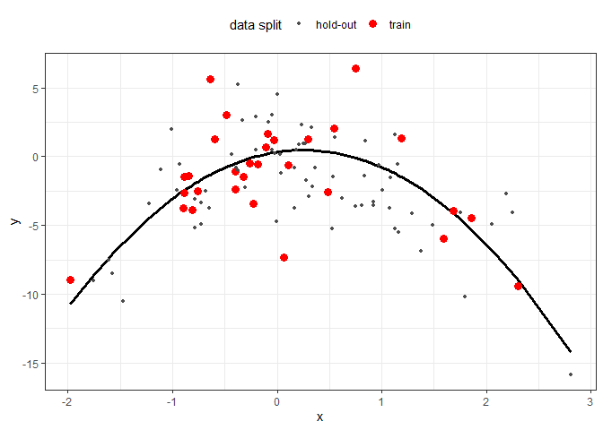<!-- -->

Using the 30 noisy training observations we fit 9 polyonomial models, an
intercept-only up to an 8th order polynomial. We evaluated the models
through several regression performance metrics on the training set
alone. Metrics such as root mean squared error (RMSE) and R-squared were
not capable of identifying the correct model formulation. The most
complex models were considered the best, with regards to minimum error
on the training set. However, the marginal likelihood allowed us to
correctly identify the quadratic relationship as the most probable
model. We discussed how the marginal likelihood (evidence) penalizes
models based on the number of paramaters. Thus, the improvement in the
“model fit” must sufficiently overcome that penalty term in order for
a complex model to outperform a simpler model.

Let’s go ahead and repeat that example now. The following code is the
same from Lecture 8 and 9. First, define the standard linear model
log-posterior function and the `my_laplace()` function to execute the
Laplace approximation.

``` r
lm_logpost <- function(theta, my_info)
{
  # unpack the parameter vector
  beta_v <- theta[1:my_info$length_beta]
  
  # back-transform from phi to sigma
  lik_phi <- theta[my_info$length_beta + 1]
  lik_sigma <- exp(lik_phi)
  
  # extract design matrix
  X <- my_info$design_matrix
  
  # calculate the linear predictor
  mu <- as.vector(X %*% as.matrix(beta_v))
  
  # evaluate the log-likelihood
  log_lik <- sum(dnorm(x = my_info$yobs,
                       mean = mu,
                       sd = lik_sigma,
                       log = TRUE))
  
  # evaluate the log-prior
  log_prior_beta <- sum(dnorm(x = beta_v,
                              mean = my_info$mu_beta,
                              sd = my_info$tau_beta,
                              log = TRUE)) 
  
  log_prior_sigma <- dexp(x = lik_sigma,
                          rate = my_info$sigma_rate,
                          log = TRUE)
  
  log_prior <- log_prior_beta + log_prior_sigma
  
  # account for the transformation
  log_derive_adjust <- lik_phi
  
  # sum together
  log_lik + log_prior + log_derive_adjust
}

my_laplace <- function(start_guess, logpost_func, ...)
{
  # code adapted from the `LearnBayes`` function `laplace()`
  fit <- optim(start_guess,
               logpost_func,
               gr = NULL,
               ...,
               method = "BFGS",
               hessian = TRUE,
               control = list(fnscale = -1, maxit = 1001))
  
  mode <- fit$par
  h <- -solve(fit$hessian)
  p <- length(mode)
  int <- p/2 * log(2 * pi) + 0.5 * log(det(h)) + logpost_func(mode, ...)
  list(mode = mode,
       var_matrix = h,
       log_evidence = int,
       converge = ifelse(fit$convergence == 0,
                         "YES", 
                         "NO"),
       iter_counts = fit$counts[1])
}
```

Next, define the wrapper function for performing the Laplace
approximation for a given polynomial design
matrix.

``` r
manage_poly_order <- function(design_use, logpost_func, response_vector, add_info)
{
  # include the design matrix with the required additional info
  add_info$design_matrix <- design_use
  
  # specify the number of linear predictor parameters
  add_info$length_beta <- ncol(design_use)
  
  # include the response vector
  add_info$yobs <- response_vector
  
  # generate random initial guess
  init_beta <- rnorm(add_info$length_beta, 0, 1)
  
  init_phi <- log(rexp(n = 1, rate = add_info$sigma_rate))
  
  # execute laplace approximation
  my_laplace(c(init_beta, init_phi), logpost_func, add_info)
}

manage_poly_fit <- function(poly_order, train_data, logpost_func, add_info)
{
  if(poly_order == 0){
    # define the intercept-only design matrix
    design_matrix <- model.matrix(y ~ 1, train_data)
  } else {
    # polynomial design matrix
    design_matrix <- model.matrix(y ~ poly(x, poly_order, raw = TRUE), train_data)
  }
  
  manage_poly_order(design_matrix, logpost_func, train_data$y, add_info)
}
```

Now fit all of the models. We had used a diffuse prior with mean zero
and a standard deviation of 25 on the
 parameters. The exponential prior on
 had
a rate parameter of 1. Let’s do the same thing again.

``` r
diffuse_hyper <- list(
  mu_beta = 0,
  tau_beta = 25,
  sigma_rate = 1
)

poly_try <- 0:8

set.seed(5303)
fit_noisy_diffuse <- purrr::map(poly_try,
                                manage_poly_fit,
                                train_data = train_noisy,
                                logpost_func = lm_logpost,
                                add_info = diffuse_hyper)
```

Let’s check we got the same result as last time by calculating the
posterior model weights
(probabilities).

``` r
model_evidence_noisy_diffuse <- purrr::map_dbl(fit_noisy_diffuse, "log_evidence")

exp(model_evidence_noisy_diffuse) / sum(exp(model_evidence_noisy_diffuse))
```

    ## [1] 2.670572e-01 9.044477e-03 7.120053e-01 1.172107e-02 1.680851e-04
    ## [6] 3.518652e-06 2.651056e-07 6.695253e-08 2.414024e-09

``` r
tibble::tibble(
  J = seq_along(model_evidence_noisy_diffuse) - 1,
  model_prob = exp(model_evidence_noisy_diffuse) / sum(exp(model_evidence_noisy_diffuse))
) %>% 
  ggplot(mapping = aes(x = as.factor(J),
                       y = model_prob)) +
  geom_bar(stat = "identity") + 
  coord_cartesian(ylim = c(0, 1)) +
  labs(y = "Posterior model probability") +
  theme_bw()
```

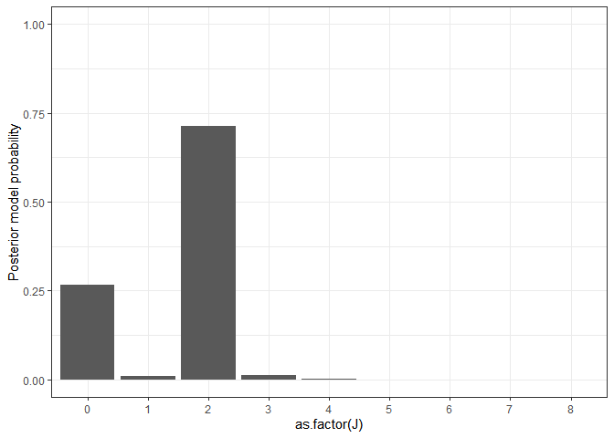<!-- -->

Why did we return to this example? Well, when first introduced it we
were motivated around understanding complexity. We simply used the
diffuse prior and did not consider what happened if we used a different
prior specification? For example, what if we used a prior standard
deviation of 20 instead of 25? Or perhaps 10, why not a value of 1?

To motivate why we should consider this question, let’s look at the
posterior
 parameters across the models. The function below
extracts the posterior means and calculates
 and
 “sigma”
uncertainty intervals around the mean.

``` r
extract_beta_post_summaries <- function(length_beta, mvn_result)
{
  # posterior means
  beta_means <- mvn_result$mode[1:length_beta]
  
  # posterior standard deviations
  beta_sd <- sqrt(diag(mvn_result$var_matrix))[1:length_beta]
  
  # return the posterior mean +/-1sigma and +/-2sigma intervals
  tibble::tibble(
    post_mean = beta_means,
    post_sd = beta_sd
  ) %>% 
    mutate(post_lwr_2 = post_mean - 2*post_sd,
           post_upr_2 = post_mean + 2*post_sd,
           post_lwr_1 = post_mean - 1*post_sd,
           post_upr_1 = post_mean + 1*post_sd) %>% 
    tibble::rowid_to_column("param_num") %>% 
    mutate(beta_num = param_num - 1) %>% 
    mutate(beta_name = sprintf("beta[%d]", beta_num),
           J = length_beta -1)
}
```

We looked at the figure for all models before. It’s a rather complex
figure.

``` r
post_beta_noisy_diffuse_summary <- purrr::map2_dfr(seq_along(fit_noisy_diffuse),
                                                   fit_noisy_diffuse,
                                                   extract_beta_post_summaries)

post_beta_noisy_diffuse_summary %>% 
  ggplot(mapping = aes(x = as.factor(J))) +
  geom_hline(yintercept = 0, color = "grey50") +
  geom_linerange(mapping = aes(group = interaction(J, beta_name),
                               ymin = post_lwr_2,
                               ymax = post_upr_2),
                 color = "grey30", size = .5) +
  geom_linerange(mapping = aes(group = interaction(J, beta_name),
                               ymin = post_lwr_1,
                               ymax = post_upr_1),
                 color = "black", size = 1.25) +
  geom_point(mapping = aes(group = interaction(J, beta_name),
                           y = post_mean),
             color = "black", size = 2) +
  geom_hline(data = tibble::tibble(beta_name = sprintf("beta[%d]", 0:8),
                                   beta_true_val = c(beta_true, rep(0, 6))),
             mapping = aes(yintercept = beta_true_val),
             color = "red", linetype = "dashed") +
  facet_wrap(~beta_name, labeller = label_parsed,
             scales = "free") +
  labs(y = expression(beta)) +
  theme_bw()
```

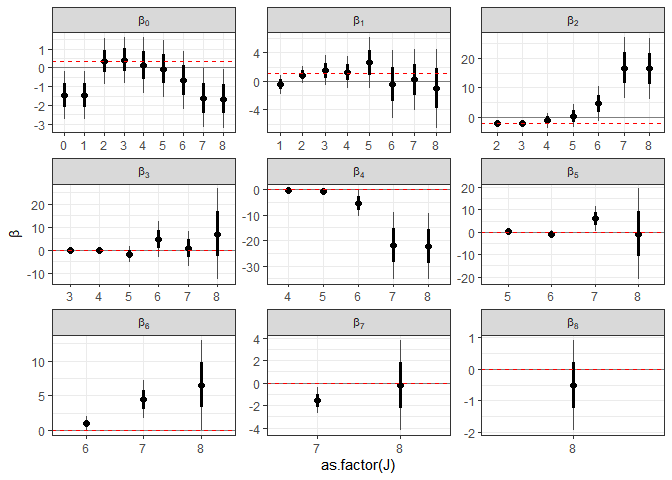<!-- -->

Let’s focus first, just on the quadratic relationship.

``` r
post_beta_noisy_diffuse_summary %>% 
  filter(J == 2) %>% 
  ggplot(mapping = aes(x = as.factor(beta_num))) +
  geom_hline(yintercept = 0,
             color = "grey50") +
  geom_linerange(mapping = aes(ymin = post_lwr_2,
                               ymax = post_upr_2,
                               group = interaction(param_num, J)),
                 color = "grey30", size = 0.5) +
  geom_linerange(mapping = aes(ymin = post_lwr_1,
                               ymax = post_upr_1,
                               group = interaction(param_num, J)),
                 black = "color", size = 1.25) +
  geom_point(mapping = aes(y = post_mean,
                           group = interaction(param_num, J)),
             color = "black", size = 2.5) +
  facet_wrap( ~ J, labeller = "label_both") +
  labs(y = expression(beta[j]),
       x = "j") +
  theme_bw()
```

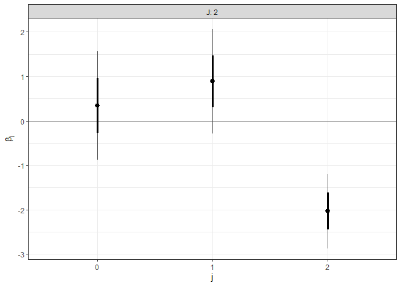<!-- -->

We’ve discussed how to interpret the figure above. Based upon the
parameter uncertainty intervals, we can visually assess that the
quadratic term parameter,

is definitely negative with a posterior mean of -2. The approximate 95%
uncertainty interval around the mean on

is contained entirely between -3 and -1.

How does that interval compare to the **prior** approximate 95%
uncertainty interval? We had used a prior standard deviation of 25, so
 “sigma”
around the **prior mean** of 0 corresponds to an interval between -50
and +50\!

``` r
post_beta_noisy_diffuse_summary %>% 
  filter(J == 2) %>% 
  ggplot(mapping = aes(x = as.factor(beta_num))) +
  geom_hline(yintercept = 0,
             color = "grey50") +
  geom_hline(yintercept = 0, 
             color = "steelblue", linetype = "dashed",
             size = 1.25) +
  geom_hline(yintercept = c(-25, 25),
             color = "steelblue", linetype = "solid",
             size = 1.25) +
  geom_hline(yintercept = c(-50, 50),
             color = "dodgerblue", linetype = "dashed",
             size = 1.25) +
  geom_linerange(mapping = aes(ymin = post_lwr_2,
                               ymax = post_upr_2,
                               group = interaction(param_num, J)),
                 color = "grey30", size = 0.5) +
  geom_linerange(mapping = aes(ymin = post_lwr_1,
                               ymax = post_upr_1,
                               group = interaction(param_num, J)),
                 black = "color", size = 1.25) +
  geom_point(mapping = aes(y = post_mean,
                           group = interaction(param_num, J)),
             color = "black", size = 2.5) +
  facet_wrap( ~ J, labeller = "label_both") +
  labs(y = expression(beta[j]),
       x = "j") +
  theme_bw()
```

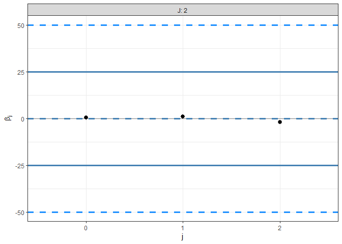<!-- -->

The posterior intervals are therefore quite precise relative to the
prior uncertainty interval. The posterior intervals are also quite close
to zero for this problem, relative to the bounds of the prior 95%
uncertainty interval.  
Let’s now consider the 7th order polyonimial model and compare its
parameters relative to the prior uncertainty interval. As shown in the
figure below, several of the parameters have quite “wide” posterior
uncertainty intervals, as well as posterior means “far” from zero. All
of the parameters have posterior means within
 prior
standard deviation around the prior mean, but their values are still
quite large compared to the values of the quadratic model.

``` r
post_beta_noisy_diffuse_summary %>% 
  filter(J == 7) %>% 
  ggplot(mapping = aes(x = as.factor(beta_num))) +
  geom_hline(yintercept = 0,
             color = "grey50") +
  geom_hline(yintercept = 0, 
             color = "steelblue", linetype = "dashed",
             size = 1.25) +
  geom_hline(yintercept = c(-25, 25),
             color = "steelblue", linetype = "solid",
             size = 1.25) +
  geom_hline(yintercept = c(-50, 50),
             color = "dodgerblue", linetype = "dashed",
             size = 1.25) +
  geom_linerange(mapping = aes(ymin = post_lwr_2,
                               ymax = post_upr_2,
                               group = interaction(param_num, J)),
                 color = "grey30", size = 0.5) +
  geom_linerange(mapping = aes(ymin = post_lwr_1,
                               ymax = post_upr_1,
                               group = interaction(param_num, J)),
                 black = "color", size = 1.25) +
  geom_point(mapping = aes(y = post_mean,
                           group = interaction(param_num, J)),
             color = "black", size = 2.5) +
  facet_wrap( ~ J, labeller = "label_both") +
  labs(y = expression(beta[j]),
       x = "j") +
  theme_bw()
```

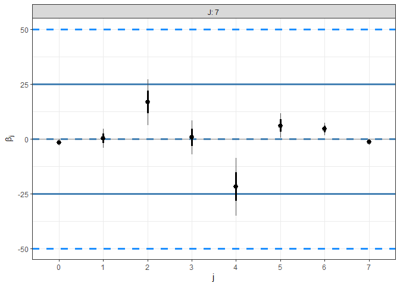<!-- -->

To understand what’s going on here, we have to think back to the role of
the prior. We have used terms such as *diffuse* and *informative*. A
diffuse prior reflects that we are *allowing* many possible values,
while an informative prior *constrains* plausible values to smaller
intervals.

Let’s explicitely see this by using a very informative prior on the
 parameters, a prior standard deviation of 1.

``` r
inform_hyper <- list(
  mu_beta = 0,
  tau_beta = 1,
  sigma_rate = 1
)

set.seed(3505)
fit_noisy_inform <- purrr::map(poly_try,
                               manage_poly_fit,
                               train_data = train_noisy,
                               logpost_func = lm_logpost,
                               add_info = inform_hyper)
```

Extract the posterior parameter means and uncertainty intervals based on
the informative
prior.

``` r
post_beta_noisy_inform_summary <- purrr::map2_dfr(seq_along(fit_noisy_inform),
                                                  fit_noisy_inform,
                                                  extract_beta_post_summaries)
```

Let’s examine the posterior summaries associated with the 7th order
model first. The prior uncertainty intervals are marked this time with
orange lines instead of blue horizontal lines. The posterior means are
still all within the
 prior
standard deviation interval around the prior mean, but pay close
attention to the y-axis limits.

``` r
post_beta_noisy_inform_summary %>% 
  filter(J == 7) %>% 
  ggplot(mapping = aes(x = as.factor(beta_num))) +
  geom_hline(yintercept = 0,
             color = "grey50") +
  geom_hline(yintercept = 0, 
             color = "darkorange", linetype = "dashed",
             size = 1.25) +
  geom_hline(yintercept = c(-1, 1),
             color = "darkorange", linetype = "solid",
             size = 1.25) +
  geom_hline(yintercept = c(-2, 2),
             color = "orange", linetype = "dashed",
             size = 1.25) +
  geom_linerange(mapping = aes(ymin = post_lwr_2,
                               ymax = post_upr_2,
                               group = interaction(param_num, J)),
                 color = "grey30", size = 0.5) +
  geom_linerange(mapping = aes(ymin = post_lwr_1,
                               ymax = post_upr_1,
                               group = interaction(param_num, J)),
                 black = "color", size = 1.25) +
  geom_point(mapping = aes(y = post_mean,
                           group = interaction(param_num, J)),
             color = "black", size = 2.5) +
  facet_wrap( ~ J, labeller = "label_both") +
  labs(y = expression(beta[j]),
       x = "j") +
  theme_bw()
```

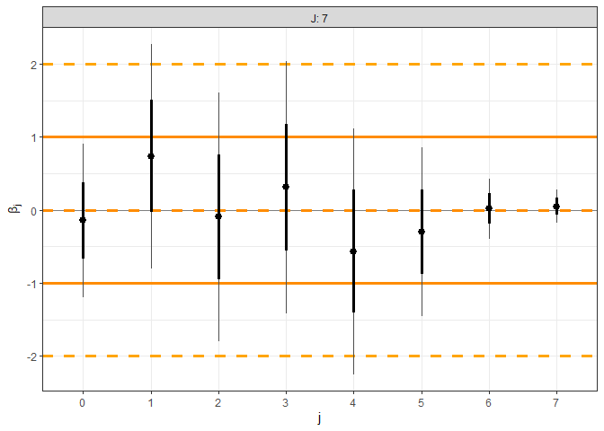<!-- -->

Let’s explicitly compare the posteriors between the two different prior
specifications.

``` r
post_beta_noisy_inform_summary %>% 
  mutate(prior_sd = 1) %>% 
  bind_rows(post_beta_noisy_diffuse_summary %>% 
              mutate(prior_sd = 25)) %>% 
  filter(J == 7) %>% 
  ggplot(mapping = aes(x = as.factor(beta_num))) +
  geom_hline(yintercept = 0,
             color = "grey50") +
  geom_hline(yintercept = c(-2, 2),
             color = "orange", linetype = "dashed",
             size = 1.25) +
  geom_hline(yintercept = c(-50, 50),
             color = "dodgerblue", linetype = "dashed",
             size = 1.25) +
  geom_linerange(mapping = aes(ymin = post_lwr_2,
                               ymax = post_upr_2,
                               group = interaction(param_num, 
                                                   J, 
                                                   prior_sd),
                               color = as.factor(prior_sd)),
                 size = 0.5,
                 position = position_dodge(0.25)) +
  geom_linerange(mapping = aes(ymin = post_lwr_1,
                               ymax = post_upr_1,
                               group = interaction(param_num, 
                                                   J,
                                                   prior_sd),
                               color = as.factor(prior_sd)),
                 size = 1.25,
                 position = position_dodge(0.25)) +
  geom_point(mapping = aes(y = post_mean,
                           group = interaction(param_num, 
                                               J,
                                               prior_sd),
                           color = as.factor(prior_sd)),
             size = 2.5,
             position = position_dodge(0.25)) +
  facet_wrap( ~ J, labeller = "label_both") +
  scale_color_brewer("Prior standard deviation", palette = "Set1") +
  labs(y = expression(beta[j]),
       x = "j") +
  theme_bw() +
  theme(legend.position = "top")
```

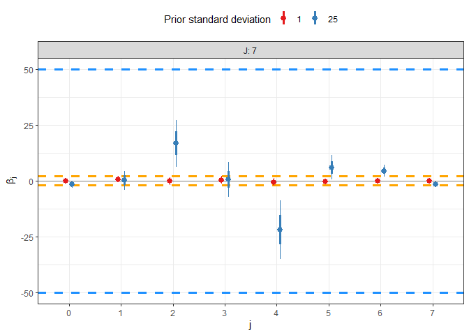<!-- -->

The prior standard deviation of 1 effectively “ruled out” the more
“extreme” parameter values. The parameters were “pulled” or **shrunk**
towards the prior mean. Because the prior is biasing parameters to be
around “regular” values the prior is sometimes called a **regularizing**
prior. The term *informative* is usually reserved for when Subject
Matter Experts (SMEs) agree on physically appropriate values for
parameters based on experience.

Let’s see the effect the *regularizing* prior on all of the parameters
across models. As shown below, the parameters now appear to “stabilize”
across the models. A particular parameter has consistent posterior
distributions across the models, rather than having substantial “swings”
in posterior distribution as the models grow in complexity.

``` r
post_beta_noisy_inform_summary %>% 
  ggplot(mapping = aes(x = as.factor(J))) +
  geom_hline(yintercept = 0, color = "grey50") +
  geom_linerange(mapping = aes(group = interaction(J, beta_name),
                               ymin = post_lwr_2,
                               ymax = post_upr_2),
                 color = "grey30", size = .5) +
  geom_linerange(mapping = aes(group = interaction(J, beta_name),
                               ymin = post_lwr_1,
                               ymax = post_upr_1),
                 color = "black", size = 1.25) +
  geom_point(mapping = aes(group = interaction(J, beta_name),
                           y = post_mean),
             color = "black", size = 2) +
  geom_hline(data = tibble::tibble(beta_name = sprintf("beta[%d]", 0:8),
                                   beta_true_val = c(beta_true, rep(0, 6))),
             mapping = aes(yintercept = beta_true_val),
             color = "red", linetype = "dashed") +
  facet_wrap(~beta_name, labeller = label_parsed,
             scales = "free") +
  labs(y = expression(beta)) +
  theme_bw()
```

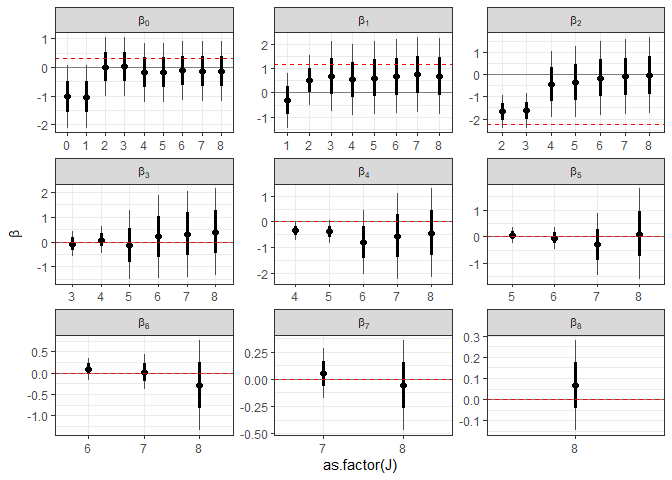<!-- -->

Let’s see the influence of the regularized prior on the posterior
predictions of the training set. Below, the set of prediction functions
we used to generate posterior predictions from Homework 05 are
redefined.

``` r
draw_post_samples <- function(approx_result, length_beta, num_samples)
{
  MASS::mvrnorm(n = num_samples, 
                mu = approx_result$mode, 
                Sigma = approx_result$var_matrix) %>% 
    as.data.frame() %>% tbl_df() %>% 
    purrr::set_names(c(sprintf("beta_%0d", 1:length_beta - 1), "phi")) %>% 
    mutate(sigma = exp(phi))
}

post_pred_samples <- function(Xnew, Bmat, sigma_vector)
{
  # number of new prediction locations
  M <- nrow(Xnew)
  # number of posterior samples
  S <- ncol(Bmat)
  
  # matrix of linear predictors
  Umat <- Xnew %*% Bmat
  
  # assmeble matrix of sigma samples
  Rmat <- matrix(rep(sigma_vector, M), M, byrow = TRUE)
  
  # generate standard normal and assemble into matrix
  Zmat <- matrix(rnorm(M*S), M, byrow = TRUE)
  
  # calculate the random observation predictions
  Ymat <- Umat + Rmat * Zmat
  
  # package together
  list(Umat = Umat, Ymat = Ymat)
}

calculate_pred_summary <- function(pred_mat, prob_level)
{
  # calculates quantiles
  lower_level <- (1 - prob_level)/2
  upper_level <- 1 - lower_level
  
  # calculate average and the lower/upper quantiles
  # of interest
  avg_val <- rowMeans(pred_mat)
  lwr_val <- apply(pred_mat, 1, stats::quantile, probs = lower_level)
  upr_val <- apply(pred_mat, 1, stats::quantile, probs = upper_level)
  
  # package together
  cbind(avg_val = avg_val, lwr_val = lwr_val, upr_val = upr_val)
}

predict_from_laplace <- function(mvn_result, test_matrix, num_post_samples, middle_unc_interval)
{
  # draw posterior samples
  post <- draw_post_samples(mvn_result, ncol(test_matrix), num_post_samples)
  
  # separate linear predictor and sigma samples
  post_beta <- post %>% select(starts_with("beta_")) %>% as.matrix()
  
  post_sigma <- post %>% pull(sigma)
  
  # make the posterior preditions
  preds <- post_pred_samples(test_matrix, t(post_beta), post_sigma)
  
  # summarize the linear predictor samples
  lin_pred_summary <- calculate_pred_summary(preds$Umat, prob_level = middle_unc_interval) %>% 
    as.data.frame() %>% tbl_df() %>% 
    purrr::set_names(c("mu_avg", "mu_lwr", "mu_upr")) %>% 
    tibble::rowid_to_column("pred_id")
  
  # summarize the observation prediction samples
  post_summary <- calculate_pred_summary(preds$Ymat, prob_level = middle_unc_interval) %>% 
    as.data.frame() %>% tbl_df() %>% 
    purrr::set_names(c("y_avg", "y_lwr", "y_upr")) %>% 
    tibble::rowid_to_column("pred_id")
  
  # package together
  lin_pred_summary %>% 
    left_join(post_summary, 
              by = "pred_id")
}

manage_poly_pred <- function(mvn_result, test_data, num_post_samples, middle_unc_interval)
{
  # set the polynomial order
  length_beta <- length(mvn_result$mode) - 1
  poly_order <- length_beta - 1
  
  # set the test matrix
  if(poly_order == 0){
    # define the intercept-only design matrix
    test_matrix <- model.matrix( ~ 1, test_data)
  } else {
    # polynomial design matrix
    test_matrix <- model.matrix( ~ poly(x, poly_order, raw = TRUE), test_data)
  }
  
  predict_from_laplace(mvn_result, test_matrix, num_post_samples, middle_unc_interval) %>% 
    mutate(J = poly_order)
}
```

The training set is predicted for each of the models in the code chunk
below.

``` r
set.seed(71432)
post_pred_train_noisy_inform <- purrr::map_dfr(fit_noisy_inform,
                                               manage_poly_pred,
                                               test_data = train_noisy,
                                               num_post_samples = 1e4,
                                               middle_unc_interval = 0.9)
```

The code chunk below visualizes the predictions from all models relative
to the training set responses in the response vs input style figure.
Each subplot corresponds to a separate model. How are the higher order
models behaving compared to the quadratic relationship?

``` r
post_pred_train_noisy_inform %>% 
  left_join(train_noisy %>% 
              rename(pred_id = obs_id, 
                     mu_true = mu,
                     y_obs = y),
            by = "pred_id") %>% 
  ggplot(mapping = aes(x = x)) +
  geom_linerange(mapping = aes(ymin = y_lwr,
                               ymax = y_upr,
                               group = interaction(pred_id, J)),
                 color = "grey30") +
  geom_linerange(mapping = aes(ymin = mu_lwr,
                               ymax = mu_upr,
                               group = interaction(pred_id, J)),
                 color = "steelblue", size = 1.85) +
  geom_point(mapping = aes(y = mu_avg),
             shape = 21, size = 2.25, color = "steelblue",
             fill = "white") +
  geom_point(mapping = aes(y = mu_true),
             shape = 0, color = "black") +
  geom_point(mapping = aes(y = y_obs),
             color = "red") +
  facet_wrap(~J, labeller = "label_both") +
  labs(y = "y") +
  theme_bw()
```

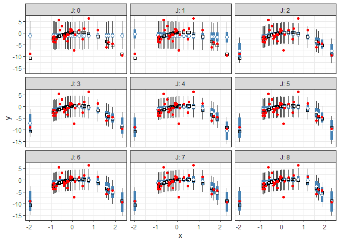<!-- -->

Let’s focus explicitly on the quadratic and 7th order models.

``` r
post_pred_train_noisy_inform %>% 
  left_join(train_noisy %>% 
              rename(pred_id = obs_id, 
                     mu_true = mu,
                     y_obs = y),
            by = "pred_id") %>% 
  filter(J %in% c(2, 7)) %>% 
  ggplot(mapping = aes(x = x)) +
  geom_linerange(mapping = aes(ymin = y_lwr,
                               ymax = y_upr,
                               group = interaction(pred_id, J)),
                 color = "grey30") +
  geom_linerange(mapping = aes(ymin = mu_lwr,
                               ymax = mu_upr,
                               group = interaction(pred_id, J)),
                 color = "steelblue", size = 1.85) +
  geom_point(mapping = aes(y = mu_avg),
             shape = 21, size = 2.25, color = "steelblue",
             fill = "white") +
  geom_point(mapping = aes(y = mu_true),
             shape = 0, color = "black") +
  geom_point(mapping = aes(y = y_obs),
             color = "red") +
  facet_wrap(~J, labeller = "label_both") +
  labs(y = "y") +
  theme_bw()
```

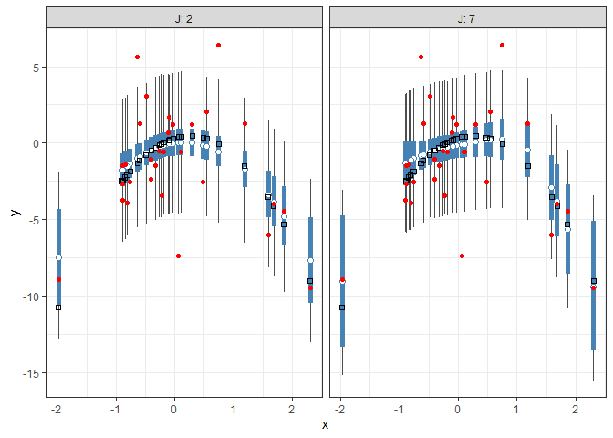<!-- -->

Although there is a difference between the two models, the 7th order
model is behaves consistent with the quadratic model. Most importantly,
the 7th order model is not following the *noisy* observations, as we had
seen with the diffuse prior. As a reminder, the code chunks below
generate the posterior predictions based on the diffuse prior models and
compares the diffuse with the regularized prior predictions for the 7th
order model.

``` r
set.seed(8102)
post_pred_train_noisy_diffuse <- purrr::map_dfr(fit_noisy_diffuse,
                                                manage_poly_pred,
                                                test_data = train_noisy,
                                                num_post_samples = 1e4,
                                                middle_unc_interval = 0.9)
```

``` r
post_pred_train_noisy_inform %>% 
  mutate(prior_sd = 1) %>% 
  bind_rows(post_pred_train_noisy_diffuse %>% 
              mutate(prior_sd = 25)) %>% 
  left_join(train_noisy %>% 
              rename(pred_id = obs_id, 
                     mu_true = mu,
                     y_obs = y),
            by = "pred_id") %>% 
  filter(J %in% c(7)) %>% 
  ggplot(mapping = aes(x = x)) +
  geom_linerange(mapping = aes(ymin = y_lwr,
                               ymax = y_upr,
                               group = interaction(pred_id, 
                                                   J,
                                                   prior_sd)),
                 color = "grey30") +
  geom_linerange(mapping = aes(ymin = mu_lwr,
                               ymax = mu_upr,
                               group = interaction(pred_id, 
                                                   J,
                                                   prior_sd)),
                 color = "steelblue", size = 1.85) +
  geom_point(mapping = aes(y = mu_avg),
             shape = 21, size = 2.25, color = "steelblue",
             fill = "white") +
  geom_point(mapping = aes(y = mu_true),
             shape = 0, color = "black") +
  geom_point(mapping = aes(y = y_obs),
             color = "red") +
  facet_wrap(~J + prior_sd, labeller = "label_both") +
  labs(y = "y") +
  theme_bw()
```

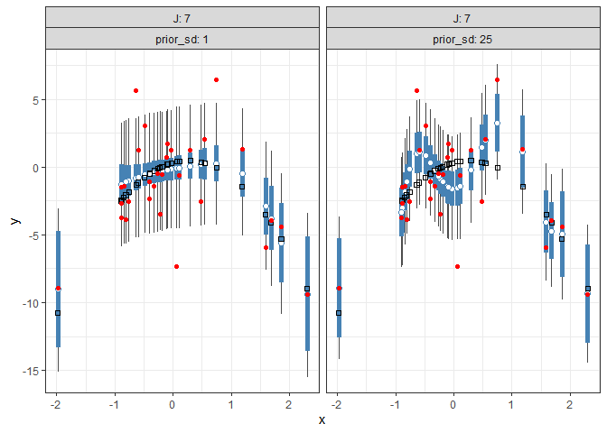<!-- -->

As shown in the figure above, by applying a **regularizing** prior to
the
 parameters, we are preventing the higher order
model from **overfitting** to the noisy observations\! Although not
exact, the regularized posterior predicted means are closer to the
*true* noise-free signal (the open black squares).

Let’s calculate the posterior model weights (probabiltiies) based on the
Laplace approximation to the marginal
likelihood.

``` r
model_evidence_noisy_inform <- purrr::map_dbl(fit_noisy_inform, "log_evidence")

exp(model_evidence_noisy_inform) / sum(exp(model_evidence_noisy_inform))
```

    ## [1] 0.0014500401 0.0009516373 0.6249967292 0.1688065759 0.1722787158
    ## [6] 0.0267714805 0.0041499524 0.0005275325 0.0000673364

Visualize the posterior model weights (probabilities) with a bar chart.
As shown below, the quadratic relationship is still considered the most
probable (the best) model, but several higher order relationships now
have non-negligible weight.

``` r
tibble::tibble(
  J = seq_along(model_evidence_noisy_inform) - 1,
  model_prob = exp(model_evidence_noisy_inform) / sum(exp(model_evidence_noisy_inform))
) %>% 
  ggplot(mapping = aes(x = as.factor(J),
                       y = model_prob)) +
  geom_bar(stat = "identity") + 
  coord_cartesian(ylim = c(0, 1)) +
  labs(y = "Posterior model probability") +
  theme_bw()
```

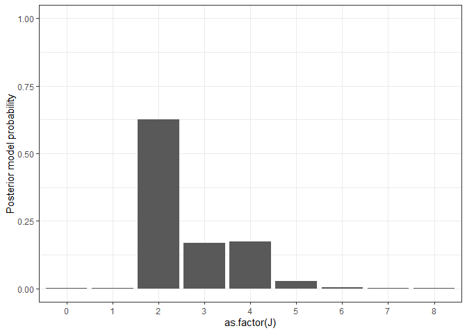<!-- -->

What happens if we would continue to decrease the prior standard
deviation? Would an even more regularizing prior “convert” our 7th order
model into the true quadratic relationship? Let’s try a prior standard
deviation of 0.04 and see what happens.

``` r
very_inform_hyper <- list(
  mu_beta = 0,
  tau_beta = 0.04,
  sigma_rate = 1
)

set.seed(8205)
fit_noisy_very_inform <- purrr::map(poly_try,
                                    manage_poly_fit,
                                    train_data = train_noisy,
                                    logpost_func = lm_logpost,
                                    add_info = very_inform_hyper)
```

Let’s now make posterior predictions of the training set.

``` r
set.seed(9146)
post_pred_train_noisy_very_inform <- purrr::map_dfr(fit_noisy_very_inform,
                                                    manage_poly_pred,
                                                    test_data = train_noisy,
                                                    num_post_samples = 1e4,
                                                    middle_unc_interval = 0.9)
```

And now compare the posterior predictions across the three different 7th
order models. As shown below, with the very small prior standard
deviation, the posterior means are essentially constant values when
 is between -1 and +1.

``` r
post_pred_train_noisy_inform %>% 
  mutate(prior_sd = 1) %>% 
  bind_rows(post_pred_train_noisy_diffuse %>% 
              mutate(prior_sd = 25)) %>% 
  bind_rows(post_pred_train_noisy_very_inform %>% 
              mutate(prior_sd = 0.04)) %>% 
  left_join(train_noisy %>% 
              rename(pred_id = obs_id, 
                     mu_true = mu,
                     y_obs = y),
            by = "pred_id") %>% 
  filter(J %in% c(7)) %>% 
  ggplot(mapping = aes(x = x)) +
  geom_linerange(mapping = aes(ymin = y_lwr,
                               ymax = y_upr,
                               group = interaction(pred_id, 
                                                   J,
                                                   prior_sd)),
                 color = "grey30") +
  geom_linerange(mapping = aes(ymin = mu_lwr,
                               ymax = mu_upr,
                               group = interaction(pred_id, 
                                                   J,
                                                   prior_sd)),
                 color = "steelblue", size = 1.85) +
  geom_point(mapping = aes(y = mu_avg),
             shape = 21, size = 2.25, color = "steelblue",
             fill = "white") +
  geom_point(mapping = aes(y = mu_true),
             shape = 0, color = "black") +
  geom_point(mapping = aes(y = y_obs),
             color = "red") +
  facet_wrap(~J + prior_sd, labeller = "label_both") +
  labs(y = "y") +
  theme_bw()
```

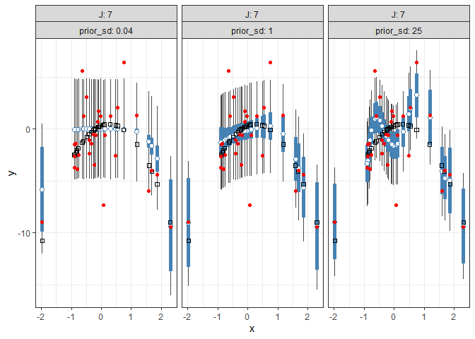<!-- -->

Let’s compare the posterior predictions for 4 separate polynomials when
the prior standard deviation is 0.04. The quadratic relationship’s
posterior mean is nearly constant. The variation in the observations is
mostly explained by the noise. The very regularizing prior is so overly
constraining the parameter values that we are now **underfitting** the
observations. The model results have high “bias” relative to the
observations due to the constraining prior.

``` r
post_pred_train_noisy_very_inform %>% 
  left_join(train_noisy %>% 
              rename(pred_id = obs_id, 
                     mu_true = mu,
                     y_obs = y),
            by = "pred_id") %>% 
  filter(J %in% c(0, 2, 3, 7)) %>% 
  ggplot(mapping = aes(x = x)) +
  geom_linerange(mapping = aes(ymin = y_lwr,
                               ymax = y_upr,
                               group = interaction(pred_id, J)),
                 color = "grey30") +
  geom_linerange(mapping = aes(ymin = mu_lwr,
                               ymax = mu_upr,
                               group = interaction(pred_id, J)),
                 color = "steelblue", size = 1.85) +
  geom_point(mapping = aes(y = mu_avg),
             shape = 21, size = 2.25, color = "steelblue",
             fill = "white") +
  geom_point(mapping = aes(y = mu_true),
             shape = 0, color = "black") +
  geom_point(mapping = aes(y = y_obs),
             color = "red") +
  facet_wrap(~J, labeller = "label_both") +
  labs(y = "y") +
  theme_bw()
```

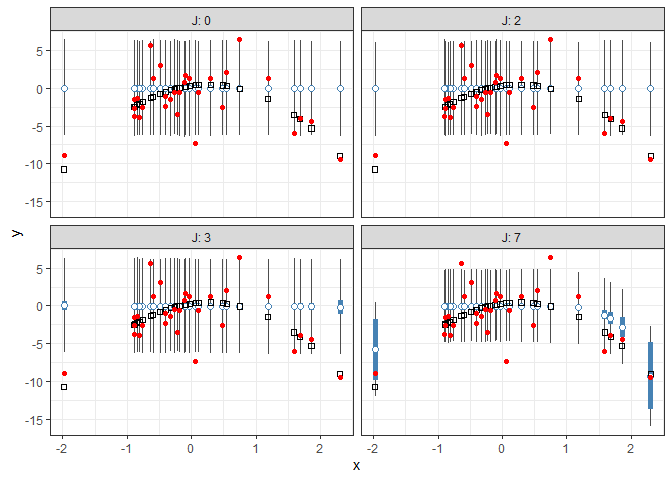<!-- -->

Let’s look at the parameter posterior summaries to understand what’s
driving this behavior. As shown below, the parameter values are now
similar across the different
models.

``` r
post_beta_noisy_very_inform_summary <- purrr::map2_dfr(seq_along(fit_noisy_very_inform),
                                                       fit_noisy_very_inform,
                                                       extract_beta_post_summaries)

post_beta_noisy_very_inform_summary %>% 
  ggplot(mapping = aes(x = as.factor(J))) +
  geom_hline(yintercept = 0, color = "grey50") +
  geom_linerange(mapping = aes(group = interaction(J, beta_name),
                               ymin = post_lwr_2,
                               ymax = post_upr_2),
                 color = "grey30", size = .5) +
  geom_linerange(mapping = aes(group = interaction(J, beta_name),
                               ymin = post_lwr_1,
                               ymax = post_upr_1),
                 color = "black", size = 1.25) +
  geom_point(mapping = aes(group = interaction(J, beta_name),
                           y = post_mean),
             color = "black", size = 2) +
  geom_hline(data = tibble::tibble(beta_name = sprintf("beta[%d]", 0:8),
                                   beta_true_val = c(beta_true, rep(0, 6))),
             mapping = aes(yintercept = beta_true_val),
             color = "red", linetype = "dashed") +
  facet_wrap(~beta_name, labeller = label_parsed, scales = "free_x") +
  labs(y = expression(beta)) +
  theme_bw()
```

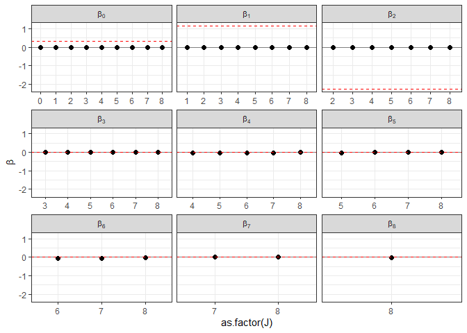<!-- -->

Allowing the y-axis to vary by facet reveals the differences occur only
in the highest order parameters. The lower order parameters are now all
basically zero.

``` r
post_beta_noisy_very_inform_summary %>% 
  ggplot(mapping = aes(x = as.factor(J))) +
  geom_hline(yintercept = 0, color = "grey50") +
  geom_linerange(mapping = aes(group = interaction(J, beta_name),
                               ymin = post_lwr_2,
                               ymax = post_upr_2),
                 color = "grey30", size = .5) +
  geom_linerange(mapping = aes(group = interaction(J, beta_name),
                               ymin = post_lwr_1,
                               ymax = post_upr_1),
                 color = "black", size = 1.25) +
  geom_point(mapping = aes(group = interaction(J, beta_name),
                           y = post_mean),
             color = "black", size = 2) +
  facet_wrap(~beta_name, labeller = label_parsed, scales = "free") +
  labs(y = expression(beta)) +
  theme_bw()
```

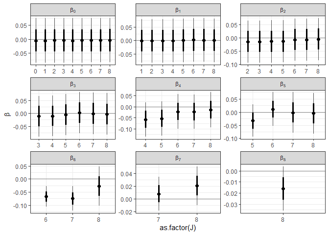<!-- -->

Comparing the posterior model weights in the underfit situation reveals
that the true relationship, the quadratic model, is no longer considered
to be the most probable model\! The prior is now so constraining that
only the most complex models have sufficient flexibility to overcome the
prior to provide any type of “fit” to the
observations.

``` r
model_evidence_noisy_very_inform <- purrr::map_dbl(fit_noisy_very_inform, "log_evidence")

exp(model_evidence_noisy_very_inform) / sum(exp(model_evidence_noisy_very_inform))
```

    ## [1] 0.001789837 0.001788382 0.001912589 0.001967527 0.005660040 0.007505390
    ## [7] 0.565260444 0.219304660 0.194811131

``` r
tibble::tibble(
  J = seq_along(model_evidence_noisy_very_inform) - 1,
  model_prob = exp(model_evidence_noisy_very_inform) / sum(exp(model_evidence_noisy_very_inform))
) %>% 
  ggplot(mapping = aes(x = as.factor(J),
                       y = model_prob)) +
  geom_bar(stat = "identity") + 
  coord_cartesian(ylim = c(0, 1)) +
  labs(y = "Posterior model probability") +
  theme_bw()
```

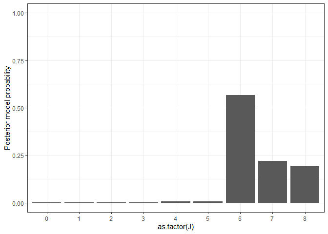<!-- -->

Which prior standard deviation should we use? If we do not have
sufficient belief to definitely set a truly informative prior, there are
several rules of thumb for setting “non-informative” or “weakly”
informative priors. By that, we wish to rule out “extreme” parameter
values, but allowing sufficient flexibility to capture trends if
necessary.

However, we could view the prior standard deviation as being an unknown
*hyperparameter*. It is considered a hyperparameter because the prior
standard deviation defines behavior of the model parameters,
. We could make a guess, but ultimately we need
to learn it’s value along with the other parameters. In a full Bayesian
framework we therefore need to define a *hyperprior* distribution for
the unknown hyperparameter,
.

Before setting that hyperprior, let’s continue studying the trends in
the results for different values of
. We will focus on a single polynomial order and study
the parameter posteriors and marginal likelihood performance as we vary
the prior standard deviation
.

``` r
study_prior_sd <- function(prior_sd, poly_order, train_data, logpost_func, add_info)
{
  add_info$tau_beta <- prior_sd
  
  # fit the model
  res <- manage_poly_fit(poly_order, train_data, logpost_func, add_info)
  
  # extract summaries on the beta parameters
  beta_post_summary <- extract_beta_post_summaries(poly_order + 1,
                                                   res)
  
  # extract summaries on the phi parameter
  phi_mean <- res$mode[poly_order + 1 + 1]
  phi_sd <- sqrt(diag(res$var_matrix))[poly_order + 1 + 1]
  
  # back transform quantiles to sigma quantiles
  sigma_median <- exp(phi_mean)
  sigma_q25 <- exp(qnorm(p = 0.25, mean = phi_mean, sd = phi_sd))
  sigma_q75 <- exp(qnorm(p = 0.75, mean = phi_mean, sd = phi_sd))
  
  # package together
  list(beta_post_summary = beta_post_summary %>% 
         mutate(tau_beta = prior_sd),
       log_evidence = res$log_evidence,
       J = poly_order,
       tau_beta = prior_sd,
       sigma_post_summary = tibble::tibble(sigma_q25 = sigma_q25,
                                           sigma_median = sigma_median,
                                           sigma_q75 = sigma_q75,
                                           tau_beta = prior_sd))
}
```

Try out multiple
 values, by setting the candidate values in the
log-space.

``` r
try_tau_beta <- exp(seq(log(0.02), log(50), length.out = 101))

start_hyper_info <- list(
  mu_beta = 0,
  sigma_rate = 1
)

post_results_vs_prior_sd <- purrr::map(try_tau_beta,
                                       study_prior_sd,
                                       poly_order = 7,
                                       train_data = train_noisy,
                                       logpost_func = lm_logpost,
                                       add_info = start_hyper_info)
```

Now, let’s visualize the posterior summaries on each
 parameter with respect to the prior standard
deviation,
, value. Based on the figure below, it appears that the
higher order parameters are somewhat leveling off as
 exceeds 20 to 30.

``` r
post_results_vs_prior_sd %>% 
  purrr::map_dfr("beta_post_summary") %>% 
  ggplot(mapping = aes(x = tau_beta)) +
  geom_hline(yintercept = 0,
             color = "navyblue",
             linetype = "dashed") +
  geom_ribbon(mapping = aes(ymin = post_lwr_2,
                            ymax = post_upr_2,
                            group = interaction(J, 
                                                beta_num)),
              fill = "black", alpha = 0.33) +
  geom_ribbon(mapping = aes(ymin = post_lwr_1,
                            ymax = post_upr_1,
                            group = interaction(J,
                                                beta_num)),
              fill = "black", alpha = 0.33) +
  geom_line(mapping = aes(y = post_mean,
                          group = interaction(J,
                                              beta_num)),
            color = "black") +
  facet_wrap( ~ beta_name, labeller = label_parsed,
              scales = "free") +
  labs(x = expression(tau[beta]),
       y = expression(beta[j])) +
  theme_bw()
```

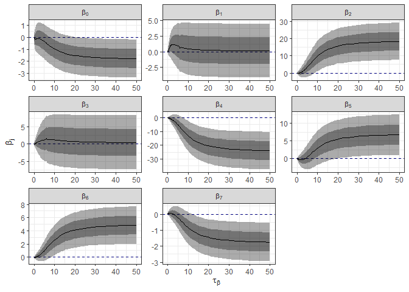<!-- -->

To help see what’s happening at the lower range of the prior standard
deviation plot the

posterior summaries with respect to the log transformed
 value.

``` r
post_results_vs_prior_sd %>% 
  purrr::map_dfr("beta_post_summary") %>% 
  ggplot(mapping = aes(x = log(tau_beta))) +
  geom_hline(yintercept = 0,
             color = "navyblue",
             linetype = "dashed") +
  geom_ribbon(mapping = aes(ymin = post_lwr_2,
                            ymax = post_upr_2,
                            group = interaction(J, 
                                                beta_num)),
              fill = "black", alpha = 0.33) +
  geom_ribbon(mapping = aes(ymin = post_lwr_1,
                            ymax = post_upr_1,
                            group = interaction(J,
                                                beta_num)),
              fill = "black", alpha = 0.33) +
  geom_line(mapping = aes(y = post_mean,
                          group = interaction(J,
                                              beta_num)),
            color = "black") +
  facet_wrap( ~ beta_name, labeller = label_parsed,
              scales = "free") +
  labs(x = expression("log["*tau[beta]*"]"),
       y = expression(beta[j])) +
  theme_bw()
```

<!-- -->

Following historical convention, rather than using the log of the prior
standard deviation, set the x-axis to the log of the prior precision. As
shown below, using this format allows the parameters to “start” at
non-zero values and then converge to zero as the prior standard
deviation becomes more constraining.

``` r
post_results_vs_prior_sd %>% 
  purrr::map_dfr("beta_post_summary") %>% 
  ggplot(mapping = aes(x = log(1/(tau_beta^2)))) +
  geom_hline(yintercept = 0,
             color = "navyblue",
             linetype = "dashed") +
  geom_ribbon(mapping = aes(ymin = post_lwr_2,
                            ymax = post_upr_2,
                            group = interaction(J, 
                                                beta_num)),
              fill = "black", alpha = 0.33) +
  geom_ribbon(mapping = aes(ymin = post_lwr_1,
                            ymax = post_upr_1,
                            group = interaction(J,
                                                beta_num)),
              fill = "black", alpha = 0.33) +
  geom_line(mapping = aes(y = post_mean,
                          group = interaction(J,
                                              beta_num)),
            color = "black") +
  facet_wrap( ~ beta_name, labeller = label_parsed,
              scales = "free") +
  labs(x = expression("log["*tau[beta]^{-2}*"]"),
       y = expression(beta[j])) +
  theme_bw()
```

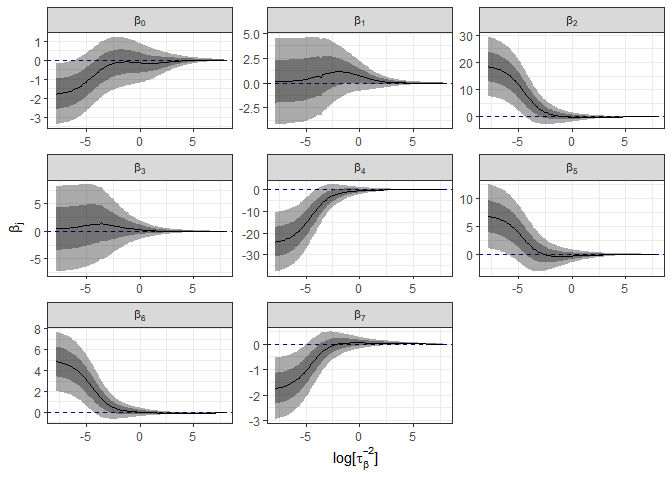<!-- -->

The figures help us see the *regularizing* or *penalizing* effect of the
prior standard deviation. Remember that the posterior on each

parameter is a compromise between the prior and the liklihood. Earlier
in the course, we discussed how the posterior mean is a precision
weighted average. As
 gets smaller, and thus the prior precision gets
larger, the posterior gets more tightly concentrated around the prior
mean of zero\! The prior precision is therefore dominating the data
precisions.

Let’s visualize the posterior summaries on the learned

parameter with respect to
. The figure below plots the posterior middle 50%
uncertainty interval on
 and
the posterior median with respect to the prior standard deviation. The
updated  median converges after the prior standard deviation exceeds
20. **Why is  highest for the smallest prior standard deviation values?**

``` r
post_results_vs_prior_sd %>% 
  purrr::map_dfr("sigma_post_summary") %>% 
  ggplot(mapping = aes(x = tau_beta)) +
  geom_ribbon(mapping = aes(ymin = sigma_q25,
                            ymax = sigma_q75),
              fill = "navyblue", alpha = 0.5) +
  geom_line(mapping = aes(y = sigma_median),
            color = "navyblue",
            size = 1.15) +
  labs(x = expression(tau[beta]),
       y = expression(sigma)) +
  theme_bw()
```

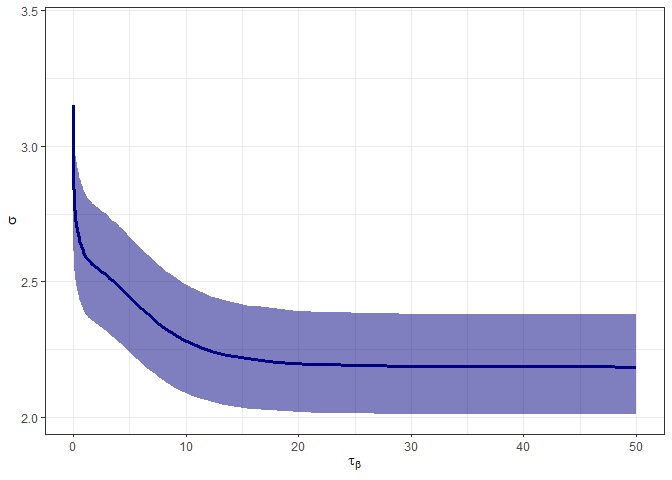<!-- -->

The 
value decreases rapidly as the prior standard deviation increases from
its lowest values. The figure below plots the

posterior summaries vs the log-transformed prior standard deviation to
help visualize that rapid change more easily.

``` r
post_results_vs_prior_sd %>% 
  purrr::map_dfr("sigma_post_summary") %>% 
  ggplot(mapping = aes(x = log(tau_beta))) +
  geom_ribbon(mapping = aes(ymin = sigma_q25,
                            ymax = sigma_q75),
              fill = "navyblue", alpha = 0.5) +
  geom_line(mapping = aes(y = sigma_median),
            color = "navyblue",
            size = 1.15) +
  labs(x = expression("log["*tau[beta]*"]"),
       y = expression(sigma)) +
  theme_bw()
```

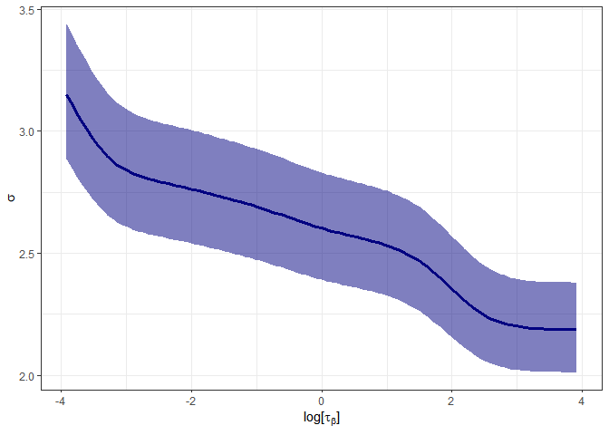<!-- -->

Let’s now visualize the model performance, based on the log marginal
likelihood with respect to the prior standard deviation.

``` r
tibble::tibble(
  log_evidence = purrr::map_dbl(post_results_vs_prior_sd, "log_evidence"),
  tau_beta = purrr::map_dbl(post_results_vs_prior_sd, "tau_beta"),
  J = purrr::map_dbl(post_results_vs_prior_sd, "J")
) %>% 
  ggplot(mapping = aes(x = tau_beta,
                       y = log_evidence)) +
  geom_line(size = 1.25) +
  facet_wrap( ~ J, labeller = "label_both") +
  labs(x = expression(tau[beta])) +
  theme_bw()
```

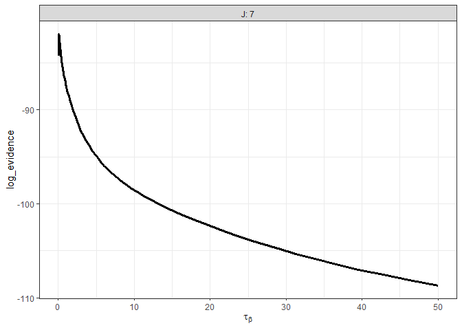<!-- -->

Plotting the log marginal likelihood with respect to the log of the
prior standard deviation, reveals that the maximum log marginal
likelihood occurs near a log prior standard deviation of about -2.5.

``` r
tibble::tibble(
  log_evidence = purrr::map_dbl(post_results_vs_prior_sd, "log_evidence"),
  tau_beta = purrr::map_dbl(post_results_vs_prior_sd, "tau_beta"),
  J = purrr::map_dbl(post_results_vs_prior_sd, "J")
) %>% 
  ggplot(mapping = aes(x = log(tau_beta),
                       y = log_evidence)) +
  geom_line(size = 1.25) +
  facet_wrap( ~ J, labeller = "label_both") +
  labs(x = expression("log["*tau[beta]*"]")) +
  theme_bw()
```

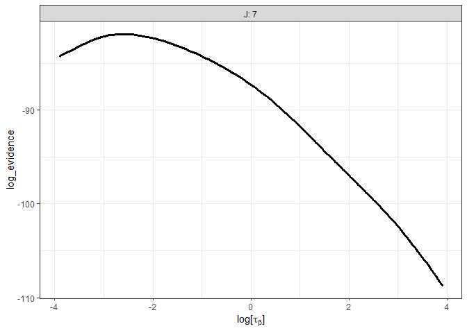<!-- -->

This “peak” performance however is only for a single model, the 7th
order relationship. Let’s see how the peak performance changes based
upon the model complexity. In the code chunk below a wrapper function is
created to store just the `log_evidence` values with respect to the
prior standard deviation for the different models.

``` r
manage_evidence_study_prior_sd <- function(prior_sd, poly_order, 
                                           train_data, logpost_func, add_info)
{
  res <- study_prior_sd(prior_sd, poly_order, train_data, logpost_func, add_info)
  
  res$sigma_post_summary %>% 
    mutate(log_evidence = res$log_evidence,
           J = res$J)
}
```

Evaluate the log marginal likelihood for all 9 models at the candidate
prior standard deviation values.

``` r
reg_grid_study <- expand.grid(poly_order = poly_try,
                              tau_beta = try_tau_beta,
                              KEEP.OUT.ATTRS = FALSE,
                              stringsAsFactors = FALSE) %>% 
  as.data.frame() %>% tbl_df()

model_prior_sd_study <- purrr::map2_dfr(reg_grid_study$tau_beta,
                                        reg_grid_study$poly_order,
                                        manage_evidence_study_prior_sd,
                                        train_data = train_noisy,
                                        logpost_func = lm_logpost,
                                        add_info = start_hyper_info)
```

Plot the log-evidence associated with each model with respect to the log
prior standard deviation.

``` r
model_prior_sd_study %>% 
  ggplot(mapping = aes(x = log(tau_beta),
                       y = log_evidence)) +
  geom_line(mapping = aes(group = J,
                          color = as.factor(J)),
            size = 1.2) +
  scale_color_viridis_d("J", option = "inferno") +
  labs(x = expression("log["*tau[beta]*"]")) +
  theme_bw() +
  theme(legend.position = "top") +
  guides(color = guide_legend(nrow = 1))
```

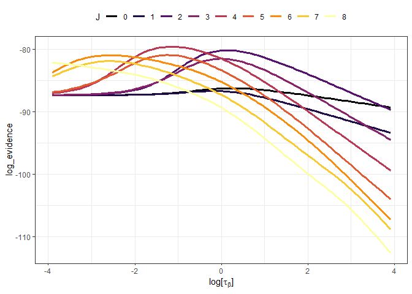<!-- -->

Zoom in on the y-axis.

``` r
model_prior_sd_study %>% 
  ggplot(mapping = aes(x = log(tau_beta),
                       y = log_evidence)) +
  geom_line(mapping = aes(group = J,
                          color = as.factor(J)),
            size = 1.2) +
  coord_cartesian(ylim = c(-90, -79)) +
  scale_color_viridis_d("J", option = "inferno") +
  labs(x = expression("log["*tau[beta]*"]")) +
  theme(legend.position = "top",
        panel.background = element_rect(fill = "grey70"),
        panel.grid = element_line(linetype = "dotted"),
        legend.key = element_rect(fill = "grey70")) +
  guides(color = guide_legend(nrow = 1))
```

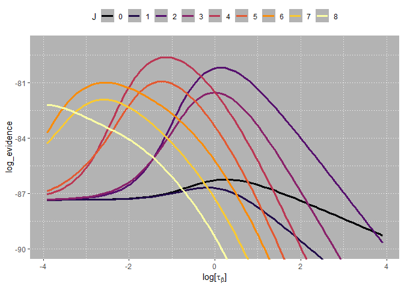<!-- -->

For reference, when we first studied this problem in terms of model
complexity, we used a prior standard deviation of 25. The red vertical
line in the figure below marks that specific value on the x-axis.

``` r
model_prior_sd_study %>% 
  ggplot(mapping = aes(x = log(tau_beta),
                       y = log_evidence)) +
  geom_vline(xintercept = log(25),
             color = "red",
             size = 1.15) +
  geom_line(mapping = aes(group = J,
                          color = as.factor(J)),
            size = 1.2) +
  coord_cartesian(ylim = c(-90, -79)) +
  scale_color_viridis_d("J", option = "inferno") +
  labs(x = expression("log["*tau[beta]*"]")) +
  theme(legend.position = "top",
        panel.background = element_rect(fill = "grey70"),
        panel.grid = element_line(linetype = "dotted"),
        legend.key = element_rect(fill = "grey70")) +
  guides(color = guide_legend(nrow = 1))
```

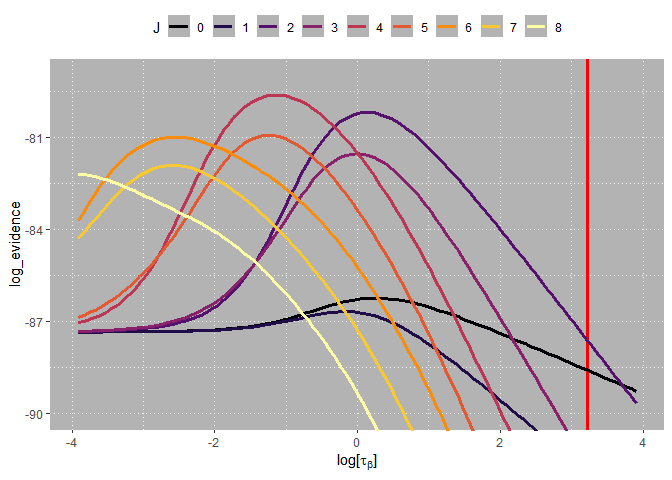<!-- -->

Let’s see how the marginal likelihood based comparisons relate to the
performance metrics such as root mean square error (RMSE), mean absolute
error (MAE), and Bayesian R-squared. Since the marginal likelihood gives
us a sense of how well the model *generalizes*, we will compare the
performance metrics on both the training set and a hold-out test set. We
will use the remaining 70 observations as the hold-out set. In addition
to RMSE and MAE, we will also calculate the **deviance**, which is
defined as negative 2 times the log-likelihood:

  
![ 
\\mathrm{Deviance} = -2 \\times \\sum\_{n=1}^{N} \\left( \\log
\\left\[y\_n \\mid \\mu\_n, \\sigma \\right\] \\right)
](https://latex.codecogs.com/png.latex?%20%0A%5Cmathrm%7BDeviance%7D%20%3D%20-2%20%5Ctimes%20%5Csum_%7Bn%3D1%7D%5E%7BN%7D%20%5Cleft%28%20%5Clog%20%5Cleft%5By_n%20%5Cmid%20%5Cmu_n%2C%20%5Csigma%20%5Cright%5D%20%5Cright%29%0A
" 
\\mathrm{Deviance} = -2 \\times \\sum_{n=1}^{N} \\left( \\log \\left[y_n \\mid \\mu_n, \\sigma \\right] \\right)
")  

The code chunks below define the hold-out set and then create several
functions for evaluating the performance metrics.

``` r
holdout_noisy <- noisy_df %>% 
  tibble::rowid_to_column("obs_id") %>% 
  filter(obs_id > nrow(train_noisy)) %>% 
  select(-obs_id)
```

``` r
calc_deviance <- function(mu, sigma, yobs)
{
  -2 * sum(dnorm(x = yobs,
                 mean = as.vector(mu),
                 sd = sigma,
                 log = TRUE))
}

post_performance_summarize <- function(Xnew, Bmat, sigma_vector, y_ref)
{
  # matrix of linear predictors
  Umat <- Xnew %*% Bmat
  
  # number of new prediction locations
  M <- nrow(Xnew)
  
  # number of posterior samples
  S <- ncol(Bmat)
  
  # create the matrix of observed target values to compare to
  RefMat <- t(matrix(rep(y_ref, S), S, byrow = TRUE))
  
  # calculate the errors
  mu_errors_mat <- RefMat - Umat
  
  # summarize the linear predictor errors - calculate RMSE and MAE
  # each column is a separate posterior sample, so first need to 
  # summarize across the rows (the observations)
  mu_rmse_vec <- sqrt(colMeans(mu_errors_mat^2))
  mu_mae_vec <- colMeans(abs(mu_errors_mat))
  
  mu_rmse_avg <- mean(mu_rmse_vec)
  mu_rmse_q25 <- quantile(mu_rmse_vec, 0.25)
  mu_rmse_q75 <- quantile(mu_rmse_vec, 0.75)
  mu_mae_avg <- mean(mu_mae_vec)
  mu_mae_q25 <- quantile(mu_mae_vec, 0.25)
  mu_mae_q75 <- quantile(mu_mae_vec, 0.75)
  
  # calculate the Bayes R-squared
  mu_var_vec <- apply(Umat, 2, var)
  error_var_vec <- apply(mu_errors_mat, 2, var)
  bayes_R2_vec <- mu_var_vec / (mu_var_vec + error_var_vec)
  
  mu_R2_avg <- mean(bayes_R2_vec)
  mu_R2_q25 <- quantile(bayes_R2_vec, 0.25)
  mu_R2_q75 <- quantile(bayes_R2_vec, 0.75)
  
  # calculate the deviance associated with each posterior sample
  # of the parameters
  dev_vec <- purrr::map2_dbl(as.data.frame(Umat),
                             sigma_vector,
                             calc_deviance,
                             yobs = y_ref) %>% 
    as.vector()
  
  # summarize the deviance
  dev_avg <- mean(dev_vec)
  dev_q25 <- quantile(dev_vec, 0.25)
  dev_q75 <- quantile(dev_vec, 0.75)
  
  # package together
  tibble::tibble(
    metric_name = c("RMSE", "MAE", "R2", "Deviance"),
    metric_avg = c(mu_rmse_avg, mu_mae_avg, mu_R2_avg, dev_avg),
    metric_q25 = c(mu_rmse_q25, mu_mae_q25, mu_R2_q25, dev_q25),
    metric_q75 = c(mu_rmse_q75, mu_mae_q75, mu_R2_q75, dev_q75)
  )
}

manage_performance_study <- function(prior_sd, poly_order, 
                                     train_data, test_data, 
                                     logpost_func, add_info,
                                     num_post_samples)
{
  add_info$tau_beta <- prior_sd
  
  # fit the model
  res <- manage_poly_fit(poly_order, train_data, logpost_func, add_info)
  
  # draw posterior samples
  post <- draw_post_samples(res, length(res$mode) - 1, num_post_samples)
  
  # separate linear predictor and sigma samples
  post_beta <- post %>% select(starts_with("beta_")) %>% as.matrix()
  
  post_sigma <- post %>% pull(sigma)
  
  # create the input matrices
  if(poly_order == 0){
    design_matrix <- model.matrix( ~ 1, train_data)
    test_matrix <- model.matrix( ~ 1, test_data)
  } else {
    design_matrix <- model.matrix( ~ poly(x, poly_order, raw = TRUE), train_data)
    test_matrix <- model.matrix( ~ poly(x, poly_order, raw = TRUE), test_data)
  }
  
  perform_train <- post_performance_summarize(design_matrix, t(post_beta), post_sigma, 
                                              train_data$y)
  
  perform_test <- post_performance_summarize(test_matrix, t(post_beta), post_sigma, 
                                              test_data$y)
  
  perform_train %>% 
    mutate(type = "training set") %>% 
    bind_rows(perform_test %>% 
                mutate(type = "hold-out set")) %>% 
    mutate(J = poly_order,
           tau_beta = prior_sd)
}
```

Execute the performance metrics studyfor the combinations of prior
standard deviation values and models.

``` r
reg_grid_small <- expand.grid(poly_order = poly_try,
                              tau_beta = exp(seq(log(0.02), log(50), length.out = 25)),
                              KEEP.OUT.ATTRS = FALSE,
                              stringsAsFactors = FALSE) %>% 
  as.data.frame() %>% tbl_df()

set.seed(81231)
model_regularize_perform_study <- purrr::map2_dfr(reg_grid_small$tau_beta,
                                                  reg_grid_small$poly_order,
                                                  manage_performance_study,
                                                  train_data = train_noisy,
                                                  test_data = holdout_noisy,
                                                  logpost_func = lm_logpost,
                                                  add_info = start_hyper_info,
                                                  num_post_samples = 1e3)
```

Let’s start out by plotting the RMSE with respect to the log of the
prior standard deviation for each model. We want to compare the metrics
as calculated on the hold-out set with the that calculating on the
training set.

``` r
model_regularize_perform_study %>% 
  filter(metric_name == "RMSE") %>% 
  ggplot(mapping = aes(x = log(tau_beta))) +
  geom_ribbon(mapping = aes(ymin = metric_q25,
                            ymax = metric_q75,
                            group = interaction(metric_name,
                                                type,
                                                J),
                            fill = type),
              alpha = 0.33) +
  geom_line(mapping = aes(y = metric_avg,
                          group = interaction(metric_name,
                                              type,
                                              J),
                          color = type)) +
  facet_wrap( ~ J, labeller = "label_both", scales = "free_y") +
  scale_color_brewer("Calculated relative to", palette = "Set1") +
  scale_fill_brewer("Calculated relative to", palette = "Set1") +
  labs(x = expression("log["*tau[beta]*"]"),
       y = "RMSE") +
  theme_bw() +
  theme(legend.position = "top")
```

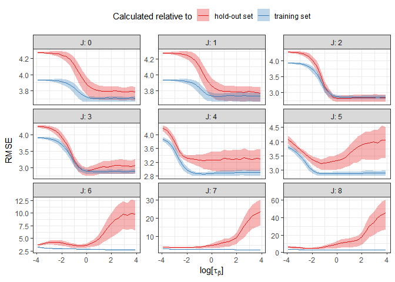<!-- -->

To understand what’s going on with the higher order models, let’s focus
on two specific prior standard deviation values and plot the RMSE with
respect to the polynomial order.

``` r
model_regularize_perform_study %>% 
  filter(near(tau_beta, 1) | near(tau_beta, 10, 0.3)) %>% 
  filter(metric_name == "RMSE") %>% 
  ggplot(mapping = aes(x = J)) +
  geom_ribbon(mapping = aes(ymin = metric_q25,
                            ymax = metric_q75,
                            group = interaction(metric_name,
                                                type,
                                                tau_beta),
                            fill = type),
              alpha = 0.33) +
  geom_line(mapping = aes(y = metric_avg,
                          group = interaction(metric_name,
                                              type,
                                              tau_beta),
                          color = type)) +
  facet_wrap( ~ tau_beta, labeller = label_bquote(.(sprintf("prior_sd = %1.2f", tau_beta))), 
              scales = "free_y") +
  scale_color_brewer("Calculated relative to", palette = "Set1") +
  scale_fill_brewer("Calculated relative to", palette = "Set1") +
  labs(x = "J",
       y = "RMSE") +
  theme_bw() +
  theme(legend.position = "top")
```

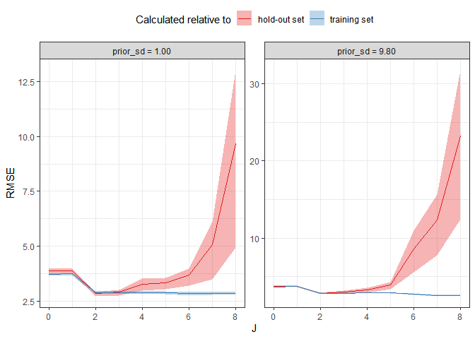<!-- -->

Zoom in on the y-axis. **What’s happening with the RMSE error on the
training set compared with the hold-out set?**

``` r
model_regularize_perform_study %>% 
  filter(near(tau_beta, 1) | near(tau_beta, 10, 0.3)) %>% 
  filter(metric_name == "RMSE") %>% 
  ggplot(mapping = aes(x = J)) +
  geom_ribbon(mapping = aes(ymin = metric_q25,
                            ymax = metric_q75,
                            group = interaction(metric_name,
                                                type,
                                                tau_beta),
                            fill = type),
              alpha = 0.33) +
  geom_line(mapping = aes(y = metric_avg,
                          group = interaction(metric_name,
                                              type,
                                              tau_beta),
                          color = type)) +
  coord_cartesian(ylim = c(0, 11)) +
  facet_wrap( ~ tau_beta, labeller = label_bquote(.(sprintf("prior_sd = %1.2f", tau_beta)))) +
  scale_color_brewer("Calculated relative to", palette = "Set1") +
  scale_fill_brewer("Calculated relative to", palette = "Set1") +
  labs(x = "J",
       y = "RMSE") +
  theme_bw() +
  theme(legend.position = "top")
```

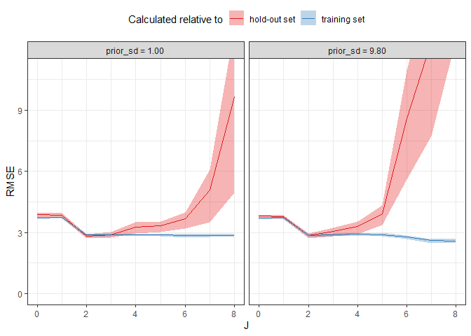<!-- -->

Let’s check the performance of Bayesian R-squared.

``` r
model_regularize_perform_study %>% 
  filter(metric_name == "R2") %>% 
  ggplot(mapping = aes(x = log(tau_beta))) +
  geom_ribbon(mapping = aes(ymin = metric_q25,
                            ymax = metric_q75,
                            group = interaction(metric_name,
                                                type,
                                                J),
                            fill = type),
              alpha = 0.33) +
  geom_line(mapping = aes(y = metric_avg,
                          group = interaction(metric_name,
                                              type,
                                              J),
                          color = type)) +
  coord_cartesian(ylim = c(0, 1)) +
  facet_wrap( ~ J, labeller = "label_both") +
  scale_color_brewer("Calculated relative to", palette = "Set1") +
  scale_fill_brewer("Calculated relative to", palette = "Set1") +
  labs(x = expression("log["*tau[beta]*"]"),
       y = "R-squared") +
  theme_bw() +
  theme(legend.position = "top")
```

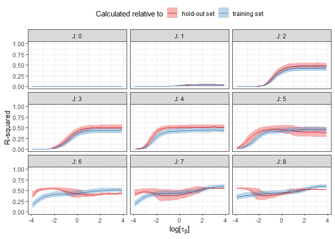<!-- -->

When visualizing the Deviance, it’s important to note that the Deviance
is a sum. So it will be impacted by the number of samples. So let’s
break up the Deviance into the training set based calculation first.

``` r
model_regularize_perform_study %>% 
  filter(metric_name == "Deviance") %>% 
  filter(type == "training set") %>% 
  ggplot(mapping = aes(x = log(tau_beta))) +
  geom_ribbon(mapping = aes(ymin = metric_q25,
                            ymax = metric_q75,
                            group = interaction(metric_name,
                                                type,
                                                J)),
              alpha = 0.33) +
  geom_line(mapping = aes(y = metric_avg,
                          group = interaction(metric_name,
                                              type,
                                              J))) +
  facet_wrap( ~ J, labeller = "label_both", scales = "free_y") +
  labs(x = expression("log["*tau[beta]*"]"),
       y = "Training set Deviance") +
  theme_bw() +
  theme(legend.position = "top")
```

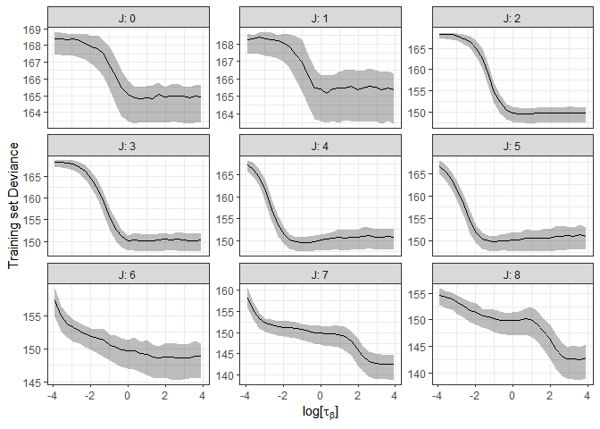<!-- -->

And then the **out-of-sample** or hold-out set based Deviance. **How
does the Deviance behave with the higher order models when considering
the hold-out dataset compared with the training set?**

``` r
model_regularize_perform_study %>% 
  filter(metric_name == "Deviance") %>% 
  filter(type == "hold-out set") %>% 
  ggplot(mapping = aes(x = log(tau_beta))) +
  geom_ribbon(mapping = aes(ymin = metric_q25,
                            ymax = metric_q75,
                            group = interaction(metric_name,
                                                type,
                                                J)),
              alpha = 0.33) +
  geom_line(mapping = aes(y = metric_avg,
                          group = interaction(metric_name,
                                              type,
                                              J))) +
  facet_wrap( ~ J, labeller = "label_both", scales = "free_y") +
  labs(x = expression("log["*tau[beta]*"]"),
       y = "Hold-out set Deviance") +
  theme_bw() +
  theme(legend.position = "top")
```

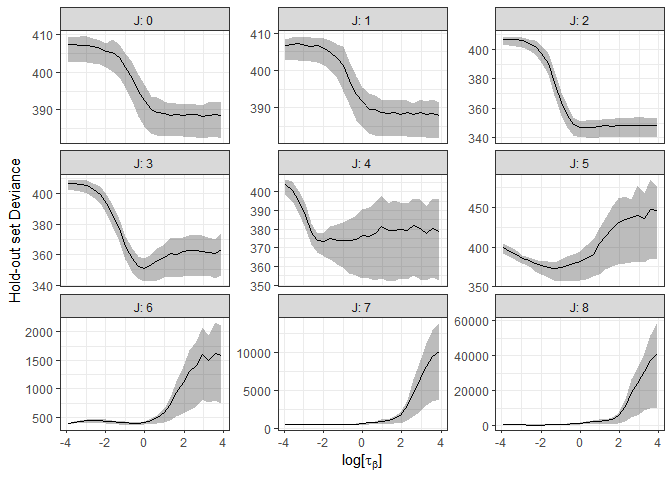<!-- -->

Let’s compare the models directly at two specific prior standard
deviation values.

``` r
model_regularize_perform_study %>% 
  filter(near(tau_beta, 1) | near(tau_beta, 10, 0.3)) %>% 
  filter(metric_name == "Deviance") %>% 
  ggplot(mapping = aes(x = J)) +
  geom_ribbon(mapping = aes(ymin = metric_q25,
                            ymax = metric_q75,
                            group = interaction(metric_name,
                                                type,
                                                tau_beta),
                            fill = type),
              alpha = 0.33) +
  geom_line(mapping = aes(y = metric_avg,
                          group = interaction(metric_name,
                                              type,
                                              tau_beta),
                          color = type)) +
  facet_grid(type ~ tau_beta, labeller = label_bquote(cols = .(sprintf("prior_sd = %1.2f", tau_beta)),
                                                      rows = .(type)),
              scales = "free_y") +
  scale_color_brewer(guide = FALSE, palette = "Set1") +
  scale_fill_brewer(guide = FALSE, palette = "Set1") +
  labs(x = "J",
       y = "Deviance") +
  theme_bw() +
  theme(legend.position = "top")
```

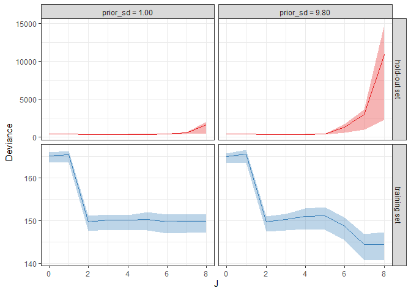<!-- -->

Let’s now visualize the performance metrics with respect to both the log
of the prior standard deviation and the polynomial order,
. We will only consider
the hold-out set based metrics. The figure below plots all of the
ribbons of the posterior RMSE. The models are denoted by the first 5
models, and then all models greater than the 4th order model

``` r
model_regularize_perform_study %>% 
  filter(metric_name == "RMSE") %>% 
  filter(type == "hold-out set") %>% 
  ggplot(mapping = aes(x = log(tau_beta))) +
  geom_ribbon(mapping = aes(ymin = metric_q25,
                            ymax = metric_q75,
                            group = interaction(metric_name,
                                                type,
                                                J),
                            fill = ifelse(J > 4,
                                         "J > 4",
                                         as.character(J))),
              alpha = 0.33) +
  geom_line(mapping = aes(y = metric_avg,
                          group = interaction(metric_name,
                                              type,
                                              J),
                          color = ifelse(J > 4,
                                         "J > 4",
                                         as.character(J)))) +
  coord_cartesian(ylim = c(2, 7)) +
  scale_color_viridis_d("J", option = "magma") +
  scale_fill_viridis_d("J", option = "magma") +
  labs(x = expression("log["*tau[beta]*"]"),
       y = "Hold-out set RMSE") +
  theme(legend.position = "top",
        panel.background = element_rect(fill = "grey70"),
        panel.grid.major = element_line(linetype = "dotted"),
        panel.grid.minor = element_blank(),
        legend.key = element_rect(fill = "grey70")) +
  guides(color = guide_legend(nrow = 1),
         fill = guide_legend(nrow = 1))
```

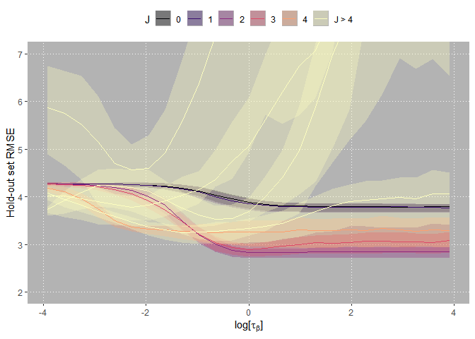<!-- -->

The figure below zooms in to focus on the
![\\log\\left\[\\tau\_{\\beta}\\right\]](https://latex.codecogs.com/png.latex?%5Clog%5Cleft%5B%5Ctau_%7B%5Cbeta%7D%5Cright%5D
"\\log\\left[\\tau_{\\beta}\\right]") values between -2 and +2. The
y-axis is also zoomed in to help identify the minimum RMSE a little
easier.

``` r
model_regularize_perform_study %>% 
  filter(metric_name == "RMSE") %>% 
  filter(type == "hold-out set") %>% 
  ggplot(mapping = aes(x = log(tau_beta))) +
  geom_ribbon(mapping = aes(ymin = metric_q25,
                            ymax = metric_q75,
                            group = interaction(metric_name,
                                                type,
                                                J),
                            fill = ifelse(J > 4,
                                         "J > 4",
                                         as.character(J))),
              alpha = 0.33) +
  geom_line(mapping = aes(y = metric_avg,
                          group = interaction(metric_name,
                                              type,
                                              J),
                          color = ifelse(J > 4,
                                         "J > 4",
                                         as.character(J)))) +
  coord_cartesian(xlim = c(-2, 2), ylim = c(2.5, 4.5)) +
  scale_color_viridis_d("J", option = "magma") +
  scale_fill_viridis_d("J", option = "magma") +
  labs(x = expression("log["*tau[beta]*"]"),
       y = "Hold-out set RMSE") +
  theme(legend.position = "top",
        panel.background = element_rect(fill = "grey70"),
        panel.grid.major = element_line(linetype = "dotted"),
        panel.grid.minor = element_blank(),
        legend.key = element_rect(fill = "grey70")) +
  guides(color = guide_legend(nrow = 1),
         fill = guide_legend(nrow = 1))
```

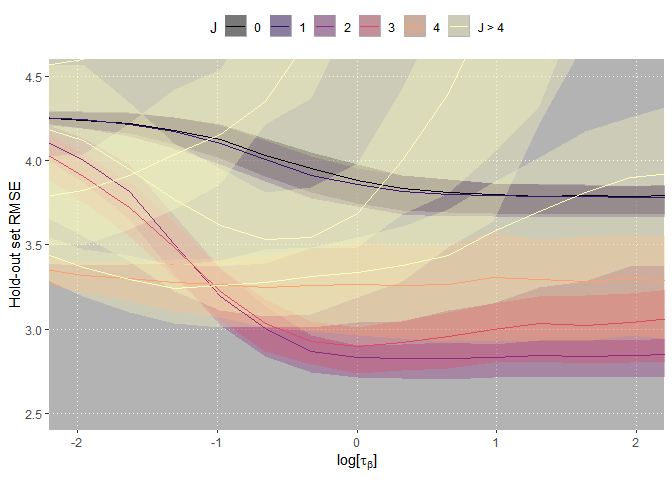<!-- -->

It’s probably still a little challenging to see which model has the
lowest hold-out set RMSE. Let’s focus on the posterior mean RMSE, and
visualize it has on as a surface. The `x` aesthetic below is the log of
the prior standard deviation and the `y` aesthetic is the polynomial
order. The `fill` aesthetic is set equal to the posterior mean RMSE. The
max limit on the color is set to 7, therefore any RMSE greater than 7 is
plotted as a grey area in the figure below.

``` r
model_regularize_perform_study %>% 
  filter(metric_name == "RMSE") %>% 
  ggplot(mapping = aes(x = log(tau_beta),
                       y = J)) +
  geom_raster(mapping = aes(fill = metric_avg)) +
  facet_wrap(~metric_name) +
  scale_fill_viridis_c("Hold-out\nMean",
                       limits = c(2, 7)) +
  scale_y_continuous(breaks = poly_try) +
  theme_bw()
```

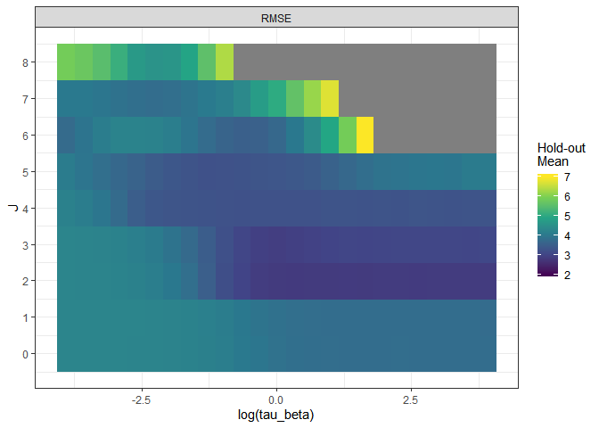<!-- -->

Let’s step into the math for a bit to see where the behavior comes from.
We discussed the posterior on the
 parameters when the likelihood noise,
, was
known. We derived the posterior mean and posterior covariance matrix
when the prior was infinitely diffuse and we discussed the result with
an informative prior. Let’s consider the notation of the *regularizing*
prior that we have been working with in today’s lecture. The
log-posterior on the
 parameters up to a normalizing constant is:

  
![ 
\\log \\left\[ p\\left( \\boldsymbol{\\beta} \\mid \\mathbf{y},
\\mathbf{X}, \\sigma \\right) \\right\] \\propto \\log \\left\[ p
\\left( \\mathbf{y} \\mid \\mathbf{X}, \\boldsymbol{\\beta}, \\sigma
\\right) \\right\] + \\log \\left\[ p \\left( \\boldsymbol{\\beta}
\\right) \\right\]
](https://latex.codecogs.com/png.latex?%20%0A%5Clog%20%5Cleft%5B%20p%5Cleft%28%20%5Cboldsymbol%7B%5Cbeta%7D%20%5Cmid%20%5Cmathbf%7By%7D%2C%20%5Cmathbf%7BX%7D%2C%20%5Csigma%20%5Cright%29%20%5Cright%5D%20%5Cpropto%20%5Clog%20%5Cleft%5B%20p%20%5Cleft%28%20%5Cmathbf%7By%7D%20%5Cmid%20%5Cmathbf%7BX%7D%2C%20%5Cboldsymbol%7B%5Cbeta%7D%2C%20%5Csigma%20%5Cright%29%20%5Cright%5D%20%2B%20%5Clog%20%5Cleft%5B%20p%20%5Cleft%28%20%5Cboldsymbol%7B%5Cbeta%7D%20%5Cright%29%20%5Cright%5D%0A
" 
\\log \\left[ p\\left( \\boldsymbol{\\beta} \\mid \\mathbf{y}, \\mathbf{X}, \\sigma \\right) \\right] \\propto \\log \\left[ p \\left( \\mathbf{y} \\mid \\mathbf{X}, \\boldsymbol{\\beta}, \\sigma \\right) \\right] + \\log \\left[ p \\left( \\boldsymbol{\\beta} \\right) \\right]
")  

Assume our regularizing prior with independent zero mean Gaussians on
each of the
 linear predictor parameters:

  
 \\right)
")  

Write out the log-posterior for all terms involving the unknown
 parameters:

  
![ 
\\log \\left\[ p\\left( \\boldsymbol{\\beta} \\mid \\mathbf{y},
\\mathbf{X}, \\sigma, \\tau\_{\\beta} \\right) \\right\] \\propto
-\\frac{1}{2\\sigma^2} \\sum\_{n=1}^{N} \\left( \\left(y\_n -
\\mu\_n\\right)^2 \\right) - \\frac{1}{2\\tau\_{\\beta}^2}
\\sum\_{j=0}^{J} \\left( \\beta\_{j}^{2} \\right)
](https://latex.codecogs.com/png.latex?%20%0A%5Clog%20%5Cleft%5B%20p%5Cleft%28%20%5Cboldsymbol%7B%5Cbeta%7D%20%5Cmid%20%5Cmathbf%7By%7D%2C%20%5Cmathbf%7BX%7D%2C%20%5Csigma%2C%20%5Ctau_%7B%5Cbeta%7D%20%5Cright%29%20%5Cright%5D%20%5Cpropto%20-%5Cfrac%7B1%7D%7B2%5Csigma%5E2%7D%20%5Csum_%7Bn%3D1%7D%5E%7BN%7D%20%5Cleft%28%20%5Cleft%28y_n%20-%20%5Cmu_n%5Cright%29%5E2%20%5Cright%29%20-%20%5Cfrac%7B1%7D%7B2%5Ctau_%7B%5Cbeta%7D%5E2%7D%20%5Csum_%7Bj%3D0%7D%5E%7BJ%7D%20%5Cleft%28%20%5Cbeta_%7Bj%7D%5E%7B2%7D%20%5Cright%29%0A
" 
\\log \\left[ p\\left( \\boldsymbol{\\beta} \\mid \\mathbf{y}, \\mathbf{X}, \\sigma, \\tau_{\\beta} \\right) \\right] \\propto -\\frac{1}{2\\sigma^2} \\sum_{n=1}^{N} \\left( \\left(y_n - \\mu_n\\right)^2 \\right) - \\frac{1}{2\\tau_{\\beta}^2} \\sum_{j=0}^{J} \\left( \\beta_{j}^{2} \\right)
")  

Substitute in the expression for the
-th observation’s linear
predictor and rearrange the terms:

  
![ 
\\log \\left\[ p\\left( \\boldsymbol{\\beta} \\mid \\mathbf{y},
\\mathbf{X}, \\sigma, \\tau\_{\\beta} \\right) \\right\] \\propto
-\\frac{1}{2\\sigma^2} \\left( \\sum\_{n=1}^{N} \\left( \\left(y\_n -
\\mathbf{x}\_{n,:}\\boldsymbol{\\beta} \\right)^2 \\right) + \\left(
\\frac{\\sigma}{\\tau\_{\\beta}} \\right)^2 \\sum\_{j=0}^{J} \\left(
\\beta\_{j}^{2} \\right) \\right)
](https://latex.codecogs.com/png.latex?%20%0A%5Clog%20%5Cleft%5B%20p%5Cleft%28%20%5Cboldsymbol%7B%5Cbeta%7D%20%5Cmid%20%5Cmathbf%7By%7D%2C%20%5Cmathbf%7BX%7D%2C%20%5Csigma%2C%20%5Ctau_%7B%5Cbeta%7D%20%5Cright%29%20%5Cright%5D%20%5Cpropto%20-%5Cfrac%7B1%7D%7B2%5Csigma%5E2%7D%20%5Cleft%28%20%5Csum_%7Bn%3D1%7D%5E%7BN%7D%20%5Cleft%28%20%5Cleft%28y_n%20-%20%5Cmathbf%7Bx%7D_%7Bn%2C%3A%7D%5Cboldsymbol%7B%5Cbeta%7D%20%5Cright%29%5E2%20%5Cright%29%20%2B%20%5Cleft%28%20%5Cfrac%7B%5Csigma%7D%7B%5Ctau_%7B%5Cbeta%7D%7D%20%5Cright%29%5E2%20%20%5Csum_%7Bj%3D0%7D%5E%7BJ%7D%20%5Cleft%28%20%5Cbeta_%7Bj%7D%5E%7B2%7D%20%5Cright%29%20%5Cright%29%0A
" 
\\log \\left[ p\\left( \\boldsymbol{\\beta} \\mid \\mathbf{y}, \\mathbf{X}, \\sigma, \\tau_{\\beta} \\right) \\right] \\propto -\\frac{1}{2\\sigma^2} \\left( \\sum_{n=1}^{N} \\left( \\left(y_n - \\mathbf{x}_{n,:}\\boldsymbol{\\beta} \\right)^2 \\right) + \\left( \\frac{\\sigma}{\\tau_{\\beta}} \\right)^2  \\sum_{j=0}^{J} \\left( \\beta_{j}^{2} \\right) \\right)
")  

The above expression reveals the **regularization** or **penalization**
term. The prior distribution will penalize the model fit based upon the
ratio of the noise variance to the prior variance. In non-Bayesian
formulations this regularization or penalty factor is denoted as
:

  
^2
")  

The above formulation is known as **Ridge Regression**. The penalty term
is the L2 penalty. However, other penalty terms can be used. A very
popular setup is known as **Lasso** which uses the L1 penalty:

  
^2 \\right) + \\left( \\frac{\\sigma}{\\tau_{\\beta}} \\right)^2  \\sum_{j=0}^{J} \\left| \\beta_{j} \\right| \\right)
")  

In both formulations, large values of the
 parameters will be penalized, encouraging the
parameters to be closer to “regular” values. The Lasso or L1 penalty
promotes values “locking” onto zero rather than asymptomatically
decreasing the parameters to zero as with the L2 penalty in Ridge
regression.
