Binary classification predictions
================
Dr. Joseph P. Yurko
11/25/2019

## Overview

In lecture, we discussed training and comparing models using the `caret`
package. We used the `Sonar` data set as our example Binary
classification problem. This markdown builds off the lectures by
demonstrating how to make predictions with the trained models and
visualize the results.

## Load packages

``` r
library(dplyr)
library(ggplot2)

library(caret)
library(plotROC)
```

## Read in data

Read in the `Sonar` data set from the `mlbench` package. Print the
dimensions to the screen.

``` r
data("Sonar", package = "mlbench")

Sonar %>% dim()
```

    ## [1] 208  61

## Exploratory visualizations

The Binary outcome of interest is the `Class` variable. Show the counts
of the two levels of `Class`:

``` r
Sonar %>% 
  ggplot(mapping = aes(x = Class)) +
  geom_bar() +
  theme_bw()
```

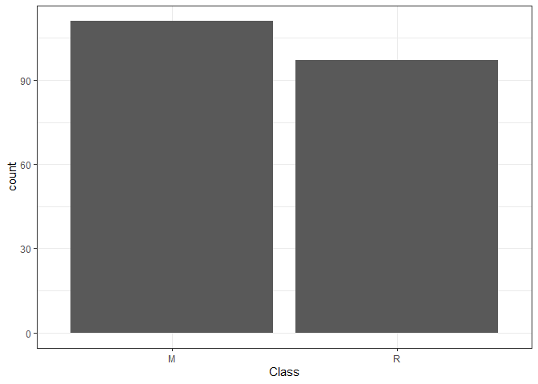<!-- -->

Summarize the 60 input features using boxplots. Perform a few name
manipulation operations first before generating the boxplots. The x-axis
in the figure below corresponds to an index associated with each input.
As shown below, all inputs are between 0 and 1, but not all inputs span
the complete range.

``` r
Sonar %>% 
  tibble::rowid_to_column("obs_id") %>% 
  tidyr::gather(key = "input_name",
                value = "input_value",
                -obs_id, -Class) %>% 
  mutate(input_id = stringr::str_extract(input_name, "\\d+")) %>% 
  mutate_at("input_id", as.numeric) %>% 
  tbl_df() %>% 
  ggplot(mapping = aes(x = input_id,
                       y = input_value)) +
  geom_boxplot(mapping = aes(group = input_id)) +
  theme_bw()
```

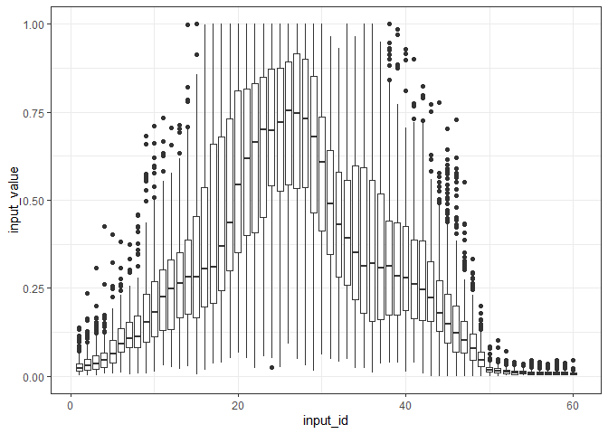<!-- -->

Visualize the input boxplots again, but this time break up by the levels
of `Class`. Although the figure below is rather busy, a few of the
inputs appear to show “separation” between the boxes associated with the
two levels of `Class`. Due to the large number of inputs, it’s difficult
to assess from a single figure if those inputs are key drivers for the
`M` level of `Class`. We will use predictive models to help us
understand the variable importance rankings.

``` r
Sonar %>% 
  tibble::rowid_to_column("obs_id") %>% 
  tidyr::gather(key = "input_name",
                value = "input_value",
                -obs_id, -Class) %>% 
  mutate(input_id = stringr::str_extract(input_name, "\\d+")) %>% 
  mutate_at("input_id", as.numeric) %>% 
  tbl_df() %>% 
  ggplot(mapping = aes(x = input_id,
                       y = input_value)) +
  geom_boxplot(mapping = aes(group = interaction(input_id,
                                                 Class),
                             fill = Class)) +
  scale_fill_brewer(palette = "Set1") +
  theme_bw()
```

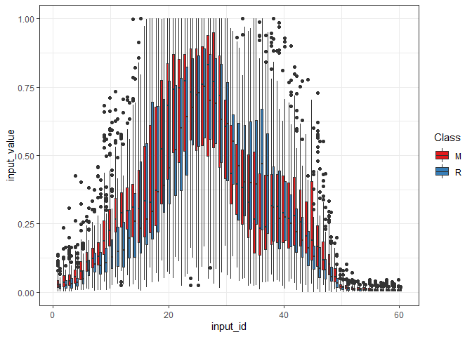<!-- -->

Before modeling, let’s check the correlation between the inputs using
`corrplot::corrplot()`. The code chunk below uses hierarchical
clustering to group highly correlated variables together. There seems to
be a correlation structure between many of the inputs.

``` r
Sonar %>% 
  select(-Class) %>% 
  cor() %>% 
  corrplot::corrplot(method = "square",
                     order = "hclust")
```

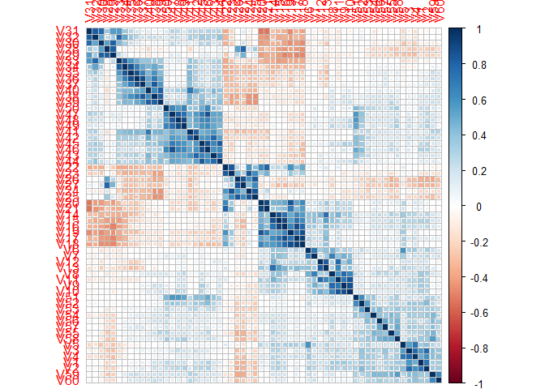<!-- -->

## Model training

Let’s now train several models. We will not train as many models as we
did in lecture. Instead, we focus on logistic regression, elastic net,
and random forest. You are free to try out other models, including SVMs,
neural networks, and boosted trees. In this example, we will simply use
the default search grids for the tuning parameters.

We must first specify the resampling scheme before we train any model.
We will use 5-fold cross-validation with 3 repeats. Our primary
performance metric will be the area under the ROC curve, and so the
`trainControl()` function must be specified with the correct
`summaryFunction`. We will also visualize the ROC curve averaged over
the different resamples, thus we will tell `caret` to save the fold
hold-out set predictions.

``` r
ctrl <- trainControl(method="repeatedcv", 
                     number = 5,
                     repeats = 3,
                     summaryFunction=twoClassSummary, 
                     classProbs=TRUE,
                     savePredictions = TRUE)
```

### Logistic regression

Fit a logistic regression model by setting `method = "glm"` in the
`train()` function call.

``` r
set.seed(4321)
fit_glm <- train(Class ~ ., data = Sonar, 
                 method = "glm", 
                 metric = "ROC",
                 trControl = ctrl)

fit_glm
```

    ## Generalized Linear Model 
    ## 
    ## 208 samples
    ##  60 predictor
    ##   2 classes: 'M', 'R' 
    ## 
    ## No pre-processing
    ## Resampling: Cross-Validated (5 fold, repeated 3 times) 
    ## Summary of sample sizes: 166, 167, 165, 167, 167, 166, ... 
    ## Resampling results:
    ## 
    ##   ROC        Sens       Spec     
    ##   0.7477375  0.7604743  0.6985965

### Elastic net

Fit a penalized regression model via elastic net by setting `method =
"glmnet"`.

``` r
set.seed(4321)
fit_glmnet <- train(Class ~ ., data = Sonar, 
                    method = "glmnet", 
                    metric = "ROC",
                    trControl = ctrl)

fit_glmnet
```

    ## glmnet 
    ## 
    ## 208 samples
    ##  60 predictor
    ##   2 classes: 'M', 'R' 
    ## 
    ## No pre-processing
    ## Resampling: Cross-Validated (5 fold, repeated 3 times) 
    ## Summary of sample sizes: 166, 167, 165, 167, 167, 166, ... 
    ## Resampling results across tuning parameters:
    ## 
    ##   alpha  lambda        ROC        Sens       Spec     
    ##   0.10   0.0004318733  0.8388274  0.7905138  0.7354386
    ##   0.10   0.0043187332  0.8532609  0.7967062  0.7491228
    ##   0.10   0.0431873324  0.8565013  0.7911726  0.7421053
    ##   0.55   0.0004318733  0.8368549  0.7814229  0.7189474
    ##   0.55   0.0043187332  0.8543534  0.8057971  0.7254386
    ##   0.55   0.0431873324  0.8405596  0.7791831  0.7178947
    ##   1.00   0.0004318733  0.8292736  0.7722003  0.7261404
    ##   1.00   0.0043187332  0.8478275  0.7969697  0.7115789
    ##   1.00   0.0431873324  0.8318761  0.7761528  0.7280702
    ## 
    ## ROC was used to select the optimal model using the largest value.
    ## The final values used for the model were alpha = 0.1 and lambda
    ##  = 0.04318733.

### Random forest

Fit a random forest model by setting `method = "rf"`.

``` r
set.seed(4321)
fit_rf <- train(Class ~ ., data = Sonar,
                method = "rf",
                metric = "ROC",
                trControl = ctrl,
                importance = TRUE)

fit_rf
```

    ## Random Forest 
    ## 
    ## 208 samples
    ##  60 predictor
    ##   2 classes: 'M', 'R' 
    ## 
    ## No pre-processing
    ## Resampling: Cross-Validated (5 fold, repeated 3 times) 
    ## Summary of sample sizes: 166, 167, 165, 167, 167, 166, ... 
    ## Resampling results across tuning parameters:
    ## 
    ##   mtry  ROC        Sens       Spec     
    ##    2    0.9412945  0.9223979  0.7621053
    ##   31    0.9127918  0.8773386  0.7312281
    ##   60    0.8993022  0.8562582  0.7105263
    ## 
    ## ROC was used to select the optimal model using the largest value.
    ## The final value used for the model was mtry = 2.

## Model comparison

Let’s compare the different models by examining the ROC curve associated
with each resample fold. To do so, we must first assemble the hold-out
set predictions into a common data set across the models. The `caret`
objects store the resample results associated with all tuning parameter
candidate values. Focus just on the best selected tuning values based on
the cross-validation results.

``` r
model_pred_results <- fit_rf$pred %>% tbl_df() %>% 
  filter(mtry == fit_rf$bestTune$mtry) %>% 
  select(pred, obs, M, R, rowIndex, Resample) %>% 
  mutate(model_name = "RF") %>% 
  bind_rows(fit_glm$pred %>% tbl_df() %>% 
  select(pred, obs, M, R, rowIndex, Resample) %>% 
  mutate(model_name = "GLM")) %>% 
  bind_rows(fit_glmnet$pred %>% tbl_df() %>% 
              filter(alpha == fit_glmnet$bestTune$alpha,
                     lambda == fit_glmnet$bestTune$lambda) %>% 
              select(pred, obs, M, R, rowIndex, Resample) %>% 
              mutate(model_name = "GLMNET"))
```

``` r
model_pred_results %>% 
  ggplot(mapping = aes(m = M,
                       d = ifelse(obs == "M",
                                  1, 
                                  0),
                       color = Resample)) +
  geom_roc(cutoffs.at = 0.5) +
  coord_equal() +
  facet_wrap(~model_name) +
  style_roc()
```

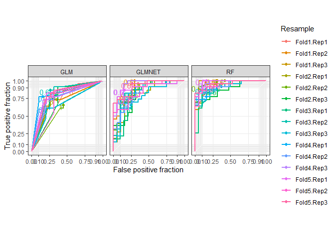<!-- -->

Now directly compare the resample averaged ROC curves for each of the
three models. As shown below, the random forest model performs better
(on average) compared to the elastic net and logistic regression models.

``` r
model_pred_results %>% 
  ggplot(mapping = aes(m = M,
                       d = ifelse(obs == "M",
                                  1, 
                                  0),
                       color = model_name)) +
  geom_roc(cutoffs.at = c(0.25, 0.5, 0.75)) +
  coord_equal() +
  style_roc()
```

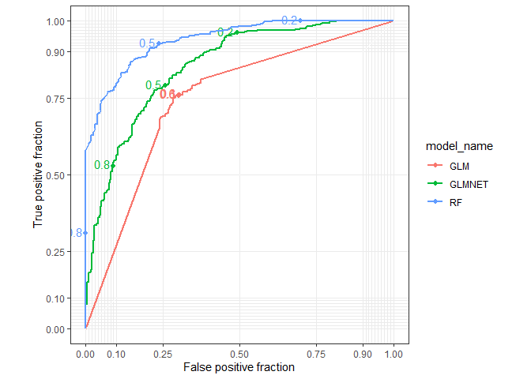<!-- -->

To see the standard error on the area under the ROC curve, we must first
compile the results using the `resamples()` function. We can then use
the `dotplot()` function to visualize the average performance metric
value and the standard error on the estimate (based on the resample
results). Accounting for the repeated 5-fold cross-validation, the
random forest model is better than the other two.

``` r
model_results <- resamples(list(GLM = fit_glm,
                                GLMNET = fit_glmnet,
                                RF = fit_rf))


dotplot(model_results)
```

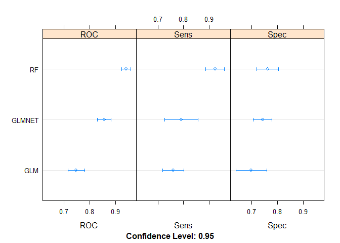<!-- -->

## Variable importances

The variable importance rankings from the random forest model are shown
below. It appears that a majority of the inputs are considered to be
less than half of the importance of the top ranked
input.

``` r
plot(varImp(fit_rf))
```

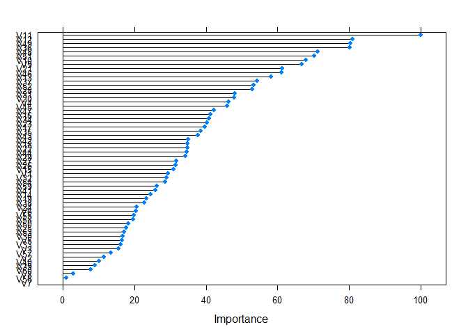<!-- -->

To confirm, let’s zoom in on just the top 15 variables. As you can see
below, the 15th ranked variable, `V31` is just under 50% the importance
of the top ranked variable `V11`. The 2nd through 4th ranked inputs
`V12`, `V49`, and `V36` are all roughly 80% of the importance of
`V11`.

``` r
plot(varImp(fit_rf), top = 15)
```

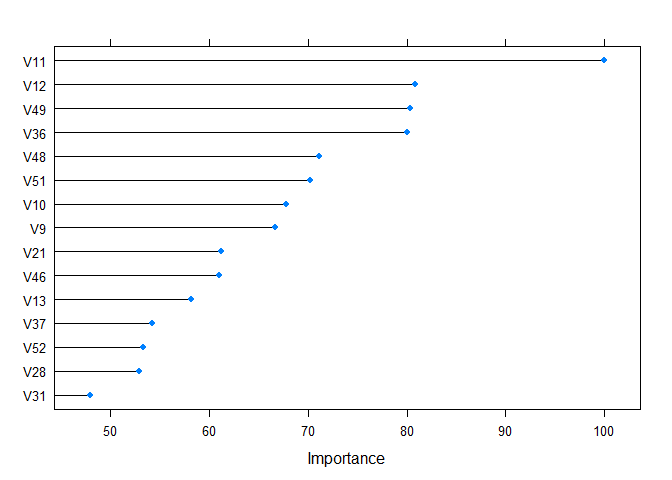<!-- -->

Extract the names of the top 4 ranked inputs.

``` r
top_4_inputs <- (varImp(fit_rf))$importance %>% 
  tibble::rownames_to_column("var_name") %>% 
  arrange(desc(M)) %>% 
  slice(1:4) %>% 
  pull(var_name)
```

## Predictions

### Create test grid

Let’s use predictions to try and understand the relationships between
the `Class` and the inputs. Because there are so many inputs to this
problem, we will focus on the top 4 ranked inputs, from the random
forest model. We will create a test grid to study the behavior of the
predicted `Class` response with respect to V11 and V12, at several
combinations of V49 and V36.

We have used the `expand.grid()` function throughout the semester to
create full-factorial grids. However, we will use a slight change in
syntax for this example, compared to the syntax used throughout the
semester. The usual syntax is shown below, where we name each variable
in the `expand.grid()` call:

``` r
expand.grid(x1 = 1:4,
            x2 = 1:2,
            x3 = 1:3)
```

The “usual” syntax works well for situations with just a few variables.
However, in this problem, we have 60 inputs we need to set. We will
therefore pass in a list as the input argument to the `expand.grid()`
function. The syntax allows for the elements of the list to be named or
un-named. Following the same naming convention as the previous code
chunk, the `expand.grid()` call with a named list is:

``` r
expand.grid(list(x1 = 1:4,
                 x2 = 1:2,
                 x3 = 1:3))
```

The syntax for an un-named list is:

``` r
expand.grid(list(1:4,
                 1:2,
                 1:3))
```

This format allows us to operate more programmatically compared to
typing each variable directly within the `expand.grid()` function call.
Programmatic operation is useful in this example because we must set all
60 inputs even if we only want to focus on the influence of a few. As
mentioned, we will explicitely focus on the top 4 ranked inputs. The
other 56 inputs will be set at their corresponding medians from the
training set. For the top 4 inputs, V11 and V12 will have 25 evenly
spaced values between their training set min and max values. V49 and V36
will use their 5th, 25th, 50th, 75th, and 95th quantiles.

The code chunk below defines a function which calculates the unique
values for each input based on the input’s name. As mentioned, if the
variable is not one of the top 4 ranked inputs, the variable is set to
its median.

``` r
make_input_grid <- function(var_name, top_input_names, all_data)
{
  xvar <- all_data %>% select(var_name) %>% pull()
  
  if (var_name %in% top_input_names[1:2]){
    # use 25 unique values
    xgrid <- seq(min(xvar), max(xvar), length.out = 25)
    
  } else if (var_name %in% top_input_names[3:4]){
    # use specific quantiles
    xgrid <- quantile(xvar, 
                      probs = c(0.05, 0.25, 0.5, 0.75, 0.95),
                      na.rm = TRUE)
    xgrid <- as.vector(xgrid)
  } else {
    # set to median
    xgrid <- median(xvar, na.rm = TRUE)
  }
  
  return(xgrid)
}

all_input_names <- Sonar %>% 
  select(-Class) %>% 
  names()

### create the list of the inputs 
test_input_list <- purrr::map(all_input_names,
                              make_input_grid,
                              top_input_names = top_4_inputs,
                              all_data = Sonar)

### use the list of inputs to create the prediction grid
test_input_grid <- expand.grid(test_input_list,
                               KEEP.OUT.ATTRS = FALSE,
                               stringsAsFactors = FALSE) %>% 
  purrr::set_names(all_input_names)
```

Check that the top 4 ranked inputs have the correct number of unique
values. The code chunk below reshapes the `test_input_grid` into
long-format, and performs some grouping and summarizing operations. It
also performs an operation to extract the input ID number associated
with each variable. The number of unique values per input are displayed
by a bar graph. Notice that almost all inputs have 1 unique value. V11
and V12 have 25 unique values each, while V49 and V36 have 5 unique
values each. It’s ok if you don’t understand the full details of
creating the figure below. It is used to show the number of unique
values in a simple figure compared to displaying a large table.

``` r
test_input_grid %>% 
  tibble::rowid_to_column("pred_id") %>% 
  tidyr::gather(key = "key", value = "value", -pred_id) %>% 
  group_by(key) %>% 
  summarise(num_rows = n(),
            num_unique = n_distinct(value)) %>% 
  ungroup() %>% 
  mutate(input_id = as.numeric(stringr::str_extract(key, "\\d+"))) %>% 
  ggplot(mapping = aes(x = input_id,
                       y = num_unique)) +
  geom_bar(stat = "identity",
           mapping = aes(group = input_id)) +
  theme_bw()
```

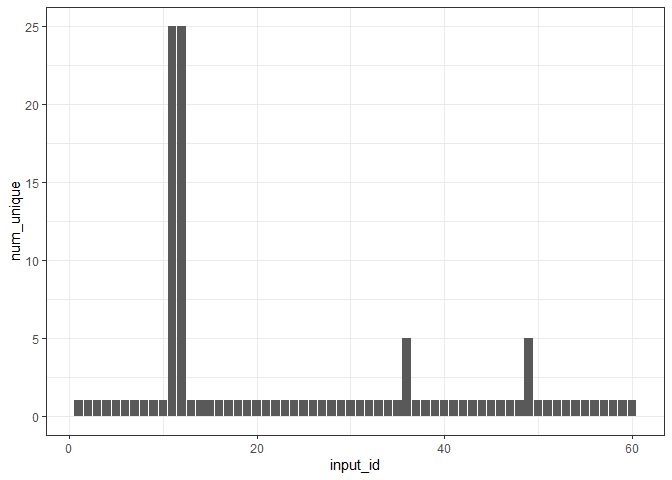<!-- -->

### Make predictions

With the test input grid created, it’s quite simple to make predictions
with the models. The basic syntax is:

`predict(<model object>, <new data set>)`

If we were working with a regression problem (a continuous response),
calling the `predict()` function would produce a vector of values for
the response. The length would equal the number of rows in the new data
set. However, with classification problems, there are two ways to make
predictions. The default approach is for the `predict()` function to
return the predicted class. For our `Sonar` example, that would mean the
prediction returns either `"M"` or `"R"`. The second approach is to
return the predicted probability per class. To return the class
probabilities the `type` argument must be set to `"prob"` within the
`predict()` function call.

Let’s see how this works, by first predicting the class directly. The
code chunk below makes predictions with the random forest model. The
first 6 elements of the returned vector, `pred_test_class_rf`, are
printed to screen to show that the result is a discrete factor
consisting of two levels.

``` r
pred_test_class_rf <- predict(fit_rf, test_input_grid)

pred_test_class_rf %>% head()
```

    ## [1] R R R R R R
    ## Levels: M R

Before predicting the class probabilities, let’s visualize the class
predictions with respect to the top 4 inputs we varied within the
`test_input_grid`. The code chunk below colors each combination of the
V11 and V12 based on the predicted class. Each facet (subplot)
corresponds to a specific combination of the V49 and V36 inputs. The
`V49` variable is modified slightly to help ensure the vertical facets
have decreasing values of `V49` top to bottom.

As shown below, the combination of `V49` and `V36` has a substantial
impact on the “size of the area” associated with `"M"` within the V11
and V12 space. When both `V49` and `V36` are low values (the upper left
hand plot), no combinations of V11 and V12 are associated with the `"R"`
class, when all other inputs are set to their median values. **Can you
interpret the figure below? Which values of `V36` and `V49` “allow”
combinations of `V11` and `V12` to be associated with the `"M"` class?**

``` r
test_input_grid %>% 
  mutate(pred_class = pred_test_class_rf) %>% 
  mutate(view_v49 = forcats::fct_rev(sprintf("V49:%1.3f", V49))) %>% 
  ggplot(mapping = aes(x = V11, y = V12)) +
  geom_raster(mapping = aes(fill = pred_class)) +
  facet_grid(view_v49 ~ V36, 
             labeller = label_bquote(rows = .(view_v49),
                                     cols = .(sprintf("V36:%1.3f", V36)))) +
  scale_fill_brewer("pred\nclass", palette = "Set1") +
  theme_bw()
```

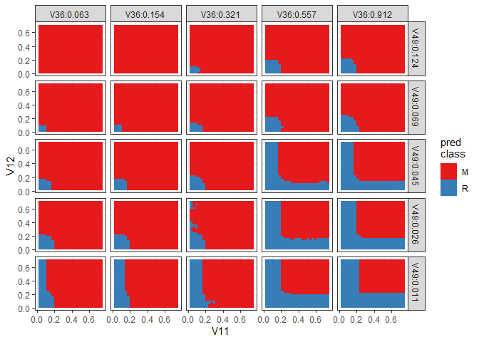<!-- -->

Let’s now predict the probability associated with each class. The code
chunk below modifies the `predict()` function call by setting the `type`
argument equal to `"prob"`. The data type and the first 6 rows are
printed to screen. As shown below, the result is a `data.frame` rather
than a vector. Each column in the `data.frame` has a name which
corresponds to one of the two levels assocaited with the `Class`
variable from the `Sonar` data set. The format is consistent with the
`fit_rf$pred` object that we previously worked with to create the ROC
curves.

``` r
pred_test_prob_rf <- predict(fit_rf, test_input_grid, type = "prob")

pred_test_prob_rf %>% class()
```

    ## [1] "data.frame"

``` r
pred_test_prob_rf %>% head()
```

    ##       M     R
    ## 1 0.406 0.594
    ## 2 0.408 0.592
    ## 3 0.408 0.592
    ## 4 0.418 0.582
    ## 5 0.426 0.574
    ## 6 0.460 0.540

The code chunk below visualizes the predicted probability of the `"M"`
class with respect to the top 4 inputs. The overall format of the figure
is consistent with the one that visualized the predicted class with
respect to the top 4 inputs. However, in the resulting figure below, the
fill corresponds to the predicted probability of `"M"`. The previous
figure showing the predicted class seems quite different across the
different facets, but the figure below reveals the “structure” or
relationship with respect to `V11` and `V12` is consistent across the
facets. The lower left corner of each facet has the lowest probability
of `"M"`. Visually there are almost four rectangles per facet, the lower
left with the lowest probability. A vertical rectangle with lower
probability at low `V11`, a horizontal rectangle with lower probability
at low `V12`, and finally a large rectangle with higher probability of
`"M"` at higher values of both inputs. The “shapes” of these four
rectangles do not seem to vary all that much across facets, but the
“fill magnitude” or “average color” of each facet changes as `V36` and
`V49` change. Essentially the third and fourth ranked inputs “step up”
or “step down” the predicted probability of `"M"` for a given set of
`V11` and `V12` values.

``` r
test_input_grid %>% 
  bind_cols(pred_test_prob_rf) %>% 
  mutate(view_v49 = forcats::fct_rev(sprintf("V49:%1.3f", V49))) %>% 
  ggplot(mapping = aes(x = V11, y = V12)) +
  geom_raster(mapping = aes(fill = M)) +
  facet_grid(view_v49 ~ V36, 
             labeller = label_bquote(rows = .(view_v49),
                                     cols = .(sprintf("V36:%1.3f", V36)))) +
  scale_fill_viridis_c(option = "magma", limits = c(0, 1)) +
  theme_bw()
```

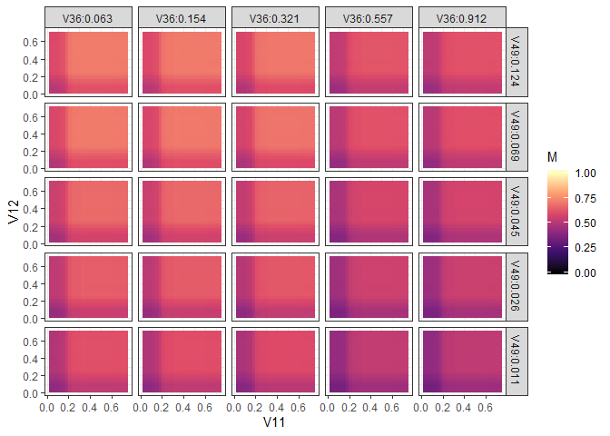<!-- -->

As a comparison, let’s also predict the probability of each class with
the elastic net model. The code chunk below makes the predictions by
calling `predict()` for the `fit_glmnet` object and then creates a
visualization similar to the one created from the random forest model
predictions. The predicted `"M"` probability surfaces with respect to
`V11` and `V12` at several combinations of `V49` and `V36` are shown
below. **What are the similarities and differences with the random
forest model predictions? Why do you think those differences
exist?**

``` r
pred_test_prob_glmnet <- predict(fit_glmnet, test_input_grid, type = "prob")

test_input_grid %>% 
  bind_cols(pred_test_prob_glmnet) %>% 
  mutate(view_v49 = forcats::fct_rev(sprintf("V49:%1.3f", V49))) %>% 
  ggplot(mapping = aes(x = V11, y = V12)) +
  geom_raster(mapping = aes(fill = M)) +
  facet_grid(view_v49 ~ V36, 
             labeller = label_bquote(rows = .(view_v49),
                                     cols = .(sprintf("V36:%1.3f", V36)))) +
  scale_fill_viridis_c(option = "magma", limits = c(0, 1)) +
  theme_bw()
```

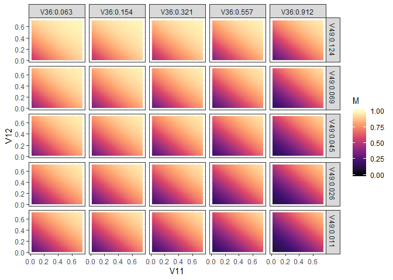<!-- -->
